# 笔记评论系统

<cite>
**本文档引用的文件**
- [memo_service.proto](file://proto/api/v1/memo_service.proto)
- [memo_service.go](file://server/router/api/v1/memo_service.go)
- [memo_relation.go](file://store/memo_relation.go)
- [postgres/memo_relation.go](file://store/db/postgres/memo_relation.go)
- [memo.go](file://store/db/sqlite/memo.go)
- [activity.go](file://store/activity.go)
- [inbox.go](file://store/inbox.go)
- [tiered.go](file://store/cache/tiered.go)
- [cache.go](file://store/cache/cache.go)
- [apiv1connect/memo_service.connect.go](file://proto/gen/api/v1/apiv1connect/memo_service.connect.go)
- [memo_service_grpc.pb.go](file://proto/gen/api/v1/memo_service_grpc.pb.go)
- [Inboxes.tsx](file://web/src/pages/Inboxes.tsx)
- [RelationCard.tsx](file://web/src/components/MemoView/components/metadata/RelationCard.tsx)
- [RelationList.tsx](file://web/src/components/MemoEditor/components/RelationList.tsx)
- [MemoRelationForceGraph.tsx](file://web/src/components/MemoRelationForceGraph/MemoRelationForceGraph.tsx)
- [utils.ts](file://web/src/components/MemoRelationForceGraph/utils.ts)
</cite>

## 目录
1. [简介](#简介)
2. [项目结构](#项目结构)
3. [核心组件](#核心组件)
4. [架构概览](#架构概览)
5. [详细组件分析](#详细组件分析)
6. [依赖关系分析](#依赖关系分析)
7. [性能考虑](#性能考虑)
8. [故障排除指南](#故障排除指南)
9. [结论](#结论)
10. [附录](#附录)

## 简介

笔记评论系统是 Memos 平台中的一个核心功能模块，它实现了基于笔记的评论机制。该系统将评论作为一种特殊的笔记类型进行处理，通过关系表来维护评论与父笔记之间的父子关系。

本系统的主要特点包括：
- 评论作为特殊类型的笔记进行存储和管理
- 基于关系表的层级结构设计
- 完整的权限控制和可见性管理
- 实时通知和活动流集成
- 支持分页和排序的列表查询
- 安全的内容检查和审核流程

## 项目结构

笔记评论系统涉及多个层次的组件协作：

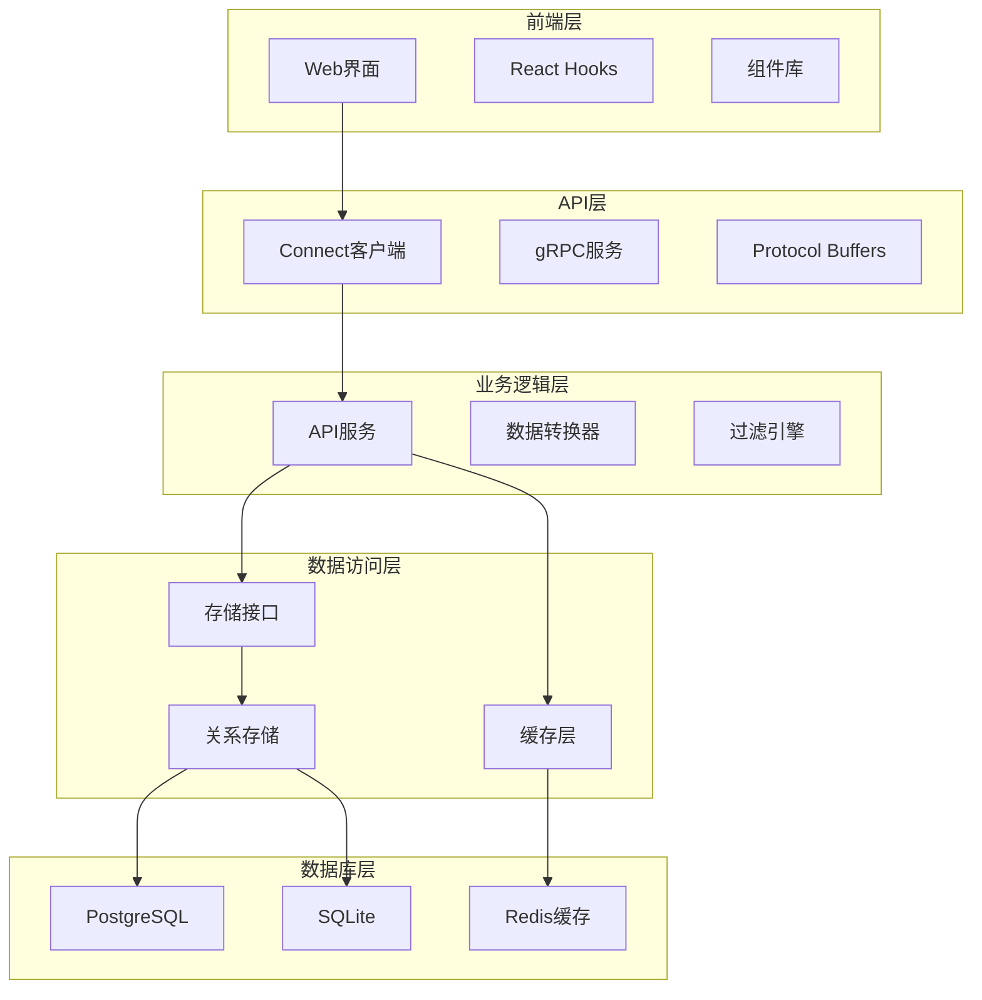

**图表来源**
- [memo_service.go](file://server/router/api/v1/memo_service.go#L546-L709)
- [memo_relation.go](file://store/memo_relation.go#L1-L46)
- [tiered.go](file://store/cache/tiered.go#L17-L35)

**章节来源**
- [memo_service.proto](file://proto/api/v1/memo_service.proto#L17-L106)
- [memo_service.go](file://server/router/api/v1/memo_service.go#L546-L709)

## 核心组件

### 1. API 接口定义

系统提供了两个核心的评论相关 API：

#### CreateMemoComment
- **HTTP 方法**: POST
- **路径**: `/api/v1/{name=memos/*}/comments`
- **功能**: 为指定笔记创建评论
- **参数**: 
  - `name`: 目标笔记的资源名称
  - `comment`: 评论内容（Memo 对象）
  - `comment_id`: 可选的评论 ID

#### ListMemoComments  
- **HTTP 方法**: GET
- **路径**: `/api/v1/{name=memos/*}/comments`
- **功能**: 列出指定笔记的所有评论
- **参数**:
  - `name`: 目标笔记的资源名称
  - `page_size`: 分页大小（可选）
  - `page_token`: 分页令牌（可选）
  - `order_by`: 排序规则（可选）

### 2. 数据模型

评论系统使用统一的 Memo 模型来表示评论：

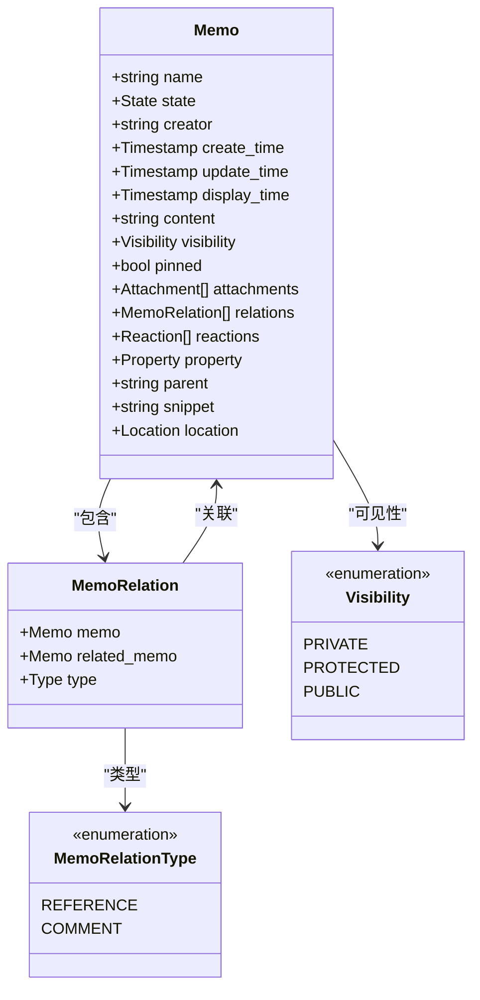

**图表来源**
- [memo_service.proto](file://proto/api/v1/memo_service.proto#L153-L231)
- [memo_service.proto](file://proto/api/v1/memo_service.proto#L358-L385)
- [memo_service.proto](file://proto/api/v1/memo_service.proto#L108-L113)

**章节来源**
- [memo_service.proto](file://proto/api/v1/memo_service.proto#L422-L464)
- [memo_service.proto](file://proto/api/v1/memo_service.proto#L153-L231)

## 架构概览

### 系统架构图

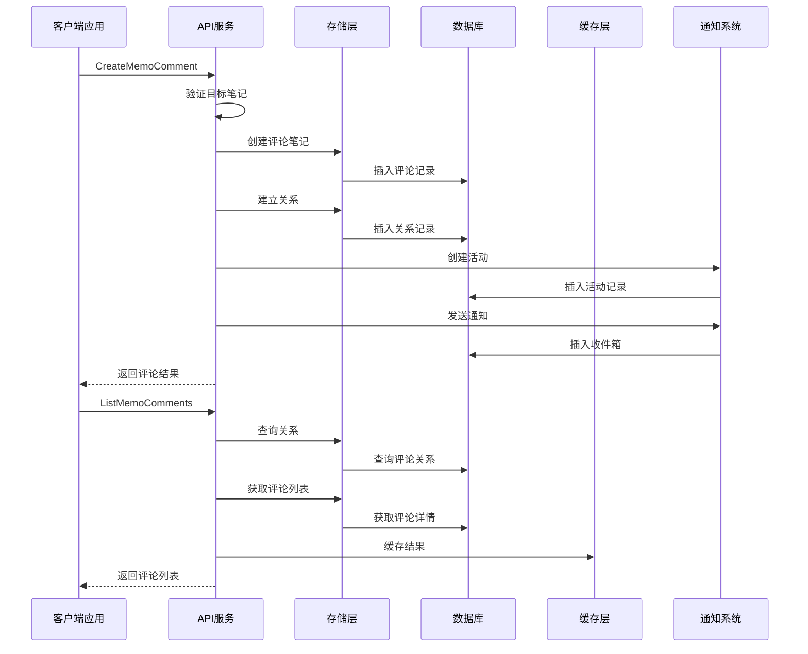

**图表来源**
- [memo_service.go](file://server/router/api/v1/memo_service.go#L546-L615)
- [memo_service.go](file://server/router/api/v1/memo_service.go#L617-L709)

### 数据流图

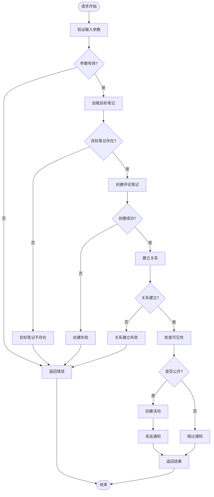

**图表来源**
- [memo_service.go](file://server/router/api/v1/memo_service.go#L546-L615)

## 详细组件分析

### 1. CreateMemoComment 接口实现

#### 请求处理流程

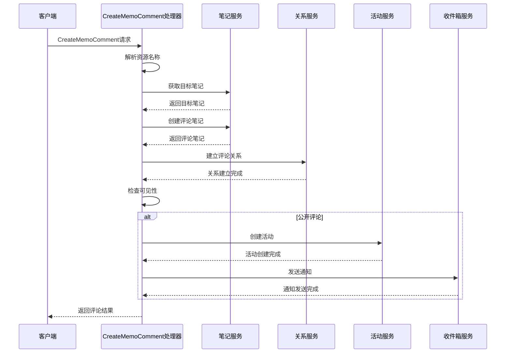

**图表来源**
- [memo_service.go](file://server/router/api/v1/memo_service.go#L546-L615)

#### 关键实现细节

1. **参数验证**: 验证目标笔记的资源名称格式
2. **笔记创建**: 使用现有的 CreateMemo 流程创建评论
3. **关系建立**: 在 memo_relation 表中创建 COMMENT 类型的关系
4. **权限检查**: 根据评论可见性和创建者身份决定是否发送通知
5. **通知机制**: 仅对非私有评论且非创建者本人的场景发送通知

**章节来源**
- [memo_service.go](file://server/router/api/v1/memo_service.go#L546-L615)

### 2. ListMemoComments 接口实现

#### 查询流程

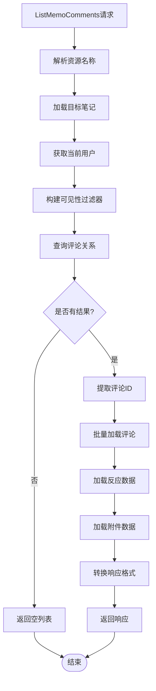

**图表来源**
- [memo_service.go](file://server/router/api/v1/memo_service.go#L617-L709)

#### 性能优化策略

1. **批量查询**: 使用 ID 列表一次性获取所有相关数据
2. **内存映射**: 通过映射表快速查找关联数据
3. **条件过滤**: 基于用户权限动态构建查询条件
4. **延迟加载**: 仅在需要时加载反应和附件数据

**章节来源**
- [memo_service.go](file://server/router/api/v1/memo_service.go#L617-L709)

### 3. 关系管理系统

#### 关系类型定义

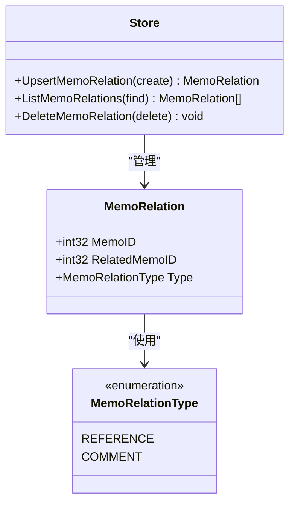

**图表来源**
- [memo_relation.go](file://store/memo_relation.go#L16-L20)
- [memo_relation.go](file://store/memo_relation.go#L9-L14)

#### 数据库实现

PostgreSQL 和 SQLite 提供了相同的关系操作接口：

| 操作 | PostgreSQL实现 | SQLite实现 |
|------|----------------|------------|
| UpsertMemoRelation | 使用ON CONFLICT更新 | 使用REPLACE语句 |
| ListMemoRelations | 参数化查询支持 | 参数化查询支持 |
| DeleteMemoRelation | DELETE语句 | DELETE语句 |

**章节来源**
- [memo_relation.go](file://store/memo_relation.go#L35-L45)
- [postgres/memo_relation.go](file://store/db/postgres/memo_relation.go#L12-L39)

### 4. 通知和活动系统

#### 通知流程

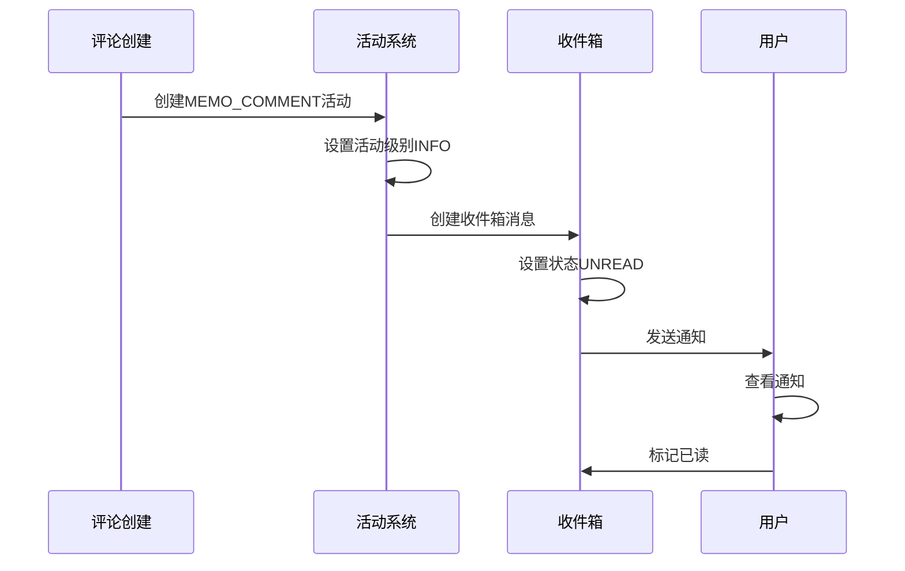

**图表来源**
- [memo_service.go](file://server/router/api/v1/memo_service.go#L587-L612)
- [activity.go](file://store/activity.go#L11-L13)
- [inbox.go](file://store/inbox.go#L12-L17)

**章节来源**
- [memo_service.go](file://server/router/api/v1/memo_service.go#L587-L612)
- [activity.go](file://store/activity.go#L29-L40)
- [inbox.go](file://store/inbox.go#L25-L32)

## 依赖关系分析

### 组件依赖图

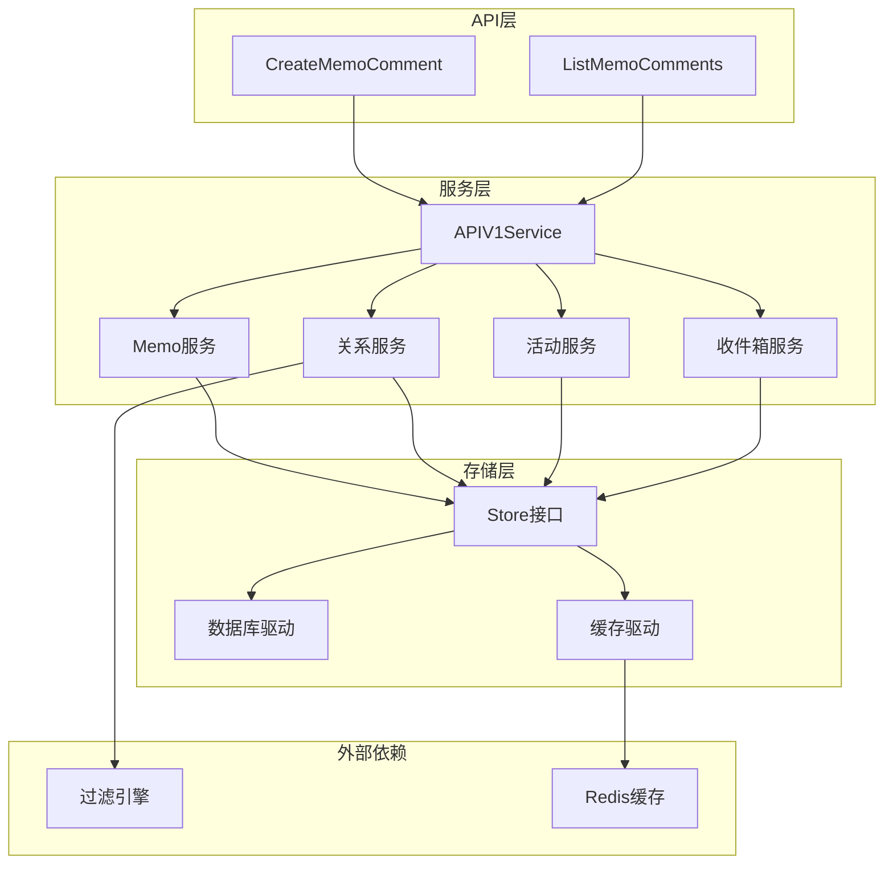

**图表来源**
- [memo_service.go](file://server/router/api/v1/memo_service.go#L546-L709)
- [tiered.go](file://store/cache/tiered.go#L17-L35)

### 外部接口依赖

| 接口 | 用途 | 版本 |
|------|------|------|
| Connect | gRPC-Web 客户端 | v1 |
| gRPC | 传统 gRPC 通信 | v1 |
| Protocol Buffers | 数据序列化 | v3 |
| React Query | 前端数据获取 | 最新版本 |

**章节来源**
- [apiv1connect/memo_service.connect.go](file://proto/gen/api/v1/apiv1connect/memo_service.connect.go#L95-L100)
- [memo_service_grpc.pb.go](file://proto/gen/api/v1/memo_service_grpc.pb.go#L171-L189)

## 性能考虑

### 缓存策略

系统采用了三层缓存架构来优化性能：

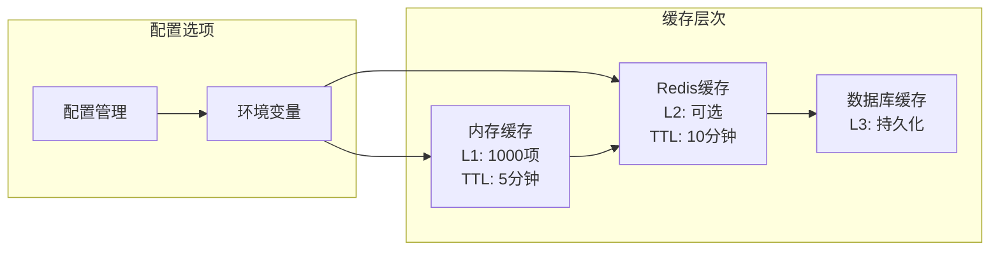

**图表来源**
- [tiered.go](file://store/cache/tiered.go#L17-L35)

#### 缓存配置

| 层级 | 默认设置 | 启用条件 |
|------|----------|----------|
| L1 内存缓存 | 1000项，5分钟TTL | 始终启用 |
| L2 Redis缓存 | 10分钟TTL | 设置MEMOS_CACHE_REDIS_ADDR |
| L3 数据库缓存 | 持久化 | 自动启用 |

#### 性能优化技术

1. **批量操作**: 批量加载评论及其关联数据
2. **条件查询**: 基于用户权限动态构建查询条件
3. **延迟加载**: 仅在需要时加载额外数据
4. **缓存预热**: 预先加载常用数据到缓存

### 查询优化

#### 分页查询优化

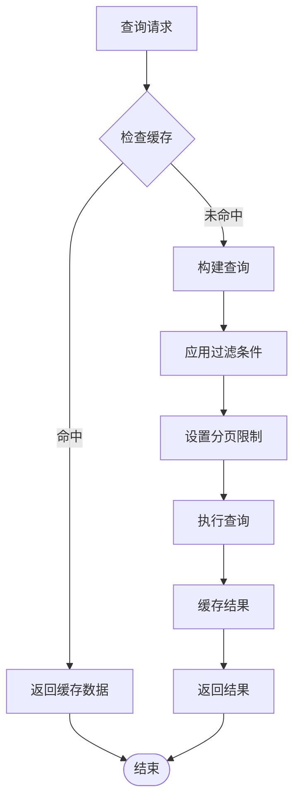

**图表来源**
- [memo_service.go](file://server/router/api/v1/memo_service.go#L617-L709)

**章节来源**
- [tiered.go](file://store/cache/tiered.go#L41-L47)
- [cache.go](file://store/cache/cache.go#L56-L64)

## 故障排除指南

### 常见问题及解决方案

#### 1. 评论无法显示

**症状**: ListMemoComments 返回空列表

**可能原因**:
- 用户权限不足
- 评论被删除或归档
- 过滤条件过于严格

**解决步骤**:
1. 检查用户登录状态
2. 验证目标笔记是否存在
3. 调整过滤条件参数
4. 检查缓存状态

#### 2. 评论创建失败

**症状**: CreateMemoComment 返回错误

**可能原因**:
- 目标笔记不存在
- 权限验证失败
- 数据库连接异常

**解决步骤**:
1. 验证资源名称格式
2. 检查用户权限
3. 查看服务器日志
4. 重试请求

#### 3. 通知未送达

**症状**: 评论后未收到通知

**可能原因**:
- 评论为私有
- 评论创建者本人
- 通知系统故障

**解决步骤**:
1. 检查评论可见性设置
2. 验证收件箱状态
3. 查看活动日志
4. 重启通知服务

### 调试工具

#### 前端调试

```typescript
// 在浏览器控制台中检查
console.log('评论列表:', comments);
console.log('请求参数:', params);
console.log('响应状态:', response.status);

// 检查网络请求
fetch('/api/v1/memos/note-123/comments')
  .then(response => response.json())
  .then(data => console.log('评论数据:', data));
```

#### 后端调试

```go
// 在服务端添加日志
logger.Info("CreateMemoComment called", 
    "memoID", memoID,
    "commentContent", commentContent,
    "userID", userID)

// 检查数据库状态
db.Query("SELECT COUNT(*) FROM memo_relation WHERE type='COMMENT'")
```

**章节来源**
- [Inboxes.tsx](file://web/src/pages/Inboxes.tsx#L14-L122)
- [memo_service.go](file://server/router/api/v1/memo_service.go#L546-L615)

## 结论

笔记评论系统通过将评论作为特殊类型的笔记进行处理，实现了灵活而强大的评论功能。系统的关键优势包括：

1. **统一的数据模型**: 使用相同的 Memo 模型处理评论和普通笔记
2. **清晰的关系管理**: 通过关系表明确评论与父笔记的父子关系
3. **完善的权限控制**: 支持私有、保护和公开三种可见性级别
4. **实时通知机制**: 自动化的活动流和收件箱通知
5. **高性能设计**: 多层缓存和批量查询优化
6. **可扩展架构**: 模块化的组件设计便于功能扩展

该系统为 Memos 平台提供了坚实的社区互动基础，支持丰富的用户生成内容场景。

## 附录

### API 使用示例

#### 创建评论

```javascript
// JavaScript 示例
const response = await fetch('/api/v1/memos/note-123/comments', {
  method: 'POST',
  headers: {
    'Content-Type': 'application/json',
  },
  body: JSON.stringify({
    comment: {
      content: '这是一个很好的评论！',
      visibility: 'PUBLIC'
    }
  })
});

const comment = await response.json();
console.log('评论ID:', comment.name);
```

#### 获取评论列表

```javascript
// 获取前10条评论
const response = await fetch('/api/v1/memos/note-123/comments?page_size=10');
const comments = await response.json();
console.log('评论数量:', comments.memos.length);
```

### 社区互动最佳实践

1. **内容质量**: 鼓励高质量、有建设性的评论
2. **尊重他人**: 维护友善的讨论环境
3. **适度参与**: 避免刷屏和重复评论
4. **标签使用**: 合理使用标签组织讨论
5. **隐私保护**: 注意评论内容的隐私性

### 安全检查和审核流程

系统内置了多重安全检查机制：

1. **内容长度限制**: 通过实例设置控制评论长度
2. **可见性控制**: 私有评论不触发通知
3. **权限验证**: 确保只有授权用户可以查看评论
4. **活动审计**: 记录所有评论相关的活动

**章节来源**
- [memo_service.go](file://server/router/api/v1/memo_service.go#L711-L717)
- [memo_service.proto](file://proto/api/v1/memo_service.proto#L422-L464)