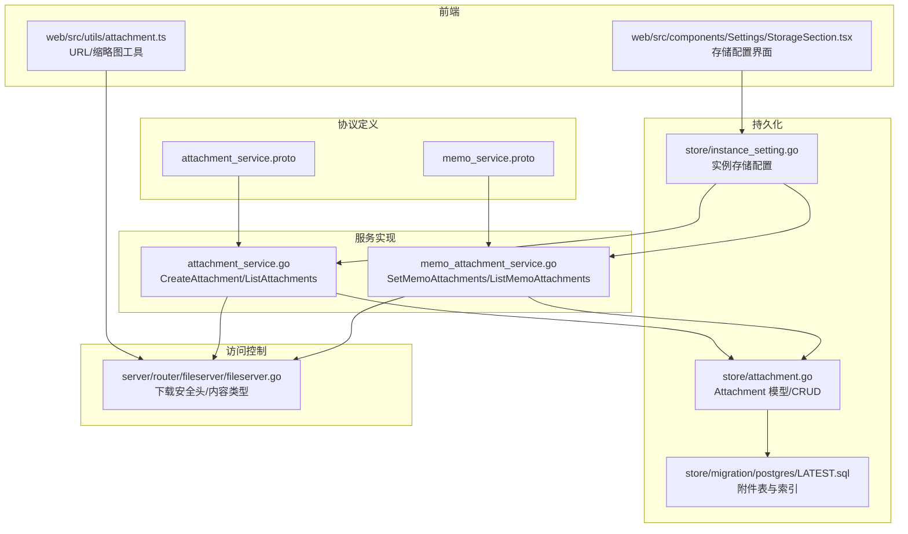
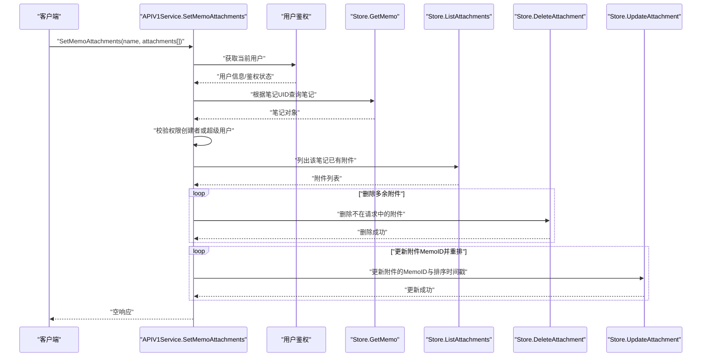
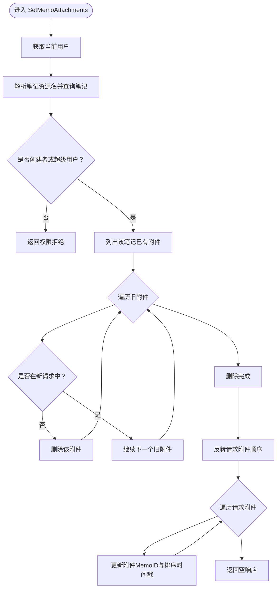
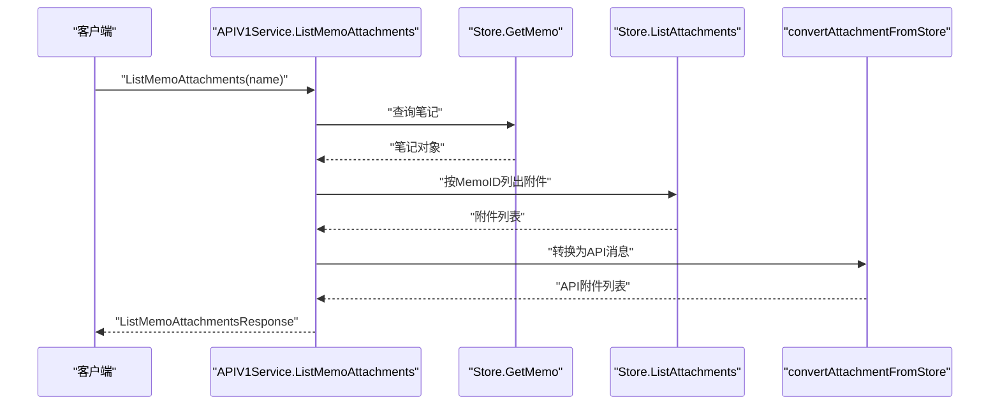
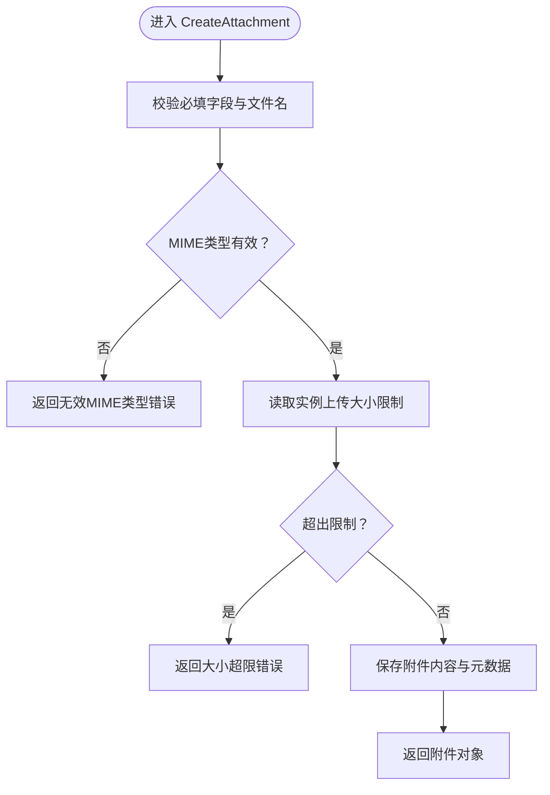
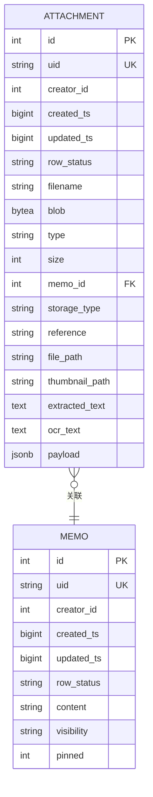
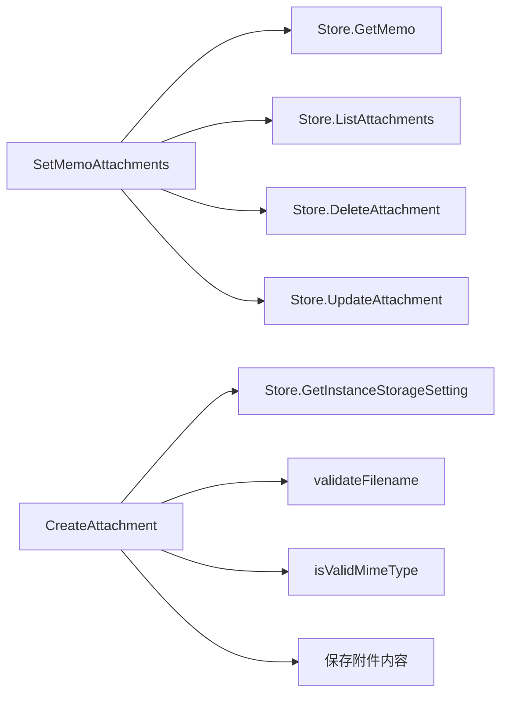

# 笔记附件管理

<cite>
**本文引用的文件**
- [memo_service.proto](file://proto/api/v1/memo_service.proto)
- [attachment_service.proto](file://proto/api/v1/attachment_service.proto)
- [memo_attachment_service.go](file://server/router/api/v1/memo_attachment_service.go)
- [attachment_service.go](file://server/router/api/v1/attachment_service.go)
- [attachment.go](file://store/attachment.go)
- [instance_setting.go](file://store/instance_setting.go)
- [fileserver.go](file://server/router/fileserver/fileserver.go)
- [LATEST.sql](file://store/migration/postgres/LATEST.sql)
- [StorageSection.tsx](file://web/src/components/Settings/StorageSection.tsx)
- [attachment.ts](file://web/src/utils/attachment.ts)
- [memo_service.go](file://server/router/api/v1/memo_service.go)
</cite>

## 目录
1. [简介](#简介)
2. [项目结构](#项目结构)
3. [核心组件](#核心组件)
4. [架构总览](#架构总览)
5. [详细组件分析](#详细组件分析)
6. [依赖关系分析](#依赖关系分析)
7. [性能考虑](#性能考虑)
8. [故障排查指南](#故障排查指南)
9. [结论](#结论)
10. [附录](#附录)

## 简介
本文件为“笔记附件管理”的综合 API 文档，聚焦以下两个接口：
- SetMemoAttachments：为指定笔记设置附件列表，实现附件与笔记的关联、替换与排序。
- ListMemoAttachments：查询某笔记当前已关联的附件列表。

文档覆盖附件上传、关联、查询的完整流程；文档化附件类型、存储策略与访问控制机制；说明附件与笔记的关系建立与维护；包含附件大小限制、格式验证与安全检查的实现细节；提供性能优化建议与最佳实践，并给出接口调用示例与错误处理方案。

## 项目结构
围绕附件管理的关键模块包括：
- 协议定义层：memo_service.proto 与 attachment_service.proto 定义了 SetMemoAttachments、ListMemoAttachments 及附件相关消息体。
- 服务实现层：server/router/api/v1 下的 memo_attachment_service.go 与 attachment_service.go 实现了业务逻辑。
- 持久化层：store/attachment.go 定义附件数据模型与 CRUD；store/instance_setting.go 提供实例存储配置；数据库迁移脚本定义表结构与索引。
- 访问控制与下载：server/router/fileserver/fileserver.go 控制附件下载的安全头与内容类型。
- 前端集成：web/src/utils/attachment.ts 提供附件 URL 与缩略图 URL 的拼装；web/src/components/Settings/StorageSection.tsx 提供系统存储配置界面。

**图表来源**
- [memo_service.proto](file://proto/api/v1/memo_service.proto#L49-L61)
- [attachment_service.proto](file://proto/api/v1/attachment_service.proto#L15-L46)
- [memo_attachment_service.go](file://server/router/api/v1/memo_attachment_service.go#L16-L115)
- [attachment_service.go](file://server/router/api/v1/attachment_service.go#L57-L160)
- [attachment.go](file://store/attachment.go#L15-L106)
- [instance_setting.go](file://store/instance_setting.go#L181-L207)
- [LATEST.sql](file://store/migration/postgres/LATEST.sql#L59-L86)
- [fileserver.go](file://server/router/fileserver/fileserver.go#L117-L151)
- [attachment.ts](file://web/src/utils/attachment.ts#L3-L13)
- [StorageSection.tsx](file://web/src/components/Settings/StorageSection.tsx#L31-L211)

**章节来源**
- [memo_service.proto](file://proto/api/v1/memo_service.proto#L49-L61)
- [attachment_service.proto](file://proto/api/v1/attachment_service.proto#L15-L46)
- [memo_attachment_service.go](file://server/router/api/v1/memo_attachment_service.go#L16-L115)
- [attachment_service.go](file://server/router/api/v1/attachment_service.go#L57-L160)
- [attachment.go](file://store/attachment.go#L15-L106)
- [instance_setting.go](file://store/instance_setting.go#L181-L207)
- [LATEST.sql](file://store/migration/postgres/LATEST.sql#L59-L86)
- [fileserver.go](file://server/router/fileserver/fileserver.go#L117-L151)
- [attachment.ts](file://web/src/utils/attachment.ts#L3-L13)
- [StorageSection.tsx](file://web/src/components/Settings/StorageSection.tsx#L31-L211)

## 核心组件
- SetMemoAttachments
  - 功能：为指定笔记设置附件集合，支持删除多余附件、更新现有附件的 MemoID 并按请求顺序调整排序。
  - 权限：仅笔记创建者或超级用户可操作。
  - 输入：笔记资源名与附件列表（每项含附件资源名）。
  - 输出：空响应。
- ListMemoAttachments
  - 功能：列出某笔记当前已关联的附件。
  - 输入：笔记资源名。
  - 输出：附件列表与下一页令牌。
- CreateAttachment（补充）
  - 功能：创建附件，支持文件名、MIME 类型、内容等校验与存储策略选择。
  - 输入：附件对象（可选外部链接）。
  - 输出：创建后的附件对象。
- ListAttachments（补充）
  - 功能：按过滤条件与分页列出附件。
  - 输入：分页参数与过滤表达式。
  - 输出：附件列表、总数与下一页令牌。

**章节来源**
- [memo_service.proto](file://proto/api/v1/memo_service.proto#L49-L61)
- [memo_attachment_service.go](file://server/router/api/v1/memo_attachment_service.go#L16-L115)
- [attachment_service.proto](file://proto/api/v1/attachment_service.proto#L15-L46)
- [attachment_service.go](file://server/router/api/v1/attachment_service.go#L57-L160)

## 架构总览
下面以序列图展示 SetMemoAttachments 的典型调用链路，从客户端到服务端、存储与配置的交互。

**图表来源**
- [memo_attachment_service.go](file://server/router/api/v1/memo_attachment_service.go#L16-L90)

**章节来源**
- [memo_attachment_service.go](file://server/router/api/v1/memo_attachment_service.go#L16-L90)

## 详细组件分析

### SetMemoAttachments 接口
- 资源名解析：从请求中解析笔记资源名，提取 UID 并查询笔记。
- 权限校验：仅笔记创建者或超级用户允许修改附件。
- 附件同步：
  - 列出笔记当前附件；
  - 对于不在请求中的附件执行删除；
  - 对请求中的附件逐个更新 MemoID，并通过递增时间戳实现排序。
- 返回：空响应。

**图表来源**
- [memo_attachment_service.go](file://server/router/api/v1/memo_attachment_service.go#L16-L90)

**章节来源**
- [memo_attachment_service.go](file://server/router/api/v1/memo_attachment_service.go#L16-L90)

### ListMemoAttachments 接口
- 解析笔记资源名，查询笔记是否存在。
- 查询该笔记关联的所有附件。
- 将存储层的附件转换为 API 层消息并返回。

**图表来源**
- [memo_attachment_service.go](file://server/router/api/v1/memo_attachment_service.go#L91-L115)

**章节来源**
- [memo_attachment_service.go](file://server/router/api/v1/memo_attachment_service.go#L91-L115)

### 附件上传与存储策略
- CreateAttachment 流程要点：
  - 必填字段校验：附件对象、文件名、MIME 类型。
  - 文件名校验：禁止路径穿越、首尾空格或点、不允许斜杠。
  - MIME 类型校验：长度限制与格式正则匹配。
  - 大小限制：读取实例存储设置中的上传大小限制，若未配置则使用默认值。
  - 内容写入：根据存储类型（本地/数据库/S3）保存附件内容与元数据。
- 存储类型与模板：
  - 本地存储：基于模板替换 {filename}、{timestamp}、{year}/{month}/{day} 等占位符生成文件路径。
  - S3 存储：由实例设置中的 S3 配置决定（密钥、端点、区域、桶等）。
  - 默认策略：数据库存储（BLOB 字段）。
- 下载安全：
  - 设置 Content-Type 并对潜在危险类型强制为二进制流。
  - 设置安全头：X-Content-Type-Options、X-Frame-Options、CSP 等。

**图表来源**
- [attachment_service.go](file://server/router/api/v1/attachment_service.go#L57-L113)
- [attachment_service.go](file://server/router/api/v1/attachment_service.go#L415-L440)
- [instance_setting.go](file://store/instance_setting.go#L181-L207)
- [fileserver.go](file://server/router/fileserver/fileserver.go#L117-L151)

**章节来源**
- [attachment_service.go](file://server/router/api/v1/attachment_service.go#L57-L113)
- [attachment_service.go](file://server/router/api/v1/attachment_service.go#L415-L440)
- [instance_setting.go](file://store/instance_setting.go#L181-L207)
- [fileserver.go](file://server/router/fileserver/fileserver.go#L117-L151)

### 附件类型、访问控制与关系维护
- 附件类型与下载：
  - 优先使用附件的 MIME 类型；对文本类附加 UTF-8 字符集。
  - 对潜在危险类型（如 HTML、JS、SVG 等）强制为二进制流，防止 XSS。
- 关系维护：
  - 附件与笔记通过附件表的 MemoID 字段关联。
  - SetMemoAttachments 会清理不再出现在请求中的附件，确保关系一致性。
- 数据模型与索引：
  - 附件表包含 filename、type、size、memo_id、storage_type、reference、file_path、payload 等字段。
  - 为性能与全文检索建立索引（如 memo_id、type、全文向量索引）。

**图表来源**
- [LATEST.sql](file://store/migration/postgres/LATEST.sql#L59-L86)

**章节来源**
- [attachment.go](file://store/attachment.go#L15-L49)
- [LATEST.sql](file://store/migration/postgres/LATEST.sql#L59-L86)

### 前端集成与访问控制
- 附件 URL 与缩略图：
  - 若存在外部链接则直接使用；否则拼接 /file/{attachment.name}/{filename}。
  - 缩略图通过查询参数 ?thumbnail=true 获取。
- 存储配置界面：
  - 支持设置最大上传大小、文件路径模板、S3 凭据等。
- 下载安全：
  - 服务端设置安全响应头，避免 MIME 嗅探与嵌入风险。

**章节来源**
- [attachment.ts](file://web/src/utils/attachment.ts#L3-L13)
- [StorageSection.tsx](file://web/src/components/Settings/StorageSection.tsx#L31-L211)
- [fileserver.go](file://server/router/fileserver/fileserver.go#L117-L151)

## 依赖关系分析
- SetMemoAttachments 依赖：
  - 用户鉴权与笔记查询；
  - 附件列表、删除与更新；
  - 附件 UID 解析与排序时间戳生成。
- CreateAttachment 依赖：
  - 实例存储设置（上传大小限制、存储类型、S3 配置）；
  - 文件名校验与 MIME 类型校验；
  - 存储驱动（本地/数据库/S3）。

**图表来源**
- [memo_attachment_service.go](file://server/router/api/v1/memo_attachment_service.go#L16-L90)
- [attachment_service.go](file://server/router/api/v1/attachment_service.go#L57-L113)
- [instance_setting.go](file://store/instance_setting.go#L181-L207)

**章节来源**
- [memo_attachment_service.go](file://server/router/api/v1/memo_attachment_service.go#L16-L90)
- [attachment_service.go](file://server/router/api/v1/attachment_service.go#L57-L113)
- [instance_setting.go](file://store/instance_setting.go#L181-L207)

## 性能考虑
- 分页与默认限制：
  - 列表附件时默认限制数量，避免一次性加载过多数据。
- 索引优化：
  - 附件表对 memo_id、type 建有索引，提升按笔记与类型查询性能。
- 存储策略：
  - 大文件建议使用本地或 S3 存储，数据库存储适合小文件与低并发场景。
- 过滤与排序：
  - 使用过滤表达式与排序字段减少结果集大小，结合索引提升查询效率。
- 并发与幂等：
  - SetMemoAttachments 采用“先删后增”的方式，保证最终一致性；建议客户端在批量操作时合并请求以减少往返。

[本节为通用指导，无需列出具体文件来源]

## 故障排查指南
- 常见错误与定位
  - 未认证：返回未认证错误，确认鉴权头与登录状态。
  - 权限不足：非笔记创建者且非超级用户，返回权限拒绝。
  - 资源不存在：笔记或附件不存在，检查资源名格式与 UID。
  - 参数非法：文件名包含路径分隔符、MIME 类型格式不合法、大小超限。
  - 存储异常：本地文件删除失败、S3 凭据错误等。
- 排查步骤
  - 检查请求参数与资源名格式；
  - 查看实例存储设置（上传大小、存储类型、S3 配置）；
  - 检查附件表索引与数据完整性；
  - 查看服务日志与安全头设置。

**章节来源**
- [memo_attachment_service.go](file://server/router/api/v1/memo_attachment_service.go#L16-L90)
- [attachment_service.go](file://server/router/api/v1/attachment_service.go#L57-L113)
- [instance_setting.go](file://store/instance_setting.go#L181-L207)
- [fileserver.go](file://server/router/fileserver/fileserver.go#L117-L151)

## 结论
- SetMemoAttachments 与 ListMemoAttachments 提供了稳定的笔记附件管理能力，支持精确的附件关联、删除与排序。
- 通过严格的输入校验、实例级存储配置与安全下载头，保障了附件系统的安全性与可靠性。
- 建议在高并发场景采用本地/S3 存储并配合索引优化；在批量操作时合并请求以降低开销。

[本节为总结性内容，无需列出具体文件来源]

## 附录

### 接口定义与示例

- SetMemoAttachments
  - 方法：PATCH /api/v1/{name=memos/*}/attachments
  - 请求体：SetMemoAttachmentsRequest
    - name：笔记资源名（格式：memos/{memo}）
    - attachments[]：附件数组，每项包含附件资源名
  - 响应：空响应
  - 示例（概念性描述）
    - 请求：PATCH /api/v1/memos/{memoUid}/attachments，body 包含附件资源名数组
    - 响应：200 OK（空）

- ListMemoAttachments
  - 方法：GET /api/v1/{name=memos/*}/attachments
  - 请求体：ListMemoAttachmentsRequest
    - name：笔记资源名（格式：memos/{memo}）
    - pageSize/pageToken：可选分页参数
  - 响应：ListMemoAttachmentsResponse
    - attachments[]：附件数组
    - nextPageToken：下一页令牌

- CreateAttachment（补充）
  - 方法：POST /api/v1/attachments
  - 请求体：CreateAttachmentRequest
    - attachment：附件对象（filename、type、content 或 external_link）
    - attachment_id：可选自定义附件 ID
  - 响应：Attachment

- ListAttachments（补充）
  - 方法：GET /api/v1/attachments
  - 请求体：ListAttachmentsRequest
    - pageSize/pageToken/filter/order_by：可选分页与过滤
  - 响应：ListAttachmentsResponse

**章节来源**
- [memo_service.proto](file://proto/api/v1/memo_service.proto#L49-L61)
- [memo_service.proto](file://proto/api/v1/memo_service.proto#L323-L356)
- [attachment_service.proto](file://proto/api/v1/attachment_service.proto#L15-L46)
- [attachment_service.proto](file://proto/api/v1/attachment_service.proto#L92-L124)

### 错误码与处理建议
- 未认证：要求登录或提供有效令牌。
- 权限不足：仅笔记创建者或超级用户可修改附件。
- 资源不存在：检查资源名格式与 UID 是否正确。
- 参数非法：修正文件名、MIME 类型或大小限制。
- 存储异常：检查本地路径权限或 S3 凭据配置。

**章节来源**
- [memo_attachment_service.go](file://server/router/api/v1/memo_attachment_service.go#L16-L90)
- [attachment_service.go](file://server/router/api/v1/attachment_service.go#L57-L113)