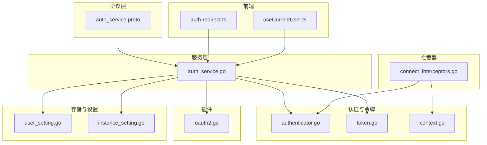
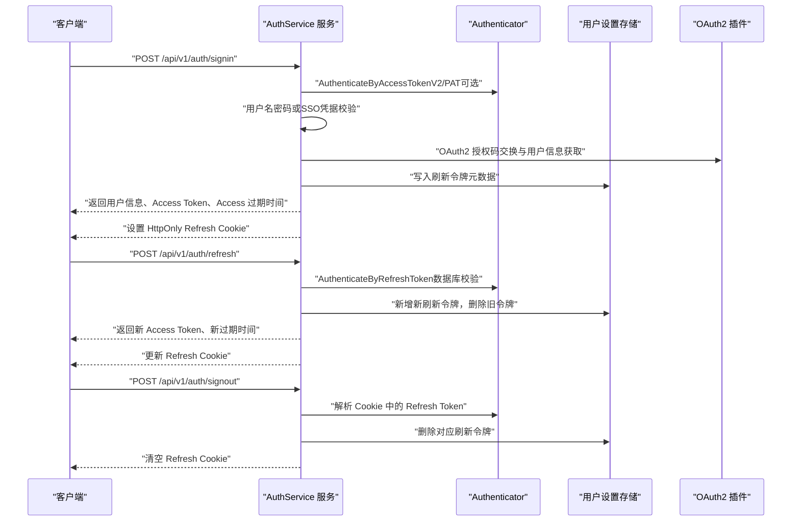
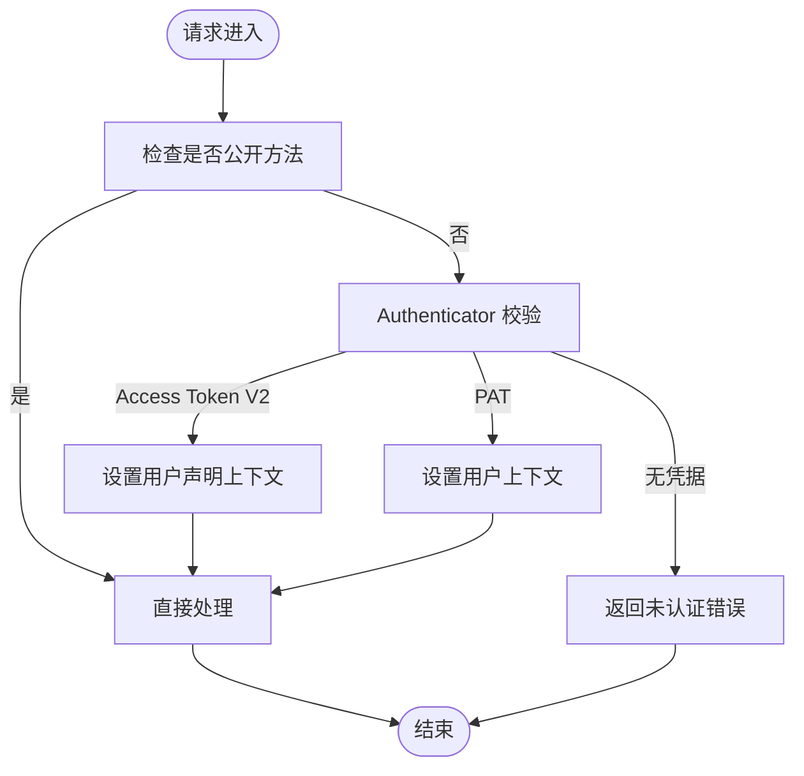
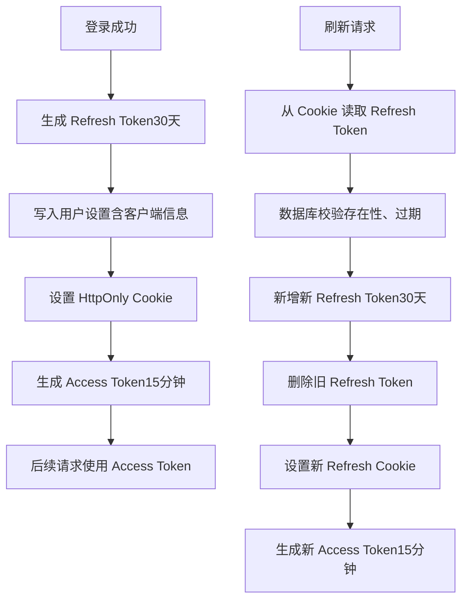
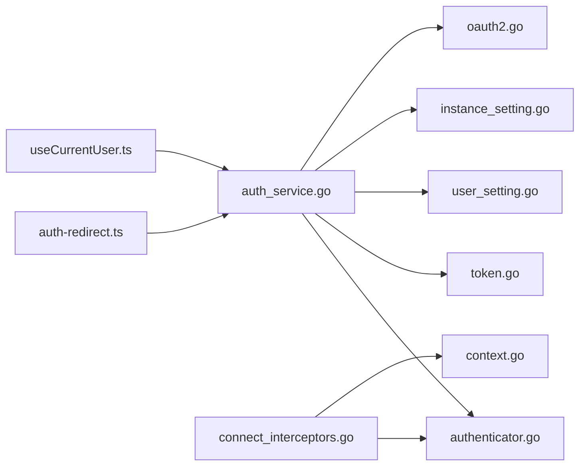

# 认证服务 API

<cite>
**本文引用的文件列表**
- [auth_service.proto](file://proto/api/v1/auth_service.proto)
- [auth_service.go](file://server/router/api/v1/auth_service.go)
- [authenticator.go](file://server/auth/authenticator.go)
- [token.go](file://server/auth/token.go)
- [context.go](file://server/auth/context.go)
- [connect_interceptors.go](file://server/router/api/v1/connect_interceptors.go)
- [oauth2.go](file://plugin/idp/oauth2/oauth2.go)
- [user_setting.go](file://store/user_setting.go)
- [instance_setting.go](file://store/instance_setting.go)
- [auth-redirect.ts](file://web/src/utils/auth-redirect.ts)
- [useCurrentUser.ts](file://web/src/hooks/useCurrentUser.ts)
</cite>

## 目录
1. [简介](#简介)
2. [项目结构](#项目结构)
3. [核心组件](#核心组件)
4. [架构总览](#架构总览)
5. [详细组件分析](#详细组件分析)
6. [依赖关系分析](#依赖关系分析)
7. [性能与安全考量](#性能与安全考量)
8. [故障排查指南](#故障排查指南)
9. [结论](#结论)
10. [附录：接口规范与集成指南](#附录接口规范与集成指南)

## 简介
本文件面向认证服务 API，系统性说明用户登录、登出、令牌刷新与密码管理的接口规范；详述认证流程、JWT 令牌结构与过期策略；覆盖用户名密码与 OAuth2 两种认证方式；给出会话管理、权限验证与错误处理机制，并提供配置项与集成指南，帮助前后端与第三方系统正确接入。

## 项目结构
认证能力由后端 gRPC/Connect 服务与拦截器、JWT 令牌生成与解析、会话存储、以及前端重定向与上下文工具共同组成。核心文件分布如下：
- 协议定义：proto/api/v1/auth_service.proto
- 服务实现：server/router/api/v1/auth_service.go
- 认证器与令牌：server/auth/{authenticator.go, token.go, context.go}
- 拦截器：server/router/api/v1/connect_interceptors.go
- OAuth2 插件：plugin/idp/oauth2/oauth2.go
- 存储与设置：store/{user_setting.go, instance_setting.go}
- 前端工具：web/src/utils/auth-redirect.ts, web/src/hooks/useCurrentUser.ts

图表来源
- [auth_service.proto](file://proto/api/v1/auth_service.proto#L1-L115)
- [auth_service.go](file://server/router/api/v1/auth_service.go#L1-L613)
- [authenticator.go](file://server/auth/authenticator.go#L1-L166)
- [token.go](file://server/auth/token.go#L1-L250)
- [context.go](file://server/auth/context.go#L1-L84)
- [connect_interceptors.go](file://server/router/api/v1/connect_interceptors.go#L1-L275)
- [oauth2.go](file://plugin/idp/oauth2/oauth2.go#L1-L135)
- [user_setting.go](file://store/user_setting.go#L1-L487)
- [instance_setting.go](file://store/instance_setting.go#L1-L244)
- [auth-redirect.ts](file://web/src/utils/auth-redirect.ts#L1-L37)
- [useCurrentUser.ts](file://web/src/hooks/useCurrentUser.ts#L1-L9)

章节来源
- [auth_service.proto](file://proto/api/v1/auth_service.proto#L1-L115)
- [auth_service.go](file://server/router/api/v1/auth_service.go#L1-L613)

## 核心组件
- 服务接口：提供 GetCurrentUser、SignIn、SignOut、RefreshToken 四个方法，均通过 Connect HTTP 映射暴露。
- 认证器：统一处理 Access Token V2、Personal Access Token（PAT）与刷新令牌校验。
- 令牌生成与解析：Access Token（15 分钟）、Refresh Token（30 天）、PAT（前缀 memos_pat_）。
- 会话存储：使用用户设置中的“刷新令牌”集合持久化刷新令牌元数据（含客户端信息、过期时间）。
- OAuth2 插件：支持授权码模式与 PKCE（code_verifier），从第三方获取用户信息并映射到本地用户。
- 拦截器：将 HTTP 请求头转换为 gRPC 元数据，执行认证与日志/恢复拦截。
- 前端工具：根据实例配置与路由状态进行认证失败后的页面重定向。

章节来源
- [auth_service.proto](file://proto/api/v1/auth_service.proto#L13-L46)
- [authenticator.go](file://server/auth/authenticator.go#L17-L166)
- [token.go](file://server/auth/token.go#L25-L53)
- [user_setting.go](file://store/user_setting.go#L125-L199)
- [oauth2.go](file://plugin/idp/oauth2/oauth2.go#L19-L135)
- [connect_interceptors.go](file://server/router/api/v1/connect_interceptors.go#L19-L275)
- [auth-redirect.ts](file://web/src/utils/auth-redirect.ts#L1-L37)

## 架构总览
认证服务采用“短令牌 + 刷新令牌轮换”的会话模型：
- Access Token：短期（15 分钟），用于 API 调用鉴权。
- Refresh Token：长期（30 天），仅在 Cookie 中携带，服务端数据库校验与轮换。
- PAT：长时令牌，适合程序化访问，按需创建与撤销。
- 登录流程：用户名密码或 OAuth2 授权码换取 Access Token 并设置 Refresh Cookie；登出撤销 Refresh Cookie；刷新令牌轮换并返回新的 Access Token。

图表来源
- [auth_service.go](file://server/router/api/v1/auth_service.go#L64-L357)
- [authenticator.go](file://server/auth/authenticator.go#L60-L99)
- [token.go](file://server/auth/token.go#L133-L187)
- [user_setting.go](file://store/user_setting.go#L140-L185)
- [oauth2.go](file://plugin/idp/oauth2/oauth2.go#L43-L78)

## 详细组件分析

### 1) 服务接口与控制流
- GetCurrentUser：基于 Access Token 获取当前用户信息。
- SignIn：支持用户名密码与 OAuth2 SSO 两种方式；成功后返回 Access Token 与 Access 过期时间，并设置 HttpOnly Refresh Cookie。
- SignOut：清除 Refresh Cookie；如能解析 Cookie 中的 Refresh Token，则在数据库中撤销该令牌。
- RefreshToken：从 Cookie 中读取 Refresh Token，数据库校验后进行“刷新令牌轮换”，返回新的 Access Token 与过期时间，并更新 Refresh Cookie。

图表来源
- [connect_interceptors.go](file://server/router/api/v1/connect_interceptors.go#L216-L242)

章节来源
- [auth_service.proto](file://proto/api/v1/auth_service.proto#L13-L46)
- [auth_service.go](file://server/router/api/v1/auth_service.go#L32-L357)
- [connect_interceptors.go](file://server/router/api/v1/connect_interceptors.go#L201-L275)

### 2) 令牌结构与过期策略
- Access Token（V2）
  - 类型：access
  - 生命周期：15 分钟
  - 声明：包含用户 ID、用户名、角色、状态等
  - 验证：仅签名验证（无数据库查询）
- Refresh Token
  - 类型：refresh
  - 生命周期：30 天
  - 声明：包含用户 ID 与 TokenID（用于数据库定位）
  - 验证：签名验证 + 数据库存在性与过期检查
- PAT（Personal Access Token）
  - 前缀：memos_pat_
  - 存储：以哈希形式保存于用户设置，支持过期与最后使用时间记录
- Cookie
  - 名称：memos_refresh
  - 属性：HttpOnly、路径 /、SameSite=Lax、Secure（HTTPS 时）

章节来源
- [token.go](file://server/auth/token.go#L25-L53)
- [token.go](file://server/auth/token.go#L133-L187)
- [auth_service.go](file://server/router/api/v1/auth_service.go#L369-L401)
- [user_setting.go](file://store/user_setting.go#L125-L199)

### 3) 用户名密码认证
- 流程要点
  - 查询用户并比对密码哈希（bcrypt）
  - 受实例通用设置限制：禁止普通用户使用密码登录时拒绝
  - 成功后调用内部登录流程生成 Access Token 与 Refresh Cookie
- 安全要点
  - 密码不落盘明文，仅存储哈希
  - 登录失败返回统一错误消息，避免泄露细节

章节来源
- [auth_service.go](file://server/router/api/v1/auth_service.go#L67-L90)
- [instance_setting.go](file://store/instance_setting.go#L121-L142)

### 4) OAuth2（SSO）认证
- 支持授权码 + PKCE（code_verifier）
- 步骤
  - 通过授权码交换第三方访问令牌
  - 使用访问令牌拉取用户信息并映射到本地字段
  - 应用标识符过滤正则（可选）
  - 若本地不存在用户且允许注册，则自动创建用户
- 错误处理
  - 提供统一错误包装，区分内部错误与外部提供商错误

章节来源
- [auth_service.go](file://server/router/api/v1/auth_service.go#L91-L171)
- [oauth2.go](file://plugin/idp/oauth2/oauth2.go#L43-L135)

### 5) 会话管理与刷新令牌轮换
- 登录：生成 Refresh Token（30 天），写入用户设置，设置 HttpOnly Cookie；生成 Access Token（15 分钟）返回给客户端内存
- 刷新：从 Cookie 解析 Refresh Token，数据库校验后进行“轮换”：新增一个 30 天的新 Refresh Token，删除旧的；返回新的 Access Token（15 分钟）
- 登出：清除 Refresh Cookie；若能解析 Cookie 中的 Refresh Token，则在数据库中撤销该令牌

图表来源
- [auth_service.go](file://server/router/api/v1/auth_service.go#L192-L357)
- [user_setting.go](file://store/user_setting.go#L140-L185)

章节来源
- [authenticator.go](file://server/auth/authenticator.go#L60-L99)
- [token.go](file://server/auth/token.go#L162-L187)

### 6) 权限验证与上下文
- 拦截器优先尝试 Access Token V2（stateless），再尝试 PAT
- 将用户声明或完整用户对象写入上下文，供业务层使用
- 对非公开方法强制要求认证

章节来源
- [connect_interceptors.go](file://server/router/api/v1/connect_interceptors.go#L201-L275)
- [context.go](file://server/auth/context.go#L48-L83)

### 7) 前端集成与重定向
- 前端根据实例配置与路由状态，在认证失败时进行重定向（例如跳转到登录页或探索页）
- 当禁用公开可见性时，私有路由访问将被重定向至登录页

章节来源
- [auth-redirect.ts](file://web/src/utils/auth-redirect.ts#L21-L36)

## 依赖关系分析
- 服务实现依赖认证器与令牌工具，同时与存储交互以持久化刷新令牌元数据
- 拦截器依赖认证器与上下文工具，负责将 HTTP 头部转换为 gRPC 元数据并执行认证
- OAuth2 插件独立于主服务，通过配置驱动第三方授权码交换与用户信息获取
- 前端工具与服务通过 HTTP 接口交互，遵循 Connect 映射

图表来源
- [auth_service.go](file://server/router/api/v1/auth_service.go#L1-L613)
- [authenticator.go](file://server/auth/authenticator.go#L1-L166)
- [token.go](file://server/auth/token.go#L1-L250)
- [user_setting.go](file://store/user_setting.go#L1-L487)
- [instance_setting.go](file://store/instance_setting.go#L1-L244)
- [connect_interceptors.go](file://server/router/api/v1/connect_interceptors.go#L1-L275)
- [context.go](file://server/auth/context.go#L1-L84)
- [auth-redirect.ts](file://web/src/utils/auth-redirect.ts#L1-L37)
- [useCurrentUser.ts](file://web/src/hooks/useCurrentUser.ts#L1-L9)

## 性能与安全考量
- 性能
  - Access Token V2 为无状态验证，减少数据库查询
  - 刷新令牌轮换采用“先增后删”，避免并发竞争导致的短暂不可用
- 安全
  - Refresh Token 仅通过 HttpOnly Cookie 传输，降低 XSS 风险
  - Access Token 有效期短，降低泄露影响面
  - OAuth2 支持 PKCE，增强授权码拦截防护
  - 实例级开关可禁用密码登录或用户注册，强化合规与安全策略
- 最佳实践
  - Access Token 存放在内存，不要持久化到 localStorage
  - 启用 HTTPS 时 Refresh Cookie 设置 Secure 属性
  - 定期清理过期或异常的刷新令牌
  - 对敏感操作增加角色校验（在业务层实现）

[本节为通用指导，无需特定文件引用]

## 故障排查指南
- 未认证错误
  - 检查请求头 Authorization 是否携带有效 Bearer Token 或 PAT
  - 确认 Access Token 未过期，必要时调用刷新接口
- 刷新令牌无效
  - 确认浏览器已设置 HttpOnly Cookie（memos_refresh）
  - 检查数据库中是否存在该 TokenID 且未过期
- 登录失败
  - 用户名密码：确认用户存在、密码哈希匹配、实例禁止密码登录开关
  - OAuth2：确认授权码有效、code_verifier（如启用 PKCE）、第三方用户信息映射字段存在
- 前端重定向问题
  - 检查实例配置与路由状态，确保在禁用公开可见性时正确重定向

章节来源
- [connect_interceptors.go](file://server/router/api/v1/connect_interceptors.go#L216-L242)
- [authenticator.go](file://server/auth/authenticator.go#L60-L99)
- [auth_service.go](file://server/router/api/v1/auth_service.go#L245-L270)
- [auth-redirect.ts](file://web/src/utils/auth-redirect.ts#L21-L36)

## 结论
该认证体系以 Connect/HTTP 映射暴露标准接口，结合 Access Token 与 Refresh Token 的“短令牌 + 轮换”模型，兼顾易用性与安全性。通过拦截器统一认证、存储持久化会话元数据、前端配合实例配置与路由重定向，形成完整的认证闭环。建议在生产环境中启用 HTTPS、合理设置实例开关、定期审计刷新令牌与 PAT 的使用情况。

[本节为总结，无需特定文件引用]

## 附录：接口规范与集成指南

### 接口清单与行为
- GET /api/v1/auth/me
  - 功能：获取当前认证用户信息
  - 认证：需要 Access Token
  - 返回：用户对象
- POST /api/v1/auth/signin
  - 功能：登录并返回 Access Token 与 Access 过期时间，设置 Refresh Cookie
  - 认证：无需
  - 参数：用户名密码或 OAuth2 授权码（支持 PKCE）
  - 返回：用户对象、Access Token、Access 过期时间
- POST /api/v1/auth/signout
  - 功能：登出，撤销 Refresh Cookie 与数据库中的刷新令牌
  - 认证：需要 Access Token
  - 返回：空
- POST /api/v1/auth/refresh
  - 功能：使用 Refresh Cookie 获取新的 Access Token，并更新 Refresh Cookie
  - 认证：需要 Refresh Cookie
  - 返回：新的 Access Token、新的过期时间

章节来源
- [auth_service.proto](file://proto/api/v1/auth_service.proto#L13-L46)
- [auth_service.go](file://server/router/api/v1/auth_service.go#L32-L357)

### 令牌与 Cookie 规范
- Access Token
  - 类型：access
  - 生命周期：15 分钟
  - 存放：内存（不存 localStorage）
- Refresh Token
  - 类型：refresh
  - 生命周期：30 天
  - 存放：HttpOnly Cookie（memos_refresh）
  - 安全属性：Path=/、SameSite=Lax、Secure（HTTPS）
- PAT
  - 前缀：memos_pat_
  - 存储：哈希值保存于用户设置，支持过期与最后使用时间

章节来源
- [token.go](file://server/auth/token.go#L25-L53)
- [token.go](file://server/auth/token.go#L133-L187)
- [auth_service.go](file://server/router/api/v1/auth_service.go#L369-L401)
- [user_setting.go](file://store/user_setting.go#L201-L287)

### OAuth2 配置与流程
- 必填字段：clientId、clientSecret、tokenUrl、userInfoUrl、fieldMapping.identifier
- 支持 PKCE：code_verifier 可选
- 用户信息映射：identifier（必填）、displayName、email、avatarUrl（可选）
- 注册策略：若本地不存在用户且允许注册，则自动创建

章节来源
- [oauth2.go](file://plugin/idp/oauth2/oauth2.go#L24-L78)
- [auth_service.go](file://server/router/api/v1/auth_service.go#L120-L171)

### 实例配置与安全策略
- 禁止密码登录：禁用普通用户的用户名密码登录
- 禁止用户注册：阻止通过 OAuth2 自动创建新用户
- 前端重定向：当禁用公开可见性时，私有路由访问将被重定向至登录页

章节来源
- [instance_setting.go](file://store/instance_setting.go#L121-L142)
- [auth-redirect.ts](file://web/src/utils/auth-redirect.ts#L21-L36)

### 前端集成要点
- Access Token：仅存内存，随请求头 Authorization: Bearer {token}
- Refresh Cookie：由服务端设置，客户端无需手动管理
- 登录页：根据实例配置决定是否显示密码登录入口
- 重定向：认证失败时依据实例配置与路由状态进行跳转

章节来源
- [auth-redirect.ts](file://web/src/utils/auth-redirect.ts#L1-L37)
- [useCurrentUser.ts](file://web/src/hooks/useCurrentUser.ts#L1-L9)