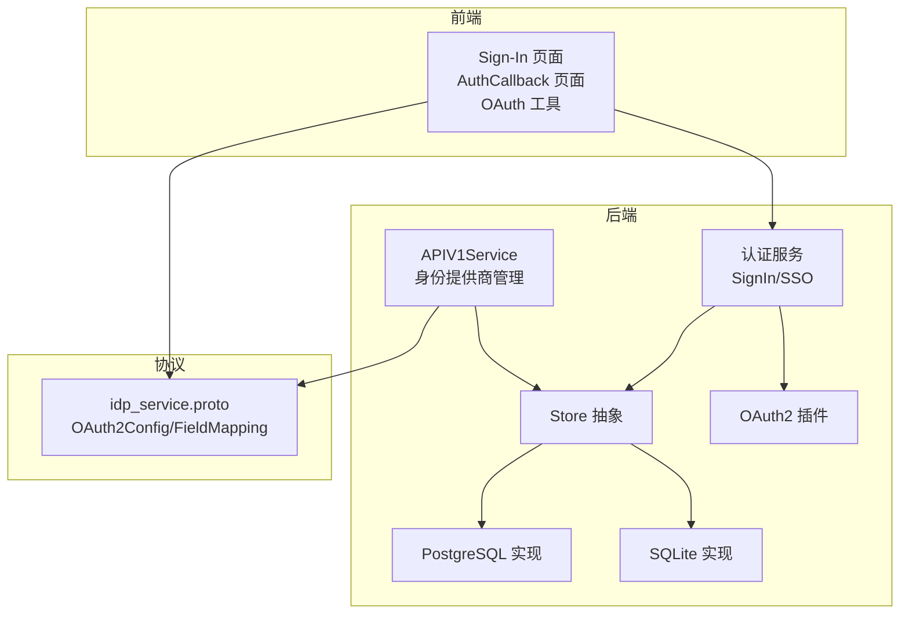
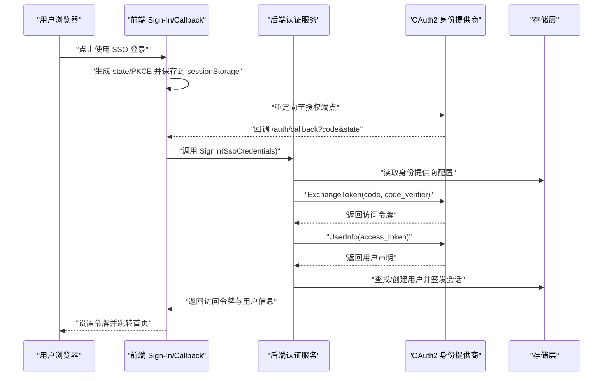
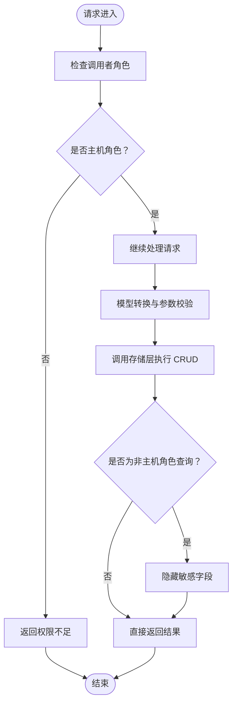
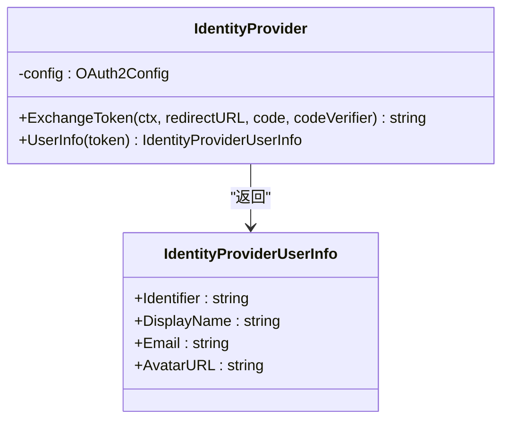
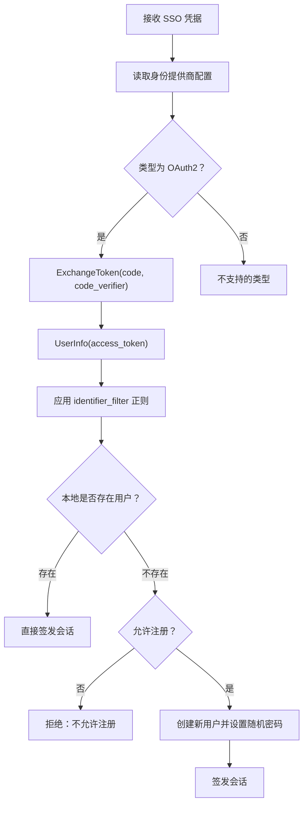
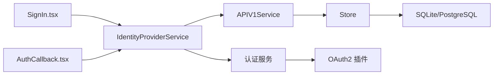

# 身份提供商服务 API

<cite>
**本文档引用的文件**
- [idp_service.proto](file://proto/api/v1/idp_service.proto)
- [idp_service.go](file://server/router/api/v1/idp_service.go)
- [auth_service.go](file://server/router/api/v1/auth_service.go)
- [idp.go](file://plugin/idp/idp.go)
- [oauth2.go](file://plugin/idp/oauth2/oauth2.go)
- [idp.go](file://store/idp.go)
- [sqlite/idp.go](file://store/db/sqlite/idp.go)
- [postgres/idp.go](file://store/db/postgres/idp.go)
- [01__idp.sql](file://store/migration/sqlite/0.11/01__idp.sql)
- [AuthCallback.tsx](file://web/src/pages/AuthCallback.tsx)
- [oauth.ts](file://web/src/utils/oauth.ts)
- [SignIn.tsx](file://web/src/pages/SignIn.tsx)
</cite>

## 目录
1. [简介](#简介)
2. [项目结构](#项目结构)
3. [核心组件](#核心组件)
4. [架构总览](#架构总览)
5. [详细组件分析](#详细组件分析)
6. [依赖关系分析](#依赖关系分析)
7. [性能考虑](#性能考虑)
8. [故障排除指南](#故障排除指南)
9. [结论](#结论)
10. [附录](#附录)

## 简介
本文件系统性地文档化了“身份提供商服务 API”，涵盖 OAuth2 身份认证、用户信息同步与单点登录（SSO）的接口规范与实现细节。内容包括：
- 支持的身份提供商类型与配置模型
- 认证流程与回调处理机制
- 用户映射与数据同步策略
- 安全配置（CSRF、PKCE、密钥保护）
- 错误处理与故障恢复
- 最佳实践与配置示例

## 项目结构
围绕身份提供商服务的关键模块分布如下：
- 协议定义：proto 层定义了 IdentityProvider 及其配置模型、字段映射、以及 REST 映射
- 后端路由：APIV1Service 提供 CRUD 接口与权限控制
- 插件层：OAuth2 身份提供商插件负责令牌交换与用户信息拉取
- 存储层：统一的 Store 抽象与 SQLite/PostgreSQL 实现
- 前端：OAuth 流程初始化、状态校验与回调处理

**图表来源**
- [idp_service.proto](file://proto/api/v1/idp_service.proto#L1-L148)
- [idp_service.go](file://server/router/api/v1/idp_service.go#L1-L239)
- [auth_service.go](file://server/router/api/v1/auth_service.go#L1-L200)
- [oauth2.go](file://plugin/idp/oauth2/oauth2.go#L1-L135)
- [idp.go](file://store/idp.go#L1-L183)
- [sqlite/idp.go](file://store/db/sqlite/idp.go#L1-L118)
- [postgres/idp.go](file://store/db/postgres/idp.go#L1-L118)

**章节来源**
- [idp_service.proto](file://proto/api/v1/idp_service.proto#L1-L148)
- [idp_service.go](file://server/router/api/v1/idp_service.go#L1-L239)
- [auth_service.go](file://server/router/api/v1/auth_service.go#L1-L200)
- [oauth2.go](file://plugin/idp/oauth2/oauth2.go#L1-L135)
- [idp.go](file://store/idp.go#L1-L183)
- [sqlite/idp.go](file://store/db/sqlite/idp.go#L1-L118)
- [postgres/idp.go](file://store/db/postgres/idp.go#L1-L118)

## 核心组件
- 协议与模型
  - IdentityProvider：包含名称、标题、类型、标识符过滤器与配置
  - IdentityProviderConfig：当前支持 OAuth2Config
  - OAuth2Config：客户端凭据、授权/令牌/用户信息端点、作用域、字段映射
  - FieldMapping：将远端声明字段映射到本地用户字段（标识符、显示名、邮箱、头像）
- 路由与权限
  - 列表/获取/创建/更新/删除身份提供商，仅主机角色可操作
  - 返回响应时对非主机角色隐藏敏感配置（如 ClientSecret）
- 插件与认证
  - OAuth2 插件负责令牌交换（支持 PKCE）与用户信息解析
  - 认证服务根据配置选择密码或 SSO 登录路径，并进行用户创建/同步
- 存储与迁移
  - 统一存储模型与驱动抽象，SQLite/PostgreSQL 实现一致
  - 迁移脚本创建 idp 表并持久化配置为 JSON 文本

**章节来源**
- [idp_service.proto](file://proto/api/v1/idp_service.proto#L51-L104)
- [idp_service.go](file://server/router/api/v1/idp_service.go#L16-L159)
- [oauth2.go](file://plugin/idp/oauth2/oauth2.go#L24-L41)
- [auth_service.go](file://server/router/api/v1/auth_service.go#L91-L171)
- [idp.go](file://store/idp.go#L12-L182)
- [01__idp.sql](file://store/migration/sqlite/0.11/01__idp.sql#L1-L8)

## 架构总览
下图展示了从用户发起登录到完成会话建立的端到端流程。

**图表来源**
- [SignIn.tsx](file://web/src/pages/SignIn.tsx#L41-L72)
- [oauth.ts](file://web/src/utils/oauth.ts#L42-L105)
- [AuthCallback.tsx](file://web/src/pages/AuthCallback.tsx#L18-L111)
- [auth_service.go](file://server/router/api/v1/auth_service.go#L64-L190)
- [oauth2.go](file://plugin/idp/oauth2/oauth2.go#L43-L78)
- [idp.go](file://plugin/idp/idp.go#L3-L8)

## 详细组件分析

### 协议与模型
- 资源命名与行为
  - 资源类型：identity-providers/{idp}
  - 支持的操作：列表、获取、创建、更新（带 FieldMask）、删除
- 字段语义
  - 类型：当前仅支持 OAuth2
  - 标识符过滤器：正则表达式，用于限制允许登录的用户标识符
  - 配置：OAuth2Config 包含客户端凭据、端点、作用域与字段映射
- 字段映射
  - 必填：identifier
  - 可选：display_name、email、avatar_url
  - 若未提供 display_name，回退为 identifier

**章节来源**
- [idp_service.proto](file://proto/api/v1/idp_service.proto#L51-L104)
- [idp_service.proto](file://proto/api/v1/idp_service.proto#L106-L147)

### 身份提供商管理 API
- 权限控制
  - 仅主机角色可执行创建、更新、删除
  - 列表与获取时，非主机角色返回的响应中会清空敏感字段（如 ClientSecret）
- 更新策略
  - 使用 FieldMask 指定更新字段，支持 title、identifier_filter、config
- 数据转换
  - 前端/后端模型与存储模型之间进行双向转换
  - OAuth2 配置以 JSON 文本形式持久化

**图表来源**
- [idp_service.go](file://server/router/api/v1/idp_service.go#L16-L159)
- [idp_service.go](file://server/router/api/v1/idp_service.go#L230-L238)

**章节来源**
- [idp_service.go](file://server/router/api/v1/idp_service.go#L16-L159)
- [idp.go](file://store/idp.go#L130-L182)

### OAuth2 身份提供商插件
- 初始化校验
  - 必填字段：clientId、clientSecret、tokenUrl、userInfoUrl、fieldMapping.identifier
- 令牌交换
  - 支持 PKCE：当提供 code_verifier 时，通过 SetAuthURLParam 注入
  - 校验返回的 AccessToken 非空
- 用户信息解析
  - 严格要求 identifier 存在且非空；可选字段按映射填充
  - display_name 缺失时回退为 identifier

**图表来源**
- [oauth2.go](file://plugin/idp/oauth2/oauth2.go#L19-L41)
- [oauth2.go](file://plugin/idp/oauth2/oauth2.go#L80-L134)
- [idp.go](file://plugin/idp/idp.go#L3-L8)

**章节来源**
- [oauth2.go](file://plugin/idp/oauth2/oauth2.go#L24-L41)
- [oauth2.go](file://plugin/idp/oauth2/oauth2.go#L43-L78)
- [oauth2.go](file://plugin/idp/oauth2/oauth2.go#L80-L134)

### 认证与用户映射
- 登录路径
  - 密码登录：用户名+密码，受实例设置控制
  - SSO 登录：通过指定身份提供商 ID 获取配置，执行令牌交换与用户信息获取
- 用户映射策略
  - 以远端 identifier 作为本地用户名
  - display_name、email、avatar_url 从远端声明映射
  - 若本地不存在该用户，且允许注册，则自动创建默认用户
- 安全策略
  - identifier_filter 正则匹配，拒绝不在白名单内的用户
  - 前端生成并校验 state，防止 CSRF；支持 PKCE 增强安全性

**图表来源**
- [auth_service.go](file://server/router/api/v1/auth_service.go#L64-L190)
- [AuthCallback.tsx](file://web/src/pages/AuthCallback.tsx#L18-L111)
- [oauth.ts](file://web/src/utils/oauth.ts#L42-L105)

**章节来源**
- [auth_service.go](file://server/router/api/v1/auth_service.go#L64-L190)
- [AuthCallback.tsx](file://web/src/pages/AuthCallback.tsx#L18-L111)
- [oauth.ts](file://web/src/utils/oauth.ts#L42-L105)

### 存储与迁移
- 存储模型
  - 字段：id、name、type、identifier_filter、config（JSON 文本）
  - 支持按 ID 查询与更新
- 驱动实现
  - SQLite/PostgreSQL 实现一致，均将 type 序列化为字符串存储
- 迁移
  - 创建 idp 表，初始默认值保证兼容

**章节来源**
- [idp.go](file://store/idp.go#L12-L182)
- [sqlite/idp.go](file://store/db/sqlite/idp.go#L12-L118)
- [postgres/idp.go](file://store/db/postgres/idp.go#L11-L118)
- [01__idp.sql](file://store/migration/sqlite/0.11/01__idp.sql#L1-L8)

## 依赖关系分析
- 前端依赖
  - Sign-In 页面调用身份提供商列表接口，构建授权 URL
  - AuthCallback 页面负责校验 state、提取 code 与 code_verifier，并调用后端 SignIn
- 后端依赖
  - APIV1Service 依赖 Store 与插件层
  - 认证服务依赖存储层、插件层与实例设置
- 协议依赖
  - 所有接口基于 proto 定义的服务与消息

**图表来源**
- [SignIn.tsx](file://web/src/pages/SignIn.tsx#L32-L72)
- [AuthCallback.tsx](file://web/src/pages/AuthCallback.tsx#L18-L111)
- [idp_service.go](file://server/router/api/v1/idp_service.go#L1-L239)
- [auth_service.go](file://server/router/api/v1/auth_service.go#L1-L200)
- [oauth2.go](file://plugin/idp/oauth2/oauth2.go#L1-L135)

**章节来源**
- [idp_service.go](file://server/router/api/v1/idp_service.go#L1-L239)
- [auth_service.go](file://server/router/api/v1/auth_service.go#L1-L200)
- [oauth2.go](file://plugin/idp/oauth2/oauth2.go#L1-L135)

## 性能考虑
- 配置持久化为 JSON 文本，读写开销低，适合小规模配置
- 列表/获取接口对非主机角色进行字段裁剪，减少敏感信息传输
- 建议在高并发场景下：
  - 对 OAuth2 配置缓存于内存，避免频繁序列化/反序列化
  - 对用户创建与令牌交换增加必要的超时与重试策略
  - 在前端对 state/PKCE 参数进行本地清理，降低内存占用

## 故障排除指南
- 常见错误与定位
  - “无效的身份提供商名称”：检查资源名格式与 ID 解析
  - “身份提供商不存在”：确认配置已创建且 ID 正确
  - “权限不足”：确保调用者为主机角色
  - “令牌交换失败”：检查 clientId、clientSecret、端点与 PKCE 参数
  - “缺少访问令牌”：确认授权服务器返回的令牌有效
  - “identifier 为空”：检查远端声明与字段映射配置
  - “identifier 不被允许”：检查 identifier_filter 正则表达式
  - “不允许注册”：检查实例设置中的 disallow_user_registration
- 前端排查
  - state 校验失败：确认 sessionStorage 中的 state 未过期且匹配
  - 回调缺失 code/state：检查授权服务器回调地址与参数传递
- 后端排查
  - 配置反序列化失败：检查存储中的 JSON 文本格式
  - 用户创建异常：检查随机密码生成与哈希过程

**章节来源**
- [idp_service.go](file://server/router/api/v1/idp_service.go#L60-L82)
- [auth_service.go](file://server/router/api/v1/auth_service.go#L93-L171)
- [oauth2.go](file://plugin/idp/oauth2/oauth2.go#L45-L78)
- [AuthCallback.tsx](file://web/src/pages/AuthCallback.tsx#L27-L71)

## 结论
身份提供商服务 API 以清晰的协议定义、严谨的权限控制与安全的 OAuth2 插件为核心，提供了完整的 SSO 能力。通过字段映射与用户创建策略，实现了远端身份与本地用户的平滑衔接。建议在生产环境中启用主机角色限制、严格配置校验与 CSRF/PKCE 保护，并结合实例设置灵活控制登录方式与注册策略。

## 附录

### 接口规范摘要
- 列表身份提供商
  - 方法：GET /api/v1/identity-providers
  - 权限：任意已认证用户
- 获取身份提供商
  - 方法：GET /api/v1/identity-providers/{id}
  - 权限：任意已认证用户
- 创建身份提供商
  - 方法：POST /api/v1/identity-providers
  - 权限：主机角色
- 更新身份提供商
  - 方法：PATCH /api/v1/identity-providers/{id}
  - 权限：主机角色
- 删除身份提供商
  - 方法：DELETE /api/v1/identity-providers/{id}
  - 权限：主机角色

**章节来源**
- [idp_service.proto](file://proto/api/v1/idp_service.proto#L14-L49)

### 安全配置清单
- CSRF 防护
  - 前端生成并校验 state，过期时间 10 分钟
- PKCE 增强
  - 生成 code_verifier 与 code_challenge，回调时传回 code_verifier
- 敏感信息保护
  - 非主机角色返回时隐藏 ClientSecret
  - 令牌交换与用户信息获取通过 HTTPS 与 Bearer 头传输
- 用户边界控制
  - identifier_filter 正则白名单
  - 实例设置禁止密码登录或注册

**章节来源**
- [oauth.ts](file://web/src/utils/oauth.ts#L1-L124)
- [idp_service.go](file://server/router/api/v1/idp_service.go#L230-L238)
- [auth_service.go](file://server/router/api/v1/auth_service.go#L82-L145)

### 配置示例（步骤说明）
- 创建 OAuth2 身份提供商
  - 设置 title、type 为 OAUTH2
  - 配置 OAuth2Config：clientId、clientSecret、authUrl、tokenUrl、userInfoUrl、scopes、fieldMapping
  - 可选：identifierFilter（正则表达式）
- 前端发起登录
  - 获取身份提供商列表，构造授权 URL（包含 state、code_challenge、scope）
  - 发送用户至授权端点
- 回调处理
  - 校验 state，提取 code 与 code_verifier
  - 调用后端 SignIn，完成令牌交换与用户映射
- 实例设置
  - 根据需要开启 disallow_user_registration 或 disallow_password_auth

**章节来源**
- [idp_service.proto](file://proto/api/v1/idp_service.proto#L96-L104)
- [SignIn.tsx](file://web/src/pages/SignIn.tsx#L41-L72)
- [AuthCallback.tsx](file://web/src/pages/AuthCallback.tsx#L74-L98)
- [auth_service.go](file://server/router/api/v1/auth_service.go#L138-L171)