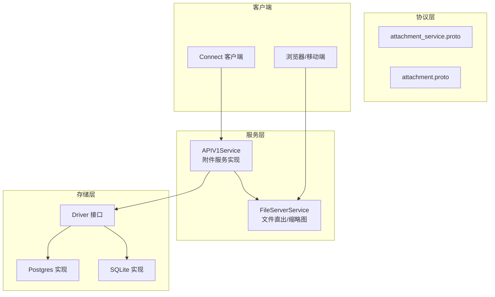
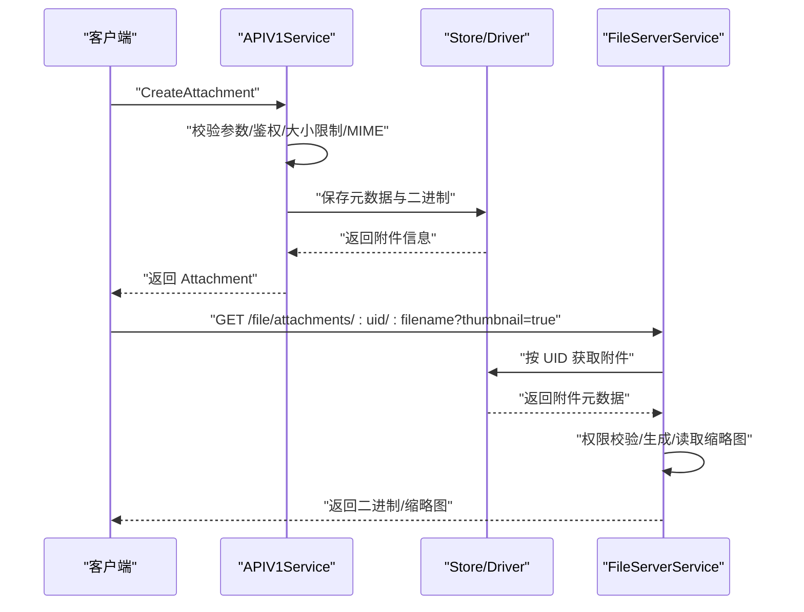
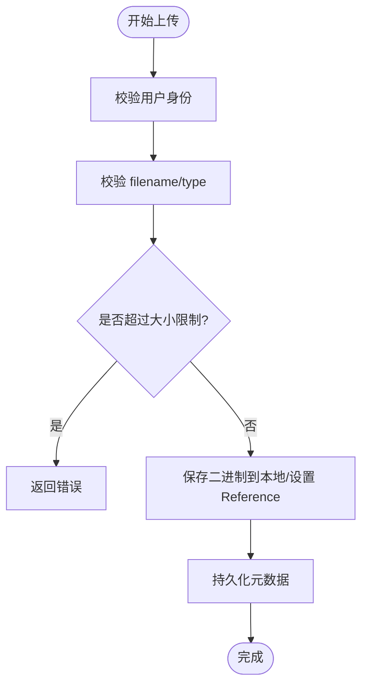
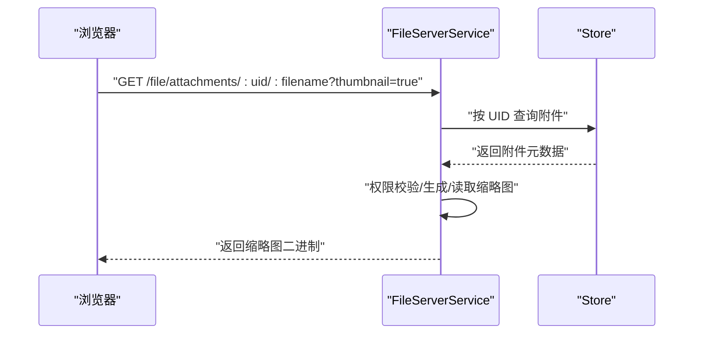
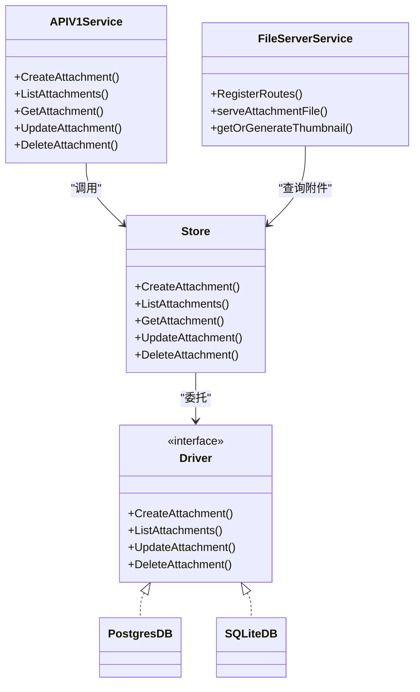

# 附件服务 API

<cite>
**本文引用的文件列表**
- [attachment_service.proto](file://proto/api/v1/attachment_service.proto)
- [attachment.proto](file://proto/store/attachment.proto)
- [attachment_service.go](file://server/router/api/v1/attachment_service.go)
- [fileserver.go](file://server/router/fileserver/fileserver.go)
- [attachment.go](file://store/attachment.go)
- [postgres/attachment.go](file://store/db/postgres/attachment.go)
- [sqlite/attachment.go](file://store/db/sqlite/attachment.go)
- [driver.go](file://store/driver.go)
- [instance_setting.go](file://store/instance_setting.go)
- [connect_services.go](file://server/router/api/v1/connect_services.go)
</cite>

## 目录
1. [简介](#简介)
2. [项目结构与入口](#项目结构与入口)
3. [核心组件](#核心组件)
4. [架构总览](#架构总览)
5. [详细组件分析](#详细组件分析)
6. [依赖关系分析](#依赖关系分析)
7. [性能与容量规划](#性能与容量规划)
8. [故障排查指南](#故障排查指南)
9. [结论](#结论)
10. [附录：接口规范与示例](#附录接口规范与示例)

## 简介
本文件系统性地文档化“附件服务 API”，覆盖附件上传、下载、查询、更新与删除的完整接口规范；明确 Attachment 实体的数据结构、存储类型与访问权限控制；详述文件类型与大小限制、安全检查策略；说明附件 URL 生成与预览支持（缩略图）；给出批量操作建议与配置项说明，以及性能与安全注意事项。

## 项目结构与入口
- 协议定义位于 proto 层，定义了服务方法、消息体与资源命名规则。
- 后端路由层在 server/router/api/v1 中实现 gRPC/Connect 方法，并通过 server/router/fileserver 提供二进制文件直出与缩略图能力。
- 存储层在 store 包中抽象驱动接口，在 store/db/postgres 与 store/db/sqlite 中分别实现数据库访问逻辑。
- 前端通过 Connect/HTTP 访问 API，后端通过 Echo 路由提供文件直出服务。

图表来源
- [attachment_service.proto](file://proto/api/v1/attachment_service.proto#L15-L46)
- [attachment_service.go](file://server/router/api/v1/attachment_service.go#L47-L141)
- [fileserver.go](file://server/router/fileserver/fileserver.go#L66-L74)
- [driver.go](file://store/driver.go#L10-L24)

章节来源
- [attachment_service.proto](file://proto/api/v1/attachment_service.proto#L1-L151)
- [attachment_service.go](file://server/router/api/v1/attachment_service.go#L1-L465)
- [fileserver.go](file://server/router/fileserver/fileserver.go#L1-L518)
- [driver.go](file://store/driver.go#L1-L103)

## 核心组件
- 附件服务 API：基于 Connect/gRPC，提供创建、列表、获取、更新、删除附件的方法。
- 文件服务器：提供附件二进制直出、缩略图生成与缓存、权限校验与安全头设置。
- 存储层：统一的 Driver 接口，Postgres/SQLite 具体实现，支持过滤、分页与字段选择。
- 实例设置：上传大小限制、存储类型、路径模板等全局配置。

章节来源
- [attachment_service.proto](file://proto/api/v1/attachment_service.proto#L15-L46)
- [attachment_service.go](file://server/router/api/v1/attachment_service.go#L47-L141)
- [fileserver.go](file://server/router/fileserver/fileserver.go#L66-L176)
- [driver.go](file://store/driver.go#L10-L24)

## 架构总览
附件服务采用“API 层 + 文件直出层 + 存储层”的三层架构：
- API 层负责业务校验、鉴权、调用存储层持久化或读取元数据。
- 文件直出层负责二进制内容与缩略图的高效传输，内置安全头与范围请求支持。
- 存储层抽象出 Driver 接口，屏蔽数据库差异，支持复杂过滤与分页。

图表来源
- [attachment_service.go](file://server/router/api/v1/attachment_service.go#L47-L141)
- [fileserver.go](file://server/router/fileserver/fileserver.go#L78-L176)
- [postgres/attachment.go](file://store/db/postgres/attachment.go#L17-L44)
- [sqlite/attachment.go](file://store/db/sqlite/attachment.go#L17-L40)

## 详细组件分析

### 1) 附件实体与存储类型
- Attachment 字段
  - name：资源标识符，格式为 attachments/{uid}
  - create_time：创建时间（输出）
  - filename：文件名（输入/更新）
  - content：二进制内容（输入）
  - external_link：外部链接（可选，当存储类型为 EXTERNAL 时使用）
  - type：MIME 类型（输入/更新）
  - size：字节数（输出）
  - memo：关联 Memo 的名称（可选）

- 存储类型
  - LOCAL：本地文件系统存储
  - S3：对象存储（未在当前实现中直接使用）
  - EXTERNAL：外部链接引用

- Payload 与扩展
  - 支持 AttachmentPayload，用于承载 S3 对象信息等扩展字段。

章节来源
- [attachment_service.proto](file://proto/api/v1/attachment_service.proto#L48-L81)
- [attachment.proto](file://proto/store/attachment.proto#L10-L33)
- [attachment.go](file://store/attachment.go#L15-L49)

### 2) 上传流程与安全检查
- 鉴权：所有写操作需认证用户
- 参数校验：
  - filename 必填且必须通过路径安全校验（不允许目录穿越、前后空格/点）
  - type 可自动推断（扩展名或内容检测），并进行格式合法性校验
- 大小限制：
  - 以实例设置中的 UploadSizeLimitMb 为准；若为 0 则回退到内存缓冲上限
- 内容落盘：
  - 本地存储：根据 filepath 模板生成内部路径，确保目录存在并写入文件
  - 清理内存：写入后释放 Blob，仅保留 Reference 与 StorageType

图表来源
- [attachment_service.go](file://server/router/api/v1/attachment_service.go#L47-L117)
- [attachment_service.go](file://server/router/api/v1/attachment_service.go#L318-L356)

章节来源
- [attachment_service.go](file://server/router/api/v1/attachment_service.go#L47-L117)
- [attachment_service.go](file://server/router/api/v1/attachment_service.go#L318-L356)

### 3) 下载与 URL 生成
- 二进制直出
  - 路由：/file/attachments/:uid/:filename
  - 权限：若附件关联 Memo，需满足可见性规则（公开/创建者）
  - 安全头：X-Content-Type-Options、X-Frame-Options、Content-Security-Policy
  - 范围请求：视频/音频使用 http.ServeContent 支持 Range
- 缩略图
  - 查询参数 thumbnail=true
  - 支持 image/png、image/jpeg、image/heic、image/heif、image/webp
  - 并发限制：最多 3 个并发生成，超时 30 秒
  - 缓存：缩略图缓存于 .thumbnail_cache 目录

图表来源
- [fileserver.go](file://server/router/fileserver/fileserver.go#L66-L74)
- [fileserver.go](file://server/router/fileserver/fileserver.go#L78-L176)
- [fileserver.go](file://server/router/fileserver/fileserver.go#L414-L517)

章节来源
- [fileserver.go](file://server/router/fileserver/fileserver.go#L66-L176)
- [fileserver.go](file://server/router/fileserver/fileserver.go#L414-L517)

### 4) 列表、过滤与分页
- 列表接口支持：
  - page_size（默认 50，最大 1000）
  - page_token（偏移字符串）
  - filter（表达式引擎支持字段：filename、mime_type、create_time、memo）
  - order_by（排序字段）
- 存储层默认限制：
  - 不带 blob 时默认限制 100
  - 带 blob 时默认限制 10
  - 最大限制 10000（数据库层）

章节来源
- [attachment_service.proto](file://proto/api/v1/attachment_service.proto#L92-L124)
- [attachment_service.go](file://server/router/api/v1/attachment_service.go#L143-L208)
- [postgres/attachment.go](file://store/db/postgres/attachment.go#L46-L142)
- [sqlite/attachment.go](file://store/db/sqlite/attachment.go#L42-L171)

### 5) 更新与删除
- 更新：仅允许更新 filename，使用 FieldMask 指定字段
- 删除：需当前用户为附件创建者，同时清理本地文件（如适用）

章节来源
- [attachment_service.proto](file://proto/api/v1/attachment_service.proto#L135-L150)
- [attachment_service.go](file://server/router/api/v1/attachment_service.go#L226-L295)
- [attachment.go](file://store/attachment.go#L128-L153)

### 6) 批量操作建议
- 当前 API 未提供批量创建/删除接口。建议前端/客户端：
  - 使用循环逐条调用 CreateAttachment
  - 使用循环逐条调用 DeleteAttachment
  - 在 UI 层提供进度反馈与错误聚合
- 若需要更高吞吐，可在应用层封装批量接口（例如在 API 层增加批量 RPC），但当前仓库未实现该接口。

章节来源
- [attachment_service.proto](file://proto/api/v1/attachment_service.proto#L15-L46)
- [attachment_service.go](file://server/router/api/v1/attachment_service.go#L47-L141)

## 依赖关系分析

图表来源
- [attachment_service.go](file://server/router/api/v1/attachment_service.go#L47-L295)
- [fileserver.go](file://server/router/fileserver/fileserver.go#L66-L176)
- [driver.go](file://store/driver.go#L10-L24)
- [postgres/attachment.go](file://store/db/postgres/attachment.go#L17-L44)
- [sqlite/attachment.go](file://store/db/sqlite/attachment.go#L17-L40)

章节来源
- [driver.go](file://store/driver.go#L10-L24)
- [postgres/attachment.go](file://store/db/postgres/attachment.go#L17-L44)
- [sqlite/attachment.go](file://store/db/sqlite/attachment.go#L17-L40)

## 性能与容量规划
- 上传内存缓冲：默认 32 MiB，避免单次上传占用过多内存
- 上传大小限制：优先使用实例设置 UploadSizeLimitMb，否则回退到内存缓冲上限
- 默认存储：本地文件系统，支持自定义路径模板
- 列表默认限制：不带 blob 时 100，带 blob 时 10；数据库层最大 10000
- 缩略图并发：限制 3 个并发，超时 30 秒，避免内存与 CPU 泄漏
- 范围请求：视频/音频使用 http.ServeContent，提升 Safari 等浏览器兼容性

章节来源
- [attachment_service.go](file://server/router/api/v1/attachment_service.go#L32-L40)
- [attachment_service.go](file://server/router/api/v1/attachment_service.go#L104-L110)
- [attachment_service.go](file://server/router/api/v1/attachment_service.go#L99-L107)
- [attachment_service.go](file://server/router/api/v1/attachment_service.go#L108-L110)
- [attachment_service.go](file://server/router/api/v1/attachment_service.go#L172-L176)
- [fileserver.go](file://server/router/fileserver/fileserver.go#L51-L62)
- [fileserver.go](file://server/router/fileserver/fileserver.go#L163-L172)
- [postgres/attachment.go](file://store/db/postgres/attachment.go#L126-L142)
- [sqlite/attachment.go](file://store/db/sqlite/attachment.go#L113-L118)

## 故障排查指南
- 上传失败（大小超限）
  - 检查实例设置 UploadSizeLimitMb 是否过小
  - 检查客户端是否正确设置 Content-Length 或分片上传
- 下载 401/403
  - 若附件关联 Memo，确认当前用户是否满足可见性要求
  - 若使用个人访问令牌，确认令牌有效与作用域
- 缩略图生成失败
  - 查看 .thumbnail_cache 目录权限与磁盘空间
  - 检查并发是否达到上限（3 个）
- 列表为空或分页异常
  - 检查 filter 表达式语法与字段是否受支持
  - 检查 page_size 是否超过最大值 1000

章节来源
- [attachment_service.go](file://server/router/api/v1/attachment_service.go#L104-L110)
- [fileserver.go](file://server/router/fileserver/fileserver.go#L258-L296)
- [fileserver.go](file://server/router/fileserver/fileserver.go#L414-L517)
- [attachment_service.go](file://server/router/api/v1/attachment_service.go#L178-L184)

## 结论
附件服务 API 提供了完整的上传、下载、查询、更新与删除能力，结合文件直出与缩略图功能，满足常见场景需求。通过实例设置可灵活控制上传大小与存储路径；权限校验与安全头设置保障访问安全。当前未提供批量接口，建议在上层封装批量操作以提升效率。

## 附录：接口规范与示例

### 1) 接口清单与行为
- 创建附件
  - 方法：CreateAttachment
  - 请求：Attachment（含 filename、content、type、memo 可选）
  - 返回：Attachment
  - 鉴权：必需
  - 安全：校验 filename、MIME、大小限制
- 列出附件
  - 方法：ListAttachments
  - 请求：page_size、page_token、filter、order_by
  - 返回：attachments[]、next_page_token、total_size
  - 鉴权：必需
- 获取附件
  - 方法：GetAttachment
  - 请求：name（attachments/{uid}）
  - 返回：Attachment
  - 鉴权：必需
- 更新附件
  - 方法：UpdateAttachment
  - 请求：Attachment（仅 filename）、FieldMask
  - 返回：Attachment
  - 鉴权：必需
- 删除附件
  - 方法：DeleteAttachment
  - 请求：name（attachments/{uid}）
  - 返回：Empty
  - 鉴权：必需

章节来源
- [attachment_service.proto](file://proto/api/v1/attachment_service.proto#L15-L46)
- [attachment_service.proto](file://proto/api/v1/attachment_service.proto#L83-L150)

### 2) 数据模型与字段说明
- Attachment
  - name：资源标识符
  - create_time：输出
  - filename：必填
  - content：输入
  - external_link：外部链接（当存储类型为 EXTERNAL）
  - type：MIME 类型
  - size：输出
  - memo：关联 Memo 名称（可选）

章节来源
- [attachment_service.proto](file://proto/api/v1/attachment_service.proto#L48-L81)

### 3) 存储类型与路径模板
- 存储类型
  - LOCAL：本地文件系统
  - S3：对象存储（未在当前实现中直接使用）
  - EXTERNAL：外部链接
- 路径模板
  - 支持占位符：{filename}、{timestamp}、{year}、{month}、{day}、{hour}、{minute}、{second}、{uuid}
  - 默认模板：assets/{timestamp}_{filename}

章节来源
- [attachment.proto](file://proto/store/attachment.proto#L10-L18)
- [attachment_service.go](file://server/router/api/v1/attachment_service.go#L318-L356)
- [attachment_service.go](file://server/router/api/v1/attachment_service.go#L384-L413)

### 4) 访问权限控制
- 附件下载
  - 无关联 Memo：直接允许
  - 关联 Memo：公开可见则允许；私有需创建者本人
- 令牌与 Cookie
  - 支持 Bearer Token（Access Token V2/PAT）与刷新 Cookie
- 安全头
  - X-Content-Type-Options: nosniff
  - X-Frame-Options: DENY
  - Content-Security-Policy: 严格限制
  - 范围请求：视频/音频自动支持

章节来源
- [fileserver.go](file://server/router/fileserver/fileserver.go#L258-L296)
- [fileserver.go](file://server/router/fileserver/fileserver.go#L140-L176)

### 5) 过滤表达式与排序
- 支持字段：filename、mime_type、create_time、memo
- 支持运算符：=、!=、<、<=、>、>=、:（包含）、in
- 示例
  - mime_type=="image/png"
  - filename.contains("test")
  - create_time > "2024-01-01T00:00:00Z"
  - memo in ["memos/A","memos/B"]

章节来源
- [attachment_service.proto](file://proto/api/v1/attachment_service.proto#L103-L111)
- [attachment_service.go](file://server/router/api/v1/attachment_service.go#L442-L464)
- [postgres/attachment.go](file://store/db/postgres/attachment.go#L84-L92)
- [sqlite/attachment.go](file://store/db/sqlite/attachment.go#L80-L88)

### 6) 配置项与默认值
- 实例设置键：STORAGE
- 字段
  - storage_type：默认 DATABASE
  - upload_size_limit_mb：默认 30
  - filepath_template：默认 assets/{timestamp}_{filename}
  - s3_config：S3 配置（未在当前实现中直接使用）
- 上传大小限制优先级
  - 若实例设置为 0，则回退到内存缓冲上限（32 MiB）

章节来源
- [instance_setting.go](file://store/instance_setting.go#L175-L200)
- [attachment_service.go](file://server/router/api/v1/attachment_service.go#L99-L110)

### 7) Connect 适配与路由
- Connect 服务处理器将 Connect 请求转换为 gRPC/业务调用
- 文件直出路由注册于 /file/attachments/:uid/:filename

章节来源
- [connect_services.go](file://server/router/api/v1/connect_services.go#L1-L200)
- [fileserver.go](file://server/router/fileserver/fileserver.go#L66-L74)