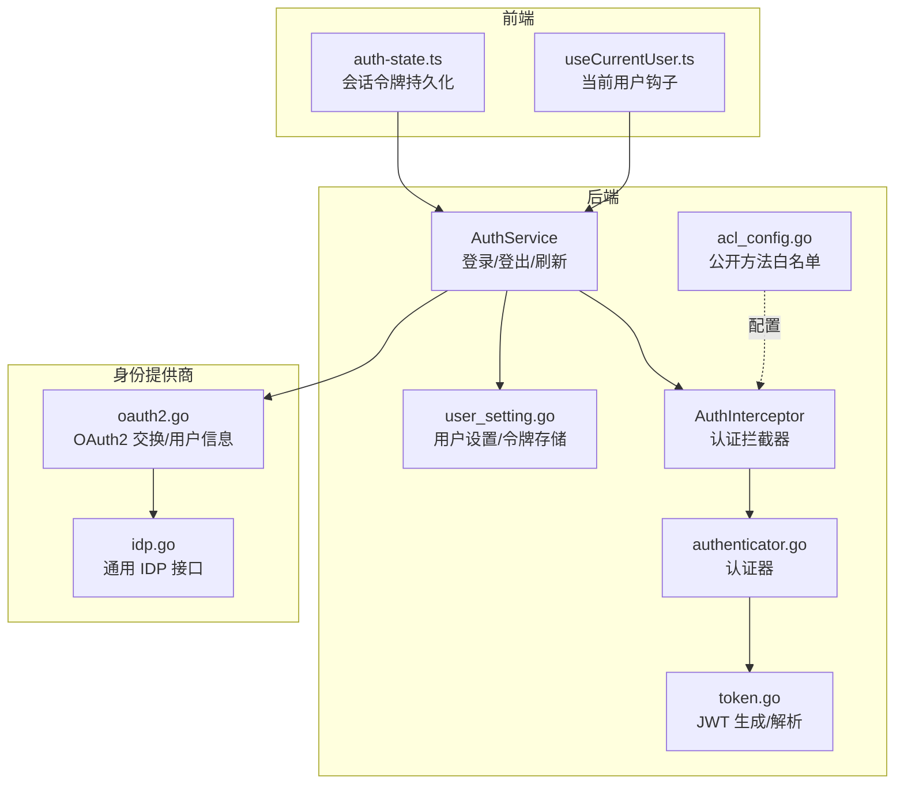
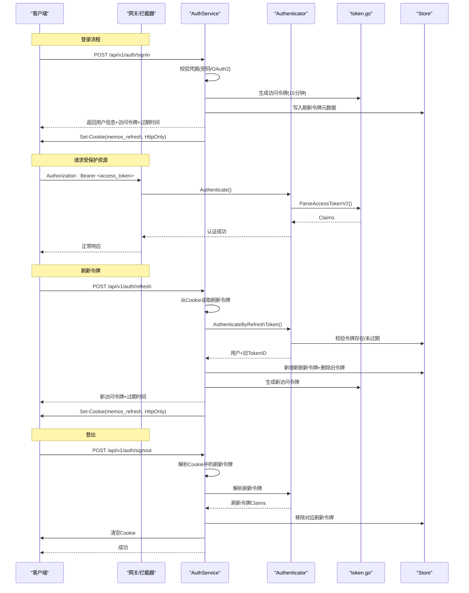
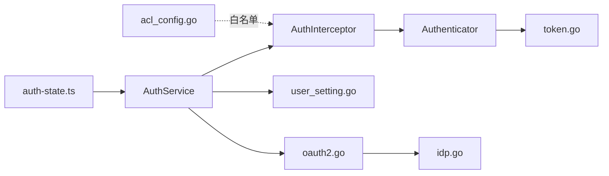

# 认证接口

<cite>
**本文引用的文件**
- [auth_service.proto](file://proto/api/v1/auth_service.proto)
- [auth_service.go](file://server/router/api/v1/auth_service.go)
- [token.go](file://server/auth/token.go)
- [authenticator.go](file://server/auth/authenticator.go)
- [connect_interceptors.go](file://server/router/api/v1/connect_interceptors.go)
- [acl_config.go](file://server/router/api/v1/acl_config.go)
- [user_setting.go](file://store/user_setting.go)
- [user.go](file://store/user.go)
- [oauth2.go](file://plugin/idp/oauth2/oauth2.go)
- [idp.go](file://plugin/idp/idp.go)
- [auth-state.ts](file://web/src/auth-state.ts)
- [useCurrentUser.ts](file://web/src/hooks/useCurrentUser.ts)
</cite>

## 目录
1. [简介](#简介)
2. [项目结构](#项目结构)
3. [核心组件](#核心组件)
4. [架构总览](#架构总览)
5. [详细组件分析](#详细组件分析)
6. [依赖关系分析](#依赖关系分析)
7. [性能考量](#性能考量)
8. [故障排查指南](#故障排查指南)
9. [结论](#结论)
10. [附录](#附录)

## 简介
本文件为认证与授权 API 的权威文档，覆盖以下主题：
- 用户登录、登出、令牌刷新与会话管理的接口规范
- 多种认证方式：密码认证、OAuth2（含 PKCE）、SSO 身份提供商
- JWT 令牌结构、有效期管理与安全策略
- 认证中间件的配置与使用示例
- 权限检查、角色管理与访问控制的实现细节

## 项目结构
认证相关能力由后端 gRPC/Connect 服务、认证中间件、令牌生成与校验模块、存储层用户设置以及前端认证状态管理共同组成。

图表来源
- [auth_service.go](file://server/router/api/v1/auth_service.go#L32-L357)
- [connect_interceptors.go](file://server/router/api/v1/connect_interceptors.go#L201-L274)
- [token.go](file://server/auth/token.go#L25-L250)
- [authenticator.go](file://server/auth/authenticator.go#L17-L166)
- [user_setting.go](file://store/user_setting.go#L125-L199)
- [acl_config.go](file://server/router/api/v1/acl_config.go#L11-L42)
- [oauth2.go](file://plugin/idp/oauth2/oauth2.go#L19-L135)
- [idp.go](file://plugin/idp/idp.go#L1-L9)
- [auth-state.ts](file://web/src/auth-state.ts#L1-L74)
- [useCurrentUser.ts](file://web/src/hooks/useCurrentUser.ts#L1-L9)

章节来源
- [auth_service.go](file://server/router/api/v1/auth_service.go#L32-L357)
- [connect_interceptors.go](file://server/router/api/v1/connect_interceptors.go#L201-L274)
- [token.go](file://server/auth/token.go#L25-L250)
- [authenticator.go](file://server/auth/authenticator.go#L17-L166)
- [user_setting.go](file://store/user_setting.go#L125-L199)
- [acl_config.go](file://server/router/api/v1/acl_config.go#L11-L42)
- [oauth2.go](file://plugin/idp/oauth2/oauth2.go#L19-L135)
- [idp.go](file://plugin/idp/idp.go#L1-L9)
- [auth-state.ts](file://web/src/auth-state.ts#L1-L74)
- [useCurrentUser.ts](file://web/src/hooks/useCurrentUser.ts#L1-L9)

## 核心组件
- 认证服务（AuthService）：提供登录、登出、刷新令牌等接口；返回短期访问令牌与过期时间，并通过 HttpOnly Cookie 设置长期刷新令牌。
- 认证中间件（AuthInterceptor）：统一处理 Authorization 头，支持 JWT 访问令牌与个人访问令牌（PAT），并将用户上下文注入到请求上下文中。
- 令牌模块（token.go）：定义 JWT 结构、签名算法、受众、发行者、有效期常量，以及访问令牌与刷新令牌的生成与解析函数。
- 认证器（authenticator.go）：封装认证逻辑，支持基于访问令牌的无状态验证与基于刷新令牌的有状态校验。
- 存储层（user_setting.go）：维护用户的刷新令牌与个人访问令牌列表，支持添加、移除、按 ID 查询与 PAT 最后使用时间更新。
- 公开方法白名单（acl_config.go）：声明无需认证即可访问的端点，确保登录/刷新等流程在未登录状态下可用。
- OAuth2 插件（oauth2.go）：支持 OAuth2 授权码交换、PKCE（code_verifier）与用户信息映射。
- 前端认证状态（auth-state.ts）：在浏览器中以 sessionStorage 持久化短期访问令牌与过期时间，避免页面刷新时重复登录。

章节来源
- [auth_service.proto](file://proto/api/v1/auth_service.proto#L13-L46)
- [auth_service.go](file://server/router/api/v1/auth_service.go#L32-L357)
- [connect_interceptors.go](file://server/router/api/v1/connect_interceptors.go#L201-L274)
- [token.go](file://server/auth/token.go#L25-L250)
- [authenticator.go](file://server/auth/authenticator.go#L17-L166)
- [user_setting.go](file://store/user_setting.go#L125-L199)
- [acl_config.go](file://server/router/api/v1/acl_config.go#L11-L42)
- [oauth2.go](file://plugin/idp/oauth2/oauth2.go#L43-L78)
- [auth-state.ts](file://web/src/auth-state.ts#L1-L74)

## 架构总览
下图展示从客户端到后端认证链路的整体交互：

图表来源
- [auth_service.go](file://server/router/api/v1/auth_service.go#L64-L190)
- [auth_service.go](file://server/router/api/v1/auth_service.go#L288-L357)
- [auth_service.go](file://server/router/api/v1/auth_service.go#L245-L270)
- [connect_interceptors.go](file://server/router/api/v1/connect_interceptors.go#L216-L242)
- [authenticator.go](file://server/auth/authenticator.go#L39-L99)
- [token.go](file://server/auth/token.go#L133-L187)
- [user_setting.go](file://store/user_setting.go#L140-L185)

## 详细组件分析

### 接口规范与行为
- 获取当前用户
  - 方法：GET /api/v1/auth/me
  - 认证：需要有效访问令牌
  - 行为：解析令牌，查询用户并返回用户信息；若用户不存在则清理认证 Cookie 并返回未认证错误
- 用户登录
  - 方法：POST /api/v1/auth/signin
  - 支持两种凭据：
    - 密码认证：用户名 + 密码
    - SSO/OAuth2：授权码 + 重定向地址 + 可选 code_verifier（PKCE）
  - 行为：校验凭据，必要时创建用户，生成访问令牌与刷新令牌，写入 Cookie
- 用户登出
  - 方法：POST /api/v1/auth/signout
  - 行为：尝试解析 Cookie 中的刷新令牌，撤销对应刷新令牌，清除 Cookie
- 刷新访问令牌
  - 方法：POST /api/v1/auth/refresh
  - 行为：从 Cookie 读取刷新令牌，数据库校验有效性，执行“刷新令牌轮换”（旋转+滑动窗口），返回新的短期访问令牌

章节来源
- [auth_service.proto](file://proto/api/v1/auth_service.proto#L17-L45)
- [auth_service.go](file://server/router/api/v1/auth_service.go#L32-L53)
- [auth_service.go](file://server/router/api/v1/auth_service.go#L64-L190)
- [auth_service.go](file://server/router/api/v1/auth_service.go#L245-L270)
- [auth_service.go](file://server/router/api/v1/auth_service.go#L288-L357)

### 令牌结构与有效期
- 发行者与受众
  - 发行者：固定值
  - 访问令牌受众：用于 API 访问
  - 刷新令牌受众：用于令牌刷新
- 访问令牌
  - 类型：access
  - 有效期：15 分钟
  - 包含字段：用户标识、角色、状态、用户名等自定义声明
- 刷新令牌
  - 类型：refresh
  - 有效期：30 天
  - 包含字段：用户标识、令牌 ID（用于撤销与定位）
- 个人访问令牌（PAT）
  - 前缀：固定前缀
  - 存储：以哈希形式保存于用户设置，支持到期时间与最后使用时间记录

章节来源
- [token.go](file://server/auth/token.go#L25-L86)
- [token.go](file://server/auth/token.go#L133-L187)
- [user_setting.go](file://store/user_setting.go#L201-L287)

### 认证中间件与公开方法
- 认证中间件
  - 从 Authorization 头提取令牌，优先尝试访问令牌（JWT），再尝试 PAT
  - 对非公开方法强制要求有效凭证
  - 将用户上下文注入请求上下文，供后续业务逻辑使用
- 公开方法白名单
  - 登录、刷新令牌、实例信息、用户公开资料、身份提供商列表、公开 Memo 列表等无需认证
  - 该清单是“单一事实源”，拦截器与网关均依赖此配置

章节来源
- [connect_interceptors.go](file://server/router/api/v1/connect_interceptors.go#L201-L274)
- [acl_config.go](file://server/router/api/v1/acl_config.go#L11-L42)

### 会话管理与 Cookie 安全
- 刷新令牌 Cookie
  - 名称：固定名称
  - 属性：HttpOnly、路径 /、根据是否 HTTPS 设置 SameSite/Lax 与 Secure
  - 过期：30 天
- 登录/刷新后，服务端会设置新的刷新令牌 Cookie；登出时清空
- 前端访问令牌采用 sessionStorage 持久化，页面刷新仍保持会话，但关闭标签页即失效

章节来源
- [token.go](file://server/auth/token.go#L48-L53)
- [auth_service.go](file://server/router/api/v1/auth_service.go#L369-L401)
- [auth_service.go](file://server/router/api/v1/auth_service.go#L245-L270)
- [auth_state.ts](file://web/src/auth-state.ts#L1-L74)

### 多种认证方式
- 密码认证
  - 校验用户名是否存在与密码哈希匹配
  - 受实例设置限制：普通用户可能被禁止使用密码登录
- OAuth2/SSO
  - 通过授权码交换获取访问令牌，支持 PKCE（code_verifier）
  - 从用户信息接口映射标识符、显示名、邮箱、头像等
  - 支持标识符过滤正则，仅允许特定范围的用户注册/登录
- LDAP
  - 当前仓库未发现专用 LDAP 插件实现；可通过通用 IDP 接口扩展或在上游实现后接入

章节来源
- [auth_service.go](file://server/router/api/v1/auth_service.go#L67-L171)
- [oauth2.go](file://plugin/idp/oauth2/oauth2.go#L43-L78)
- [oauth2.go](file://plugin/idp/oauth2/oauth2.go#L80-L134)
- [idp.go](file://plugin/idp/idp.go#L1-L9)

### 权限检查、角色管理与访问控制
- 角色类型
  - HOST、ADMIN、USER
- 权限模型
  - 认证拦截器负责“是否已认证”
  - 角色与更细粒度的资源权限通常在服务层进行检查（例如管理员操作）
- 前端辅助
  - 提供判断超级用户的工具函数，便于 UI 控制显隐

章节来源
- [user.go](file://store/user.go#L10-L28)
- [connect_interceptors.go](file://server/router/api/v1/connect_interceptors.go#L221-L241)
- [useCurrentUser.ts](file://web/src/hooks/useCurrentUser.ts#L1-L9)

## 依赖关系分析

图表来源
- [auth_service.go](file://server/router/api/v1/auth_service.go#L32-L357)
- [connect_interceptors.go](file://server/router/api/v1/connect_interceptors.go#L201-L274)
- [authenticator.go](file://server/auth/authenticator.go#L17-L166)
- [token.go](file://server/auth/token.go#L25-L250)
- [user_setting.go](file://store/user_setting.go#L125-L199)
- [oauth2.go](file://plugin/idp/oauth2/oauth2.go#L19-L135)
- [idp.go](file://plugin/idp/idp.go#L1-L9)
- [acl_config.go](file://server/router/api/v1/acl_config.go#L11-L42)
- [auth-state.ts](file://web/src/auth-state.ts#L1-L74)

## 性能考量
- 访问令牌为无状态 JWT，解析仅需签名验证，避免每次请求访问数据库
- 刷新令牌采用有状态校验，需查询用户设置中的令牌列表，建议对用户设置做缓存
- 刷新令牌轮换采用“先新增、后删除”的顺序，降低并发场景下的竞态风险
- 前端使用 sessionStorage 缓存访问令牌，减少频繁刷新带来的网络开销

## 故障排查指南
- 401 未认证
  - 检查 Authorization 头是否正确携带 Bearer 令牌
  - 若使用刷新令牌流程，确认浏览器已正确接收并保存 HttpOnly Cookie
- 403 权限不足
  - 确认用户角色与目标资源的访问权限
  - 检查实例设置是否禁用了密码登录或用户注册
- 刷新失败
  - 确认 Cookie 中 memos_refresh 是否存在且未过期
  - 核对刷新令牌是否已被撤销（例如用户登出或异地登录导致的轮换）
- OAuth2 登录异常
  - 检查授权码是否有效、重定向地址与 code_verifier 是否匹配
  - 确认用户信息接口返回的标识符字段映射正确

章节来源
- [auth_service.go](file://server/router/api/v1/auth_service.go#L288-L357)
- [authenticator.go](file://server/auth/authenticator.go#L60-L99)
- [oauth2.go](file://plugin/idp/oauth2/oauth2.go#L43-L78)

## 结论
本认证体系以 JWT 为核心，结合刷新令牌轮换与滑动窗口会话，兼顾安全性与用户体验。通过统一的认证中间件与公开方法白名单，确保登录、刷新与部分公开接口的可用性。OAuth2/SSO 已完整支持，LDAP 可通过通用 IDP 接口扩展。前端采用 sessionStorage 管理短期访问令牌，配合服务端 Cookie 管理刷新令牌，形成完整的会话生命周期管理。

## 附录

### API 定义概览
- GET /api/v1/auth/me
  - 认证：需要访问令牌
  - 返回：当前用户信息
- POST /api/v1/auth/signin
  - 认证：无需
  - 请求体：密码凭据或 SSO 凭据（含 code、redirect_uri、可选 code_verifier）
  - 返回：用户信息、短期访问令牌、访问令牌过期时间
- POST /api/v1/auth/signout
  - 认证：需要访问令牌
  - 行为：撤销刷新令牌并清除 Cookie
- POST /api/v1/auth/refresh
  - 认证：无需（但需有效刷新令牌 Cookie）
  - 行为：轮换刷新令牌并返回新的短期访问令牌

章节来源
- [auth_service.proto](file://proto/api/v1/auth_service.proto#L17-L45)
- [auth_service.go](file://server/router/api/v1/auth_service.go#L64-L190)
- [auth_service.go](file://server/router/api/v1/auth_service.go#L245-L270)
- [auth_service.go](file://server/router/api/v1/auth_service.go#L288-L357)