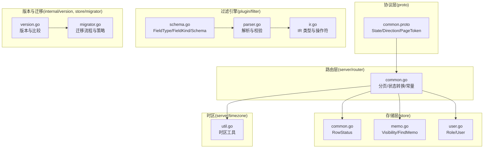
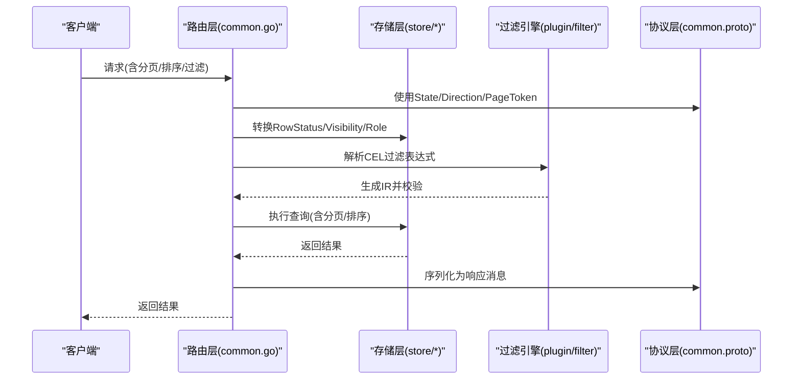
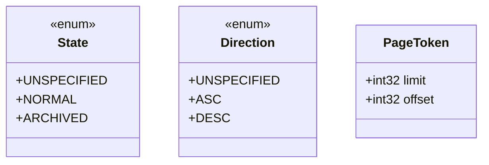
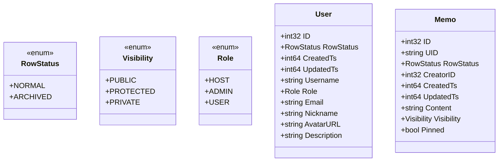
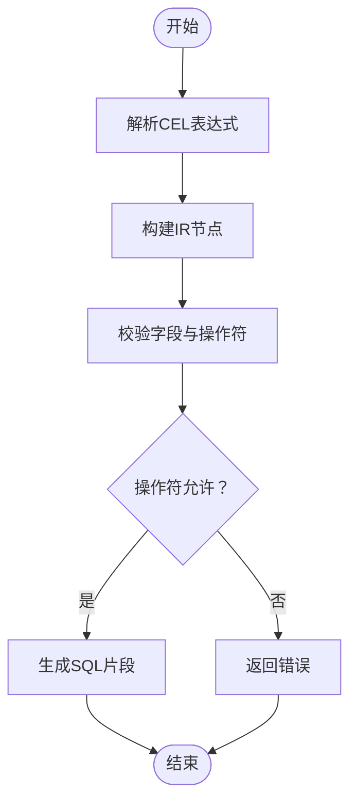
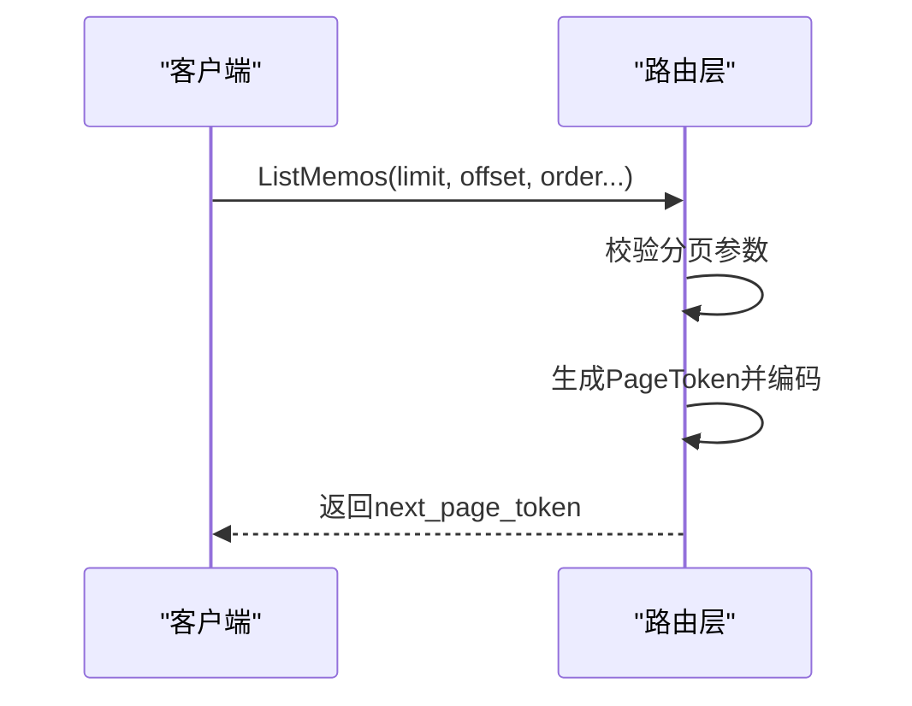
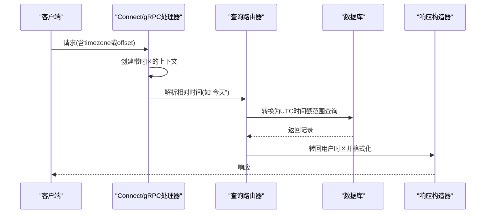
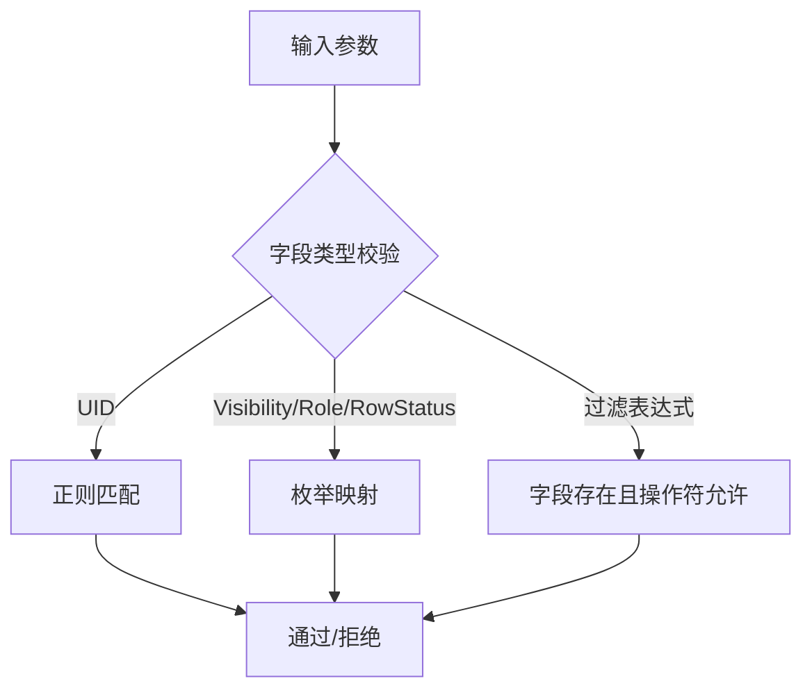
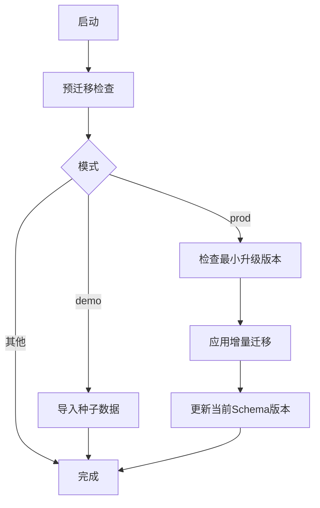
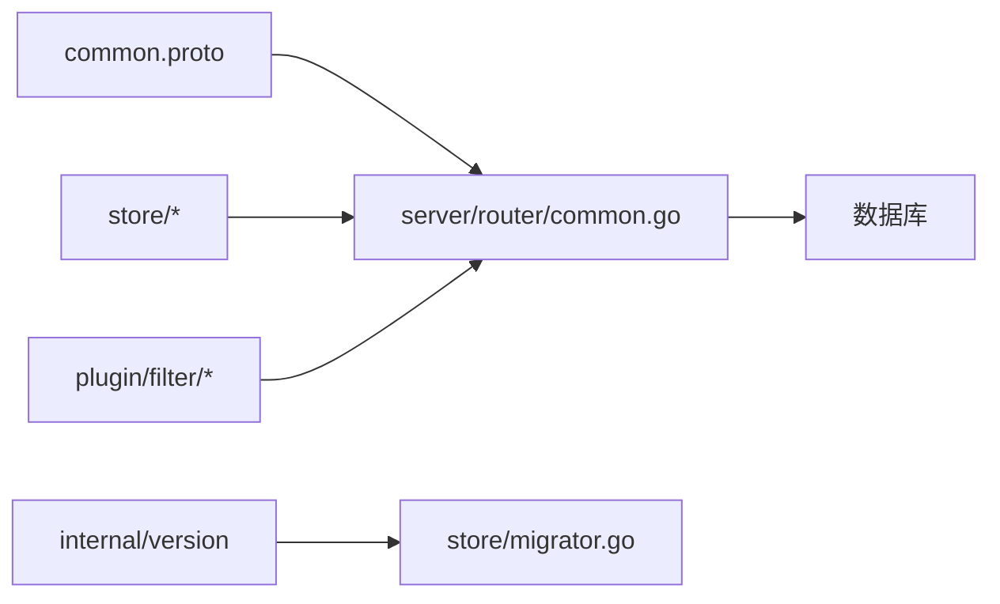

# 通用类型定义

<cite>
**本文引用的文件**
- [common.proto](file://proto/api/v1/common.proto)
- [common.go](file://server/router/api/v1/common.go)
- [store/common.go](file://store/common.go)
- [store/memo.go](file://store/memo.go)
- [store/user.go](file://store/user.go)
- [internal/base/resource_name.go](file://internal/base/resource_name.go)
- [plugin/filter/schema.go](file://plugin/filter/schema.go)
- [plugin/filter/ir.go](file://plugin/filter/ir.go)
- [plugin/filter/parser.go](file://plugin/filter/parser.go)
- [server/service/schedule/constants.go](file://server/service/schedule/constants.go)
- [internal/version/version.go](file://internal/version/version.go)
- [store/migrator.go](file://store/migrator.go)
- [server/timezone/util.go](file://server/timezone/util.go)
- [server/timezone/util_test.go](file://server/timezone/util_test.go)
- [docs/archived/cleanup_20260123/chat_audit_fixes/specs/TIMEZONE_UNIFICATION.md](file://docs/archived/cleanup_20260123/chat_audit_fixes/specs/TIMEZONE_UNIFICATION.md)
</cite>

## 目录
1. [简介](#简介)
2. [项目结构](#项目结构)
3. [核心组件](#核心组件)
4. [架构总览](#架构总览)
5. [详细组件分析](#详细组件分析)
6. [依赖关系分析](#依赖关系分析)
7. [性能考量](#性能考量)
8. [故障排查指南](#故障排查指南)
9. [结论](#结论)
10. [附录](#附录)

## 简介
本文件系统性梳理了服务间共享的通用数据类型、消息格式、枚举与常量定义，并给出时间戳格式、分页参数、排序与过滤条件的标准规范。同时覆盖数据验证规则、字段约束、业务规则、类型转换示例与最佳实践，并提供版本兼容性与迁移策略说明，帮助前后端与插件在统一契约下协作。

## 项目结构
围绕通用类型与消息格式，主要涉及以下层次：
- 协议层：proto 定义通用枚举与消息体
- 路由层：将存储层领域模型映射到协议层消息
- 存储层：领域类型、状态与校验规则
- 过滤引擎：基于 CEL 的过滤表达式与 IR
- 时区工具：统一时间处理与转换
- 版本与迁移：语义化版本与数据库迁移策略

**图表来源**
- [common.proto](file://proto/api/v1/common.proto#L1-L24)
- [common.go](file://server/router/api/v1/common.go#L1-L69)
- [store/common.go](file://store/common.go#L1-L25)
- [store/memo.go](file://store/memo.go#L1-L160)
- [store/user.go](file://store/user.go#L1-L162)
- [plugin/filter/schema.go](file://plugin/filter/schema.go#L1-L313)
- [plugin/filter/ir.go](file://plugin/filter/ir.go#L1-L116)
- [plugin/filter/parser.go](file://plugin/filter/parser.go#L109-L156)
- [server/timezone/util.go](file://server/timezone/util.go)
- [internal/version/version.go](file://internal/version/version.go#L1-L61)
- [store/migrator.go](file://store/migrator.go#L1-L415)

**章节来源**
- [common.proto](file://proto/api/v1/common.proto#L1-L24)
- [common.go](file://server/router/api/v1/common.go#L1-L69)
- [store/common.go](file://store/common.go#L1-L25)
- [store/memo.go](file://store/memo.go#L1-L160)
- [store/user.go](file://store/user.go#L1-L162)
- [plugin/filter/schema.go](file://plugin/filter/schema.go#L1-L313)
- [plugin/filter/ir.go](file://plugin/filter/ir.go#L1-L116)
- [plugin/filter/parser.go](file://plugin/filter/parser.go#L109-L156)
- [server/timezone/util.go](file://server/timezone/util.go)
- [internal/version/version.go](file://internal/version/version.go#L1-L61)
- [store/migrator.go](file://store/migrator.go#L1-L415)

## 核心组件
- 通用枚举与消息
  - State：NORMAL/ARCHIVED；Direction：ASC/DESC；PageToken：limit/offset
  - 分页常量：DefaultPageSize/MaxPageSize
- 存储层领域类型
  - RowStatus：NORMAL/ARCHIVED
  - Visibility：PUBLIC/PROTECTED/PRIVATE
  - Role：HOST/ADMIN/USER
- 过滤引擎类型
  - FieldType/FieldKind/Schema/IR/操作符
- 时区与时间
  - 统一使用 Unix 时间戳（秒），前端传入时区或偏移
- 版本与迁移
  - 语义化版本，迁移文件命名与应用策略

**章节来源**
- [common.proto](file://proto/api/v1/common.proto#L7-L23)
- [common.go](file://server/router/api/v1/common.go#L13-L18)
- [store/common.go](file://store/common.go#L12-L20)
- [store/memo.go](file://store/memo.go#L12-L33)
- [store/user.go](file://store/user.go#L7-L28)
- [plugin/filter/schema.go](file://plugin/filter/schema.go#L20-L40)
- [plugin/filter/ir.go](file://plugin/filter/ir.go#L8-L49)
- [server/timezone/util.go](file://server/timezone/util.go)

## 架构总览
通用类型在各层之间的映射与流转如下：

**图表来源**
- [common.go](file://server/router/api/v1/common.go#L20-L64)
- [store/common.go](file://store/common.go#L12-L20)
- [store/memo.go](file://store/memo.go#L12-L33)
- [store/user.go](file://store/user.go#L7-L28)
- [plugin/filter/schema.go](file://plugin/filter/schema.go#L99-L245)
- [plugin/filter/ir.go](file://plugin/filter/ir.go#L1-L116)
- [common.proto](file://proto/api/v1/common.proto#L7-L23)

## 详细组件分析

### 通用枚举与消息
- State/Direction：用于状态与排序方向的跨服务统一表示
- PageToken：内部混淆分页令牌，包含 limit/offset 字段
- 分页常量：DefaultPageSize/MaxPageSize 控制默认与最大分页规模

**图表来源**
- [common.proto](file://proto/api/v1/common.proto#L7-L23)

**章节来源**
- [common.proto](file://proto/api/v1/common.proto#L7-L23)
- [common.go](file://server/router/api/v1/common.go#L13-L18)

### 存储层领域类型
- RowStatus：NORMAL/ARCHIVED，字符串枚举
- Visibility：PUBLIC/PROTECTED/PRIVATE，字符串枚举
- Role：HOST/ADMIN/USER，字符串枚举
- UID 校验：正则约束，确保唯一标识符格式合法

**图表来源**
- [store/common.go](file://store/common.go#L12-L20)
- [store/memo.go](file://store/memo.go#L35-L55)
- [store/user.go](file://store/user.go#L44-L60)
- [internal/base/resource_name.go](file://internal/base/resource_name.go#L5-L7)

**章节来源**
- [store/common.go](file://store/common.go#L12-L20)
- [store/memo.go](file://store/memo.go#L12-L55)
- [store/user.go](file://store/user.go#L7-L60)
- [internal/base/resource_name.go](file://internal/base/resource_name.go#L5-L7)

### 过滤引擎类型与表达式
- FieldType/FieldKind：字段逻辑类型与存储形态
- Schema：字段元数据、方言表达式与允许的操作符
- IR：逻辑运算、比较、IN、Contains、函数等表达式节点
- 解析与校验：对字段与操作符进行合法性检查

**图表来源**
- [plugin/filter/schema.go](file://plugin/filter/schema.go#L48-L87)
- [plugin/filter/ir.go](file://plugin/filter/ir.go#L4-L116)
- [plugin/filter/parser.go](file://plugin/filter/parser.go#L109-L156)

**章节来源**
- [plugin/filter/schema.go](file://plugin/filter/schema.go#L20-L87)
- [plugin/filter/ir.go](file://plugin/filter/ir.go#L8-L116)
- [plugin/filter/parser.go](file://plugin/filter/parser.go#L109-L156)

### 分页与排序标准
- 分页参数
  - limit：本次返回数量上限
  - offset：偏移量
  - 默认与最大分页：DefaultPageSize/MaxPageSize
- 排序选项
  - Direction：ASC/DESC
  - 支持按是否置顶、更新时间、时间升序等组合排序
- 分页令牌
  - 内部使用 PageToken 消息体，经 proto 编码后 base64 序列化

**图表来源**
- [common.go](file://server/router/api/v1/common.go#L40-L64)
- [common.proto](file://proto/api/v1/common.proto#L14-L17)

**章节来源**
- [common.go](file://server/router/api/v1/common.go#L13-L18)
- [common.go](file://server/router/api/v1/common.go#L40-L64)
- [common.proto](file://proto/api/v1/common.proto#L14-L17)

### 时间戳与时间处理
- 时间戳格式
  - 统一使用 Unix 时间戳（秒），数据库以整数存储
- 时区处理
  - 前端传递时区标识或偏移；服务端解析并转换为 UTC 查询
  - 提供常用时区常量与工具函数，避免重复解析
- 文档规范
  - 时区统一方案文档明确了从请求到响应的完整链路

**图表来源**
- [TIMEZONE_UNIFICATION.md](file://docs/archived/cleanup_20260123/chat_audit_fixes/specs/TIMEZONE_UNIFICATION.md#L71-L127)
- [server/timezone/util.go](file://server/timezone/util.go)
- [server/timezone/util_test.go](file://server/timezone/util_test.go#L252-L273)

**章节来源**
- [TIMEZONE_UNIFICATION.md](file://docs/archived/cleanup_20260123/chat_audit_fixes/specs/TIMEZONE_UNIFICATION.md#L71-L127)
- [server/timezone/util.go](file://server/timezone/util.go)
- [server/timezone/util_test.go](file://server/timezone/util_test.go#L252-L273)

### 数据验证规则与字段约束
- UID 格式：正则匹配，确保唯一标识符符合规范
- Memo/UpdateMemo：UID 更新时需再次校验
- Visibility/Role/RowStatus：字符串枚举，转换时进行边界保护
- 过滤表达式：字段与操作符合法性校验，避免非法组合

**图表来源**
- [internal/base/resource_name.go](file://internal/base/resource_name.go#L5-L7)
- [store/memo.go](file://store/memo.go#L110-L137)
- [plugin/filter/parser.go](file://plugin/filter/parser.go#L127-L144)

**章节来源**
- [internal/base/resource_name.go](file://internal/base/resource_name.go#L5-L7)
- [store/memo.go](file://store/memo.go#L110-L137)
- [plugin/filter/parser.go](file://plugin/filter/parser.go#L127-L144)

### 类型转换示例与最佳实践
- 状态转换
  - 存储层 RowStatus 与协议层 State 双向映射，保持默认值安全
- 分页令牌
  - 使用 PageToken 包装 limit/offset，再进行 proto 编码与 base64 序列化
- 角色判断
  - 超级用户判定：ADMIN/HOST
- 最佳实践
  - 严格区分输入/输出字段，避免在请求中设置只读字段
  - 对可选字段使用指针类型，便于判空与选择性更新

**章节来源**
- [common.go](file://server/router/api/v1/common.go#L20-L38)
- [common.go](file://server/router/api/v1/common.go#L40-L64)
- [store/user.go](file://store/user.go#L62-L90)

### 版本兼容性与迁移策略
- 语义化版本
  - 当前版本与开发版本管理，提供版本比较与最小版本判断
- 迁移系统
  - 新安装：直接应用 LATEST.sql
  - 升级：增量迁移，支持降级检测与路径提示
  - Demo：仅支持 SQLite 的种子数据导入
- 版本兼容
  - 旧版本（< 0.22）需先升级至 0.25.3 再升级到当前版本
  - 迁移文件命名规范与顺序保证

**图表来源**
- [store/migrator.go](file://store/migrator.go#L105-L146)
- [store/migrator.go](file://store/migrator.go#L220-L264)
- [store/migrator.go](file://store/migrator.go#L374-L414)
- [internal/version/version.go](file://internal/version/version.go#L17-L44)

**章节来源**
- [internal/version/version.go](file://internal/version/version.go#L10-L44)
- [store/migrator.go](file://store/migrator.go#L21-L42)
- [store/migrator.go](file://store/migrator.go#L105-L146)
- [store/migrator.go](file://store/migrator.go#L220-L264)
- [store/migrator.go](file://store/migrator.go#L374-L414)

## 依赖关系分析
- 路由层依赖协议层的消息与枚举，负责分页与状态转换
- 存储层提供领域类型与校验，路由层将其映射到协议层
- 过滤引擎独立于路由层，但被路由层调用以生成查询条件
- 版本与迁移模块贯穿运行期，保障升级安全

**图表来源**
- [common.proto](file://proto/api/v1/common.proto#L1-L24)
- [common.go](file://server/router/api/v1/common.go#L1-L69)
- [store/migrator.go](file://store/migrator.go#L1-L415)
- [internal/version/version.go](file://internal/version/version.go#L1-L61)

**章节来源**
- [common.proto](file://proto/api/v1/common.proto#L1-L24)
- [common.go](file://server/router/api/v1/common.go#L1-L69)
- [store/migrator.go](file://store/migrator.go#L1-L415)
- [internal/version/version.go](file://internal/version/version.go#L1-L61)

## 性能考量
- 分页限制：合理设置 MaxPageSize，避免一次性返回过多数据
- 过滤表达式：尽量使用索引友好字段与操作符，避免全表扫描
- 时区处理：复用时区常量与缓存，减少重复解析开销
- 迁移事务：批量迁移在单事务内执行，确保原子性与一致性

[本节为通用指导，无需列出具体文件来源]

## 故障排查指南
- 分页异常
  - 检查 limit/offset 是否超过 MaxPageSize，确认 PageToken 编解码流程
- 过滤报错
  - 核对字段是否存在、操作符是否允许，关注虚拟别名解析
- 版本升级失败
  - 查看最小升级版本要求，按提示先升级到中间版本再升级
- 时区问题
  - 确认前端是否传递有效时区，服务端是否正确解析与转换

**章节来源**
- [common.go](file://server/router/api/v1/common.go#L40-L64)
- [plugin/filter/parser.go](file://plugin/filter/parser.go#L127-L144)
- [store/migrator.go](file://store/migrator.go#L374-L414)
- [server/timezone/util_test.go](file://server/timezone/util_test.go#L252-L273)

## 结论
通过统一的协议层消息、明确的领域类型与严格的验证规则，以及完善的分页、排序、过滤、时区与时序处理机制，系统实现了跨服务的一致性与可维护性。配合版本与迁移策略，确保在演进过程中平滑升级、降低风险。

[本节为总结性内容，无需列出具体文件来源]

## 附录
- 常用常量
  - DefaultPageSize/MaxPageSize：控制分页规模
  - DefaultTimezone：默认时区
  - MaxInstances/MaxIterations：调度相关上限
- 关键路径参考
  - 分页令牌生成与解析：[common.go](file://server/router/api/v1/common.go#L40-L64)
  - 状态与角色映射：[common.go](file://server/router/api/v1/common.go#L20-L38)，[store/user.go](file://store/user.go#L7-L28)
  - 过滤表达式解析与校验：[plugin/filter/parser.go](file://plugin/filter/parser.go#L109-L156)
  - 迁移流程与版本策略：[store/migrator.go](file://store/migrator.go#L105-L146)，[internal/version/version.go](file://internal/version/version.go#L17-L44)

[本节为补充信息，无需列出具体文件来源]