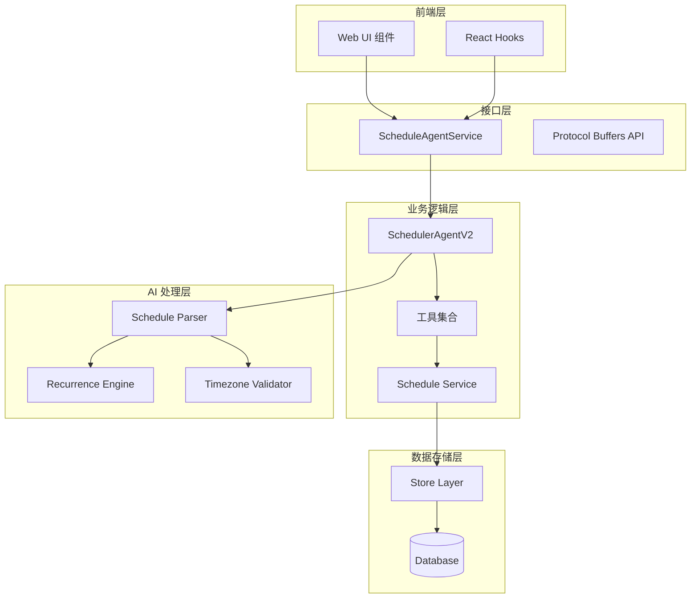
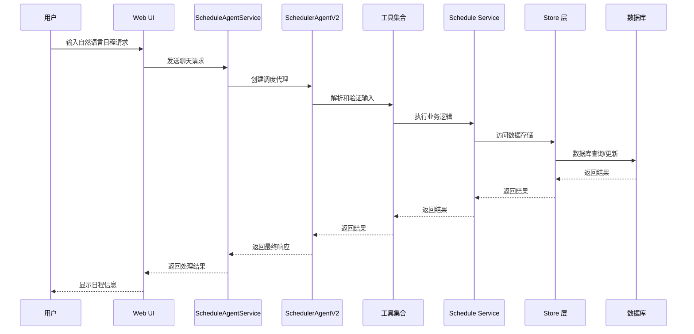
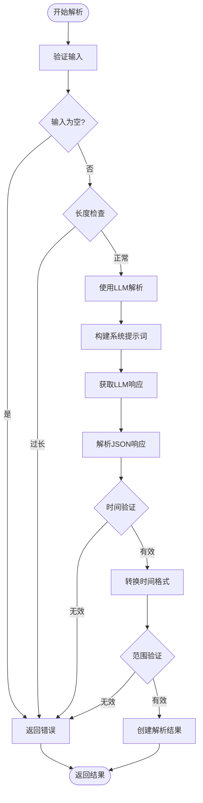
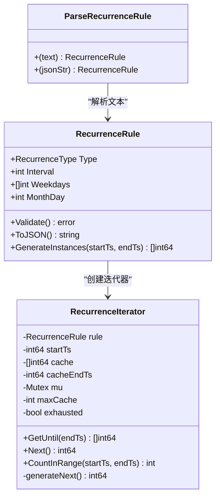
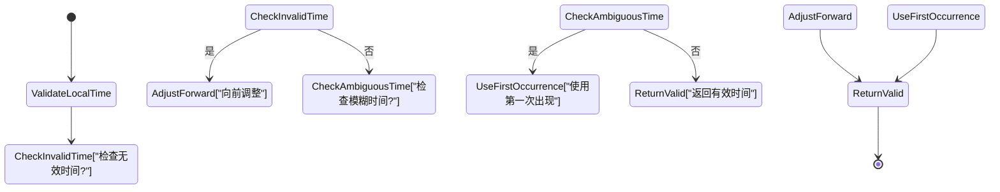
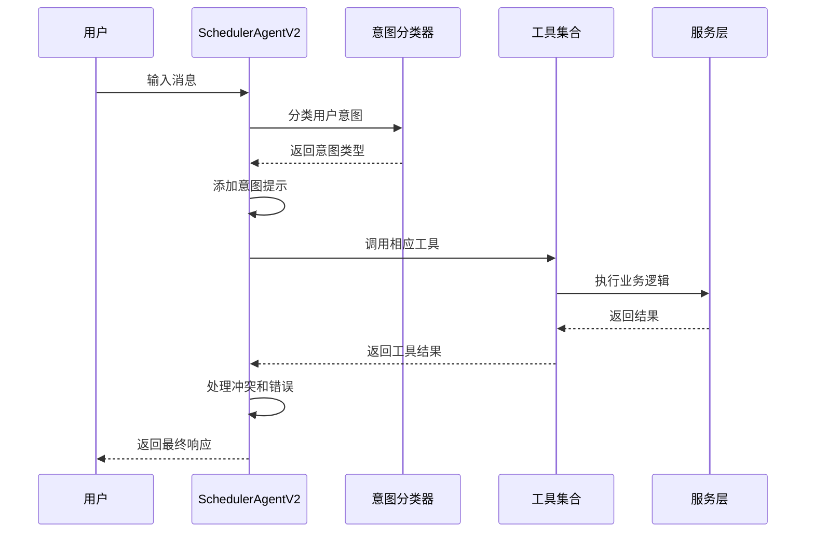
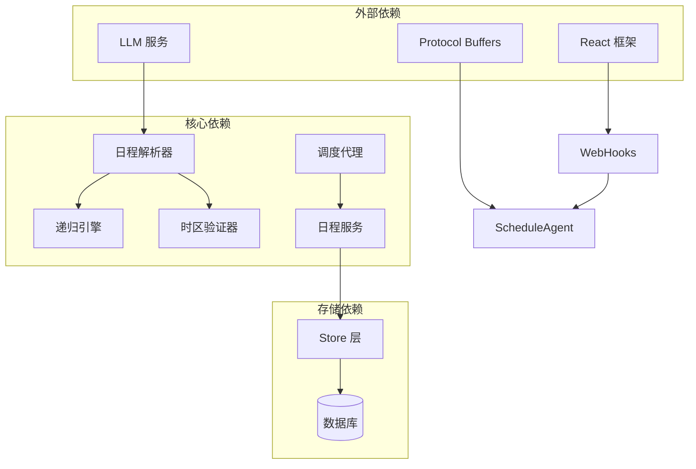

# Schedule AI 组件

<cite>
**本文档引用的文件**
- [plugin/ai/schedule/parser.go](file://plugin/ai/schedule/parser.go)
- [plugin/ai/schedule/recurrence.go](file://plugin/ai/schedule/recurrence.go)
- [plugin/ai/schedule/helpers.go](file://plugin/ai/schedule/helpers.go)
- [plugin/ai/schedule/timezone_validator.go](file://plugin/ai/schedule/timezone_validator.go)
- [plugin/ai/agent/scheduler_v2.go](file://plugin/ai/agent/scheduler_v2.go)
- [plugin/ai/agent/tools/scheduler.go](file://plugin/ai/agent/tools/scheduler.go)
- [server/service/schedule/service.go](file://server/service/schedule/service.go)
- [proto/api/v1/schedule_service.proto](file://proto/api/v1/schedule_service.proto)
- [server/router/api/v1/schedule_agent_service.go](file://server/router/api/v1/schedule_agent_service.go)
- [web/src/hooks/useScheduleAgent.ts](file://web/src/hooks/useScheduleAgent.ts)
- [web/src/types/schedule.ts](file://web/src/types/schedule.ts)
- [web/src/components/ScheduleAI/index.ts](file://web/src/components/ScheduleAI/index.ts)
</cite>

## 目录
1. [简介](#简介)
2. [项目结构](#项目结构)
3. [核心组件](#核心组件)
4. [架构概览](#架构概览)
5. [详细组件分析](#详细组件分析)
6. [依赖关系分析](#依赖关系分析)
7. [性能考虑](#性能考虑)
8. [故障排除指南](#故障排除指南)
9. [结论](#结论)

## 简介

Schedule AI 组件是 Memos 系统中的智能日程管理模块，通过自然语言处理和人工智能技术，为用户提供智能化的日程创建、查询和管理服务。该组件集成了先进的 LLM（大语言模型）技术和复杂的日程调度算法，能够理解和处理各种形式的日程请求。

该系统的核心特点包括：
- 自然语言日程解析和创建
- 智能冲突检测和解决
- 递归日程规则支持
- 时区感知的时间处理
- 生成式用户界面集成
- 流式对话交互体验

## 项目结构

Schedule AI 组件采用分层架构设计，主要分为以下几个层次：

**图表来源**
- [server/router/api/v1/schedule_agent_service.go](file://server/router/api/v1/schedule_agent_service.go#L34-L66)
- [plugin/ai/agent/scheduler_v2.go](file://plugin/ai/agent/scheduler_v2.go#L16-L92)
- [plugin/ai/schedule/parser.go](file://plugin/ai/schedule/parser.go#L22-L47)

**章节来源**
- [server/router/api/v1/schedule_agent_service.go](file://server/router/api/v1/schedule_agent_service.go#L1-L304)
- [plugin/ai/agent/scheduler_v2.go](file://plugin/ai/agent/scheduler_v2.go#L1-L407)

## 核心组件

### 1. 日程解析器 (Schedule Parser)

日程解析器是整个系统的核心组件，负责将用户的自然语言转换为结构化的日程信息。

**主要功能：**
- 自然语言到结构化数据的转换
- 时间戳解析和验证
- 提醒设置提取
- 递归规则识别

**关键特性：**
- 支持多种语言表达方式
- 智能时间推断和修正
- 输入长度限制和安全检查
- UTC 时间格式标准化

### 2. 递归引擎 (Recurrence Engine)

递归引擎处理重复性日程事件，支持日、周、月三种类型的重复模式。

**支持的递归类型：**
- **每日重复**：支持自定义间隔的每日重复
- **每周重复**：支持指定星期几的重复，可包含多个工作日
- **每月重复**：支持固定日期的月度重复

**性能优化：**
- 迭代器模式实现内存高效
- 缓存机制减少重复计算
- 最大实例数量限制防止无限循环

### 3. 时区验证器 (Timezone Validator)

专门处理夏令时转换和时区相关的边界情况。

**处理场景：**
- 夏令时开始时的时间跳跃（春季前进）
- 夏令时结束时的时间重复（秋季回退）
- 无效本地时间的检测和修正

### 4. 调度代理 (Scheduler Agent)

智能调度代理协调各个组件的工作，提供自然的对话式交互体验。

**核心能力：**
- 多轮对话状态管理
- 工具调用编排
- 冲突检测和解决
- 生成式 UI 事件发射

**章节来源**
- [plugin/ai/schedule/parser.go](file://plugin/ai/schedule/parser.go#L21-L76)
- [plugin/ai/schedule/recurrence.go](file://plugin/ai/schedule/recurrence.go#L40-L75)
- [plugin/ai/schedule/timezone_validator.go](file://plugin/ai/schedule/timezone_validator.go#L21-L39)

## 架构概览

Schedule AI 组件采用模块化设计，各组件职责清晰，耦合度低，便于维护和扩展。

**图表来源**
- [server/router/api/v1/schedule_agent_service.go](file://server/router/api/v1/schedule_agent_service.go#L68-L112)
- [plugin/ai/agent/scheduler_v2.go](file://plugin/ai/agent/scheduler_v2.go#L160-L208)

**章节来源**
- [server/router/api/v1/schedule_agent_service.go](file://server/router/api/v1/schedule_agent_service.go#L33-L112)
- [plugin/ai/agent/scheduler_v2.go](file://plugin/ai/agent/scheduler_v2.go#L16-L92)

## 详细组件分析

### 日程解析器详细分析

日程解析器是系统中最复杂的组件之一，负责处理各种自然语言输入格式。

**图表来源**
- [plugin/ai/schedule/parser.go](file://plugin/ai/schedule/parser.go#L62-L76)
- [plugin/ai/schedule/parser.go](file://plugin/ai/schedule/parser.go#L91-L348)

**解析流程的关键步骤：**

1. **输入验证**：检查空输入和长度限制
2. **LLM 集成**：使用预定义的系统提示词指导解析
3. **JSON 解析**：从 LLM 响应中提取结构化数据
4. **时间验证**：确保时间格式正确且在合理范围内
5. **格式转换**：将本地时间转换为 UTC 格式

### 递归引擎详细分析

递归引擎采用迭代器模式实现，提供高效的内存使用和灵活的查询能力。

**图表来源**
- [plugin/ai/schedule/recurrence.go](file://plugin/ai/schedule/recurrence.go#L40-L75)
- [plugin/ai/schedule/recurrence.go](file://plugin/ai/schedule/recurrence.go#L341-L363)

**递归规则支持：**

| 规则类型 | 示例 | 描述 |
|---------|------|------|
| daily | "每天" | 每日重复，间隔默认为1天 |
| daily | "每3天" | 每3天重复 |
| weekly | "每周" | 每周重复，工作日（周一至周五） |
| weekly | "每周一" | 每周一重复 |
| weekly | "每两周" | 每2周重复 |
| monthly | "每月15号" | 每月15日重复 |
| monthly | "每月1号" | 每月1日重复 |

### 时区验证器详细分析

时区验证器专门处理夏令时转换中的复杂情况。

**图表来源**
- [plugin/ai/schedule/timezone_validator.go](file://plugin/ai/schedule/timezone_validator.go#L57-L96)

**处理的时区问题：**

1. **春季前进（Spring Forward）**：当 DST 开始时，某些时间不存在
   - 示例：2024年3月10日在America/New_York，2:30 AM不存在
   - 处理：自动调整到3:00 AM

2. **秋季回退（Fall Back）**：当 DST 结束时，某些时间出现两次
   - 示例：2024年11月3日，1:30 AM出现两次
   - 处理：使用第一次出现的时间

### 调度代理详细分析

调度代理是系统的智能协调者，负责管理多轮对话和工具调用。

**图表来源**
- [plugin/ai/agent/scheduler_v2.go](file://plugin/ai/agent/scheduler_v2.go#L166-L208)

**意图分类支持：**

| 意图类型 | 描述 | 工具调用序列 |
|---------|------|-------------|
| IntentSimpleCreate | 简单创建 | schedule_query → schedule_add |
| IntentSimpleQuery | 简单查询 | schedule_query |
| IntentSimpleUpdate | 简单更新 | schedule_query → schedule_update |
| IntentBatchCreate | 批量创建 | schedule_query → find_free_time → schedule_add |
| IntentConflictResolve | 冲突解决 | schedule_query → find_free_time |
| IntentMultiQuery | 综合查询 | 多种工具组合 |

**章节来源**
- [plugin/ai/agent/scheduler_v2.go](file://plugin/ai/agent/scheduler_v2.go#L160-L407)
- [plugin/ai/agent/tools/scheduler.go](file://plugin/ai/agent/tools/scheduler.go#L132-L800)

## 依赖关系分析

Schedule AI 组件的依赖关系呈现清晰的分层结构，从底层的数据访问到顶层的用户界面都有明确的职责划分。

**图表来源**
- [plugin/ai/schedule/parser.go](file://plugin/ai/schedule/parser.go#L22-L24)
- [plugin/ai/agent/scheduler_v2.go](file://plugin/ai/agent/scheduler_v2.go#L19-L25)
- [server/service/schedule/service.go](file://server/service/schedule/service.go#L22-L25)

**主要依赖关系：**

1. **LLM 服务依赖**：日程解析完全依赖于外部 LLM 服务进行自然语言理解
2. **协议缓冲区依赖**：前后端通信使用 Protocol Buffers 定义的标准接口
3. **React 生态依赖**：前端使用现代 React 技术栈和相关工具库
4. **数据库抽象层**：通过 Store 层实现数据库无关的数据访问

**章节来源**
- [proto/api/v1/schedule_service.proto](file://proto/api/v1/schedule_service.proto#L1-L166)
- [server/service/schedule/service.go](file://server/service/schedule/service.go#L13-L26)

## 性能考虑

### 内存优化策略

1. **递归迭代器模式**：使用迭代器而非一次性生成所有实例，避免内存溢出
2. **缓存机制**：时区位置信息缓存，减少重复的时区解析开销
3. **连接池管理**：数据库连接池配置，避免频繁的连接创建销毁

### 计算优化策略

1. **索引冲突检测**：使用小时级索引快速查找潜在冲突
2. **批量查询**：递归冲突检查使用批量查询减少数据库往返
3. **最大实例限制**：防止无限递归导致的性能问题

### 网络优化策略

1. **流式响应**：支持流式传输，提升用户体验
2. **事件驱动**：使用事件机制减少不必要的数据传输
3. **压缩传输**：对传输的数据进行适当的压缩

## 故障排除指南

### 常见问题及解决方案

**1. 日程创建失败（冲突）**
- **症状**：收到"日程冲突"错误
- **原因**：目标时间段已有其他日程
- **解决方案**：使用 `find_free_time` 工具查找可用时间段

**2. 时间解析错误**
- **症状**：LLM 响应无法解析为有效时间
- **原因**：自然语言表达不清晰或格式不正确
- **解决方案**：提供更明确的时间描述，如"明天下午3点"

**3. 递归规则无效**
- **症状**：递归日程无法正确生成实例
- **原因**：递归规则语法错误
- **解决方案**：检查递归规则格式，参考支持的规则类型

**4. 时区相关问题**
- **症状**：时间显示与预期不符
- **原因**：时区设置或夏令时转换问题
- **解决方案**：确认用户时区设置，系统会自动处理时区转换

### 调试技巧

1. **启用详细日志**：查看后端日志了解具体的执行过程
2. **检查 LLM 响应**：验证自然语言解析的准确性
3. **验证数据库约束**：确认冲突检测逻辑是否正常工作
4. **测试工具独立运行**：分别测试各个工具的功能

**章节来源**
- [server/service/schedule/service.go](file://server/service/schedule/service.go#L37-L41)
- [plugin/ai/agent/tools/scheduler.go](file://plugin/ai/agent/tools/scheduler.go#L528-L648)

## 结论

Schedule AI 组件是一个高度集成的智能日程管理系统，通过精心设计的架构和先进的技术实现了以下目标：

**技术优势：**
- **自然语言处理**：能够理解复杂的日程请求表达
- **智能冲突检测**：自动检测和解决时间冲突
- **递归日程支持**：完整的重复日程规则处理
- **时区感知**：准确处理各种时区和夏令时转换
- **生成式 UI**：提供直观的用户交互体验

**架构特点：**
- **模块化设计**：各组件职责清晰，易于维护和扩展
- **分层架构**：清晰的抽象层次，降低耦合度
- **性能优化**：采用多种优化策略确保系统性能
- **错误处理**：完善的错误处理和恢复机制

**未来发展方向：**
- **多语言支持**：扩展对更多语言的支持
- **机器学习增强**：引入机器学习算法提升解析准确性
- **移动端优化**：针对移动设备优化用户体验
- **集成扩展**：支持与其他日历系统的集成

该组件为 Memos 系统提供了强大的智能日程管理能力，显著提升了用户的工作效率和体验质量。