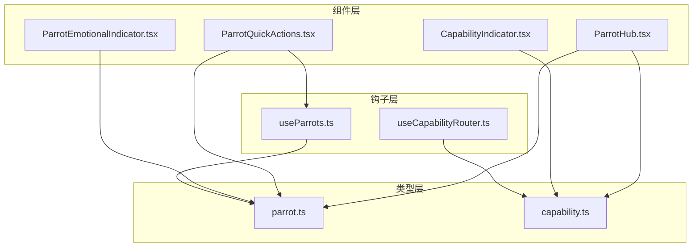
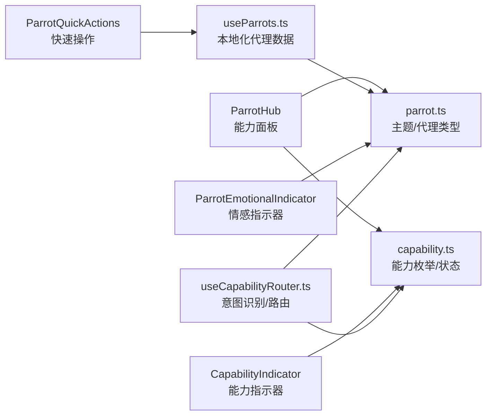
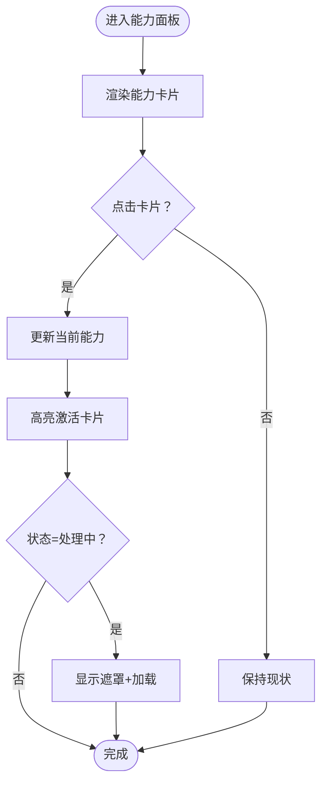
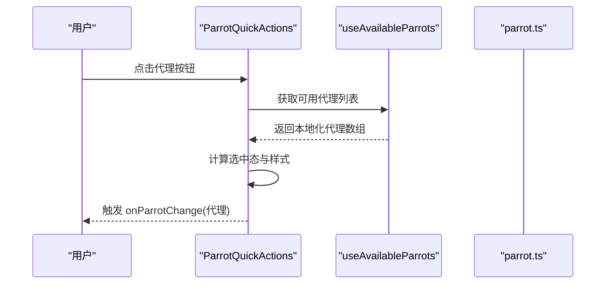
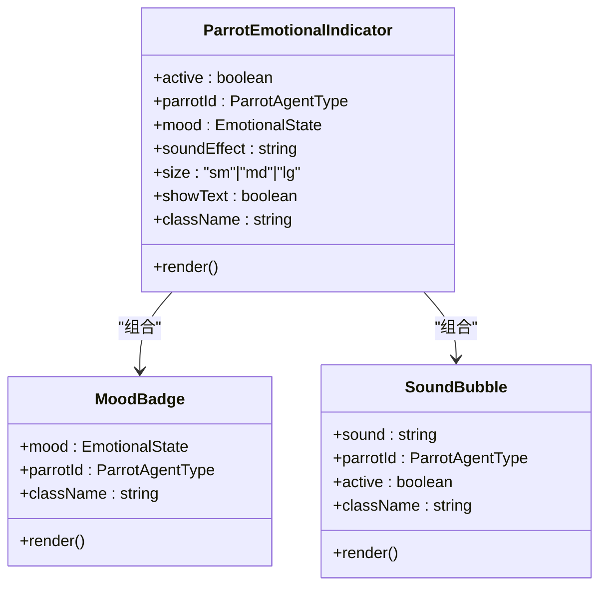
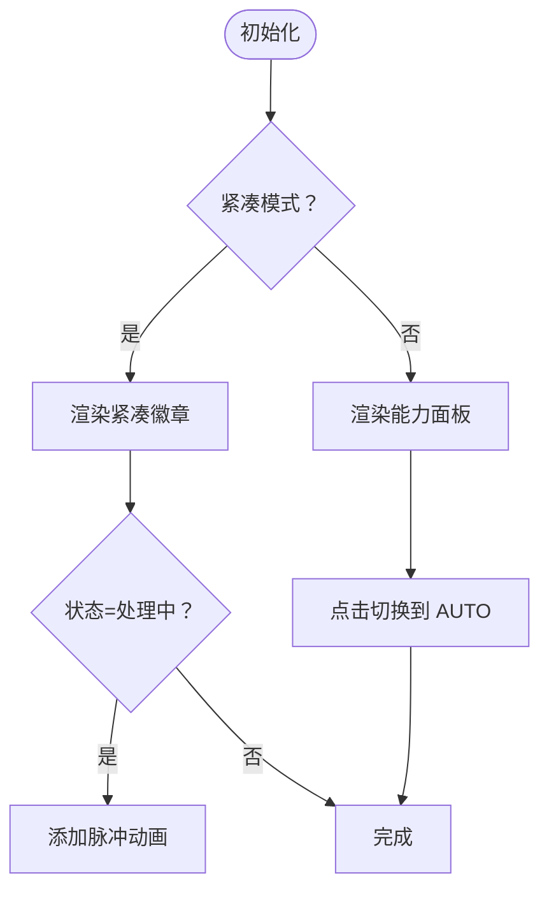
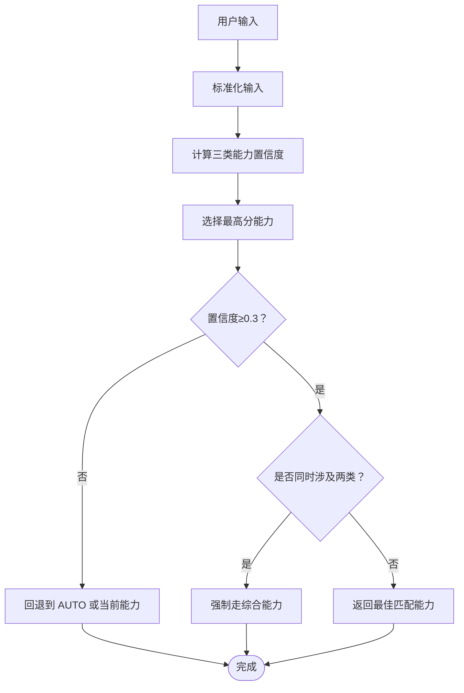
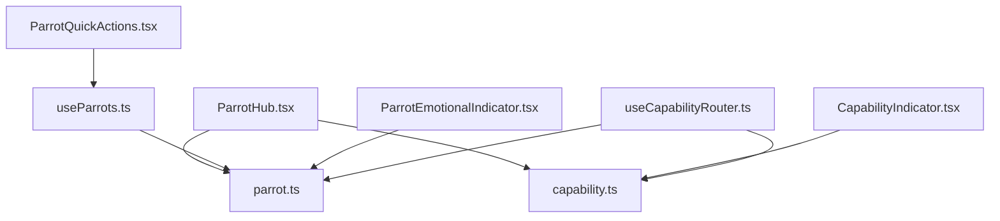

# AI 代理中心组件

<cite>
**本文档引用的文件**
- [ParrotHub.tsx](file://web/src/components/AIChat/ParrotHub.tsx)
- [ParrotQuickActions.tsx](file://web/src/components/AIChat/ParrotQuickActions.tsx)
- [ParrotEmotionalIndicator.tsx](file://web/src/components/AIChat/ParrotEmotionalIndicator.tsx)
- [CapabilityIndicator.tsx](file://web/src/components/AIChat/CapabilityIndicator.tsx)
- [useParrots.ts](file://web/src/hooks/useParrots.ts)
- [useCapabilityRouter.ts](file://web/src/hooks/useCapabilityRouter.ts)
- [parrot.ts](file://web/src/types/parrot.ts)
- [capability.ts](file://web/src/types/capability.ts)
</cite>

## 目录
1. [简介](#简介)
2. [项目结构](#项目结构)
3. [核心组件](#核心组件)
4. [架构总览](#架构总览)
5. [详细组件分析](#详细组件分析)
6. [依赖关系分析](#依赖关系分析)
7. [性能考虑](#性能考虑)
8. [故障排除指南](#故障排除指南)
9. [结论](#结论)

## 简介
本文件系统性梳理 AI 代理中心组件，围绕 Parrot Hub 的架构设计展开，重点覆盖：
- 代理选择界面与能力展示：以卡片形式呈现三类核心能力（笔记、日程、综合），强调当前激活能力与“自动路由”提示。
- 快速操作面板：常用代理切换按钮、快捷指令与批量操作入口。
- 情感指示器：基于情绪状态与代理主题的可视化反馈，含拟声词气泡与紧凑徽章。
- 代理能力指示器：简洁的状态与颜色主题统一，支持内联与面板两种形态。

该组件体系通过类型定义与路由钩子实现前端智能意图识别与能力切换，配合主题系统与本地化资源，提供一致且可扩展的用户体验。

## 项目结构
AI 代理中心相关代码主要位于前端 web/src/components/AIChat 与 web/src/hooks、web/src/types 下，采用按功能模块划分的组织方式：
- 组件层：ParrotHub、ParrotQuickActions、ParrotEmotionalIndicator、CapabilityIndicator
- 钩子层：useParrots、useCapabilityRouter
- 类型层：parrot.ts（代理与主题）、capability.ts（能力与状态）

**图表来源**
- [ParrotHub.tsx](file://web/src/components/AIChat/ParrotHub.tsx#L1-L198)
- [ParrotQuickActions.tsx](file://web/src/components/AIChat/ParrotQuickActions.tsx#L1-L101)
- [ParrotEmotionalIndicator.tsx](file://web/src/components/AIChat/ParrotEmotionalIndicator.tsx#L1-L198)
- [CapabilityIndicator.tsx](file://web/src/components/AIChat/CapabilityIndicator.tsx#L1-L172)
- [useParrots.ts](file://web/src/hooks/useParrots.ts#L1-L65)
- [useCapabilityRouter.ts](file://web/src/hooks/useCapabilityRouter.ts#L1-L229)
- [parrot.ts](file://web/src/types/parrot.ts#L1-L361)
- [capability.ts](file://web/src/types/capability.ts#L1-L160)

**章节来源**
- [ParrotHub.tsx](file://web/src/components/AIChat/ParrotHub.tsx#L1-L198)
- [ParrotQuickActions.tsx](file://web/src/components/AIChat/ParrotQuickActions.tsx#L1-L101)
- [ParrotEmotionalIndicator.tsx](file://web/src/components/AIChat/ParrotEmotionalIndicator.tsx#L1-L198)
- [CapabilityIndicator.tsx](file://web/src/components/AIChat/CapabilityIndicator.tsx#L1-L172)
- [useParrots.ts](file://web/src/hooks/useParrots.ts#L1-L65)
- [useCapabilityRouter.ts](file://web/src/hooks/useCapabilityRouter.ts#L1-L229)
- [parrot.ts](file://web/src/types/parrot.ts#L1-L361)
- [capability.ts](file://web/src/types/capability.ts#L1-L160)

## 核心组件
- ParrotHub（能力面板）：以卡片网格展示三类核心能力，突出当前激活能力与“处理中”状态遮罩，底部提供“自动路由”提示。
- ParrotQuickActions（快速操作面板）：横向滚动的代理切换按钮，支持禁用态与选中态高亮。
- ParrotEmotionalIndicator（情感指示器）：根据情绪状态渲染图标与拟声词气泡，支持多种尺寸与紧凑徽章。
- CapabilityIndicator（能力指示器）：简洁的状态与颜色主题指示，支持内联紧凑与完整面板两种形态。
- useParrots（代理钩子）：提供本地化后的代理数据与可用代理过滤。
- useCapabilityRouter（能力路由钩子）：基于关键词的前端意图识别与能力路由，提供能力与代理类型互转。

**章节来源**
- [ParrotHub.tsx](file://web/src/components/AIChat/ParrotHub.tsx#L73-L198)
- [ParrotQuickActions.tsx](file://web/src/components/AIChat/ParrotQuickActions.tsx#L12-L101)
- [ParrotEmotionalIndicator.tsx](file://web/src/components/AIChat/ParrotEmotionalIndicator.tsx#L78-L198)
- [CapabilityIndicator.tsx](file://web/src/components/AIChat/CapabilityIndicator.tsx#L54-L172)
- [useParrots.ts](file://web/src/hooks/useParrots.ts#L36-L65)
- [useCapabilityRouter.ts](file://web/src/hooks/useCapabilityRouter.ts#L157-L229)

## 架构总览
AI 代理中心采用“类型驱动 + 钩子路由”的前端架构：
- 类型层定义能力枚举、状态与代理主题，确保 UI 与业务一致。
- 钩子层负责数据本地化与智能路由，降低组件耦合。
- 组件层专注于展示与交互，通过 props 传递状态与回调。

**图表来源**
- [ParrotHub.tsx](file://web/src/components/AIChat/ParrotHub.tsx#L1-L198)
- [ParrotQuickActions.tsx](file://web/src/components/AIChat/ParrotQuickActions.tsx#L1-L101)
- [ParrotEmotionalIndicator.tsx](file://web/src/components/AIChat/ParrotEmotionalIndicator.tsx#L1-L198)
- [CapabilityIndicator.tsx](file://web/src/components/AIChat/CapabilityIndicator.tsx#L1-L172)
- [useParrots.ts](file://web/src/hooks/useParrots.ts#L1-L65)
- [useCapabilityRouter.ts](file://web/src/hooks/useCapabilityRouter.ts#L1-L229)
- [capability.ts](file://web/src/types/capability.ts#L1-L160)
- [parrot.ts](file://web/src/types/parrot.ts#L1-L361)

## 详细组件分析

### 组件 A：ParrotHub（能力面板）
- 设计目标：从“选择代理入口”演进为“能力指示器”，强调当前激活能力与自动路由。
- 关键特性：
  - 能力卡片网格：包含笔记、日程、综合三类能力卡片，每张卡片绑定主题色与图标。
  - 激活态高亮：当前能力卡片边框加粗并带阴影，右上角显示“使用中”脉冲指示。
  - 交互反馈：悬停放大、点击激活；当处于“处理中”时显示遮罩层与加载动画。
  - 自动路由提示：底部提示区强调“直接聊天自动识别意图”。

**图表来源**
- [ParrotHub.tsx](file://web/src/components/AIChat/ParrotHub.tsx#L97-L178)

**章节来源**
- [ParrotHub.tsx](file://web/src/components/AIChat/ParrotHub.tsx#L73-L198)

### 组件 B：ParrotQuickActions（快速操作面板）
- 设计目标：提供常用代理的快速切换入口，支持横向滚动与禁用态。
- 关键特性：
  - 代理列表：基于 useAvailableParrots 获取可用代理，遍历渲染按钮。
  - 选中态：当前代理按钮边框与文字高亮，右侧显示选中标记。
  - 图标与描述：优先使用主题图标，支持图片与 Emoji；副标题与描述按需展示。
  - 回调：点击触发 onParrotChange，支持禁用态阻止交互。

**图表来源**
- [ParrotQuickActions.tsx](file://web/src/components/AIChat/ParrotQuickActions.tsx#L12-L84)
- [useParrots.ts](file://web/src/hooks/useParrots.ts#L61-L65)
- [parrot.ts](file://web/src/types/parrot.ts#L154-L204)

**章节来源**
- [ParrotQuickActions.tsx](file://web/src/components/AIChat/ParrotQuickActions.tsx#L12-L101)
- [useParrots.ts](file://web/src/hooks/useParrots.ts#L36-L65)
- [parrot.ts](file://web/src/types/parrot.ts#L154-L204)

### 组件 C：ParrotEmotionalIndicator（情感指示器）
- 设计目标：以轻量动画与主题色彩表达代理情绪状态，支持拟声词气泡与紧凑徽章。
- 关键特性：
  - 情绪映射：将内部情绪状态映射为表情图标，不同状态带有旋转、缩放等微动画。
  - 光晕效果：对积极情绪（快乐、兴奋、愉悦）添加柔和光晕与脉冲动画。
  - 尺寸与文本：支持 sm/md/lg 三种尺寸，可选显示拟声词文本。
  - 紧凑徽章：用于内联场景，仅展示图标与状态文本。
  - 拟声词气泡：在指定上下文中弹出拟声词气泡，使用主题色与过渡动画。

**图表来源**
- [ParrotEmotionalIndicator.tsx](file://web/src/components/AIChat/ParrotEmotionalIndicator.tsx#L78-L198)
- [parrot.ts](file://web/src/types/parrot.ts#L29-L50)
- [parrot.ts](file://web/src/types/parrot.ts#L298-L350)

**章节来源**
- [ParrotEmotionalIndicator.tsx](file://web/src/components/AIChat/ParrotEmotionalIndicator.tsx#L78-L198)
- [parrot.ts](file://web/src/types/parrot.ts#L29-L50)
- [parrot.ts](file://web/src/types/parrot.ts#L298-L350)

### 组件 D：CapabilityIndicator（能力指示器）
- 设计目标：统一能力状态与颜色主题，支持内联紧凑与完整面板两种形态。
- 关键特性：
  - 内联紧凑：仅展示图标与名称，状态为“处理中”时轻微脉冲动画。
  - 完整面板：展示四类能力按钮，支持点击切换至 AUTO。
  - 主题配色：基于能力类型映射背景、文字与边框颜色，保持一致性。
  - 可访问性：提供 aria-label 与 aria-pressed 属性。

**图表来源**
- [CapabilityIndicator.tsx](file://web/src/components/AIChat/CapabilityIndicator.tsx#L54-L172)

**章节来源**
- [CapabilityIndicator.tsx](file://web/src/components/AIChat/CapabilityIndicator.tsx#L54-L172)

### 组件 E：useCapabilityRouter（能力路由钩子）
- 设计目标：基于关键词的前端意图识别，提供智能路由与能力/代理类型互转。
- 关键特性：
  - 关键词映射：为 MEMO、SCHEDULE、AMAZING 定义关键词集合。
  - 置信度计算：统计关键词命中数并归一化，阈值低于 0.3 时回退到 AUTO 或当前能力。
  - 特殊规则：同时包含笔记与日程关键词时强制走综合能力。
  - 工具方法：route、getCapabilityInfo、toParrotAgent、fromParrotAgent。

**图表来源**
- [useCapabilityRouter.ts](file://web/src/hooks/useCapabilityRouter.ts#L95-L151)
- [capability.ts](file://web/src/types/capability.ts#L55-L114)

**章节来源**
- [useCapabilityRouter.ts](file://web/src/hooks/useCapabilityRouter.ts#L157-L229)
- [capability.ts](file://web/src/types/capability.ts#L55-L114)

## 依赖关系分析
- 组件间依赖：
  - ParrotHub 依赖 capability.ts 的能力枚举与状态，依赖 parrot.ts 的主题配置。
  - ParrotQuickActions 依赖 useParrots.ts 获取本地化代理数据，依赖 parrot.ts 的图标与颜色。
  - ParrotEmotionalIndicator 依赖 parrot.ts 的情绪映射与主题。
  - CapabilityIndicator 依赖 capability.ts 的能力映射与颜色主题。
  - useCapabilityRouter 依赖 capability.ts 的能力配置与关键词映射。
- 钩子与类型：
  - useParrots.ts 依赖 parrot.ts 的代理元数据与本地化接口。
  - useCapabilityRouter.ts 依赖 capability.ts 的能力枚举与工具函数。

**图表来源**
- [ParrotHub.tsx](file://web/src/components/AIChat/ParrotHub.tsx#L1-L198)
- [ParrotQuickActions.tsx](file://web/src/components/AIChat/ParrotQuickActions.tsx#L1-L101)
- [ParrotEmotionalIndicator.tsx](file://web/src/components/AIChat/ParrotEmotionalIndicator.tsx#L1-L198)
- [CapabilityIndicator.tsx](file://web/src/components/AIChat/CapabilityIndicator.tsx#L1-L172)
- [useParrots.ts](file://web/src/hooks/useParrots.ts#L1-L65)
- [useCapabilityRouter.ts](file://web/src/hooks/useCapabilityRouter.ts#L1-L229)
- [capability.ts](file://web/src/types/capability.ts#L1-L160)
- [parrot.ts](file://web/src/types/parrot.ts#L1-L361)

**章节来源**
- [ParrotHub.tsx](file://web/src/components/AIChat/ParrotHub.tsx#L1-L198)
- [ParrotQuickActions.tsx](file://web/src/components/AIChat/ParrotQuickActions.tsx#L1-L101)
- [ParrotEmotionalIndicator.tsx](file://web/src/components/AIChat/ParrotEmotionalIndicator.tsx#L1-L198)
- [CapabilityIndicator.tsx](file://web/src/components/AIChat/CapabilityIndicator.tsx#L1-L172)
- [useParrots.ts](file://web/src/hooks/useParrots.ts#L1-L65)
- [useCapabilityRouter.ts](file://web/src/hooks/useCapabilityRouter.ts#L1-L229)
- [capability.ts](file://web/src/types/capability.ts#L1-L160)
- [parrot.ts](file://web/src/types/parrot.ts#L1-L361)

## 性能考虑
- 渲染优化
  - 使用 useMemo 缓存本地化代理与能力信息，避免重复计算。
  - 卡片网格采用响应式布局，减少大屏下的重排压力。
- 动画与交互
  - 情感指示器与能力指示器的动画基于 Tailwind 过渡类，避免引入额外动画库。
  - “处理中”遮罩仅在当前能力激活时显示，降低不必要的 DOM 更新。
- 资源加载
  - 代理图标优先使用图片资源，建议结合懒加载与缓存策略提升首屏性能。
- 路由效率
  - 前端意图识别为纯前端逻辑，关键词匹配与置信度计算复杂度低，适合高频调用。

[本节为通用指导，无需列出具体文件来源]

## 故障排除指南
- 能力未正确激活
  - 检查 ParrotHub 的 currentCapability 与 onCapabilitySelect 回调是否正确传递。
  - 确认 capability.ts 的枚举值与 parrot.ts 的主题映射一致。
- 代理切换无效
  - 确认 ParrotQuickActions 的 disabled 状态与按钮禁用逻辑。
  - 核验 useParrots.ts 的可用代理过滤是否符合预期。
- 情绪状态异常
  - 检查 EVENT_TO_MOOD 映射与前端事件触发是否一致。
  - 确认 ParrotEmotionalIndicator 的 mood 参数是否传入正确。
- 拟声词不显示
  - 核验 parrot.ts 中对应代理的拟声词配置是否存在。
  - 确认 SoundBubble 的 active 与 sound 参数是否满足显示条件。
- 自动路由不符合预期
  - 检查 useCapabilityRouter 的关键词映射与置信度阈值设置。
  - 验证特殊规则（同时涉及两类关键词）是否被正确触发。

**章节来源**
- [ParrotHub.tsx](file://web/src/components/AIChat/ParrotHub.tsx#L73-L198)
- [ParrotQuickActions.tsx](file://web/src/components/AIChat/ParrotQuickActions.tsx#L12-L101)
- [ParrotEmotionalIndicator.tsx](file://web/src/components/AIChat/ParrotEmotionalIndicator.tsx#L78-L198)
- [useCapabilityRouter.ts](file://web/src/hooks/useCapabilityRouter.ts#L95-L151)
- [capability.ts](file://web/src/types/capability.ts#L55-L114)
- [parrot.ts](file://web/src/types/parrot.ts#L43-L50)
- [parrot.ts](file://web/src/types/parrot.ts#L56-L78)

## 结论
AI 代理中心组件通过清晰的类型定义、可复用的钩子与模块化的组件设计，实现了从“能力面板”到“情感反馈”的完整体验闭环。其前端智能路由与主题系统保证了在多能力场景下的易用性与一致性，同时为后续扩展（如新增代理、能力或交互模式）提供了良好的可维护性与扩展点。