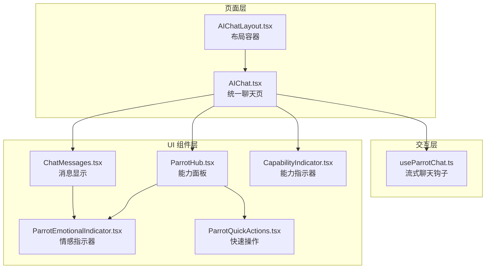
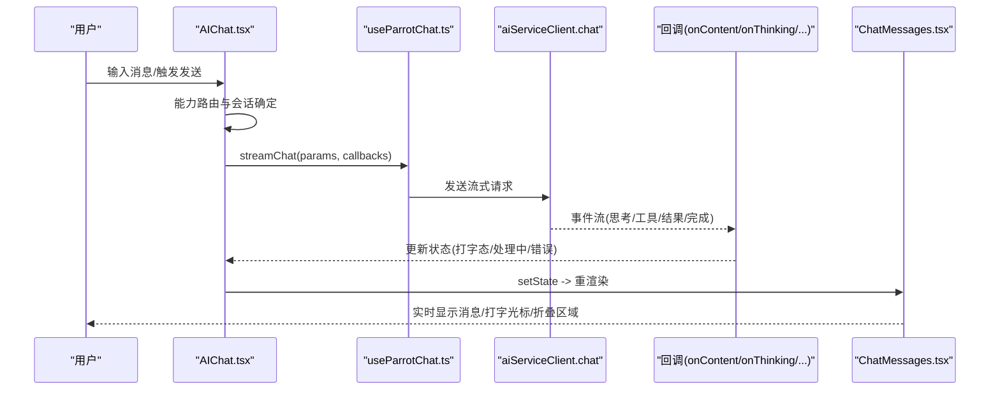
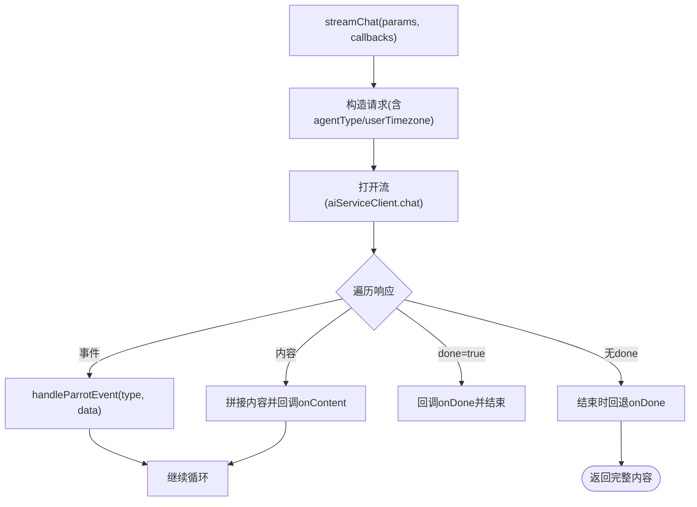
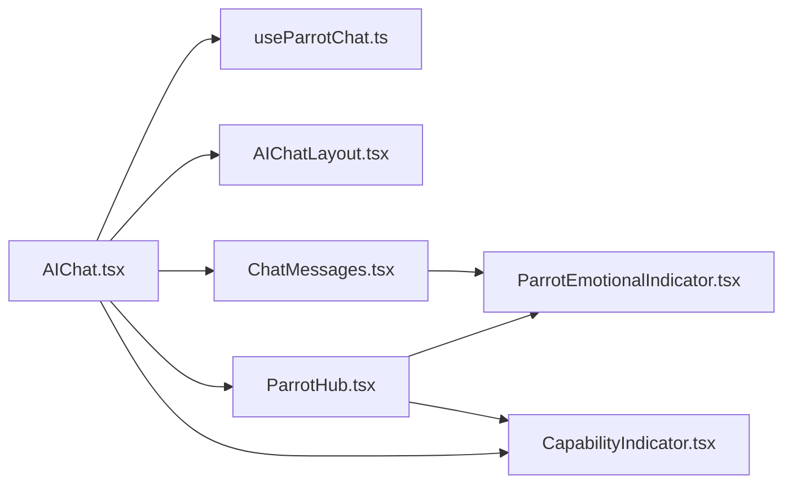

# AI 聊天组件

<cite>
**本文引用的文件**
- [AIChat.tsx](file://web/src/pages/AIChat.tsx)
- [AIChatLayout.tsx](file://web/src/layouts/AIChatLayout.tsx)
- [useParrotChat.ts](file://web/src/hooks/useParrotChat.ts)
- [ParrotHub.tsx](file://web/src/components/AIChat/ParrotHub.tsx)
- [ParrotEmotionalIndicator.tsx](file://web/src/components/AIChat/ParrotEmotionalIndicator.tsx)
- [ParrotQuickActions.tsx](file://web/src/components/AIChat/ParrotQuickActions.tsx)
- [CapabilityIndicator.tsx](file://web/src/components/AIChat/CapabilityIndicator.tsx)
- [ChatMessages.tsx](file://web/src/components/AIChat/ChatMessages.tsx)
</cite>

## 目录
1. [引言](#引言)
2. [项目结构](#项目结构)
3. [核心组件](#核心组件)
4. [架构总览](#架构总览)
5. [组件详解](#组件详解)
6. [依赖关系分析](#依赖关系分析)
7. [性能考量](#性能考量)
8. [故障排查指南](#故障排查指南)
9. [结论](#结论)
10. [附录](#附录)

## 引言
本文件系统性梳理 AI 聊天组件的设计与实现，覆盖聊天消息显示、输入框、工具面板与智能提示功能；深入解析不同 AI 代理（如 Parrot Hub）的组件架构，包括情感指示器、能力展示与快速操作面板；同时涵盖日程 AI 组件、冲突解决界面与生成式 UI 容器，并总结聊天体验优化、实时交互与用户反馈的最佳实践。

## 项目结构
前端聊天页面位于 web/src/pages/AIChat.tsx，采用“统一对话视图 + 能力面板视图”的双视图模式；布局由 web/src/layouts/AIChatLayout.tsx 提供，负责侧边栏与响应式切换；聊天数据流通过自定义 Hook useParrotChat.ts 进行 Connect RPC 流式通信；UI 组件集中在 web/src/components/AIChat 下，包含消息气泡、输入区、能力指示与情感指示等模块。

图表来源
- [AIChat.tsx](file://web/src/pages/AIChat.tsx#L171-L519)
- [AIChatLayout.tsx](file://web/src/layouts/AIChatLayout.tsx#L24-L85)
- [useParrotChat.ts](file://web/src/hooks/useParrotChat.ts#L37-L104)
- [ChatMessages.tsx](file://web/src/components/AIChat/ChatMessages.tsx#L30-L162)
- [ParrotHub.tsx](file://web/src/components/AIChat/ParrotHub.tsx#L73-L190)
- [ParrotEmotionalIndicator.tsx](file://web/src/components/AIChat/ParrotEmotionalIndicator.tsx#L78-L132)
- [ParrotQuickActions.tsx](file://web/src/components/AIChat/ParrotQuickActions.tsx#L12-L84)
- [CapabilityIndicator.tsx](file://web/src/components/AIChat/CapabilityIndicator.tsx#L54-L122)

章节来源
- [AIChat.tsx](file://web/src/pages/AIChat.tsx#L171-L519)
- [AIChatLayout.tsx](file://web/src/layouts/AIChatLayout.tsx#L24-L85)

## 核心组件
- 统一聊天视图：负责消息渲染、输入处理、清空上下文、新建会话、能力面板切换与欢迎提示。
- 能力面板视图：展示当前激活能力与可选能力卡片，支持状态提示与自动路由提示。
- 流式聊天钩子：封装 Connect RPC 的 chat 接口，统一处理事件类型（思考、工具使用、结果、错误等）与回调。
- 消息显示组件：支持 Markdown 渲染、折叠展开、复制、滚动锚定与打字光标。
- 能力指示器与情感指示器：以图标与颜色主题表达当前能力与代理情绪状态。
- 快速操作面板：在能力面板之外提供快速切换代理的快捷入口。

章节来源
- [AIChat.tsx](file://web/src/pages/AIChat.tsx#L45-L129)
- [ParrotHub.tsx](file://web/src/components/AIChat/ParrotHub.tsx#L73-L190)
- [useParrotChat.ts](file://web/src/hooks/useParrotChat.ts#L37-L104)
- [ChatMessages.tsx](file://web/src/components/AIChat/ChatMessages.tsx#L30-L162)
- [CapabilityIndicator.tsx](file://web/src/components/AIChat/CapabilityIndicator.tsx#L54-L122)
- [ParrotEmotionalIndicator.tsx](file://web/src/components/AIChat/ParrotEmotionalIndicator.tsx#L78-L132)
- [ParrotQuickActions.tsx](file://web/src/components/AIChat/ParrotQuickActions.tsx#L12-L84)

## 架构总览
下图展示了从前端页面到后端服务的端到端交互流程，包括自动能力路由、会话管理、流式事件分发与 UI 实时更新。

图表来源
- [AIChat.tsx](file://web/src/pages/AIChat.tsx#L233-L424)
- [useParrotChat.ts](file://web/src/hooks/useParrotChat.ts#L48-L95)
- [ChatMessages.tsx](file://web/src/components/AIChat/ChatMessages.tsx#L30-L162)

## 组件详解

### 统一聊天视图（UnifiedChatView）
- 职责：承载消息列表、输入区、欢迎提示、清空确认对话框；协调能力面板与统一视图切换。
- 关键行为：
  - 智能路由：根据输入内容自动识别目标能力并切换。
  - 会话管理：若无活动会话则创建或复用，确保消息归属正确。
  - 流式渲染：维护 assistant 消息 ID、累积内容与错误兜底。
  - 快捷键：Cmd/Ctrl+K 清空上下文分隔线。
  - 自定义事件：接收来自建议提示的发送事件，实现“一键发送”。

图表来源
- [AIChat.tsx](file://web/src/pages/AIChat.tsx#L333-L424)

章节来源
- [AIChat.tsx](file://web/src/pages/AIChat.tsx#L45-L129)
- [AIChat.tsx](file://web/src/pages/AIChat.tsx#L171-L519)

### 能力面板视图（CapabilityPanelView）
- 职责：在移动设备上提供子头部返回入口，在桌面端展示能力卡片网格。
- 能力卡片：Memo、Schedule、Amazing 三种能力，强调当前激活能力与“自动路由”提示。
- 状态反馈：当激活能力处于“思考中”，卡片覆盖半透明层提示处理中。

章节来源
- [AIChat.tsx](file://web/src/pages/AIChat.tsx#L131-L166)
- [ParrotHub.tsx](file://web/src/components/AIChat/ParrotHub.tsx#L73-L190)

### 流式聊天钩子（useParrotChat）
- 职责：封装 Connect RPC 的 chat 请求，统一处理事件类型与回调。
- 事件处理：对 THINKING、TOOL_USE、TOOL_RESULT、MEMO_QUERY_RESULT、SCHEDULE_QUERY_RESULT、ERROR 等进行解析与转发。
- 完成信号：若服务端未显式发送 done，回退调用 onDone，保证 UI 正常收尾。
- 查询失效：提供 invalidate 方法，便于聊天后刷新相关缓存。

图表来源
- [useParrotChat.ts](file://web/src/hooks/useParrotChat.ts#L48-L95)
- [useParrotChat.ts](file://web/src/hooks/useParrotChat.ts#L113-L169)

章节来源
- [useParrotChat.ts](file://web/src/hooks/useParrotChat.ts#L37-L104)
- [useParrotChat.ts](file://web/src/hooks/useParrotChat.ts#L106-L179)

### 消息显示组件（ChatMessages）
- 职责：渲染历史消息、处理 Markdown、控制滚动、显示打字光标、折叠长文本。
- 特性：
  - 滚动策略：检测用户滚动阈值，避免新消息自动拉到底导致打断阅读。
  - 上下文分隔线：插入“剪刀”分隔符，配合 context-separator 类型消息。
  - 最近消息动画：新增消息进入时淡入与底部滑入。
  - 可折叠长消息：超过阈值自动折叠，提供展开/收起按钮。
  - 复制与操作：悬浮复制按钮、助手消息的操作菜单。

章节来源
- [ChatMessages.tsx](file://web/src/components/AIChat/ChatMessages.tsx#L30-L162)
- [ChatMessages.tsx](file://web/src/components/AIChat/ChatMessages.tsx#L176-L350)

### 能力指示器（CapabilityIndicator）
- 职责：以徽章形式显示当前能力与状态，支持紧凑模式与切换按钮。
- 主题：按能力类型映射背景、文字与边框颜色，思考中状态带脉冲动画。

章节来源
- [CapabilityIndicator.tsx](file://web/src/components/AIChat/CapabilityIndicator.tsx#L54-L122)
- [CapabilityIndicator.tsx](file://web/src/components/AIChat/CapabilityIndicator.tsx#L124-L172)

### 情感指示器（ParrotEmotionalIndicator）
- 职责：根据代理情感状态显示对应图标与轻微发光效果；支持紧凑徽章与声音气泡。
- 设计：无外部动画库依赖，基于 Tailwind CSS 实现轻量动画与主题色提取。

章节来源
- [ParrotEmotionalIndicator.tsx](file://web/src/components/AIChat/ParrotEmotionalIndicator.tsx#L78-L132)
- [ParrotEmotionalIndicator.tsx](file://web/src/components/AIChat/ParrotEmotionalIndicator.tsx#L134-L198)

### 快速操作面板（ParrotQuickActions）
- 职责：在能力面板外提供快速切换代理的入口，支持禁用态与选中态高亮。
- 数据源：通过可用代理列表动态渲染，结合主题色映射。

章节来源
- [ParrotQuickActions.tsx](file://web/src/components/AIChat/ParrotQuickActions.tsx#L12-L84)

## 依赖关系分析
- 页面依赖：AIChat.tsx 依赖 useParrotChat.ts 进行流式通信，依赖 AIChatLayout.tsx 提供布局与侧边栏。
- 组件依赖：ChatMessages.tsx 依赖 ParrotEmotionalIndicator.tsx 进行打字光标与状态提示；ParrotHub.tsx 依赖 CapabilityIndicator.tsx 与 ParrotEmotionalIndicator.tsx 展示能力与情感状态。
- 事件链路：AIChat.tsx 通过回调驱动 ChatMessages.tsx 的内容更新与状态切换；useParrotChat.ts 将服务端事件转换为 UI 回调。

图表来源
- [AIChat.tsx](file://web/src/pages/AIChat.tsx#L171-L519)
- [AIChatLayout.tsx](file://web/src/layouts/AIChatLayout.tsx#L24-L85)
- [useParrotChat.ts](file://web/src/hooks/useParrotChat.ts#L37-L104)
- [ChatMessages.tsx](file://web/src/components/AIChat/ChatMessages.tsx#L30-L162)
- [ParrotHub.tsx](file://web/src/components/AIChat/ParrotHub.tsx#L73-L190)
- [ParrotEmotionalIndicator.tsx](file://web/src/components/AIChat/ParrotEmotionalIndicator.tsx#L78-L132)
- [CapabilityIndicator.tsx](file://web/src/components/AIChat/CapabilityIndicator.tsx#L54-L122)

章节来源
- [AIChat.tsx](file://web/src/pages/AIChat.tsx#L171-L519)
- [ParrotHub.tsx](file://web/src/components/AIChat/ParrotHub.tsx#L73-L190)
- [ChatMessages.tsx](file://web/src/components/AIChat/ChatMessages.tsx#L30-L162)

## 性能考量
- 滚动优化：仅在用户未主动滚动时自动滚动至底部，避免打断阅读。
- 内容折叠：长消息自动折叠，减少 DOM 高度与重排压力。
- 事件合并：流式内容增量更新，避免整块重渲染。
- 缓存失效：聊天完成后主动失效相关查询，降低脏数据风险。
- 动画节流：情感指示器与脉冲动画使用 CSS 实现，避免 JS 动画阻塞。

## 故障排查指南
- 无响应或卡顿
  - 检查是否频繁触发 onContent 导致重渲染过多；确认滚动阈值逻辑生效。
  - 确认 done 事件是否被正确处理，避免 UI 始终处于“思考中”。
- 错误显示
  - 当服务端返回 ERROR 事件时，回调会收到错误对象；检查 onDone 与 onError 的调用顺序。
- 事件解析失败
  - 对于 JSON 结果（如查询结果），若解析失败会在控制台输出错误信息；检查事件数据格式。
- 会话与能力不一致
  - 确保路由后的能力切换与会话创建逻辑一致，避免消息归属错误。

章节来源
- [useParrotChat.ts](file://web/src/hooks/useParrotChat.ts#L113-L169)
- [AIChat.tsx](file://web/src/pages/AIChat.tsx#L296-L321)

## 结论
该 AI 聊天组件以“统一对话视图 + 能力面板视图”为核心，结合流式事件驱动与主题化 UI 组件，实现了自然的实时交互体验。通过能力路由与情感指示器，提升了用户对代理状态的理解；通过消息折叠与滚动策略，优化了长文本场景下的可读性。建议在后续迭代中进一步完善消息删除、工具面板扩展与冲突解决界面的集成。

## 附录
- 最佳实践
  - 使用紧凑能力指示器在移动端节省空间。
  - 在需要时启用情感指示器增强拟人性。
  - 合理使用上下文分隔线，帮助用户管理长对话。
  - 为快捷操作面板提供禁用态，避免在流式过程中误触切换。
  - 对长消息默认折叠，提供展开按钮，兼顾性能与可读性。