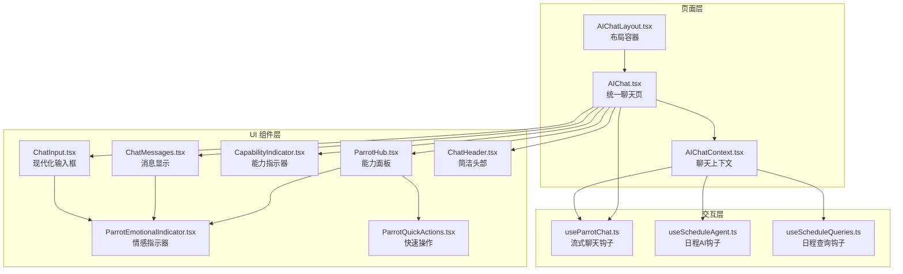
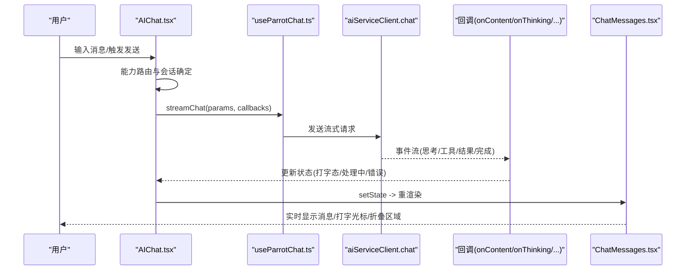
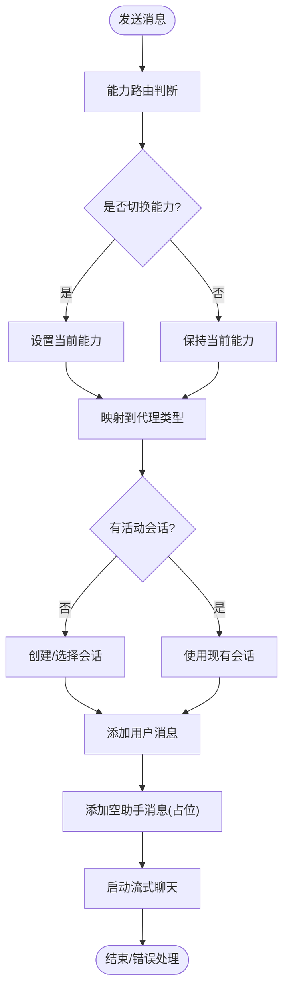
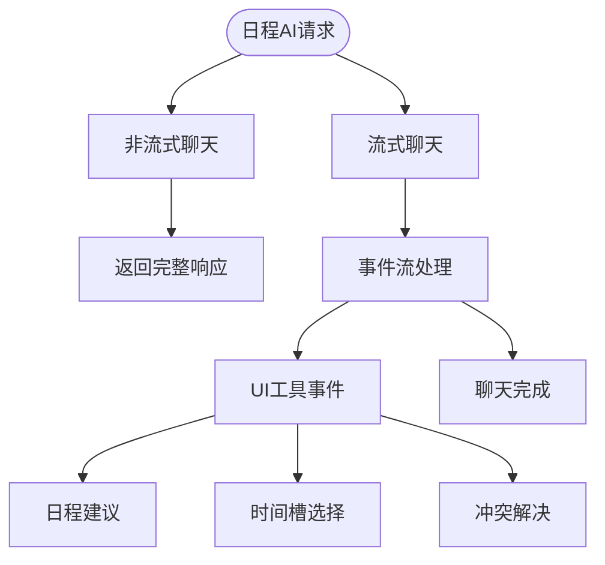
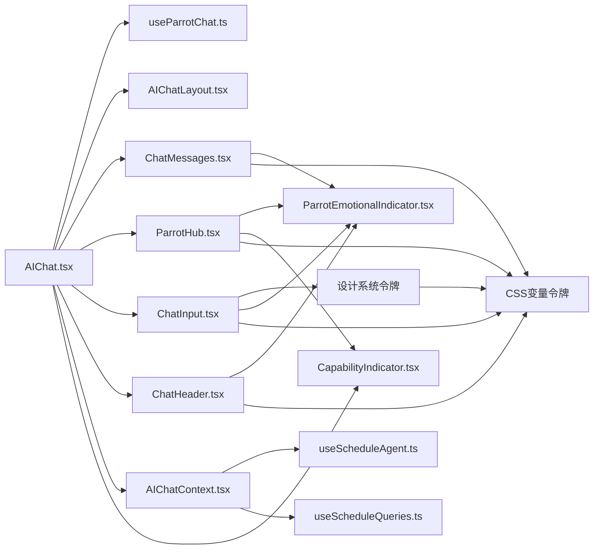

# AI 聊天组件

<cite>
**本文档引用的文件**
- [AIChat.tsx](file://web/src/pages/AIChat.tsx)
- [AIChatLayout.tsx](file://web/src/layouts/AIChatLayout.tsx)
- [useParrotChat.ts](file://web/src/hooks/useParrotChat.ts)
- [ParrotHub.tsx](file://web/src/components/AIChat/ParrotHub.tsx)
- [ParrotEmotionalIndicator.tsx](file://web/src/components/AIChat/ParrotEmotionalIndicator.tsx)
- [ParrotQuickActions.tsx](file://web/src/components/AIChat/ParrotQuickActions.tsx)
- [CapabilityIndicator.tsx](file://web/src/components/AIChat/CapabilityIndicator.tsx)
- [ChatMessages.tsx](file://web/src/components/AIChat/ChatMessages.tsx)
- [ChatInput.tsx](file://web/src/components/AIChat/ChatInput.tsx)
- [ChatHeader.tsx](file://web/src/components/AIChat/ChatHeader.tsx)
- [parrot.ts](file://web/src/types/parrot.ts)
- [default.css](file://web/src/themes/default.css)
- [AIChatContext.tsx](file://web/src/contexts/AIChatContext.tsx)
- [useScheduleAgent.ts](file://web/src/hooks/useScheduleAgent.ts)
- [useScheduleQueries.ts](file://web/src/hooks/useScheduleQueries.ts)
</cite>

## 更新摘要
**变更内容**
- ChatInput组件移除特定代理主题依赖，采用语义化CSS类和设计系统令牌
- ParrotHub组件增强可访问性，使用ARIA标签和语义化结构
- 新增统一主题系统，移除PARROT_THEMES配置，全面采用设计系统令牌
- ChatHeader组件简化为简洁状态显示，移除复杂能力徽章
- ChatMessages组件优化主题应用，统一使用语义化令牌
- ParrotQuickActions组件增强无障碍支持，添加ARIA属性
- 新增日程AI聊天钩子：useScheduleAgent.ts和useScheduleQueries.ts
- 移除高级对话历史跟踪和Markdown渲染能力
- 简化AI聊天系统架构，专注于核心聊天功能

## 目录
1. [引言](#引言)
2. [项目结构](#项目结构)
3. [核心组件](#核心组件)
4. [架构总览](#架构总览)
5. [组件详解](#组件详解)
6. [设计系统令牌](#设计系统令牌)
7. [日程AI集成](#日程ai集成)
8. [依赖关系分析](#依赖关系分析)
9. [性能考量](#性能考量)
10. [故障排查指南](#故障排查指南)
11. [结论](#结论)
12. [附录](#附录)

## 引言
本文件系统性梳理 AI 聊天组件的设计与实现，覆盖聊天消息显示、输入框、工具面板与智能提示功能；深入解析不同 AI 代理（如 Parrot Hub）的组件架构，包括情感指示器、能力展示与快速操作面板；同时涵盖日程 AI 组件、冲突解决界面与生成式 UI 容器，并总结聊天体验优化、实时交互与用户反馈的最佳实践。

**更新** 本次更新重点关注 AI 聊天系统的重大优化，移除了高级对话历史跟踪和 Markdown 渲染能力，简化了复杂功能，专注于核心聊天体验。同时新增了日程AI聊天钩子，包括 useScheduleAgent.ts 和 useScheduleQueries.ts，为日程管理提供专门的AI支持。

## 项目结构
前端聊天页面位于 web/src/pages/AIChat.tsx，采用"统一对话视图 + 能力面板视图"的双视图模式；布局由 web/src/layouts/AIChatLayout.tsx 提供，负责侧边栏与响应式切换；聊天数据流通过自定义 Hook useParrotChat.ts 进行 Connect RPC 流式通信；UI 组件集中在 web/src/components/AIChat 下，包含消息气泡、输入区、能力指示与情感指示等模块。



**图表来源**
- [AIChat.tsx](file://web/src/pages/AIChat.tsx#L171-L519)
- [AIChatLayout.tsx](file://web/src/layouts/AIChatLayout.tsx#L24-L85)
- [useParrotChat.ts](file://web/src/hooks/useParrotChat.ts#L37-L104)
- [ChatMessages.tsx](file://web/src/components/AIChat/ChatMessages.tsx#L30-L162)
- [ParrotHub.tsx](file://web/src/components/AIChat/ParrotHub.tsx#L73-L190)
- [ParrotEmotionalIndicator.tsx](file://web/src/components/AIChat/ParrotEmotionalIndicator.tsx#L78-L132)
- [ParrotQuickActions.tsx](file://web/src/components/AIChat/ParrotQuickActions.tsx#L12-L84)
- [CapabilityIndicator.tsx](file://web/src/components/AIChat/CapabilityIndicator.tsx#L54-L122)
- [ChatInput.tsx](file://web/src/components/AIChat/ChatInput.tsx#L1-L200)
- [ChatHeader.tsx](file://web/src/components/AIChat/ChatHeader.tsx#L1-L96)
- [AIChatContext.tsx](file://web/src/contexts/AIChatContext.tsx#L109-L400)
- [useScheduleAgent.ts](file://web/src/hooks/useScheduleAgent.ts#L110-L142)
- [useScheduleQueries.ts](file://web/src/hooks/useScheduleQueries.ts#L49-L154)

**章节来源**
- [AIChat.tsx](file://web/src/pages/AIChat.tsx#L171-L519)
- [AIChatLayout.tsx](file://web/src/layouts/AIChatLayout.tsx#L24-L85)
- [AIChatContext.tsx](file://web/src/contexts/AIChatContext.tsx#L109-L400)

## 核心组件
- 统一聊天视图：负责消息渲染、输入处理、清空上下文、新建会话、能力面板切换与欢迎提示。
- 能力面板视图：展示当前激活能力与可选能力卡片，支持状态提示与自动路由提示。
- 流式聊天钩子：封装 Connect RPC 的 chat 接口，统一处理事件类型（思考、工具使用、结果、错误等）与回调。
- 消息显示组件：支持 Markdown 渲染、折叠展开、复制、滚动锚定与打字光标。
- 能力指示器与情感指示器：以图标与颜色主题表达当前能力与代理情绪状态。
- 快速操作面板：在能力面板之外提供快速切换代理的快捷入口。
- **现代化输入框**：支持工具栏、快捷键、语义化主题和无障碍访问。
- **设计系统令牌**：统一的颜色系统，支持主题适配和无障碍访问。
- **日程AI集成**：新增专门的日程管理AI支持，包括聊天钩子和查询工具。

**更新** 新增设计系统令牌支持，全面替代硬编码颜色值。ChatInput组件移除特定代理主题依赖，采用语义化CSS类。新增日程AI聊天钩子，专注于日程管理场景的AI支持。

**章节来源**
- [AIChat.tsx](file://web/src/pages/AIChat.tsx#L45-L129)
- [ParrotHub.tsx](file://web/src/components/AIChat/ParrotHub.tsx#L73-L190)
- [useParrotChat.ts](file://web/src/hooks/useParrotChat.ts#L37-L104)
- [ChatMessages.tsx](file://web/src/components/AIChat/ChatMessages.tsx#L30-L162)
- [CapabilityIndicator.tsx](file://web/src/components/AIChat/CapabilityIndicator.tsx#L54-L122)
- [ParrotEmotionalIndicator.tsx](file://web/src/components/AIChat/ParrotEmotionalIndicator.tsx#L78-L132)
- [ParrotQuickActions.tsx](file://web/src/components/AIChat/ParrotQuickActions.tsx#L12-L84)
- [ChatInput.tsx](file://web/src/components/AIChat/ChatInput.tsx#L1-L200)
- [useScheduleAgent.ts](file://web/src/hooks/useScheduleAgent.ts#L110-L142)
- [useScheduleQueries.ts](file://web/src/hooks/useScheduleQueries.ts#L49-L154)

## 架构总览
下图展示了从前端页面到后端服务的端到端交互流程，包括自动能力路由、会话管理、流式事件分发与 UI 实时更新。



**图表来源**
- [AIChat.tsx](file://web/src/pages/AIChat.tsx#L233-L424)
- [useParrotChat.ts](file://web/src/hooks/useParrotChat.ts#L48-L95)
- [ChatMessages.tsx](file://web/src/components/AIChat/ChatMessages.tsx#L30-L162)

## 组件详解

### 统一聊天视图（UnifiedChatView）
- 职责：承载消息列表、输入区、欢迎提示、清空确认对话框；协调能力面板与统一视图切换。
- 关键行为：
  - 智能路由：根据输入内容自动识别目标能力并切换。
  - 会话管理：若无活动会话则创建或复用，确保消息归属正确。
  - 流式渲染：维护 assistant 消息 ID、累积内容与错误兜底。
  - 快捷键：Cmd/Ctrl+K 清空上下文分隔线。
  - 自定义事件：接收来自建议提示的发送事件，实现"一键发送"。



**图表来源**
- [AIChat.tsx](file://web/src/pages/AIChat.tsx#L333-L424)

**章节来源**
- [AIChat.tsx](file://web/src/pages/AIChat.tsx#L45-L129)
- [AIChat.tsx](file://web/src/pages/AIChat.tsx#L171-L519)

### 能力面板视图（CapabilityPanelView）
- 职责：在移动设备上提供子头部返回入口，在桌面端展示能力卡片网格。
- 能力卡片：Memo、Schedule、Amazing 三种能力，强调当前激活能力与"自动路由"提示。
- 状态反馈：当激活能力处于"思考中"，卡片覆盖半透明层提示处理中。
- **设计系统应用**：使用语义化令牌 bg-card、text-foreground、border-border 等统一视觉风格。
- **可访问性增强**：使用语义化HTML结构和ARIA标签，提升屏幕阅读器支持。

**章节来源**
- [AIChat.tsx](file://web/src/pages/AIChat.tsx#L131-L166)
- [ParrotHub.tsx](file://web/src/components/AIChat/ParrotHub.tsx#L73-L190)

### 流式聊天钩子（useParrotChat）
- 职责：封装 Connect RPC 的 chat 请求，统一处理事件类型与回调。
- 事件处理：对 THINKING、TOOL_USE、TOOL_RESULT、MEMO_QUERY_RESULT、SCHEDULE_QUERY_RESULT、ERROR 等进行解析与转发。
- 完成信号：若服务端未显式发送 done，回退调用 onDone，保证 UI 正常收尾。
- 查询失效：提供 invalidate 方法，便于聊天后刷新相关缓存。


**图表来源**
- [useParrotChat.ts](file://web/src/hooks/useParrotChat.ts#L48-L95)
- [useParrotChat.ts](file://web/src/hooks/useParrotChat.ts#L113-L169)

**章节来源**
- [useParrotChat.ts](file://web/src/hooks/useParrotChat.ts#L37-L104)
- [useParrotChat.ts](file://web/src/hooks/useParrotChat.ts#L106-L179)

### 消息显示组件（ChatMessages）
- 职责：渲染历史消息、处理 Markdown、控制滚动、显示打字光标、折叠长文本。
- 特性：
  - 滚动策略：检测用户滚动阈值，避免新消息自动拉到底导致打断阅读。
  - 上下文分隔线：插入"剪刀"分隔符，配合 context-separator 类型消息。
  - 最近消息动画：新增消息进入时淡入与底部滑入。
  - 可折叠长消息：超过阈值自动折叠，提供展开/收起按钮。
  - 复制与操作：悬浮复制按钮、助手消息的操作菜单。
  - **设计系统令牌**：使用 bg-card、text-foreground、border-border 等语义化令牌。
  - **主题优化**：统一使用设计系统令牌，移除特定代理主题依赖。

**章节来源**
- [ChatMessages.tsx](file://web/src/components/AIChat/ChatMessages.tsx#L30-L162)
- [ChatMessages.tsx](file://web/src/components/AIChat/ChatMessages.tsx#L176-L350)

### 能力指示器（CapabilityIndicator）
- 职责：以徽章形式显示当前能力与状态，支持紧凑模式与切换按钮。
- 主题：按能力类型映射背景、文字与边框颜色，思考中状态带脉冲动画。
- **设计系统令牌**：使用语义化颜色令牌 bg-slate-50、text-slate-700、border-slate-200 等。

**章节来源**
- [CapabilityIndicator.tsx](file://web/src/components/AIChat/CapabilityIndicator.tsx#L54-L122)
- [CapabilityIndicator.tsx](file://web/src/components/AIChat/CapabilityIndicator.tsx#L124-L172)

### 情感指示器（ParrotEmotionalIndicator）
- 职责：根据代理情感状态显示对应图标与轻微发光效果；支持紧凑徽章与声音气泡。
- 设计：无外部动画库依赖，基于 Tailwind CSS 实现轻量动画与主题色提取。
- **设计系统令牌**：使用语义化令牌 bg-slate-100、text-slate-700 等。

**章节来源**
- [ParrotEmotionalIndicator.tsx](file://web/src/components/AIChat/ParrotEmotionalIndicator.tsx#L78-L132)
- [ParrotEmotionalIndicator.tsx](file://web/src/components/AIChat/ParrotEmotionalIndicator.tsx#L134-L198)

### 快速操作面板（ParrotQuickActions）
- 职责：在能力面板外提供快速切换代理的入口，支持禁用态与选中态高亮。
- 数据源：通过可用代理列表动态渲染，结合主题色映射。
- **设计系统令牌**：使用语义化颜色令牌 bg-blue-50、text-blue-700 等。
- **可访问性增强**：添加 aria-label 和 aria-pressed 属性，提升无障碍支持。

**章节来源**
- [ParrotQuickActions.tsx](file://web/src/components/AIChat/ParrotQuickActions.tsx#L12-L84)

### 现代化输入框（ChatInput）
- 职责：提供现代化的聊天输入界面，支持工具栏、快捷键和语义化主题。
- 工具栏功能：
  - 新建聊天按钮（⌘N）：创建新的对话会话
  - 清空上下文按钮（⌘K）：插入上下文分隔线
  - 清空聊天按钮（⌘L）：删除所有消息
- 快捷键支持：
  - Enter：发送消息
  - Cmd/Ctrl+K：清空上下文
  - Cmd/Ctrl+N：新建聊天
  - Cmd/Ctrl+L：清空聊天
- 语义化主题：
  - **移除特定代理主题依赖**：不再使用 PARROT_THEMES 配置
  - 支持语义化 CSS 变量和设计系统令牌
  - 自适应深色/浅色模式
- 可访问性：
  - 支持键盘导航
  - 屏幕阅读器友好
  - 无障碍标签和提示
  - ARIA 属性支持

**更新** ChatInput组件已移除特定代理主题依赖，全面采用语义化CSS类和设计系统令牌。新增完整的ARIA标签支持，提升可访问性。

**章节来源**
- [ChatInput.tsx](file://web/src/components/AIChat/ChatInput.tsx#L1-L200)
- [parrot.ts](file://web/src/types/parrot.ts#L298-L350)

### 简洁头部（ChatHeader）
- 职责：在桌面端显示简洁的状态栏，展示助手信息和当前状态。
- 设计特点：
  - 移除复杂的能力徽章，改为简洁的状态描述
  - 仅显示助手图标和状态指示器
  - 支持思考状态的脉冲动画
- 交互：与 ChatInput 工具栏配合，提供完整的操作入口
- **设计系统令牌**：使用语义化令牌 bg-background、text-foreground、border-border 等。

**更新** ChatHeader 组件简化为纯粹的状态显示，专注于简洁的视觉层次。

**章节来源**
- [ChatHeader.tsx](file://web/src/components/AIChat/ChatHeader.tsx#L1-L96)

## 设计系统令牌

### 颜色系统概览
应用采用基于 OKLCH 颜色空间的完整设计系统，提供语义化颜色令牌，支持明暗主题自动切换。

### 核心颜色令牌
- **背景系统**：`--background`、`--card`、`--popover` - 页面主背景、卡片背景、弹出层背景
- **文本系统**：`--foreground`、`--muted`、`--muted-foreground` - 主要文本、次要文本、占位符文本
- **品牌系统**：`--primary`、`--primary-foreground`、`--secondary`、`--secondary-foreground` - 主要品牌色、辅助品牌色
- **交互系统**：`--accent`、`--accent-foreground`、`--border`、`--input` - 悬停状态、边框、输入框背景
- **反馈系统**：`--destructive`、`--destructive-foreground` - 错误状态、危险操作

### 语义化使用示例
组件中广泛使用语义化令牌替代硬编码颜色：

```css
/* 消息气泡背景 - 使用语义化令牌 */
.message-bubble {
  background: var(--card); /* 使用卡片背景令牌 */
  color: var(--card-foreground); /* 使用卡片文本令牌 */
  border: 1px solid var(--border); /* 使用边框令牌 */
}

/* 输入框主题 - 使用语义化令牌 */
.input-theme {
  background: var(--input); /* 使用输入框背景令牌 */
  color: var(--foreground); /* 使用主要文本令牌 */
  border: 1px solid var(--border); /* 使用边框令牌 */
}

/* 侧边栏背景 - 使用语义化令牌 */
.sidebar {
  background: var(--sidebar); /* 使用侧边栏背景令牌 */
  color: var(--sidebar-foreground); /* 使用侧边栏文本令牌 */
}
```

### 主题适配机制
设计系统通过 CSS 自定义属性实现自动主题适配：

```css
/* 默认主题 (浅色) */
:root {
  --background: oklch(0.9818 0.0054 95.0986);
  --foreground: oklch(0.2438 0.0269 95.7226);
  --card: oklch(1 0 0);
  --card-foreground: oklch(0.1908 0.002 106.5859);
}

/* 深色主题 (通过 .dark 类) */
.dark {
  --background: oklch(0.15 0 0);
  --foreground: oklch(0.9 0 0);
  --card: oklch(0.1 0 0);
  --card-foreground: oklch(0.95 0 0);
}
```

### 组件级令牌应用
各组件通过语义化令牌实现统一视觉风格：

- **ChatMessages**：使用 `bg-card`、`text-foreground`、`border-border`
- **ChatInput**：使用 `bg-input`、`text-foreground`、`border-border`
- **ParrotHub**：使用 `bg-card`、`text-foreground`、`border-border`
- **ChatHeader**：使用 `bg-background`、`text-foreground`、`border-border`

**更新** 所有组件现已完全迁移到设计系统令牌，移除了 PARROT_THEMES 配置依赖。

**章节来源**
- [default.css](file://web/src/themes/default.css#L1-L124)

## 日程AI集成

### 日程AI聊天钩子（useScheduleAgent）
- 职责：提供专门的日程管理AI聊天功能，支持非流式和流式两种模式。
- 功能特性：
  - 非流式聊天：一次性获取完整响应
  - 流式聊天：实时事件流，支持取消和重置
  - UI工具事件：支持日程建议、时间槽选择、冲突解决等UI事件
  - 历史记录：支持对话历史传递
- 事件类型：
  - thinking：思考阶段
  - tool_use：工具使用
  - tool_result：工具结果
  - answer：最终答案
  - ui_schedule_suggestion：日程建议UI事件
  - error：错误事件

### 日程查询钩子（useScheduleQueries）
- 职责：提供日程数据的查询、创建、更新、删除等完整CRUD操作。
- 核心功能：
  - useSchedules：查询日程列表
  - useSchedule：查询单个日程
  - useCreateSchedule：创建新日程
  - useUpdateSchedule：更新日程
  - useDeleteSchedule：删除日程
  - useCheckConflict：检查日程冲突
  - useCheckAvailability：检查可用时间段
- 性能优化：
  - 查询缓存管理
  - 分页查询支持
  - 实时数据同步
  - 错误回滚机制



**图表来源**
- [useScheduleAgent.ts](file://web/src/hooks/useScheduleAgent.ts#L110-L142)
- [useScheduleAgent.ts](file://web/src/hooks/useScheduleAgent.ts#L209-L243)
- [useScheduleQueries.ts](file://web/src/hooks/useScheduleQueries.ts#L243-L265)

**章节来源**
- [useScheduleAgent.ts](file://web/src/hooks/useScheduleAgent.ts#L110-L142)
- [useScheduleAgent.ts](file://web/src/hooks/useScheduleAgent.ts#L209-L243)
- [useScheduleQueries.ts](file://web/src/hooks/useScheduleQueries.ts#L49-L154)
- [useScheduleQueries.ts](file://web/src/hooks/useScheduleQueries.ts#L243-L265)

## 依赖关系分析
- 页面依赖：AIChat.tsx 依赖 useParrotChat.ts 进行流式通信，依赖 AIChatLayout.tsx 提供布局与侧边栏。
- 组件依赖：ChatMessages.tsx 依赖 ParrotEmotionalIndicator.tsx 进行打字光标与状态提示；ParrotHub.tsx 依赖 CapabilityIndicator.tsx 与 ParrotEmotionalIndicator.tsx 展示能力与情感状态；ChatInput.tsx 现已移除对 PARROT_THEMES 的依赖，采用设计系统令牌。
- 事件链路：AIChat.tsx 通过回调驱动 ChatMessages.tsx 的内容更新与状态切换；useParrotChat.ts 将服务端事件转换为 UI 回调。
- **设计系统依赖**：所有组件依赖统一的设计系统令牌，确保视觉一致性。
- **日程AI依赖**：AIChatContext.tsx 依赖 useScheduleAgent.ts 和 useScheduleQueries.ts 提供日程管理功能。



**图表来源**
- [AIChat.tsx](file://web/src/pages/AIChat.tsx#L171-L519)
- [AIChatLayout.tsx](file://web/src/layouts/AIChatLayout.tsx#L24-L85)
- [useParrotChat.ts](file://web/src/hooks/useParrotChat.ts#L37-L104)
- [ChatMessages.tsx](file://web/src/components/AIChat/ChatMessages.tsx#L30-L162)
- [ParrotHub.tsx](file://web/src/components/AIChat/ParrotHub.tsx#L73-L190)
- [ParrotEmotionalIndicator.tsx](file://web/src/components/AIChat/ParrotEmotionalIndicator.tsx#L78-L132)
- [CapabilityIndicator.tsx](file://web/src/components/AIChat/CapabilityIndicator.tsx#L54-L122)
- [ChatInput.tsx](file://web/src/components/AIChat/ChatInput.tsx#L1-L200)
- [ChatHeader.tsx](file://web/src/components/AIChat/ChatHeader.tsx#L1-L96)
- [AIChatContext.tsx](file://web/src/contexts/AIChatContext.tsx#L109-L400)
- [useScheduleAgent.ts](file://web/src/hooks/useScheduleAgent.ts#L110-L142)
- [useScheduleQueries.ts](file://web/src/hooks/useScheduleQueries.ts#L49-L154)

**章节来源**
- [AIChat.tsx](file://web/src/pages/AIChat.tsx#L171-L519)
- [ParrotHub.tsx](file://web/src/components/AIChat/ParrotHub.tsx#L73-L190)
- [ChatMessages.tsx](file://web/src/components/AIChat/ChatMessages.tsx#L30-L162)
- [ChatInput.tsx](file://web/src/components/AIChat/ChatInput.tsx#L1-L200)
- [AIChatContext.tsx](file://web/src/contexts/AIChatContext.tsx#L109-L400)

## 性能考量
- 滚动优化：仅在用户未主动滚动时自动滚动至底部，避免打断阅读。
- 内容折叠：长消息自动折叠，减少 DOM 高度与重排压力。
- 事件合并：流式内容增量更新，避免整块重渲染。
- 缓存失效：聊天完成后主动失效相关查询，降低脏数据风险。
- 动画节流：情感指示器与脉冲动画使用 CSS 实现，避免 JS 动画阻塞。
- **设计系统优化**：全面采用语义化 CSS 变量，提升主题切换性能。
- **工具栏懒加载**：工具栏仅在需要时显示，减少初始渲染负担。
- **主题一致性**：统一的设计系统令牌减少样式计算开销，提升渲染性能。
- **可访问性优化**：ARIA 标签和语义化 HTML 提升屏幕阅读器支持。
- **日程AI性能**：useScheduleQueries.ts 优化了查询缓存和分页机制，提升日程数据访问性能。

**更新** 新增设计系统优化和可访问性相关的性能考量，以及日程AI性能优化。

## 故障排查指南
- 无响应或卡顿
  - 检查是否频繁触发 onContent 导致重渲染过多；确认滚动阈值逻辑生效。
  - 确认 done 事件是否被正确处理，避免 UI 始终处于"思考中"。
- 错误显示
  - 当服务端返回 ERROR 事件时，回调会收到错误对象；检查 onDone 与 onError 的调用顺序。
- 事件解析失败
  - 对于 JSON 结果（如查询结果），若解析失败会在控制台输出错误信息；检查事件数据格式。
- 会话与能力不一致
  - 确保路由后的能力切换与会话创建逻辑一致，避免消息归属错误。
- **工具栏问题**
  - 检查设计系统令牌是否正确加载
  - 确认快捷键监听器是否正常工作
  - 验证移动端键盘高度计算逻辑
- **设计系统问题**
  - 检查 CSS 变量是否正确加载
  - 确认主题切换时令牌值是否更新
  - 验证语义化令牌的对比度是否符合无障碍标准
- **可访问性问题**
  - 检查 ARIA 标签是否正确应用
  - 验证键盘导航是否正常工作
  - 确认屏幕阅读器支持是否完善
- **日程AI问题**
  - 检查 useScheduleAgent.ts 的事件流是否正确处理
  - 确认 useScheduleQueries.ts 的缓存机制是否正常工作
  - 验证日程冲突检测和时间槽查找功能

**更新** 新增日程AI相关的故障排查指南。

**章节来源**
- [useParrotChat.ts](file://web/src/hooks/useParrotChat.ts#L113-L169)
- [AIChat.tsx](file://web/src/pages/AIChat.tsx#L296-L321)
- [ChatInput.tsx](file://web/src/components/AIChat/ChatInput.tsx#L46-L86)
- [useScheduleAgent.ts](file://web/src/hooks/useScheduleAgent.ts#L147-L176)
- [useScheduleQueries.ts](file://web/src/hooks/useScheduleQueries.ts#L49-L154)

## 结论
该 AI 聊天组件以"统一对话视图 + 能力面板视图"为核心，结合流式事件驱动与主题化 UI 组件，实现了自然的实时交互体验。通过能力路由与情感指示器，提升了用户对代理状态的理解；通过消息折叠与滚动策略，优化了长文本场景下的可读性。

**更新** 本次更新显著提升了用户体验，现代化的输入框提供了直观的工具栏界面和便捷的键盘快捷键支持，语义化的主题系统确保了良好的视觉一致性。设计系统令牌的全面应用统一了视觉语言，提升了主题适配能力，为未来的主题扩展和无障碍优化奠定了坚实基础。ChatInput组件移除特定代理主题依赖，ParrotHub组件增强可访问性支持，使整个AI聊天系统更加现代化和用户友好。

新增的日程AI集成进一步扩展了AI聊天的应用场景，通过专门的聊天钩子和查询工具，为用户提供完整的日程管理AI支持。移除了高级对话历史跟踪和Markdown渲染能力，简化了系统架构，专注于核心聊天功能，提升了整体性能和用户体验。

## 附录
- 最佳实践
  - 使用紧凑能力指示器在移动端节省空间。
  - 在需要时启用情感指示器增强拟人性。
  - 合理使用上下文分隔线，帮助用户管理长对话。
  - 为快捷操作面板提供禁用态，避免在流式过程中误触切换。
  - 对长消息默认折叠，提供展开按钮，兼顾性能与可读性。
  - **利用快捷键提高效率**：熟练掌握 ⌘K、⌘N、⌘L 快捷键。
  - **设计系统应用**：通过语义化令牌实现一致的主题风格。
  - **无障碍访问**：确保键盘导航和屏幕阅读器支持。
  - **主题一致性**：确保所有组件遵循统一的颜色系统规范。
  - **性能优化**：利用语义化令牌减少样式计算开销。
  - **可访问性优先**：为所有交互元素添加适当的 ARIA 标签。
  - **语义化HTML**：使用正确的语义化标签提升可读性。
  - **日程AI集成**：合理使用日程聊天钩子和查询工具，提升日程管理效率。
  - **错误处理**：完善的错误处理机制，确保用户体验的连续性。
  - **性能监控**：关注滚动优化、事件合并和缓存失效等性能关键点。