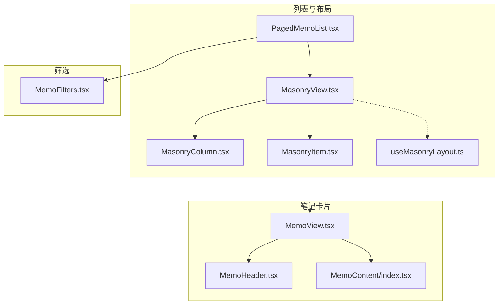
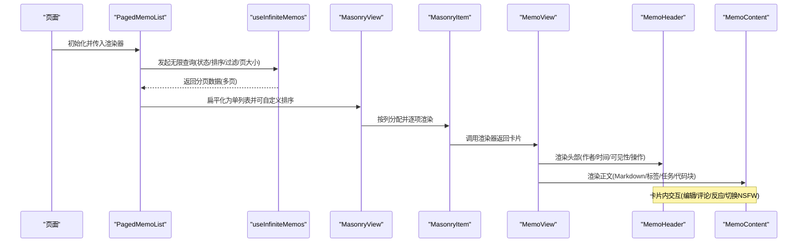
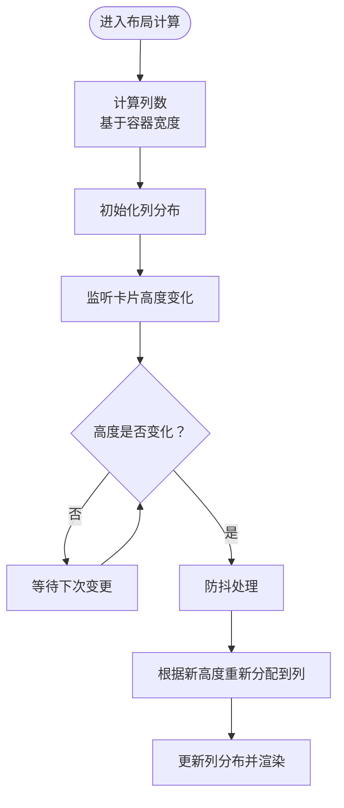
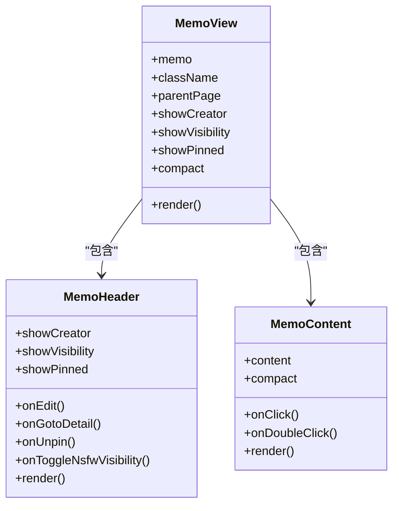
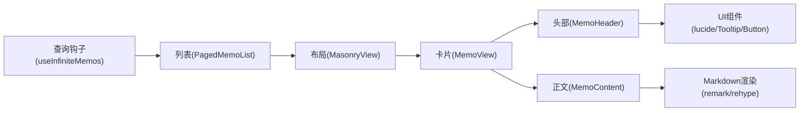

# 内容展示组件

<cite>
**本文档引用的文件**
- [MemoView.tsx](file://web/src/components/MemoView/MemoView.tsx)
- [MemoHeader.tsx](file://web/src/components/MemoView/components/MemoHeader.tsx)
- [MemoContent/index.tsx](file://web/src/components/MemoContent/index.tsx)
- [PagedMemoList.tsx](file://web/src/components/PagedMemoList/PagedMemoList.tsx)
- [MasonryView.tsx](file://web/src/components/MasonryView/MasonryView.tsx)
- [MasonryColumn.tsx](file://web/src/components/MasonryView/MasonryColumn.tsx)
- [MasonryItem.tsx](file://web/src/components/MasonryView/MasonryItem.tsx)
- [MemoFilters.tsx](file://web/src/components/MemoFilters.tsx)
- [useMasonryLayout.ts](file://web/src/components/MasonryView/useMasonryLayout.ts)
- [types.ts（MasonryView）](file://web/src/components/MasonryView/types.ts)
</cite>

## 目录
1. [简介](#简介)
2. [项目结构](#项目结构)
3. [核心组件](#核心组件)
4. [架构总览](#架构总览)
5. [详细组件分析](#详细组件分析)
6. [依赖关系分析](#依赖关系分析)
7. [性能考虑](#性能考虑)
8. [故障排查指南](#故障排查指南)
9. [结论](#结论)

## 简介
本文件聚焦于内容展示组件体系，系统性阐述笔记查询结果组件与迷你笔记卡片的设计与实现，覆盖结果列表、排序与筛选、迷你卡片的内容预览与交互、引用笔记面板与精彩洞察卡片的组件架构，并提供性能优化、懒加载与用户体验改进建议。

## 项目结构
内容展示相关的核心文件主要位于 web/src/components 下，采用按功能域分层组织：
- 列表与布局：PagedMemoList、MasonryView 及其子组件
- 笔记卡片：MemoView 及其子组件 MemoHeader、MemoContent
- 筛选器：MemoFilters
- 布局算法：useMasonryLayout、distributeItems（在同目录下）

图表来源
- [PagedMemoList.tsx](file://web/src/components/PagedMemoList/PagedMemoList.tsx#L83-L194)
- [MasonryView.tsx](file://web/src/components/MasonryView/MasonryView.tsx#L7-L45)
- [MasonryColumn.tsx](file://web/src/components/MasonryView/MasonryColumn.tsx#L4-L34)
- [MasonryItem.tsx](file://web/src/components/MasonryView/MasonryItem.tsx#L4-L32)
- [useMasonryLayout.ts](file://web/src/components/MasonryView/useMasonryLayout.ts#L6-L106)
- [MemoView.tsx](file://web/src/components/MemoView/MemoView.tsx#L15-L106)
- [MemoHeader.tsx](file://web/src/components/MemoView/components/MemoHeader.tsx#L19-L112)
- [MemoContent/index.tsx](file://web/src/components/MemoContent/index.tsx#L23-L91)
- [MemoFilters.tsx](file://web/src/components/MemoFilters.tsx#L57-L102)

章节来源
- [PagedMemoList.tsx](file://web/src/components/PagedMemoList/PagedMemoList.tsx#L83-L194)
- [MasonryView.tsx](file://web/src/components/MasonryView/MasonryView.tsx#L7-L45)
- [MemoView.tsx](file://web/src/components/MemoView/MemoView.tsx#L15-L106)

## 核心组件
- 结果列表与分页：PagedMemoList 提供无限滚动与自动拉取、骨架屏、空状态与回到顶部等体验增强；支持自定义排序与筛选器前置。
- 布局引擎：MasonryView/MasonryColumn/MasonryItem 实现响应式瀑布流布局，结合 useMasonryLayout 动态列数与高度重分布。
- 笔记卡片：MemoView 封装卡片容器、头部（作者/时间/可见性/操作）、正文（Markdown 渲染与紧凑模式）。
- 筛选器：MemoFilters 展示当前筛选条件并支持一键移除。

章节来源
- [PagedMemoList.tsx](file://web/src/components/PagedMemoList/PagedMemoList.tsx#L83-L194)
- [MasonryView.tsx](file://web/src/components/MasonryView/MasonryView.tsx#L7-L45)
- [MasonryItem.tsx](file://web/src/components/MasonryView/MasonryItem.tsx#L4-L32)
- [MemoView.tsx](file://web/src/components/MemoView/MemoView.tsx#L15-L106)
- [MemoHeader.tsx](file://web/src/components/MemoView/components/MemoHeader.tsx#L19-L112)
- [MemoContent/index.tsx](file://web/src/components/MemoContent/index.tsx#L23-L91)
- [MemoFilters.tsx](file://web/src/components/MemoFilters.tsx#L57-L102)

## 架构总览
整体数据流从查询到渲染的关键路径如下：

图表来源
- [PagedMemoList.tsx](file://web/src/components/PagedMemoList/PagedMemoList.tsx#L93-L104)
- [MasonryView.tsx](file://web/src/components/MasonryView/MasonryView.tsx#L11-L20)
- [MasonryItem.tsx](file://web/src/components/MasonryView/MasonryItem.tsx#L4-L31)
- [MemoView.tsx](file://web/src/components/MemoView/MemoView.tsx#L78-L93)
- [MemoHeader.tsx](file://web/src/components/MemoView/components/MemoHeader.tsx#L19-L112)
- [MemoContent/index.tsx](file://web/src/components/MemoContent/index.tsx#L23-L91)

## 详细组件分析

### 结果列表与分页（PagedMemoList）
- 查询与分页
  - 使用无限查询钩子按页获取笔记，支持状态、排序、过滤与页大小配置。
  - 将多页数据扁平化为单列表，允许外部传入自定义排序函数。
- 自动拉取与懒加载
  - 当页面不可滚动且仍有下一页时，延迟触发拉取，避免首屏阻塞。
  - 滚动接近底部时触发下一页加载，提升连续阅读体验。
- 性能与体验
  - 首次加载显示骨架屏；分页加载时显示少量骨架以提示进度。
  - 预取作者信息以减少首次渲染等待。
  - 在无数据时展示空状态与“回到顶部”按钮。
- 筛选器与编辑器
  - 在首页或根路由显示编辑器与筛选器，其他页面隐藏编辑器。

章节来源
- [PagedMemoList.tsx](file://web/src/components/PagedMemoList/PagedMemoList.tsx#L93-L147)
- [PagedMemoList.tsx](file://web/src/components/PagedMemoList/PagedMemoList.tsx#L107-L124)
- [PagedMemoList.tsx](file://web/src/components/PagedMemoList/PagedMemoList.tsx#L156-L189)
- [PagedMemoList.tsx](file://web/src/components/PagedMemoList/PagedMemoList.tsx#L196-L228)

### 布局引擎（MasonryView/MasonryColumn/MasonryItem/useMasonryLayout）
- 动态列数
  - 根据容器宽度与最小视口宽度比值计算列数，支持列表模式强制单列。
- 高度追踪与重分布
  - MasonryItem 使用 ResizeObserver 记录卡片高度变化，回调通知布局计算。
  - useMasonryLayout 维护 itemHeights 映射，防抖后重新分配到列，保证瀑布流视觉均衡。
- 渲染上下文
  - 向渲染器注入 compact 与 columns，用于卡片在多列时启用紧凑模式。

图表来源
- [useMasonryLayout.ts](file://web/src/components/MasonryView/useMasonryLayout.ts#L23-L72)
- [MasonryItem.tsx](file://web/src/components/MasonryView/MasonryItem.tsx#L8-L29)
- [MasonryView.tsx](file://web/src/components/MasonryView/MasonryView.tsx#L11-L20)

章节来源
- [MasonryView.tsx](file://web/src/components/MasonryView/MasonryView.tsx#L7-L45)
- [MasonryColumn.tsx](file://web/src/components/MasonryView/MasonryColumn.tsx#L4-L34)
- [MasonryItem.tsx](file://web/src/components/MasonryView/MasonryItem.tsx#L4-L32)
- [useMasonryLayout.ts](file://web/src/components/MasonryView/useMasonryLayout.ts#L6-L106)
- [types.ts（MasonryView）](file://web/src/components/MasonryView/types.ts#L3-L42)

### 笔记卡片（MemoView/MemoHeader/MemoContent）
- 卡片容器
  - 提供上下文（当前用户、创建者、父页面、归档状态、只读权限、NSFW 状态）给子组件使用。
  - 支持内联编辑入口与图片预览对话框。
- 头部（MemoHeader）
  - 可选择显示作者头像与名称、发布时间（相对时间或本地化时间）、可见性图标、置顶标记、NSFW 切换。
  - 提供评论数量跳转、反应选择器、操作菜单（编辑/删除等）。
- 正文（MemoContent）
  - 基于 ReactMarkdown 渲染，启用数学公式、表格、换行、标签与任务列表等插件。
  - 支持紧凑模式（全文/折叠），通过上下文控制在多列时自动启用。
  - 提供遮罩渐变与展开/收起按钮，改善长内容可读性。

图表来源
- [MemoView.tsx](file://web/src/components/MemoView/MemoView.tsx#L15-L106)
- [MemoHeader.tsx](file://web/src/components/MemoView/components/MemoHeader.tsx#L19-L112)
- [MemoContent/index.tsx](file://web/src/components/MemoContent/index.tsx#L23-L91)

章节来源
- [MemoView.tsx](file://web/src/components/MemoView/MemoView.tsx#L15-L106)
- [MemoHeader.tsx](file://web/src/components/MemoView/components/MemoHeader.tsx#L19-L112)
- [MemoContent/index.tsx](file://web/src/components/MemoContent/index.tsx#L23-L91)

### 筛选器（MemoFilters）
- 展示当前所有筛选因子与值，支持一键移除。
- 不同因子对应不同图标与文案（如标签、可见性、时间、链接/任务/代码存在性等）。
- 通过上下文管理筛选状态，与查询参数联动。

章节来源
- [MemoFilters.tsx](file://web/src/components/MemoFilters.tsx#L57-L102)

## 依赖关系分析
- 组件耦合
  - PagedMemoList 与 MasonryView 解耦，通过 renderer 接口注入卡片渲染逻辑，便于扩展不同卡片类型。
  - MemoView 通过上下文向子组件传递必要状态，降低 props 透传成本。
- 数据流向
  - 查询层（useInfiniteMemos）→ 列表层（PagedMemoList）→ 布局层（MasonryView）→ 卡片层（MemoView）。
- 外部依赖
  - 无限查询与缓存：React Query（由 useInfiniteMemos 隐藏封装）。
  - Markdown 渲染：react-markdown 及一系列 remark/rehype 插件。
  - UI 组件：lucide 图标、Tooltip、Button 等。

图表来源
- [PagedMemoList.tsx](file://web/src/components/PagedMemoList/PagedMemoList.tsx#L93-L104)
- [MasonryView.tsx](file://web/src/components/MasonryView/MasonryView.tsx#L7-L45)
- [MemoView.tsx](file://web/src/components/MemoView/MemoView.tsx#L78-L93)
- [MemoHeader.tsx](file://web/src/components/MemoView/components/MemoHeader.tsx#L19-L112)
- [MemoContent/index.tsx](file://web/src/components/MemoContent/index.tsx#L46-L73)

章节来源
- [PagedMemoList.tsx](file://web/src/components/PagedMemoList/PagedMemoList.tsx#L93-L104)
- [MasonryView.tsx](file://web/src/components/MasonryView/MasonryView.tsx#L7-L45)
- [MemoView.tsx](file://web/src/components/MemoView/MemoView.tsx#L78-L93)
- [MemoHeader.tsx](file://web/src/components/MemoView/components/MemoHeader.tsx#L19-L112)
- [MemoContent/index.tsx](file://web/src/components/MemoContent/index.tsx#L46-L73)

## 性能考虑
- 懒加载与无限滚动
  - 首屏仅渲染必要卡片，滚动接近底部时再拉取下一页，显著降低初始渲染压力。
  - 页面不可滚动时自动拉取，避免空白区域导致的等待感。
- 骨架屏与预取
  - 骨架屏提升感知性能；预取作者信息减少二次网络请求。
- 布局性能
  - 使用 ResizeObserver 仅在高度变化时触发重分布，配合防抖降低重排频率。
  - 多列时自动启用紧凑模式，减少 DOM 节点与绘制开销。
- 渲染优化
  - MemoView 对外包裹记忆化，避免不必要的重渲染。
  - MemoContent 的紧凑模式通过 CSS 控制，减少复杂计算。
- 缓存与并发
  - React Query 的缓存与预取策略减少重复请求，提高整体流畅度。

章节来源
- [PagedMemoList.tsx](file://web/src/components/PagedMemoList/PagedMemoList.tsx#L127-L147)
- [PagedMemoList.tsx](file://web/src/components/PagedMemoList/PagedMemoList.tsx#L107-L124)
- [MasonryItem.tsx](file://web/src/components/MasonryView/MasonryItem.tsx#L8-L29)
- [useMasonryLayout.ts](file://web/src/components/MasonryView/useMasonryLayout.ts#L39-L54)
- [MemoView.tsx](file://web/src/components/MemoView/MemoView.tsx#L106-L106)
- [MemoContent/index.tsx](file://web/src/components/MemoContent/index.tsx#L34-L42)

## 故障排查指南
- 卡片高度异常或瀑布流错位
  - 检查是否正确在 MasonryItem 中注册 ResizeObserver 并回调高度变化。
  - 确认 useMasonryLayout 的防抖与重分配逻辑未被外部中断。
- 首屏空白或加载缓慢
  - 确认骨架屏逻辑生效，检查预取作者信息是否成功。
  - 检查无限滚动阈值与页面滚动高度判断。
- 筛选器不生效
  - 确认筛选器上下文已正确设置，查询参数与筛选器状态一致。
- 编辑/评论/反应等交互无效
  - 检查 MemoView 上下文是否正确提供 currentUser、readonly、parentPage 等字段。
  - 确认 MemoHeader/MemoContent 中使用的上下文钩子调用位置与时机。

章节来源
- [MasonryItem.tsx](file://web/src/components/MasonryView/MasonryItem.tsx#L8-L29)
- [useMasonryLayout.ts](file://web/src/components/MasonryView/useMasonryLayout.ts#L39-L54)
- [PagedMemoList.tsx](file://web/src/components/PagedMemoList/PagedMemoList.tsx#L127-L147)
- [MemoView.tsx](file://web/src/components/MemoView/MemoView.tsx#L42-L54)
- [MemoHeader.tsx](file://web/src/components/MemoView/components/MemoHeader.tsx#L31-L32)

## 结论
该内容展示体系以“查询-列表-布局-卡片-筛选”为主线，通过无限滚动、懒加载、骨架屏与预取等策略保障性能，借助动态瀑布流与紧凑模式优化长内容可读性。MemoView 作为卡片核心，将头部与正文解耦，便于扩展与维护。建议后续可在以下方向持续优化：
- 引用笔记面板与精彩洞察卡片：可复用 MemoView 的渲染接口，统一上下文与交互行为，减少重复开发。
- 更细粒度的缓存与失效策略：针对不同筛选组合与排序维度建立独立缓存键，提升命中率。
- 可访问性增强：为卡片标题、时间、操作按钮添加语义化标签与键盘导航支持。