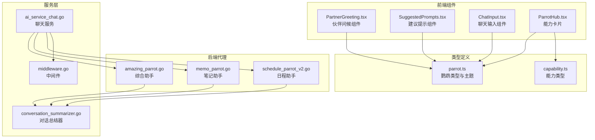
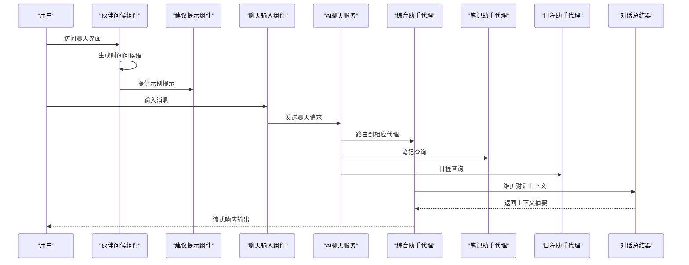
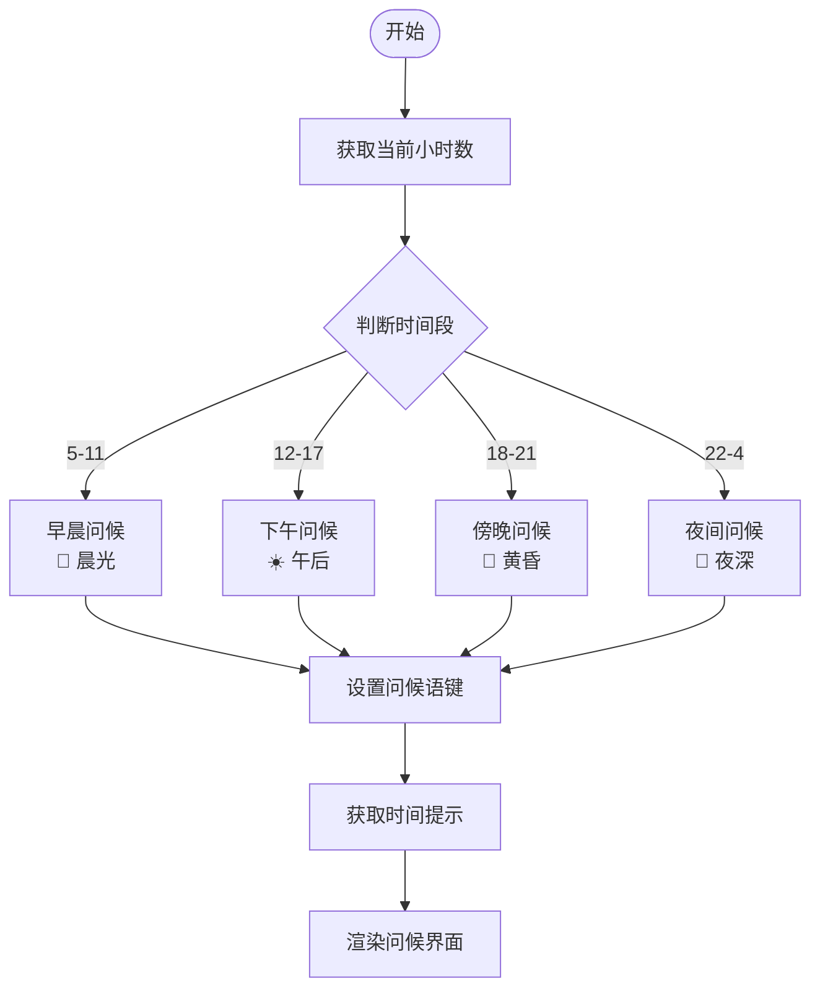
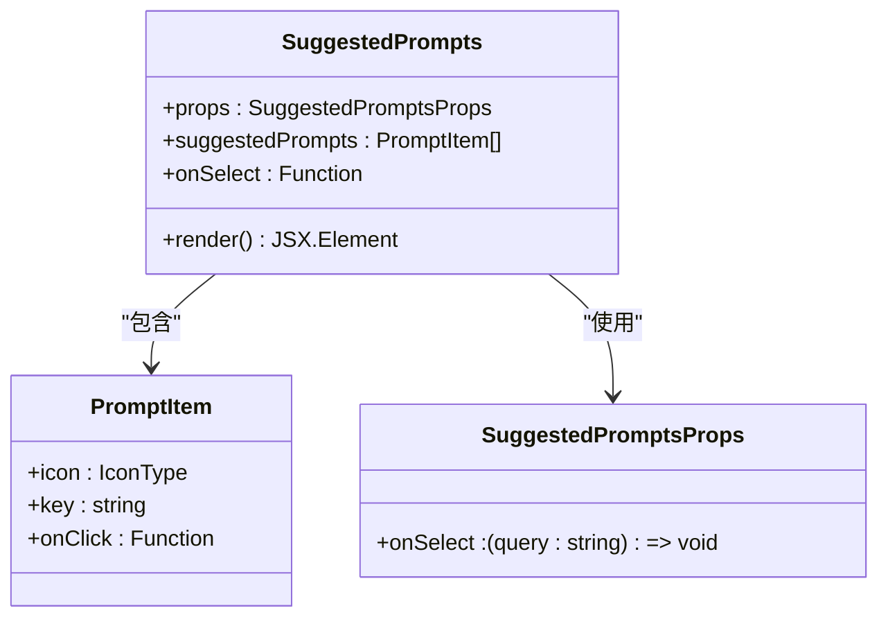
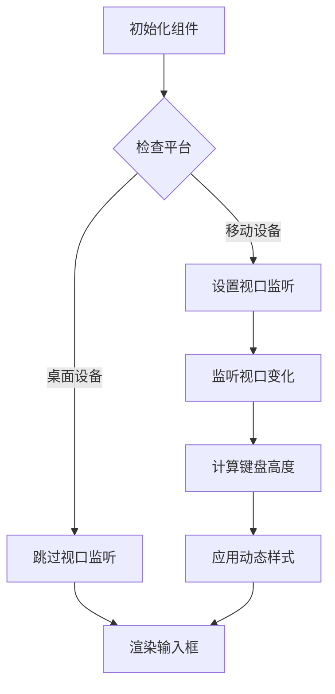
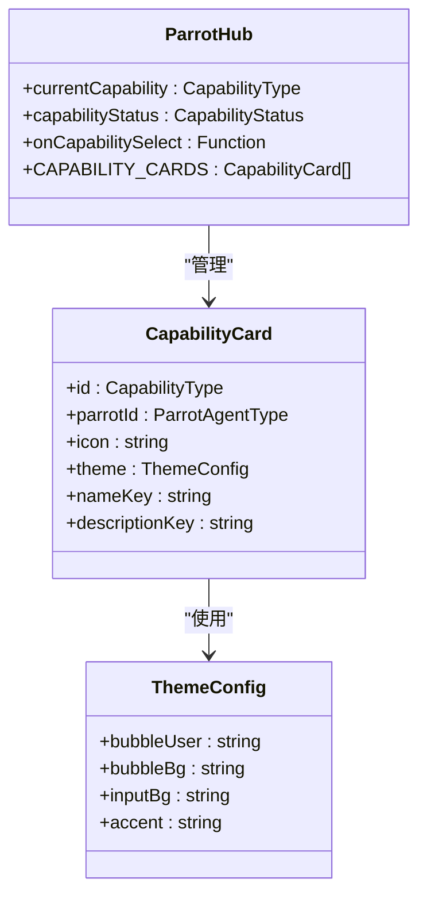
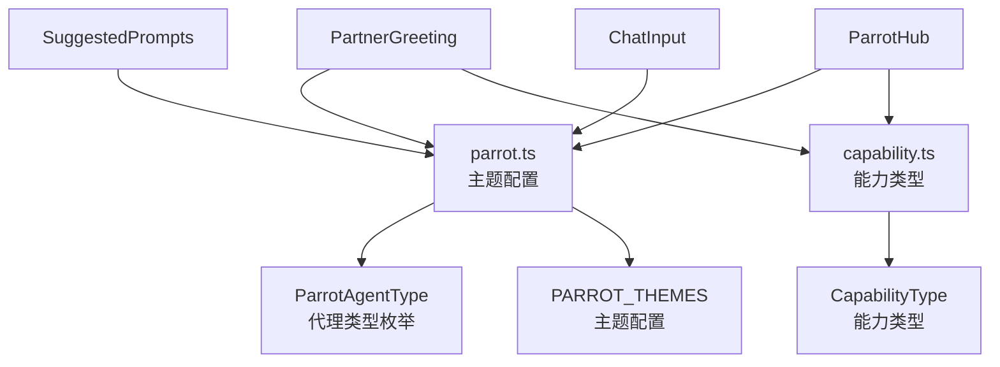
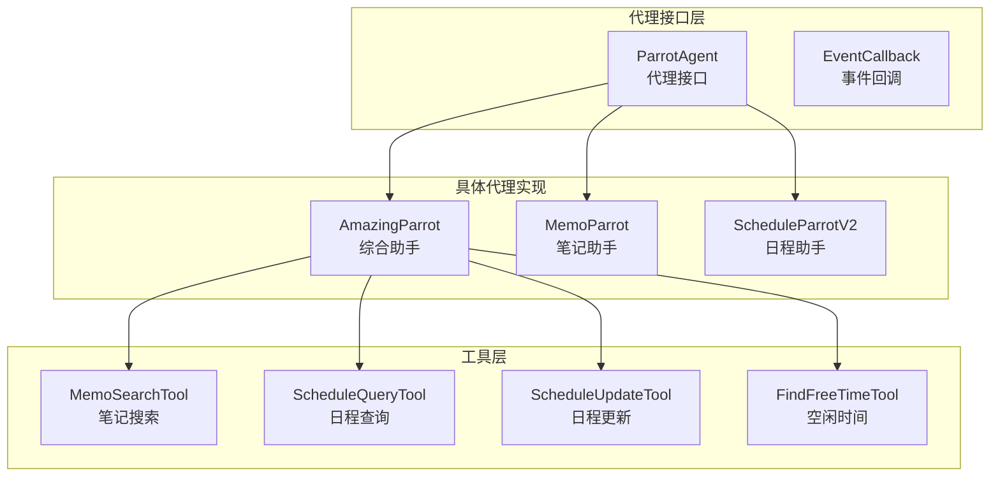
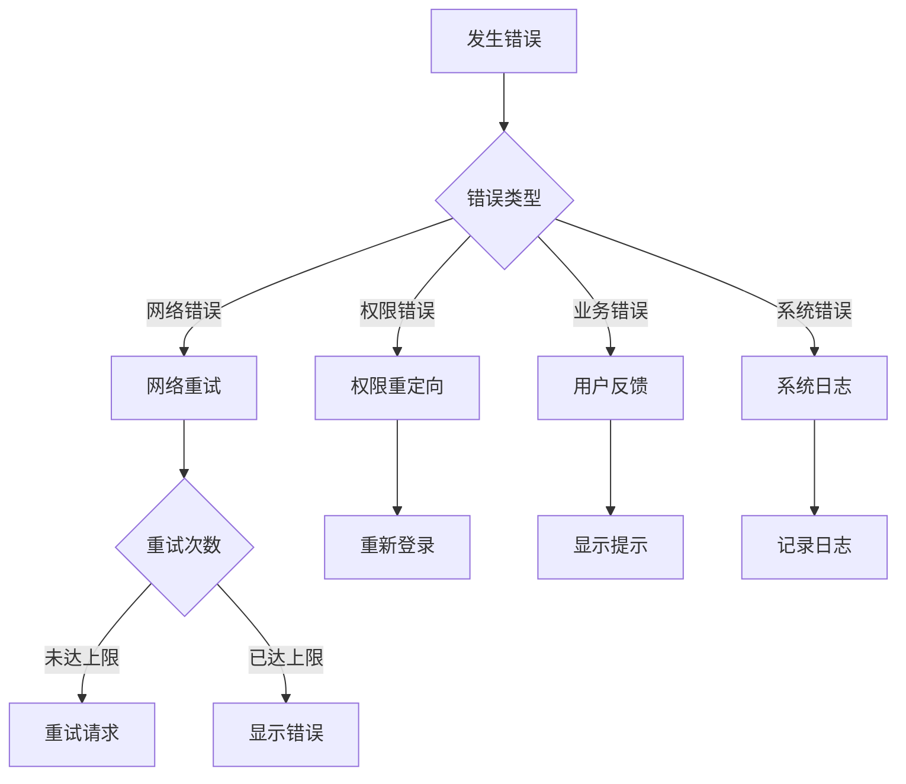

# 助手问候与提示组件

<cite>
**本文档引用的文件**
- [PartnerGreeting.tsx](file://web/src/components/AIChat/PartnerGreeting.tsx)
- [SuggestedPrompts.tsx](file://web/src/components/AIChat/SuggestedPrompts.tsx)
- [ChatInput.tsx](file://web/src/components/AIChat/ChatInput.tsx)
- [ParrotHub.tsx](file://web/src/components/AIChat/ParrotHub.tsx)
- [parrot.ts](file://web/src/types/parrot.ts)
- [capability.ts](file://web/src/types/capability.ts)
- [amazing_parrot.go](file://plugin/ai/agent/amazing_parrot.go)
- [memo_parrot.go](file://plugin/ai/agent/memo_parrot.go)
- [schedule_parrot_v2.go](file://plugin/ai/agent/schedule_parrot_v2.go)
- [conversation_summarizer.go](file://server/router/api/v1/ai/conversation_summarizer.go)
- [ai_service_chat.go](file://server/router/api/v1/ai_service_chat.go)
- [middleware.go](file://server/router/api/v1/ai/middleware.go)
</cite>

## 目录
1. [简介](#简介)
2. [项目结构](#项目结构)
3. [核心组件](#核心组件)
4. [架构概览](#架构概览)
5. [详细组件分析](#详细组件分析)
6. [依赖关系分析](#依赖关系分析)
7. [性能考虑](#性能考虑)
8. [故障排除指南](#故障排除指南)
9. [结论](#结论)

## 简介
本文件详细阐述助手问候与提示组件的设计与实现，涵盖伙伴问候组件的欢迎消息、个性化问候和情境适配设计理念，以及建议提示组件的智能提示生成、用户偏好学习和上下文感知机制。文档还提供了助手交互的用户体验设计、自然语言处理和个性化推荐策略。

## 项目结构
助手问候与提示组件主要分布在前端 Web 组件和后端 AI 代理两个层面：

- 前端层（React 组件）：
  - 伙伴问候组件：负责时间相关的问候语、个性化提示和示例提问
  - 建议提示组件：提供智能提示生成和用户偏好学习
  - 输入组件：处理用户输入、快捷操作和占位符
  - 能力卡片：展示不同助手的能力和主题风格

- 后端层（Go 代理）：
  - 综合助手（AmazingParrot）：结合笔记和日程能力的集成助手
  - 笔记助手（MemoParrot）：专注笔记检索和总结
  - 日程助手（ScheduleParrotV2）：专注于日程查询和管理
  - 对话总结器：维护对话上下文，优化长对话体验

**图表来源**
- [PartnerGreeting.tsx](file://web/src/components/AIChat/PartnerGreeting.tsx#L1-L167)
- [SuggestedPrompts.tsx](file://web/src/components/AIChat/SuggestedPrompts.tsx#L1-L35)
- [ChatInput.tsx](file://web/src/components/AIChat/ChatInput.tsx#L1-L190)
- [ParrotHub.tsx](file://web/src/components/AIChat/ParrotHub.tsx#L1-L63)
- [parrot.ts](file://web/src/types/parrot.ts#L1-L361)
- [capability.ts](file://web/src/types/capability.ts#L98-L159)
- [amazing_parrot.go](file://plugin/ai/agent/amazing_parrot.go#L1-L666)
- [memo_parrot.go](file://plugin/ai/agent/memo_parrot.go#L1-L459)
- [schedule_parrot_v2.go](file://plugin/ai/agent/schedule_parrot_v2.go#L1-L173)
- [conversation_summarizer.go](file://server/router/api/v1/ai/conversation_summarizer.go#L83-L207)
- [ai_service_chat.go](file://server/router/api/v1/ai_service_chat.go#L88-L222)
- [middleware.go](file://server/router/api/v1/ai/middleware.go#L1-L147)

**章节来源**
- [PartnerGreeting.tsx](file://web/src/components/AIChat/PartnerGreeting.tsx#L1-L167)
- [SuggestedPrompts.tsx](file://web/src/components/AIChat/SuggestedPrompts.tsx#L1-L35)
- [ChatInput.tsx](file://web/src/components/AIChat/ChatInput.tsx#L1-L190)
- [ParrotHub.tsx](file://web/src/components/AIChat/ParrotHub.tsx#L1-L63)
- [parrot.ts](file://web/src/types/parrot.ts#L1-L361)
- [capability.ts](file://web/src/types/capability.ts#L98-L159)

## 核心组件
助手问候与提示组件包含以下核心功能模块：

### 伙伴问候组件（PartnerGreeting）
- **时间感知问候**：根据当前小时数生成对应的问候语和表情符号
- **个性化提示**：基于用户使用习惯提供情境化提示
- **示例提问**：提供4个场景化的示例问题，降低用户认知负担
- **简化版本**：用于对话列表中的迷你问候展示

### 建议提示组件（SuggestedPrompts）
- **智能提示生成**：基于用户历史和偏好生成个性化提示
- **用户偏好学习**：通过对话历史分析用户兴趣和使用模式
- **上下文感知**：根据当前对话状态和用户需求动态调整提示内容

### 聊天输入组件（ChatInput）
- **多平台适配**：支持桌面和移动端键盘高度自适应
- **快捷操作**：提供新建聊天、清理上下文、清空聊天记录等功能
- **占位符管理**：根据不同助手类型显示相应的输入提示

### 能力卡片（ParrotHub）
- **能力展示**：展示笔记、日程、综合三种助手能力
- **主题配置**：为不同助手提供对应的颜色和样式主题
- **图标系统**：使用鹦鹉图标和替代图标确保无障碍访问

**章节来源**
- [PartnerGreeting.tsx](file://web/src/components/AIChat/PartnerGreeting.tsx#L58-L132)
- [SuggestedPrompts.tsx](file://web/src/components/AIChat/SuggestedPrompts.tsx#L15-L32)
- [ChatInput.tsx](file://web/src/components/AIChat/ChatInput.tsx#L25-L96)
- [ParrotHub.tsx](file://web/src/components/AIChat/ParrotHub.tsx#L22-L56)

## 架构概览
助手问候与提示组件采用前后端分离的架构设计，通过明确的职责划分和接口约定实现高效的用户交互体验。

**图表来源**
- [ai_service_chat.go](file://server/router/api/v1/ai_service_chat.go#L188-L203)
- [amazing_parrot.go](file://plugin/ai/agent/amazing_parrot.go#L106-L184)
- [memo_parrot.go](file://plugin/ai/agent/memo_parrot.go#L76-L289)
- [schedule_parrot_v2.go](file://plugin/ai/agent/schedule_parrot_v2.go#L32-L77)
- [conversation_summarizer.go](file://server/router/api/v1/ai/conversation_summarizer.go#L89-L150)

## 详细组件分析

### 伙伴问候组件深度解析

#### 时间感知问候机制
伙伴问候组件实现了基于时间的智能问候系统，通过分析当前小时数生成相应的问候语和情境提示：

**图表来源**
- [PartnerGreeting.tsx](file://web/src/components/AIChat/PartnerGreeting.tsx#L19-L48)

#### 个性化问候设计原则
- **降低认知负担**：使用示例提问代替能力选择，让用户专注于表达意图
- **情境适配**：根据用户的历史使用情况提供个性化的问候内容
- **情感连接**：通过拟声词和表情符号增强用户的情感体验

#### 示例提问系统
组件提供4个精心设计的示例提问，覆盖主要使用场景：

| 场景 | 图标 | 提示内容 | 目标 |
|------|------|----------|------|
| 笔记检索 | 📝 | 搜索相关笔记 | 快速获取信息 |
| 日程查询 | 📅 | 查看日程安排 | 时间管理 |
| 内容总结 | 📊 | 生成内容摘要 | 信息梳理 |
| 创意启发 | ✨ | 寻求创意建议 | 思维拓展 |

**章节来源**
- [PartnerGreeting.tsx](file://web/src/components/AIChat/PartnerGreeting.tsx#L58-L132)

### 建议提示组件实现分析

#### 智能提示生成算法
建议提示组件采用基于用户行为的智能推荐机制：

**图表来源**
- [SuggestedPrompts.tsx](file://web/src/components/AIChat/SuggestedPrompts.tsx#L4-L13)

#### 用户偏好学习机制
组件通过以下方式学习和适应用户偏好：

1. **点击行为追踪**：记录用户对不同提示类型的点击频率
2. **使用场景分析**：分析用户在不同时间段的使用模式
3. **反馈循环**：根据用户后续行为调整提示优先级

#### 上下文感知策略
- **时间感知**：根据当前时间提供相关的提示内容
- **历史分析**：基于用户过往对话历史生成相关提示
- **场景适配**：根据当前页面状态和用户目标动态调整

**章节来源**
- [SuggestedPrompts.tsx](file://web/src/components/AIChat/SuggestedPrompts.tsx#L15-L32)

### 聊天输入组件设计

#### 多平台适配机制
聊天输入组件实现了完善的多平台适配：

**图表来源**
- [ChatInput.tsx](file://web/src/components/AIChat/ChatInput.tsx#L46-L86)

#### 快捷操作系统
组件提供三个核心快捷操作：

- **新建聊天**：清除当前对话，开始全新会话
- **清理上下文**：移除历史消息，重置对话状态
- **清空聊天**：删除完整对话历史

#### 占位符管理系统
不同助手类型显示相应的输入提示，增强用户体验：

| 助手类型 | 默认占位符 | 目的 |
|----------|------------|------|
| 笔记助手 | 搜索相关笔记 | 引导信息检索 |
| 日程助手 | 查询日程安排 | 时间管理引导 |
| 综合助手 | 综合信息查询 | 多场景支持 |

**章节来源**
- [ChatInput.tsx](file://web/src/components/AIChat/ChatInput.tsx#L25-L96)

### 能力卡片系统

#### 主题配置架构
能力卡片系统采用统一的主题配置架构：

**图表来源**
- [ParrotHub.tsx](file://web/src/components/AIChat/ParrotHub.tsx#L10-L56)
- [parrot.ts](file://web/src/types/parrot.ts#L298-L350)

#### 能力映射机制
系统通过能力映射实现灵活的功能组合：

| 能力类型 | 对应代理 | 主要功能 | 特殊属性 |
|----------|----------|----------|----------|
| 笔记（MEMO） | MEMO | 笔记检索、总结 | 记忆力强 |
| 日程（SCHEDULE） | SCHEDULE | 日程查询、管理 | 守时严谨 |
| 综合（AMAZING） | AMAZING | 笔记+日程 | 多维分析 |
| 自动（AUTO） | AMAZING | 智能识别 | 自动路由 |

**章节来源**
- [ParrotHub.tsx](file://web/src/components/AIChat/ParrotHub.tsx#L22-L56)
- [capability.ts](file://web/src/types/capability.ts#L119-L135)

## 依赖关系分析

### 前端组件依赖图
助手问候与提示组件之间存在清晰的依赖关系：

**图表来源**
- [PartnerGreeting.tsx](file://web/src/components/AIChat/PartnerGreeting.tsx#L1-L6)
- [SuggestedPrompts.tsx](file://web/src/components/AIChat/SuggestedPrompts.tsx#L1-L3)
- [ChatInput.tsx](file://web/src/components/AIChat/ChatInput.tsx#L1-L8)
- [ParrotHub.tsx](file://web/src/components/AIChat/ParrotHub.tsx#L1-L6)
- [parrot.ts](file://web/src/types/parrot.ts#L7-L11)
- [capability.ts](file://web/src/types/capability.ts#L98-L114)

### 后端代理依赖关系
后端代理组件通过统一的接口实现松耦合设计：

**图表来源**
- [amazing_parrot.go](file://plugin/ai/agent/amazing_parrot.go#L19-L31)
- [memo_parrot.go](file://plugin/ai/agent/memo_parrot.go#L26-L34)
- [schedule_parrot_v2.go](file://plugin/ai/agent/schedule_parrot_v2.go#L9-L13)

**章节来源**
- [parrot.ts](file://web/src/types/parrot.ts#L1-L361)
- [capability.ts](file://web/src/types/capability.ts#L98-L159)
- [amazing_parrot.go](file://plugin/ai/agent/amazing_parrot.go#L19-L92)
- [memo_parrot.go](file://plugin/ai/agent/memo_parrot.go#L26-L66)
- [schedule_parrot_v2.go](file://plugin/ai/agent/schedule_parrot_v2.go#L9-L24)

## 性能考虑
助手问候与提示组件在设计时充分考虑了性能优化：

### 前端性能优化
- **组件记忆化**：使用 React.memo 避免不必要的重新渲染
- **懒加载策略**：按需加载组件，减少初始包体积
- **虚拟滚动**：对于大量提示内容使用虚拟化技术
- **防抖机制**：输入组件使用防抖防止频繁重渲染

### 后端性能优化
- **缓存策略**：代理组件实现 LRU 缓存减少重复计算
- **并发执行**：综合助手支持多工具并发执行
- **流式响应**：使用流式传输提升响应速度
- **超时控制**：实现合理的超时机制防止资源泄露

### 数据流优化
- **上下文压缩**：对话总结器定期压缩历史上下文
- **增量更新**：只更新变化的数据部分
- **预加载机制**：提前加载用户可能需要的功能

## 故障排除指南

### 常见问题诊断
1. **问候语不正确**
   - 检查系统时间设置
   - 验证时区配置
   - 确认国际化资源加载

2. **提示不显示**
   - 检查网络连接
   - 验证用户权限
   - 确认代理服务状态

3. **输入组件异常**
   - 检查浏览器兼容性
   - 验证视口监听器
   - 确认样式表加载

### 错误处理机制
组件实现了多层次的错误处理：

**章节来源**
- [ai_service_chat.go](file://server/router/api/v1/ai_service_chat.go#L108-L127)
- [middleware.go](file://server/router/api/v1/ai/middleware.go#L58-L63)

## 结论
助手问候与提示组件通过精心设计的用户体验和先进的技术架构，为用户提供了智能化、个性化的助手交互体验。组件不仅实现了基本的问候和提示功能，更重要的是建立了完整的上下文感知和个性化推荐体系。

### 设计亮点
- **时间感知问候**：通过时间维度增强用户的情感连接
- **智能提示生成**：基于用户行为的学习推荐系统
- **多平台适配**：完善的响应式设计和平台特性支持
- **主题化架构**：统一的视觉语言和交互模式

### 技术优势
- **前后端分离**：清晰的职责划分和接口约定
- **可扩展性**：模块化设计支持功能扩展
- **性能优化**：多层优化策略确保流畅体验
- **错误处理**：完善的异常处理和恢复机制

该组件体系为构建更智能的助手应用奠定了坚实基础，通过持续的迭代和优化，能够为用户提供越来越优质的交互体验。