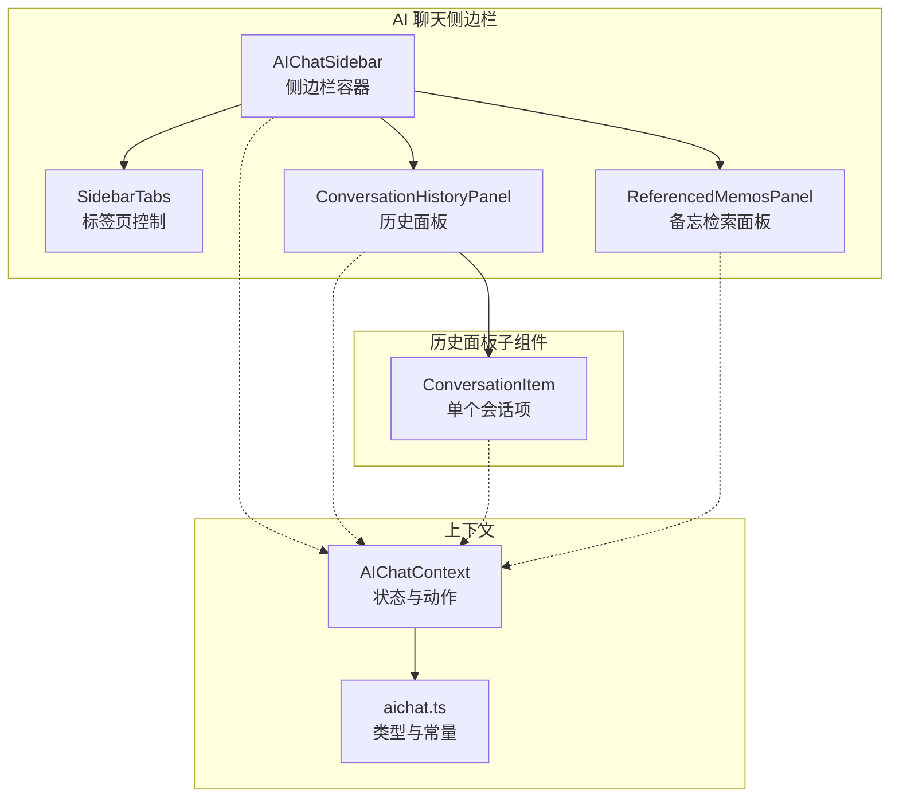
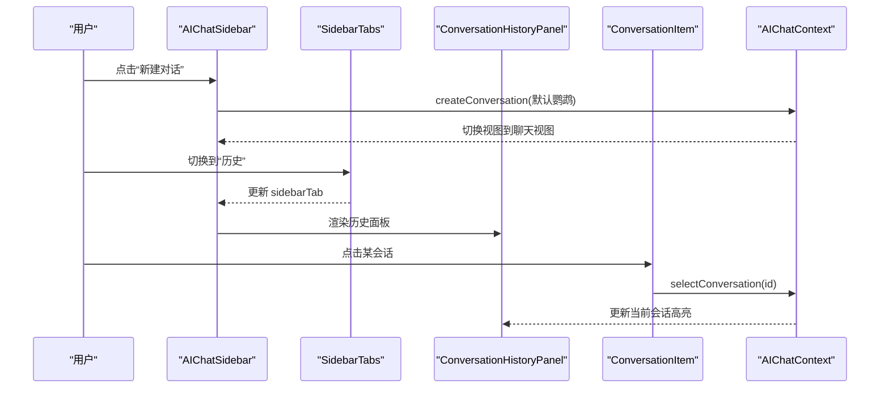
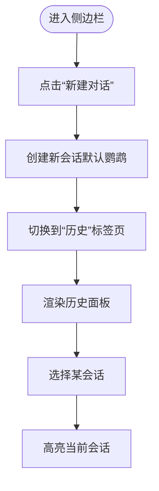
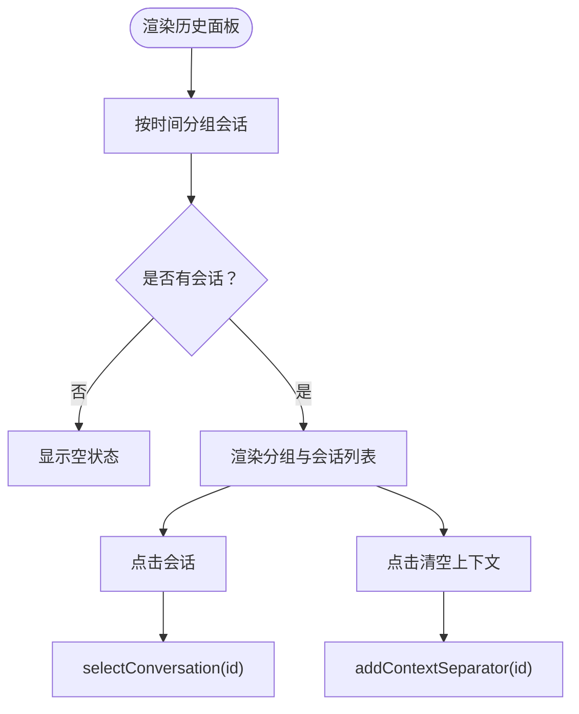
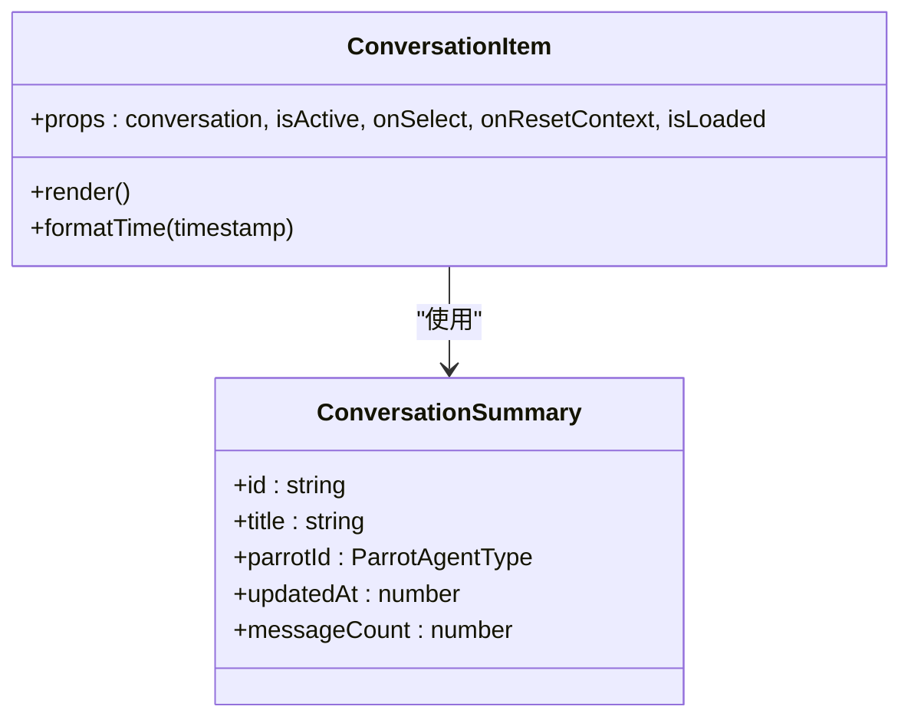
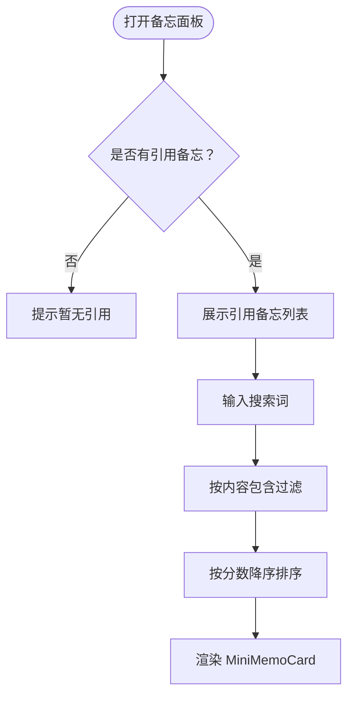
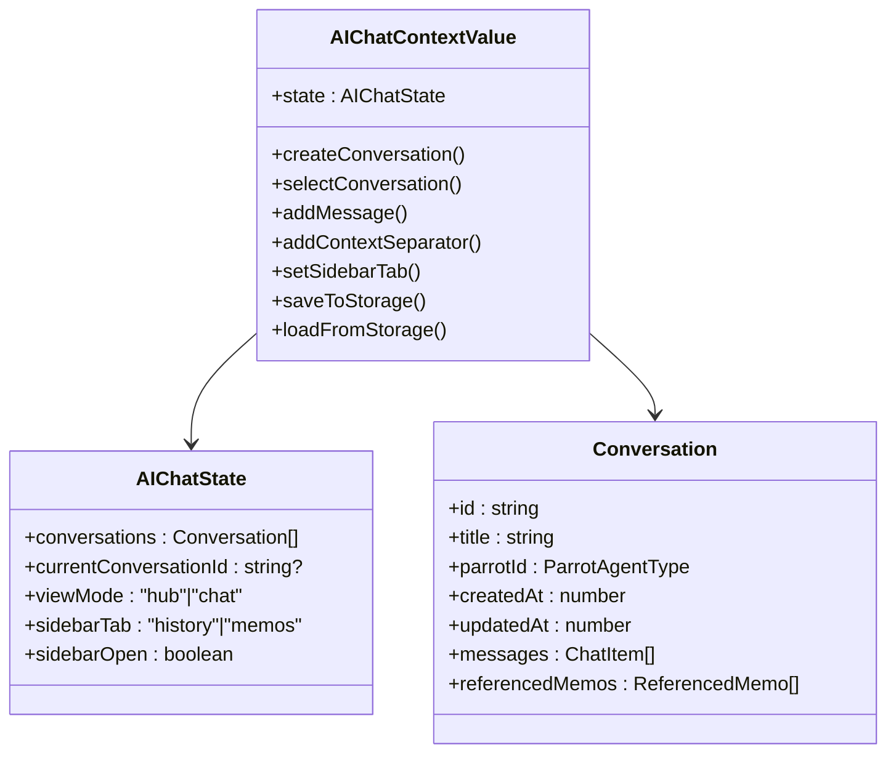
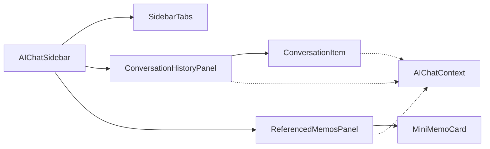

# 对话管理组件

<cite>
**本文引用的文件**
- [AIChatSidebar.tsx](file://web/src/components/AIChat/AIChatSidebar.tsx)
- [ConversationHistoryPanel.tsx](file://web/src/components/AIChat/ConversationHistoryPanel.tsx)
- [ConversationItem.tsx](file://web/src/components/AIChat/ConversationItem.tsx)
- [SidebarTabs.tsx](file://web/src/components/AIChat/SidebarTabs.tsx)
- [ReferencedMemosPanel.tsx](file://web/src/components/AIChat/ReferencedMemosPanel.tsx)
- [MiniMemoCard.tsx](file://web/src/components/AIChat/MiniMemoCard.tsx)
- [AIChatContext.tsx](file://web/src/contexts/AIChatContext.tsx)
- [aichat.ts](file://web/src/types/aichat.ts)
</cite>

## 目录
1. [简介](#简介)
2. [项目结构](#项目结构)
3. [核心组件](#核心组件)
4. [架构总览](#架构总览)
5. [详细组件分析](#详细组件分析)
6. [依赖关系分析](#依赖关系分析)
7. [性能考量](#性能考量)
8. [故障排查指南](#故障排查指南)
9. [结论](#结论)
10. [附录](#附录)

## 简介
本文件聚焦“对话管理组件”，围绕以下目标展开：
- 对话历史面板：历史记录展示、时间分组、选择与上下文清空
- 对话项组件：缩略预览、时间戳显示、状态标记（加载态）、鹦鹉头像与主题
- 侧边栏布局与标签页切换：统一入口、新建对话、历史/备忘检索双面板
- 用户体验设计：简洁直观、减少认知负担
- 数据持久化与性能优化：本地存储、防抖保存、增量消息同步、懒加载与虚拟滚动建议

## 项目结构
对话管理相关前端代码主要位于 web/src/components/AIChat 与 web/src/contexts/AIChatContext.tsx，类型定义位于 web/src/types/aichat.ts。

图表来源
- [AIChatSidebar.tsx](file://web/src/components/AIChat/AIChatSidebar.tsx#L24-L69)
- [SidebarTabs.tsx](file://web/src/components/AIChat/SidebarTabs.tsx#L16-L38)
- [ConversationHistoryPanel.tsx](file://web/src/components/AIChat/ConversationHistoryPanel.tsx#L22-L112)
- [ConversationItem.tsx](file://web/src/components/AIChat/ConversationItem.tsx#L16-L74)
- [ReferencedMemosPanel.tsx](file://web/src/components/AIChat/ReferencedMemosPanel.tsx#L12-L69)
- [AIChatContext.tsx](file://web/src/contexts/AIChatContext.tsx#L833-L862)
- [aichat.ts](file://web/src/types/aichat.ts#L120-L177)

章节来源
- [AIChatSidebar.tsx](file://web/src/components/AIChat/AIChatSidebar.tsx#L1-L70)
- [SidebarTabs.tsx](file://web/src/components/AIChat/SidebarTabs.tsx#L1-L68)
- [ConversationHistoryPanel.tsx](file://web/src/components/AIChat/ConversationHistoryPanel.tsx#L1-L127)
- [ConversationItem.tsx](file://web/src/components/AIChat/ConversationItem.tsx#L1-L126)
- [ReferencedMemosPanel.tsx](file://web/src/components/AIChat/ReferencedMemosPanel.tsx#L1-L102)
- [AIChatContext.tsx](file://web/src/contexts/AIChatContext.tsx#L807-L863)
- [aichat.ts](file://web/src/types/aichat.ts#L1-L210)

## 核心组件
- 侧边栏容器：提供新建对话入口、标签页切换与内容区渲染
- 历史面板：按时间分组展示会话摘要、支持选择与上下文清空
- 会话项：展示标题、消息数、更新时间、鹦鹉图标与主题、清空上下文按钮
- 标签页：历史/备忘双面板切换
- 备忘检索面板：基于当前会话引用的备忘进行搜索与排序
- 上下文：集中管理对话状态、动作与持久化

章节来源
- [AIChatSidebar.tsx](file://web/src/components/AIChat/AIChatSidebar.tsx#L24-L69)
- [ConversationHistoryPanel.tsx](file://web/src/components/AIChat/ConversationHistoryPanel.tsx#L22-L112)
- [ConversationItem.tsx](file://web/src/components/AIChat/ConversationItem.tsx#L16-L74)
- [SidebarTabs.tsx](file://web/src/components/AIChat/SidebarTabs.tsx#L16-L38)
- [ReferencedMemosPanel.tsx](file://web/src/components/AIChat/ReferencedMemosPanel.tsx#L12-L69)
- [AIChatContext.tsx](file://web/src/contexts/AIChatContext.tsx#L833-L862)
- [aichat.ts](file://web/src/types/aichat.ts#L120-L177)

## 架构总览
对话管理采用“上下文驱动 + 组件解耦”的架构：
- 上下文负责状态与动作（创建/选择/更新/持久化/消息同步等）
- 侧边栏作为容器协调标签页与面板
- 历史面板聚合会话摘要并分组展示
- 会话项承载单条记录的交互与状态反馈
- 备忘面板在“备忘”标签页内展示当前会话引用的备忘，并支持搜索与排序

图表来源
- [AIChatSidebar.tsx](file://web/src/components/AIChat/AIChatSidebar.tsx#L33-L37)
- [SidebarTabs.tsx](file://web/src/components/AIChat/SidebarTabs.tsx#L22-L35)
- [ConversationHistoryPanel.tsx](file://web/src/components/AIChat/ConversationHistoryPanel.tsx#L62-L65)
- [AIChatContext.tsx](file://web/src/contexts/AIChatContext.tsx#L394-L400)

## 详细组件分析

### 侧边栏布局与标签页切换
- 统一入口：顶部固定“新建对话”按钮，引导用户快速开始
- 标签页：历史/备忘两档，使用圆角分割控件，视觉清晰
- 内容区：根据当前标签页动态渲染历史面板或备忘面板

图表来源
- [AIChatSidebar.tsx](file://web/src/components/AIChat/AIChatSidebar.tsx#L33-L37)
- [SidebarTabs.tsx](file://web/src/components/AIChat/SidebarTabs.tsx#L22-L35)
- [AIChatContext.tsx](file://web/src/contexts/AIChatContext.tsx#L394-L400)

章节来源
- [AIChatSidebar.tsx](file://web/src/components/AIChat/AIChatSidebar.tsx#L24-L69)
- [SidebarTabs.tsx](file://web/src/components/AIChat/SidebarTabs.tsx#L16-L68)

### 对话历史面板
- 时间分组：按“今天/昨天/本周/更早”分组，仅展示非空分组
- 交互：点击会话触发选择；支持清空上下文（通过添加上下文分隔符）
- 空状态：无历史时提示“开始新对话”

图表来源
- [ConversationHistoryPanel.tsx](file://web/src/components/AIChat/ConversationHistoryPanel.tsx#L31-L60)
- [AIChatContext.tsx](file://web/src/contexts/AIChatContext.tsx#L394-L400)
- [AIChatContext.tsx](file://web/src/contexts/AIChatContext.tsx#L513-L541)

章节来源
- [ConversationHistoryPanel.tsx](file://web/src/components/AIChat/ConversationHistoryPanel.tsx#L22-L112)

### 对话项组件（缩略预览、时间戳、状态标记）
- 缩略预览：鹦鹉图标与主题背景、标题、消息数、更新时间
- 状态标记：通过“是否已加载”决定是否显示真实消息数（否则显示占位）
- 交互：点击选择；右侧提供清空上下文按钮（仅在已加载时可见）

图表来源
- [ConversationItem.tsx](file://web/src/components/AIChat/ConversationItem.tsx#L16-L74)
- [aichat.ts](file://web/src/types/aichat.ts#L111-L117)

章节来源
- [ConversationItem.tsx](file://web/src/components/AIChat/ConversationItem.tsx#L16-L126)
- [aichat.ts](file://web/src/types/aichat.ts#L111-L117)

### 备忘检索面板（搜索过滤与排序）
- 搜索：输入框实时过滤当前会话引用的备忘
- 排序：按相似度分数降序排列
- 展示：MiniMemoCard 提供内容截断、时间与分数标签

图表来源
- [ReferencedMemosPanel.tsx](file://web/src/components/AIChat/ReferencedMemosPanel.tsx#L19-L24)
- [MiniMemoCard.tsx](file://web/src/components/AIChat/MiniMemoCard.tsx#L12-L48)

章节来源
- [ReferencedMemosPanel.tsx](file://web/src/components/AIChat/ReferencedMemosPanel.tsx#L12-L102)
- [MiniMemoCard.tsx](file://web/src/components/AIChat/MiniMemoCard.tsx#L1-L78)

### 类型与上下文（状态与动作）
- 类型：会话、会话摘要、消息、上下文分隔符、侧边栏标签、存储键名等
- 上下文：提供创建/选择/更新/删除会话、增删消息、清空上下文、切换视图/标签、持久化等动作

图表来源
- [aichat.ts](file://web/src/types/aichat.ts#L120-L177)
- [aichat.ts](file://web/src/types/aichat.ts#L96-L117)
- [AIChatContext.tsx](file://web/src/contexts/AIChatContext.tsx#L833-L862)

章节来源
- [aichat.ts](file://web/src/types/aichat.ts#L1-L210)
- [AIChatContext.tsx](file://web/src/contexts/AIChatContext.tsx#L833-L862)

## 依赖关系分析
- 组件耦合
  - AIChatSidebar 依赖 SidebarTabs、ConversationHistoryPanel、ReferencedMemosPanel
  - ConversationHistoryPanel 依赖 ConversationItem 与 AIChatContext
  - ReferencedMemosPanel 依赖 MiniMemoCard 与 AIChatContext
- 外部依赖
  - 国际化（i18n）、样式工具类（cn）、通知（toast）
  - AI 服务客户端用于创建/同步/清空上下文等后端交互
- 潜在循环依赖
  - 当前文件间为单向依赖，未见循环导入

图表来源
- [AIChatSidebar.tsx](file://web/src/components/AIChat/AIChatSidebar.tsx#L1-L70)
- [SidebarTabs.tsx](file://web/src/components/AIChat/SidebarTabs.tsx#L1-L68)
- [ConversationHistoryPanel.tsx](file://web/src/components/AIChat/ConversationHistoryPanel.tsx#L1-L127)
- [ConversationItem.tsx](file://web/src/components/AIChat/ConversationItem.tsx#L1-L126)
- [ReferencedMemosPanel.tsx](file://web/src/components/AIChat/ReferencedMemosPanel.tsx#L1-L102)
- [MiniMemoCard.tsx](file://web/src/components/AIChat/MiniMemoCard.tsx#L1-L78)
- [AIChatContext.tsx](file://web/src/contexts/AIChatContext.tsx#L833-L862)

章节来源
- [AIChatSidebar.tsx](file://web/src/components/AIChat/AIChatSidebar.tsx#L1-L70)
- [AIChatContext.tsx](file://web/src/contexts/AIChatContext.tsx#L833-L862)

## 性能考量
- 本地存储与防抖
  - 状态变更后 500ms 防抖保存，避免频繁写入
  - 首次挂载时从本地恢复，保证离线可用
- 增量消息同步
  - 使用消息缓存结构与 FIFO 策略，仅拉取必要历史，降低网络与内存压力
- 渲染优化
  - 历史面板对会话进行时间分组，减少长列表渲染开销
  - 会话项按需显示消息数（未加载时显示占位），避免不必要的计算
- 建议
  - 大列表可引入虚拟滚动（如 react-window 或 react-virtual）以进一步降低渲染成本
  - 备忘卡片内容截断与颜色评分可结合懒加载图片优化首屏

章节来源
- [AIChatContext.tsx](file://web/src/contexts/AIChatContext.tsx#L808-L820)
- [aichat.ts](file://web/src/types/aichat.ts#L87-L91)
- [ConversationHistoryPanel.tsx](file://web/src/components/AIChat/ConversationHistoryPanel.tsx#L26-L29)
- [ConversationItem.tsx](file://web/src/components/AIChat/ConversationItem.tsx#L22-L23)

## 故障排查指南
- 无法新建会话
  - 检查上下文动作 createConversation 是否被调用，确认默认鹦鹉类型正确
  - 关注后端创建接口返回与状态切换逻辑
- 历史为空或不更新
  - 确认 loadFromStorage 与 refreshConversations 的调用顺序
  - 检查本地迁移流程与云端同步状态
- 清空上下文无效
  - 确认 addContextSeparator 已调用后端接口并刷新会话
  - 注意：移除了乐观更新以避免重复分隔符
- 搜索无结果
  - 确认当前会话确实存在引用备忘
  - 检查过滤逻辑大小写与关键词拆分

章节来源
- [AIChatContext.tsx](file://web/src/contexts/AIChatContext.tsx#L259-L279)
- [AIChatContext.tsx](file://web/src/contexts/AIChatContext.tsx#L513-L541)
- [ReferencedMemosPanel.tsx](file://web/src/components/AIChat/ReferencedMemosPanel.tsx#L19-L24)

## 结论
对话管理组件通过清晰的侧边栏布局、时间分组的历史面板、直观的会话项与标签页切换，提供了高效且易用的对话浏览与检索体验。配合本地存储防抖、增量消息同步与可扩展的上下文动作，系统在可用性与性能之间取得良好平衡。后续可在大列表场景引入虚拟滚动与更精细的缓存策略，持续优化用户体验。

## 附录
- 术语
  - 会话摘要：用于侧边栏展示的轻量信息集合
  - 上下文分隔符：用于清空对话上下文的特殊消息
  - 增量同步：仅拉取前后窗口的消息，维持消息总数上限