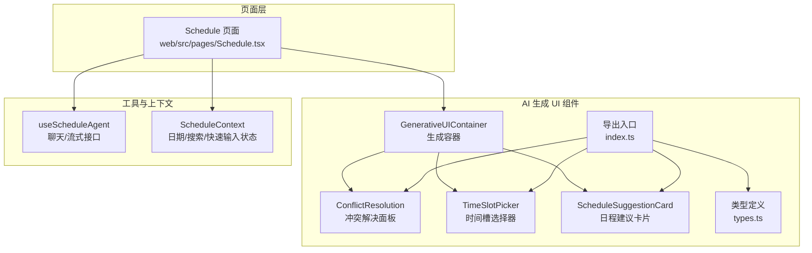
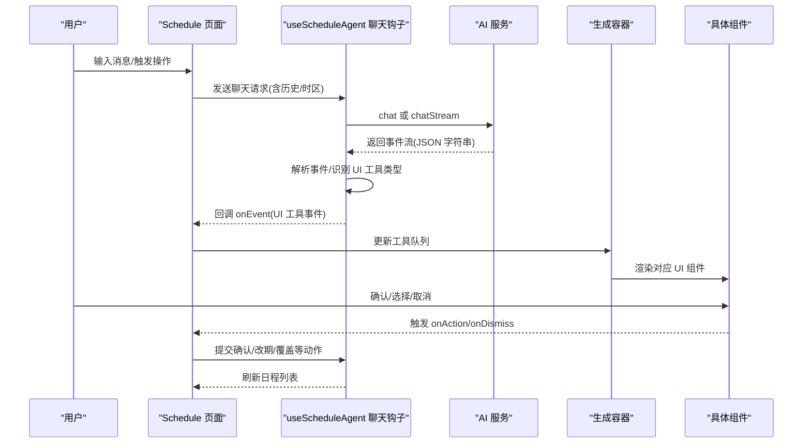
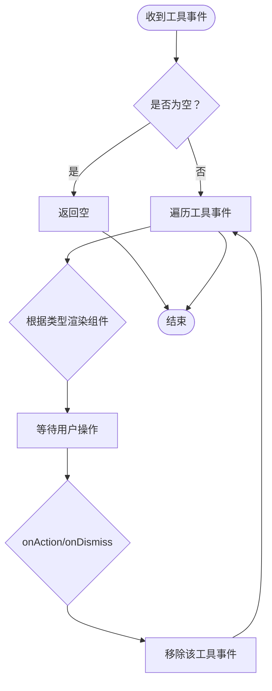
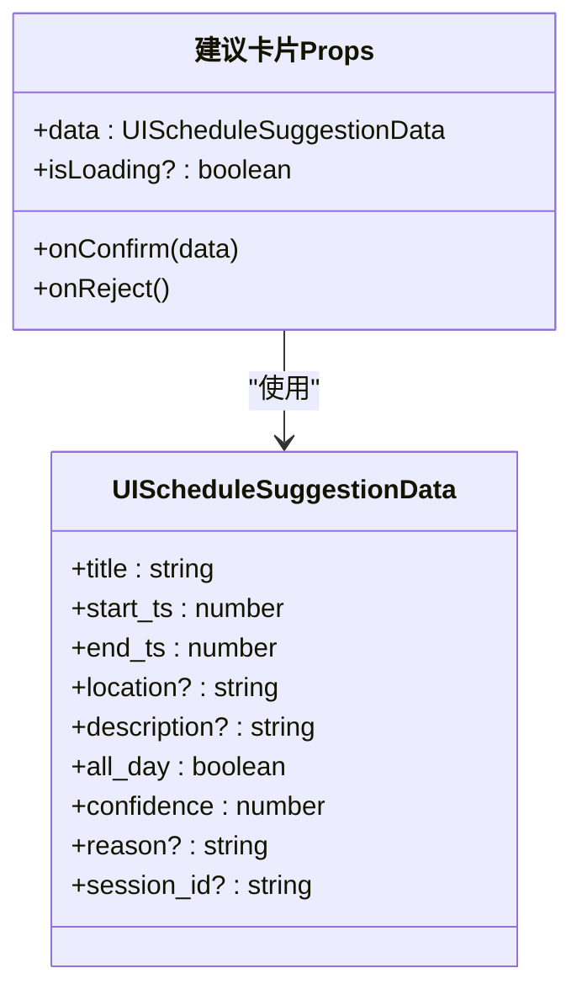
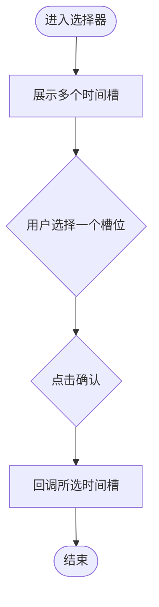
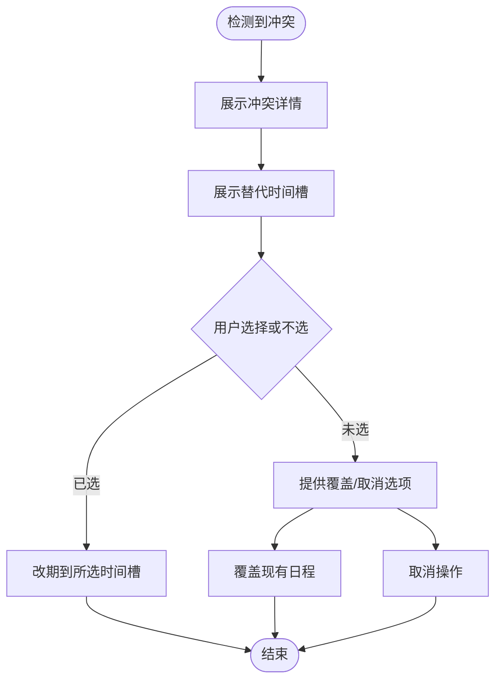
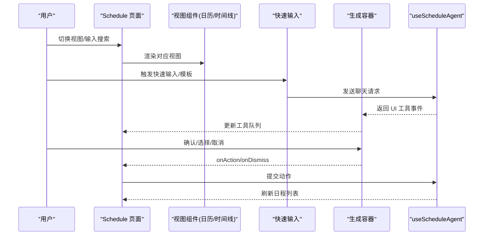
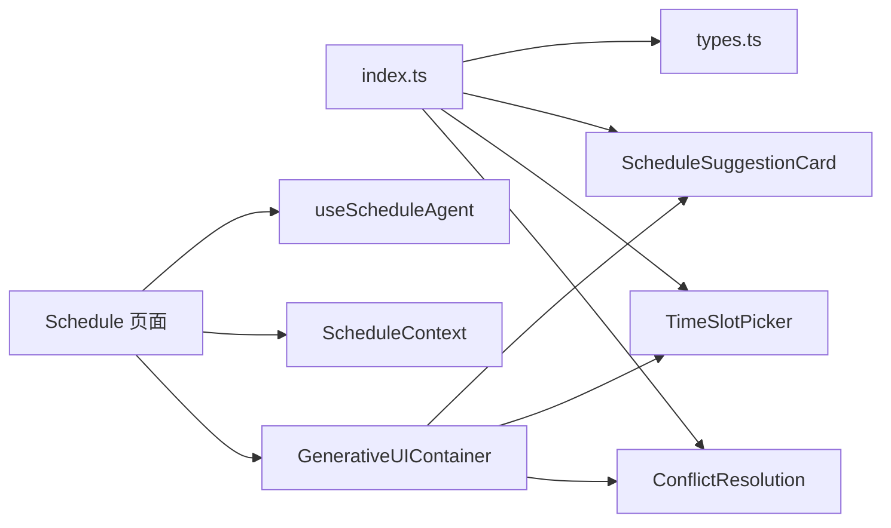

# 日程 AI 组件

<cite>
**本文引用的文件**
- [Schedule.tsx](file://web/src/pages/Schedule.tsx)
- [ScheduleAI/index.ts](file://web/src/components/ScheduleAI/index.ts)
- [ScheduleAI/GenerativeUIContainer.tsx](file://web/src/components/ScheduleAI/GenerativeUIContainer.tsx)
- [ScheduleAI/ScheduleSuggestionCard.tsx](file://web/src/components/ScheduleAI/ScheduleSuggestionCard.tsx)
- [ScheduleAI/TimeSlotPicker.tsx](file://web/src/components/ScheduleAI/TimeSlotPicker.tsx)
- [ScheduleAI/ConflictResolution.tsx](file://web/src/components/ScheduleAI/ConflictResolution.tsx)
- [ScheduleAI/types.ts](file://web/src/components/ScheduleAI/types.ts)
- [useScheduleAgent.ts](file://web/src/hooks/useScheduleAgent.ts)
- [ScheduleContext.tsx](file://web/src/contexts/ScheduleContext.tsx)
</cite>

## 目录
1. [简介](#简介)
2. [项目结构](#项目结构)
3. [核心组件](#核心组件)
4. [架构总览](#架构总览)
5. [详细组件分析](#详细组件分析)
6. [依赖关系分析](#依赖关系分析)
7. [性能考量](#性能考量)
8. [故障排查指南](#故障排查指南)
9. [结论](#结论)
10. [附录](#附录)

## 简介
本文件系统性梳理日程 AI 侧边栏与日程页面中 AI 生成 UI 的设计与实现，覆盖以下要点：
- 日程输入界面（快速输入与模板）、搜索栏与时间线视图的交互
- 日历组件与时间轴组件的切换与联动
- 冲突解决面板、冲突警告与流式日程助手的实现机制
- 日程建议提示、智能解析与用户引导的最佳实践

目标是帮助开发者与产品人员快速理解组件职责、数据流与交互流程，并为后续扩展与优化提供依据。

## 项目结构
日程 AI 相关前端代码主要位于 web/src/components/ScheduleAI 与 web/src/pages/Schedule.tsx，配合 hooks 与上下文共同完成端到端能力。

图表来源
- [Schedule.tsx](file://web/src/pages/Schedule.tsx#L1-L196)
- [ScheduleAI/index.ts](file://web/src/components/ScheduleAI/index.ts#L1-L20)
- [ScheduleAI/GenerativeUIContainer.tsx](file://web/src/components/ScheduleAI/GenerativeUIContainer.tsx#L1-L104)
- [ScheduleAI/ConflictResolution.tsx](file://web/src/components/ScheduleAI/ConflictResolution.tsx#L1-L135)
- [ScheduleAI/TimeSlotPicker.tsx](file://web/src/components/ScheduleAI/TimeSlotPicker.tsx#L1-L80)
- [ScheduleAI/ScheduleSuggestionCard.tsx](file://web/src/components/ScheduleAI/ScheduleSuggestionCard.tsx#L1-L80)
- [ScheduleAI/types.ts](file://web/src/components/ScheduleAI/types.ts#L1-L101)
- [useScheduleAgent.ts](file://web/src/hooks/useScheduleAgent.ts#L1-L235)
- [ScheduleContext.tsx](file://web/src/contexts/ScheduleContext.tsx#L1-L64)

章节来源
- [Schedule.tsx](file://web/src/pages/Schedule.tsx#L1-L196)
- [ScheduleAI/index.ts](file://web/src/components/ScheduleAI/index.ts#L1-L20)

## 核心组件
- 生成容器（GenerativeUIContainer）：接收来自 AI 的 UI 工具事件，按类型渲染具体组件，并在 5 分钟后自动过期关闭。
- 建议卡片（ScheduleSuggestionCard）：展示 AI 推荐的日程信息（标题、时间、地点、置信度等），支持确认或拒绝。
- 时间槽选择器（TimeSlotPicker）：在多个备选时间段中供用户选择一个作为最终时间。
- 冲突解决面板（ConflictResolution）：当存在日程冲突时，展示冲突详情与替代时间槽，并提供“改期”“覆盖”“取消”等操作。
- 类型系统（types.ts）：统一定义 UI 工具事件、动作类型与数据结构，确保组件间契约一致。
- 钩子（useScheduleAgent.ts）：封装非流式与流式聊天接口，负责事件解析与 UI 工具类型识别。
- 上下文（ScheduleContext）：管理当前选中日期、搜索过滤状态与快速输入开关，驱动页面视图切换与数据刷新。

章节来源
- [ScheduleAI/GenerativeUIContainer.tsx](file://web/src/components/ScheduleAI/GenerativeUIContainer.tsx#L1-L104)
- [ScheduleAI/ScheduleSuggestionCard.tsx](file://web/src/components/ScheduleAI/ScheduleSuggestionCard.tsx#L1-L80)
- [ScheduleAI/TimeSlotPicker.tsx](file://web/src/components/ScheduleAI/TimeSlotPicker.tsx#L1-L80)
- [ScheduleAI/ConflictResolution.tsx](file://web/src/components/ScheduleAI/ConflictResolution.tsx#L1-L135)
- [ScheduleAI/types.ts](file://web/src/components/ScheduleAI/types.ts#L1-L101)
- [useScheduleAgent.ts](file://web/src/hooks/useScheduleAgent.ts#L1-L235)
- [ScheduleContext.tsx](file://web/src/contexts/ScheduleContext.tsx#L1-L64)

## 架构总览
日程页面通过上下文维护视图状态，使用查询钩子加载日程数据；AI 流式聊天返回的事件被解析为 UI 工具事件，由生成容器统一调度渲染。

图表来源
- [Schedule.tsx](file://web/src/pages/Schedule.tsx#L57-L64)
- [useScheduleAgent.ts](file://web/src/hooks/useScheduleAgent.ts#L200-L235)
- [ScheduleAI/GenerativeUIContainer.tsx](file://web/src/components/ScheduleAI/GenerativeUIContainer.tsx#L15-L60)

## 详细组件分析

### 生成容器（GenerativeUIContainer）
- 职责：接收一组 UI 工具事件，按类型渲染建议卡片、时间槽选择器或冲突解决面板；为每个工具设置 5 分钟有效期，到期自动移除。
- 关键点：
  - 工具事件包含唯一 id、类型与数据，以及时间戳，用于过期控制与动作回传。
  - onAction/onDismiss 将工具 id 与动作类型一并传递，便于上层清理与状态同步。
  - 支持多种工具类型：schedule_suggestion、time_slot_picker、conflict_resolution、quick_actions。

图表来源
- [ScheduleAI/GenerativeUIContainer.tsx](file://web/src/components/ScheduleAI/GenerativeUIContainer.tsx#L15-L60)
- [ScheduleAI/GenerativeUIContainer.tsx](file://web/src/components/ScheduleAI/GenerativeUIContainer.tsx#L71-L104)

章节来源
- [ScheduleAI/GenerativeUIContainer.tsx](file://web/src/components/ScheduleAI/GenerativeUIContainer.tsx#L1-L104)
- [ScheduleAI/types.ts](file://web/src/components/ScheduleAI/types.ts#L23-L50)

### 建议卡片（ScheduleSuggestionCard）
- 职责：以卡片形式展示 AI 推荐的日程信息，包含标题、日期与起止时间、地点与理由等；支持确认创建或直接取消。
- 关键点：
  - 加载态文案通过国际化兜底，保证用户体验一致性。
  - 数据来源于 UI 工具事件中的建议数据，包含置信度与会话标识（可选）。

图表来源
- [ScheduleAI/ScheduleSuggestionCard.tsx](file://web/src/components/ScheduleAI/ScheduleSuggestionCard.tsx#L7-L22)
- [useScheduleAgent.ts](file://web/src/hooks/useScheduleAgent.ts#L31-L41)

章节来源
- [ScheduleAI/ScheduleSuggestionCard.tsx](file://web/src/components/ScheduleAI/ScheduleSuggestionCard.tsx#L1-L80)
- [useScheduleAgent.ts](file://web/src/hooks/useScheduleAgent.ts#L31-L41)

### 时间槽选择器（TimeSlotPicker）
- 职责：在多个备选时间段中供用户选择一个作为最终时间；支持默认索引与原因说明。
- 关键点：
  - 选择后回调所选时间槽，包含标签、起止时间、时长与原因。
  - 支持“确认”按钮与“取消”按钮，取消即关闭该工具。

图表来源
- [ScheduleAI/TimeSlotPicker.tsx](file://web/src/components/ScheduleAI/TimeSlotPicker.tsx#L7-L18)
- [useScheduleAgent.ts](file://web/src/hooks/useScheduleAgent.ts#L43-L56)

章节来源
- [ScheduleAI/TimeSlotPicker.tsx](file://web/src/components/ScheduleAI/TimeSlotPicker.tsx#L1-L80)
- [useScheduleAgent.ts](file://web/src/hooks/useScheduleAgent.ts#L43-L56)

### 冲突解决面板（ConflictResolution）
- 职责：当新日程与现有日程冲突时，展示冲突详情与替代时间槽，提供“改期”“覆盖”“取消”等操作。
- 关键点：
  - 展示冲突数量与首个冲突详情；支持多槽位选择。
  - 改期时需携带所选替代时间槽；覆盖则直接执行；取消则放弃。

图表来源
- [ScheduleAI/ConflictResolution.tsx](file://web/src/components/ScheduleAI/ConflictResolution.tsx#L8-L25)
- [useScheduleAgent.ts](file://web/src/hooks/useScheduleAgent.ts#L58-L73)

章节来源
- [ScheduleAI/ConflictResolution.tsx](file://web/src/components/ScheduleAI/ConflictResolution.tsx#L1-L135)
- [useScheduleAgent.ts](file://web/src/hooks/useScheduleAgent.ts#L58-L73)

### 页面集成与交互（Schedule 页面）
- 职责：承载日历/时间线视图、搜索栏、快速输入与 AI 生成 UI 容器；协调上下文状态与查询刷新。
- 关键点：
  - 顶部视图切换（时间线/月视图）与搜索栏联动；搜索开启时强制时间线视图。
  - 快速输入区域集成 AI 生成 UI，支持在创建日程后刷新列表。
  - UI 动作回调会移除对应工具事件并触发查询失效，确保数据一致性。

图表来源
- [Schedule.tsx](file://web/src/pages/Schedule.tsx#L18-L64)
- [Schedule.tsx](file://web/src/pages/Schedule.tsx#L147-L177)
- [ScheduleContext.tsx](file://web/src/contexts/ScheduleContext.tsx#L34-L63)

章节来源
- [Schedule.tsx](file://web/src/pages/Schedule.tsx#L1-L196)
- [ScheduleContext.tsx](file://web/src/contexts/ScheduleContext.tsx#L1-L64)

## 依赖关系分析
- 组件导出入口：通过 index.ts 汇总导出各子组件与类型，便于上层统一引用。
- 类型契约：types.ts 与 useScheduleAgent.ts 共同定义 UI 工具事件、动作与数据结构，确保组件间解耦与强约束。
- 页面依赖：Schedule 页面依赖上下文与查询钩子，同时组合生成容器与快速输入组件，形成完整的日程工作流。

图表来源
- [ScheduleAI/index.ts](file://web/src/components/ScheduleAI/index.ts#L6-L19)
- [ScheduleAI/types.ts](file://web/src/components/ScheduleAI/types.ts#L14-L21)
- [ScheduleAI/GenerativeUIContainer.tsx](file://web/src/components/ScheduleAI/GenerativeUIContainer.tsx#L4-L6)
- [Schedule.tsx](file://web/src/pages/Schedule.tsx#L1-L14)

章节来源
- [ScheduleAI/index.ts](file://web/src/components/ScheduleAI/index.ts#L1-L20)
- [ScheduleAI/types.ts](file://web/src/components/ScheduleAI/types.ts#L1-L101)
- [ScheduleAI/GenerativeUIContainer.tsx](file://web/src/components/ScheduleAI/GenerativeUIContainer.tsx#L1-L104)
- [Schedule.tsx](file://web/src/pages/Schedule.tsx#L1-L196)

## 性能考量
- 工具事件过期：生成容器为每个 UI 工具设置 5 分钟有效期，避免无界增长与内存泄漏。
- 查询失效：动作完成后触发查询失效，确保数据一致性，同时避免频繁全量刷新。
- 渲染粒度：按工具事件拆分渲染，仅更新受影响的 UI 片段，降低重绘成本。
- 事件解析：对流式事件进行 JSON 解析与类型识别，失败时记录错误但不影响主流程。

章节来源
- [ScheduleAI/GenerativeUIContainer.tsx](file://web/src/components/ScheduleAI/GenerativeUIContainer.tsx#L16-L37)
- [useScheduleAgent.ts](file://web/src/hooks/useScheduleAgent.ts#L138-L174)

## 故障排查指南
- 事件解析失败：若事件 JSON 不合法，解析函数会返回空并记录错误日志，需检查上游事件格式。
- UI 工具类型识别：仅识别以 ui_ 开头的事件类型，其他事件会被忽略；请确认事件类型命名规范。
- 工具未消失：若超过 5 分钟仍未消失，检查 onDismiss 回调是否正确传递至生成容器。
- 数据未刷新：确认 onAction 后是否调用查询失效以刷新日程列表。
- 冲突面板无响应：检查冲突数据结构与槽位选择逻辑，确保改期时携带了有效时间槽。

章节来源
- [useScheduleAgent.ts](file://web/src/hooks/useScheduleAgent.ts#L138-L174)
- [ScheduleAI/GenerativeUIContainer.tsx](file://web/src/components/ScheduleAI/GenerativeUIContainer.tsx#L16-L37)
- [Schedule.tsx](file://web/src/pages/Schedule.tsx#L57-L64)

## 结论
日程 AI 侧边栏通过“生成容器 + 多种 UI 工具组件”的模式，实现了从 AI 流式事件到用户可交互界面的完整闭环。结合上下文与查询钩子，页面在视图切换、搜索过滤、快速输入与冲突处理等方面保持一致的用户体验。建议在后续迭代中进一步完善国际化文案、增强错误提示与可访问性，并对工具事件的生命周期管理进行更细粒度的控制。

## 附录
- 最佳实践
  - 在 UI 工具事件中附带会话标识，便于追踪与调试。
  - 对于高风险操作（如覆盖），增加二次确认对话框。
  - 为时间槽选择器提供“快速预览”功能，减少用户决策成本。
  - 在搜索开启时，优先展示时间线视图以提升信息密度。
  - 对流式事件进行节流与去抖，避免频繁渲染导致的卡顿。