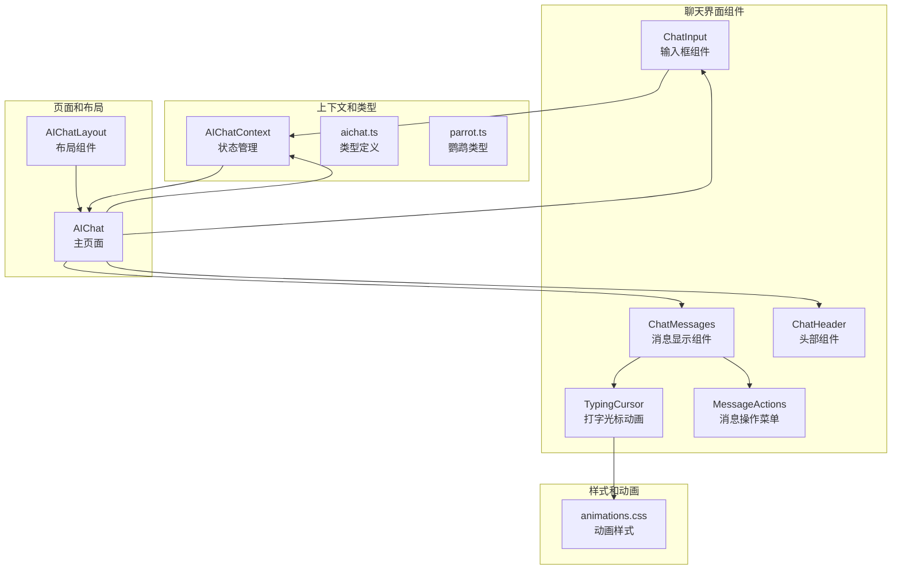
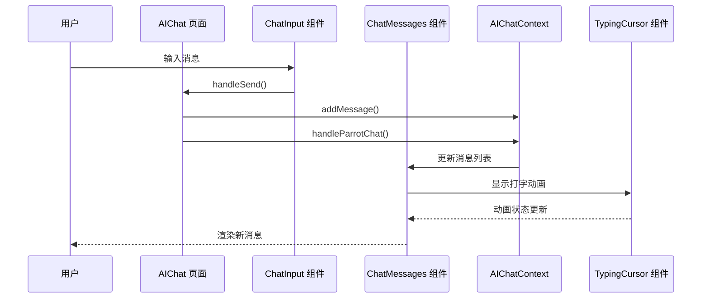
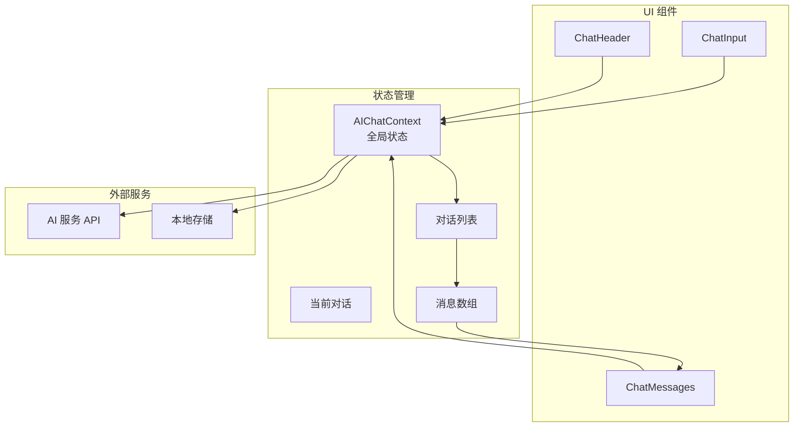
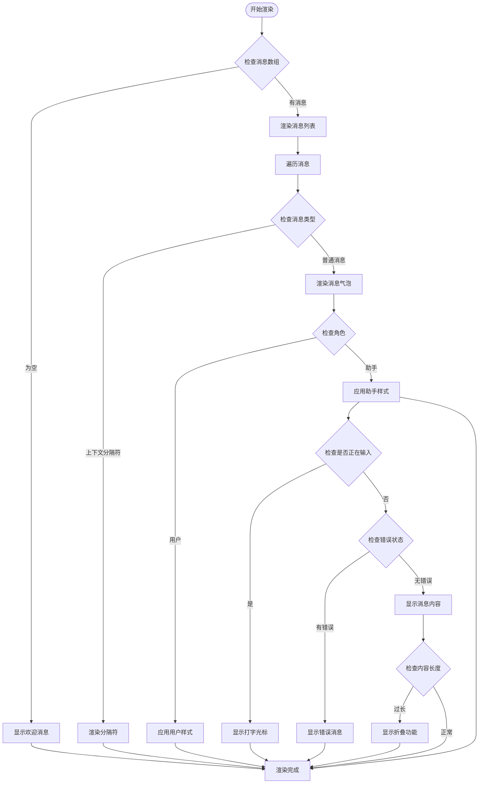
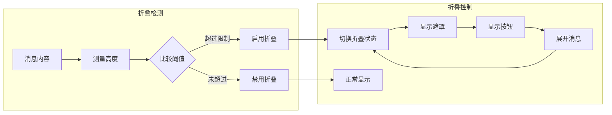
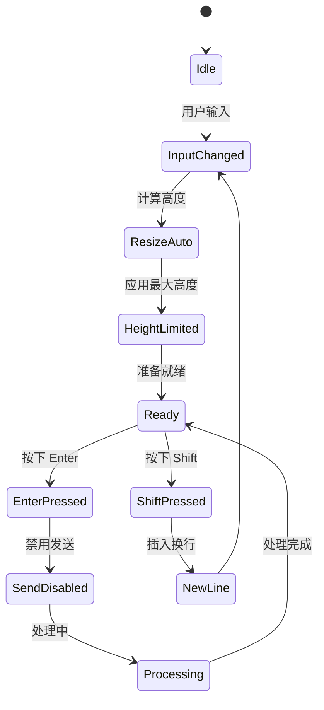
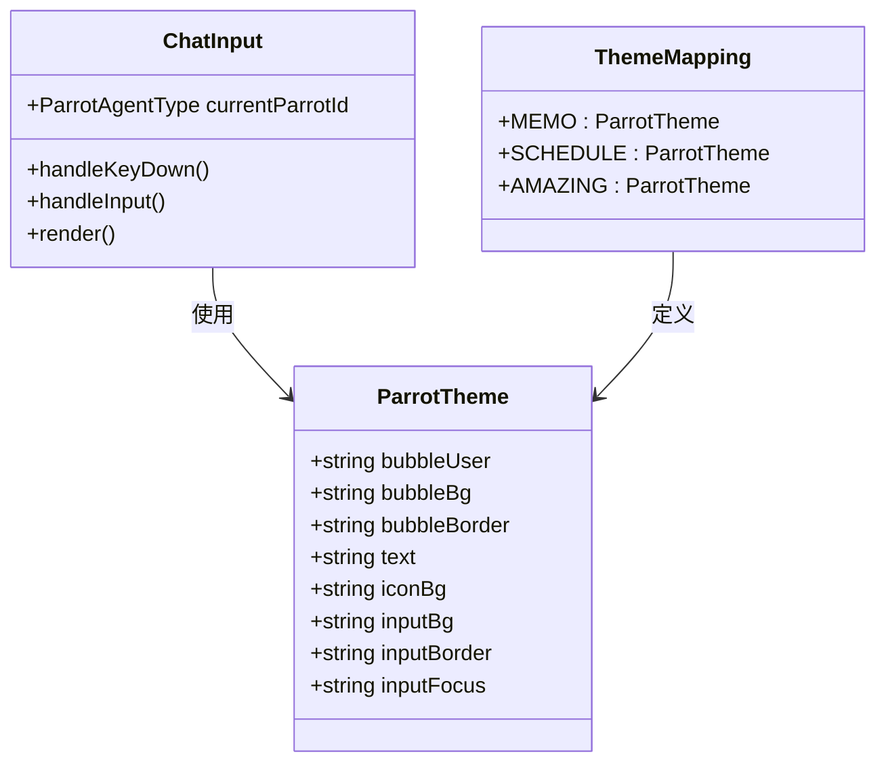
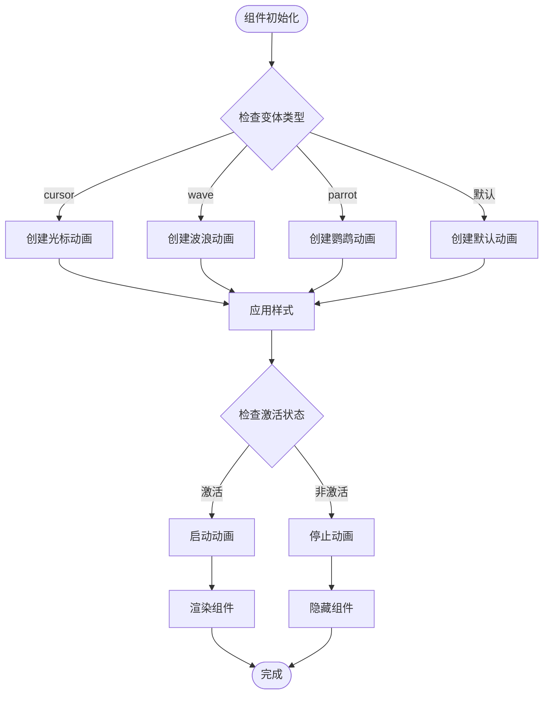
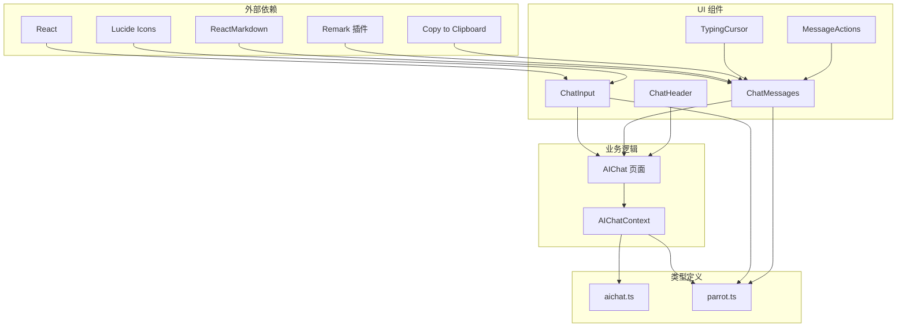
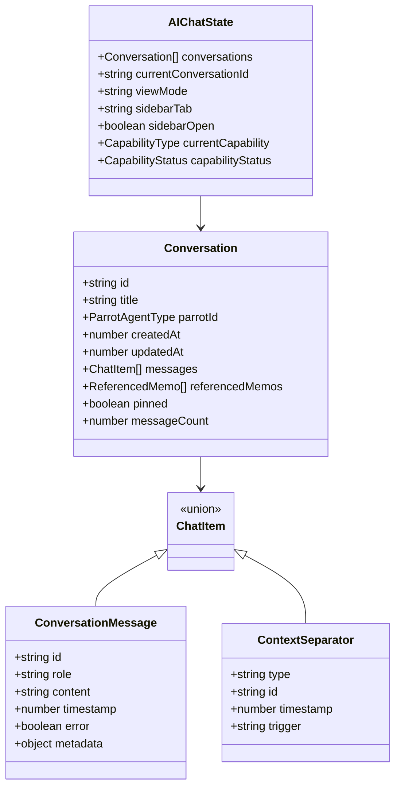

# 聊天界面组件

<cite>
**本文档引用的文件**
- [ChatMessages.tsx](file://web/src/components/AIChat/ChatMessages.tsx)
- [ChatInput.tsx](file://web/src/components/AIChat/ChatInput.tsx)
- [ChatHeader.tsx](file://web/src/components/AIChat/ChatHeader.tsx)
- [TypingCursor.tsx](file://web/src/components/AIChat/TypingCursor.tsx)
- [MessageActions.tsx](file://web/src/components/AIChat/MessageActions.tsx)
- [AIChat.tsx](file://web/src/pages/AIChat.tsx)
- [AIChatLayout.tsx](file://web/src/layouts/AIChatLayout.tsx)
- [AIChatContext.tsx](file://web/src/contexts/AIChatContext.tsx)
- [aichat.ts](file://web/src/types/aichat.ts)
- [parrot.ts](file://web/src/types/parrot.ts)
- [animations.css](file://web/src/components/AIChat/animations.css)
</cite>

## 目录
1. [简介](#简介)
2. [项目结构](#项目结构)
3. [核心组件](#核心组件)
4. [架构概览](#架构概览)
5. [详细组件分析](#详细组件分析)
6. [依赖关系分析](#依赖关系分析)
7. [性能考虑](#性能考虑)
8. [故障排除指南](#故障排除指南)
9. [结论](#结论)

## 简介

本项目是一个基于 React 和 TypeScript 构建的 AI 聊天界面组件系统。该系统提供了完整的聊天功能，包括消息显示、输入处理、状态管理和动画效果。组件采用模块化设计，支持响应式布局和无障碍访问。

## 项目结构

聊天界面组件主要位于 `web/src/components/AIChat/` 目录下，采用功能模块化的组织方式：

**图表来源**
- [ChatMessages.tsx](file://web/src/components/AIChat/ChatMessages.tsx#L1-L350)
- [ChatInput.tsx](file://web/src/components/AIChat/ChatInput.tsx#L1-L190)
- [AIChat.tsx](file://web/src/pages/AIChat.tsx#L1-L519)

**章节来源**
- [AIChat.tsx](file://web/src/pages/AIChat.tsx#L1-L519)
- [AIChatLayout.tsx](file://web/src/layouts/AIChatLayout.tsx#L1-L85)

## 核心组件

### 消息显示组件 (ChatMessages)

消息显示组件是聊天界面的核心，负责渲染所有聊天消息并提供丰富的交互功能：

- **消息渲染**：支持用户消息和助手消息的不同样式
- **Markdown 渲染**：使用 ReactMarkdown 处理富文本格式
- **自动折叠**：长消息自动折叠，支持展开/收起
- **复制功能**：内联复制按钮，支持一键复制消息内容
- **打字指示器**：智能显示助手正在输入的状态
- **滚动管理**：智能滚动到最新消息，避免打断用户阅读

### 输入框组件 (ChatInput)

输入框组件提供完整的消息输入体验：

- **自适应高度**：根据内容自动调整文本域高度
- **快捷键支持**：支持 Enter 发送，Shift+Enter 换行
- **工具栏**：提供新建聊天、清空上下文、清空聊天等操作
- **主题适配**：根据不同的鹦鹉代理类型应用相应主题
- **移动设备优化**：处理键盘弹出时的布局调整

### 头部组件 (ChatHeader)

简洁的状态显示头部组件：

- **助手信息**：显示当前使用的 AI 助手信息
- **状态指示**：显示思考状态和处理进度
- **视觉反馈**：使用脉冲动画表示活跃状态

### 打字光标动画 (TypingCursor)

智能的打字光标动画系统：

- **多种变体**：支持点状、波浪形、旋转等多种动画效果
- **鹦鹉主题**：每种 AI 助手都有独特的动画风格
- **流畅过渡**：使用 CSS 动画实现平滑的视觉效果

**章节来源**
- [ChatMessages.tsx](file://web/src/components/AIChat/ChatMessages.tsx#L1-L350)
- [ChatInput.tsx](file://web/src/components/AIChat/ChatInput.tsx#L1-L190)
- [ChatHeader.tsx](file://web/src/components/AIChat/ChatHeader.tsx#L1-L96)
- [TypingCursor.tsx](file://web/src/components/AIChat/TypingCursor.tsx#L1-L155)

## 架构概览

聊天界面采用分层架构设计，确保组件间的松耦合和高内聚：

**图表来源**
- [AIChat.tsx](file://web/src/pages/AIChat.tsx#L233-L424)
- [ChatInput.tsx](file://web/src/components/AIChat/ChatInput.tsx#L65-L73)
- [ChatMessages.tsx](file://web/src/components/AIChat/ChatMessages.tsx#L117-L121)

### 数据流管理

系统采用集中式状态管理模式：

**图表来源**
- [AIChatContext.tsx](file://web/src/contexts/AIChatContext.tsx#L109-L800)
- [aichat.ts](file://web/src/types/aichat.ts#L124-L181)

**章节来源**
- [AIChatContext.tsx](file://web/src/contexts/AIChatContext.tsx#L1-L800)
- [aichat.ts](file://web/src/types/aichat.ts#L1-L214)

## 详细组件分析

### ChatMessages 组件深度分析

ChatMessages 组件实现了复杂的消息渲染逻辑：

#### 消息渲染流程

**图表来源**
- [ChatMessages.tsx](file://web/src/components/AIChat/ChatMessages.tsx#L79-L162)

#### Markdown 渲染配置

组件使用 ReactMarkdown 处理富文本内容，配置如下：

- **插件支持**：启用 GFM 和换行处理插件
- **自定义组件**：为代码块、链接、段落等提供自定义渲染
- **安全处理**：通过属性白名单确保渲染安全

#### 自动折叠机制

**图表来源**
- [ChatMessages.tsx](file://web/src/components/AIChat/ChatMessages.tsx#L196-L210)

**章节来源**
- [ChatMessages.tsx](file://web/src/components/AIChat/ChatMessages.tsx#L1-L350)

### ChatInput 组件深度分析

ChatInput 组件提供了完整的输入体验：

#### 自适应高度实现

**图表来源**
- [ChatInput.tsx](file://web/src/components/AIChat/ChatInput.tsx#L75-L86)

#### 快捷键支持

组件支持以下快捷键操作：

- **Enter**：发送消息（阻止默认行为）
- **Shift+Enter**：插入换行
- **Cmd/Ctrl+K**：清空上下文（全局快捷键）

#### 主题系统集成

**图表来源**
- [parrot.ts](file://web/src/types/parrot.ts#L298-L350)
- [ChatInput.tsx](file://web/src/components/AIChat/ChatInput.tsx#L44-L44)

**章节来源**
- [ChatInput.tsx](file://web/src/components/AIChat/ChatInput.tsx#L1-L190)
- [parrot.ts](file://web/src/types/parrot.ts#L298-L350)

### TypingCursor 组件深度分析

TypingCursor 组件提供了多种动画变体：

#### 动画变体对比

| 变体类型 | 动画名称 | 触发条件 | 视觉效果 |
|---------|----------|----------|----------|
| 默认点状 | pulse | 基础动画 | 三个脉冲点 |
| 波浪形 | wave | variant="wave" | 三个波浪起伏 |
| 旋转形 | parrot 动画 | variant="parrot" | 鹦鹉特定动画 |
| 光标形 | cursor | variant="cursor" | 简单垂直线 |

#### 动画实现原理

**图表来源**
- [TypingCursor.tsx](file://web/src/components/AIChat/TypingCursor.tsx#L25-L92)

**章节来源**
- [TypingCursor.tsx](file://web/src/components/AIChat/TypingCursor.tsx#L1-L155)
- [animations.css](file://web/src/components/AIChat/animations.css#L1-L80)

### MessageActions 组件深度分析

MessageActions 提供了消息级别的操作菜单：

#### 操作功能

- **复制消息**：一键复制消息内容到剪贴板
- **重新生成**：重新生成该消息的回复
- **删除消息**：删除该消息（预留功能）

#### 无障碍支持

组件遵循无障碍访问标准：

- **键盘导航**：支持 Tab 键导航和 Enter 键激活
- **屏幕阅读器**：提供适当的 ARIA 标签
- **焦点管理**：正确的焦点顺序和可见性

**章节来源**
- [MessageActions.tsx](file://web/src/components/AIChat/MessageActions.tsx#L1-L50)

## 依赖关系分析

### 组件间依赖关系

**图表来源**
- [AIChat.tsx](file://web/src/pages/AIChat.tsx#L1-L21)
- [ChatMessages.tsx](file://web/src/components/AIChat/ChatMessages.tsx#L1-L12)
- [ChatInput.tsx](file://web/src/components/AIChat/ChatInput.tsx#L1-L7)

### 类型系统设计

系统采用强类型设计，确保代码质量和开发体验：

**图表来源**
- [aichat.ts](file://web/src/types/aichat.ts#L15-L107)

**章节来源**
- [aichat.ts](file://web/src/types/aichat.ts#L1-L214)
- [parrot.ts](file://web/src/types/parrot.ts#L1-L361)

## 性能考虑

### 渲染优化策略

1. **虚拟滚动**：对于大量消息的情况，可考虑实现虚拟滚动
2. **懒加载**：消息内容的 Markdown 渲染采用懒加载
3. **防抖处理**：输入框的高度计算使用防抖优化
4. **记忆化**：使用 useMemo 优化昂贵的计算

### 内存管理

- **消息缓存限制**：实现 FIFO 缓存机制，限制消息数量
- **组件卸载清理**：及时清理定时器和事件监听器
- **状态重置**：组件卸载时重置相关状态

### 网络优化

- **增量同步**：支持消息的增量同步，减少网络传输
- **本地存储**：使用 localStorage 存储 UI 状态
- **错误恢复**：实现网络错误的自动重试机制

## 故障排除指南

### 常见问题及解决方案

#### 消息不显示问题

**症状**：新消息发送后不显示

**可能原因**：
1. 状态更新失败
2. 消息 ID 生成冲突
3. 后端 API 调用失败

**解决步骤**：
1. 检查控制台错误日志
2. 验证消息 ID 生成逻辑
3. 确认后端连接状态

#### 打字动画不工作

**症状**：助手输入动画不显示

**可能原因**：
1. CSS 动画文件未正确加载
2. 主题配置错误
3. 组件状态异常

**解决步骤**：
1. 检查 animations.css 文件加载
2. 验证 PARROT_THEMES 配置
3. 确认 isTyping 状态正确更新

#### 输入框高度异常

**症状**：文本域高度不正确

**可能原因**：
1. 自适应高度逻辑错误
2. CSS 样式冲突
3. 浏览器兼容性问题

**解决步骤**：
1. 检查 handleInput 函数实现
2. 验证 CSS 样式优先级
3. 测试不同浏览器兼容性

**章节来源**
- [AIChat.tsx](file://web/src/pages/AIChat.tsx#L467-L482)
- [ChatInput.tsx](file://web/src/components/AIChat/ChatInput.tsx#L46-L63)

## 结论

本聊天界面组件系统展现了现代前端开发的最佳实践：

### 设计优势

1. **模块化设计**：组件职责明确，易于维护和扩展
2. **类型安全**：完整的 TypeScript 类型定义确保代码质量
3. **用户体验**：注重细节的交互设计和动画效果
4. **性能优化**：合理的渲染策略和内存管理

### 技术亮点

1. **灵活的主题系统**：支持多种 AI 助手的视觉风格
2. **智能状态管理**：集中式的状态管理模式
3. **响应式布局**：适配多种设备和屏幕尺寸
4. **无障碍访问**：符合 WCAG 标准的无障碍设计

### 改进建议

1. **性能监控**：添加性能指标监控
2. **测试覆盖**：增加单元测试和集成测试
3. **文档完善**：补充更详细的 API 文档
4. **国际化**：增强多语言支持能力

该组件系统为构建高质量的聊天应用提供了坚实的基础，具有良好的扩展性和维护性。