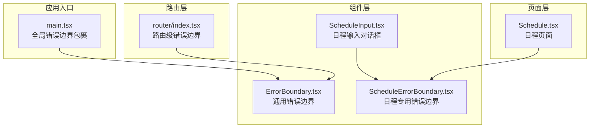
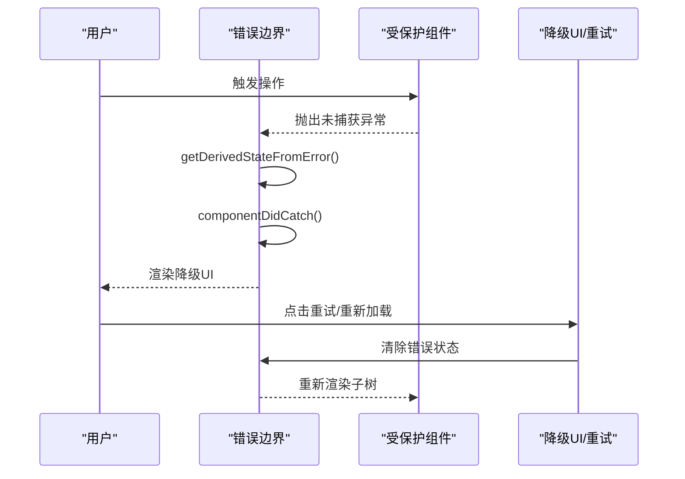
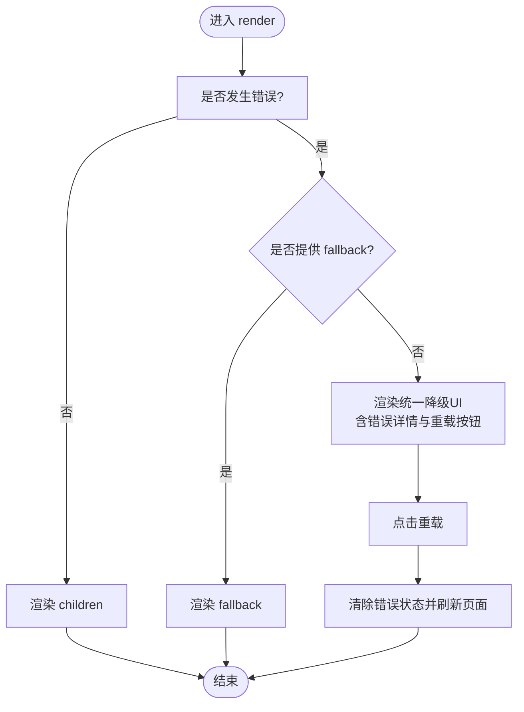
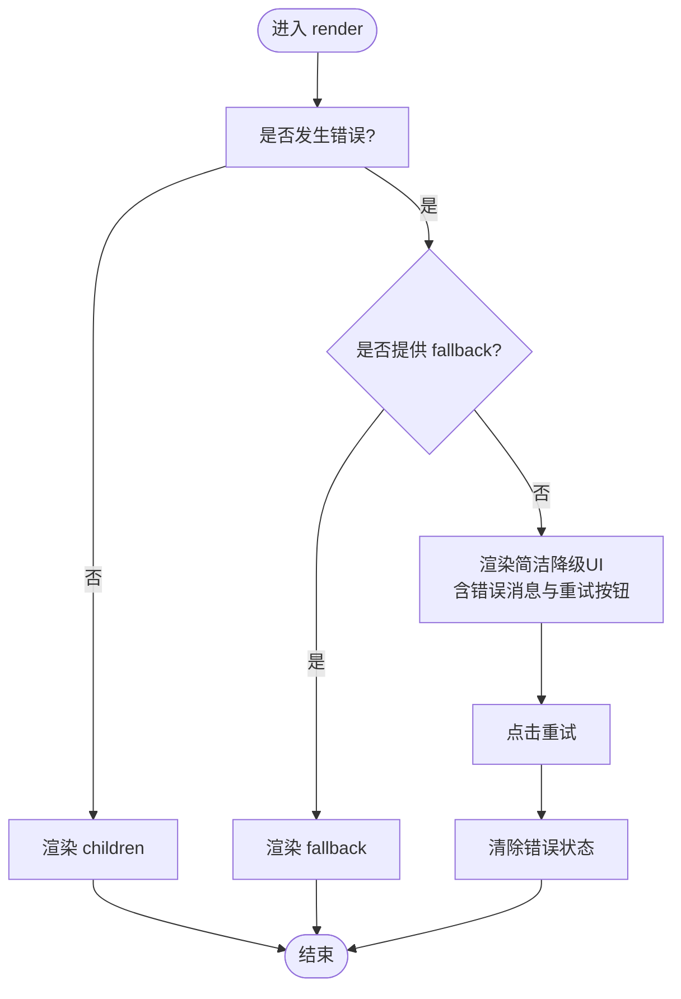
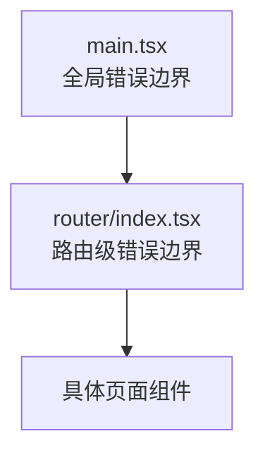
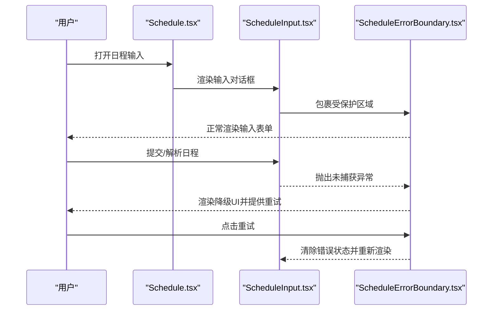
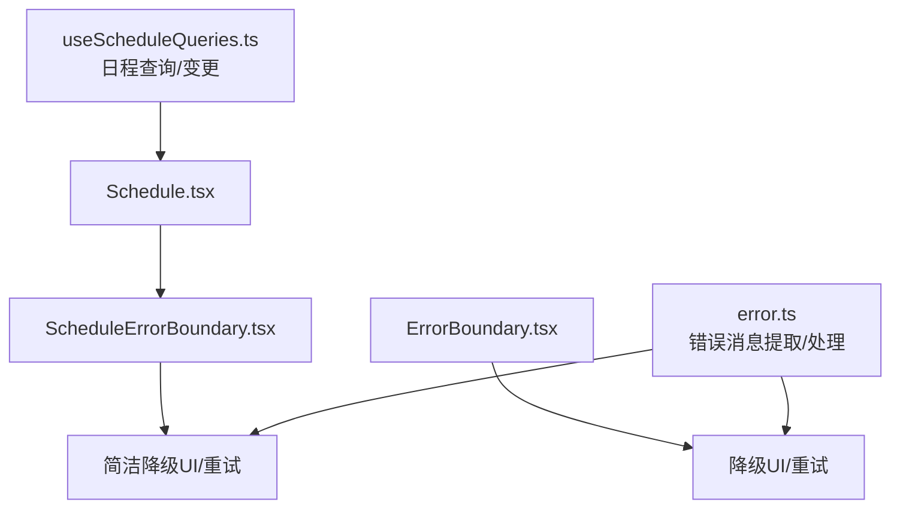

# 错误边界组件

<cite>
**本文档引用的文件**
- [ErrorBoundary.tsx](file://web/src/components/ErrorBoundary.tsx)
- [ScheduleErrorBoundary.tsx](file://web/src/components/AIChat/ScheduleErrorBoundary.tsx)
- [main.tsx](file://web/src/main.tsx)
- [router/index.tsx](file://web/src/router/index.tsx)
- [Schedule.tsx](file://web/src/pages/Schedule.tsx)
- [ScheduleInput.tsx](file://web/src/components/AIChat/ScheduleInput.tsx)
- [useScheduleQueries.ts](file://web/src/hooks/useScheduleQueries.ts)
- [ScheduleContext.tsx](file://web/src/contexts/ScheduleContext.tsx)
- [error.ts](file://web/src/lib/error.ts)
- [errorService.ts](file://web/src/components/MemoEditor/services/errorService.ts)
- [query-client.ts](file://web/src/lib/query-client.ts)
</cite>

## 目录
1. [简介](#简介)
2. [项目结构](#项目结构)
3. [核心组件](#核心组件)
4. [架构总览](#架构总览)
5. [详细组件分析](#详细组件分析)
6. [依赖关系分析](#依赖关系分析)
7. [性能考虑](#性能考虑)
8. [故障排查指南](#故障排查指南)
9. [结论](#结论)

## 简介
本文件系统性阐述前端错误边界组件的设计与实现，覆盖错误捕获机制、错误状态管理、降级显示策略、错误恢复流程、用户友好提示与重试能力，并结合日程相关场景给出最佳实践、监控策略与用户体验优化建议。目标是帮助开发者在复杂交互（如日程解析、编辑、冲突检测）中，通过错误边界提升稳定性与可维护性。

## 项目结构
错误边界在应用中的部署位置如下：
- 全局错误边界：包裹根应用，确保页面级异常不致应用崩溃
- 路由级错误边界：对特定页面（如 AI 聊天页）进行隔离保护
- 组件级错误边界：针对高风险子组件（如日程输入对话框）进行局部兜底

**图表来源**
- [main.tsx](file://web/src/main.tsx#L57-L75)
- [router/index.tsx](file://web/src/router/index.tsx#L92-L96)
- [Schedule.tsx](file://web/src/pages/Schedule.tsx#L18-L192)
- [ScheduleInput.tsx](file://web/src/components/AIChat/ScheduleInput.tsx#L338-L548)
- [ErrorBoundary.tsx](file://web/src/components/ErrorBoundary.tsx#L15-L70)
- [ScheduleErrorBoundary.tsx](file://web/src/components/AIChat/ScheduleErrorBoundary.tsx#L14-L56)

**章节来源**
- [main.tsx](file://web/src/main.tsx#L57-L75)
- [router/index.tsx](file://web/src/router/index.tsx#L92-L96)

## 核心组件
- 通用错误边界（ErrorBoundary）
  - 捕获子树内未处理异常，渲染降级 UI 并提供“重新加载”按钮
  - 支持自定义降级内容（fallback）
- 日程专用错误边界（ScheduleErrorBoundary）
  - 针对日程输入等高风险交互组件，提供更轻量的降级提示与“重试”按钮
  - 适合局部恢复，避免影响整个页面

两者均基于 React 类组件生命周期钩子实现错误捕获与状态切换。

**章节来源**
- [ErrorBoundary.tsx](file://web/src/components/ErrorBoundary.tsx#L15-L70)
- [ScheduleErrorBoundary.tsx](file://web/src/components/AIChat/ScheduleErrorBoundary.tsx#L14-L56)

## 架构总览
错误边界在应用中的职责划分：
- 全局边界：保证页面级异常不会导致整页白屏，提供“重新加载”恢复
- 路由边界：对特定页面（如 AI Chat）进行隔离，避免跨页面影响
- 组件边界：对高风险子组件（如日程输入对话框）进行局部兜底，支持“重试”

**图表来源**
- [ErrorBoundary.tsx](file://web/src/components/ErrorBoundary.tsx#L21-L32)
- [ScheduleErrorBoundary.tsx](file://web/src/components/AIChat/ScheduleErrorBoundary.tsx#L20-L29)

## 详细组件分析

### 通用错误边界（ErrorBoundary）
- 错误捕获
  - 使用静态方法 getDerivedStateFromError 将 hasError 设为 true，并记录 error
  - 在 componentDidCatch 中输出错误详情到控制台，便于调试
- 错误状态管理
  - 内部状态包含 hasError 与 error，用于决定渲染路径
- 降级显示与恢复
  - 若传入 fallback，则直接渲染该节点
  - 否则渲染统一的“出错”提示、错误详情（可折叠）、重载按钮
  - 点击重载会清除错误状态并刷新页面

**图表来源**
- [ErrorBoundary.tsx](file://web/src/components/ErrorBoundary.tsx#L34-L32)

**章节来源**
- [ErrorBoundary.tsx](file://web/src/components/ErrorBoundary.tsx#L15-L70)

### 日程专用错误边界（ScheduleErrorBoundary）
- 适用场景
  - 高风险交互组件（如日程输入对话框），避免影响整体页面
- 行为差异
  - 无全局刷新逻辑，仅清除错误状态并允许用户再次尝试
  - 提供简洁的“重试”按钮，适合局部恢复

**图表来源**
- [ScheduleErrorBoundary.tsx](file://web/src/components/AIChat/ScheduleErrorBoundary.tsx#L31-L49)

**章节来源**
- [ScheduleErrorBoundary.tsx](file://web/src/components/AIChat/ScheduleErrorBoundary.tsx#L14-L56)

### 应用入口与路由中的错误边界集成
- 入口级包裹
  - 在应用根节点外层包裹全局错误边界，确保任何页面级异常被拦截
- 路由级包裹
  - 对特定页面（如 AI Chat）使用独立的错误边界，实现页面级隔离

**图表来源**
- [main.tsx](file://web/src/main.tsx#L57-L75)
- [router/index.tsx](file://web/src/router/index.tsx#L92-L96)

**章节来源**
- [main.tsx](file://web/src/main.tsx#L57-L75)
- [router/index.tsx](file://web/src/router/index.tsx#L92-L96)

### 日程页面与输入组件中的错误边界使用
- 页面层
  - 日程页面作为容器，内部包含多个高风险子组件（日历、时间线、输入对话框）
- 组件层
  - 日程输入对话框内部使用日程专用错误边界，确保输入过程中的异常不影响其他区域
  - 页面通过上下文与查询钩子管理数据流，错误边界仅负责 UI 层兜底

**图表来源**
- [Schedule.tsx](file://web/src/pages/Schedule.tsx#L180-L190)
- [ScheduleInput.tsx](file://web/src/components/AIChat/ScheduleInput.tsx#L338-L548)
- [ScheduleErrorBoundary.tsx](file://web/src/components/AIChat/ScheduleErrorBoundary.tsx#L31-L49)

**章节来源**
- [Schedule.tsx](file://web/src/pages/Schedule.tsx#L180-L190)
- [ScheduleInput.tsx](file://web/src/components/AIChat/ScheduleInput.tsx#L338-L548)

## 依赖关系分析
- 错误边界与组件的关系
  - 通用错误边界可作为顶层兜底；日程专用错误边界用于局部恢复
  - 二者均可通过 fallback 自定义降级内容
- 与数据层的协作
  - 日程页面与输入组件通过查询钩子与上下文管理数据，错误边界不参与业务逻辑，仅负责 UI 层兜底
- 与错误处理工具的配合
  - 错误消息提取与统一处理可通过工具函数完成，错误边界负责呈现与恢复

**图表来源**
- [ErrorBoundary.tsx](file://web/src/components/ErrorBoundary.tsx#L34-L69)
- [ScheduleErrorBoundary.tsx](file://web/src/components/AIChat/ScheduleErrorBoundary.tsx#L31-L51)
- [error.ts](file://web/src/lib/error.ts#L1-L39)
- [useScheduleQueries.ts](file://web/src/hooks/useScheduleQueries.ts#L78-L100)
- [Schedule.tsx](file://web/src/pages/Schedule.tsx#L18-L35)

**章节来源**
- [error.ts](file://web/src/lib/error.ts#L1-L39)
- [useScheduleQueries.ts](file://web/src/hooks/useScheduleQueries.ts#L78-L100)

## 性能考虑
- 全局错误边界
  - 采用页面刷新恢复，适合严重异常；若频繁触发可能影响用户体验
- 路由级错误边界
  - 隔离页面异常，避免影响其他页面
- 组件级错误边界
  - 局部恢复，减少对整体的影响
- 查询缓存与重试
  - 查询客户端默认开启有限次重试与网络重连后自动拉取，有助于缓解瞬时错误

**章节来源**
- [query-client.ts](file://web/src/lib/query-client.ts#L3-L18)

## 故障排查指南
- 控制台日志
  - 通用错误边界在捕获异常时会打印错误与错误信息，便于定位问题
- 错误详情展示
  - 通用错误边界提供可折叠的错误详情面板，包含错误消息文本
- 用户反馈
  - 通过 Toast 或降级 UI 提示用户当前处于异常状态
- 建议的排查步骤
  - 查看控制台输出，确认异常类型与堆栈
  - 检查网络请求与服务端响应
  - 确认错误边界包裹范围是否合理
  - 结合查询客户端的重试策略判断是否为瞬时错误

**章节来源**
- [ErrorBoundary.tsx](file://web/src/components/ErrorBoundary.tsx#L25-L27)
- [error.ts](file://web/src/lib/error.ts#L17-L34)

## 结论
错误边界是前端健壮性的关键设施。在本项目中，通过全局、路由与组件三级错误边界，实现了从页面到子组件的全链路兜底。配合统一的错误消息提取与处理工具、查询客户端的重试策略，能够在异常发生时快速恢复并提供良好的用户体验。建议在新增高风险交互模块时，优先引入组件级错误边界，以实现局部可控的恢复与重试。