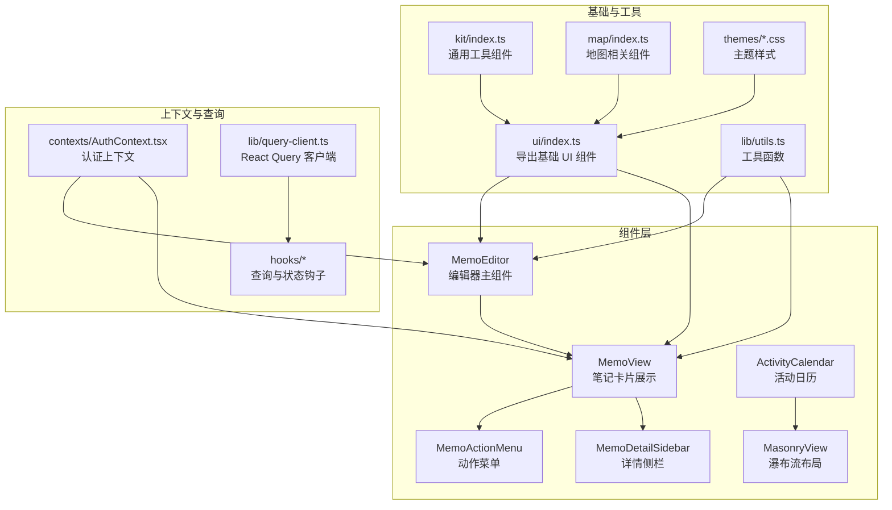
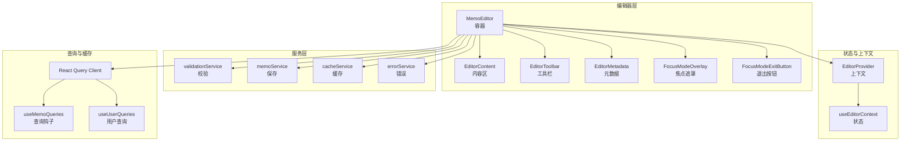
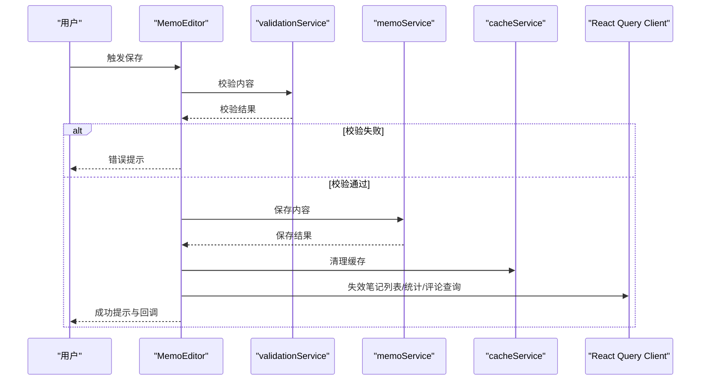
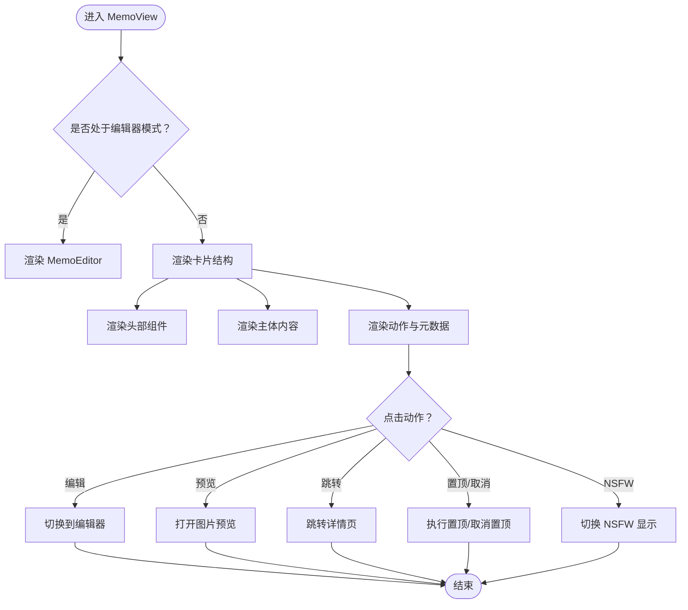
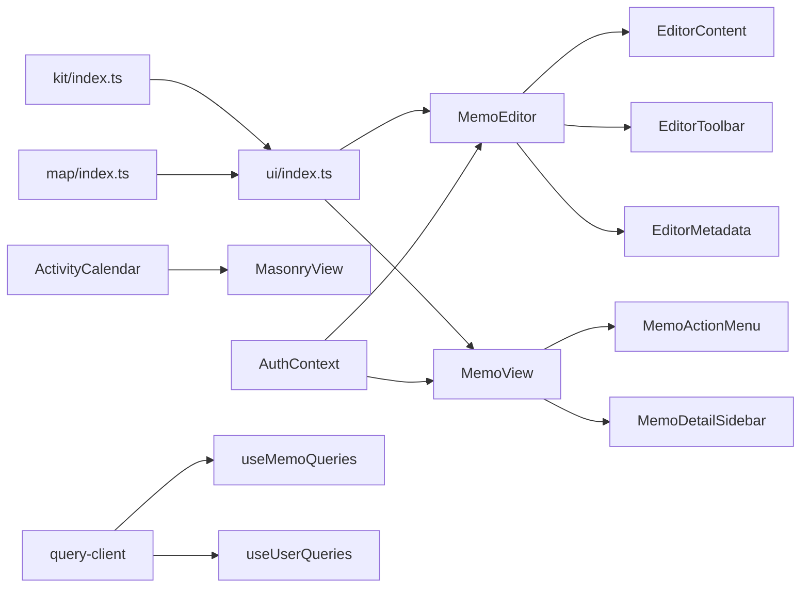

# UI 组件库

<cite>
**本文引用的文件**
- [web/src/components/MemoEditor/index.tsx](file://web/src/components/MemoEditor/index.tsx)
- [web/src/components/MemoView/MemoView.tsx](file://web/src/components/MemoView/MemoView.tsx)
- [web/src/components/ActivityCalendar/index.ts](file://web/src/components/ActivityCalendar/index.ts)
- [web/src/components/MasonryView/index.ts](file://web/src/components/MasonryView/index.ts)
- [web/src/components/MemoActionMenu/index.ts](file://web/src/components/MemoActionMenu/index.ts)
- [web/src/components/MemoDetailSidebar/index.ts](file://web/src/components/MemoDetailSidebar/index.ts)
- [web/src/components/kit/index.ts](file://web/src/components/kit/index.ts)
- [web/src/components/map/index.ts](file://web/src/components/map/index.ts)
- [web/src/components/ui/index.ts](file://web/src/components/ui/index.ts)
- [web/src/lib/utils.ts](file://web/src/lib/utils.ts)
- [web/src/lib/query-client.ts](file://web/src/lib/query-client.ts)
- [web/src/hooks/useMemoQueries.ts](file://web/src/hooks/useMemoQueries.ts)
- [web/src/hooks/useUserQueries.ts](file://web/src/hooks/useUserQueries.ts)
- [web/src/contexts/AuthContext.tsx](file://web/src/contexts/AuthContext.tsx)
- [web/src/utils/memo.ts](file://web/src/utils/memo.ts)
- [web/src/utils/user.ts](file://web/src/utils/user.ts)
- [web/src/pages/Home.tsx](file://web/src/pages/Home.tsx)
- [web/src/pages/Schedule.tsx](file://web/src/pages/Schedule.tsx)
- [web/src/pages/Setting.tsx](file://web/src/pages/Setting.tsx)
- [web/src/pages/UserProfile.tsx](file://web/src/pages/UserProfile.tsx)
- [web/src/layouts/MainLayout.tsx](file://web/src/layouts/MainLayout.tsx)
- [web/src/router/routes.ts](file://web/src/router/routes.ts)
- [web/src/themes/default.css](file://web/src/themes/default.css)
- [web/src/themes/midnight.css](file://web/src/themes/midnight.css)
- [web/src/themes/paper.css](file://web/src/themes/paper.css)
- [web/src/themes/whitewall.css](file://web/src/themes/whitewall.css)
- [web/src/components/ui/card/constants.ts](file://web/src/components/ui/card/constants.ts)
- [web/src/components/MemoEditor/constants.ts](file://web/src/components/MemoEditor/constants.ts)
- [web/src/components/MemoView/constants.ts](file://web/src/components/MemoView/constants.ts)
- [web/src/components/MemoEditor/services/validationService.ts](file://web/src/components/MemoEditor/services/validationService.ts)
- [web/src/components/MemoEditor/services/memoService.ts](file://web/src/components/MemoEditor/services/memoService.ts)
- [web/src/components/MemoEditor/services/cacheService.ts](file://web/src/components/MemoEditor/services/cacheService.ts)
- [web/src/components/MemoEditor/services/errorService.ts](file://web/src/components/MemoEditor/services/errorService.ts)
- [web/src/components/MemoEditor/state/index.ts](file://web/src/components/MemoEditor/state/index.ts)
- [web/src/components/MemoEditor/hooks/index.ts](file://web/src/components/MemoEditor/hooks/index.ts)
- [web/src/components/MemoEditor/components/index.ts](file://web/src/components/MemoEditor/components/index.ts)
- [web/src/components/MemoEditor/types.ts](file://web/src/components/MemoEditor/types.ts)
- [web/src/components/MemoView/types.ts](file://web/src/components/MemoView/types.ts)
- [web/src/components/ActivityCalendar/types.ts](file://web/src/components/ActivityCalendar/types.ts)
- [web/src/components/MasonryView/types.ts](file://web/src/components/MasonryView/types.ts)
- [web/src/components/MemoActionMenu/types.ts](file://web/src/components/MemoActionMenu/types.ts)
- [web/src/components/MemoDetailSidebar/types.ts](file://web/src/components/MemoDetailSidebar/types.ts)
</cite>

## 目录
1. [简介](#简介)
2. [项目结构](#项目结构)
3. [核心组件](#核心组件)
4. [架构总览](#架构总览)
5. [详细组件分析](#详细组件分析)
6. [依赖关系分析](#依赖关系分析)
7. [性能考量](#性能考量)
8. [故障排查指南](#故障排查指南)
9. [结论](#结论)
10. [附录](#附录)

## 简介
本文件为 UI 组件库的系统化文档，聚焦于前端组件体系的设计与实现，涵盖以下方面：
- 基于 Radix UI 与 Tailwind CSS 的组件体系与样式约定
- 编辑器组件：Markdown 支持、富文本编辑、标签系统与附件管理
- 表单组件设计模式：输入验证、错误处理与用户体验优化
- 页面组件：笔记列表、日历视图、设置界面与用户管理
- 组件属性接口、事件处理与样式定制选项
- 最佳实践与扩展指导

## 项目结构
前端组件主要位于 web/src/components 下，按功能域拆分：
- 编辑器相关：MemoEditor 及其子模块（hooks、services、state、components）
- 展示与交互：MemoView、MemoActionMenu、MemoDetailSidebar、ActivityCalendar、MasonryView
- 基础与工具：kit、map、ui；工具函数与主题
- 页面层：Home、Schedule、Setting、UserProfile 等
- 上下文与查询：AuthContext、React Query 客户端、Memo/User 查询钩子

图表来源
- [web/src/components/MemoEditor/index.tsx](file://web/src/components/MemoEditor/index.tsx#L1-L165)
- [web/src/components/MemoView/MemoView.tsx](file://web/src/components/MemoView/MemoView.tsx#L1-L107)
- [web/src/components/ActivityCalendar/index.ts](file://web/src/components/ActivityCalendar/index.ts#L1-L5)
- [web/src/components/MasonryView/index.ts](file://web/src/components/MasonryView/index.ts#L1-L23)
- [web/src/components/MemoActionMenu/index.ts](file://web/src/components/MemoActionMenu/index.ts#L1-L4)
- [web/src/components/MemoDetailSidebar/index.ts](file://web/src/components/MemoDetailSidebar/index.ts#L1-L5)
- [web/src/components/ui/index.ts](file://web/src/components/ui/index.ts)
- [web/src/components/kit/index.ts](file://web/src/components/kit/index.ts)
- [web/src/components/map/index.ts](file://web/src/components/map/index.ts)
- [web/src/lib/utils.ts](file://web/src/lib/utils.ts)
- [web/src/lib/query-client.ts](file://web/src/lib/query-client.ts)
- [web/src/contexts/AuthContext.tsx](file://web/src/contexts/AuthContext.tsx)

章节来源
- [web/src/components/MemoEditor/index.tsx](file://web/src/components/MemoEditor/index.tsx#L1-L165)
- [web/src/components/MemoView/MemoView.tsx](file://web/src/components/MemoView/MemoView.tsx#L1-L107)
- [web/src/components/ActivityCalendar/index.ts](file://web/src/components/ActivityCalendar/index.ts#L1-L5)
- [web/src/components/MasonryView/index.ts](file://web/src/components/MasonryView/index.ts#L1-L23)
- [web/src/components/MemoActionMenu/index.ts](file://web/src/components/MemoActionMenu/index.ts#L1-L4)
- [web/src/components/MemoDetailSidebar/index.ts](file://web/src/components/MemoDetailSidebar/index.ts#L1-L5)
- [web/src/components/ui/index.ts](file://web/src/components/ui/index.ts)
- [web/src/components/kit/index.ts](file://web/src/components/kit/index.ts)
- [web/src/components/map/index.ts](file://web/src/components/map/index.ts)
- [web/src/lib/utils.ts](file://web/src/lib/utils.ts)
- [web/src/lib/query-client.ts](file://web/src/lib/query-client.ts)
- [web/src/contexts/AuthContext.tsx](file://web/src/contexts/AuthContext.tsx)

## 核心组件
- 编辑器组件（MemoEditor）：提供 Markdown 富文本编辑、自动保存、焦点模式、元数据与工具栏集成，并通过服务层完成校验、持久化与缓存清理，最终触发全局查询失效以刷新列表。
- 笔记视图组件（MemoView）：封装卡片式展示、头尾部组件、图片预览、NSFW 内容控制、只读/可编辑态切换与上下文提供。
- 动作菜单（MemoActionMenu）：统一处理笔记的编辑、删除、置顶/取消置顶、归档等操作，暴露钩子便于复用。
- 详情侧栏（MemoDetailSidebar）：支持在详情页或抽屉中展示笔记的关联信息、标签、附件等。
- 活动日历（ActivityCalendar）：提供年/月视图与类型导出，支撑日程与活动的可视化。
- 瀑布流布局（MasonryView）：提供列分布算法、列项组件与布局钩子，用于高效渲染大量笔记。

章节来源
- [web/src/components/MemoEditor/index.tsx](file://web/src/components/MemoEditor/index.tsx#L21-L162)
- [web/src/components/MemoView/MemoView.tsx](file://web/src/components/MemoView/MemoView.tsx#L15-L104)
- [web/src/components/MemoActionMenu/index.ts](file://web/src/components/MemoActionMenu/index.ts#L1-L4)
- [web/src/components/MemoDetailSidebar/index.ts](file://web/src/components/MemoDetailSidebar/index.ts#L1-L5)
- [web/src/components/ActivityCalendar/index.ts](file://web/src/components/ActivityCalendar/index.ts#L1-L5)
- [web/src/components/MasonryView/index.ts](file://web/src/components/MasonryView/index.ts#L1-L23)

## 架构总览
组件库采用“容器组件 + 子组件 + 服务层 + 上下文”的分层设计：
- 容器组件负责状态管理、生命周期与副作用（如自动保存、查询失效）
- 子组件专注于 UI 渲染与交互（如编辑器内容区、元数据、工具栏）
- 服务层封装业务逻辑（校验、保存、缓存、错误处理）
- 上下文与查询客户端提供全局状态与数据一致性保障

图表来源
- [web/src/components/MemoEditor/index.tsx](file://web/src/components/MemoEditor/index.tsx#L21-L162)
- [web/src/components/MemoEditor/services/validationService.ts](file://web/src/components/MemoEditor/services/validationService.ts)
- [web/src/components/MemoEditor/services/memoService.ts](file://web/src/components/MemoEditor/services/memoService.ts)
- [web/src/components/MemoEditor/services/cacheService.ts](file://web/src/components/MemoEditor/services/cacheService.ts)
- [web/src/components/MemoEditor/services/errorService.ts](file://web/src/components/MemoEditor/services/errorService.ts)
- [web/src/components/MemoEditor/state/index.ts](file://web/src/components/MemoEditor/state/index.ts)
- [web/src/lib/query-client.ts](file://web/src/lib/query-client.ts)
- [web/src/hooks/useMemoQueries.ts](file://web/src/hooks/useMemoQueries.ts)
- [web/src/hooks/useUserQueries.ts](file://web/src/hooks/useUserQueries.ts)

## 详细组件分析

### 编辑器组件（MemoEditor）
- 设计理念
  - 以 Provider/Context 驱动的状态机管理编辑器 UI 与内容状态
  - 通过服务层解耦校验、保存、缓存与错误处理
  - 使用 React Query 进行全局缓存失效与列表刷新
- 关键流程
  - 初始化：根据用户默认可见性与缓存键初始化内容
  - 自动保存：本地存储缓存，移动端虚拟键盘高度适配
  - 焦点模式：遮罩与滚动锁定，提升专注度
  - 保存：先校验，再调用保存服务，成功后清理缓存并失效相关查询
- 接口要点
  - 属性：className、cacheKey、memoName、parentMemoName、autoFocus、placeholder、onConfirm、onCancel
  - 事件：onConfirm 返回新 memo 名称；onCancel 在无变更时回调
  - 样式：使用卡片基类常量与焦点模式样式常量组合
- 扩展建议
  - 新增快捷键、撤销重做、附件上传进度条
  - 将工具栏按钮抽象为插件化配置

图表来源
- [web/src/components/MemoEditor/index.tsx](file://web/src/components/MemoEditor/index.tsx#L77-L125)
- [web/src/components/MemoEditor/services/validationService.ts](file://web/src/components/MemoEditor/services/validationService.ts)
- [web/src/components/MemoEditor/services/memoService.ts](file://web/src/components/MemoEditor/services/memoService.ts)
- [web/src/components/MemoEditor/services/cacheService.ts](file://web/src/components/MemoEditor/services/cacheService.ts)
- [web/src/lib/query-client.ts](file://web/src/lib/query-client.ts)

章节来源
- [web/src/components/MemoEditor/index.tsx](file://web/src/components/MemoEditor/index.tsx#L21-L162)
- [web/src/components/MemoEditor/constants.ts](file://web/src/components/MemoEditor/constants.ts)
- [web/src/components/ui/card/constants.ts](file://web/src/components/ui/card/constants.ts)
- [web/src/contexts/AuthContext.tsx](file://web/src/contexts/AuthContext.tsx)
- [web/src/utils/memo.ts](file://web/src/utils/memo.ts)
- [web/src/lib/utils.ts](file://web/src/lib/utils.ts)

### 笔记视图组件（MemoView）
- 设计理念
  - 卡片式结构，头部（作者、可见性、操作）、主体（内容）、底部（动作与元信息）
  - NSFW 内容开关、图片预览对话框、只读/可编辑态控制
  - 通过上下文传递当前用户、是否归档、是否只读等状态
- 关键流程
  - 切换到编辑器：显示 MemoEditor 并传入缓存键与回调
  - 图片预览：打开预览对话框并设置初始索引
  - 动作处理：跳转详情、编辑、取消置顶、切换 NSFW
- 接口要点
  - 属性：memo、className、parentPage、compact、showCreator、showVisibility、showPinned、showNsfwContent
  - 事件：onEdit、onGotoDetail、onUnpin、onToggleNsfwVisibility
  - 样式：卡片基础类常量
- 扩展建议
  - 支持更多内容类型（视频、音频、嵌入）
  - 增加收藏、分享、反应（点赞/表情）等交互

图表来源
- [web/src/components/MemoView/MemoView.tsx](file://web/src/components/MemoView/MemoView.tsx#L15-L104)
- [web/src/components/MemoView/constants.ts](file://web/src/components/MemoView/constants.ts)

章节来源
- [web/src/components/MemoView/MemoView.tsx](file://web/src/components/MemoView/MemoView.tsx#L15-L104)
- [web/src/utils/user.ts](file://web/src/utils/user.ts)
- [web/src/hooks/useUserQueries.ts](file://web/src/hooks/useUserQueries.ts)

### 动作菜单（MemoActionMenu）
- 设计理念
  - 将笔记动作（编辑、删除、置顶/取消置顶、归档等）集中管理，提供统一的处理钩子
  - 支持在不同场景（列表、详情、侧栏）复用
- 接口要点
  - 属性：MemoActionMenuProps（包含 memo、readonly、parentPage 等）
  - 钩子：useMemoActionHandlers（返回动作处理器集合）
- 扩展建议
  - 菜单项可配置化，支持动态增删
  - 支持批量操作与权限控制

章节来源
- [web/src/components/MemoActionMenu/index.ts](file://web/src/components/MemoActionMenu/index.ts#L1-L4)
- [web/src/components/MemoActionMenu/types.ts](file://web/src/components/MemoActionMenu/types.ts)

### 详情侧栏（MemoDetailSidebar）
- 设计理念
  - 提供详情页侧栏与抽屉两种形态，承载笔记的关联关系、标签、附件、元信息等
- 接口要点
  - 导出：MemoDetailSidebar、MemoDetailSidebarDrawer
- 扩展建议
  - 支持折叠/展开、固定/吸附
  - 增加“相关笔记”、“时间线”等视图

章节来源
- [web/src/components/MemoDetailSidebar/index.ts](file://web/src/components/MemoDetailSidebar/index.ts#L1-L5)
- [web/src/components/MemoDetailSidebar/types.ts](file://web/src/components/MemoDetailSidebar/types.ts)

### 活动日历（ActivityCalendar）
- 设计理念
  - 提供年/月视图与类型导出，便于日程与活动的可视化
- 接口要点
  - 导出：MonthCalendar、YearCalendar、types、utils
- 扩展建议
  - 支持多视图切换、事件筛选、拖拽调整

章节来源
- [web/src/components/ActivityCalendar/index.ts](file://web/src/components/ActivityCalendar/index.ts#L1-L5)
- [web/src/components/ActivityCalendar/types.ts](file://web/src/components/ActivityCalendar/types.ts)

### 瀑布流布局（MasonryView）
- 设计理念
  - 通过列分布算法与布局钩子，实现高性能的瀑布流渲染
- 接口要点
  - 导出：distributeItemsToColumns、MasonryColumn、MasonryItem、useMasonryLayout、类型与常量
- 扩展建议
  - 支持动态高度估算、懒加载、骨架屏

章节来源
- [web/src/components/MasonryView/index.ts](file://web/src/components/MasonryView/index.ts#L1-L23)
- [web/src/components/MasonryView/types.ts](file://web/src/components/MasonryView/types.ts)

### 表单组件设计模式
- 输入验证
  - 编辑器保存前进行内容校验，失败时提示原因
- 错误处理
  - 统一错误服务与错误边界，结合 toast 提示
- 用户体验优化
  - 自动保存、焦点模式、移动端虚拟键盘适配、加载状态反馈
- 样式定制
  - 基于 Tailwind 类名组合与主题变量，支持多主题切换

章节来源
- [web/src/components/MemoEditor/services/validationService.ts](file://web/src/components/MemoEditor/services/validationService.ts)
- [web/src/components/MemoEditor/services/errorService.ts](file://web/src/components/MemoEditor/services/errorService.ts)
- [web/src/lib/utils.ts](file://web/src/lib/utils.ts)
- [web/src/themes/default.css](file://web/src/themes/default.css)
- [web/src/themes/midnight.css](file://web/src/themes/midnight.css)
- [web/src/themes/paper.css](file://web/src/themes/paper.css)
- [web/src/themes/whitewall.css](file://web/src/themes/whitewall.css)

### 页面组件实现
- 笔记列表（Home）
  - 使用 MemoView 渲染列表，支持瀑布流布局与过滤
- 日历视图（Schedule）
  - 结合 ActivityCalendar 与日程查询，展示活动与安排
- 设置界面（Setting）
  - 提供用户设置、实例设置、主题选择、语言切换等
- 用户管理（UserProfile）
  - 展示用户资料、统计信息与操作入口

章节来源
- [web/src/pages/Home.tsx](file://web/src/pages/Home.tsx)
- [web/src/pages/Schedule.tsx](file://web/src/pages/Schedule.tsx)
- [web/src/pages/Setting.tsx](file://web/src/pages/Setting.tsx)
- [web/src/pages/UserProfile.tsx](file://web/src/pages/UserProfile.tsx)
- [web/src/layouts/MainLayout.tsx](file://web/src/layouts/MainLayout.tsx)
- [web/src/router/routes.ts](file://web/src/router/routes.ts)

## 依赖关系分析
- 组件间依赖
  - MemoEditor 依赖 MemoView（内联编辑）、工具栏与元数据组件
  - MemoView 依赖 MemoActionMenu、MemoDetailSidebar、图片预览对话框
  - ActivityCalendar 与 MasonryView 独立，但可被页面组件复用
- 外部依赖
  - Radix UI：提供无障碍与语义化的基础组件
  - Tailwind CSS：提供原子化样式与主题系统
  - React Query：提供数据缓存、失效与并发控制
  - i18n：国际化文案支持

图表来源
- [web/src/components/ui/index.ts](file://web/src/components/ui/index.ts)
- [web/src/components/kit/index.ts](file://web/src/components/kit/index.ts)
- [web/src/components/map/index.ts](file://web/src/components/map/index.ts)
- [web/src/components/MemoEditor/index.tsx](file://web/src/components/MemoEditor/index.tsx#L13-L18)
- [web/src/components/MemoView/MemoView.tsx](file://web/src/components/MemoView/MemoView.tsx#L7-L9)
- [web/src/components/MemoActionMenu/index.ts](file://web/src/components/MemoActionMenu/index.ts#L1-L4)
- [web/src/components/MemoDetailSidebar/index.ts](file://web/src/components/MemoDetailSidebar/index.ts#L1-L5)
- [web/src/components/ActivityCalendar/index.ts](file://web/src/components/ActivityCalendar/index.ts#L1-L5)
- [web/src/components/MasonryView/index.ts](file://web/src/components/MasonryView/index.ts#L1-L23)
- [web/src/contexts/AuthContext.tsx](file://web/src/contexts/AuthContext.tsx)
- [web/src/lib/query-client.ts](file://web/src/lib/query-client.ts)
- [web/src/hooks/useMemoQueries.ts](file://web/src/hooks/useMemoQueries.ts)
- [web/src/hooks/useUserQueries.ts](file://web/src/hooks/useUserQueries.ts)

## 性能考量
- 列表渲染
  - 使用瀑布流布局减少重排，合理设置列数与间距
  - 对长列表启用虚拟化或分页
- 编辑器
  - 自动保存采用防抖/节流策略，避免频繁写入
  - 焦点模式下限制滚动，减少不必要的重绘
- 数据一致性
  - 保存成功后仅失效必要查询键，降低全量刷新开销
- 主题与样式
  - 使用原子化样式与主题变量，避免重复计算与样式冲突

## 故障排查指南
- 保存失败
  - 检查校验服务返回的错误原因，确认网络与权限
  - 查看错误服务的回退消息与上下文
- 列表未更新
  - 确认查询失效键是否正确（笔记列表、统计、评论）
  - 检查 React Query 客户端配置与缓存策略
- 移动端显示异常
  - 检查虚拟键盘高度监听与样式适配
  - 焦点模式下的滚动锁定是否生效

章节来源
- [web/src/components/MemoEditor/services/errorService.ts](file://web/src/components/MemoEditor/services/errorService.ts)
- [web/src/components/MemoEditor/services/validationService.ts](file://web/src/components/MemoEditor/services/validationService.ts)
- [web/src/lib/query-client.ts](file://web/src/lib/query-client.ts)

## 结论
该 UI 组件库以清晰的分层与模块化设计，结合 Radix UI 与 Tailwind CSS，提供了从编辑器到页面的完整组件体系。通过服务层与上下文/查询客户端的配合，实现了良好的可维护性与扩展性。建议在后续迭代中进一步完善插件化工具栏、批量操作与更多内容类型的渲染能力。

## 附录
- 属性与事件参考
  - MemoEditor：属性（className、cacheKey、memoName、parentMemoName、autoFocus、placeholder、onConfirm、onCancel），事件（保存成功回调、取消回调）
  - MemoView：属性（memo、className、parentPage、compact、showCreator、showVisibility、showPinned、showNsfwContent），事件（编辑、跳转详情、置顶/取消置顶、切换 NSFW）
  - MemoActionMenu：属性（MemoActionMenuProps），钩子（useMemoActionHandlers）
  - MemoDetailSidebar：导出（MemoDetailSidebar、MemoDetailSidebarDrawer）
  - ActivityCalendar：导出（MonthCalendar、YearCalendar、types、utils）
  - MasonryView：导出（distributeItemsToColumns、MasonryColumn、MasonryItem、useMasonryLayout、类型与常量）
- 样式定制
  - 基于卡片常量与焦点模式样式常量组合
  - 主题文件：default、midnight、paper、whitewall
- 最佳实践
  - 编辑器：先校验再保存，保存成功后清理缓存并失效相关查询
  - 列表：优先使用瀑布流布局，结合过滤与排序
  - 表单：统一错误提示与加载状态，移动端注意键盘适配
  - 扩展：将常用交互抽象为可配置插件，保持组件职责单一

章节来源
- [web/src/components/MemoEditor/types.ts](file://web/src/components/MemoEditor/types.ts)
- [web/src/components/MemoView/types.ts](file://web/src/components/MemoView/types.ts)
- [web/src/components/MemoActionMenu/types.ts](file://web/src/components/MemoActionMenu/types.ts)
- [web/src/components/MemoDetailSidebar/types.ts](file://web/src/components/MemoDetailSidebar/types.ts)
- [web/src/components/ActivityCalendar/types.ts](file://web/src/components/ActivityCalendar/types.ts)
- [web/src/components/MasonryView/types.ts](file://web/src/components/MasonryView/types.ts)
- [web/src/components/ui/card/constants.ts](file://web/src/components/ui/card/constants.ts)
- [web/src/components/MemoEditor/constants.ts](file://web/src/components/MemoEditor/constants.ts)
- [web/src/components/MemoView/constants.ts](file://web/src/components/MemoView/constants.ts)
- [web/src/themes/default.css](file://web/src/themes/default.css)
- [web/src/themes/midnight.css](file://web/src/themes/midnight.css)
- [web/src/themes/paper.css](file://web/src/themes/paper.css)
- [web/src/themes/whitewall.css](file://web/src/themes/whitewall.css)