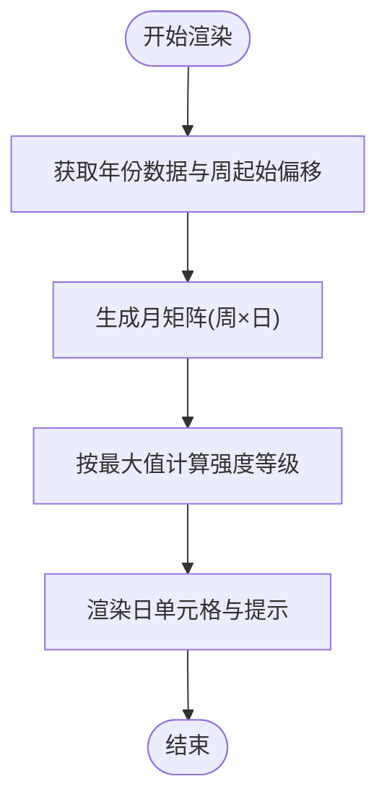

# 专用功能组件

<cite>
**本文引用的文件**   
- [ScheduleQuickInput.tsx](file://web/src/components/ScheduleQuickInput/ScheduleQuickInput.tsx)
- [AISuggestionCards.tsx](file://web/src/components/ScheduleQuickInput/AISuggestionCards.tsx)
- [QuickTemplates.tsx](file://web/src/components/ScheduleQuickInput/QuickTemplates.tsx)
- [SearchBar.tsx](file://web/src/components/SearchBar.tsx)
- [TagTree.tsx](file://web/src/components/TagTree.tsx)
- [UserMemoMap.tsx](file://web/src/components/UserMemoMap/UserMemoMap.tsx)
- [MonthCalendar.tsx](file://web/src/components/ActivityCalendar/MonthCalendar.tsx)
- [YearCalendar.tsx](file://web/src/components/ActivityCalendar/YearCalendar.tsx)
- [utils.ts](file://web/src/components/ActivityCalendar/utils.ts)
- [index.ts](file://web/src/components/ActivityCalendar/index.ts)
- [useScheduleQueries.ts](file://web/src/hooks/useScheduleQueries.ts)
</cite>

## 目录
1. [简介](#简介)
2. [项目结构](#项目结构)
3. [核心组件](#核心组件)
4. [架构总览](#架构总览)
5. [组件详解](#组件详解)
6. [依赖关系分析](#依赖关系分析)
7. [性能考量](#性能考量)
8. [故障排查指南](#故障排查指南)
9. [结论](#结论)
10. [附录](#附录)

## 简介
本文件聚焦于仓库中的四类专用功能组件：活动日历、日程快速输入、搜索栏、标签树与地图组件。我们将从系统架构、数据流、处理逻辑、事件处理、与后端服务的集成、可定制性与性能优化等方面进行深入解析，并提供最佳实践与排障建议。

## 项目结构
这些组件主要位于前端 web/src 目录下，采用按功能域分层组织的方式：
- 活动日历：web/src/components/ActivityCalendar
- 日程快速输入：web/src/components/ScheduleQuickInput
- 搜索栏：web/src/components/SearchBar.tsx
- 标签树：web/src/components/TagTree.tsx
- 地图组件：web/src/components/UserMemoMap/UserMemoMap.tsx
- 查询与集成：web/src/hooks/useScheduleQueries.ts

**图表来源**
- [ScheduleQuickInput.tsx](file://web/src/components/ScheduleQuickInput/ScheduleQuickInput.tsx#L1-L398)
- [AISuggestionCards.tsx](file://web/src/components/ScheduleQuickInput/AISuggestionCards.tsx#L1-L355)
- [QuickTemplates.tsx](file://web/src/components/ScheduleQuickInput/QuickTemplates.tsx#L1-L368)
- [SearchBar.tsx](file://web/src/components/SearchBar.tsx#L1-L151)
- [TagTree.tsx](file://web/src/components/TagTree.tsx#L1-L161)
- [MonthCalendar.tsx](file://web/src/components/ActivityCalendar/MonthCalendar.tsx#L1-L69)
- [YearCalendar.tsx](file://web/src/components/ActivityCalendar/YearCalendar.tsx#L1-L94)
- [UserMemoMap.tsx](file://web/src/components/UserMemoMap/UserMemoMap.tsx#L1-L131)
- [useScheduleQueries.ts](file://web/src/hooks/useScheduleQueries.ts#L1-L428)

**章节来源**
- [ScheduleQuickInput.tsx](file://web/src/components/ScheduleQuickInput/ScheduleQuickInput.tsx#L1-L398)
- [SearchBar.tsx](file://web/src/components/SearchBar.tsx#L1-L151)
- [TagTree.tsx](file://web/src/components/TagTree.tsx#L1-L161)
- [UserMemoMap.tsx](file://web/src/components/UserMemoMap/UserMemoMap.tsx#L1-L131)
- [MonthCalendar.tsx](file://web/src/components/ActivityCalendar/MonthCalendar.tsx#L1-L69)
- [YearCalendar.tsx](file://web/src/components/ActivityCalendar/YearCalendar.tsx#L1-L94)
- [utils.ts](file://web/src/components/ActivityCalendar/utils.ts#L1-L73)
- [useScheduleQueries.ts](file://web/src/hooks/useScheduleQueries.ts#L1-L428)

## 核心组件
- 活动日历：以月/年双视图展示用户活动密度，支持点击跳转至具体日期的日程列表。
- 日程快速输入：自然语言输入，结合 AI 建议卡片与快捷模板，一键创建或更新日程。
- 搜索栏：支持“语义搜索”与“关键词搜索”，在 AI 模式下提供候选结果预览。
- 标签树：层级化标签浏览与筛选，支持展开/折叠与多级路径导航。
- 地图组件：基于 Leaflet 的用户备忘录地理可视化，聚合标注与弹窗详情。

**章节来源**
- [MonthCalendar.tsx](file://web/src/components/ActivityCalendar/MonthCalendar.tsx#L1-L69)
- [YearCalendar.tsx](file://web/src/components/ActivityCalendar/YearCalendar.tsx#L1-L94)
- [ScheduleQuickInput.tsx](file://web/src/components/ScheduleQuickInput/ScheduleQuickInput.tsx#L1-L398)
- [AISuggestionCards.tsx](file://web/src/components/ScheduleQuickInput/AISuggestionCards.tsx#L1-L355)
- [QuickTemplates.tsx](file://web/src/components/ScheduleQuickInput/QuickTemplates.tsx#L1-L368)
- [SearchBar.tsx](file://web/src/components/SearchBar.tsx#L1-L151)
- [TagTree.tsx](file://web/src/components/TagTree.tsx#L1-L161)
- [UserMemoMap.tsx](file://web/src/components/UserMemoMap/UserMemoMap.tsx#L1-L131)

## 架构总览
组件通过 React Query 与后端服务交互，统一管理缓存、失效与并发控制。日程相关能力由 useScheduleQueries 提供，搜索与标签筛选通过上下文与查询钩子组合完成。

**图表来源**
- [ScheduleQuickInput.tsx](file://web/src/components/ScheduleQuickInput/ScheduleQuickInput.tsx#L96-L158)
- [useScheduleQueries.ts](file://web/src/hooks/useScheduleQueries.ts#L254-L272)

## 组件详解

### 活动日历
- 功能要点
  - 月视图：按周起始日偏移与星期标签旋转，渲染日单元格并根据活动数量计算强度等级。
  - 年视图：逐月渲染月视图，支持上一年/下一年与“回到今天”导航。
  - 工具函数：按年过滤数据、生成月份序列、计算年度最大值、生成月份标签、生成提示文本等。
- 关键数据流
  - 输入：选中年份、按日期聚合的活动计数、周起始偏移、实例设置。
  - 输出：月矩阵（包含每格的日期、是否当月、计数），用于渲染强度与提示。
- 可定制性
  - 单元格尺寸、颜色强度阈值、周起始日等可通过常量与样式配置扩展。
- 使用场景
  - 用户快速评估某月/某年的活动密集度，辅助规划与回顾。

**图表来源**
- [YearCalendar.tsx](file://web/src/components/ActivityCalendar/YearCalendar.tsx#L17-L91)
- [MonthCalendar.tsx](file://web/src/components/ActivityCalendar/MonthCalendar.tsx#L12-L65)
- [utils.ts](file://web/src/components/ActivityCalendar/utils.ts#L13-L72)

**章节来源**
- [MonthCalendar.tsx](file://web/src/components/ActivityCalendar/MonthCalendar.tsx#L1-L69)
- [YearCalendar.tsx](file://web/src/components/ActivityCalendar/YearCalendar.tsx#L1-L94)
- [utils.ts](file://web/src/components/ActivityCalendar/utils.ts#L1-L73)
- [index.ts](file://web/src/components/ActivityCalendar/index.ts#L1-L5)

### 日程快速输入
- 功能要点
  - 自然语言输入：自动高度调整、发送/清空、编辑状态提示、成功反馈。
  - AI 建议卡片：解析 AI 响应中的时间与标题，支持双击/单击确认创建。
  - 快捷模板：内置常用模板（会议、通话、运动等），点击即填入输入框。
  - 编辑态上下文：在编辑现有日程时，将当前时间段作为上下文附加到消息。
  - 时区处理：向后端传递用户时区，确保解析与创建一致。
- 数据与事件流
  - 输入变化 → 防抖/即时反馈 → 发送到 ScheduleAgent → 解析/创建 → 成功则清空输入并刷新列表。
  - 建议解析 → 渲染卡片 → 用户确认 → 再次调用后端创建。
- 可定制性
  - 模板集合、提示文案、占位符、成功动画、错误提示均可通过国际化与样式扩展。
  - 支持注入 UI 工具事件与回调，扩展生成式 UI。

**图表来源**
- [ScheduleQuickInput.tsx](file://web/src/components/ScheduleQuickInput/ScheduleQuickInput.tsx#L96-L158)
- [AISuggestionCards.tsx](file://web/src/components/ScheduleQuickInput/AISuggestionCards.tsx#L38-L95)
- [QuickTemplates.tsx](file://web/src/components/ScheduleQuickInput/QuickTemplates.tsx#L183-L211)
- [useScheduleQueries.ts](file://web/src/hooks/useScheduleQueries.ts#L254-L272)

**章节来源**
- [ScheduleQuickInput.tsx](file://web/src/components/ScheduleQuickInput/ScheduleQuickInput.tsx#L1-L398)
- [AISuggestionCards.tsx](file://web/src/components/ScheduleQuickInput/AISuggestionCards.tsx#L1-L355)
- [QuickTemplates.tsx](file://web/src/components/ScheduleQuickInput/QuickTemplates.tsx#L1-L368)
- [useScheduleQueries.ts](file://web/src/hooks/useScheduleQueries.ts#L1-L428)

### 搜索栏
- 功能要点
  - 模式切换：AI 语义搜索与关键词搜索，默认启用 AI 模式。
  - 实时预览：在 AI 模式下，输入超过一定长度后触发语义搜索，展示候选与评分。
  - 关键词模式：回车将输入拆分为单词并逐个添加为内容搜索过滤器。
  - 导航与菜单：点击候选项跳转到备忘录详情；右侧显示显示设置菜单。
- 集成点
  - 依赖 useSemanticSearch 钩子与 MemoFilterContext，实现搜索与筛选联动。
- 使用场景
  - 快速定位相关内容，支持自然语言理解与精确关键词匹配。

**图表来源**
- [SearchBar.tsx](file://web/src/components/SearchBar.tsx#L18-L60)

**章节来源**
- [SearchBar.tsx](file://web/src/components/SearchBar.tsx#L1-L151)

### 标签树
- 功能要点
  - 层级解析：将“a/b/c”形式的标签路径解析为树形结构，统计父级标签数量。
  - 交互行为：点击标签切换筛选；支持展开/折叠子节点；同一时刻仅保留一个标签筛选。
  - 视觉反馈：当前激活标签高亮，子节点通过缩进与竖线指示层级。
- 使用场景
  - 多级标签的浏览与筛选，便于在复杂标签体系中快速定位内容。

**图表来源**
- [TagTree.tsx](file://web/src/components/TagTree.tsx#L21-L72)

**章节来源**
- [TagTree.tsx](file://web/src/components/TagTree.tsx#L1-L161)

### 地图组件
- 功能要点
  - 数据获取：通过 useInfiniteMemos 获取用户备忘录，筛选带位置信息的条目。
  - 地图渲染：默认瓦片层、聚簇（MarkerCluster）、自定义聚簇图标。
  - 弹窗详情：点击标注打开弹窗，展示日期与摘要，支持跳转到备忘录详情。
  - 自适应缩放：首次渲染时根据有效坐标拟合视图范围。
- 使用场景
  - 将用户的地理足迹与内容关联，提供空间维度的回顾与探索。

**图表来源**
- [UserMemoMap.tsx](file://web/src/components/UserMemoMap/UserMemoMap.tsx#L58-L124)

**章节来源**
- [UserMemoMap.tsx](file://web/src/components/UserMemoMap/UserMemoMap.tsx#L1-L131)

## 依赖关系分析
- 组件间耦合
  - 日程快速输入与 AI 建议卡片、快捷模板强耦合，共同构成“输入-解析-确认”的闭环。
  - 活动日历与工具函数解耦，通过常量与类型约束保证复用性。
  - 搜索栏与标签树通过 MemoFilterContext 与查询钩子间接耦合，形成统一的筛选体系。
  - 地图组件与日程查询钩子无直接耦合，但可与通用备忘录查询配合使用。
- 外部依赖
  - React Query：统一缓存、失效策略与并发控制。
  - Day.js：日期与时间处理。
  - Leaflet/MarkerCluster：地图渲染与聚簇。
  - Protobuf 客户端：schedule_service_client 与相关请求/响应模型。

**图表来源**
- [ScheduleQuickInput.tsx](file://web/src/components/ScheduleQuickInput/ScheduleQuickInput.tsx#L1-L398)
- [AISuggestionCards.tsx](file://web/src/components/ScheduleQuickInput/AISuggestionCards.tsx#L1-L355)
- [QuickTemplates.tsx](file://web/src/components/ScheduleQuickInput/QuickTemplates.tsx#L1-L368)
- [SearchBar.tsx](file://web/src/components/SearchBar.tsx#L1-L151)
- [TagTree.tsx](file://web/src/components/TagTree.tsx#L1-L161)
- [MonthCalendar.tsx](file://web/src/components/ActivityCalendar/MonthCalendar.tsx#L1-L69)
- [utils.ts](file://web/src/components/ActivityCalendar/utils.ts#L1-L73)
- [UserMemoMap.tsx](file://web/src/components/UserMemoMap/UserMemoMap.tsx#L1-L131)
- [useScheduleQueries.ts](file://web/src/hooks/useScheduleQueries.ts#L1-L428)

**章节来源**
- [useScheduleQueries.ts](file://web/src/hooks/useScheduleQueries.ts#L1-L428)

## 性能考量
- 缓存与失效
  - useScheduleQueries 对不同查询场景设置了合理的 staleTime 与 gcTime，避免过期数据与内存占用过高。
  - 列表查询在冲突检测等强一致性需求场景下禁用缓存，确保数据新鲜。
- 分页与批量
  - 月度分组查询使用较大页大小减少分页次数，提升渲染效率。
- 渲染优化
  - 活动日历使用 memo 包装与矩阵化渲染，降低重绘成本。
  - 地图组件在无数据时显示占位提示，避免空容器闪烁。
- 网络与解析
  - 日程快速输入在发送前立即清空输入并禁用按钮，减少重复提交与无效请求。
  - AI 建议解析限制最多三条建议，避免 UI 过载。

[本节为通用指导，无需列出具体文件来源]

## 故障排查指南
- 日程快速输入
  - 若创建失败：检查网络与后端响应；查看错误提示与本地恢复输入的逻辑。
  - 建议卡片不出现：确认 AI 响应格式与解析正则是否覆盖常见表达。
- 搜索栏
  - AI 模式无结果：切换到关键词模式或检查语义搜索服务可用性。
  - 关键词模式无效：确认过滤器添加流程与回车键绑定。
- 标签树
  - 子节点不显示：检查层级路径与展开状态同步逻辑。
- 地图组件
  - 无标记：确认筛选条件与位置字段存在；检查瓦片层与聚簇初始化。
  - 视图不自适应：确认有效坐标数组非空且顺序正确。

**章节来源**
- [ScheduleQuickInput.tsx](file://web/src/components/ScheduleQuickInput/ScheduleQuickInput.tsx#L150-L158)
- [AISuggestionCards.tsx](file://web/src/components/ScheduleQuickInput/AISuggestionCards.tsx#L38-L95)
- [SearchBar.tsx](file://web/src/components/SearchBar.tsx#L111-L121)
- [TagTree.tsx](file://web/src/components/TagTree.tsx#L96-L111)
- [UserMemoMap.tsx](file://web/src/components/UserMemoMap/UserMemoMap.tsx#L42-L50)

## 结论
上述组件围绕“日程”“检索”“标签”“地理”四个维度构建了完整的用户工作流入口。它们通过统一的查询与缓存机制、清晰的数据流与事件链路，实现了良好的可扩展性与用户体验。建议在后续迭代中进一步完善无障碍支持、国际化文案与错误边界处理，持续优化渲染性能与网络请求策略。

[本节为总结性内容，无需列出具体文件来源]

## 附录
- 最佳实践
  - 组件参数尽量通过 props 注入，保持纯函数式与可测试性。
  - 在高频渲染区域使用 memo 与轻量状态，避免不必要的重渲染。
  - 对外部依赖（地图、日期库）进行版本管理与降级策略设计。
  - 为关键流程增加用户反馈（加载、成功、错误），并提供可访问性标签。
- 扩展建议
  - 活动日历：支持跨日程高亮、点击跳转到日程详情。
  - 日程快速输入：支持撤销/重做、批量模板、多语言提示。
  - 搜索栏：支持历史记录、快捷过滤器、结果导出。
  - 标签树：支持标签权重排序、批量操作、标签合并。
  - 地图组件：支持轨迹绘制、热力图叠加、离线缓存。

[本节为通用指导，无需列出具体文件来源]