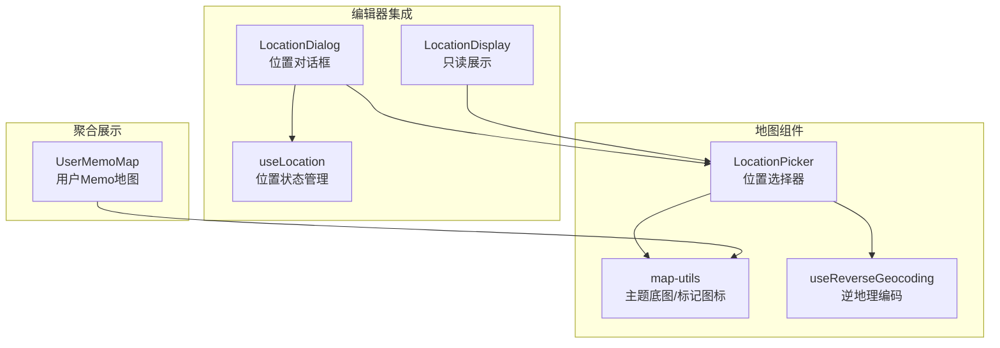
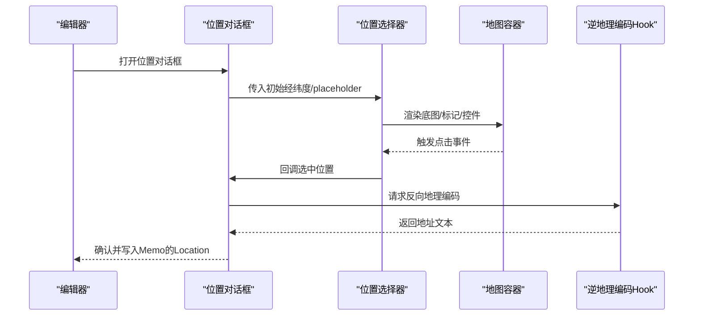
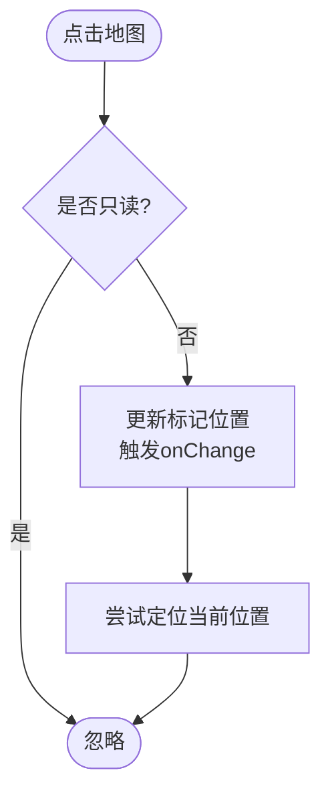
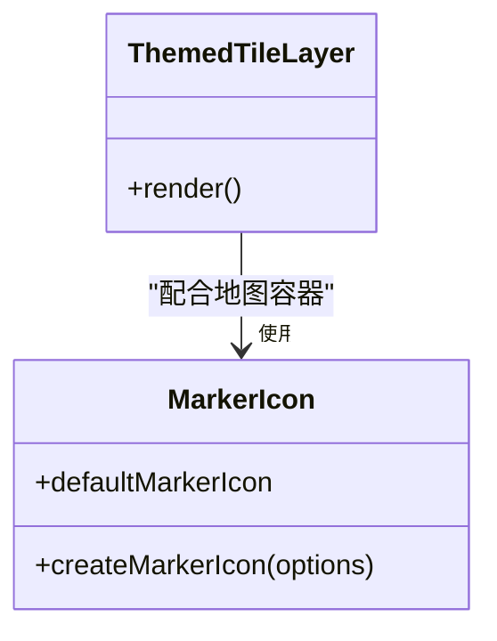
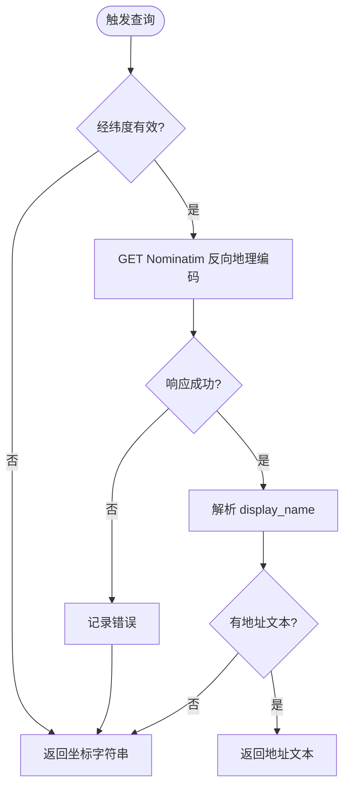
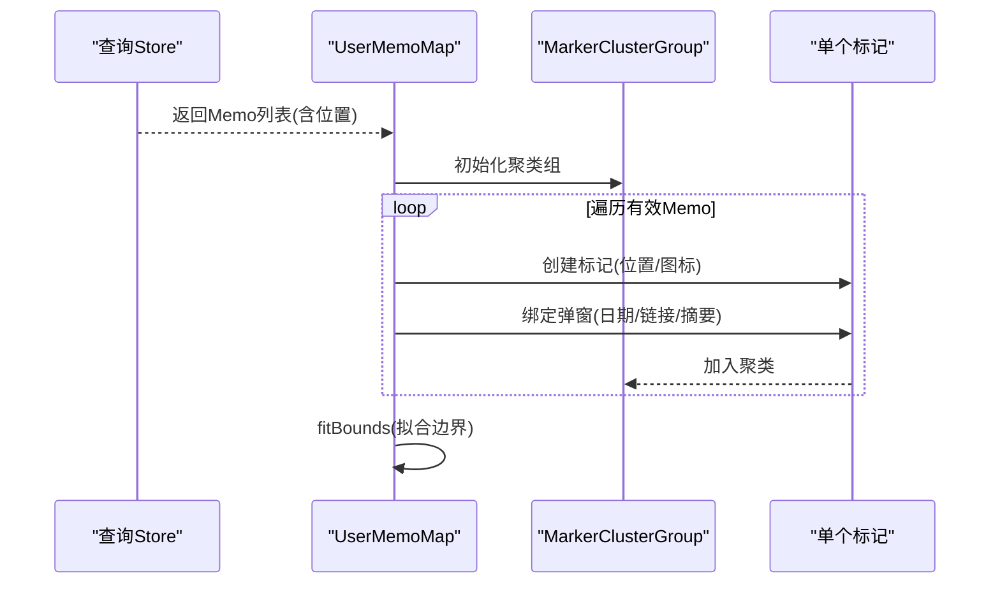
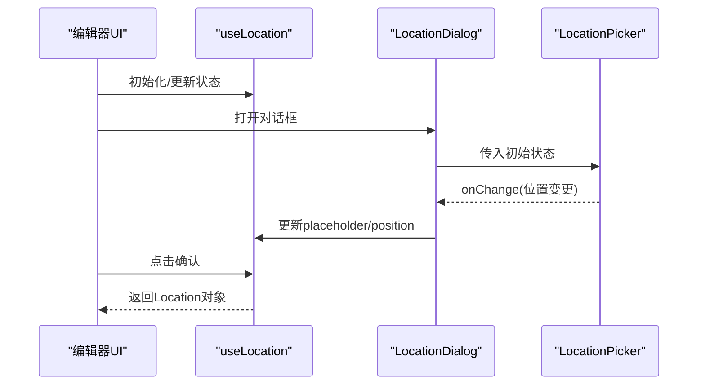
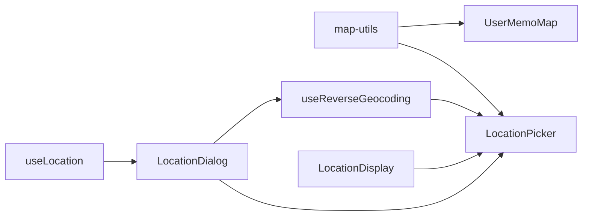

# 地图组件

<cite>
**本文引用的文件**
- [LocationPicker.tsx](file://web/src/components/map/LocationPicker.tsx)
- [index.ts](file://web/src/components/map/index.ts)
- [map-utils.tsx](file://web/src/components/map/map-utils.tsx)
- [useReverseGeocoding.ts](file://web/src/components/map/useReverseGeocoding.ts)
- [UserMemoMap.tsx](file://web/src/components/UserMemoMap/UserMemoMap.tsx)
- [LocationDisplay.tsx](file://web/src/components/MemoView/components/metadata/LocationDisplay.tsx)
- [LocationDialog.tsx](file://web/src/components/MemoEditor/components/LocationDialog.tsx)
- [useLocation.ts](file://web/src/components/MemoEditor/hooks/useLocation.ts)
- [insert-menu.ts](file://web/src/components/MemoEditor/types/insert-menu.ts)
- [memo_service.proto](file://proto/api/v1/memo_service.proto)
- [memo_service_pb.ts](file://web/src/types/proto/api/v1/memo_service_pb.ts)
</cite>

## 目录
1. [简介](#简介)
2. [项目结构](#项目结构)
3. [核心组件](#核心组件)
4. [架构总览](#架构总览)
5. [详细组件分析](#详细组件分析)
6. [依赖关系分析](#依赖关系分析)
7. [性能考虑](#性能考虑)
8. [故障排查指南](#故障排查指南)
9. [结论](#结论)
10. [附录](#附录)

## 简介
本文件系统性梳理前端地图组件的实现与集成，覆盖以下主题：
- 位置选择器：交互式地图上的点击选点、缩放控制、打开外部地图、定位能力与只读模式。
- 地图集成：基于 react-leaflet/Leaflet 的地图容器、主题化底图、自定义标记图标与控件渲染。
- 逆地理编码：通过 Nominatim 反向地理编码获取地址文本，带错误回退与缓存策略。
- 坐标转换与地址解析：经纬度输入校验、坐标更新、显示格式化与 placeholder 组装。
- 位置搜索：在编辑器中通过对话框选择位置并写入 Memo 的 Location 字段。
- 配置选项与样式定制：主题切换、控件样式、标记样式、集群样式。
- 地图服务集成：OpenStreetMap 底图、Carto 地图服务、Nominatim 逆地理编码。
- 性能优化与离线策略：标记聚类、懒加载、边界拟合、请求缓存与降级。

## 项目结构
地图相关代码集中在 web/src/components/map 目录，并在编辑器与详情页中被复用：
- map/LocationPicker：位置选择器与地图控件
- map/map-utils：主题化底图与标记图标
- map/useReverseGeocoding：逆地理编码 Hook
- UserMemoMap：用户 Memo 地图聚合展示（含标记聚类）
- 编辑器侧：LocationDialog、useLocation、LocationDisplay 等用于位置输入与展示
- 类型定义：proto 中的 Location 消息体与 TS 生成的类型

图表来源
- [LocationPicker.tsx](file://web/src/components/map/LocationPicker.tsx#L1-L246)
- [map-utils.tsx](file://web/src/components/map/map-utils.tsx#L1-L37)
- [useReverseGeocoding.ts](file://web/src/components/map/useReverseGeocoding.ts#L1-L40)
- [LocationDialog.tsx](file://web/src/components/MemoEditor/components/LocationDialog.tsx#L1-L23)
- [useLocation.ts](file://web/src/components/MemoEditor/hooks/useLocation.ts#L1-L73)
- [LocationDisplay.tsx](file://web/src/components/MemoView/components/metadata/LocationDisplay.tsx#L1-L52)
- [UserMemoMap.tsx](file://web/src/components/UserMemoMap/UserMemoMap.tsx#L1-L131)

章节来源
- [LocationPicker.tsx](file://web/src/components/map/LocationPicker.tsx#L1-L246)
- [map-utils.tsx](file://web/src/components/map/map-utils.tsx#L1-L37)
- [useReverseGeocoding.ts](file://web/src/components/map/useReverseGeocoding.ts#L1-L40)
- [UserMemoMap.tsx](file://web/src/components/UserMemoMap/UserMemoMap.tsx#L1-L131)
- [LocationDialog.tsx](file://web/src/components/MemoEditor/components/LocationDialog.tsx#L1-L23)
- [useLocation.ts](file://web/src/components/MemoEditor/hooks/useLocation.ts#L1-L73)
- [LocationDisplay.tsx](file://web/src/components/MemoView/components/metadata/LocationDisplay.tsx#L1-L52)

## 核心组件
- 位置选择器（LocationPicker）：提供可交互的地图容器、点击选点、缩放控制、打开外部地图链接、定位能力与只读模式。
- 主题底图（ThemedTileLayer）：根据用户主题自动切换 OpenStreetMap 或 Carto 地图服务。
- 自定义标记图标（createMarkerIcon/defaultMarkerIcon）：基于 React 渲染 SVG 图标为 Leaflet DivIcon。
- 逆地理编码（useReverseGeocoding）：对给定经纬度发起 Nominatim 反向地理编码请求，返回地址字符串或回退到坐标字符串。
- 用户 Memo 聚合地图（UserMemoMap）：按用户聚合 Memo 的位置标记，支持标记聚类、边界拟合、弹窗信息与懒加载。

章节来源
- [LocationPicker.tsx](file://web/src/components/map/LocationPicker.tsx#L1-L246)
- [map-utils.tsx](file://web/src/components/map/map-utils.tsx#L1-L37)
- [useReverseGeocoding.ts](file://web/src/components/map/useReverseGeocoding.ts#L1-L40)
- [UserMemoMap.tsx](file://web/src/components/UserMemoMap/UserMemoMap.tsx#L1-L131)

## 架构总览
地图组件围绕“地图容器 + 控件 + 标记 + 数据流”展开，数据从编辑器传入，经由位置选择器与逆地理编码，最终写入 Memo 的 Location 字段；聚合展示则从后端查询数据并在地图上渲染。

图表来源
- [LocationDialog.tsx](file://web/src/components/MemoEditor/components/LocationDialog.tsx#L1-L23)
- [LocationPicker.tsx](file://web/src/components/map/LocationPicker.tsx#L1-L246)
- [useReverseGeocoding.ts](file://web/src/components/map/useReverseGeocoding.ts#L1-L40)
- [useLocation.ts](file://web/src/components/MemoEditor/hooks/useLocation.ts#L1-L73)

## 详细组件分析

### 位置选择器（LocationPicker）
- 功能要点
  - 地图容器：默认中心点、缩放级别、禁用滚轮缩放与内置控件，使用自定义控件。
  - 交互：点击地图更新标记位置并触发父级回调；支持只读模式禁用交互。
  - 定位：首次挂载尝试定位当前用户位置。
  - 控件：右上角自定义控件，包含“在外部地图打开”、“放大”、“缩小”按钮。
  - 清理：组件卸载时清理地图实例，避免内存泄漏。
- 关键实现路径
  - 地图容器与控件渲染：[LocationPicker.tsx](file://web/src/components/map/LocationPicker.tsx#L225-L243)
  - 标记与交互事件：[LocationPicker.tsx](file://web/src/components/map/LocationPicker.tsx#L15-L51)
  - 自定义控件与按钮：[LocationPicker.tsx](file://web/src/components/map/LocationPicker.tsx#L82-L194)
  - 地图清理：[LocationPicker.tsx](file://web/src/components/map/LocationPicker.tsx#L196-L215)

图表来源
- [LocationPicker.tsx](file://web/src/components/map/LocationPicker.tsx#L19-L38)

章节来源
- [LocationPicker.tsx](file://web/src/components/map/LocationPicker.tsx#L1-L246)

### 主题底图与标记图标（map-utils）
- 功能要点
  - 主题底图：根据用户主题自动选择 Light/Dark 底图 URL。
  - 标记图标：将 Lucide MapPin 渲染为 SVG 并封装为 Leaflet DivIcon，支持颜色与尺寸定制。
- 关键实现路径
  - 主题底图：[map-utils.tsx](file://web/src/components/map/map-utils.tsx#L14-L18)
  - 自定义标记图标：[map-utils.tsx](file://web/src/components/map/map-utils.tsx#L26-L36)

图表来源
- [map-utils.tsx](file://web/src/components/map/map-utils.tsx#L14-L36)

章节来源
- [map-utils.tsx](file://web/src/components/map/map-utils.tsx#L1-L37)

### 逆地理编码（useReverseGeocoding）
- 功能要点
  - 请求参数：固定 endpoint、User-Agent、format=json。
  - 输入校验：经纬度必须存在才启用查询。
  - 结果处理：优先使用 display_name，失败或无值时回退到坐标字符串。
  - 错误处理：捕获异常并记录日志，保证 UI 不中断。
  - 缓存策略：staleTime=Infinity，避免重复请求。
- 关键实现路径
  - Hook 定义与查询逻辑：[useReverseGeocoding.ts](file://web/src/components/map/useReverseGeocoding.ts#L9-L39)

图表来源
- [useReverseGeocoding.ts](file://web/src/components/map/useReverseGeocoding.ts#L9-L39)

章节来源
- [useReverseGeocoding.ts](file://web/src/components/map/useReverseGeocoding.ts#L1-L40)

### 用户 Memo 聚合地图（UserMemoMap）
- 功能要点
  - 数据来源：分页查询用户 Memo，筛选带有位置的数据。
  - 地图适配：根据有效标记自动拟合边界，设置内边距。
  - 标记聚类：使用 react-leaflet-cluster，自定义聚类图标与行为。
  - 弹窗信息：点击标记显示 Memo 的日期、跳转链接与摘要。
  - 加载态：无数据时显示占位提示。
- 关键实现路径
  - 聚合与边界拟合：[UserMemoMap.tsx](file://web/src/components/UserMemoMap/UserMemoMap.tsx#L39-L53)
  - 标记聚类与图标：[UserMemoMap.tsx](file://web/src/components/UserMemoMap/UserMemoMap.tsx#L26-L32)
  - 渲染标记与弹窗：[UserMemoMap.tsx](file://web/src/components/UserMemoMap/UserMemoMap.tsx#L97-L122)

图表来源
- [UserMemoMap.tsx](file://web/src/components/UserMemoMap/UserMemoMap.tsx#L55-L125)

章节来源
- [UserMemoMap.tsx](file://web/src/components/UserMemoMap/UserMemoMap.tsx#L1-L131)

### 编辑器侧位置输入与展示
- 位置对话框（LocationDialog）：承载位置选择器、经纬度输入、占位符输入与确认/取消。
- 位置状态（useLocation）：维护 placeholder、position、经纬度输入框内容，提供坐标校验与重置。
- 只读展示（LocationDisplay）：在 Memo 详情页以弹出卡片形式展示位置，支持只读地图预览。
- 关键实现路径
  - 对话框与选择器集成：[LocationDialog.tsx](file://web/src/components/MemoEditor/components/LocationDialog.tsx#L1-L23)
  - 状态管理与校验：[useLocation.ts](file://web/src/components/MemoEditor/hooks/useLocation.ts#L1-L73)
  - 只读展示与地图预览：[LocationDisplay.tsx](file://web/src/components/MemoView/components/metadata/LocationDisplay.tsx#L12-L49)

图表来源
- [LocationDialog.tsx](file://web/src/components/MemoEditor/components/LocationDialog.tsx#L1-L23)
- [useLocation.ts](file://web/src/components/MemoEditor/hooks/useLocation.ts#L1-L73)
- [LocationDisplay.tsx](file://web/src/components/MemoView/components/metadata/LocationDisplay.tsx#L12-L49)

章节来源
- [LocationDialog.tsx](file://web/src/components/MemoEditor/components/LocationDialog.tsx#L1-L23)
- [useLocation.ts](file://web/src/components/MemoEditor/hooks/useLocation.ts#L1-L73)
- [LocationDisplay.tsx](file://web/src/components/MemoView/components/metadata/LocationDisplay.tsx#L1-L52)

### 类型定义与数据模型
- Location 消息体（proto）：包含 placeholder、latitude、longitude。
- TS 类型（生成）：通过 protobuf 生成的 Location 类型与 Schema，用于 create/验证。
- 关键实现路径
  - proto 定义：[memo_service.proto](file://proto/api/v1/memo_service.proto#L233-L242)
  - TS 类型与 Schema：[memo_service_pb.ts](file://web/src/types/proto/api/v1/memo_service_pb.ts#L1-L200)

章节来源
- [memo_service.proto](file://proto/api/v1/memo_service.proto#L233-L242)
- [memo_service_pb.ts](file://web/src/types/proto/api/v1/memo_service_pb.ts#L1-L200)

## 依赖关系分析
- 组件耦合
  - LocationPicker 依赖 map-utils（底图与标记）、useReverseGeocoding（地址解析）。
  - UserMemoMap 依赖 map-utils（底图与标记）、react-leaflet-cluster（聚类）。
  - 编辑器侧通过 useLocation 与 LocationDialog 协作，最终写入 Memo 的 Location。
- 外部依赖
  - react-leaflet/Leaflet：地图容器、标记、控件与事件。
  - react-query：逆地理编码的查询与缓存。
  - react-leaflet-cluster：标记聚类。
  - Nominatim：反向地理编码服务。
- 潜在循环依赖
  - 当前模块间为单向依赖，未发现循环导入。

图表来源
- [LocationPicker.tsx](file://web/src/components/map/LocationPicker.tsx#L1-L246)
- [map-utils.tsx](file://web/src/components/map/map-utils.tsx#L1-L37)
- [useReverseGeocoding.ts](file://web/src/components/map/useReverseGeocoding.ts#L1-L40)
- [UserMemoMap.tsx](file://web/src/components/UserMemoMap/UserMemoMap.tsx#L1-L131)
- [LocationDialog.tsx](file://web/src/components/MemoEditor/components/LocationDialog.tsx#L1-L23)
- [useLocation.ts](file://web/src/components/MemoEditor/hooks/useLocation.ts#L1-L73)
- [LocationDisplay.tsx](file://web/src/components/MemoView/components/metadata/LocationDisplay.tsx#L1-L52)

章节来源
- [LocationPicker.tsx](file://web/src/components/map/LocationPicker.tsx#L1-L246)
- [map-utils.tsx](file://web/src/components/map/map-utils.tsx#L1-L37)
- [useReverseGeocoding.ts](file://web/src/components/map/useReverseGeocoding.ts#L1-L40)
- [UserMemoMap.tsx](file://web/src/components/UserMemoMap/UserMemoMap.tsx#L1-L131)
- [LocationDialog.tsx](file://web/src/components/MemoEditor/components/LocationDialog.tsx#L1-L23)
- [useLocation.ts](file://web/src/components/MemoEditor/hooks/useLocation.ts#L1-L73)
- [LocationDisplay.tsx](file://web/src/components/MemoView/components/metadata/LocationDisplay.tsx#L1-L52)

## 性能考虑
- 地图渲染
  - 禁用滚轮缩放与内置控件，减少事件冲突与重绘。
  - 使用自定义控件容器，仅在需要时渲染按钮，降低 DOM 开销。
- 标记聚类
  - react-leaflet-cluster 提供 chunkedLoading、最大聚类半径与蜘蛛展开，显著提升大数据量场景性能。
- 查询缓存
  - 逆地理编码使用 react-query，默认启用 staleTime=Infinity，避免重复请求。
- 边界拟合
  - 聚合地图在数据变化时重新计算边界，避免不必要的全局重绘。
- 懒加载
  - 聚合地图开启 chunkedLoading，延迟加载标记，改善首屏性能。
- 离线策略
  - 底图来自 OSM/Carto，可在网络异常时仍显示基础地图瓦片。
  - 逆地理编码失败时回退到坐标字符串，保证可用性。

章节来源
- [LocationPicker.tsx](file://web/src/components/map/LocationPicker.tsx#L229-L236)
- [UserMemoMap.tsx](file://web/src/components/UserMemoMap/UserMemoMap.tsx#L90-L96)
- [useReverseGeocoding.ts](file://web/src/components/map/useReverseGeocoding.ts#L37-L38)

## 故障排查指南
- 无法定位当前位置
  - 检查浏览器地理位置权限与 HTTPS 环境。
  - 查看控制台是否有 Geolocation 错误日志。
- 点击地图不更新标记
  - 确认未启用只读模式。
  - 检查地图事件绑定与父级 onChange 回调是否正确传递。
- 逆地理编码失败
  - 检查网络连通性与 Nominatim 服务状态。
  - 查看控制台错误日志，确认 User-Agent 与 Accept 头是否正确。
- 地图控件点击穿透
  - 确保自定义控件容器已禁用点击与滚动传播。
- 聚合地图标记过多导致卡顿
  - 调整聚类半径与最大聚类半径，或减少一次性加载数量。
- 地图卸载后内存未释放
  - 确认已执行地图实例移除逻辑。

章节来源
- [LocationPicker.tsx](file://web/src/components/map/LocationPicker.tsx#L196-L215)
- [useReverseGeocoding.ts](file://web/src/components/map/useReverseGeocoding.ts#L31-L34)

## 结论
该地图组件体系以 LocationPicker 为核心，结合主题化底图、自定义标记与逆地理编码，实现了从“位置选择 -> 地址解析 -> 写入 Memo”的完整闭环；同时通过聚类与缓存等手段保障了大规模数据场景下的性能与稳定性。编辑器侧通过统一的状态管理与对话框集成，使位置输入体验一致且可控。

## 附录

### 配置选项与样式定制
- 地图容器
  - 尺寸：高度 72 份（可按需调整）。
  - 中心点与初始缩放：默认中心点与缩放级别。
  - 交互：禁用滚轮缩放、内置控件与版权信息。
- 控件样式
  - 使用“玻璃风格”按钮，支持深浅色主题与悬停/激活效果。
  - 控件容器禁用点击与滚动传播，避免干扰地图交互。
- 标记图标
  - 默认使用橙色 MapPin，支持颜色与尺寸定制。
- 聚类样式
  - 自定义聚类图标，显示标记数量，设置最大聚类半径与蜘蛛展开行为。

章节来源
- [LocationPicker.tsx](file://web/src/components/map/LocationPicker.tsx#L229-L236)
- [LocationPicker.tsx](file://web/src/components/map/LocationPicker.tsx#L61-L80)
- [map-utils.tsx](file://web/src/components/map/map-utils.tsx#L26-L36)
- [UserMemoMap.tsx](file://web/src/components/UserMemoMap/UserMemoMap.tsx#L26-L32)
- [UserMemoMap.tsx](file://web/src/components/UserMemoMap/UserMemoMap.tsx#L90-L96)

### 地图服务集成
- 底图服务
  - Light：OpenStreetMap
  - Dark：Carto（暗色主题）
- 逆地理编码
  - 服务：Nominatim
  - 参数：format=json、User-Agent、Accept: application/json
  - 回退：无结果时返回坐标字符串

章节来源
- [map-utils.tsx](file://web/src/components/map/map-utils.tsx#L9-L12)
- [useReverseGeocoding.ts](file://web/src/components/map/useReverseGeocoding.ts#L3-L7)
- [useReverseGeocoding.ts](file://web/src/components/map/useReverseGeocoding.ts#L17-L23)
- [useReverseGeocoding.ts](file://web/src/components/map/useReverseGeocoding.ts#L30-L34)

### API 与数据流
- Location 对象
  - 字段：placeholder、latitude、longitude
  - 生成与校验：通过 protobuf Schema 与 create 工具
- 编辑器写入流程
  - useLocation 维护状态 -> LocationDialog 传入选择器 -> LocationPicker 回调 -> 逆地理编码 -> 写入 Memo

章节来源
- [memo_service.proto](file://proto/api/v1/memo_service.proto#L233-L242)
- [memo_service_pb.ts](file://web/src/types/proto/api/v1/memo_service_pb.ts#L1-L200)
- [useLocation.ts](file://web/src/components/MemoEditor/hooks/useLocation.ts#L53-L62)
- [LocationDialog.tsx](file://web/src/components/MemoEditor/components/LocationDialog.tsx#L1-L23)
- [LocationPicker.tsx](file://web/src/components/map/LocationPicker.tsx#L19-L29)