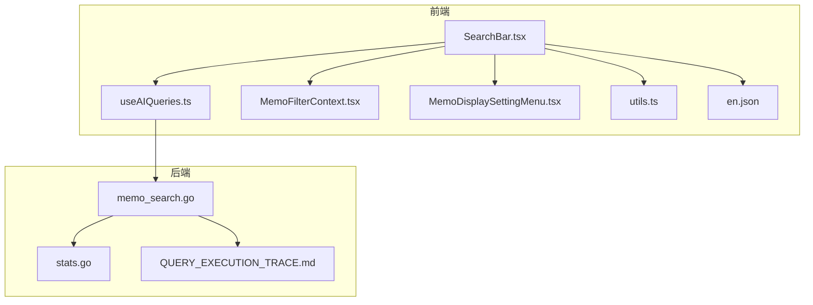
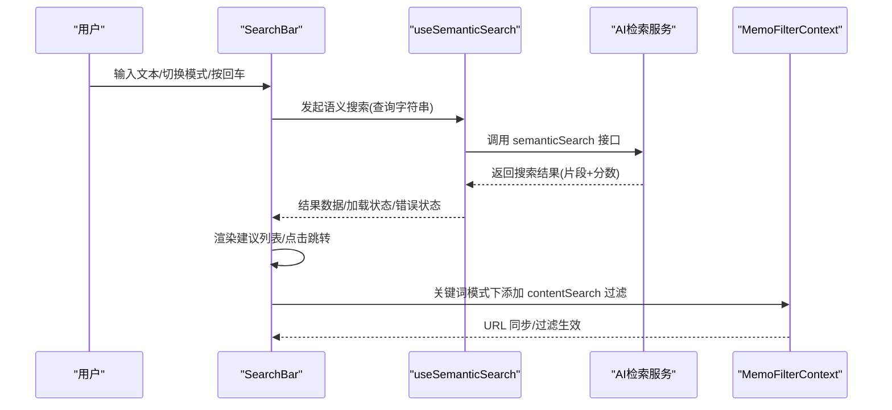
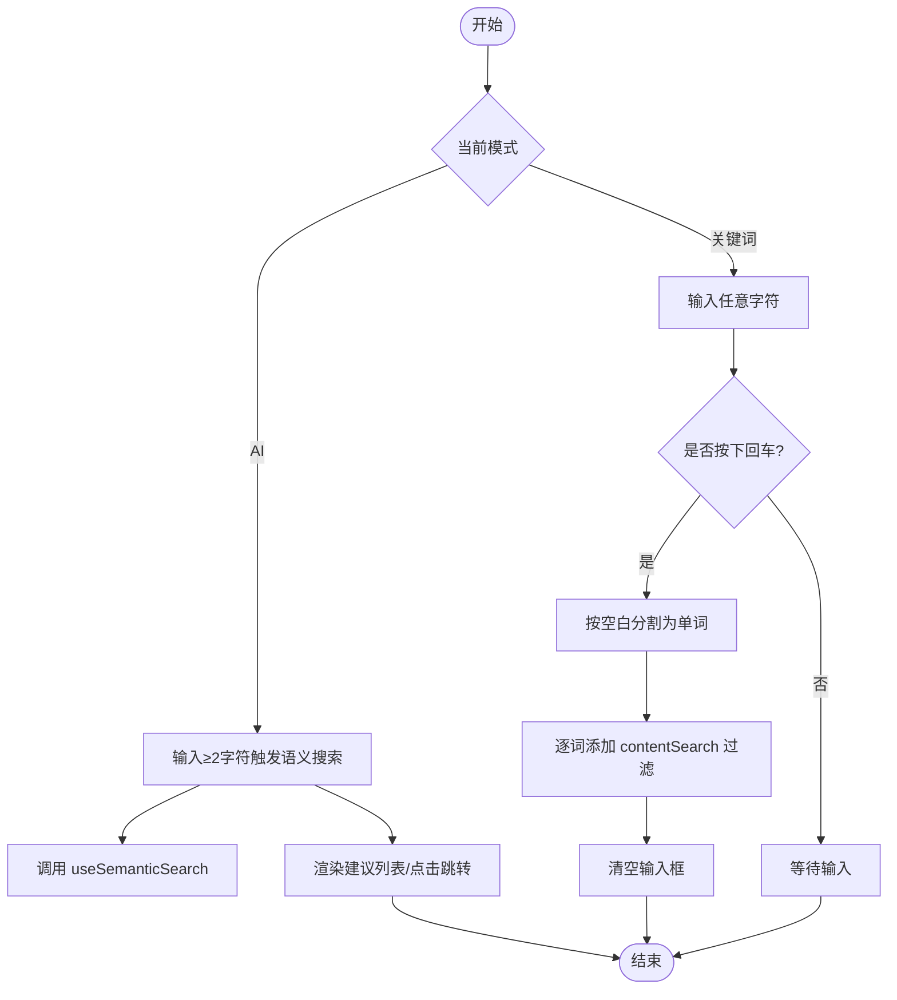
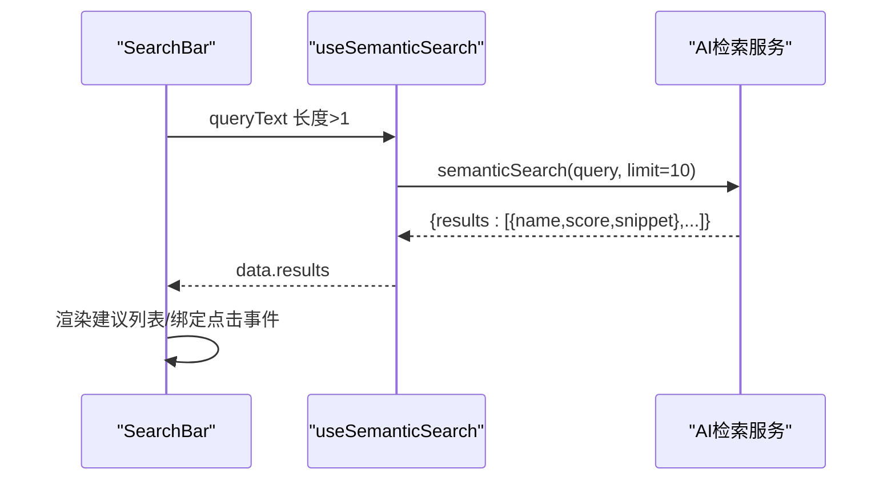
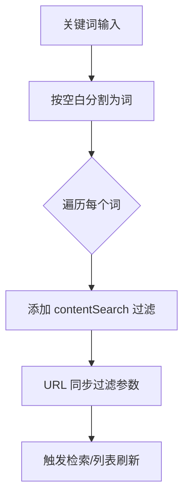
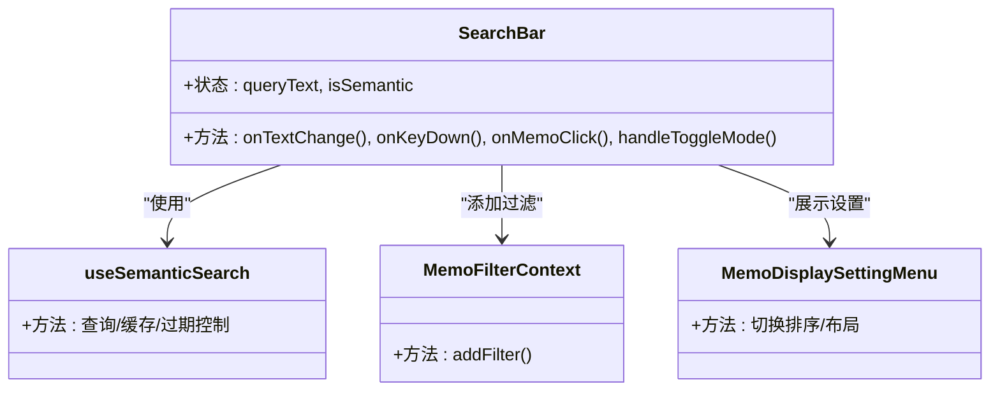
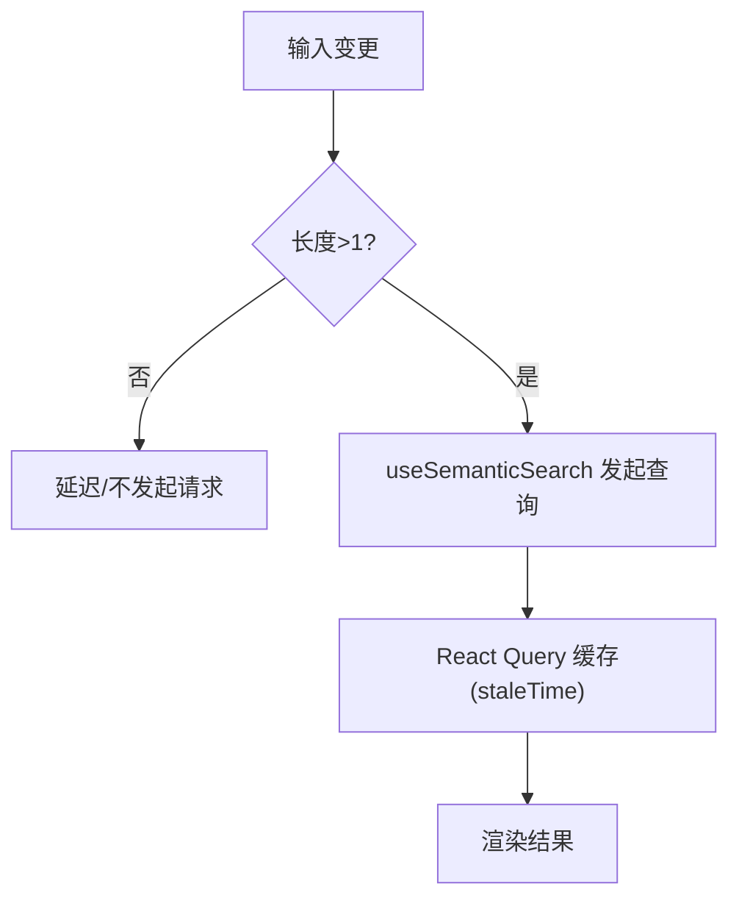
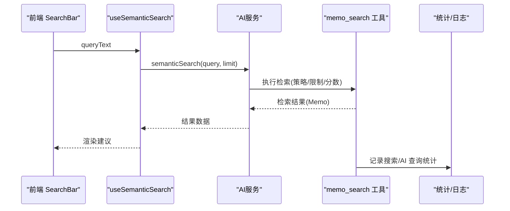
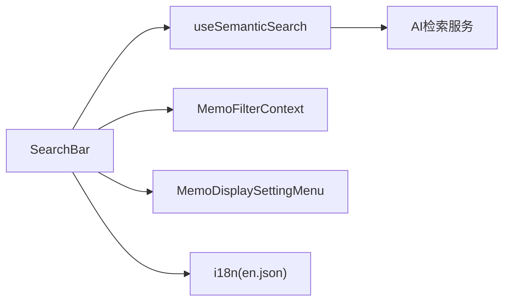

# 搜索栏组件

<cite>
**本文引用的文件**
- [SearchBar.tsx](file://web/src/components/SearchBar.tsx)
- [useAIQueries.ts](file://web/src/hooks/useAIQueries.ts)
- [MemoFilterContext.tsx](file://web/src/contexts/MemoFilterContext.tsx)
- [MemoDisplaySettingMenu.tsx](file://web/src/components/MemoDisplaySettingMenu.tsx)
- [utils.ts](file://web/src/lib/utils.ts)
- [en.json](file://web/src/locales/en.json)
- [memo_search.go](file://plugin/ai/agent/tools/memo_search.go)
- [stats.go](file://server/stats/stats.go)
- [QUERY_EXECUTION_TRACE.md](file://docs/archived/cleanup_20260123/optimal_rag/QUERY_EXECUTION_TRACE.md)
</cite>

## 目录
1. [简介](#简介)
2. [项目结构](#项目结构)
3. [核心组件](#核心组件)
4. [架构总览](#架构总览)
5. [详细组件分析](#详细组件分析)
6. [依赖关系分析](#依赖关系分析)
7. [性能考虑](#性能考虑)
8. [故障排查指南](#故障排查指南)
9. [结论](#结论)
10. [附录](#附录)

## 简介
本文件系统性地阐述搜索栏组件的设计与实现，覆盖以下关键能力：
- 搜索输入框与模式切换（语义搜索/关键词搜索）
- 自动完成与搜索建议展示
- 搜索逻辑、过滤条件与结果渲染
- 防抖与缓存策略
- 搜索历史与热门搜索（概念性说明）
- 组件配置项、样式定制与键盘导航
- 与后端 AI 服务的集成与性能优化

该组件采用“语义搜索优先”的设计，默认启用 AI 语义搜索；当用户切换到关键词模式或语义搜索失败时，回退到基于内容的关键词过滤。

## 项目结构
搜索栏组件位于前端工程的 UI 组件目录，依赖状态与查询工具，以及后端 AI 检索服务。

**图表来源**
- [SearchBar.tsx](file://web/src/components/SearchBar.tsx#L1-L151)
- [useAIQueries.ts](file://web/src/hooks/useAIQueries.ts#L28-L41)
- [MemoFilterContext.tsx](file://web/src/contexts/MemoFilterContext.tsx#L101-L103)
- [MemoDisplaySettingMenu.tsx](file://web/src/components/MemoDisplaySettingMenu.tsx#L1-L68)
- [utils.ts](file://web/src/lib/utils.ts#L4-L6)
- [en.json](file://web/src/locales/en.json#L93-L118)
- [memo_search.go](file://plugin/ai/agent/tools/memo_search.go#L125-L179)
- [stats.go](file://server/stats/stats.go#L232-L250)
- [QUERY_EXECUTION_TRACE.md](file://docs/archived/cleanup_20260123/optimal_rag/QUERY_EXECUTION_TRACE.md#L183-L220)

**章节来源**
- [SearchBar.tsx](file://web/src/components/SearchBar.tsx#L1-L151)
- [useAIQueries.ts](file://web/src/hooks/useAIQueries.ts#L28-L41)
- [MemoFilterContext.tsx](file://web/src/contexts/MemoFilterContext.tsx#L101-L103)
- [MemoDisplaySettingMenu.tsx](file://web/src/components/MemoDisplaySettingMenu.tsx#L1-L68)
- [utils.ts](file://web/src/lib/utils.ts#L4-L6)
- [en.json](file://web/src/locales/en.json#L93-L118)
- [memo_search.go](file://plugin/ai/agent/tools/memo_search.go#L125-L179)
- [stats.go](file://server/stats/stats.go#L232-L250)
- [QUERY_EXECUTION_TRACE.md](file://docs/archived/cleanup_20260123/optimal_rag/QUERY_EXECUTION_TRACE.md#L183-L220)

## 核心组件
- 搜索栏 SearchBar：负责输入、模式切换、语义搜索结果展示、关键词模式下的过滤触发与跳转。
- AI 查询钩子 useSemanticSearch：封装语义搜索请求、缓存键与过期策略。
- 过滤上下文 MemoFilterContext：维护 URL 同步、过滤器集合与添加/移除等操作。
- 展示设置菜单 MemoDisplaySettingMenu：提供排序与布局设置入口。
- 工具函数 utils：提供类名合并工具 cn。

**章节来源**
- [SearchBar.tsx](file://web/src/components/SearchBar.tsx#L10-L151)
- [useAIQueries.ts](file://web/src/hooks/useAIQueries.ts#L28-L41)
- [MemoFilterContext.tsx](file://web/src/contexts/MemoFilterContext.tsx#L101-L103)
- [MemoDisplaySettingMenu.tsx](file://web/src/components/MemoDisplaySettingMenu.tsx#L12-L68)
- [utils.ts](file://web/src/lib/utils.ts#L4-L6)

## 架构总览
搜索栏的交互流程如下：

**图表来源**
- [SearchBar.tsx](file://web/src/components/SearchBar.tsx#L18-L62)
- [useAIQueries.ts](file://web/src/hooks/useAIQueries.ts#L28-L41)
- [MemoFilterContext.tsx](file://web/src/contexts/MemoFilterContext.tsx#L101-L103)

## 详细组件分析

### 搜索输入与模式切换
- 默认启用语义搜索（AI 模式），左侧图标作为模式切换按钮，点击在 AI 与关键词模式间切换。
- 输入框占位符随模式变化，AI 模式提示自然语言描述，关键词模式提示精确匹配。
- 键盘事件监听 Enter：在关键词模式下将输入拆分为单词，逐个添加 contentSearch 过滤，并清空输入框。

**图表来源**
- [SearchBar.tsx](file://web/src/components/SearchBar.tsx#L18-L62)
- [MemoFilterContext.tsx](file://web/src/contexts/MemoFilterContext.tsx#L101-L103)

**章节来源**
- [SearchBar.tsx](file://web/src/components/SearchBar.tsx#L10-L62)
- [MemoFilterContext.tsx](file://web/src/contexts/MemoFilterContext.tsx#L101-L103)

### 自动完成与搜索建议
- AI 模式下，当输入长度大于 1 时，通过 useSemanticSearch 触发语义搜索，返回结果集用于建议列表渲染。
- 建议项包含片段与相似度分数，点击建议项跳转至对应 Memo 详情页。
- 加载态、错误态与无结果态分别提供反馈与回退按钮（可切换到关键词模式）。

**图表来源**
- [SearchBar.tsx](file://web/src/components/SearchBar.tsx#L18-L24)
- [useAIQueries.ts](file://web/src/hooks/useAIQueries.ts#L28-L41)

**章节来源**
- [SearchBar.tsx](file://web/src/components/SearchBar.tsx#L103-L145)
- [useAIQueries.ts](file://web/src/hooks/useAIQueries.ts#L28-L41)

### 关键词搜索与过滤条件
- 关键词模式下，按空白分词，逐词以 contentSearch 因子添加过滤器，最终通过 URL 参数同步到路由。
- 过滤因子包括内容搜索、标签搜索、可见性、显示时间、置顶、属性(hasLink/hasTaskList/hasCode)等。
- contentSearch 的过滤表达式在查询引擎侧转换为条件表达式，用于检索。

**图表来源**
- [SearchBar.tsx](file://web/src/components/SearchBar.tsx#L33-L45)
- [MemoFilterContext.tsx](file://web/src/contexts/MemoFilterContext.tsx#L101-L103)
- [useMemoFilters.ts](file://web/src/hooks/useMemoFilters.ts#L64-L90)

**章节来源**
- [SearchBar.tsx](file://web/src/components/SearchBar.tsx#L33-L45)
- [MemoFilterContext.tsx](file://web/src/contexts/MemoFilterContext.tsx#L101-L103)
- [useMemoFilters.ts](file://web/src/hooks/useMemoFilters.ts#L64-L90)

### 结果展示与交互
- 建议项展示片段与相似度分数，悬停高亮并支持点击跳转到 Memo 详情。
- 输入框右侧提供展示设置入口，便于调整排序与布局。
- 模式切换按钮位于输入框左侧，视觉上强调 AI 模式的引导。

**图表来源**
- [SearchBar.tsx](file://web/src/components/SearchBar.tsx#L10-L151)
- [MemoDisplaySettingMenu.tsx](file://web/src/components/MemoDisplaySettingMenu.tsx#L12-L68)
- [MemoFilterContext.tsx](file://web/src/contexts/MemoFilterContext.tsx#L101-L103)
- [useAIQueries.ts](file://web/src/hooks/useAIQueries.ts#L28-L41)

**章节来源**
- [SearchBar.tsx](file://web/src/components/SearchBar.tsx#L64-L147)
- [MemoDisplaySettingMenu.tsx](file://web/src/components/MemoDisplaySettingMenu.tsx#L12-L68)

### 防抖与缓存策略
- 防抖：语义搜索在输入长度大于 1 时才发起请求，避免频繁调用；结合 React Query 的缓存键与过期时间，降低重复请求。
- 缓存：useSemanticSearch 设置了合理的 staleTime，确保短期内重复查询命中缓存。
- 后端缓存：文档建议引入向量查询缓存层，提升检索性能与稳定性（概念性建议）。

**图表来源**
- [SearchBar.tsx](file://web/src/components/SearchBar.tsx#L18-L24)
- [useAIQueries.ts](file://web/src/hooks/useAIQueries.ts#L28-L41)
- [CODE_REVIEW_FIX_PLAN.md](file://docs/archived/CODE_REVIEW_FIX_PLAN.md#L947-L980)

**章节来源**
- [SearchBar.tsx](file://web/src/components/SearchBar.tsx#L18-L24)
- [useAIQueries.ts](file://web/src/hooks/useAIQueries.ts#L28-L41)
- [CODE_REVIEW_FIX_PLAN.md](file://docs/archived/CODE_REVIEW_FIX_PLAN.md#L947-L980)

### 搜索历史与热门搜索
- 当前实现未包含搜索历史与热门搜索持久化存储。
- 建议方案（概念性）：
  - 前端：本地存储最近 N 条搜索词，渲染热门标签云。
  - 后端：记录搜索统计与热门词，结合用户偏好进行个性化推荐。
  - 注意：需遵循隐私与数据最小化原则，提供开关与清理机制。

[本节为概念性说明，不直接分析具体文件]

### 组件配置选项、样式定制与键盘导航
- 配置选项
  - 模式：AI 模式默认开启，可通过按钮切换。
  - 占位符：根据模式动态切换。
  - 结果数量：语义搜索限制为 10 条（可扩展）。
- 样式定制
  - 使用 cn 合并 Tailwind 类名，支持主题与暗色模式适配。
  - 建议通过 CSS 变量或主题文件统一风格。
- 键盘导航
  - AI 模式下建议项支持上下箭头选择与回车/Tab 确认（当前实现聚焦点击跳转）。
  - 关键词模式下支持回车触发过滤。

**章节来源**
- [SearchBar.tsx](file://web/src/components/SearchBar.tsx#L64-L96)
- [utils.ts](file://web/src/lib/utils.ts#L4-L6)

### 与后端 API 的集成
- 前端通过 useSemanticSearch 调用 AI 服务的语义搜索接口，传入查询与限制条数。
- 后端工具链在检索时校验查询、设置策略（如 memo_semantic_only）、限制最大返回条数与最小分数，并过滤仅返回 Memo 结果。
- 检索路由与策略文档指出时间关键词与默认策略，有助于理解语义搜索的上下文与边界。

**图表来源**
- [useAIQueries.ts](file://web/src/hooks/useAIQueries.ts#L28-L41)
- [memo_search.go](file://plugin/ai/agent/tools/memo_search.go#L125-L179)
- [stats.go](file://server/stats/stats.go#L232-L250)

**章节来源**
- [useAIQueries.ts](file://web/src/hooks/useAIQueries.ts#L28-L41)
- [memo_search.go](file://plugin/ai/agent/tools/memo_search.go#L125-L179)
- [stats.go](file://server/stats/stats.go#L232-L250)

## 依赖关系分析
- 组件内聚与耦合
  - SearchBar 内聚于搜索交互，依赖 useSemanticSearch、MemoFilterContext、MemoDisplaySettingMenu 与国际化资源。
  - 低耦合：通过钩子与上下文解耦 UI 与数据流。
- 外部依赖
  - React Query：查询缓存与失效管理。
  - i18n：多语言占位符与文案。
  - Lucide 图标：视觉反馈。
- 潜在循环依赖
  - 未发现直接循环依赖；若后续扩展建议列表组件，需避免与 SearchBar 的双向引用。

**图表来源**
- [SearchBar.tsx](file://web/src/components/SearchBar.tsx#L1-L8)
- [useAIQueries.ts](file://web/src/hooks/useAIQueries.ts#L1-L10)
- [MemoFilterContext.tsx](file://web/src/contexts/MemoFilterContext.tsx#L1-L5)
- [en.json](file://web/src/locales/en.json#L93-L118)

**章节来源**
- [SearchBar.tsx](file://web/src/components/SearchBar.tsx#L1-L8)
- [useAIQueries.ts](file://web/src/hooks/useAIQueries.ts#L1-L10)
- [MemoFilterContext.tsx](file://web/src/contexts/MemoFilterContext.tsx#L1-L5)
- [en.json](file://web/src/locales/en.json#L93-L118)

## 性能考虑
- 前端
  - 控制请求频率：仅在输入长度大于 1 时发起语义搜索。
  - 缓存与过期：合理设置 staleTime，避免重复请求。
  - 虚拟化：建议对长列表使用虚拟滚动（概念性建议）。
- 后端
  - 向量查询缓存：为相同查询与用户建立缓存键，缩短响应时间。
  - 批处理与批大小自适应：根据响应时间动态调整批大小，平衡吞吐与延迟。
  - 检索策略优化：明确时间词与默认策略，减少无效计算。

**章节来源**
- [SearchBar.tsx](file://web/src/components/SearchBar.tsx#L18-L24)
- [useAIQueries.ts](file://web/src/hooks/useAIQueries.ts#L28-L41)
- [CODE_REVIEW_FIX_PLAN.md](file://docs/archived/CODE_REVIEW_FIX_PLAN.md#L947-L1026)
- [QUERY_EXECUTION_TRACE.md](file://docs/archived/cleanup_20260123/optimal_rag/QUERY_EXECUTION_TRACE.md#L183-L220)

## 故障排查指南
- 语义搜索无结果
  - 检查输入长度是否满足 >1 的条件。
  - 确认 useSemanticSearch 的 enabled 条件与 queryKey 是否正确。
- 错误态处理
  - 组件提供错误态反馈与回退按钮，可切换到关键词模式继续使用。
- 关键词模式无效
  - 确认回车事件是否触发、过滤器是否成功添加、URL 是否同步。
- 后端检索异常
  - 检查查询合法性、策略与限制参数、最小分数阈值。
  - 查看统计记录与日志，定位高频失败场景。

**章节来源**
- [SearchBar.tsx](file://web/src/components/SearchBar.tsx#L103-L145)
- [useAIQueries.ts](file://web/src/hooks/useAIQueries.ts#L28-L41)
- [memo_search.go](file://plugin/ai/agent/tools/memo_search.go#L125-L179)
- [stats.go](file://server/stats/stats.go#L232-L250)

## 结论
搜索栏组件以“语义搜索优先”为核心，结合关键词模式与过滤系统，形成灵活高效的检索体验。通过 React Query 的缓存与过期策略、后端检索优化与统计埋点，整体具备良好的性能与可观测性。未来可在建议列表键盘导航、搜索历史与热门词、以及前端虚拟化等方面持续增强。

## 附录
- 国际化键值参考
  - 搜索相关键：search.ai-placeholder、search.keyword-mode、search.ai-mode、search.switch-to-keyword、search.switch-to-ai、search.ai-searching、search.ai-error、search.fallback-to-keyword、search.no-results、search.score。
- 相关实现路径
  - 搜索栏：[SearchBar.tsx](file://web/src/components/SearchBar.tsx#L10-L151)
  - 语义搜索钩子：[useAIQueries.ts](file://web/src/hooks/useAIQueries.ts#L28-L41)
  - 过滤上下文：[MemoFilterContext.tsx](file://web/src/contexts/MemoFilterContext.tsx#L101-L103)
  - 展示设置菜单：[MemoDisplaySettingMenu.tsx](file://web/src/components/MemoDisplaySettingMenu.tsx#L12-L68)
  - 工具函数：[utils.ts](file://web/src/lib/utils.ts#L4-L6)
  - 后端检索工具：[memo_search.go](file://plugin/ai/agent/tools/memo_search.go#L125-L179)
  - 统计记录：[stats.go](file://server/stats/stats.go#L232-L250)
  - 检索策略与时间词：[QUERY_EXECUTION_TRACE.md](file://docs/archived/cleanup_20260123/optimal_rag/QUERY_EXECUTION_TRACE.md#L183-L220)