# 日程快速输入组件

<cite>
**本文档引用的文件**
- [ScheduleQuickInput.tsx](file://web/src/components/ScheduleQuickInput/ScheduleQuickInput.tsx)
- [QuickEditPopover.tsx](file://web/src/components/ScheduleQuickInput/QuickEditPopover.tsx)
- [AISuggestionCards.tsx](file://web/src/components/ScheduleQuickInput/AISuggestionCards.tsx)
- [QuickTemplates.tsx](file://web/src/components/ScheduleQuickInput/QuickTemplates.tsx)
- [StreamingScheduleAssistant.tsx](file://web/src/components/AIChat/StreamingScheduleAssistant.tsx)
- [ScheduleAISidebar.tsx](file://web/src/components/AIChat/ScheduleAISidebar.tsx)
- [useScheduleQueries.ts](file://web/src/hooks/useScheduleQueries.ts)
- [ScheduleContext.tsx](file://web/src/contexts/ScheduleContext.tsx)
- [conflict_resolver.go](file://server/service/schedule/conflict_resolver.go)
- [service.go](file://server/service/schedule/service.go)
- [schedule_agent_service.go](file://server/router/api/v1/schedule_agent_service.go)
- [types.ts](file://web/src/components/ScheduleQuickInput/types.ts)
</cite>

## 更新摘要
**所做更改**
- 新增 QuickEditPopover 组件用于快速日程编辑功能
- 更新组件架构以反映从复杂 AI 功能向直接内联编辑的转变
- 移除原有的复杂 AI 建议和模板系统分析
- 重新组织组件关系图以体现新的编辑模式

## 目录
1. [简介](#简介)
2. [项目结构](#项目结构)
3. [核心组件](#核心组件)
4. [架构概览](#架构概览)
5. [详细组件分析](#详细组件分析)
6. [依赖关系分析](#依赖关系分析)
7. [性能考虑](#性能考虑)
8. [故障排除指南](#故障排除指南)
9. [结论](#结论)

## 简介

日程快速输入组件是 Memos 系统中的核心功能模块，旨在为用户提供智能化的日程创建体验。该组件集成了自然语言处理、AI 建议、模板化输入和冲突检测等多种高级功能，通过简洁直观的界面让用户能够以最自然的方式创建和管理日程。

**重要更新**：组件现已新增 QuickEditPopover 快速编辑功能，允许用户通过右键菜单或长按手势直接编辑现有日程，无需导航到复杂对话框。这一变化将传统的复杂 AI 功能简化为直接的内联编辑能力。

该组件的主要特点包括：
- 智能自然语言解析，支持中文和英文的混合输入
- AI 助手实时建议和确认机制（可选）
- 预设模板快速创建常用类型的日程（可选）
- 实时冲突检测和时间槽推荐
- 流畅的用户交互体验和无障碍支持
- **新增**：快速内联编辑功能，支持延迟、改天和取消等快捷操作

## 项目结构

日程快速输入组件位于前端 Web 应用的组件目录中，采用模块化设计，主要包含以下核心文件：

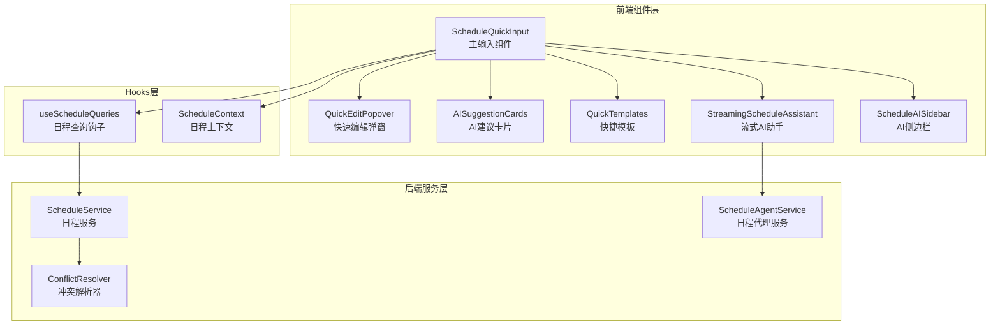

**图表来源**
- [ScheduleQuickInput.tsx](file://web/src/components/ScheduleQuickInput/ScheduleQuickInput.tsx#L1-L359)
- [QuickEditPopover.tsx](file://web/src/components/ScheduleQuickInput/QuickEditPopover.tsx#L1-L199)
- [AISuggestionCards.tsx](file://web/src/components/ScheduleQuickInput/AISuggestionCards.tsx#L1-L355)
- [QuickTemplates.tsx](file://web/src/components/ScheduleQuickInput/QuickTemplates.tsx#L1-L368)

**章节来源**
- [ScheduleQuickInput.tsx](file://web/src/components/ScheduleQuickInput/ScheduleQuickInput.tsx#L1-L50)
- [QuickEditPopover.tsx](file://web/src/components/ScheduleQuickInput/QuickEditPopover.tsx#L1-L30)
- [AISuggestionCards.tsx](file://web/src/components/ScheduleQuickInput/AISuggestionCards.tsx#L1-L30)
- [QuickTemplates.tsx](file://web/src/components/ScheduleQuickInput/QuickTemplates.tsx#L1-L25)

## 核心组件

### 主要组件职责

1. **ScheduleQuickInput** - 主要输入组件，负责整体界面布局和状态管理
2. **QuickEditPopover** - **新增** 快速编辑弹窗，提供内联编辑能力
3. **AISuggestionCards** - AI 建议卡片展示，支持双击创建和键盘导航
4. **QuickTemplates** - 快捷模板系统，提供预设的日程模板
5. **StreamingScheduleAssistant** - 流式 AI 助手，支持工具调用和实时响应
6. **ScheduleAISidebar** - AI 侧边栏，提供快捷操作和建议

### 组件间协作关系

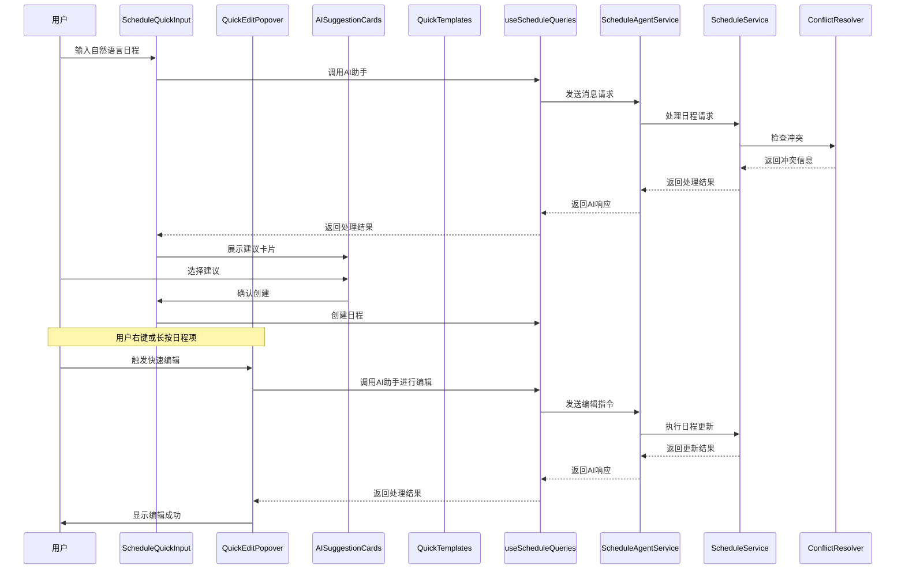

**图表来源**
- [ScheduleQuickInput.tsx](file://web/src/components/ScheduleQuickInput/ScheduleQuickInput.tsx#L96-L158)
- [QuickEditPopover.tsx](file://web/src/components/ScheduleQuickInput/QuickEditPopover.tsx#L53-L99)
- [useScheduleQueries.ts](file://web/src/hooks/useScheduleQueries.ts#L21-L21)
- [schedule_agent_service.go](file://server/router/api/v1/schedule_agent_service.go#L56-L80)

**章节来源**
- [ScheduleQuickInput.tsx](file://web/src/components/ScheduleQuickInput/ScheduleQuickInput.tsx#L31-L40)
- [QuickEditPopover.tsx](file://web/src/components/ScheduleQuickInput/QuickEditPopover.tsx#L17-L33)
- [AISuggestionCards.tsx](file://web/src/components/ScheduleQuickInput/AISuggestionCards.tsx#L202-L254)
- [QuickTemplates.tsx](file://web/src/components/ScheduleQuickInput/QuickTemplates.tsx#L183-L211)

## 架构概览

### 整体架构设计

日程快速输入组件采用前后端分离的架构设计，结合了现代前端框架的最佳实践和后端微服务架构的优势。**新增的 QuickEditPopover 组件保持了与现有 AI 助手系统的兼容性**。

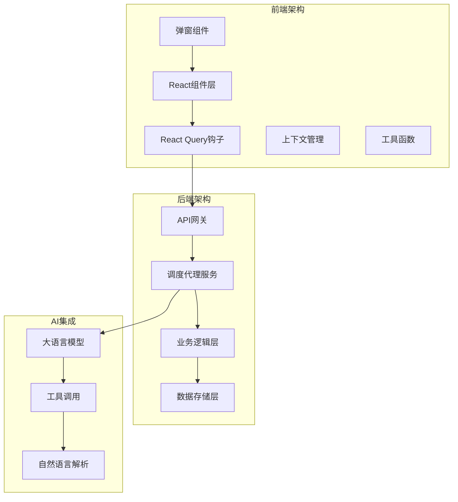

**图表来源**
- [ScheduleQuickInput.tsx](file://web/src/components/ScheduleQuickInput/ScheduleQuickInput.tsx#L1-L15)
- [QuickEditPopover.tsx](file://web/src/components/ScheduleQuickInput/QuickEditPopover.tsx#L1-L10)
- [schedule_agent_service.go](file://server/router/api/v1/schedule_agent_service.go#L43-L53)

### 数据流架构

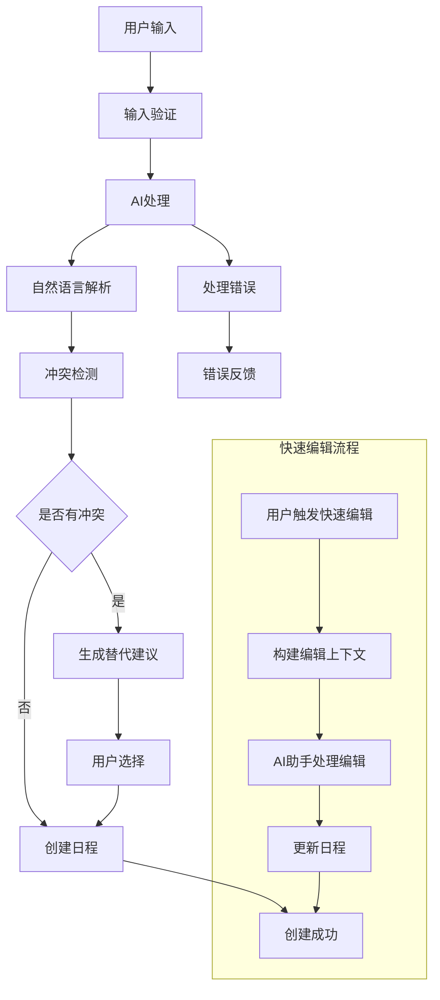

**图表来源**
- [ScheduleQuickInput.tsx](file://web/src/components/ScheduleQuickInput/ScheduleQuickInput.tsx#L96-L158)
- [QuickEditPopover.tsx](file://web/src/components/ScheduleQuickInput/QuickEditPopover.tsx#L82-L99)
- [conflict_resolver.go](file://server/service/schedule/conflict_resolver.go#L46-L97)

**章节来源**
- [ScheduleQuickInput.tsx](file://web/src/components/ScheduleQuickInput/ScheduleQuickInput.tsx#L96-L158)
- [QuickEditPopover.tsx](file://web/src/components/ScheduleQuickInput/QuickEditPopover.tsx#L82-L99)
- [conflict_resolver.go](file://server/service/schedule/conflict_resolver.go#L1-L358)

## 详细组件分析

### ScheduleQuickInput 主组件

#### 核心功能特性

主输入组件是整个日程快速输入系统的核心，提供了完整的用户交互界面和状态管理。

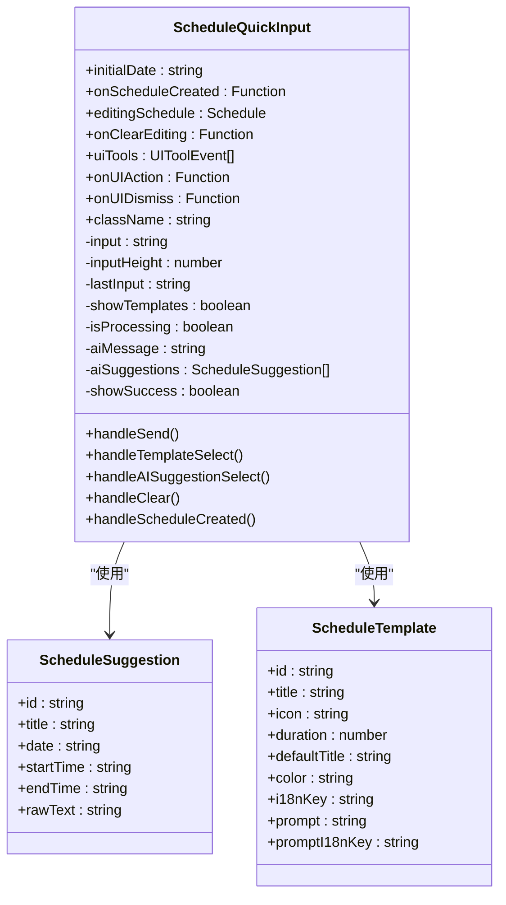

**图表来源**
- [ScheduleQuickInput.tsx](file://web/src/components/ScheduleQuickInput/ScheduleQuickInput.tsx#L17-L40)
- [AISuggestionCards.tsx](file://web/src/components/ScheduleQuickInput/AISuggestionCards.tsx#L23-L30)
- [types.ts](file://web/src/components/ScheduleQuickInput/types.ts#L1-L16)

#### 输入处理流程

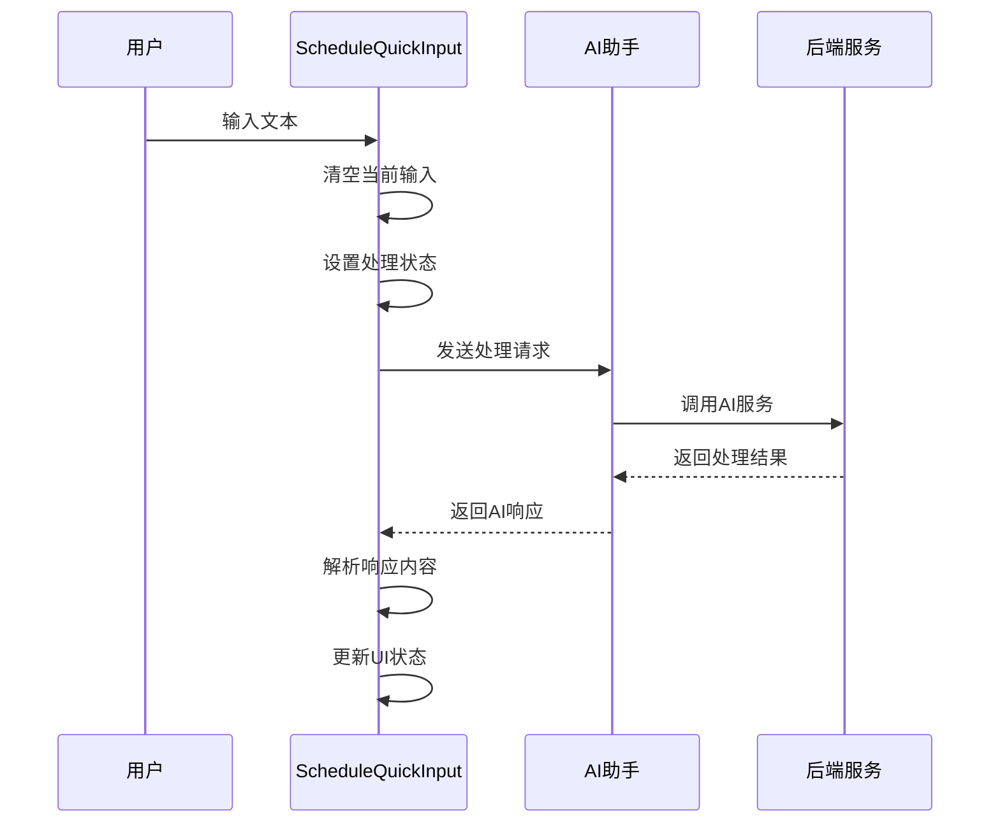

**图表来源**
- [ScheduleQuickInput.tsx](file://web/src/components/ScheduleQuickInput/ScheduleQuickInput.tsx#L96-L158)

**章节来源**
- [ScheduleQuickInput.tsx](file://web/src/components/ScheduleQuickInput/ScheduleQuickInput.tsx#L96-L158)
- [ScheduleQuickInput.tsx](file://web/src/components/ScheduleQuickInput/ScheduleQuickInput.tsx#L172-L201)

### QuickEditPopover 快速编辑弹窗

#### 新增功能特性

**新增** QuickEditPopover 组件提供了直接的内联编辑能力，允许用户快速修改日程详情而无需导航到复杂对话框。

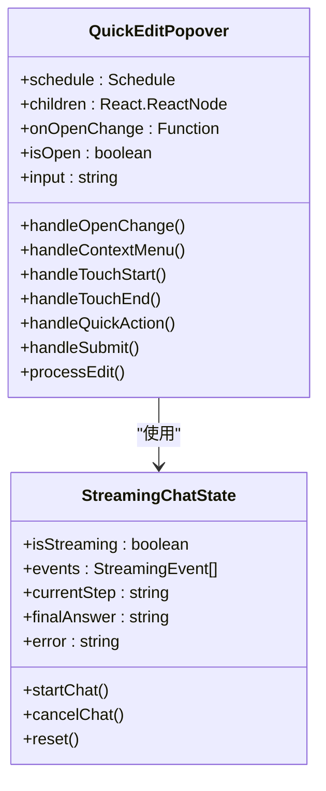

**图表来源**
- [QuickEditPopover.tsx](file://web/src/components/ScheduleQuickInput/QuickEditPopover.tsx#L11-L15)
- [useScheduleQueries.ts](file://web/src/hooks/useScheduleQueries.ts#L37-L43)

#### 快速编辑操作

QuickEditPopover 提供了三种预设的快捷编辑操作：

| 操作类型 | 快捷键 | 描述 | 示例输入 |
|----------|--------|------|----------|
| 延迟30分钟 | +30m | 将日程延迟30分钟 | "Delay this schedule by 30 minutes" |
| 改到明天 | Tomorrow | 将日程移动到明天同一时间 | "Move this schedule to tomorrow same time" |
| 取消日程 | Cancel | 取消当前日程 | "Cancel this schedule" |

#### 触发方式

用户可以通过以下方式触发快速编辑：

1. **右键菜单**：在日程项上右键点击，选择"快速编辑"
2. **长按手势**：在移动设备上长按日程项500毫秒
3. **触摸拖拽**：在触摸设备上触摸并拖动以取消长按

**章节来源**
- [QuickEditPopover.tsx](file://web/src/components/ScheduleQuickInput/QuickEditPopover.tsx#L17-L33)
- [QuickEditPopover.tsx](file://web/src/components/ScheduleQuickInput/QuickEditPopover.tsx#L53-L75)
- [QuickEditPopover.tsx](file://web/src/components/ScheduleQuickInput/QuickEditPopover.tsx#L103-L137)

### AISuggestionCards AI建议卡片

#### 建议解析算法

AI建议卡片组件实现了复杂的自然语言解析算法，能够从AI响应中提取出可创建的日程建议。

```mermaid
flowchart TD
Response[AI响应文本] --> Split[按行分割]
Split --> Pattern1[模式匹配1<br/>建议创建：明天下午3点开会]
Split --> Pattern2[模式匹配2<br/>今天15:00开会]
Pattern1 --> Extract1[提取日期、时间、标题]
Pattern2 --> Extract2[提取日期、时间、标题]
Extract1 --> Normalize[时间标准化]
Extract2 --> Normalize
Normalize --> Validate[验证有效性]
Validate --> Limit[限制数量(最多3个)]
Limit --> Cards[生成建议卡片]
```

**图表来源**
- [AISuggestionCards.tsx](file://web/src/components/ScheduleQuickInput/AISuggestionCards.tsx#L38-L95)

#### 时间解析机制

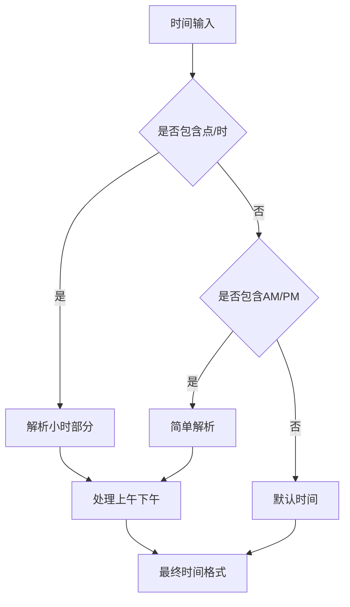

**图表来源**
- [AISuggestionCards.tsx](file://web/src/components/ScheduleQuickInput/AISuggestionCards.tsx#L141-L185)

**章节来源**
- [AISuggestionCards.tsx](file://web/src/components/ScheduleQuickInput/AISuggestionCards.tsx#L38-L95)
- [AISuggestionCards.tsx](file://web/src/components/ScheduleQuickInput/AISuggestionCards.tsx#L141-L185)

### QuickTemplates 快捷模板

#### 模板系统设计

快捷模板系统提供了预设的日程模板，用户可以通过点击模板快速创建常用类型的日程。

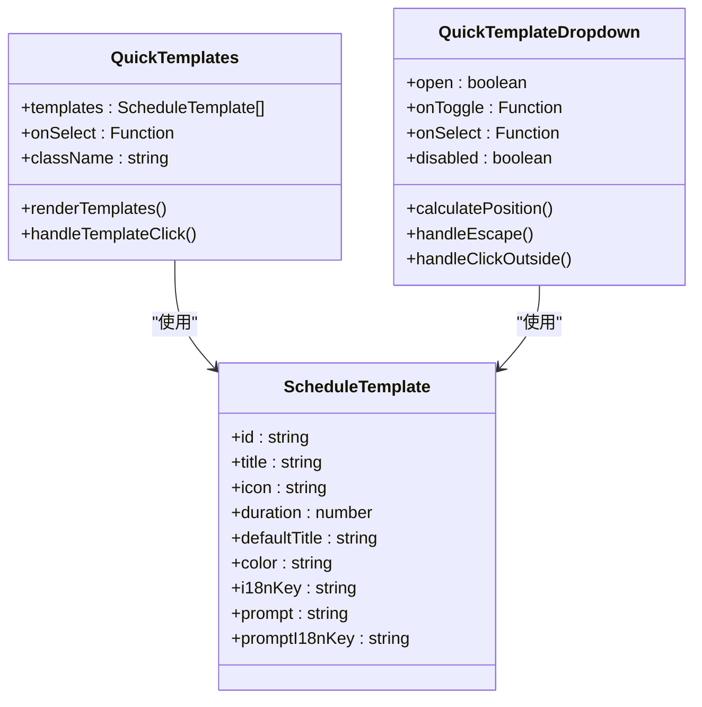

**图表来源**
- [QuickTemplates.tsx](file://web/src/components/ScheduleQuickInput/QuickTemplates.tsx#L46-L54)
- [QuickTemplates.tsx](file://web/src/components/ScheduleQuickInput/QuickTemplates.tsx#L213-L224)

#### 默认模板配置

系统内置了丰富的默认模板，涵盖了日常工作和生活的各种场景：

| 模板ID | 类型 | 持续时间 | 默认标题 | 图标 |
|--------|------|----------|----------|------|
| meeting-15 | 会议 | 15分钟 | 快速会议 | users |
| meeting-30 | 会议 | 30分钟 | 会议 | users |
| call | 电话 | 30分钟 | 电话会议 | phone |
| video-call | 视频会议 | 45分钟 | 视频会议 | video |
| lunch | 午餐 | 60分钟 | 午餐 | lunch |
| coffee | 咖啡 | 30分钟 | 咖啡聊天 | coffee |
| workout | 运动 | 60分钟 | 锻炼 | dumbbell |
| focus-60 | 专注 | 60分钟 | 专注时间 | focus |

**章节来源**
- [QuickTemplates.tsx](file://web/src/components/ScheduleQuickInput/QuickTemplates.tsx#L55-L136)
- [QuickTemplates.tsx](file://web/src/components/ScheduleQuickInput/QuickTemplates.tsx#L229-L323)

### StreamingScheduleAssistant 流式AI助手

#### 流式处理机制

流式AI助手提供了实时的AI对话体验，支持工具调用和状态跟踪。

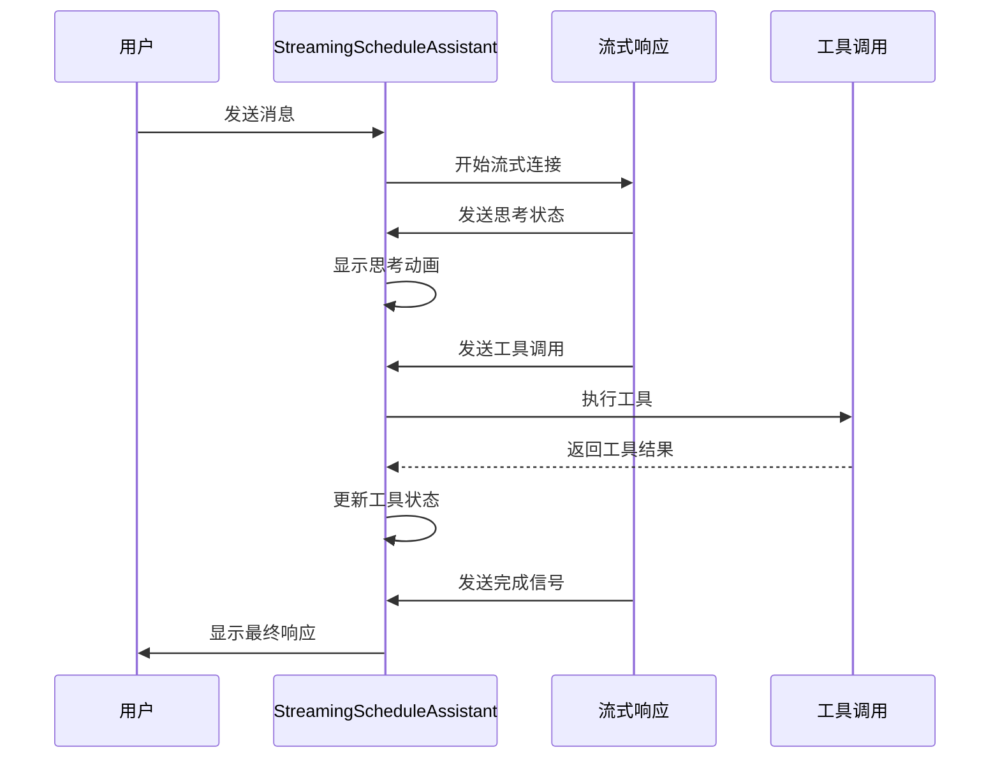

**图表来源**
- [StreamingScheduleAssistant.tsx](file://web/src/components/AIChat/StreamingScheduleAssistant.tsx#L164-L284)

#### 工具调用状态管理

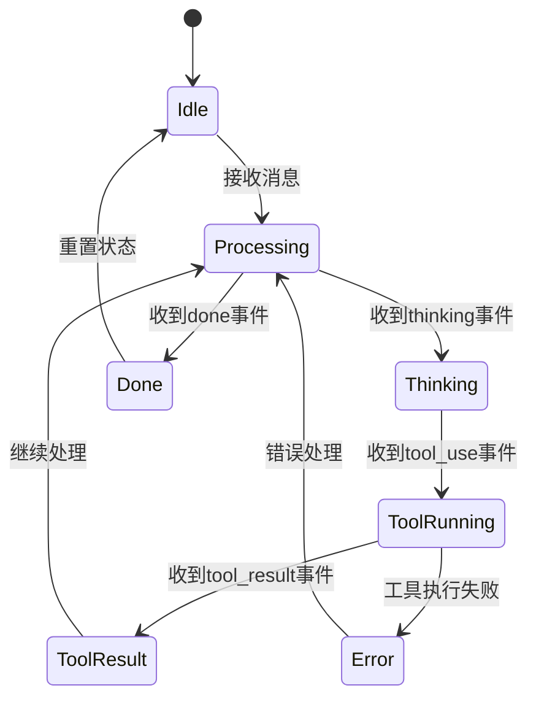

**图表来源**
- [StreamingScheduleAssistant.tsx](file://web/src/components/AIChat/StreamingScheduleAssistant.tsx#L189-L248)

**章节来源**
- [StreamingScheduleAssistant.tsx](file://web/src/components/AIChat/StreamingScheduleAssistant.tsx#L164-L284)
- [StreamingScheduleAssistant.tsx](file://web/src/components/AIChat/StreamingScheduleAssistant.tsx#L286-L298)

## 依赖关系分析

### 前端依赖关系

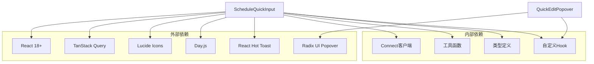

**图表来源**
- [ScheduleQuickInput.tsx](file://web/src/components/ScheduleQuickInput/ScheduleQuickInput.tsx#L1-L15)
- [QuickEditPopover.tsx](file://web/src/components/ScheduleQuickInput/QuickEditPopover.tsx#L1-L10)

### 后端服务依赖

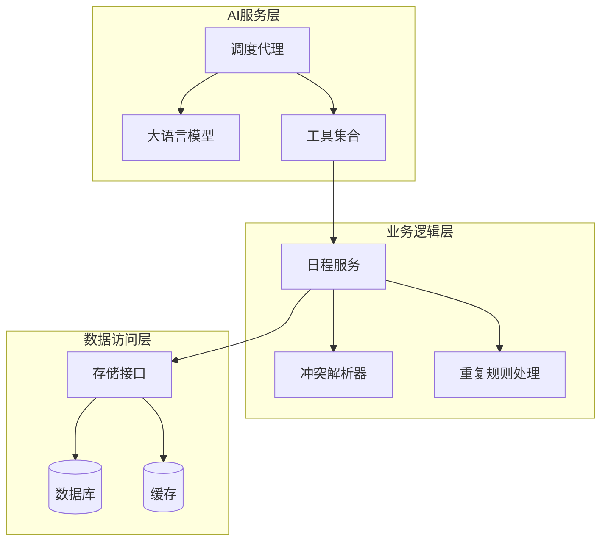

**图表来源**
- [schedule_agent_service.go](file://server/router/api/v1/schedule_agent_service.go#L43-L53)
- [service.go](file://server/service/schedule/service.go#L70-L86)

**章节来源**
- [ScheduleQuickInput.tsx](file://web/src/components/ScheduleQuickInput/ScheduleQuickInput.tsx#L1-L15)
- [QuickEditPopover.tsx](file://web/src/components/ScheduleQuickInput/QuickEditPopover.tsx#L1-L10)
- [schedule_agent_service.go](file://server/router/api/v1/schedule_agent_service.go#L43-L53)

## 性能考虑

### 前端性能优化

1. **虚拟滚动** - 对于大量日程的显示，使用虚拟滚动技术减少DOM节点数量
2. **懒加载** - AI建议组件采用动态导入，仅在需要时加载
3. **状态缓存** - 使用React Query进行智能缓存管理
4. **防抖处理** - 输入处理采用防抖机制，避免频繁的API调用
5. **** **新增** 弹窗组件优化 - QuickEditPopover 使用 Radix UI，具有更好的性能表现

### 后端性能优化

1. **索引优化** - 数据库对时间戳和用户ID建立复合索引
2. **批量查询** - 冲突检测使用批量查询减少数据库往返
3. **缓存策略** - 使用Redis缓存热点数据
4. **连接池** - 数据库连接池配置优化

### 内存管理

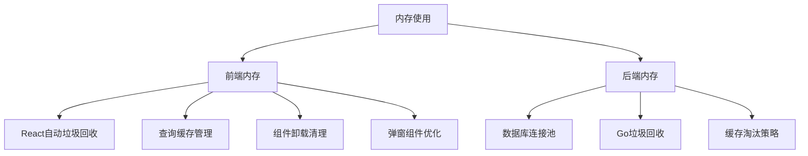

## 故障排除指南

### 常见问题及解决方案

#### AI响应解析失败

**问题描述**: AI助手返回的响应无法正确解析为日程建议

**可能原因**:
1. AI响应格式不符合预期
2. 正则表达式匹配失败
3. 本地化字符串未正确翻译

**解决方案**:
1. 检查AI响应的格式规范
2. 更新正则表达式以支持更多格式
3. 验证国际化字符串的完整性

#### 冲突检测不准确

**问题描述**: 系统无法正确检测日程冲突

**可能原因**:
1. 时间范围计算错误
2. 时区处理不当
3. 重复日程规则解析失败

**解决方案**:
1. 验证时间戳转换的准确性
2. 检查时区设置和转换逻辑
3. 测试重复日程规则的各种情况

#### 模板选择无响应

**问题描述**: 点击模板按钮没有反应

**可能原因**:
1. 事件处理器绑定失败
2. 模板数据结构错误
3. 权限检查导致的禁用状态

**解决方案**:
1. 检查事件监听器的绑定
2. 验证模板数据的完整性
3. 确认用户权限状态

#### 快速编辑功能异常

**问题描述**: QuickEditPopover 无法正常打开或编辑日程

**可能原因**:
1. 弹窗组件初始化失败
2. AI助手调用超时
3. 编辑指令格式不正确

**解决方案**:
1. 检查 Radix UI Popover 组件的正确性
2. 验证 useScheduleAgentStreamingChat 钩子的状态
3. 确认编辑指令符合 AI 助手的预期格式

**章节来源**
- [AISuggestionCards.tsx](file://web/src/components/ScheduleQuickInput/AISuggestionCards.tsx#L38-L95)
- [conflict_resolver.go](file://server/service/schedule/conflict_resolver.go#L46-L97)
- [QuickTemplates.tsx](file://web/src/components/ScheduleQuickInput/QuickTemplates.tsx#L183-L211)
- [QuickEditPopover.tsx](file://web/src/components/ScheduleQuickInput/QuickEditPopover.tsx#L26-L33)

## 结论

日程快速输入组件是一个高度集成的智能系统，它将自然语言处理、AI助手、模板化输入和冲突检测等功能有机结合，为用户提供了流畅而强大的日程管理体验。

**重要更新**：新增的 QuickEditPopover 组件显著简化了日程编辑流程，通过右键菜单和长按手势提供了直接的内联编辑能力。这一变化将复杂的 AI 功能转变为更直观的直接编辑模式，提升了用户体验和效率。

### 主要优势

1. **智能化程度高**: 通过AI助手实现自然语言日程创建
2. **用户体验优秀**: 简洁直观的界面设计和流畅的交互体验
3. **功能完整性**: 覆盖从输入到创建的完整日程管理流程
4. **扩展性强**: 模块化设计便于功能扩展和维护
5. **** **新增** **快速编辑能力**: 直接内联编辑大幅提升了日常操作效率

### 技术亮点

1. **前后端分离架构**: 清晰的职责划分和良好的可维护性
2. **实时流式处理**: 提供即时的AI响应和状态反馈
3. **智能冲突检测**: 基于算法的冲突预防和时间槽推荐
4. **国际化支持**: 完善的多语言支持和本地化处理
5. **** **新增** **弹窗组件优化**: 基于 Radix UI 的高性能弹窗实现

### 未来发展方向

1. **增强AI能力**: 集成更先进的自然语言理解和生成模型
2. **移动端优化**: 针对移动设备的界面和交互优化
3. **离线支持**: 实现部分功能的离线可用性
4. **第三方集成**: 支持与其他日历和任务管理系统的集成
5. **** **新增** **编辑功能扩展**: 可能增加更多预设的快捷编辑操作

该组件为现代工作流程提供了强有力的技术支撑，通过持续的优化和改进，将进一步提升用户的生产力和工作效率。