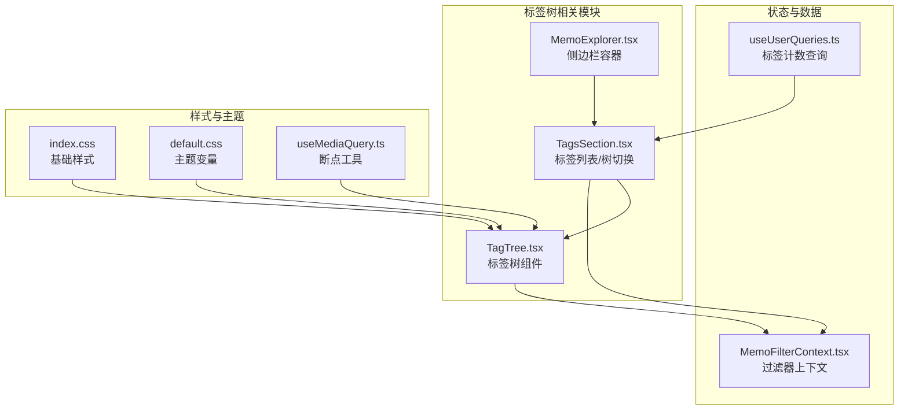
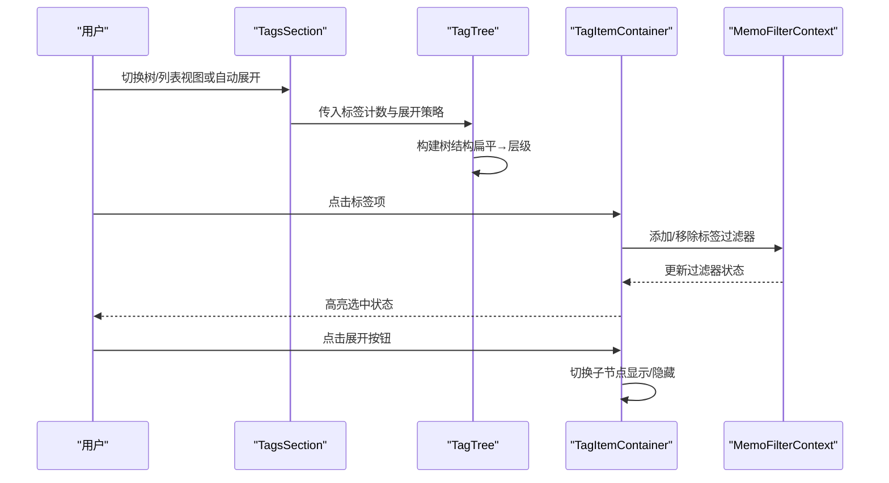
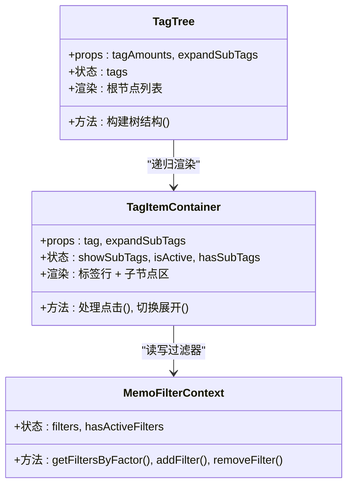
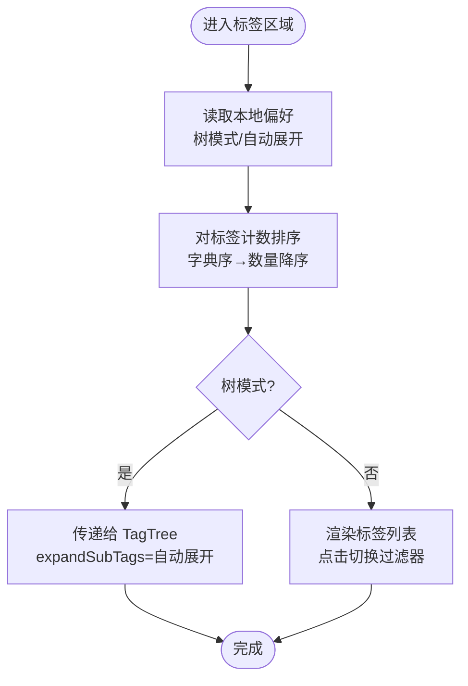
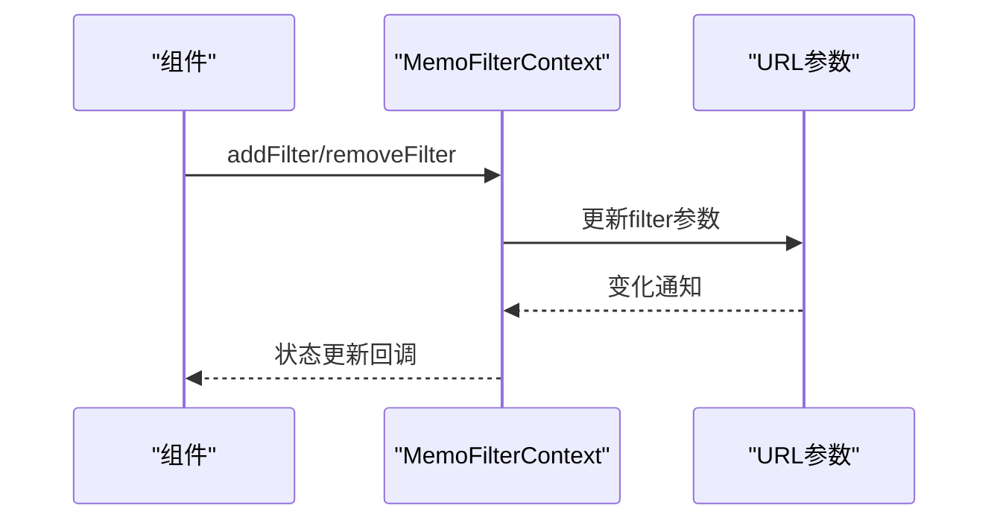
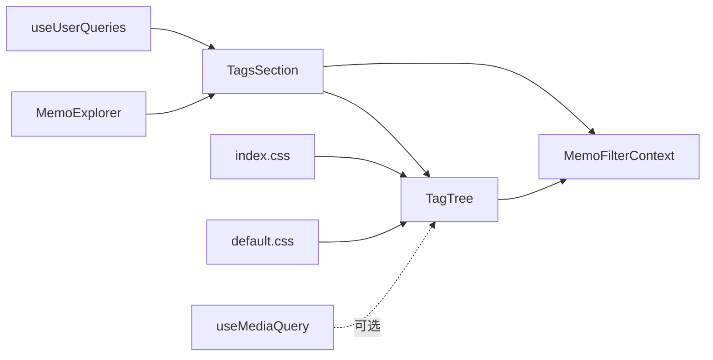

# 标签树组件

<cite>
**本文档引用的文件**
- [TagTree.tsx](file://web/src/components/TagTree.tsx)
- [TagsSection.tsx](file://web/src/components/MemoExplorer/TagsSection.tsx)
- [MemoExplorer.tsx](file://web/src/components/MemoExplorer/MemoExplorer.tsx)
- [MemoFilterContext.tsx](file://web/src/contexts/MemoFilterContext.tsx)
- [useUserQueries.ts](file://web/src/hooks/useUserQueries.ts)
- [index.css](file://web/src/index.css)
- [default.css](file://web/src/themes/default.css)
- [useMediaQuery.ts](file://web/src/hooks/useMediaQuery.ts)
</cite>

## 目录
1. [简介](#简介)
2. [项目结构](#项目结构)
3. [核心组件](#核心组件)
4. [架构总览](#架构总览)
5. [详细组件分析](#详细组件分析)
6. [依赖关系分析](#依赖关系分析)
7. [性能考虑](#性能考虑)
8. [故障排除指南](#故障排除指南)
9. [结论](#结论)
10. [附录](#附录)

## 简介
本文件系统性地阐述标签树组件的实现与使用，覆盖以下关键能力：
- 层级标签展示：基于斜杠分隔的层级路径构建树形结构
- 展开/折叠：支持手动切换与自动展开（由父容器控制）
- 标签选择：通过过滤器上下文进行标签筛选，支持高亮与互斥行为
- 父子关系与递归渲染：通过嵌套容器实现深度递归渲染
- 状态管理：基于本地存储的视图模式与自动展开偏好，结合全局过滤器上下文
- 拖拽、批量选择与标签搜索：当前实现未包含这些能力，后续可扩展
- 配置选项、样式定制与响应式设计：通过属性与主题变量实现灵活定制
- 数据加载、缓存与同步：通过查询钩子与URL同步机制实现

## 项目结构
标签树组件位于前端 Web 层，与过滤器上下文、用户查询钩子、布局容器协同工作。

**图表来源**
- [TagTree.tsx](file://web/src/components/TagTree.tsx#L1-L161)
- [TagsSection.tsx](file://web/src/components/MemoExplorer/TagsSection.tsx#L1-L101)
- [MemoExplorer.tsx](file://web/src/components/MemoExplorer/MemoExplorer.tsx#L1-L88)
- [MemoFilterContext.tsx](file://web/src/contexts/MemoFilterContext.tsx#L1-L157)
- [useUserQueries.ts](file://web/src/hooks/useUserQueries.ts#L88-L103)
- [index.css](file://web/src/index.css#L1-L415)
- [default.css](file://web/src/themes/default.css#L1-L124)
- [useMediaQuery.ts](file://web/src/hooks/useMediaQuery.ts#L1-L34)

**章节来源**
- [TagTree.tsx](file://web/src/components/TagTree.tsx#L1-L161)
- [TagsSection.tsx](file://web/src/components/MemoExplorer/TagsSection.tsx#L1-L101)
- [MemoExplorer.tsx](file://web/src/components/MemoExplorer/MemoExplorer.tsx#L1-L88)
- [MemoFilterContext.tsx](file://web/src/contexts/MemoFilterContext.tsx#L1-L157)
- [useUserQueries.ts](file://web/src/hooks/useUserQueries.ts#L88-L103)
- [index.css](file://web/src/index.css#L1-L415)
- [default.css](file://web/src/themes/default.css#L1-L124)
- [useMediaQuery.ts](file://web/src/hooks/useMediaQuery.ts#L1-L34)

## 核心组件
- 标签树组件（TagTree）：接收扁平的标签计数数组，内部构建树结构并递归渲染；支持展开/折叠与标签选择高亮。
- 标签区域（TagsSection）：提供树/列表两种视图切换、自动展开开关，并将标签计数传递给 TagTree。
- 过滤器上下文（MemoFilterContext）：统一管理过滤器集合，支持添加、移除、按因子筛选与URL同步。
- 用户查询钩子（useTagCounts）：从服务端获取标签计数，供 TagsSection 使用。
- 布局容器（MemoExplorer）：承载搜索、统计、快捷方式与标签区域。

**章节来源**
- [TagTree.tsx](file://web/src/components/TagTree.tsx#L18-L81)
- [TagsSection.tsx](file://web/src/components/MemoExplorer/TagsSection.tsx#L15-L64)
- [MemoFilterContext.tsx](file://web/src/contexts/MemoFilterContext.tsx#L57-L144)
- [useUserQueries.ts](file://web/src/hooks/useUserQueries.ts#L88-L103)
- [MemoExplorer.tsx](file://web/src/components/MemoExplorer/MemoExplorer.tsx#L60-L84)

## 架构总览
标签树组件的运行时交互流程如下：

**图表来源**
- [TagsSection.tsx](file://web/src/components/MemoExplorer/TagsSection.tsx#L18-L64)
- [TagTree.tsx](file://web/src/components/TagTree.tsx#L18-L81)
- [TagTree.tsx](file://web/src/components/TagTree.tsx#L88-L158)
- [MemoFilterContext.tsx](file://web/src/contexts/MemoFilterContext.tsx#L95-L122)

## 详细组件分析

### 标签树组件（TagTree）
- 数据结构
  - 内部使用树节点对象，包含键名、文本、数量与子节点数组。
  - 输入为二维元组数组：[标签路径, 数量]。
- 树构建算法
  - 对输入进行排序后逐条插入，按层级拆分路径，构建父子关系。
  - 当某路径在输入中出现多次时，该路径节点的数量字段取对应值。
- 渲染与交互
  - 顶层容器遍历根子节点进行渲染。
  - 子项容器负责：
    - 计算是否处于激活状态（与过滤器匹配）
    - 是否有子节点
    - 展开/折叠状态（受父容器传入的自动展开策略影响）
    - 点击标签项：移除其他标签过滤器后添加当前标签过滤器
    - 点击展开按钮：阻止事件冒泡，切换子节点显示
- 样式与主题
  - 使用主题变量与Tailwind类实现颜色、间距与边框风格。
  - 选中态以主色高亮，非选中态以次级文字色显示。
  - 折叠指示器旋转动画体现状态变化。

**图表来源**
- [TagTree.tsx](file://web/src/components/TagTree.tsx#L6-L16)
- [TagTree.tsx](file://web/src/components/TagTree.tsx#L83-L158)
- [MemoFilterContext.tsx](file://web/src/contexts/MemoFilterContext.tsx#L41-L53)

**章节来源**
- [TagTree.tsx](file://web/src/components/TagTree.tsx#L18-L81)
- [TagTree.tsx](file://web/src/components/TagTree.tsx#L88-L158)

### 标签区域（TagsSection）
- 视图切换
  - 通过本地存储记录“树模式”和“自动展开”偏好。
  - 提供弹出菜单控制开关，树模式下启用自动展开开关。
- 标签计数处理
  - 将传入的计数字典转换为二维数组并排序：先按字典序，再按数量降序。
- 列表与树模式
  - 列表模式：直接渲染标签项，支持点击切换过滤器。
  - 树模式：将标签计数与自动展开策略传递给 TagTree。

**图表来源**
- [TagsSection.tsx](file://web/src/components/MemoExplorer/TagsSection.tsx#L18-L64)

**章节来源**
- [TagsSection.tsx](file://web/src/components/MemoExplorer/TagsSection.tsx#L15-L64)

### 过滤器上下文（MemoFilterContext）
- 功能
  - 维护过滤器集合，支持按因子筛选、增删与清空。
  - 同步URL参数与内存状态，避免重复与不一致。
- URL同步机制
  - 初始化：从URL解析过滤器字符串。
  - 写入：当状态变更时，序列化并更新URL，同时记录最后同步值。
  - 读取：监听URL变化，必要时回写内存状态。
- 与组件协作
  - TagTree 与 TagsSection 通过上下文读取/修改过滤器，实现标签选择与高亮联动。

**图表来源**
- [MemoFilterContext.tsx](file://web/src/contexts/MemoFilterContext.tsx#L57-L93)
- [MemoFilterContext.tsx](file://web/src/contexts/MemoFilterContext.tsx#L95-L122)

**章节来源**
- [MemoFilterContext.tsx](file://web/src/contexts/MemoFilterContext.tsx#L57-L144)

### 数据加载、缓存与同步
- 标签计数来源
  - 通过查询钩子获取当前用户或全站标签计数，作为 TagTree 的输入数据。
- 缓存策略
  - 查询钩子返回的响应由上层缓存框架管理，默认缓存策略适用于统计类数据。
- URL同步
  - 过滤器上下文将过滤状态持久化到URL，确保刷新后状态恢复。

**章节来源**
- [useUserQueries.ts](file://web/src/hooks/useUserQueries.ts#L88-L103)
- [MemoFilterContext.tsx](file://web/src/contexts/MemoFilterContext.tsx#L62-L93)

### 样式定制与响应式设计
- 主题变量
  - 通过CSS变量定义背景、前景、边框、阴影等，TagTree 使用主题变量实现颜色一致性。
- 基础样式
  - 全局样式文件定义了指针光标、焦点可见性、Markdown内容排版等通用规则。
- 响应式断点
  - 提供媒体查询工具，可在需要时用于自适应布局（当前标签树组件未直接使用）。

**章节来源**
- [default.css](file://web/src/themes/default.css#L1-L124)
- [index.css](file://web/src/index.css#L1-L415)
- [useMediaQuery.ts](file://web/src/hooks/useMediaQuery.ts#L1-L34)

### 扩展能力（当前未实现）
- 拖拽操作：未在现有代码中发现拖拽实现，可考虑引入拖拽库并在容器中实现拖放逻辑。
- 批量选择：未实现多选与批量过滤，可通过在上下文中增加批量操作接口扩展。
- 标签搜索：未实现搜索框与实时过滤，可在 TagsSection 中加入输入框并通过上下文更新过滤器。

## 依赖关系分析
- 组件耦合
  - TagTree 依赖 MemoFilterContext 进行状态读写。
  - TagsSection 依赖本地存储与 MemoFilterContext，向 TagTree 传递数据与策略。
  - MemoExplorer 作为容器，协调各功能模块。
- 外部依赖
  - 样式依赖 Tailwind 与主题变量。
  - 媒体查询工具用于断点判断（可选）。

**图表来源**
- [TagTree.tsx](file://web/src/components/TagTree.tsx#L1-L161)
- [TagsSection.tsx](file://web/src/components/MemoExplorer/TagsSection.tsx#L1-L101)
- [MemoExplorer.tsx](file://web/src/components/MemoExplorer/MemoExplorer.tsx#L1-L88)
- [MemoFilterContext.tsx](file://web/src/contexts/MemoFilterContext.tsx#L1-L157)
- [useUserQueries.ts](file://web/src/hooks/useUserQueries.ts#L88-L103)
- [index.css](file://web/src/index.css#L1-L415)
- [default.css](file://web/src/themes/default.css#L1-L124)
- [useMediaQuery.ts](file://web/src/hooks/useMediaQuery.ts#L1-L34)

**章节来源**
- [TagTree.tsx](file://web/src/components/TagTree.tsx#L1-L161)
- [TagsSection.tsx](file://web/src/components/MemoExplorer/TagsSection.tsx#L1-L101)
- [MemoExplorer.tsx](file://web/src/components/MemoExplorer/MemoExplorer.tsx#L1-L88)
- [MemoFilterContext.tsx](file://web/src/contexts/MemoFilterContext.tsx#L1-L157)
- [useUserQueries.ts](file://web/src/hooks/useUserQueries.ts#L88-L103)
- [index.css](file://web/src/index.css#L1-L415)
- [default.css](file://web/src/themes/default.css#L1-L124)
- [useMediaQuery.ts](file://web/src/hooks/useMediaQuery.ts#L1-L34)

## 性能考虑
- 树构建复杂度
  - 输入排序 O(n log n)，逐条插入 O(n·d)，其中 d 为平均层级深度。
  - 若标签层级较深或数量较大，建议在上游进行预聚合与排序。
- 渲染优化
  - 使用 React 的 key 策略避免不必要的重渲染（已按路径+索引组合）。
  - 自动展开策略仅在父容器开启时生效，减少初始渲染压力。
- 状态同步
  - 过滤器上下文通过引用记录上次同步值，避免循环更新与URL抖动。

[本节为通用指导，无需列出具体文件来源]

## 故障排除指南
- 标签未正确高亮
  - 检查过滤器上下文中的标签过滤器是否正确添加/移除。
  - 确认标签路径与过滤器值完全一致（大小写、空白字符）。
- 展开/折叠无效
  - 确认父容器传入的自动展开策略与当前视图一致。
  - 检查事件冒泡是否被正确阻止（展开按钮点击）。
- 树结构异常
  - 确保输入的标签路径以斜杠分隔且顺序正确。
  - 检查是否存在重复路径导致节点覆盖。
- URL状态不同步
  - 检查过滤器序列化/反序列化逻辑与URL参数更新时机。

**章节来源**
- [MemoFilterContext.tsx](file://web/src/contexts/MemoFilterContext.tsx#L62-L93)
- [TagTree.tsx](file://web/src/components/TagTree.tsx#L88-L158)

## 结论
标签树组件通过清晰的数据结构与递归渲染实现了层级标签的高效展示与交互。配合过滤器上下文与URL同步机制，实现了稳定的筛选体验。当前版本未包含拖拽、批量选择与搜索功能，但具备良好的扩展空间。通过主题变量与基础样式体系，组件在视觉与交互上保持一致性和可定制性。

[本节为总结性内容，无需列出具体文件来源]

## 附录

### 组件配置选项与用法
- TagTree
  - 输入：标签计数数组（二维元组），展开策略布尔值
  - 输出：树形标签列表，支持点击选择与展开/折叠
- TagsSection
  - 输入：标签计数字典
  - 行为：提供树/列表视图切换与自动展开开关，调用 TagTree 或渲染列表
- MemoFilterContext
  - 提供过滤器集合的增删改查与URL同步

**章节来源**
- [TagTree.tsx](file://web/src/components/TagTree.tsx#L13-L16)
- [TagsSection.tsx](file://web/src/components/MemoExplorer/TagsSection.tsx#L10-L13)
- [MemoFilterContext.tsx](file://web/src/contexts/MemoFilterContext.tsx#L41-L53)