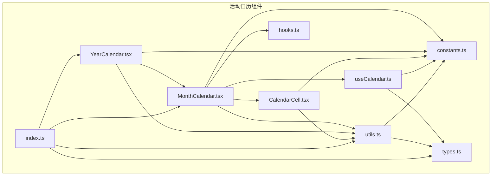
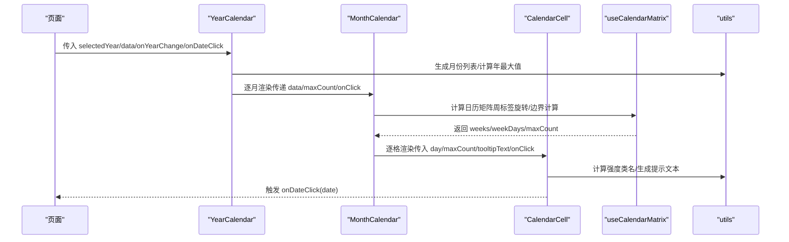
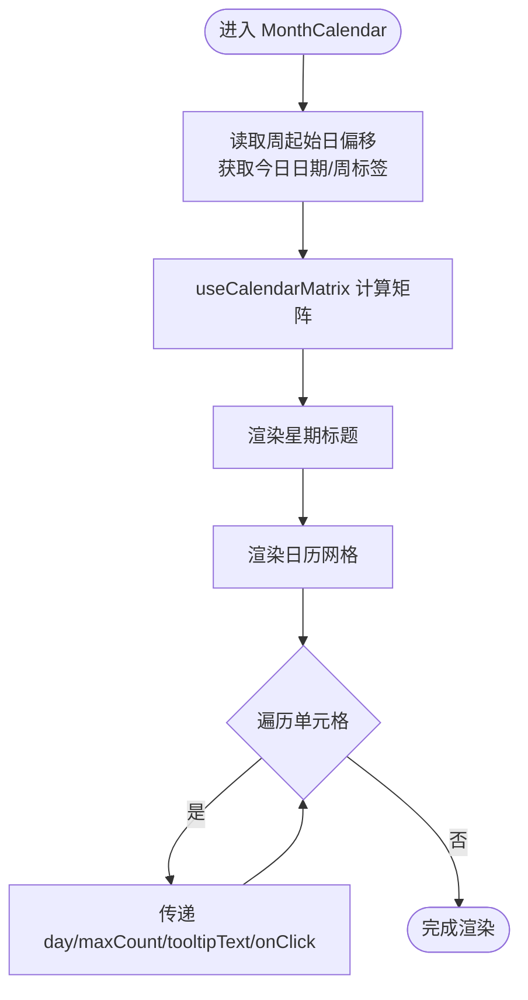
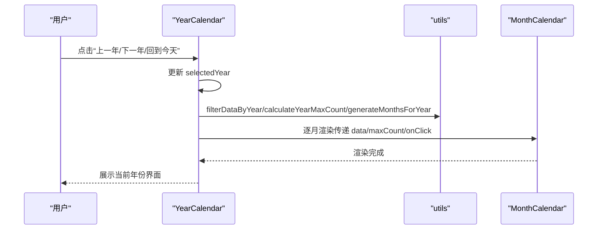
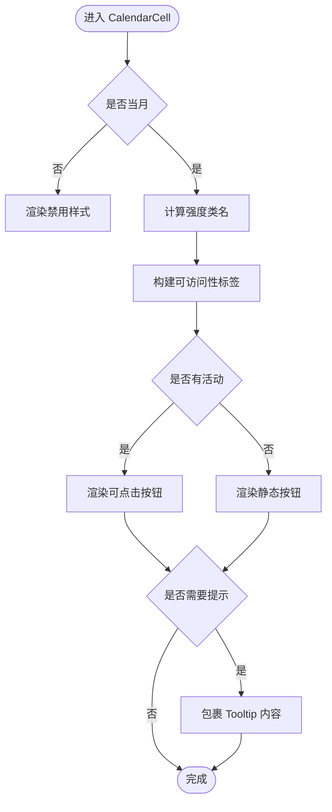
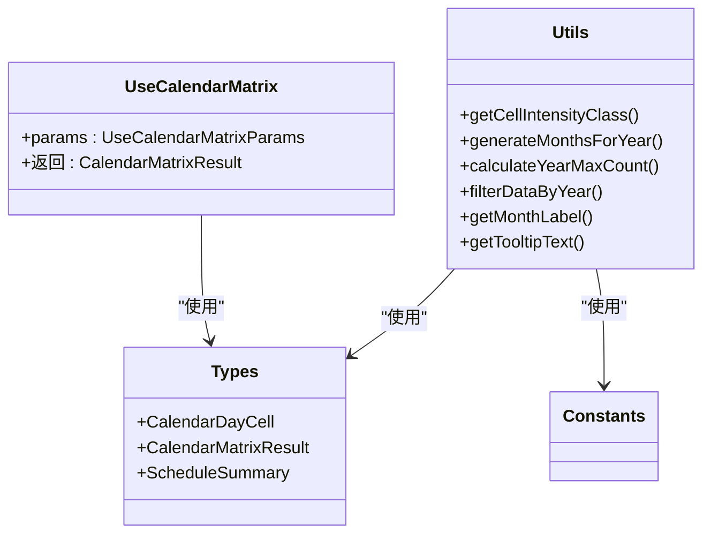
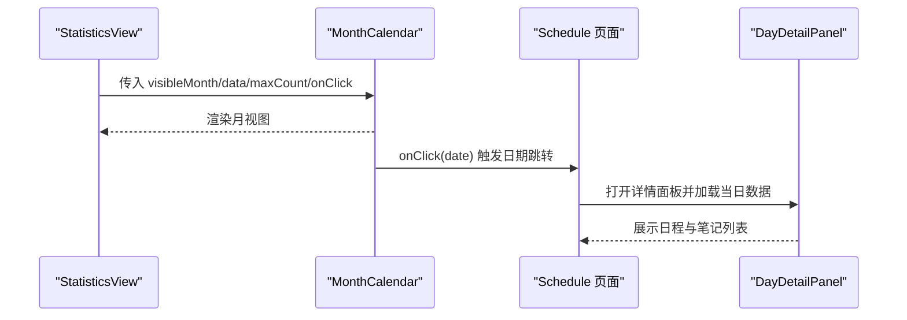
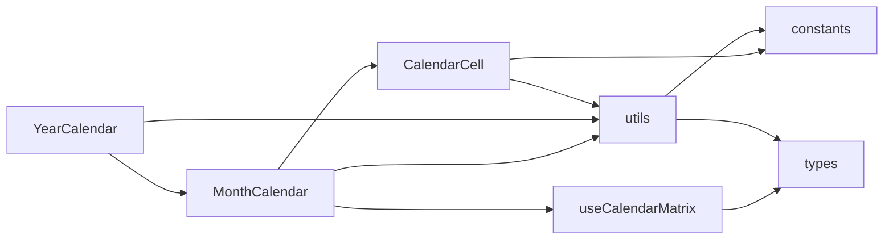

# 活动日历组件

<cite>
**本文引用的文件**
- [web/src/components/ActivityCalendar/MonthCalendar.tsx](file://web/src/components/ActivityCalendar/MonthCalendar.tsx)
- [web/src/components/ActivityCalendar/YearCalendar.tsx](file://web/src/components/ActivityCalendar/YearCalendar.tsx)
- [web/src/components/ActivityCalendar/CalendarCell.tsx](file://web/src/components/ActivityCalendar/CalendarCell.tsx)
- [web/src/components/ActivityCalendar/types.ts](file://web/src/components/ActivityCalendar/types.ts)
- [web/src/components/ActivityCalendar/utils.ts](file://web/src/components/ActivityCalendar/utils.ts)
- [web/src/components/ActivityCalendar/constants.ts](file://web/src/components/ActivityCalendar/constants.ts)
- [web/src/components/ActivityCalendar/hooks.ts](file://web/src/components/ActivityCalendar/hooks.ts)
- [web/src/components/ActivityCalendar/useCalendar.ts](file://web/src/components/ActivityCalendar/useCalendar.ts)
- [web/src/components/ActivityCalendar/index.ts](file://web/src/components/ActivityCalendar/index.ts)
- [web/src/pages/Schedule.tsx](file://web/src/pages/Schedule.tsx)
- [web/src/components/StatisticsView/StatisticsView.tsx](file://web/src/components/StatisticsView/StatisticsView.tsx)
- [web/src/components/ActivityCalendar/DayDetailPanel.tsx](file://web/src/components/ActivityCalendar/DayDetailPanel.tsx)
</cite>

## 目录
1. [简介](#简介)
2. [项目结构](#项目结构)
3. [核心组件](#核心组件)
4. [架构总览](#架构总览)
5. [详细组件分析](#详细组件分析)
6. [依赖关系分析](#依赖关系分析)
7. [性能考量](#性能考量)
8. [故障排查指南](#故障排查指南)
9. [结论](#结论)
10. [附录](#附录)

## 简介
本文件系统性地梳理了活动日历组件的实现与使用方式，覆盖月视图、年视图与日历单元格组件，解释日期选择、活动显示、视图切换与用户交互机制，并给出状态管理、事件处理、数据绑定、配置项、样式定制与国际化支持的实践建议。同时提供性能优化技巧与最佳实践，帮助在复杂场景下稳定高效地运行日历组件。

## 项目结构
活动日历组件位于前端工程的组件目录中，采用按功能分层的组织方式：视图组件（月/年）、单元格组件、工具函数、常量定义、自定义 Hook 与数据矩阵生成逻辑。对外通过统一入口导出，便于上层页面按需引入。

图表来源
- [web/src/components/ActivityCalendar/MonthCalendar.tsx](file://web/src/components/ActivityCalendar/MonthCalendar.tsx#L1-L69)
- [web/src/components/ActivityCalendar/YearCalendar.tsx](file://web/src/components/ActivityCalendar/YearCalendar.tsx#L1-L94)
- [web/src/components/ActivityCalendar/CalendarCell.tsx](file://web/src/components/ActivityCalendar/CalendarCell.tsx#L1-L98)
- [web/src/components/ActivityCalendar/utils.ts](file://web/src/components/ActivityCalendar/utils.ts#L1-L73)
- [web/src/components/ActivityCalendar/constants.ts](file://web/src/components/ActivityCalendar/constants.ts#L1-L36)
- [web/src/components/ActivityCalendar/hooks.ts](file://web/src/components/ActivityCalendar/hooks.ts#L1-L13)
- [web/src/components/ActivityCalendar/useCalendar.ts](file://web/src/components/ActivityCalendar/useCalendar.ts#L1-L102)
- [web/src/components/ActivityCalendar/types.ts](file://web/src/components/ActivityCalendar/types.ts#L1-L53)
- [web/src/components/ActivityCalendar/index.ts](file://web/src/components/ActivityCalendar/index.ts#L1-L5)

章节来源
- [web/src/components/ActivityCalendar/index.ts](file://web/src/components/ActivityCalendar/index.ts#L1-L5)

## 核心组件
- 月视图组件：负责渲染指定月份的日历网格，支持小尺寸与默认尺寸两种模式，提供周起始日偏移、今日高亮、选中态等能力。
- 年视图组件：渲染一年12个月的小型月视图，支持年份导航与“回到今天”快捷操作。
- 日历单元格组件：封装单个日期单元格的渲染与交互，含气泡提示、日程数徽标、可访问性标签等。
- 数据矩阵与工具：通过自定义 Hook 生成日历矩阵，计算强度等级、过滤年数据、生成月份列表等。
- 类型与常量：统一的数据结构与样式阈值、尺寸配置，确保组件间一致性。

章节来源
- [web/src/components/ActivityCalendar/MonthCalendar.tsx](file://web/src/components/ActivityCalendar/MonthCalendar.tsx#L12-L69)
- [web/src/components/ActivityCalendar/YearCalendar.tsx](file://web/src/components/ActivityCalendar/YearCalendar.tsx#L17-L94)
- [web/src/components/ActivityCalendar/CalendarCell.tsx](file://web/src/components/ActivityCalendar/CalendarCell.tsx#L18-L98)
- [web/src/components/ActivityCalendar/useCalendar.ts](file://web/src/components/ActivityCalendar/useCalendar.ts#L57-L101)
- [web/src/components/ActivityCalendar/utils.ts](file://web/src/components/ActivityCalendar/utils.ts#L13-L73)
- [web/src/components/ActivityCalendar/types.ts](file://web/src/components/ActivityCalendar/types.ts#L14-L53)
- [web/src/components/ActivityCalendar/constants.ts](file://web/src/components/ActivityCalendar/constants.ts#L9-L36)

## 架构总览
日历组件以“视图组件 + 单元格 + 工具函数 + 自定义 Hook”的分层架构实现，数据从上层页面传入，经由 Hook 计算后注入到视图与单元格中进行渲染。组件通过国际化函数与实例设置（如周起始日）实现本地化与个性化。

图表来源
- [web/src/components/ActivityCalendar/YearCalendar.tsx](file://web/src/components/ActivityCalendar/YearCalendar.tsx#L17-L94)
- [web/src/components/ActivityCalendar/MonthCalendar.tsx](file://web/src/components/ActivityCalendar/MonthCalendar.tsx#L22-L30)
- [web/src/components/ActivityCalendar/useCalendar.ts](file://web/src/components/ActivityCalendar/useCalendar.ts#L57-L101)
- [web/src/components/ActivityCalendar/utils.ts](file://web/src/components/ActivityCalendar/utils.ts#L13-L73)
- [web/src/components/ActivityCalendar/CalendarCell.tsx](file://web/src/components/ActivityCalendar/CalendarCell.tsx#L47-L94)

## 详细组件分析

### 月视图组件（MonthCalendar）
职责与特性
- 接收月份字符串、活动计数映射、最大计数值、点击回调、尺寸与类名等参数。
- 从实例上下文中读取周起始日偏移，结合自定义 Hook 生成日历矩阵。
- 渲染星期标题行与日历网格，每个单元格由日历单元格组件承载。
- 支持小尺寸模式，用于年视图内嵌展示。

交互与状态
- 通过 onClick 回调向上传递被点击日期；仅当当日有活动时才具备交互性。
- 今日与选中态通过样式与可访问性属性标识。

图表来源
- [web/src/components/ActivityCalendar/MonthCalendar.tsx](file://web/src/components/ActivityCalendar/MonthCalendar.tsx#L12-L69)
- [web/src/components/ActivityCalendar/useCalendar.ts](file://web/src/components/ActivityCalendar/useCalendar.ts#L57-L101)
- [web/src/components/ActivityCalendar/hooks.ts](file://web/src/components/ActivityCalendar/hooks.ts#L5-L12)

章节来源
- [web/src/components/ActivityCalendar/MonthCalendar.tsx](file://web/src/components/ActivityCalendar/MonthCalendar.tsx#L12-L69)

### 年视图组件（YearCalendar）
职责与特性
- 接收选中年份、活动数据、年份变更与日期点击回调。
- 过滤当年数据、生成12个月份、计算年最大计数，驱动12个小型月视图渲染。
- 提供“上一年/下一年/回到今天”导航按钮，限制可跳转范围。

交互与状态
- 年份变更通过回调向上同步；日期点击回调透传至月视图内的单元格。

图表来源
- [web/src/components/ActivityCalendar/YearCalendar.tsx](file://web/src/components/ActivityCalendar/YearCalendar.tsx#L17-L94)
- [web/src/components/ActivityCalendar/utils.ts](file://web/src/components/ActivityCalendar/utils.ts#L25-L56)

章节来源
- [web/src/components/ActivityCalendar/YearCalendar.tsx](file://web/src/components/ActivityCalendar/YearCalendar.tsx#L17-L94)

### 日历单元格组件（CalendarCell）
职责与特性
- 接收单日数据、最大计数、提示文本、点击回调与尺寸等参数。
- 根据是否为当月、是否今日、是否选中决定样式与交互行为。
- 当日存在活动或日程时，启用点击交互与气泡提示；提示文本包含活动数量与日程数量信息。
- 小圆点徽标用于突出当日日程数量。

交互与可访问性
- 使用 aria-label 包含日期、活动数量、日程数量与选中状态，提升可访问性。
- 仅在有活动时可点击，避免无效交互。

图表来源
- [web/src/components/ActivityCalendar/CalendarCell.tsx](file://web/src/components/ActivityCalendar/CalendarCell.tsx#L18-L98)
- [web/src/components/ActivityCalendar/utils.ts](file://web/src/components/ActivityCalendar/utils.ts#L13-L23)

章节来源
- [web/src/components/ActivityCalendar/CalendarCell.tsx](file://web/src/components/ActivityCalendar/CalendarCell.tsx#L18-L98)

### 数据矩阵与工具（useCalendarMatrix、utils）
- useCalendarMatrix：根据给定月份与周起始日，计算日历网格的起止边界、生成完整的周数组与日单元格集合，同时计算最大计数。
- utils：提供强度等级计算、年数据过滤、月份列表生成、月份标签格式化、提示文本生成等工具方法。

图表来源
- [web/src/components/ActivityCalendar/useCalendar.ts](file://web/src/components/ActivityCalendar/useCalendar.ts#L57-L101)
- [web/src/components/ActivityCalendar/utils.ts](file://web/src/components/ActivityCalendar/utils.ts#L13-L73)
- [web/src/components/ActivityCalendar/types.ts](file://web/src/components/ActivityCalendar/types.ts#L14-L53)
- [web/src/components/ActivityCalendar/constants.ts](file://web/src/components/ActivityCalendar/constants.ts#L9-L36)

章节来源
- [web/src/components/ActivityCalendar/useCalendar.ts](file://web/src/components/ActivityCalendar/useCalendar.ts#L57-L101)
- [web/src/components/ActivityCalendar/utils.ts](file://web/src/components/ActivityCalendar/utils.ts#L13-L73)

### 类型与常量（types、constants）
- 类型：统一定义日历单元格、矩阵结果、月视图与年视图属性、日程摘要等接口，保证组件间契约一致。
- 常量：定义周天数、月份数、周末索引、强度阈值、单元格样式、尺寸配置、最小计数与年份边界等。

章节来源
- [web/src/components/ActivityCalendar/types.ts](file://web/src/components/ActivityCalendar/types.ts#L14-L53)
- [web/src/components/ActivityCalendar/constants.ts](file://web/src/components/ActivityCalendar/constants.ts#L1-L36)

### 上层集成与交互
- 页面集成：统计视图与日程页面均会使用月视图组件，通过传入活动数据与点击回调实现“点击日期跳转到对应筛选”的交互。
- 详情面板：点击日期后可打开详情面板，展示当日日程与笔记列表，支持移动端抽屉式交互。

图表来源
- [web/src/components/StatisticsView/StatisticsView.tsx](file://web/src/components/StatisticsView/StatisticsView.tsx#L71-L93)
- [web/src/pages/Schedule.tsx](file://web/src/pages/Schedule.tsx#L66-L93)
- [web/src/components/ActivityCalendar/DayDetailPanel.tsx](file://web/src/components/ActivityCalendar/DayDetailPanel.tsx#L700-L774)

章节来源
- [web/src/components/StatisticsView/StatisticsView.tsx](file://web/src/components/StatisticsView/StatisticsView.tsx#L71-L93)
- [web/src/pages/Schedule.tsx](file://web/src/pages/Schedule.tsx#L66-L93)
- [web/src/components/ActivityCalendar/DayDetailPanel.tsx](file://web/src/components/ActivityCalendar/DayDetailPanel.tsx#L700-L774)

## 依赖关系分析
- 组件耦合：月视图依赖单元格、自定义 Hook 与工具函数；年视图依赖月视图与工具函数；单元格依赖工具函数与常量。
- 外部依赖：使用 dayjs 进行日期计算与格式化；使用 UI 组件库的 Tooltip 与 Button；通过国际化函数与实例上下文提供本地化与个性化。
- 可能的循环依赖：当前文件结构未见直接循环导入，但应避免在工具函数中反向依赖组件。

图表来源
- [web/src/components/ActivityCalendar/MonthCalendar.tsx](file://web/src/components/ActivityCalendar/MonthCalendar.tsx#L1-L11)
- [web/src/components/ActivityCalendar/YearCalendar.tsx](file://web/src/components/ActivityCalendar/YearCalendar.tsx#L1-L16)
- [web/src/components/ActivityCalendar/CalendarCell.tsx](file://web/src/components/ActivityCalendar/CalendarCell.tsx#L1-L8)
- [web/src/components/ActivityCalendar/useCalendar.ts](file://web/src/components/ActivityCalendar/useCalendar.ts#L1-L4)
- [web/src/components/ActivityCalendar/utils.ts](file://web/src/components/ActivityCalendar/utils.ts#L1-L6)
- [web/src/components/ActivityCalendar/constants.ts](file://web/src/components/ActivityCalendar/constants.ts#L1-L36)
- [web/src/components/ActivityCalendar/types.ts](file://web/src/components/ActivityCalendar/types.ts#L1-L53)

## 性能考量
- 计算缓存
  - 使用 useMemo 缓存年份过滤结果、月份列表与最大计数，减少重复计算。
  - useCalendarMatrix 内部使用 useMemo，基于输入参数稳定复用矩阵结果。
- 渲染优化
  - 使用 React.memo 包裹月视图与单元格组件，避免无谓重渲染。
  - 小尺寸单元格通过紧凑的网格间距与字体控制降低 DOM 数量与渲染压力。
- 数据绑定
  - 通过传入 schedulesByDate 在单元格内直接读取日程数量，避免额外查询。
- 事件处理
  - 仅在当日有活动时启用点击交互，减少无效事件监听。
- 国际化与主题
  - 通过实例上下文与国际化函数按用户偏好动态切换，避免硬编码。

章节来源
- [web/src/components/ActivityCalendar/YearCalendar.tsx](file://web/src/components/ActivityCalendar/YearCalendar.tsx#L19-L22)
- [web/src/components/ActivityCalendar/MonthCalendar.tsx](file://web/src/components/ActivityCalendar/MonthCalendar.tsx#L22-L30)
- [web/src/components/ActivityCalendar/CalendarCell.tsx](file://web/src/components/ActivityCalendar/CalendarCell.tsx#L18-L26)
- [web/src/components/ActivityCalendar/useCalendar.ts](file://web/src/components/ActivityCalendar/useCalendar.ts#L65-L101)

## 故障排查指南
- 日期未高亮或选中态异常
  - 检查实例上下文中的周起始日偏移与今日日期格式是否正确。
  - 确认 selectedDate 与 today 的 ISO 日期格式一致。
- 强度样式不生效
  - 确认 maxCount 正确传入且大于 0；检查强度阈值与样式映射是否匹配。
- 单元格不可点击
  - 确认 onClick 回调已传入，且当日 count > 0。
- 年视图无法跳转
  - 检查 MIN_YEAR 与最大年份限制，确认 canGoPrev/canGoNext 判断逻辑。
- 提示文本不显示
  - 确认 tooltipText 生成逻辑与国际化函数可用；检查单元格包裹 Tooltip 的条件分支。

章节来源
- [web/src/components/ActivityCalendar/hooks.ts](file://web/src/components/ActivityCalendar/hooks.ts#L5-L12)
- [web/src/components/ActivityCalendar/utils.ts](file://web/src/components/ActivityCalendar/utils.ts#L13-L23)
- [web/src/components/ActivityCalendar/utils.ts](file://web/src/components/ActivityCalendar/utils.ts#L62-L72)
- [web/src/components/ActivityCalendar/constants.ts](file://web/src/components/ActivityCalendar/constants.ts#L6-L7)
- [web/src/components/ActivityCalendar/CalendarCell.tsx](file://web/src/components/ActivityCalendar/CalendarCell.tsx#L76-L94)

## 结论
活动日历组件通过清晰的分层设计与完善的工具链，实现了月/年视图与单元格的高内聚低耦合。其在性能、可访问性与国际化方面均有良好实践，适合在多场景下复用与扩展。建议在实际业务中遵循本文档的配置与优化建议，确保稳定与高效的用户体验。

## 附录
- 配置选项
  - 月视图：month、data、maxCount、size、onClick、className、schedulesByDate
  - 年视图：selectedYear、data、onYearChange、onDateClick、className
  - 单元格：day、maxCount、tooltipText、onClick、size、scheduleCount
- 样式定制
  - 通过 size 控制单元格尺寸与字体；通过 className 注入自定义样式；强度样式由阈值自动映射。
- 国际化支持
  - 使用国际化函数生成星期标签与提示文本；支持多语言切换。
- 最佳实践
  - 使用 useMemo 缓存计算结果；对大列表使用虚拟化或分页；仅在必要时启用 Tooltip；保持 ISO 日期格式一致性。