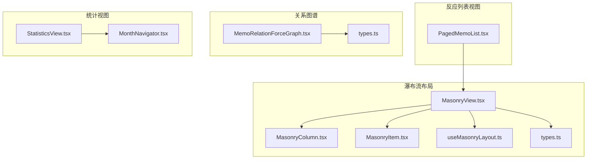
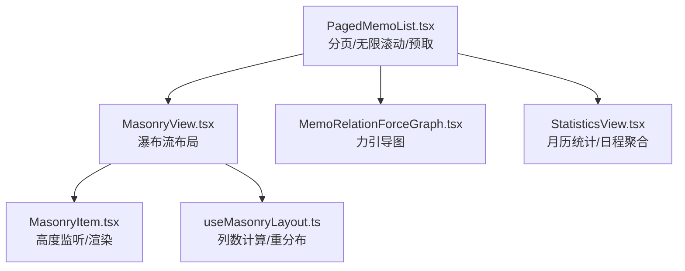
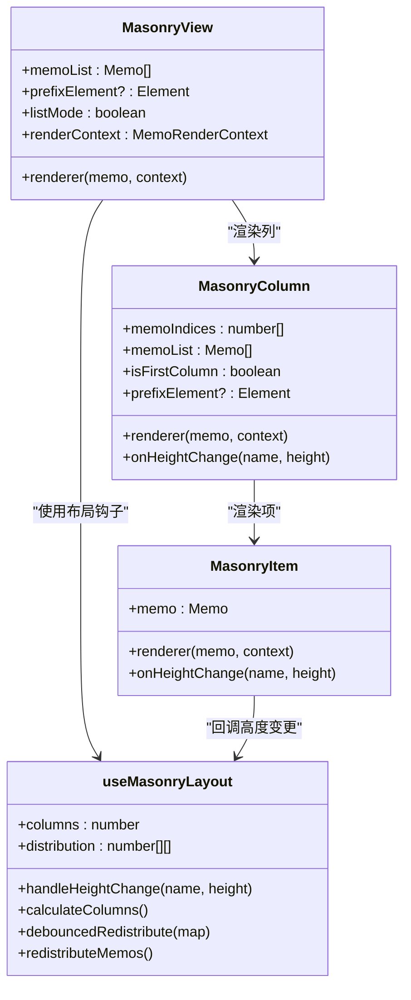
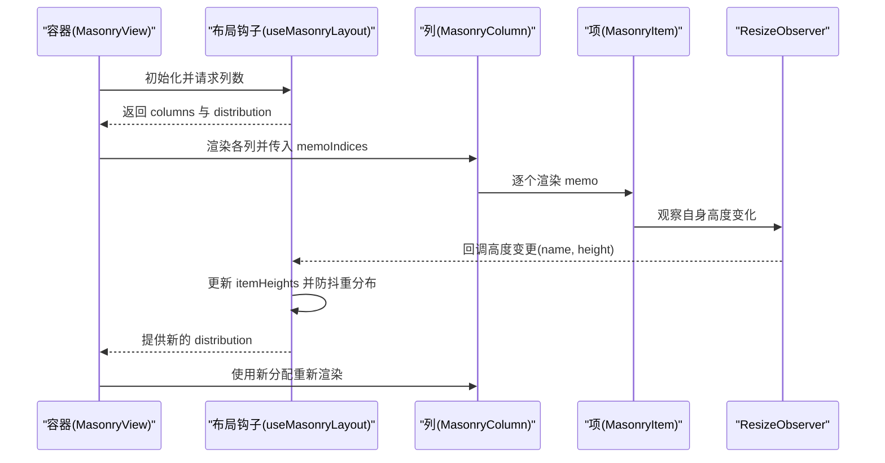
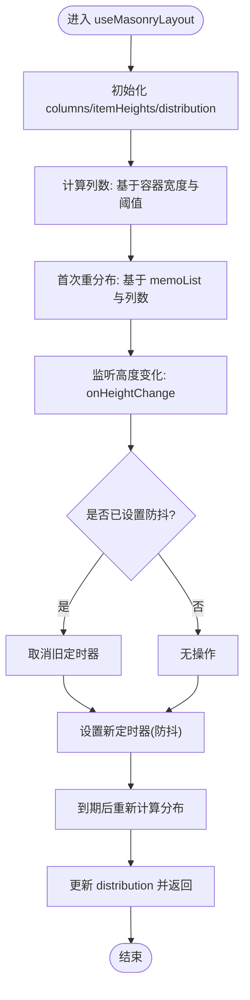
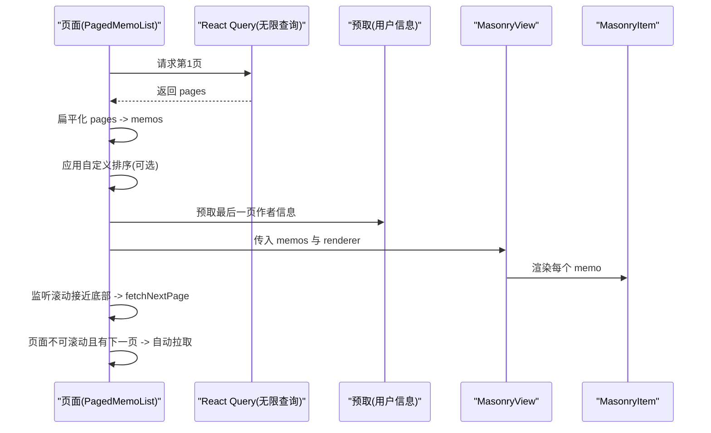
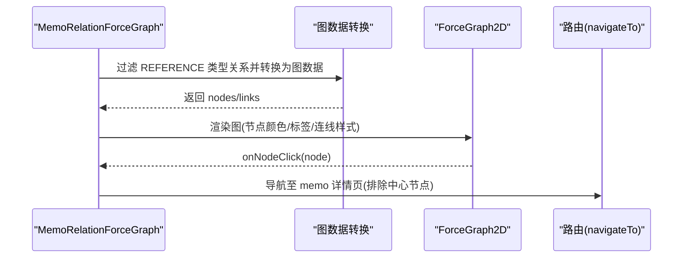
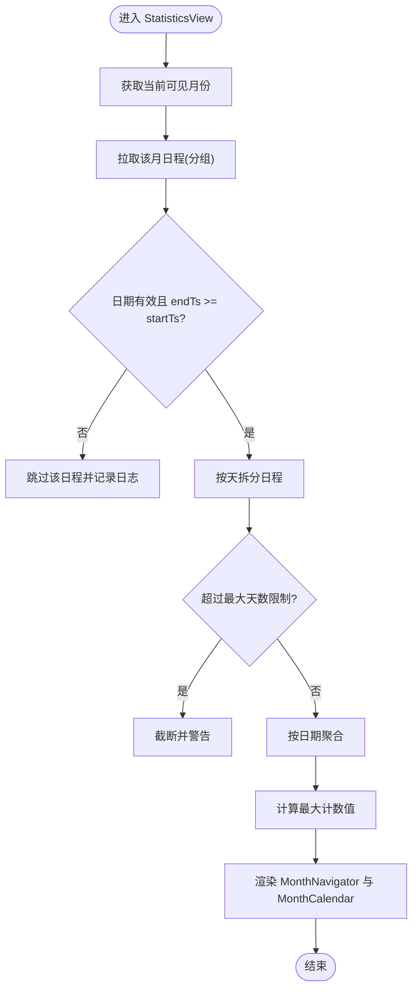
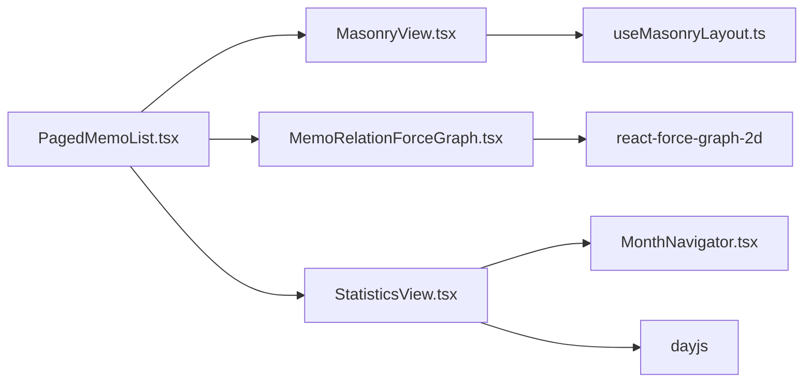

# 数据展示组件

<cite>
**本文引用的文件**
- [MasonryView.tsx](file://web/src/components/MasonryView/MasonryView.tsx)
- [MasonryColumn.tsx](file://web/src/components/MasonryView/MasonryColumn.tsx)
- [MasonryItem.tsx](file://web/src/components/MasonryView/MasonryItem.tsx)
- [useMasonryLayout.ts](file://web/src/components/MasonryView/useMasonryLayout.ts)
- [types.ts](file://web/src/components/MasonryView/types.ts)
- [MemoView.tsx](file://web/src/components/MemoView/MemoView.tsx)
- [MemoRelationForceGraph.tsx](file://web/src/components/MemoRelationForceGraph/MemoRelationForceGraph.tsx)
- [types.ts](file://web/src/components/MemoRelationForceGraph/types.ts)
- [StatisticsView.tsx](file://web/src/components/StatisticsView/StatisticsView.tsx)
- [MonthNavigator.tsx](file://web/src/components/StatisticsView/MonthNavigator.tsx)
- [PagedMemoList.tsx](file://web/src/components/PagedMemoList/PagedMemoList.tsx)
</cite>

## 目录
1. [简介](#简介)
2. [项目结构](#项目结构)
3. [核心组件](#核心组件)
4. [架构总览](#架构总览)
5. [详细组件分析](#详细组件分析)
6. [依赖分析](#依赖分析)
7. [性能考虑](#性能考虑)
8. [故障排查指南](#故障排查指南)
9. [结论](#结论)
10. [附录](#附录)

## 简介
本文件系统性梳理并解释本仓库中的数据展示组件，重点覆盖以下方面：
- 瀑布流布局组件：基于列分配与高度测量的自适应瀑布流，支持响应式列数与动态重分布。
- 反应列表视图：以“分页+无限滚动”为核心的长列表渲染，结合预取与自动拉取策略提升交互流畅度。
- 关系图谱：基于力引导图的备忘录引用关系可视化，支持节点点击导航与缩放交互。
- 统计视图：月历统计与日程聚合，支持月份切换、年历弹窗与按日聚合展示。

在设计上，组件遵循“高内聚、低耦合”的原则，通过上下文与钩子解耦状态管理与渲染逻辑；在性能上采用防抖重分布、懒加载、骨架屏与预取等策略；在交互上强调可访问性与响应式行为。

## 项目结构
围绕数据展示的相关前端组件主要位于 web/src/components 下，按功能域划分如下：
- MasonryView：瀑布流布局与列分配、高度监听与重分布
- MemoView：单条备忘录卡片的渲染与交互上下文
- MemoRelationForceGraph：备忘录引用关系的力引导图
- StatisticsView：统计视图（月历、日程聚合）
- PagedMemoList：分页与无限滚动的长列表容器

**图表来源**
- [MasonryView.tsx](file://web/src/components/MasonryView/MasonryView.tsx#L1-L48)
- [MasonryColumn.tsx](file://web/src/components/MasonryView/MasonryColumn.tsx#L1-L35)
- [MasonryItem.tsx](file://web/src/components/MasonryView/MasonryItem.tsx#L1-L33)
- [useMasonryLayout.ts](file://web/src/components/MasonryView/useMasonryLayout.ts#L1-L107)
- [types.ts](file://web/src/components/MasonryView/types.ts#L1-L42)
- [PagedMemoList.tsx](file://web/src/components/PagedMemoList/PagedMemoList.tsx#L1-L231)
- [MemoRelationForceGraph.tsx](file://web/src/components/MemoRelationForceGraph/MemoRelationForceGraph.tsx#L1-L63)
- [types.ts](file://web/src/components/MemoRelationForceGraph/types.ts#L1-L11)
- [StatisticsView.tsx](file://web/src/components/StatisticsView/StatisticsView.tsx#L1-L94)
- [MonthNavigator.tsx](file://web/src/components/StatisticsView/MonthNavigator.tsx#L1-L65)

**章节来源**
- [MasonryView.tsx](file://web/src/components/MasonryView/MasonryView.tsx#L1-L48)
- [PagedMemoList.tsx](file://web/src/components/PagedMemoList/PagedMemoList.tsx#L1-L231)
- [MemoRelationForceGraph.tsx](file://web/src/components/MemoRelationForceGraph/MemoRelationForceGraph.tsx#L1-L63)
- [StatisticsView.tsx](file://web/src/components/StatisticsView/StatisticsView.tsx#L1-L94)

## 核心组件
本节从职责、数据流、交互与性能四个维度，对四大组件进行概览式解析。

- 瀑布流布局组件
  - 职责：根据容器宽度计算列数，将备忘录分配到各列，并监听每个条目的高度变化以触发重分布。
  - 数据流：Memo 列表 → 计算列数 → 分配索引 → 渲染列 → 监听高度变化 → 防抖重分布。
  - 性能：使用 ResizeObserver 监听动态内容高度；通过防抖减少重排次数；列数随窗口宽度变化而变化。
  - 交互：紧凑模式（多列时）由渲染上下文控制；首列可插入前缀元素（如编辑器）。

- 反应列表视图
  - 职责：封装分页与无限滚动，提供骨架屏、空态、回到顶部等体验增强；将 Memo 渲染交给外部 renderer。
  - 数据流：React Query 无限查询 → 扁平化 memos → 排序 → 渲染 MasonryView。
  - 性能：预取用户信息、滚动近底部自动拉取、页面不可滚动时的自动拉取策略。
  - 交互：支持过滤器、排序、布局切换（瀑布流/列表），以及返回顶部按钮。

- 关系图谱
  - 职责：将备忘录的引用关系转换为力引导图，支持节点点击跳转、缩放与颜色区分。
  - 数据流：备忘录 relations（仅 REFERENCE 类型） → 图数据转换 → 力引导图渲染。
  - 性能：固定冷却周期、节点大小与连线样式统一，避免过度动画开销。
  - 交互：点击非中心节点导航至对应备忘录详情页。

- 统计视图
  - 职责：按月展示活动统计，聚合日程并支持月份切换与年历选择。
  - 数据流：当前月份 → 拉取该月日程 → 多日程按日拆分聚合 → 计算最大值用于视觉映射。
  - 性能：对无效日期范围进行校验与跳过，设置最大处理天数防止异常循环。
  - 交互：左右切换月、点击年历面板选择年份与月份。

**章节来源**
- [MasonryView.tsx](file://web/src/components/MasonryView/MasonryView.tsx#L1-L48)
- [MasonryItem.tsx](file://web/src/components/MasonryView/MasonryItem.tsx#L1-L33)
- [useMasonryLayout.ts](file://web/src/components/MasonryView/useMasonryLayout.ts#L1-L107)
- [PagedMemoList.tsx](file://web/src/components/PagedMemoList/PagedMemoList.tsx#L1-L231)
- [MemoRelationForceGraph.tsx](file://web/src/components/MemoRelationForceGraph/MemoRelationForceGraph.tsx#L1-L63)
- [StatisticsView.tsx](file://web/src/components/StatisticsView/StatisticsView.tsx#L1-L94)
- [MonthNavigator.tsx](file://web/src/components/StatisticsView/MonthNavigator.tsx#L1-L65)

## 架构总览
下图展示了数据展示组件的整体交互与数据流向，突出瀑布流、列表容器、关系图谱与统计视图之间的协作关系。

**图表来源**
- [PagedMemoList.tsx](file://web/src/components/PagedMemoList/PagedMemoList.tsx#L1-L231)
- [MasonryView.tsx](file://web/src/components/MasonryView/MasonryView.tsx#L1-L48)
- [MasonryItem.tsx](file://web/src/components/MasonryView/MasonryItem.tsx#L1-L33)
- [useMasonryLayout.ts](file://web/src/components/MasonryView/useMasonryLayout.ts#L1-L107)
- [MemoRelationForceGraph.tsx](file://web/src/components/MemoRelationForceGraph/MemoRelationForceGraph.tsx#L1-L63)
- [StatisticsView.tsx](file://web/src/components/StatisticsView/StatisticsView.tsx#L1-L94)

## 详细组件分析

### 瀑布流布局组件
瀑布流组件由三部分组成：容器层负责列数与网格布局；列层负责分配索引与渲染；项层负责高度监听与回调；布局钩子负责列数计算、高度收集与防抖重分布。

**图表来源**
- [MasonryView.tsx](file://web/src/components/MasonryView/MasonryView.tsx#L1-L48)
- [MasonryColumn.tsx](file://web/src/components/MasonryView/MasonryColumn.tsx#L1-L35)
- [MasonryItem.tsx](file://web/src/components/MasonryView/MasonryItem.tsx#L1-L33)
- [useMasonryLayout.ts](file://web/src/components/MasonryView/useMasonryLayout.ts#L1-L107)
- [types.ts](file://web/src/components/MasonryView/types.ts#L1-L42)

**图表来源**
- [MasonryView.tsx](file://web/src/components/MasonryView/MasonryView.tsx#L1-L48)
- [MasonryItem.tsx](file://web/src/components/MasonryView/MasonryItem.tsx#L1-L33)
- [useMasonryLayout.ts](file://web/src/components/MasonryView/useMasonryLayout.ts#L1-L107)

**图表来源**
- [useMasonryLayout.ts](file://web/src/components/MasonryView/useMasonryLayout.ts#L1-L107)

**章节来源**
- [MasonryView.tsx](file://web/src/components/MasonryView/MasonryView.tsx#L1-L48)
- [MasonryColumn.tsx](file://web/src/components/MasonryView/MasonryColumn.tsx#L1-L35)
- [MasonryItem.tsx](file://web/src/components/MasonryView/MasonryItem.tsx#L1-L33)
- [useMasonryLayout.ts](file://web/src/components/MasonryView/useMasonryLayout.ts#L1-L107)
- [types.ts](file://web/src/components/MasonryView/types.ts#L1-L42)

### 反应列表视图
反应列表视图作为长列表容器，负责：
- 无限分页与滚动加载
- 自动拉取：当页面不可滚动且仍有下一页时，延迟触发拉取
- 骨架屏与空态
- 渲染上下文传递给瀑布流布局

**图表来源**
- [PagedMemoList.tsx](file://web/src/components/PagedMemoList/PagedMemoList.tsx#L1-L231)
- [MasonryView.tsx](file://web/src/components/MasonryView/MasonryView.tsx#L1-L48)

**章节来源**
- [PagedMemoList.tsx](file://web/src/components/PagedMemoList/PagedMemoList.tsx#L1-L231)

### 关系图谱
关系图谱将备忘录的引用关系转换为力引导图，支持点击节点导航至详情页。

**图表来源**
- [MemoRelationForceGraph.tsx](file://web/src/components/MemoRelationForceGraph/MemoRelationForceGraph.tsx#L1-L63)
- [types.ts](file://web/src/components/MemoRelationForceGraph/types.ts#L1-L11)

**章节来源**
- [MemoRelationForceGraph.tsx](file://web/src/components/MemoRelationForceGraph/MemoRelationForceGraph.tsx#L1-L63)
- [types.ts](file://web/src/components/MemoRelationForceGraph/types.ts#L1-L11)

### 统计视图
统计视图以月为单位展示活动统计，并聚合日程到具体日期。

**图表来源**
- [StatisticsView.tsx](file://web/src/components/StatisticsView/StatisticsView.tsx#L1-L94)
- [MonthNavigator.tsx](file://web/src/components/StatisticsView/MonthNavigator.tsx#L1-L65)

**章节来源**
- [StatisticsView.tsx](file://web/src/components/StatisticsView/StatisticsView.tsx#L1-L94)
- [MonthNavigator.tsx](file://web/src/components/StatisticsView/MonthNavigator.tsx#L1-L65)

## 依赖分析
- 组件内聚与耦合
  - 瀑布流：MasonryView 与 useMasonryLayout 强耦合，但通过回调接口解耦项层高度变化；MasonryColumn 与 MasonryItem 保持纯渲染职责。
  - 列表容器：PagedMemoList 与 MasonryView 解耦，通过 renderer 与上下文传递实现可插拔渲染。
  - 关系图谱：MemoRelationForceGraph 依赖外部图数据转换工具，内部不关心数据源。
  - 统计视图：StatisticsView 与 MonthNavigator 通过回调解耦，MonthNavigator 仅负责交互与选择。

- 外部依赖
  - 力引导图库：react-force-graph-2d
  - 日期处理：dayjs
  - 状态管理：React Query（无限查询）、React Context（视图布局）

**图表来源**
- [PagedMemoList.tsx](file://web/src/components/PagedMemoList/PagedMemoList.tsx#L1-L231)
- [MasonryView.tsx](file://web/src/components/MasonryView/MasonryView.tsx#L1-L48)
- [useMasonryLayout.ts](file://web/src/components/MasonryView/useMasonryLayout.ts#L1-L107)
- [MemoRelationForceGraph.tsx](file://web/src/components/MemoRelationForceGraph/MemoRelationForceGraph.tsx#L1-L63)
- [StatisticsView.tsx](file://web/src/components/StatisticsView/StatisticsView.tsx#L1-L94)
- [MonthNavigator.tsx](file://web/src/components/StatisticsView/MonthNavigator.tsx#L1-L65)

**章节来源**
- [PagedMemoList.tsx](file://web/src/components/PagedMemoList/PagedMemoList.tsx#L1-L231)
- [MasonryView.tsx](file://web/src/components/MasonryView/MasonryView.tsx#L1-L48)
- [MemoRelationForceGraph.tsx](file://web/src/components/MemoRelationForceGraph/MemoRelationForceGraph.tsx#L1-L63)
- [StatisticsView.tsx](file://web/src/components/StatisticsView/StatisticsView.tsx#L1-L94)

## 性能考虑
- 瀑布流布局
  - 防抖重分布：通过定时器合并多次高度变化，降低重排频率。
  - 高度监听：使用 ResizeObserver 监听 DOM 尺寸变化，避免轮询。
  - 列数计算：基于容器宽度与阈值动态调整列数，兼顾桌面与移动端体验。

- 反应列表视图
  - 预取策略：在新数据到达时预取作者信息，减少二次网络请求。
  - 自动拉取：页面不可滚动时自动触发下一页拉取，避免用户手动滚动。
  - 无限滚动：接近底部时触发拉取，配合骨架屏提升感知性能。

- 关系图谱
  - 固定冷却周期：避免持续动画导致的性能损耗。
  - 统一样式：节点大小与连线样式统一，减少复杂计算。

- 统计视图
  - 日期校验与截断：对异常日程进行跳过与告警，防止死循环或异常渲染。
  - 最大处理天数：限制单个日程的最大天数，保障稳定性。

[本节为通用性能建议，无需特定文件引用]

## 故障排查指南
- 瀑布流布局不刷新或列数不正确
  - 检查容器宽度是否正确获取，确认列表模式与窗口尺寸变化事件是否触发。
  - 确认高度回调是否被调用，防抖定时器是否被清理。

- 无限滚动未触发或重复拉取
  - 检查滚动事件绑定与阈值（接近底部 300px）是否生效。
  - 确认 isFetchingNextPage 状态是否正确传递，避免并发拉取。

- 关系图谱节点无法点击或跳转异常
  - 检查节点点击回调中是否排除了中心节点。
  - 确认路由参数与父页面状态传递是否正确。

- 统计视图日程显示异常
  - 查看无效日期与 endTs < startTs 的日志输出，确认数据质量。
  - 检查最大天数限制是否触发，必要时调整业务规则。

**章节来源**
- [useMasonryLayout.ts](file://web/src/components/MasonryView/useMasonryLayout.ts#L1-L107)
- [PagedMemoList.tsx](file://web/src/components/PagedMemoList/PagedMemoList.tsx#L1-L231)
- [MemoRelationForceGraph.tsx](file://web/src/components/MemoRelationForceGraph/MemoRelationForceGraph.tsx#L1-L63)
- [StatisticsView.tsx](file://web/src/components/StatisticsView/StatisticsView.tsx#L1-L94)

## 结论
本仓库的数据展示组件在布局、列表、图谱与统计四个方面形成了完整的数据可视化体系。瀑布流布局通过列数计算与高度监听实现自适应；反应列表视图结合无限滚动与预取策略保证长列表的流畅体验；关系图谱以简洁的交互与稳定的渲染提升理解效率；统计视图通过月历与日程聚合帮助用户把握时间维度上的活动规律。整体设计注重性能与交互体验，适合在大规模数据场景下稳定运行。

[本节为总结性内容，无需特定文件引用]

## 附录
- 最佳实践清单
  - 数据绑定：通过 renderer 与上下文解耦渲染逻辑，便于扩展不同视图。
  - 状态管理：使用 React Query 管理远端状态，结合本地缓存与预取策略。
  - 用户体验：骨架屏、空态、回到顶部、可访问性标签与键盘导航。
  - 性能优化：防抖重分布、滚动阈值、预取、最小化重排与合理使用动画。

[本节为通用建议，无需特定文件引用]