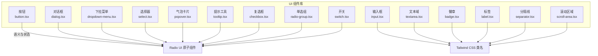
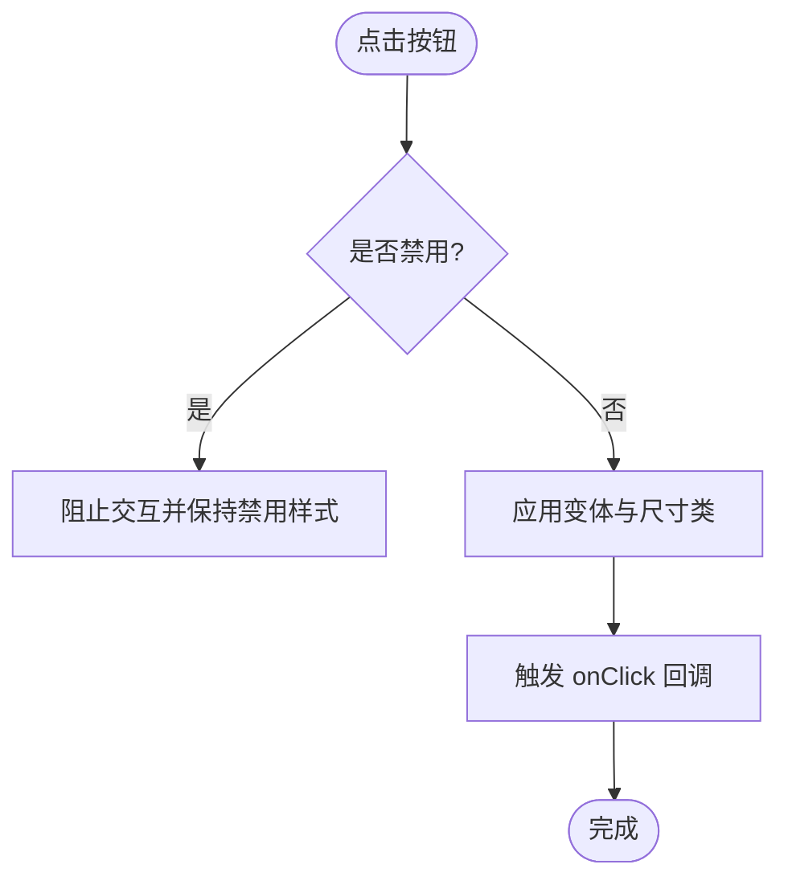
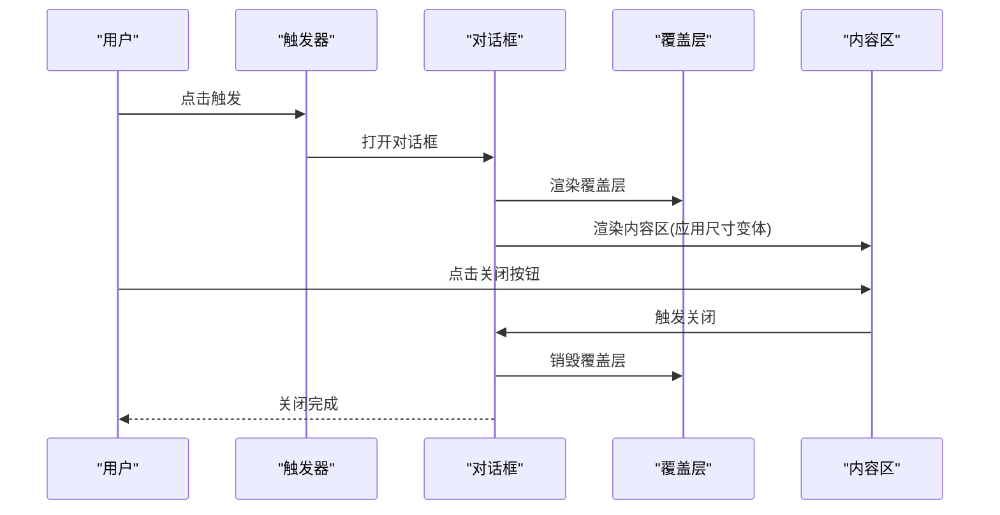
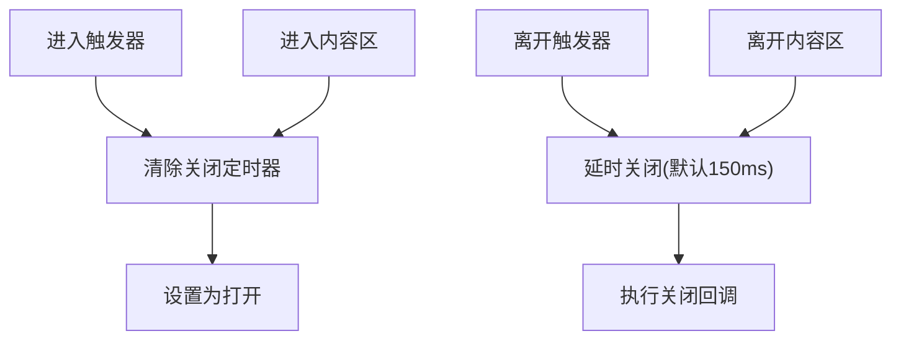
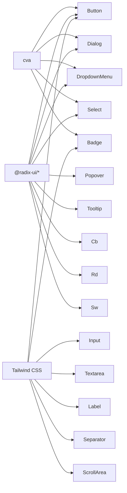

# 核心 UI 组件

<cite>
**本文引用的文件**
- [web/src/components/ui/button.tsx](file://web/src/components/ui/button.tsx)
- [web/src/components/ui/input.tsx](file://web/src/components/ui/input.tsx)
- [web/src/components/ui/dialog.tsx](file://web/src/components/ui/dialog.tsx)
- [web/src/components/ui/dropdown-menu.tsx](file://web/src/components/ui/dropdown-menu.tsx)
- [web/src/components/ui/select.tsx](file://web/src/components/ui/select.tsx)
- [web/src/components/ui/textarea.tsx](file://web/src/components/ui/textarea.tsx)
- [web/src/components/ui/badge.tsx](file://web/src/components/ui/badge.tsx)
- [web/src/components/ui/checkbox.tsx](file://web/src/components/ui/checkbox.tsx)
- [web/src/components/ui/radio-group.tsx](file://web/src/components/ui/radio-group.tsx)
- [web/src/components/ui/switch.tsx](file://web/src/components/ui/switch.tsx)
- [web/src/components/ui/popover.tsx](file://web/src/components/ui/popover.tsx)
- [web/src/components/ui/tooltip.tsx](file://web/src/components/ui/tooltip.tsx)
- [web/src/components/ui/label.tsx](file://web/src/components/ui/label.tsx)
- [web/src/components/ui/separator.tsx](file://web/src/components/ui/separator.tsx)
- [web/src/components/ui/scroll-area.tsx](file://web/src/components/ui/scroll-area.tsx)
</cite>

## 目录
1. [简介](#简介)
2. [项目结构](#项目结构)
3. [核心组件](#核心组件)
4. [架构总览](#架构总览)
5. [组件详解](#组件详解)
6. [依赖关系分析](#依赖关系分析)
7. [性能与可访问性](#性能与可访问性)
8. [故障排查指南](#故障排查指南)
9. [结论](#结论)
10. [附录：属性与变体参考](#附录属性与变体参考)

## 简介
本文件系统性梳理了基于 Radix UI 与 Tailwind CSS 的核心 UI 组件库，覆盖按钮、输入框、对话框、下拉菜单、选择器、文本域、徽章、复选框、单选组、开关、气泡卡片、提示工具、标签、分隔线与滚动区域等通用组件。文档从设计原则、属性接口、事件处理、样式定制、无障碍支持、响应式设计与主题定制等方面进行深入解析，并提供使用示例、最佳实践与扩展建议。

## 项目结构
核心 UI 组件集中位于前端工程的组件目录中，采用“按功能模块划分”的组织方式，便于按需引入与组合使用。组件统一以 Radix UI 为交互语义基础，结合 Tailwind CSS 实现一致的视觉与交互体验。

**图表来源**
- [web/src/components/ui/button.tsx](file://web/src/components/ui/button.tsx#L1-L46)
- [web/src/components/ui/input.tsx](file://web/src/components/ui/input.tsx#L1-L19)
- [web/src/components/ui/textarea.tsx](file://web/src/components/ui/textarea.tsx#L1-L20)
- [web/src/components/ui/dialog.tsx](file://web/src/components/ui/dialog.tsx#L1-L121)
- [web/src/components/ui/dropdown-menu.tsx](file://web/src/components/ui/dropdown-menu.tsx#L1-L274)
- [web/src/components/ui/select.tsx](file://web/src/components/ui/select.tsx#L1-L149)
- [web/src/components/ui/badge.tsx](file://web/src/components/ui/badge.tsx#L1-L35)
- [web/src/components/ui/checkbox.tsx](file://web/src/components/ui/checkbox.tsx#L1-L29)
- [web/src/components/ui/radio-group.tsx](file://web/src/components/ui/radio-group.tsx#L1-L28)
- [web/src/components/ui/switch.tsx](file://web/src/components/ui/switch.tsx#L1-L26)
- [web/src/components/ui/popover.tsx](file://web/src/components/ui/popover.tsx#L1-L53)
- [web/src/components/ui/tooltip.tsx](file://web/src/components/ui/tooltip.tsx#L1-L60)
- [web/src/components/ui/label.tsx](file://web/src/components/ui/label.tsx#L1-L19)
- [web/src/components/ui/separator.tsx](file://web/src/components/ui/separator.tsx#L1-L26)
- [web/src/components/ui/scroll-area.tsx](file://web/src/components/ui/scroll-area.tsx#L1-L16)

**章节来源**
- [web/src/components/ui/button.tsx](file://web/src/components/ui/button.tsx#L1-L46)
- [web/src/components/ui/dialog.tsx](file://web/src/components/ui/dialog.tsx#L1-L121)
- [web/src/components/ui/dropdown-menu.tsx](file://web/src/components/ui/dropdown-menu.tsx#L1-L274)
- [web/src/components/ui/select.tsx](file://web/src/components/ui/select.tsx#L1-L149)

## 核心组件
本节概述各组件的设计原则与通用能力：
- 一致性：统一使用 Radix UI 提供的语义化原语，保证可访问性与跨平台行为一致。
- 变体系统：通过类变体（cva）定义尺寸与风格变体，结合 Tailwind 类名实现可组合的样式。
- 透传与扩展：组件广泛透传原生 DOM 属性与 className，便于二次封装与主题定制。
- 无障碍：大量使用 aria-* 属性与语义标签，确保键盘导航、屏幕阅读器友好。
- 响应式：通过 Tailwind 断点类与 Radix 动画系统，适配移动端与桌面端。

**章节来源**
- [web/src/components/ui/button.tsx](file://web/src/components/ui/button.tsx#L6-L30)
- [web/src/components/ui/dialog.tsx](file://web/src/components/ui/dialog.tsx#L31-L51)
- [web/src/components/ui/dropdown-menu.tsx](file://web/src/components/ui/dropdown-menu.tsx#L28-L46)
- [web/src/components/ui/select.tsx](file://web/src/components/ui/select.tsx#L44-L71)

## 架构总览
组件层以“原子组件 + 复合组件”两级结构组织：
- 原子组件：如按钮、输入、复选、单选、开关、标签等，负责单一交互与视觉状态。
- 复合组件：如对话框、下拉菜单、选择器、气泡卡片、提示工具等，由多个原子组件与 Radix 原语组合而成，提供复杂交互场景。

```mermaid
classDiagram
class Button {
+variant : "default|destructive|outline|secondary|ghost|link"
+size : "default|sm|lg|icon"
+asChild : boolean
}
class Input {
+type : string
}
class Textarea
class Dialog {
+size : "sm|md|default|lg|xl|2xl|full"
+showCloseButton : boolean
}
class DropdownMenu {
+useDropdownMenuSubHoverDelay()
}
class Select {
+size : "xs|sm|default"
+position : "popper|item-aligned"
}
class Badge {
+variant : "default|secondary|destructive|outline"
+asChild : boolean
}
class Checkbox
class RadioGroup
class Switch
class Popover {
+align : "center|start|end"
+sideOffset : number
}
class Tooltip {
+delayDuration : number
+sideOffset : number
}
class Label
class Separator {
+orientation : "horizontal|vertical"
+decorative : boolean
}
class ScrollArea
Button --> Radix_UI : "Slot/Radix 原语"
Dialog --> Radix_UI
DropdownMenu --> Radix_UI
Select --> Radix_UI
Popover --> Radix_UI
Tooltip --> Radix_UI
Checkbox --> Radix_UI
RadioGroup --> Radix_UI
Switch --> Radix_UI
```

**图表来源**
- [web/src/components/ui/button.tsx](file://web/src/components/ui/button.tsx#L32-L42)
- [web/src/components/ui/input.tsx](file://web/src/components/ui/input.tsx#L4-L16)
- [web/src/components/ui/textarea.tsx](file://web/src/components/ui/textarea.tsx#L4-L16)
- [web/src/components/ui/dialog.tsx](file://web/src/components/ui/dialog.tsx#L53-L81)
- [web/src/components/ui/dropdown-menu.tsx](file://web/src/components/ui/dropdown-menu.tsx#L7-L47)
- [web/src/components/ui/select.tsx](file://web/src/components/ui/select.tsx#L18-L42)
- [web/src/components/ui/badge.tsx](file://web/src/components/ui/badge.tsx#L23-L32)
- [web/src/components/ui/checkbox.tsx](file://web/src/components/ui/checkbox.tsx#L6-L25)
- [web/src/components/ui/radio-group.tsx](file://web/src/components/ui/radio-group.tsx#L6-L25)
- [web/src/components/ui/switch.tsx](file://web/src/components/ui/switch.tsx#L5-L23)
- [web/src/components/ui/popover.tsx](file://web/src/components/ui/popover.tsx#L5-L41)
- [web/src/components/ui/tooltip.tsx](file://web/src/components/ui/tooltip.tsx#L5-L56)
- [web/src/components/ui/label.tsx](file://web/src/components/ui/label.tsx#L5-L15)
- [web/src/components/ui/separator.tsx](file://web/src/components/ui/separator.tsx#L5-L23)
- [web/src/components/ui/scroll-area.tsx](file://web/src/components/ui/scroll-area.tsx#L6-L12)

## 组件详解

### 按钮 Button
- 设计原则
  - 使用类变体（cva）定义风格与尺寸，支持 asChild 透传为任意元素或容器。
  - 默认包含过渡动画与禁用态样式，确保一致的反馈。
- 关键属性
  - variant: default | destructive | outline | secondary | ghost | link
  - size: default | sm | lg | icon
  - asChild: boolean
  - className: 透传自定义样式
- 事件与可访问性
  - 支持原生 button 属性；内部通过 Slot 容器包裹，保持可访问性语义。
- 样式定制
  - 通过 Tailwind 类名叠加或覆盖默认类变体；支持在父级容器中重置或扩展。
- 最佳实践
  - 图文按钮时，注意图标尺寸与间距；避免在禁用态仍绑定交互事件。
- 扩展建议
  - 可封装加载态、多态态（成功/失败）与尺寸扩展（如 tiny/extra-large）。

**图表来源**
- [web/src/components/ui/button.tsx](file://web/src/components/ui/button.tsx#L32-L42)

**章节来源**
- [web/src/components/ui/button.tsx](file://web/src/components/ui/button.tsx#L6-L30)
- [web/src/components/ui/button.tsx](file://web/src/components/ui/button.tsx#L32-L42)

### 输入框 Input
- 设计原则
  - 默认提供边框、圆角、阴影与占位符颜色，聚焦与选择高亮遵循主题色。
- 关键属性
  - type: string（text/password/email 等）
  - className: 自定义样式
- 无障碍与响应式
  - 透传原生 input 能力；在移动端适配字体大小与内边距。
- 最佳实践
  - 与 Label 配合使用；在表单中提供错误态与帮助文案。

**章节来源**
- [web/src/components/ui/input.tsx](file://web/src/components/ui/input.tsx#L4-L16)

### 文本域 Textarea
- 设计原则
  - 默认最小高度与自适应内容尺寸，支持禁用态与聚焦态过渡。
- 关键属性
  - className: 自定义样式
- 最佳实践
  - 与字数统计、自动高度调整结合使用。

**章节来源**
- [web/src/components/ui/textarea.tsx](file://web/src/components/ui/textarea.tsx#L4-L16)

### 对话框 Dialog
- 设计原则
  - 基于 Radix Dialog 原语，提供覆盖层、内容区、标题与描述等复合结构。
  - 内置关闭按钮与动画；支持多种尺寸与全屏模式。
- 关键属性
  - size: sm | md | default | lg | xl | 2xl | full
  - showCloseButton: boolean
  - className: 透传给内容区
- 事件与可访问性
  - onCloseAutoFocus 可控制焦点恢复；提供 Portal 渲染避免层级问题。
- 最佳实践
  - 在内容较多时启用滚动容器；避免在打开时影响背景滚动。

**图表来源**
- [web/src/components/ui/dialog.tsx](file://web/src/components/ui/dialog.tsx#L53-L81)
- [web/src/components/ui/dialog.tsx](file://web/src/components/ui/dialog.tsx#L15-L29)

**章节来源**
- [web/src/components/ui/dialog.tsx](file://web/src/components/ui/dialog.tsx#L31-L51)
- [web/src/components/ui/dialog.tsx](file://web/src/components/ui/dialog.tsx#L53-L81)
- [web/src/components/ui/dialog.tsx](file://web/src/components/ui/dialog.tsx#L83-L107)

### 下拉菜单 Dropdown Menu
- 设计原则
  - 支持主菜单与子菜单嵌套；提供悬停延迟逻辑，改善快速移动时的关闭体验。
- 关键属性
  - 子菜单：useDropdownMenuSubHoverDelay(closeDelay, onOpenChange)
  - 项变体：default | destructive
  - inset: boolean（缩进）
- 事件与可访问性
  - 使用 Portal 渲染，避免被裁剪；支持键盘导航与焦点管理。
- 最佳实践
  - 将危险操作置于 destructive 变体；为快捷键提供快捷显示区。

**图表来源**
- [web/src/components/ui/dropdown-menu.tsx](file://web/src/components/ui/dropdown-menu.tsx#L212-L254)

**章节来源**
- [web/src/components/ui/dropdown-menu.tsx](file://web/src/components/ui/dropdown-menu.tsx#L28-L47)
- [web/src/components/ui/dropdown-menu.tsx](file://web/src/components/ui/dropdown-menu.tsx#L53-L74)
- [web/src/components/ui/dropdown-menu.tsx](file://web/src/components/ui/dropdown-menu.tsx#L163-L202)
- [web/src/components/ui/dropdown-menu.tsx](file://web/src/components/ui/dropdown-menu.tsx#L212-L254)

### 选择器 Select
- 设计原则
  - 触发器支持 xs/sm/default 尺寸；内容区支持 popper 或 item 对齐定位。
  - 提供滚动按钮与视口，适配长列表。
- 关键属性
  - size: xs | sm | default
  - position: popper | item-aligned
- 无障碍与响应式
  - 与 Radix Select 原语配合，支持键盘导航与屏幕阅读器识别。
- 最佳实践
  - 长列表时启用滚动按钮；为分组与分隔线提供清晰结构。

**章节来源**
- [web/src/components/ui/select.tsx](file://web/src/components/ui/select.tsx#L18-L42)
- [web/src/components/ui/select.tsx](file://web/src/components/ui/select.tsx#L44-L71)
- [web/src/components/ui/select.tsx](file://web/src/components/ui/select.tsx#L83-L101)

### 徽章 Badge
- 设计原则
  - 支持 asChild 透传为任意容器；内置紧凑的圆角与尺寸。
- 关键属性
  - variant: default | secondary | destructive | outline
  - asChild: boolean
- 最佳实践
  - 用于状态标识、计数与标签；避免过度装饰。

**章节来源**
- [web/src/components/ui/badge.tsx](file://web/src/components/ui/badge.tsx#L6-L21)
- [web/src/components/ui/badge.tsx](file://web/src/components/ui/badge.tsx#L23-L32)

### 复选框 Checkbox
- 设计原则
  - 使用指示器渲染勾选图标；状态切换时提供过渡与颜色变化。
- 关键属性
  - className: 自定义样式
- 最佳实践
  - 与 Label 组合使用；在表单中提供错误态提示。

**章节来源**
- [web/src/components/ui/checkbox.tsx](file://web/src/components/ui/checkbox.tsx#L6-L25)

### 单选组 RadioGroup
- 设计原则
  - 提供指示器与填充效果；支持网格布局与禁用态。
- 关键属性
  - className: 自定义样式
- 最佳实践
  - 互斥选择场景；为每个选项提供明确标签。

**章节来源**
- [web/src/components/ui/radio-group.tsx](file://web/src/components/ui/radio-group.tsx#L6-L25)

### 开关 Switch
- 设计原则
  - 滑块随状态平滑过渡；提供尺寸与禁用态控制。
- 关键属性
  - className: 自定义样式
- 最佳实践
  - 适合二值状态切换；与说明文字组合。

**章节来源**
- [web/src/components/ui/switch.tsx](file://web/src/components/ui/switch.tsx#L5-L23)

### 气泡卡片 Popover
- 设计原则
  - 支持对齐与偏移配置；内容区使用 Portal 渲染，避免层级问题。
- 关键属性
  - align: center | start | end
  - sideOffset: number
- 最佳实践
  - 作为菜单或详情卡片的触发器；避免遮挡关键内容。

**章节来源**
- [web/src/components/ui/popover.tsx](file://web/src/components/ui/popover.tsx#L22-L41)

### 提示工具 Tooltip
- 设计原则
  - 提供延迟时长配置与箭头方向；使用 Provider 包裹以统一行为。
- 关键属性
  - delayDuration: number（毫秒）
  - sideOffset: number
- 最佳实践
  - 仅用于简短说明；避免冗长文本。

**章节来源**
- [web/src/components/ui/tooltip.tsx](file://web/src/components/ui/tooltip.tsx#L5-L56)

### 标签 Label
- 设计原则
  - 与表单控件配合使用；支持禁用态与分组禁用态。
- 关键属性
  - className: 自定义样式
- 最佳实践
  - 与输入、复选、单选等控件关联；提升可点击区域。

**章节来源**
- [web/src/components/ui/label.tsx](file://web/src/components/ui/label.tsx#L5-L15)

### 分隔线 Separator
- 设计原则
  - 支持水平与垂直方向；可作为装饰性或结构性元素。
- 关键属性
  - orientation: horizontal | vertical
  - decorative: boolean
- 最佳实践
  - 用于分组边界与内容分隔。

**章节来源**
- [web/src/components/ui/separator.tsx](file://web/src/components/ui/separator.tsx#L5-L23)

### 滚动区域 ScrollArea
- 设计原则
  - 简洁的滚动容器包装；支持任意子节点滚动。
- 关键属性
  - className: 自定义样式
- 最佳实践
  - 与长列表、对话框内容区配合使用。

**章节来源**
- [web/src/components/ui/scroll-area.tsx](file://web/src/components/ui/scroll-area.tsx#L6-L12)

## 依赖关系分析
- 组件间耦合
  - 复合组件（Dialog、DropdownMenu、Select、Popover、Tooltip）对 Radix UI 原语存在直接依赖，耦合度高但职责清晰。
  - 原子组件（Button、Input、Textarea、Checkbox、RadioGroup、Switch、Label、Badge、Separator、ScrollArea）与复合组件松耦合，便于独立复用。
- 外部依赖
  - Radix UI：提供可访问性与状态管理的底层能力。
  - class-variance-authority（cva）：用于定义变体与默认值。
  - Tailwind CSS：提供原子化样式与响应式断点。
- 潜在循环依赖
  - 当前结构未发现循环依赖；复合组件通过 Portal 渲染避免层级冲突。

**图表来源**
- [web/src/components/ui/button.tsx](file://web/src/components/ui/button.tsx#L6-L30)
- [web/src/components/ui/dialog.tsx](file://web/src/components/ui/dialog.tsx#L31-L51)
- [web/src/components/ui/dropdown-menu.tsx](file://web/src/components/ui/dropdown-menu.tsx#L28-L46)
- [web/src/components/ui/select.tsx](file://web/src/components/ui/select.tsx#L44-L71)
- [web/src/components/ui/badge.tsx](file://web/src/components/ui/badge.tsx#L6-L21)

**章节来源**
- [web/src/components/ui/button.tsx](file://web/src/components/ui/button.tsx#L1-L5)
- [web/src/components/ui/dialog.tsx](file://web/src/components/ui/dialog.tsx#L1-L5)
- [web/src/components/ui/dropdown-menu.tsx](file://web/src/components/ui/dropdown-menu.tsx#L1-L5)
- [web/src/components/ui/select.tsx](file://web/src/components/ui/select.tsx#L1-L4)
- [web/src/components/ui/badge.tsx](file://web/src/components/ui/badge.tsx#L1-L4)

## 性能与可访问性
- 性能
  - 复合组件使用 Portal 渲染，减少 DOM 树深度与重绘范围。
  - 动画通过 CSS 过渡与 Radix 动画类实现，避免 JavaScript 动画带来的卡顿。
  - 原子组件尽量使用透传与类名拼接，降低额外计算。
- 可访问性
  - 所有交互组件均使用语义化标签与 aria-* 属性，支持键盘导航与屏幕阅读器。
  - 对话框与下拉菜单在打开时自动管理焦点，关闭时恢复焦点。
  - 提供 sr-only 文本用于辅助技术识别。
- 响应式设计
  - 组件普遍使用 Tailwind 断点类，适配移动端与桌面端。
  - 对话框内容区根据视口高度动态调整最大高度。
- 主题定制
  - 通过 Tailwind 主题变量与类名覆盖实现主题切换；组件优先使用语义化颜色类。

[本节为通用指导，无需特定文件来源]

## 故障排查指南
- 对话框无法关闭或焦点异常
  - 检查是否正确使用 Portal 与 Overlay；确认 onCloseAutoFocus 的行为是否符合预期。
  - 参考路径：[web/src/components/ui/dialog.tsx](file://web/src/components/ui/dialog.tsx#L53-L81)
- 下拉菜单子菜单频繁关闭
  - 调整 useDropdownMenuSubHoverDelay 的关闭延迟参数；确保触发与内容区的鼠标事件处理一致。
  - 参考路径：[web/src/components/ui/dropdown-menu.tsx](file://web/src/components/ui/dropdown-menu.tsx#L212-L254)
- 选择器滚动条不生效
  - 确认 viewport 宽高与触发器尺寸一致；检查 popper 与 item 对齐模式。
  - 参考路径：[web/src/components/ui/select.tsx](file://web/src/components/ui/select.tsx#L44-L71)
- 气泡卡片位置偏移
  - 调整 align 与 sideOffset；必要时使用 Anchor 元素精确定位。
  - 参考路径：[web/src/components/ui/popover.tsx](file://web/src/components/ui/popover.tsx#L22-L41)
- 提示工具不显示
  - 检查 TooltipProvider 的 delayDuration 设置；确保 TooltipTrigger 正确包裹目标元素。
  - 参考路径：[web/src/components/ui/tooltip.tsx](file://web/src/components/ui/tooltip.tsx#L5-L56)

**章节来源**
- [web/src/components/ui/dialog.tsx](file://web/src/components/ui/dialog.tsx#L53-L81)
- [web/src/components/ui/dropdown-menu.tsx](file://web/src/components/ui/dropdown-menu.tsx#L212-L254)
- [web/src/components/ui/select.tsx](file://web/src/components/ui/select.tsx#L44-L71)
- [web/src/components/ui/popover.tsx](file://web/src/components/ui/popover.tsx#L22-L41)
- [web/src/components/ui/tooltip.tsx](file://web/src/components/ui/tooltip.tsx#L5-L56)

## 结论
该 UI 组件库以 Radix UI 为核心，结合 Tailwind CSS 的原子化样式，实现了高可访问性、强一致性与良好扩展性的前端基础组件集。通过变体系统与透传机制，开发者可在不破坏设计语言的前提下灵活定制样式与行为。建议在实际项目中遵循本文的最佳实践与扩展建议，确保组件在不同设备与主题下的稳定表现。

[本节为总结性内容，无需特定文件来源]

## 附录：属性与变体参考
- 按钮 Button
  - 变体：default | destructive | outline | secondary | ghost | link
  - 尺寸：default | sm | lg | icon
- 对话框 Dialog
  - 尺寸：sm | md | default | lg | xl | 2xl | full
  - 属性：showCloseButton
- 下拉菜单 DropdownMenu
  - 项变体：default | destructive
  - 属性：inset
  - 工具：useDropdownMenuSubHoverDelay(closeDelay, onOpenChange)
- 选择器 Select
  - 尺寸：xs | sm | default
  - 定位：popper | item-aligned
- 徽章 Badge
  - 变体：default | secondary | destructive | outline
  - 属性：asChild
- 气泡卡片 Popover
  - 对齐：center | start | end
  - 偏移：sideOffset
- 提示工具 Tooltip
  - 延迟：delayDuration
  - 偏移：sideOffset
- 分隔线 Separator
  - 方向：horizontal | vertical
  - 装饰性：decorative

**章节来源**
- [web/src/components/ui/button.tsx](file://web/src/components/ui/button.tsx#L9-L28)
- [web/src/components/ui/dialog.tsx](file://web/src/components/ui/dialog.tsx#L34-L49)
- [web/src/components/ui/dropdown-menu.tsx](file://web/src/components/ui/dropdown-menu.tsx#L58-L60)
- [web/src/components/ui/select.tsx](file://web/src/components/ui/select.tsx#L23-L24)
- [web/src/components/ui/badge.tsx](file://web/src/components/ui/badge.tsx#L9-L15)
- [web/src/components/ui/popover.tsx](file://web/src/components/ui/popover.tsx#L31-L32)
- [web/src/components/ui/tooltip.tsx](file://web/src/components/ui/tooltip.tsx#L10-L10)
- [web/src/components/ui/separator.tsx](file://web/src/components/ui/separator.tsx#L10-L10)