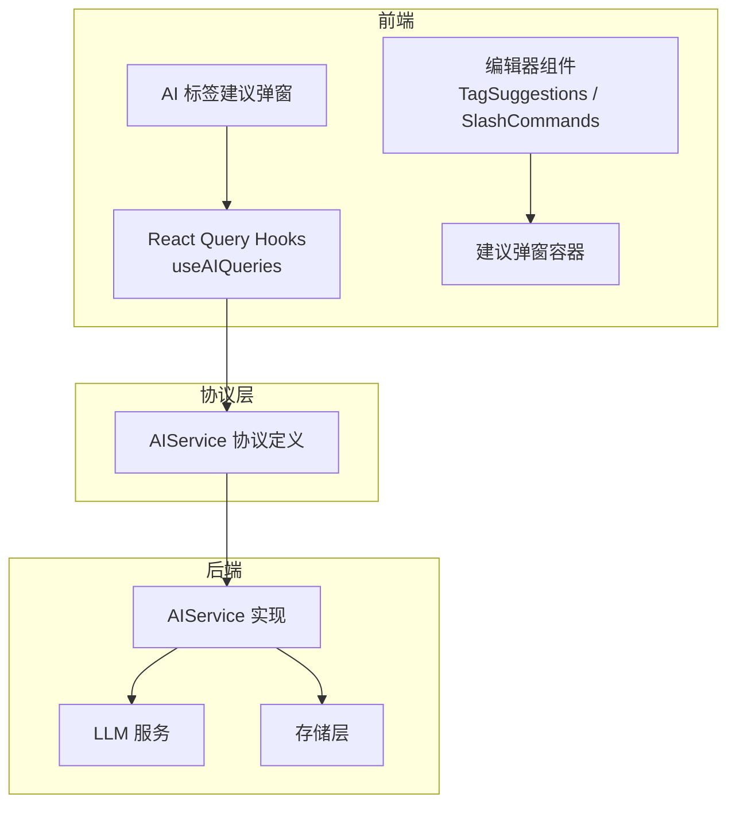
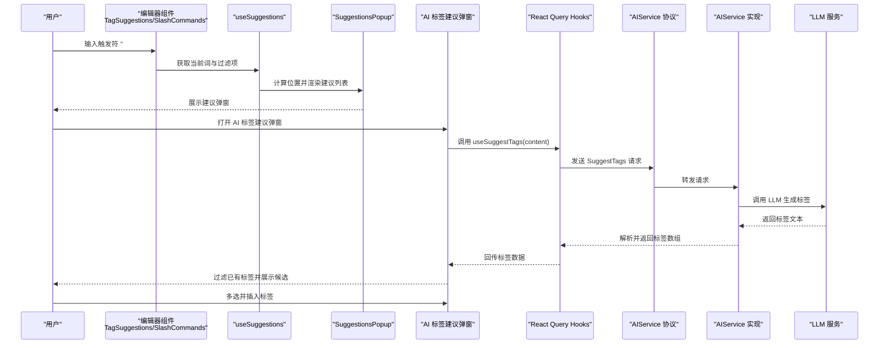
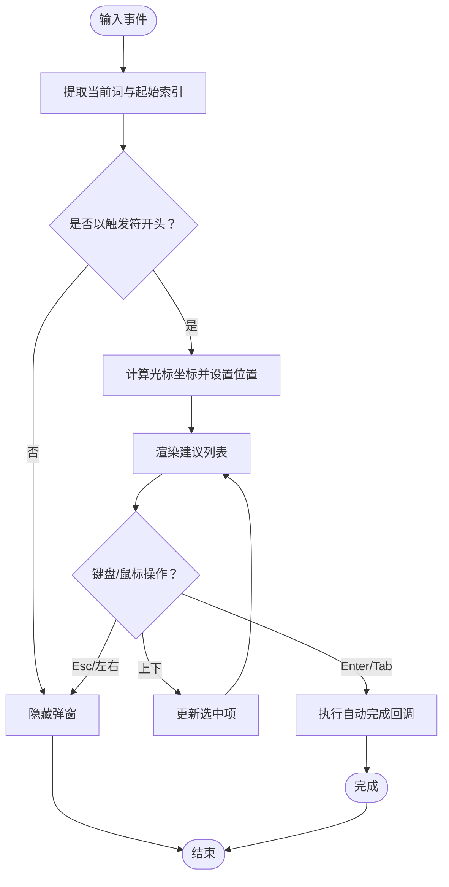
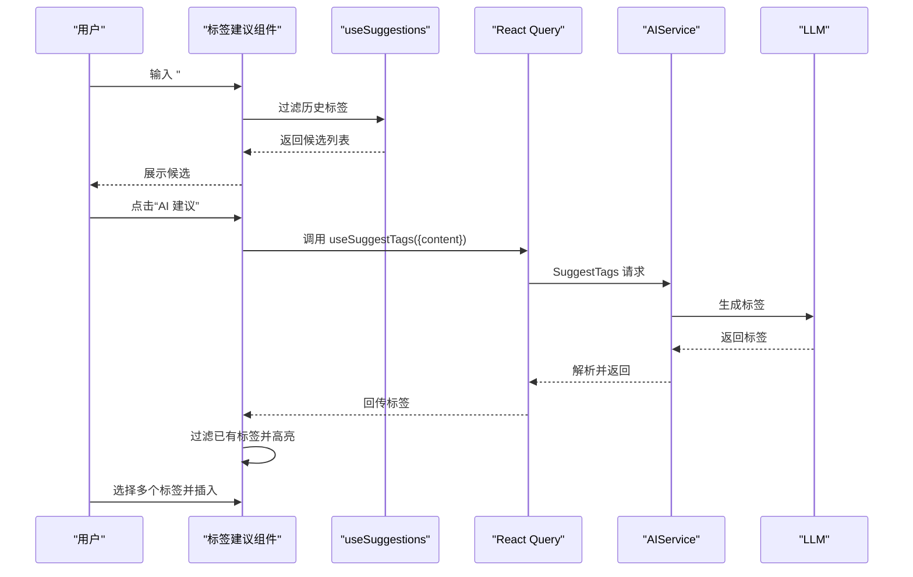
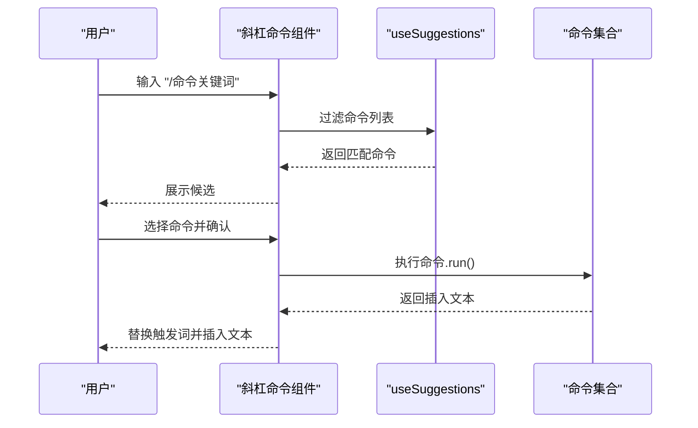
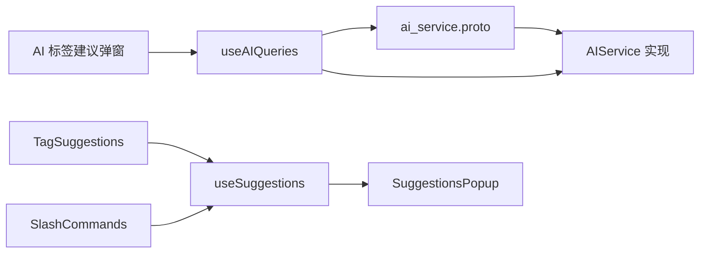

# 智能建议系统

<cite>
**本文引用的文件**
- [ai_service.proto](file://proto/api/v1/ai_service.proto)
- [AIService 类型与方法定义](file://server/router/api/v1/ai_service.go)
- [AI 标签建议 API 实现](file://server/router/api/v1/ai_service_semantic.go)
- [AI 标签建议 API 规格](file://docs/specs/AI-014-suggest-tags-api.md)
- [标签建议 Hook（前端）](file://web/src/hooks/useAIQueries.ts)
- [AI 标签建议弹窗（前端）](file://web/src/components/MemoEditor/components/AITagSuggestPopover.tsx)
- [标签建议组件（前端）](file://web/src/components/MemoEditor/Editor/TagSuggestions.tsx)
- [斜杠命令组件（前端）](file://web/src/components/MemoEditor/Editor/SlashCommands.tsx)
- [通用建议 Hook（前端）](file://web/src/components/MemoEditor/Editor/useSuggestions.ts)
- [建议弹窗容器（前端）](file://web/src/components/MemoEditor/Editor/SuggestionsPopup.tsx)
- [AI 赋能分析报告](file://docs/ai-empowerment-analysis.md)
</cite>

## 目录
1. [简介](#简介)
2. [项目结构](#项目结构)
3. [核心组件](#核心组件)
4. [架构总览](#架构总览)
5. [详细组件分析](#详细组件分析)
6. [依赖关系分析](#依赖关系分析)
7. [性能考量](#性能考量)
8. [故障排查指南](#故障排查指南)
9. [结论](#结论)
10. [附录](#附录)

## 简介
本文件系统化梳理“智能建议系统”的实现与集成方案，覆盖以下能力：
- 建议弹窗的实现机制：位置计算、显示逻辑与交互行为
- 标签建议功能：自动补全、过滤与选择机制
- 斜杠命令系统：命令解析、参数处理与执行逻辑
- AI 标签建议弹窗的集成与定制指南
- 性能优化、延迟加载与用户体验提升的最佳实践

同时，结合现有仓库中的 AI 标签建议 API 与前端编辑器组件，给出可落地的集成步骤与扩展建议。

## 项目结构
该系统由三部分组成：
- 后端服务：提供 AI 能力（向量检索、标签推荐、相关笔记等），其中标签推荐通过 AIService 的 SuggestTags 接口暴露
- 前端编辑器：提供标签自动补全与斜杠命令的 UI 与交互；新增 AI 标签建议弹窗用于调用后端接口并插入标签
- 协议层：通过 protobuf 定义 AIService 的 RPC 接口，确保前后端一致的契约

图表来源
- [AIService 类型与方法定义](file://server/router/api/v1/ai_service.go#L20-L74)
- [AI 标签建议 API 实现](file://server/router/api/v1/ai_service_semantic.go#L165-L225)
- [标签建议 Hook（前端）](file://web/src/hooks/useAIQueries.ts#L46-L57)
- [AI 标签建议弹窗（前端）](file://web/src/components/MemoEditor/components/AITagSuggestPopover.tsx#L23-L86)
- [标签建议组件（前端）](file://web/src/components/MemoEditor/Editor/TagSuggestions.tsx#L10-L50)
- [斜杠命令组件（前端）](file://web/src/components/MemoEditor/Editor/SlashCommands.tsx#L6-L45)
- [建议弹窗容器（前端）](file://web/src/components/MemoEditor/Editor/SuggestionsPopup.tsx#L20-L49)
- [ai_service.proto](file://proto/api/v1/ai_service.proto#L13-L28)

章节来源
- [AIService 类型与方法定义](file://server/router/api/v1/ai_service.go#L20-L74)
- [AI 标签建议 API 实现](file://server/router/api/v1/ai_service_semantic.go#L165-L225)
- [标签建议 Hook（前端）](file://web/src/hooks/useAIQueries.ts#L46-L57)
- [AI 标签建议弹窗（前端）](file://web/src/components/MemoEditor/components/AITagSuggestPopover.tsx#L23-L86)
- [标签建议组件（前端）](file://web/src/components/MemoEditor/Editor/TagSuggestions.tsx#L10-L50)
- [斜杠命令组件（前端）](file://web/src/components/MemoEditor/Editor/SlashCommands.tsx#L6-L45)
- [建议弹窗容器（前端）](file://web/src/components/MemoEditor/Editor/SuggestionsPopup.tsx#L20-L49)
- [ai_service.proto](file://proto/api/v1/ai_service.proto#L13-L28)

## 核心组件
- 后端 AIService
  - 提供 SuggestTags、SemanticSearch、GetRelatedMemos 等 AI 能力
  - 通过 LLMService 生成标签建议，结合用户历史标签进行参考
- 前端编辑器
  - 标签自动补全：基于历史标签排序与过滤，支持键盘导航与回车/Tab 插入
  - 斜杠命令：以 “/” 为触发符，按名称前缀匹配命令并执行
  - AI 标签建议弹窗：调用后端 SuggestTags，过滤已存在标签，支持多选插入
- 通用建议框架
  - useSuggestions：统一的触发词、过滤、位置计算与键盘交互逻辑
  - SuggestionsPopup：渲染建议列表并滚动定位选中项

章节来源
- [AIService 类型与方法定义](file://server/router/api/v1/ai_service.go#L20-L74)
- [AI 标签建议 API 实现](file://server/router/api/v1/ai_service_semantic.go#L165-L225)
- [标签建议 Hook（前端）](file://web/src/hooks/useAIQueries.ts#L46-L57)
- [AI 标签建议弹窗（前端）](file://web/src/components/MemoEditor/components/AITagSuggestPopover.tsx#L23-L86)
- [标签建议组件（前端）](file://web/src/components/MemoEditor/Editor/TagSuggestions.tsx#L10-L50)
- [斜杠命令组件（前端）](file://web/src/components/MemoEditor/Editor/SlashCommands.tsx#L6-L45)
- [通用建议 Hook（前端）](file://web/src/components/MemoEditor/Editor/useSuggestions.ts#L28-L158)
- [建议弹窗容器（前端）](file://web/src/components/MemoEditor/Editor/SuggestionsPopup.tsx#L20-L49)

## 架构总览
下图展示从用户输入到建议弹窗显示与标签插入的完整流程：

图表来源
- [标签建议组件（前端）](file://web/src/components/MemoEditor/Editor/TagSuggestions.tsx#L10-L50)
- [斜杠命令组件（前端）](file://web/src/components/MemoEditor/Editor/SlashCommands.tsx#L6-L45)
- [通用建议 Hook（前端）](file://web/src/components/MemoEditor/Editor/useSuggestions.ts#L28-L158)
- [建议弹窗容器（前端）](file://web/src/components/MemoEditor/Editor/SuggestionsPopup.tsx#L20-L49)
- [AI 标签建议弹窗（前端）](file://web/src/components/MemoEditor/components/AITagSuggestPopover.tsx#L23-L86)
- [标签建议 Hook（前端）](file://web/src/hooks/useAIQueries.ts#L46-L57)
- [AI 标签建议 API 实现](file://server/router/api/v1/ai_service_semantic.go#L165-L225)
- [ai_service.proto](file://proto/api/v1/ai_service.proto#L13-L28)

## 详细组件分析

### 建议弹窗实现机制
- 位置计算
  - 基于光标坐标与文本区域滚动偏移，计算建议弹窗的绝对定位
  - 使用 textarea-caret 库获取光标精确坐标，保证在不同字体与缩放下的准确性
- 显示逻辑
  - 当触发词匹配且查询非空时显示；否则隐藏
  - 支持点击外部、失焦、方向键左右等事件关闭
- 交互行为
  - 键盘上下导航切换选中项
  - Enter/Tab 插入当前选中项
  - 鼠标点击或键盘确认触发回调

图表来源
- [通用建议 Hook（前端）](file://web/src/components/MemoEditor/Editor/useSuggestions.ts#L43-L133)
- [建议弹窗容器（前端）](file://web/src/components/MemoEditor/Editor/SuggestionsPopup.tsx#L20-L49)

章节来源
- [通用建议 Hook（前端）](file://web/src/components/MemoEditor/Editor/useSuggestions.ts#L28-L158)
- [建议弹窗容器（前端）](file://web/src/components/MemoEditor/Editor/SuggestionsPopup.tsx#L20-L49)

### 标签建议功能
- 自动补全
  - 基于用户历史标签统计，按出现频次降序排列
  - 支持大小写不敏感的包含式过滤
- 选择机制
  - 回车/Tab 插入形如 “#标签名 ” 的完整片段
  - 与 AI 弹窗配合时，先调用后端接口，再进行本地过滤与插入

图表来源
- [标签建议组件（前端）](file://web/src/components/MemoEditor/Editor/TagSuggestions.tsx#L10-L50)
- [AI 标签建议弹窗（前端）](file://web/src/components/MemoEditor/components/AITagSuggestPopover.tsx#L23-L86)
- [标签建议 Hook（前端）](file://web/src/hooks/useAIQueries.ts#L46-L57)
- [AI 标签建议 API 实现](file://server/router/api/v1/ai_service_semantic.go#L165-L225)

章节来源
- [标签建议组件（前端）](file://web/src/components/MemoEditor/Editor/TagSuggestions.tsx#L10-L50)
- [AI 标签建议弹窗（前端）](file://web/src/components/MemoEditor/components/AITagSuggestPopover.tsx#L23-L86)
- [标签建议 Hook（前端）](file://web/src/hooks/useAIQueries.ts#L46-L57)
- [AI 标签建议 API 实现](file://server/router/api/v1/ai_service_semantic.go#L165-L225)

### 斜杠命令系统
- 命令解析
  - 以 “/” 为触发符，按命令名称前缀匹配
- 参数处理
  - 命令执行函数返回插入文本；可选 cursorOffset 控制插入后的光标位置
- 执行逻辑
  - 删除触发词与命令名，插入命令输出
  - 支持键盘导航与确认插入

图表来源
- [斜杠命令组件（前端）](file://web/src/components/MemoEditor/Editor/SlashCommands.tsx#L6-L45)
- [通用建议 Hook（前端）](file://web/src/components/MemoEditor/Editor/useSuggestions.ts#L28-L158)

章节来源
- [斜杠命令组件（前端）](file://web/src/components/MemoEditor/Editor/SlashCommands.tsx#L6-L45)
- [通用建议 Hook（前端）](file://web/src/components/MemoEditor/Editor/useSuggestions.ts#L28-L158)

### AI 标签建议弹窗的集成与定制
- 集成步骤
  - 在编辑器工具栏添加按钮，触发 AITagSuggestPopover 组件
  - 传入当前内容与插入回调，内部通过 useSuggestTags 调用后端 SuggestTags
  - 插入前过滤掉内容中已存在的标签，避免重复
- 定制建议
  - 限制标签数量与长度，遵循后端解析规则
  - 支持批量选择与键盘操作（空格/回车切换选中）
  - 提供加载态与错误提示，增强可用性

章节来源
- [AI 标签建议弹窗（前端）](file://web/src/components/MemoEditor/components/AITagSuggestPopover.tsx#L23-L86)
- [标签建议 Hook（前端）](file://web/src/hooks/useAIQueries.ts#L46-L57)
- [AI 标签建议 API 规格](file://docs/specs/AI-014-suggest-tags-api.md#L1-L147)

## 依赖关系分析
- 协议与实现
  - AIService 在 proto 中定义 RPC 接口，后端实现负责认证、参数校验、调用 LLM 并解析响应
- 前后端契约
  - 前端通过 React Query 调用 aiServiceClient.suggestTags，后端以 SuggestTagsResponse 返回标签数组
- 组件耦合
  - useSuggestions 作为通用逻辑，被标签建议与斜杠命令复用
  - SuggestionsPopup 仅负责 UI 渲染，降低与业务逻辑的耦合

图表来源
- [ai_service.proto](file://proto/api/v1/ai_service.proto#L13-L28)
- [AIService 类型与方法定义](file://server/router/api/v1/ai_service.go#L20-L74)
- [标签建议 Hook（前端）](file://web/src/hooks/useAIQueries.ts#L46-L57)
- [标签建议组件（前端）](file://web/src/components/MemoEditor/Editor/TagSuggestions.tsx#L10-L50)
- [斜杠命令组件（前端）](file://web/src/components/MemoEditor/Editor/SlashCommands.tsx#L6-L45)
- [通用建议 Hook（前端）](file://web/src/components/MemoEditor/Editor/useSuggestions.ts#L28-L158)
- [建议弹窗容器（前端）](file://web/src/components/MemoEditor/Editor/SuggestionsPopup.tsx#L20-L49)
- [AI 标签建议弹窗（前端）](file://web/src/components/MemoEditor/components/AITagSuggestPopover.tsx#L23-L86)

章节来源
- [ai_service.proto](file://proto/api/v1/ai_service.proto#L13-L28)
- [AIService 类型与方法定义](file://server/router/api/v1/ai_service.go#L20-L74)
- [标签建议 Hook（前端）](file://web/src/hooks/useAIQueries.ts#L46-L57)
- [标签建议组件（前端）](file://web/src/components/MemoEditor/Editor/TagSuggestions.tsx#L10-L50)
- [斜杠命令组件（前端）](file://web/src/components/MemoEditor/Editor/SlashCommands.tsx#L6-L45)
- [通用建议 Hook（前端）](file://web/src/components/MemoEditor/Editor/useSuggestions.ts#L28-L158)
- [建议弹窗容器（前端）](file://web/src/components/MemoEditor/Editor/SuggestionsPopup.tsx#L20-L49)
- [AI 标签建议弹窗（前端）](file://web/src/components/MemoEditor/components/AITagSuggestPopover.tsx#L23-L86)

## 性能考量
- 前端侧
  - 使用 React Query 缓存与去重，避免重复请求
  - 建议弹窗渲染采用虚拟滚动（可选）以应对长列表
  - 插入操作使用微任务队列避免输入冲突
- 后端侧
  - 全局 AI 限流器控制并发与速率
  - 标签解析严格限制数量与长度，减少 LLM 输出成本
- 体验优化
  - 加载态与错误提示即时反馈
  - 延迟加载：仅在打开弹窗时发起请求
  - 键盘优先：支持 Esc/方向键/Tab/Enter 快速操作

章节来源
- [标签建议 Hook（前端）](file://web/src/hooks/useAIQueries.ts#L46-L57)
- [通用建议 Hook（前端）](file://web/src/components/MemoEditor/Editor/useSuggestions.ts#L65-L78)
- [AIService 类型与方法定义](file://server/router/api/v1/ai_service.go#L17-L18)
- [AI 标签建议 API 规格](file://docs/specs/AI-014-suggest-tags-api.md#L78-L104)

## 故障排查指南
- 前端常见问题
  - 无法显示建议：检查触发词、过滤逻辑与位置计算
  - 插入失败：确认 editorActions 是否可用，避免并发输入
  - 请求失败：查看 useSuggestTags 的 onError 回调与 toast 提示
- 后端常见问题
  - 认证失败：SuggestTags 需要有效用户上下文
  - 参数非法：content 为空或 limit 超界
  - LLM 调用异常：检查 LLMService.Chat 的返回与解析逻辑

章节来源
- [AI 标签建议弹窗（前端）](file://web/src/components/MemoEditor/components/AITagSuggestPopover.tsx#L56-L62)
- [通用建议 Hook（前端）](file://web/src/components/MemoEditor/Editor/useSuggestions.ts#L65-L78)
- [AI 标签建议 API 实现](file://server/router/api/v1/ai_service_semantic.go#L165-L195)
- [AI 标签建议 API 规格](file://docs/specs/AI-014-suggest-tags-api.md#L112-L126)

## 结论
本系统通过统一的建议框架与协议契约，实现了标签自动补全、斜杠命令与 AI 标签建议弹窗的协同工作。后端 AIService 提供稳定可靠的 AI 能力，前端通过 React Query 与通用 Hook 将交互细节抽象化，既保证了性能也提升了可维护性。建议尽快将 SuggestTags 集成至编辑器工具栏，进一步释放 AI 对标签整理的生产力。

## 附录
- 术语
  - 触发词：建议触发的特殊字符（如 “#”、“/”）
  - 建议弹窗：承载候选列表的浮层 UI
  - 自动完成：根据触发词与查询生成候选并插入文本
- 参考文档
  - [AI 赋能分析报告](file://docs/ai-empowerment-analysis.md#L1-L52)
  - [AI-014: SuggestTags API 规格](file://docs/specs/AI-014-suggest-tags-api.md#L1-L147)