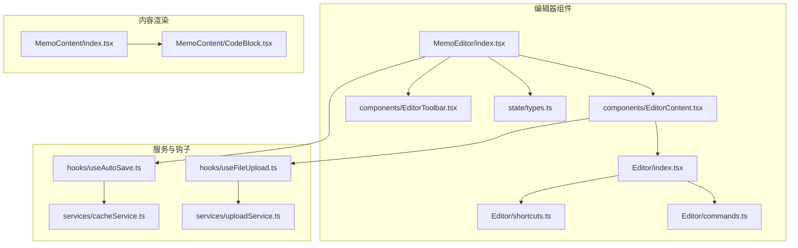
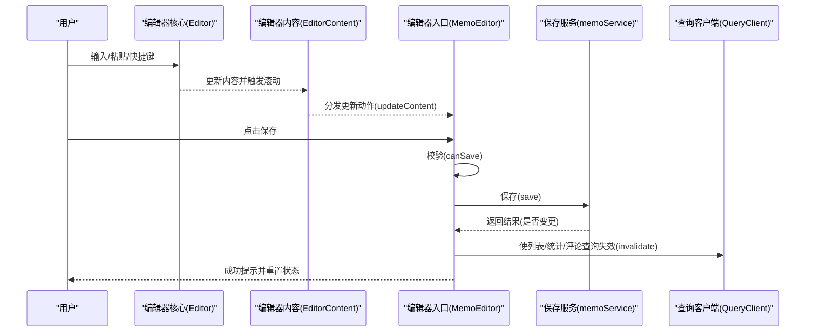
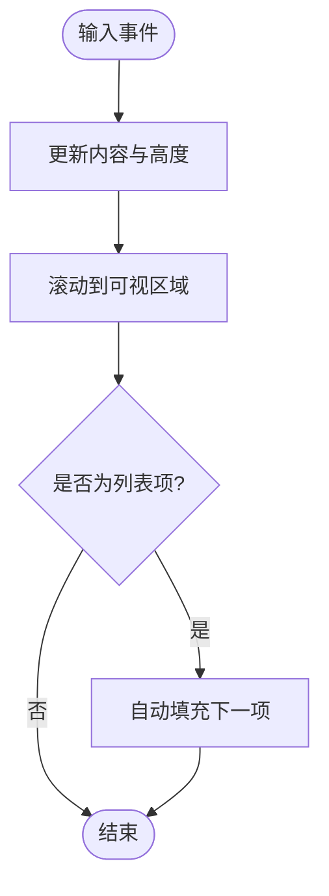
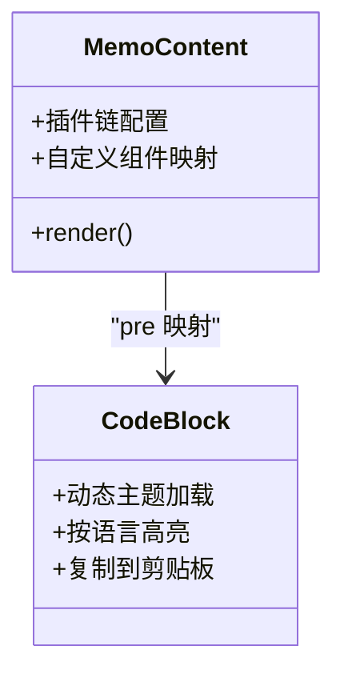
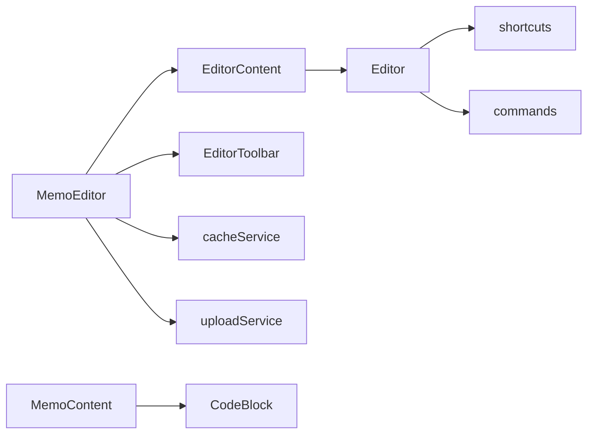

# 笔记编辑器组件

<cite>
**本文档引用的文件**
- [MemoEditor/index.tsx](file://web/src/components/MemoEditor/index.tsx)
- [MemoEditor/components/EditorContent.tsx](file://web/src/components/MemoEditor/components/EditorContent.tsx)
- [MemoEditor/Editor/index.tsx](file://web/src/components/MemoEditor/Editor/index.tsx)
- [MemoEditor/Editor/shortcuts.ts](file://web/src/components/MemoEditor/Editor/shortcuts.ts)
- [MemoEditor/Editor/commands.ts](file://web/src/components/MemoEditor/Editor/commands.ts)
- [MemoEditor/components/EditorToolbar.tsx](file://web/src/components/MemoEditor/components/EditorToolbar.tsx)
- [MemoEditor/state/types.ts](file://web/src/components/MemoEditor/state/types.ts)
- [MemoEditor/hooks/useAutoSave.ts](file://web/src/components/MemoEditor/hooks/useAutoSave.ts)
- [MemoEditor/services/cacheService.ts](file://web/src/components/MemoEditor/services/cacheService.ts)
- [MemoEditor/hooks/useFileUpload.ts](file://web/src/components/MemoEditor/hooks/useFileUpload.ts)
- [MemoEditor/services/uploadService.ts](file://web/src/components/MemoEditor/services/uploadService.ts)
- [MemoContent/index.tsx](file://web/src/components/MemoContent/index.tsx)
- [MemoContent/CodeBlock.tsx](file://web/src/components/MemoContent/CodeBlock.tsx)
</cite>

## 目录
1. [简介](#简介)
2. [项目结构](#项目结构)
3. [核心组件](#核心组件)
4. [架构总览](#架构总览)
5. [详细组件分析](#详细组件分析)
6. [依赖关系分析](#依赖关系分析)
7. [性能考虑](#性能考虑)
8. [故障排除指南](#故障排除指南)
9. [结论](#结论)
10. [附录](#附录)

## 简介
本文件面向“笔记编辑器组件”的技术与非技术读者，系统性阐述富文本编辑器的实现方式，包括：
- Markdown 解析与渲染（含数学公式、表格、任务列表、标签等）
- 实时预览与滚动行为
- 语法高亮与代码块渲染
- 编辑器工具栏、快捷键系统
- 自动保存机制与本地缓存
- 附件上传与拖拽支持
- 内容渲染组件、标签系统、任务列表与链接处理
- 编辑器集成、自定义扩展与性能优化最佳实践

## 项目结构
编辑器位于前端工程的组件目录中，采用“按功能域分层”的组织方式：编辑器入口、编辑器核心、工具栏、状态管理、服务与钩子、以及内容渲染组件。

图表来源
- [MemoEditor/index.tsx](file://web/src/components/MemoEditor/index.tsx#L21-L162)
- [MemoEditor/components/EditorContent.tsx](file://web/src/components/MemoEditor/components/EditorContent.tsx#L8-L52)
- [MemoEditor/Editor/index.tsx](file://web/src/components/MemoEditor/Editor/index.tsx#L27-L211)
- [MemoEditor/components/EditorToolbar.tsx](file://web/src/components/MemoEditor/components/EditorToolbar.tsx#L11-L67)
- [MemoEditor/state/types.ts](file://web/src/components/MemoEditor/state/types.ts#L8-L74)
- [MemoEditor/Editor/shortcuts.ts](file://web/src/components/MemoEditor/Editor/shortcuts.ts#L13-L70)
- [MemoEditor/Editor/commands.ts](file://web/src/components/MemoEditor/Editor/commands.ts#L7-L28)
- [MemoEditor/hooks/useAutoSave.ts](file://web/src/components/MemoEditor/hooks/useAutoSave.ts#L4-L9)
- [MemoEditor/services/cacheService.ts](file://web/src/components/MemoEditor/services/cacheService.ts#L5-L25)
- [MemoEditor/hooks/useFileUpload.ts](file://web/src/components/MemoEditor/hooks/useFileUpload.ts#L4-L34)
- [MemoEditor/services/uploadService.ts](file://web/src/components/MemoEditor/services/uploadService.ts#L7-L28)
- [MemoContent/index.tsx](file://web/src/components/MemoContent/index.tsx#L23-L91)
- [MemoContent/CodeBlock.tsx](file://web/src/components/MemoContent/CodeBlock.tsx#L16-L136)

章节来源
- [MemoEditor/index.tsx](file://web/src/components/MemoEditor/index.tsx#L21-L162)
- [MemoEditor/components/EditorContent.tsx](file://web/src/components/MemoEditor/components/EditorContent.tsx#L8-L52)
- [MemoEditor/Editor/index.tsx](file://web/src/components/MemoEditor/Editor/index.tsx#L27-L211)

## 核心组件
- 编辑器入口与生命周期控制：负责初始化、自动保存、焦点模式、键盘快捷键、保存流程与缓存失效。
- 编辑器核心：基于 textarea 的可伸缩输入框，提供插入/删除文本、光标定位、行号获取、滚动到可视区域等能力；内置列表自动补全、标签建议与斜杠命令面板。
- 工具栏：提供插入菜单（上传、位置、专注模式）、可见性选择、AI 标签建议、保存/取消按钮。
- 状态管理：集中维护内容、元数据（可见性、附件、关系、位置）、UI 状态（专注模式、加载、拖拽、输入法组合）与时间戳、本地文件列表。
- 服务与钩子：自动保存（localStorage + 防抖）、文件上传（逐个上传并返回附件）、拖拽与粘贴处理、虚拟键盘高度适配。
- 内容渲染：使用 ReactMarkdown + 插件链渲染 Markdown，支持数学公式、GFM、换行、标签与任务列表节点，代码块高亮与复制。

章节来源
- [MemoEditor/components/EditorContent.tsx](file://web/src/components/MemoEditor/components/EditorContent.tsx#L8-L52)
- [MemoEditor/Editor/index.tsx](file://web/src/components/MemoEditor/Editor/index.tsx#L27-L211)
- [MemoEditor/components/EditorToolbar.tsx](file://web/src/components/MemoEditor/components/EditorToolbar.tsx#L11-L67)
- [MemoEditor/state/types.ts](file://web/src/components/MemoEditor/state/types.ts#L8-L74)
- [MemoContent/index.tsx](file://web/src/components/MemoContent/index.tsx#L23-L91)

## 架构总览
编辑器采用“组件 + 状态 + 服务”的分层设计，编辑器核心通过 ref 暴露统一操作接口，工具栏与入口组件通过上下文与服务协作完成保存、上传、渲染等流程。

图表来源
- [MemoEditor/Editor/index.tsx](file://web/src/components/MemoEditor/Editor/index.tsx#L166-L175)
- [MemoEditor/components/EditorContent.tsx](file://web/src/components/MemoEditor/components/EditorContent.tsx#L28-L30)
- [MemoEditor/index.tsx](file://web/src/components/MemoEditor/index.tsx#L77-L125)

## 详细组件分析

### 编辑器核心（Editor）
- 能力概览
  - 可伸缩高度：根据内容高度动态调整 textarea 行数
  - 光标与滚动：计算光标坐标，保持可视区域稳定滚动
  - 文本操作：插入/删除/替换、设置/获取内容、选区与行级操作
  - 列表自动补全：在输入列表后自动延续下一项
  - IME 组合态：标记输入法组合状态，避免误触发
  - 建议与命令：标签建议、斜杠命令面板
- 关键流程
  - 初始化：设置初始内容并回调一次内容变更
  - 外部变更：当外部重置或回滚时同步内部值
  - 输入事件：触发内容变更与高度更新，并滚动到可视区域

图表来源
- [MemoEditor/Editor/index.tsx](file://web/src/components/MemoEditor/Editor/index.tsx#L48-L91)
- [MemoEditor/Editor/index.tsx](file://web/src/components/MemoEditor/Editor/index.tsx#L166-L182)

章节来源
- [MemoEditor/Editor/index.tsx](file://web/src/components/MemoEditor/Editor/index.tsx#L27-L211)

### 编辑器内容（EditorContent）
- 职责
  - 将拖拽/粘贴的文件转换为本地预览对象并加入状态
  - 透传编辑器核心的所有回调与属性
  - 管理 IME 组合态（开始/结束）
- 交互
  - 拖拽：批量文件转本地对象并添加到状态
  - 组合：设置/清除组合态，避免输入法期间的误操作

章节来源
- [MemoEditor/components/EditorContent.tsx](file://web/src/components/MemoEditor/components/EditorContent.tsx#L8-L52)

### 快捷键系统（shortcuts）
- 支持
  - 加粗：Ctrl/Cmd+B，自动包裹选中文本或移除外层包裹
  - 斜体：Ctrl/Cmd+I，同上策略
  - 链接：Ctrl/Cmd+K，若选中内容为 URL，则直接包裹为链接；否则插入占位符并定位到 URL 位置
- 设计要点
  - 使用 preventDefault 阻止浏览器默认行为
  - 选区与光标位置精确计算，保证用户体验一致

章节来源
- [MemoEditor/Editor/shortcuts.ts](file://web/src/components/MemoEditor/Editor/shortcuts.ts#L13-L70)

### 斜杠命令（Slash Commands）
- 命令集
  - 待办：插入待办项前缀
  - 代码：插入三反引号代码块框架
  - 链接：插入链接占位符
  - 表格：插入基础表格骨架
- 执行
  - 通过命令数组驱动，插入占位符并可选地将光标移动到指定偏移

章节来源
- [MemoEditor/Editor/commands.ts](file://web/src/components/MemoEditor/Editor/commands.ts#L7-L28)

### 工具栏（EditorToolbar）
- 功能
  - 插入菜单：上传、位置、专注模式切换
  - 可见性选择：私有/公开/部分可见
  - AI 标签建议：从当前内容提取建议并一键插入
  - 保存/取消：校验通过后保存，失败禁用
- 交互
  - 位置变更、可见性变更、插入标签均通过状态动作更新
  - 保存按钮禁用条件：未通过校验或正在保存

章节来源
- [MemoEditor/components/EditorToolbar.tsx](file://web/src/components/MemoEditor/components/EditorToolbar.tsx#L11-L67)

### 状态管理（state/types）
- 状态结构
  - content：编辑器内容
  - metadata：visibility、attachments、relations、location
  - ui：isFocusMode、isLoading(saving/uploading/loading)、isDragging、isComposing
  - timestamps：createTime/updateTime
  - localFiles：本地文件列表
- 动作类型
  - INIT_MEMO、UPDATE_CONTENT、SET_METADATA、ADD_ATTACHMENT、REMOVE_ATTACHMENT、ADD_RELATION、REMOVE_RELATION、ADD_LOCAL_FILE、REMOVE_LOCAL_FILE、CLEAR_LOCAL_FILES、TOGGLE_FOCUS_MODE、SET_LOADING、SET_DRAGGING、SET_COMPOSING、RESET

章节来源
- [MemoEditor/state/types.ts](file://web/src/components/MemoEditor/state/types.ts#L8-L74)

### 自动保存与缓存（useAutoSave + cacheService）
- 机制
  - useAutoSave 在每次内容变化时调用缓存服务
  - cacheService 使用防抖（默认 500ms）写入 localStorage，空内容则清理
  - 缓存键由用户名与缓存标识拼接组成
- 效果
  - 减少服务器压力，提升断网场景下的可用性
  - 保存成功后主动清理对应键值

章节来源
- [MemoEditor/hooks/useAutoSave.ts](file://web/src/components/MemoEditor/hooks/useAutoSave.ts#L4-L9)
- [MemoEditor/services/cacheService.ts](file://web/src/components/MemoEditor/services/cacheService.ts#L5-L25)

### 附件上传（useFileUpload + uploadService）
- 流程
  - useFileUpload 触发文件选择，生成本地预览 URL 并回调
  - uploadService 逐个上传文件，返回附件信息
- 注意
  - 上传过程在工具栏中以“上传中”状态禁用其他交互
  - 上传完成后将附件加入状态，供保存流程一并提交

章节来源
- [MemoEditor/hooks/useFileUpload.ts](file://web/src/components/MemoEditor/hooks/useFileUpload.ts#L4-L34)
- [MemoEditor/services/uploadService.ts](file://web/src/components/MemoEditor/services/uploadService.ts#L7-L28)

### 内容渲染（MemoContent + CodeBlock）
- 渲染管线
  - ReactMarkdown + 插件链：remarkDisableSetext、remarkMath、remarkGfm、remarkBreaks、remarkTag、remarkPreserveType；rehypeRaw、rehypeKatex、rehypeSanitize
  - 自定义组件映射：input（任务列表）、span（标签）、pre（代码块）、a（外链）
- 代码块高亮
  - 动态加载 highlight.js 主题（深色/浅色），按语言高亮
  - 提供复制到剪贴板能力（优先原生 Clipboard API，失败回退）
  - 特殊语言：mermaid 使用专用组件渲染
- 安全
  - rehypeSanitize + 自定义 schema 过滤不安全标签与属性

图表来源
- [MemoContent/index.tsx](file://web/src/components/MemoContent/index.tsx#L46-L73)
- [MemoContent/CodeBlock.tsx](file://web/src/components/MemoContent/CodeBlock.tsx#L16-L136)

章节来源
- [MemoContent/index.tsx](file://web/src/components/MemoContent/index.tsx#L23-L91)
- [MemoContent/CodeBlock.tsx](file://web/src/components/MemoContent/CodeBlock.tsx#L16-L136)

## 依赖关系分析
- 组件耦合
  - MemoEditor 作为容器，聚合 EditorContent、EditorToolbar、状态与服务
  - EditorContent 仅依赖 Editor 与状态动作，低耦合
  - Editor 依赖快捷键与命令模块，便于扩展
- 外部依赖
  - ReactMarkdown 生态（remark/rehype 插件）
  - highlight.js 用于代码高亮
  - react-hot-toast 用于错误与提示
  - @bufbuild/protobuf 与 Connect 客户端进行附件上传
- 数据流
  - 输入 → Editor → EditorContent → 状态动作 → MemoEditor → 保存服务 → 查询失效 → UI 更新

图表来源
- [MemoEditor/Editor/index.tsx](file://web/src/components/MemoEditor/Editor/index.tsx#L27-L211)
- [MemoEditor/Editor/shortcuts.ts](file://web/src/components/MemoEditor/Editor/shortcuts.ts#L13-L70)
- [MemoEditor/Editor/commands.ts](file://web/src/components/MemoEditor/Editor/commands.ts#L7-L28)
- [MemoEditor/components/EditorContent.tsx](file://web/src/components/MemoEditor/components/EditorContent.tsx#L8-L52)
- [MemoEditor/index.tsx](file://web/src/components/MemoEditor/index.tsx#L21-L162)
- [MemoEditor/services/cacheService.ts](file://web/src/components/MemoEditor/services/cacheService.ts#L5-L25)
- [MemoEditor/services/uploadService.ts](file://web/src/components/MemoEditor/services/uploadService.ts#L7-L28)
- [MemoContent/index.tsx](file://web/src/components/MemoContent/index.tsx#L46-L73)
- [MemoContent/CodeBlock.tsx](file://web/src/components/MemoContent/CodeBlock.tsx#L16-L136)

## 性能考虑
- 防抖与节流
  - 自动保存使用防抖（500ms），降低频繁写入 localStorage 的开销
  - 高频输入事件中仅更新高度与滚动，避免不必要的重渲染
- 渲染优化
  - MemoContent 使用 memo 包裹，减少重复渲染
  - 代码块高亮按需加载主题样式，避免全局样式污染
- 计算复杂度
  - 文本操作（插入/删除/定位）为 O(n)，其中 n 为当前内容长度
  - 列表自动补全在 Enter 时触发，仅对当前行进行处理
- I/O 优化
  - 附件上传逐个进行，避免大文件阻塞
  - 上传与保存阶段禁用交互，减少无效请求

## 故障排除指南
- 无法保存
  - 检查校验服务返回的 valid 字段与原因
  - 查看保存阶段的错误处理与回退消息
- 保存后列表未刷新
  - 确认查询客户端的缓存失效是否执行（列表、统计、评论）
- 代码高亮异常
  - 确认主题样式是否正确注入
  - 检查语言识别是否成功，失败时回退为纯文本
- 上传失败
  - 检查文件大小/类型限制与网络状态
  - 确认上传服务返回的附件列表是否为空

章节来源
- [MemoEditor/index.tsx](file://web/src/components/MemoEditor/index.tsx#L77-L125)
- [MemoEditor/services/cacheService.ts](file://web/src/components/MemoEditor/services/cacheService.ts#L5-L25)
- [MemoContent/CodeBlock.tsx](file://web/src/components/MemoContent/CodeBlock.tsx#L40-L65)

## 结论
该编辑器组件通过清晰的分层与职责划分，实现了从输入、渲染到持久化的完整闭环。其特性包括：
- 基于 textarea 的轻量输入体验与可伸缩高度
- 丰富的 Markdown 支持与安全渲染
- 代码块高亮与复制、任务列表与标签识别
- 自动保存与附件上传的稳健流程
- 可扩展的命令与快捷键体系

建议在实际集成中关注：
- 与现有 Markdown 渲染生态的兼容性
- 附件上传与存储策略的扩展点
- 错误处理与用户反馈的一致性

## 附录
- 最佳实践
  - 自定义扩展：新增命令时遵循 editorCommands 接口，确保 cursorOffset 正确
  - 快捷键扩展：在 handleMarkdownShortcuts 中增加新键位，注意 preventDefault
  - 渲染增强：在 MemoContent 的组件映射中注册新的节点类型
  - 性能优化：对高频输入事件进行节流/防抖，延迟加载高成本资源（如主题样式）
- 常见问题
  - 选区与光标：始终在 IME 结束后再进行文本操作
  - 上传并发：逐个上传可简化错误处理，必要时再引入队列/并发控制