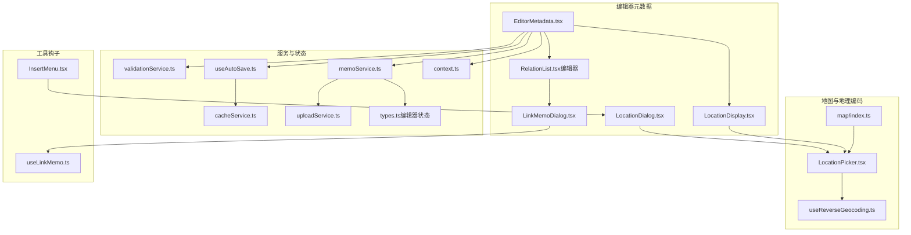
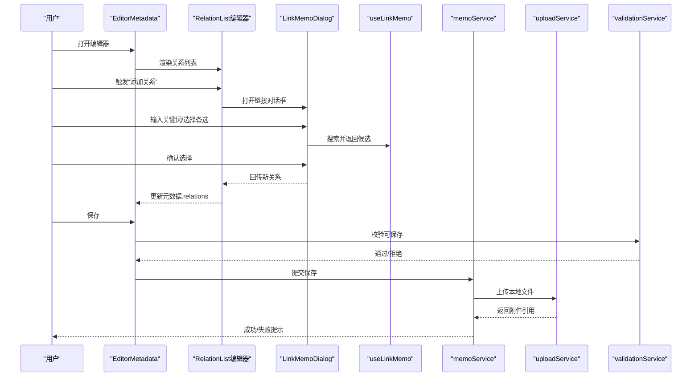
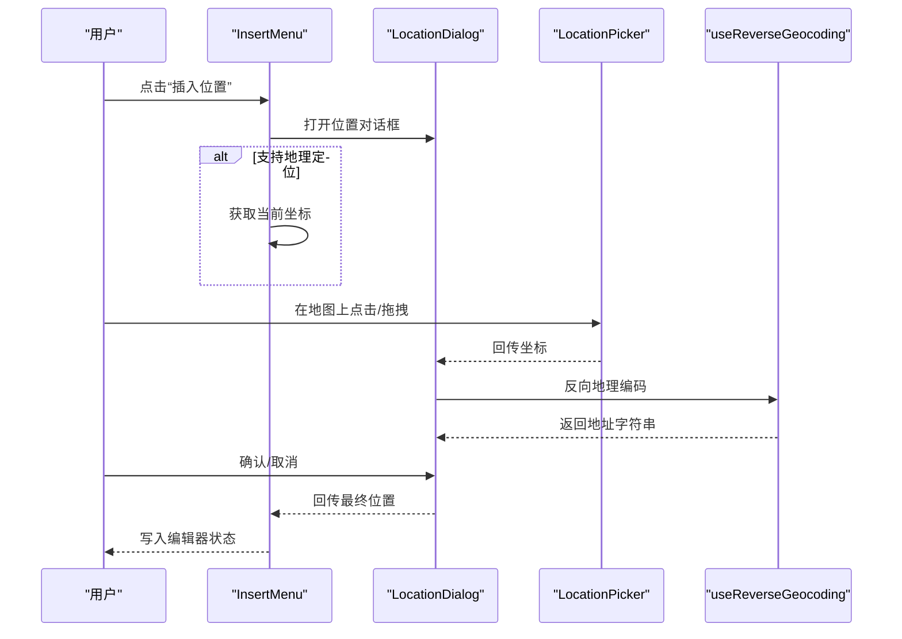
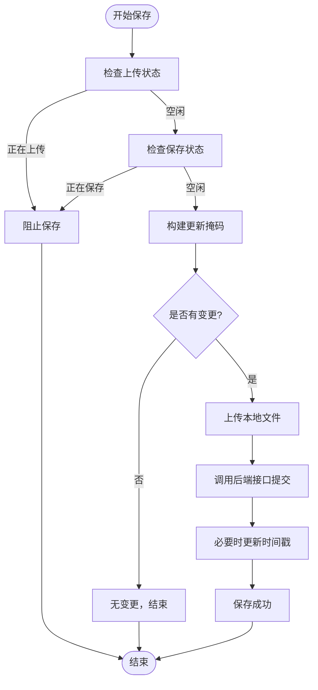
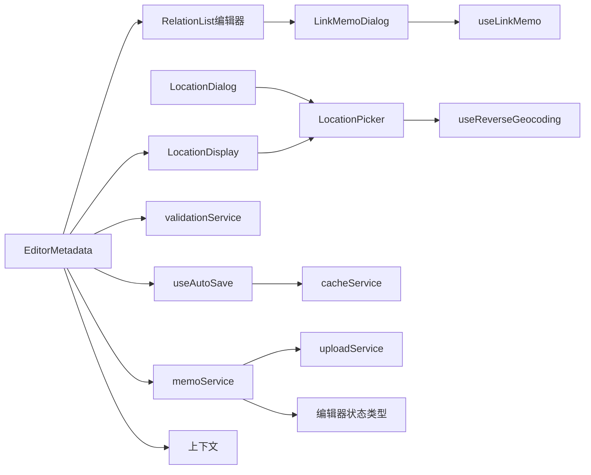

# 编辑器元数据

<cite>
**本文引用的文件**
- [EditorMetadata.tsx](file://web/src/components/MemoEditor/components/EditorMetadata.tsx)
- [index.ts](file://web/src/components/MemoEditor/components/index.ts)
- [LocationDialog.tsx](file://web/src/components/MemoEditor/components/LocationDialog.tsx)
- [LocationDisplay.tsx](file://web/src/components/MemoView/components/metadata/LocationDisplay.tsx)
- [InsertMenu.tsx](file://web/src/components/MemoEditor/Toolbar/InsertMenu.tsx)
- [LocationPicker.tsx](file://web/src/components/map/LocationPicker.tsx)
- [index.ts（map）](file://web/src/components/map/index.ts)
- [RelationList.tsx（编辑器）](file://web/src/components/MemoEditor/components/RelationList.tsx)
- [RelationList.tsx（视图）](file://web/src/components/MemoView/components/metadata/RelationList.tsx)
- [LinkMemoDialog.tsx](file://web/src/components/MemoEditor/components/LinkMemoDialog.tsx)
- [useLinkMemo.ts](file://web/src/components/MemoEditor/hooks/useLinkMemo.ts)
- [validationService.ts](file://web/src/components/MemoEditor/services/validationService.ts)
- [useAutoSave.ts](file://web/src/components/MemoEditor/hooks/useAutoSave.ts)
- [cacheService.ts](file://web/src/components/MemoEditor/services/cacheService.ts)
- [uploadService.ts](file://web/src/components/MemoEditor/services/uploadService.ts)
- [memoService.ts](file://web/src/components/MemoEditor/services/memoService.ts)
- [types.ts（编辑器状态）](file://web/src/components/MemoEditor/state/types.ts)
- [context.ts](file://web/src/components/MemoEditor/types/context.ts)
- [README.md（编辑器）](file://web/src/components/MemoEditor/README.md)
- [useReverseGeocoding.ts](file://web/src/components/map/useReverseGeocoding.ts)
</cite>

## 目录
1. [简介](#简介)
2. [项目结构](#项目结构)
3. [核心组件](#核心组件)
4. [架构总览](#架构总览)
5. [组件详解](#组件详解)
6. [依赖关系分析](#依赖关系分析)
7. [性能与可用性](#性能与可用性)
8. [故障排查](#故障排查)
9. [结论](#结论)
10. [附录：最佳实践清单](#附录最佳实践清单)

## 简介
本文件聚焦“编辑器元数据”能力，系统化梳理标签附件、位置信息与链接关系的编辑体验，覆盖地图集成、坐标处理、笔记链接对话框、元数据验证、自动保存与同步策略，并给出地理编码、链接解析与数据绑定的最佳实践建议。

## 项目结构
编辑器元数据相关代码主要位于前端 Web 工程中，围绕 MemoEditor 组件体系组织，辅以地图组件与查询工具。

图表来源
- [EditorMetadata.tsx](file://web/src/components/MemoEditor/components/EditorMetadata.tsx#L1-L31)
- [RelationList.tsx（编辑器）](file://web/src/components/MemoEditor/components/RelationList.tsx#L1-L93)
- [LinkMemoDialog.tsx](file://web/src/components/MemoEditor/components/LinkMemoDialog.tsx#L1-L85)
- [LocationDialog.tsx](file://web/src/components/MemoEditor/components/LocationDialog.tsx#L1-L58)
- [LocationDisplay.tsx](file://web/src/components/MemoView/components/metadata/LocationDisplay.tsx#L1-L52)
- [LocationPicker.tsx](file://web/src/components/map/LocationPicker.tsx#L1-L51)
- [useReverseGeocoding.ts](file://web/src/components/map/useReverseGeocoding.ts#L1-L40)
- [validationService.ts](file://web/src/components/MemoEditor/services/validationService.ts#L1-L27)
- [useAutoSave.ts](file://web/src/components/MemoEditor/hooks/useAutoSave.ts#L1-L9)
- [cacheService.ts](file://web/src/components/MemoEditor/services/cacheService.ts#L1-L26)
- [uploadService.ts](file://web/src/components/MemoEditor/services/uploadService.ts#L1-L29)
- [memoService.ts](file://web/src/components/MemoEditor/services/memoService.ts#L31-L95)
- [types.ts（编辑器状态）](file://web/src/components/MemoEditor/state/types.ts#L1-L74)
- [context.ts](file://web/src/components/MemoEditor/types/context.ts#L1-L27)
- [useLinkMemo.ts](file://web/src/components/MemoEditor/hooks/useLinkMemo.ts#L1-L29)
- [InsertMenu.tsx](file://web/src/components/MemoEditor/Toolbar/InsertMenu.tsx#L73-L106)

章节来源
- [README.md（编辑器）](file://web/src/components/MemoEditor/README.md#L40-L74)

## 核心组件
- 元数据容器：负责聚合“附件列表”“关系列表”“位置展示”，统一驱动状态变更。
- 关系列表（编辑器侧）：支持添加/删除关系，内置去重与过滤，联动“链接对话框”进行检索与插入。
- 位置对话框：提供地图拾取与手动坐标输入，支持反向地理编码生成占位名。
- 地图选择器：Leaflet 集成，支持点击拾点、定位与只读模式。
- 验证服务：在保存前校验内容/附件/上传状态等前置条件。
- 自动保存与缓存：基于防抖本地存储，避免频繁写入。
- 上传服务：批量上传本地文件为附件。
- 同步服务：构建更新掩码，按需提交字段变更并自动更新时间戳。

章节来源
- [EditorMetadata.tsx](file://web/src/components/MemoEditor/components/EditorMetadata.tsx#L1-L31)
- [RelationList.tsx（编辑器）](file://web/src/components/MemoEditor/components/RelationList.tsx#L1-L93)
- [LocationDialog.tsx](file://web/src/components/MemoEditor/components/LocationDialog.tsx#L1-L58)
- [LocationPicker.tsx](file://web/src/components/map/LocationPicker.tsx#L1-L51)
- [validationService.ts](file://web/src/components/MemoEditor/services/validationService.ts#L1-L27)
- [useAutoSave.ts](file://web/src/components/MemoEditor/hooks/useAutoSave.ts#L1-L9)
- [cacheService.ts](file://web/src/components/MemoEditor/services/cacheService.ts#L1-L26)
- [uploadService.ts](file://web/src/components/MemoEditor/services/uploadService.ts#L1-L29)
- [memoService.ts](file://web/src/components/MemoEditor/services/memoService.ts#L31-L95)

## 架构总览
编辑器元数据遵循“状态驱动 + 服务解耦”的设计：组件仅负责渲染与动作分发，业务逻辑由纯函数服务封装，通过上下文与 reducer 统一调度。

图表来源
- [EditorMetadata.tsx](file://web/src/components/MemoEditor/components/EditorMetadata.tsx#L1-L31)
- [RelationList.tsx（编辑器）](file://web/src/components/MemoEditor/components/RelationList.tsx#L1-L93)
- [LinkMemoDialog.tsx](file://web/src/components/MemoEditor/components/LinkMemoDialog.tsx#L1-L85)
- [useLinkMemo.ts](file://web/src/components/MemoEditor/hooks/useLinkMemo.ts#L1-L29)
- [memoService.ts](file://web/src/components/MemoEditor/services/memoService.ts#L76-L95)
- [uploadService.ts](file://web/src/components/MemoEditor/services/uploadService.ts#L7-L29)
- [validationService.ts](file://web/src/components/MemoEditor/services/validationService.ts#L8-L27)

## 组件详解

### 元数据容器：EditorMetadata
- 职责：聚合附件、关系、位置三类元数据，触发状态更新；位置存在时渲染只读展示。
- 数据绑定：通过上下文与动作分发，将子组件变更回流到编辑器状态树。
- 交互：位置展示支持弹出地图预览；关系列表支持增删；附件列表支持移除本地文件。

章节来源
- [EditorMetadata.tsx](file://web/src/components/MemoEditor/components/EditorMetadata.tsx#L1-L31)
- [index.ts](file://web/src/components/MemoEditor/components/index.ts#L1-L12)

### 关系管理：RelationList（编辑器侧）
- 功能：渲染关系卡片、支持移除；内部维护去重与过滤，避免自引用与重复项。
- 对话框联动：与 LinkMemoDialog 协作，提供搜索、高亮片段、选择插入。
- 数据来源：从编辑器状态读取现有关系，写回变更。

章节来源
- [RelationList.tsx（编辑器）](file://web/src/components/MemoEditor/components/RelationList.tsx#L1-L93)
- [LinkMemoDialog.tsx](file://web/src/components/MemoEditor/components/LinkMemoDialog.tsx#L1-L85)
- [useLinkMemo.ts](file://web/src/components/MemoEditor/hooks/useLinkMemo.ts#L1-L29)

### 笔记链接对话框：LinkMemoDialog
- 搜索与高亮：输入关键词后过滤备选，高亮匹配片段并截断前后文本。
- 选择与插入：点击备选项回调上层，完成关系对象注入。
- 加载态：根据 isFetching 控制加载文案与空态。

章节来源
- [LinkMemoDialog.tsx](file://web/src/components/MemoEditor/components/LinkMemoDialog.tsx#L1-L85)
- [useLinkMemo.ts](file://web/src/components/MemoEditor/hooks/useLinkMemo.ts#L17-L29)

### 位置显示与选择器
- 位置展示：LocationDisplay 将经纬度与占位名组合展示，Popover 内嵌只读地图选择器。
- 位置选择：LocationDialog 提供地图拾取与手动坐标输入，支持反向地理编码生成占位名。
- 地图集成：LocationPicker 基于 react-leaflet，支持点击拾点、定位与只读模式；地图工具导出主题瓦片与默认图标。
- 反向地理编码：useReverseGeocoding 使用 OpenStreetMap Nominatim，按经纬度返回地址字符串。

图表来源
- [InsertMenu.tsx](file://web/src/components/MemoEditor/Toolbar/InsertMenu.tsx#L73-L106)
- [LocationDialog.tsx](file://web/src/components/MemoEditor/components/LocationDialog.tsx#L1-L58)
- [LocationPicker.tsx](file://web/src/components/map/LocationPicker.tsx#L1-L51)
- [useReverseGeocoding.ts](file://web/src/components/map/useReverseGeocoding.ts#L1-L40)
- [LocationDisplay.tsx](file://web/src/components/MemoView/components/metadata/LocationDisplay.tsx#L1-L52)
- [index.ts（map）](file://web/src/components/map/index.ts#L1-L3)

### 元数据验证、自动保存与同步
- 验证规则：必须至少有内容、附件或本地文件之一；上传中/保存中不可再次保存。
- 自动保存：基于防抖本地存储，键名包含用户名与可选缓存键，空内容自动清理。
- 同步策略：memoService 构建更新掩码，仅提交变化字段；若涉及内容/附件/关系/位置任一项，自动更新更新时间；支持显式设置创建/更新时间。

图表来源
- [validationService.ts](file://web/src/components/MemoEditor/services/validationService.ts#L8-L27)
- [useAutoSave.ts](file://web/src/components/MemoEditor/hooks/useAutoSave.ts#L4-L9)
- [cacheService.ts](file://web/src/components/MemoEditor/services/cacheService.ts#L10-L16)
- [uploadService.ts](file://web/src/components/MemoEditor/services/uploadService.ts#L7-L29)
- [memoService.ts](file://web/src/components/MemoEditor/services/memoService.ts#L31-L74)

章节来源
- [validationService.ts](file://web/src/components/MemoEditor/services/validationService.ts#L1-L27)
- [useAutoSave.ts](file://web/src/components/MemoEditor/hooks/useAutoSave.ts#L1-L9)
- [cacheService.ts](file://web/src/components/MemoEditor/services/cacheService.ts#L1-L26)
- [uploadService.ts](file://web/src/components/MemoEditor/services/uploadService.ts#L1-L29)
- [memoService.ts](file://web/src/components/MemoEditor/services/memoService.ts#L31-L95)
- [types.ts（编辑器状态）](file://web/src/components/MemoEditor/state/types.ts#L1-L74)
- [context.ts](file://web/src/components/MemoEditor/types/context.ts#L1-L27)

## 依赖关系分析
- 组件耦合：EditorMetadata 低耦合地组合子组件，通过上下文与动作分发实现解耦。
- 服务内聚：validationService、cacheService、uploadService、memoService 各司其职，便于测试与演进。
- 外部依赖：地图使用 Leaflet 与 react-leaflet；地理编码依赖 Nominatim；后端通过 Connect 客户端访问。

图表来源
- [EditorMetadata.tsx](file://web/src/components/MemoEditor/components/EditorMetadata.tsx#L1-L31)
- [RelationList.tsx（编辑器）](file://web/src/components/MemoEditor/components/RelationList.tsx#L1-L93)
- [LinkMemoDialog.tsx](file://web/src/components/MemoEditor/components/LinkMemoDialog.tsx#L1-L85)
- [LocationDialog.tsx](file://web/src/components/MemoEditor/components/LocationDialog.tsx#L1-L58)
- [LocationDisplay.tsx](file://web/src/components/MemoView/components/metadata/LocationDisplay.tsx#L1-L52)
- [LocationPicker.tsx](file://web/src/components/map/LocationPicker.tsx#L1-L51)
- [useReverseGeocoding.ts](file://web/src/components/map/useReverseGeocoding.ts#L1-L40)
- [validationService.ts](file://web/src/components/MemoEditor/services/validationService.ts#L1-L27)
- [useAutoSave.ts](file://web/src/components/MemoEditor/hooks/useAutoSave.ts#L1-L9)
- [cacheService.ts](file://web/src/components/MemoEditor/services/cacheService.ts#L1-L26)
- [uploadService.ts](file://web/src/components/MemoEditor/services/uploadService.ts#L1-L29)
- [memoService.ts](file://web/src/components/MemoEditor/services/memoService.ts#L31-L95)
- [types.ts（编辑器状态）](file://web/src/components/MemoEditor/state/types.ts#L1-L74)
- [context.ts](file://web/src/components/MemoEditor/types/context.ts#L1-L27)

## 性能与可用性
- 防抖与节流：自动保存采用防抖，降低本地存储压力；链接搜索使用去抖动钩子，减少请求频率。
- 懒加载与只读模式：地图在弹窗打开时才渲染，只读模式下不响应交互，减少资源占用。
- 分块上传：本地文件逐个上传，避免单次大包阻塞。
- 时间戳更新：仅当变更字段命中时更新时间戳，减少无效写入。

[本节为通用指导，无需列出章节来源]

## 故障排查
- 无法保存
  - 检查是否处于上传/保存中；确认内容/附件/本地文件至少一项非空。
  - 参考路径：[validationService.ts](file://web/src/components/MemoEditor/services/validationService.ts#L8-L27)
- 位置未生效
  - 确认对话框已确认并回写到编辑器状态；检查坐标范围与占位名生成。
  - 参考路径：[LocationDialog.tsx](file://web/src/components/MemoEditor/components/LocationDialog.tsx#L1-L58)、[InsertMenu.tsx](file://web/src/components/MemoEditor/Toolbar/InsertMenu.tsx#L73-L106)
- 地图不响应点击
  - 确认非只读模式且地图已定位；检查权限与网络。
  - 参考路径：[LocationPicker.tsx](file://web/src/components/map/LocationPicker.tsx#L1-L51)
- 反向地理编码失败
  - 检查网络连通与 Nominatim 服务可用性；查看控制台错误日志。
  - 参考路径：[useReverseGeocoding.ts](file://web/src/components/map/useReverseGeocoding.ts#L1-L40)
- 自动保存未生效
  - 确认用户名与缓存键拼接正确；检查浏览器本地存储权限。
  - 参考路径：[cacheService.ts](file://web/src/components/MemoEditor/services/cacheService.ts#L6-L16)、[useAutoSave.ts](file://web/src/components/MemoEditor/hooks/useAutoSave.ts#L4-L9)

章节来源
- [validationService.ts](file://web/src/components/MemoEditor/services/validationService.ts#L8-L27)
- [LocationDialog.tsx](file://web/src/components/MemoEditor/components/LocationDialog.tsx#L1-L58)
- [InsertMenu.tsx](file://web/src/components/MemoEditor/Toolbar/InsertMenu.tsx#L73-L106)
- [LocationPicker.tsx](file://web/src/components/map/LocationPicker.tsx#L1-L51)
- [useReverseGeocoding.ts](file://web/src/components/map/useReverseGeocoding.ts#L1-L40)
- [cacheService.ts](file://web/src/components/MemoEditor/services/cacheService.ts#L6-L16)
- [useAutoSave.ts](file://web/src/components/MemoEditor/hooks/useAutoSave.ts#L4-L9)

## 结论
编辑器元数据以清晰的职责边界与服务化设计，实现了标签/附件/关系/位置的统一管理。通过地图与地理编码工具链、完善的验证与自动保存机制，以及按需更新的时间戳策略，整体具备良好的扩展性与可用性。

[本节为总结性内容，无需列出章节来源]

## 附录：最佳实践清单
- 元数据验证
  - 在保存前执行多维校验（内容/附件/上传/保存状态），并在 UI 明确提示原因。
  - 参考路径：[validationService.ts](file://web/src/components/MemoEditor/services/validationService.ts#L8-L27)
- 自动保存与同步
  - 使用防抖本地存储作为“草稿”，结合后端更新掩码实现最小化写入。
  - 参考路径：[useAutoSave.ts](file://web/src/components/MemoEditor/hooks/useAutoSave.ts#L4-L9)、[cacheService.ts](file://web/src/components/MemoEditor/services/cacheService.ts#L10-L16)、[memoService.ts](file://web/src/components/MemoEditor/services/memoService.ts#L31-L74)
- 附件与上传
  - 本地文件先上传再合并到现有附件，确保一致性与幂等。
  - 参考路径：[uploadService.ts](file://web/src/components/MemoEditor/services/uploadService.ts#L7-L29)、[memoService.ts](file://web/src/components/MemoEditor/services/memoService.ts#L84-L95)
- 地理位置服务
  - 优先使用地图拾取；若无网络或失败，允许手动输入坐标；反向地理编码作为占位名来源。
  - 参考路径：[LocationDialog.tsx](file://web/src/components/MemoEditor/components/LocationDialog.tsx#L1-L58)、[useReverseGeocoding.ts](file://web/src/components/map/useReverseGeocoding.ts#L1-L40)
- 链接解析与数据绑定
  - 关系去重与过滤，避免自引用；对话框搜索与高亮提升可发现性。
  - 参考路径：[RelationList.tsx（编辑器）](file://web/src/components/MemoEditor/components/RelationList.tsx#L23-L25)、[LinkMemoDialog.tsx](file://web/src/components/MemoEditor/components/LinkMemoDialog.tsx#L72-L74)