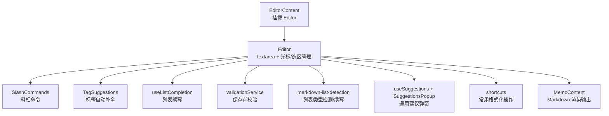
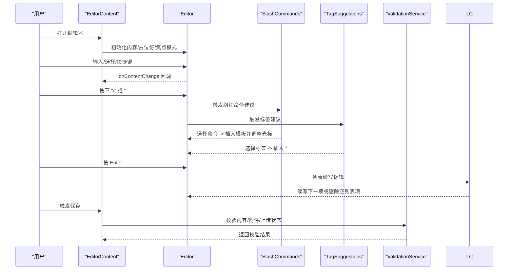
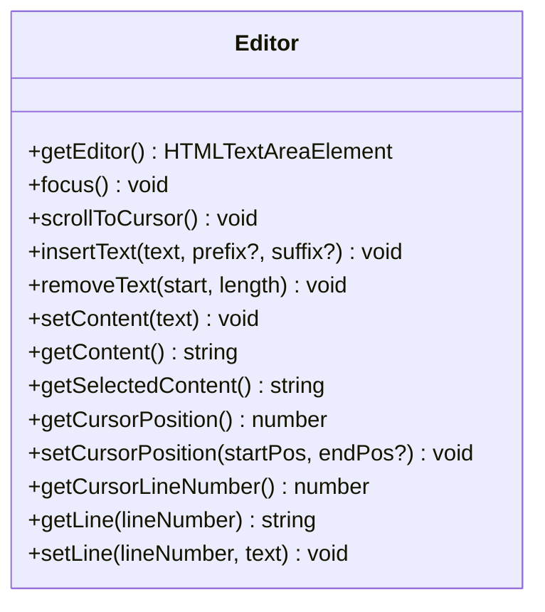
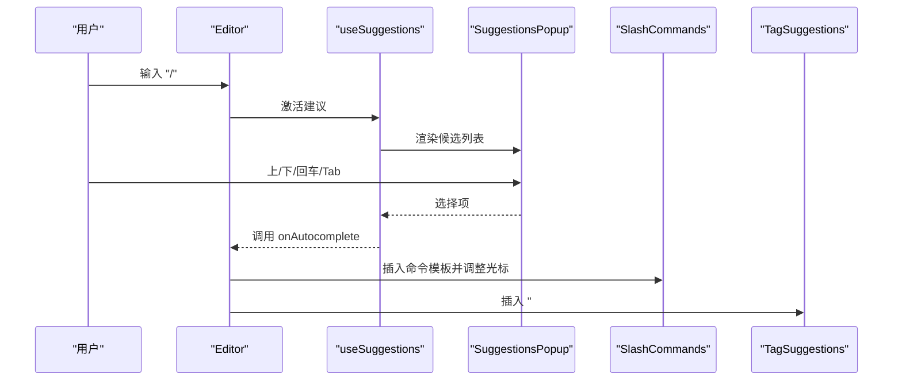
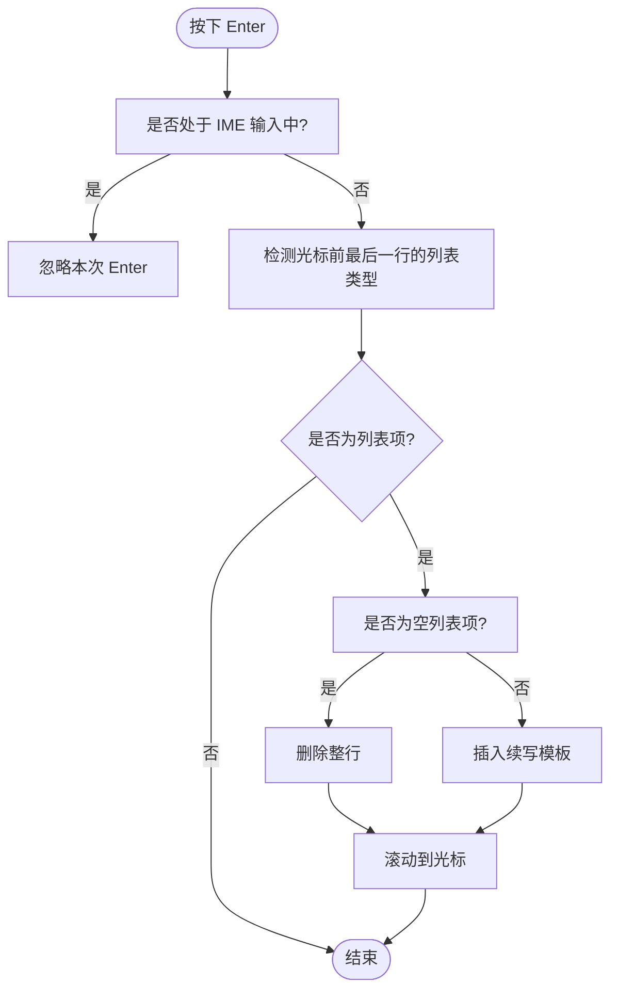
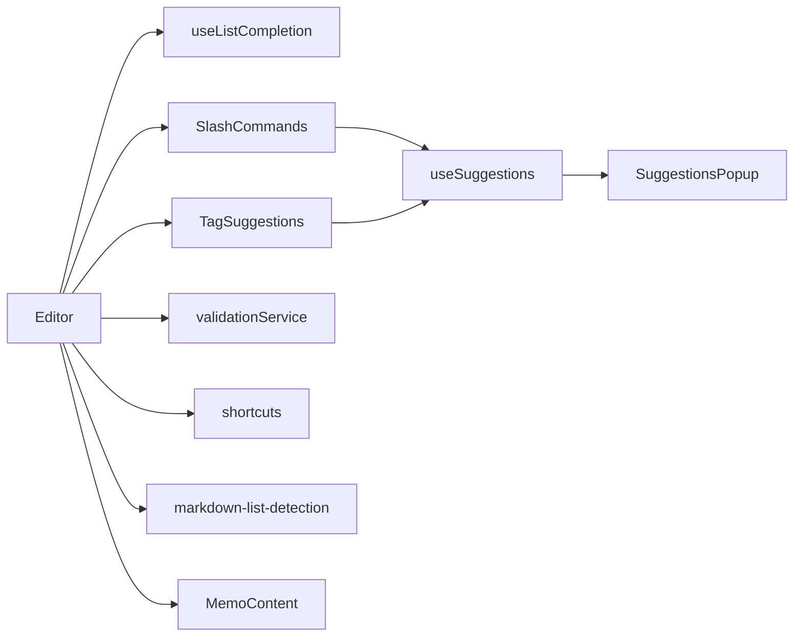

# 编辑器内容

<cite>
**本文引用的文件**
- [web/src/components/MemoEditor/Editor/index.tsx](file://web/src/components/MemoEditor/Editor/index.tsx)
- [web/src/components/MemoEditor/Editor/commands.ts](file://web/src/components/MemoEditor/Editor/commands.ts)
- [web/src/components/MemoEditor/Editor/useListCompletion.ts](file://web/src/components/MemoEditor/Editor/useListCompletion.ts)
- [web/src/components/MemoEditor/Editor/SlashCommands.tsx](file://web/src/components/MemoEditor/Editor/SlashCommands.tsx)
- [web/src/components/MemoEditor/Editor/TagSuggestions.tsx](file://web/src/components/MemoEditor/Editor/TagSuggestions.tsx)
- [web/src/components/MemoEditor/Editor/useSuggestions.ts](file://web/src/components/MemoEditor/Editor/useSuggestions.ts)
- [web/src/components/MemoEditor/Editor/SuggestionsPopup.tsx](file://web/src/components/MemoEditor/Editor/SuggestionsPopup.tsx)
- [web/src/components/MemoEditor/Editor/shortcuts.ts](file://web/src/components/MemoEditor/Editor/shortcuts.ts)
- [web/src/components/MemoEditor/components/EditorContent.tsx](file://web/src/components/MemoEditor/components/EditorContent.tsx)
- [web/src/components/MemoEditor/constants.ts](file://web/src/components/MemoEditor/constants.ts)
- [web/src/components/MemoEditor/state/types.ts](file://web/src/components/MemoEditor/state/types.ts)
- [web/src/utils/markdown-list-detection.ts](file://web/src/utils/markdown-list-detection.ts)
- [web/src/components/MemoContent/index.tsx](file://web/src/components/MemoContent/index.tsx)
- [web/src/components/KeyboardShortcutsHelp.tsx](file://web/src/components/KeyboardShortcutsHelp.tsx)
- [web/src/components/MemoEditor/services/validationService.ts](file://web/src/components/MemoEditor/services/validationService.ts)
</cite>

## 目录
1. [简介](#简介)
2. [项目结构](#项目结构)
3. [核心组件](#核心组件)
4. [架构总览](#架构总览)
5. [详细组件分析](#详细组件分析)
6. [依赖关系分析](#依赖关系分析)
7. [性能考虑](#性能考虑)
8. [故障排查指南](#故障排查指南)
9. [结论](#结论)
10. [附录](#附录)

## 简介
本文件聚焦“编辑器内容”子系统，系统性阐述富文本编辑器（基于原生 textarea 的 Markdown 编辑器）在前端的实现与使用方式，覆盖以下主题：
- 内容可编辑区域与光标管理：通过 textarea 实现内容输入、选区获取与设置、行号定位、滚动对齐等。
- 文本选择与插入：支持在当前光标或选区范围内进行插入、删除、替换，并自动维护光标位置。
- 快捷键系统：统一的键盘事件处理与命令绑定，结合“斜杠命令”“标签自动补全”等交互。
- Markdown 语法支持：列表自动续写、任务列表、有序/无序列表、粗体/斜体/链接等。
- 智能提示与自动完成：基于触发字符的建议弹窗，支持上下键导航、回车/Tab 选择。
- 内容验证、格式化与同步：保存前校验、内容变更回调、外部内容同步更新。
- 性能优化与跨浏览器兼容：高度自适应、IME 输入处理、滚动与渲染节流策略。

## 项目结构
编辑器相关代码主要位于 web/src/components/MemoEditor 下，围绕“编辑器容器 + 命令与建议 + 列表续写 + 验证服务”的分层组织：
- 容器层：Editor 组件封装 textarea，暴露统一的编辑器动作接口；EditorContent 负责挂载 Editor 并传递状态。
- 功能层：SlashCommands、TagSuggestions、useListCompletion、useSuggestions、SuggestionsPopup 提供命令、标签、列表续写与通用建议能力。
- 工具层：markdown-list-detection 提供列表类型检测与续写模板生成；shortcuts 提供常用格式化操作。
- 状态与常量：state/types 定义编辑器状态与动作；constants 提供样式与尺寸常量。
- 展示层：MemoContent 使用 ReactMarkdown 渲染 Markdown 输出，配合插件链路支持 GFM、数学公式、标签扩展等。

图表来源
- [web/src/components/MemoEditor/components/EditorContent.tsx](file://web/src/components/MemoEditor/components/EditorContent.tsx#L36-L51)
- [web/src/components/MemoEditor/Editor/index.tsx](file://web/src/components/MemoEditor/Editor/index.tsx#L184-L210)
- [web/src/components/MemoEditor/Editor/SlashCommands.tsx](file://web/src/components/MemoEditor/Editor/SlashCommands.tsx#L6-L43)
- [web/src/components/MemoEditor/Editor/TagSuggestions.tsx](file://web/src/components/MemoEditor/Editor/TagSuggestions.tsx#L10-L50)
- [web/src/components/MemoEditor/Editor/useListCompletion.ts](file://web/src/components/MemoEditor/Editor/useListCompletion.ts#L20-L82)
- [web/src/utils/markdown-list-detection.ts](file://web/src/utils/markdown-list-detection.ts#L9-L67)
- [web/src/components/MemoEditor/Editor/useSuggestions.ts](file://web/src/components/MemoEditor/Editor/useSuggestions.ts#L28-L158)
- [web/src/components/MemoEditor/Editor/SuggestionsPopup.tsx](file://web/src/components/MemoEditor/Editor/SuggestionsPopup.tsx#L20-L49)
- [web/src/components/MemoEditor/Editor/shortcuts.ts](file://web/src/components/MemoEditor/Editor/shortcuts.ts#L47-L70)
- [web/src/components/MemoEditor/services/validationService.ts](file://web/src/components/MemoEditor/services/validationService.ts#L8-L26)
- [web/src/components/MemoContent/index.tsx](file://web/src/components/MemoContent/index.tsx#L34-L62)

章节来源
- [web/src/components/MemoEditor/components/EditorContent.tsx](file://web/src/components/MemoEditor/components/EditorContent.tsx#L32-L54)
- [web/src/components/MemoEditor/Editor/index.tsx](file://web/src/components/MemoEditor/Editor/index.tsx#L27-L213)
- [web/src/components/MemoEditor/constants.ts](file://web/src/components/MemoEditor/constants.ts#L1-L17)

## 核心组件
- Editor：封装 textarea，提供统一的编辑器动作接口（获取/设置内容、光标位置、选区内容、插入/删除文本、滚动到光标等），并负责高度自适应与内容变更回调。
- EditorContent：作为上层容器，将 Editor 与状态（内容、焦点模式、IME 状态）对接，处理粘贴与组合输入事件。
- SlashCommands：以“/”为触发字符，提供命令列表与自动补全，支持将命令输出插入到光标处并调整光标偏移。
- TagSuggestions：以“#”为触发字符，展示标签建议，支持排序与过滤，插入时自动补全“#标签名 ”。
- useListCompletion：监听 Enter 键，在列表末尾自动续写下一项，或在空列表项时删除该行，避免重复换行。
- useSuggestions + SuggestionsPopup：通用建议弹窗框架，支持键盘导航（上下）、Esc/左右关闭、回车/Tab 选择。
- validationService：保存前校验，确保内容/附件/文件至少其一，且上传/保存未处于进行中。

章节来源
- [web/src/components/MemoEditor/Editor/index.tsx](file://web/src/components/MemoEditor/Editor/index.tsx#L11-L25)
- [web/src/components/MemoEditor/Editor/index.tsx](file://web/src/components/MemoEditor/Editor/index.tsx#L93-L150)
- [web/src/components/MemoEditor/Editor/index.tsx](file://web/src/components/MemoEditor/Editor/index.tsx#L177-L182)
- [web/src/components/MemoEditor/Editor/SlashCommands.tsx](file://web/src/components/MemoEditor/Editor/SlashCommands.tsx#L6-L43)
- [web/src/components/MemoEditor/Editor/TagSuggestions.tsx](file://web/src/components/MemoEditor/Editor/TagSuggestions.tsx#L10-L50)
- [web/src/components/MemoEditor/Editor/useListCompletion.ts](file://web/src/components/MemoEditor/Editor/useListCompletion.ts#L20-L82)
- [web/src/components/MemoEditor/Editor/useSuggestions.ts](file://web/src/components/MemoEditor/Editor/useSuggestions.ts#L28-L158)
- [web/src/components/MemoEditor/Editor/SuggestionsPopup.tsx](file://web/src/components/MemoEditor/Editor/SuggestionsPopup.tsx#L20-L49)
- [web/src/components/MemoEditor/services/validationService.ts](file://web/src/components/MemoEditor/services/validationService.ts#L8-L26)

## 架构总览
编辑器采用“容器 + 插件式功能模块”的架构：
- 容器层：Editor 负责 DOM 与事件，暴露动作接口。
- 命令与建议：SlashCommands、TagSuggestions 通过 useSuggestions 抽象复用建议逻辑。
- 列表续写：useListCompletion 与 markdown-list-detection 协作，识别列表类型并生成续写模板。
- 渲染与验证：EditorContent 将状态注入 Editor；validationService 在保存前进行一致性检查；MemoContent 将 Markdown 渲染为 UI。

图表来源
- [web/src/components/MemoEditor/components/EditorContent.tsx](file://web/src/components/MemoEditor/components/EditorContent.tsx#L36-L51)
- [web/src/components/MemoEditor/Editor/index.tsx](file://web/src/components/MemoEditor/Editor/index.tsx#L203-L206)
- [web/src/components/MemoEditor/Editor/SlashCommands.tsx](file://web/src/components/MemoEditor/Editor/SlashCommands.tsx#L17-L24)
- [web/src/components/MemoEditor/Editor/TagSuggestions.tsx](file://web/src/components/MemoEditor/Editor/TagSuggestions.tsx#L21-L31)
- [web/src/components/MemoEditor/Editor/useListCompletion.ts](file://web/src/components/MemoEditor/Editor/useListCompletion.ts#L40-L73)
- [web/src/components/MemoEditor/services/validationService.ts](file://web/src/components/MemoEditor/services/validationService.ts#L8-L26)

## 详细组件分析

### Editor 组件
- 作用：封装 textarea，提供统一的编辑器动作接口，处理高度自适应、滚动到光标、内容变更回调、IME 组合输入状态等。
- 关键能力：
  - 光标与选区：获取/设置光标位置、获取选中文本、按行读取/写入。
  - 文本插入/删除：在光标或选区范围内插入/删除文本，并自动维护光标位置。
  - 滚动对齐：根据光标坐标计算滚动位置，保证光标可见。
  - 外部内容同步：当外部传入的内容变化时，同步更新 textarea 值。
- 事件与回调：onInput、onCompositionStart/End、onPaste；通过回调通知上层内容变更。

图表来源
- [web/src/components/MemoEditor/Editor/index.tsx](file://web/src/components/MemoEditor/Editor/index.tsx#L11-L25)
- [web/src/components/MemoEditor/Editor/index.tsx](file://web/src/components/MemoEditor/Editor/index.tsx#L93-L150)

章节来源
- [web/src/components/MemoEditor/Editor/index.tsx](file://web/src/components/MemoEditor/Editor/index.tsx#L27-L213)

### SlashCommands 与 TagSuggestions
- 触发字符与过滤：分别以“/”和“#”为触发字符，支持按名称或包含关系过滤。
- 自动补全流程：移除触发词与匹配词，插入模板或标签名，必要时光标偏移至占位符位置。
- 建议弹窗：使用 SuggestionsPopup 渲染候选列表，支持键盘导航与鼠标选择。

图表来源
- [web/src/components/MemoEditor/Editor/SlashCommands.tsx](file://web/src/components/MemoEditor/Editor/SlashCommands.tsx#L6-L43)
- [web/src/components/MemoEditor/Editor/TagSuggestions.tsx](file://web/src/components/MemoEditor/Editor/TagSuggestions.tsx#L10-L50)
- [web/src/components/MemoEditor/Editor/useSuggestions.ts](file://web/src/components/MemoEditor/Editor/useSuggestions.ts#L28-L158)
- [web/src/components/MemoEditor/Editor/SuggestionsPopup.tsx](file://web/src/components/MemoEditor/Editor/SuggestionsPopup.tsx#L20-L49)

章节来源
- [web/src/components/MemoEditor/Editor/SlashCommands.tsx](file://web/src/components/MemoEditor/Editor/SlashCommands.tsx#L6-L43)
- [web/src/components/MemoEditor/Editor/TagSuggestions.tsx](file://web/src/components/MemoEditor/Editor/TagSuggestions.tsx#L10-L50)
- [web/src/components/MemoEditor/Editor/useSuggestions.ts](file://web/src/components/MemoEditor/Editor/useSuggestions.ts#L28-L158)
- [web/src/components/MemoEditor/Editor/SuggestionsPopup.tsx](file://web/src/components/MemoEditor/Editor/SuggestionsPopup.tsx#L20-L49)

### 列表续写与 Markdown 支持
- 列表类型检测：支持任务列表、无序列表、有序列表，识别缩进与符号。
- 续写规则：根据列表类型生成下一行模板，保持缩进与符号一致；空列表项回车时删除该行。
- Enter 键处理：在 Safari/IME 场景下存在竞态，通过 compositionend 时间戳规避重复换行。

图表来源
- [web/src/components/MemoEditor/Editor/useListCompletion.ts](file://web/src/components/MemoEditor/Editor/useListCompletion.ts#L20-L82)
- [web/src/utils/markdown-list-detection.ts](file://web/src/utils/markdown-list-detection.ts#L9-L67)

章节来源
- [web/src/components/MemoEditor/Editor/useListCompletion.ts](file://web/src/components/MemoEditor/Editor/useListCompletion.ts#L20-L82)
- [web/src/utils/markdown-list-detection.ts](file://web/src/utils/markdown-list-detection.ts#L9-L67)

### 快捷键系统与命令绑定
- 常用格式化：粗体、斜体、链接等，通过 shortcuts 中的工具函数实现“包裹选中文本”或“插入占位符并移动光标”。
- 命令集合：editorCommands 定义了 todo/code/link/table 等命令，支持 cursorOffset 控制插入后的光标位置。
- 键盘帮助：KeyboardShortcutsHelp 提供全局“?”打开帮助对话框，显示编辑、格式化、导航等快捷键。

章节来源
- [web/src/components/MemoEditor/Editor/shortcuts.ts](file://web/src/components/MemoEditor/Editor/shortcuts.ts#L47-L70)
- [web/src/components/MemoEditor/Editor/commands.ts](file://web/src/components/MemoEditor/Editor/commands.ts#L7-L28)
- [web/src/components/KeyboardShortcutsHelp.tsx](file://web/src/components/KeyboardShortcutsHelp.tsx#L17-L106)

### 内容验证、格式化与同步
- 验证规则：validationService 在保存前检查内容/附件/本地文件是否存在、上传/保存状态是否允许保存。
- 同步机制：EditorContent 将外部状态（如初始内容、焦点模式、IME 状态）注入 Editor；Editor 在内容变化时回调上层，实现双向同步。
- 格式化：通过 shortcuts 与命令系统对选中文本进行包裹或插入占位符，便于后续编辑。

章节来源
- [web/src/components/MemoEditor/services/validationService.ts](file://web/src/components/MemoEditor/services/validationService.ts#L8-L26)
- [web/src/components/MemoEditor/components/EditorContent.tsx](file://web/src/components/MemoEditor/components/EditorContent.tsx#L36-L51)
- [web/src/components/MemoEditor/Editor/index.tsx](file://web/src/components/MemoEditor/Editor/index.tsx#L48-L53)

### Markdown 渲染与展示
- 渲染插件链：MemoContent 使用 ReactMarkdown，启用 GFM、数学公式、标签扩展、原始 HTML、Sanitizer 等插件，确保渲染安全与丰富性。
- 交互增强：对任务列表与标签节点进行特殊处理，提升可读性与可操作性。

章节来源
- [web/src/components/MemoContent/index.tsx](file://web/src/components/MemoContent/index.tsx#L34-L62)

## 依赖关系分析
- 组件耦合：
  - Editor 与 useListCompletion、SlashCommands、TagSuggestions 通过 Ref 与回调解耦。
  - useSuggestions 作为通用抽象被 SlashCommands 与 TagSuggestions 复用。
  - SuggestionsPopup 仅负责 UI 呈现，不关心数据来源。
- 外部依赖：
  - textarea-caret 用于计算光标坐标，辅助滚动与建议弹窗定位。
  - ReactMarkdown + 插件链用于渲染 Markdown。
- 可能的循环依赖：当前文件间未见直接循环导入。

图表来源
- [web/src/components/MemoEditor/Editor/index.tsx](file://web/src/components/MemoEditor/Editor/index.tsx#L184-L210)
- [web/src/components/MemoEditor/Editor/useListCompletion.ts](file://web/src/components/MemoEditor/Editor/useListCompletion.ts#L20-L82)
- [web/src/components/MemoEditor/Editor/SlashCommands.tsx](file://web/src/components/MemoEditor/Editor/SlashCommands.tsx#L6-L43)
- [web/src/components/MemoEditor/Editor/TagSuggestions.tsx](file://web/src/components/MemoEditor/Editor/TagSuggestions.tsx#L10-L50)
- [web/src/components/MemoEditor/Editor/useSuggestions.ts](file://web/src/components/MemoEditor/Editor/useSuggestions.ts#L28-L158)
- [web/src/components/MemoEditor/Editor/SuggestionsPopup.tsx](file://web/src/components/MemoEditor/Editor/SuggestionsPopup.tsx#L20-L49)
- [web/src/components/MemoEditor/services/validationService.ts](file://web/src/components/MemoEditor/services/validationService.ts#L8-L26)
- [web/src/components/MemoContent/index.tsx](file://web/src/components/MemoContent/index.tsx#L34-L62)

## 性能考虑
- 高度自适应：通过动态设置 textarea 高度，避免重排抖动；仅在内容变化时更新高度。
- 滚动优化：基于光标坐标计算滚动位置，仅在需要时滚动，减少不必要的滚动。
- 建议弹窗：使用队列微任务与防抖策略，避免在连续输入时频繁重建 DOM。
- IME 兼容：记录 compositionend 时间戳，避免 Safari 在确认输入后立即触发 Enter 导致的重复换行。
- 渲染安全：Markdown 渲染启用 Sanitizer，防止 XSS；插件链按需启用，降低渲染成本。

## 故障排查指南
- 光标位置异常
  - 现象：插入后光标不在预期位置。
  - 排查：确认 insertText/insertText 的 prefix/suffix 与 cursorOffset 计算是否一致；检查 setCursorPosition 的 endPos 默认值。
- 列表续写无效
  - 现象：按 Enter 无续写或误删行。
  - 排查：检查 detectLastListItem 是否正确识别列表类型；确认 isEmptyListItem 匹配规则；Safari 场景下检查 compositionend 时间戳。
- 建议弹窗不出现
  - 现象：输入触发字符后无建议。
  - 排查：确认 getCurrentWord 是否正确截取单词；检查 triggerChar 与当前字符是否冲突；确保事件监听已注册。
- 保存失败
  - 现象：点击保存提示“请等待上传完成/保存进行中”。
  - 排查：检查 validationService 的返回值；确认上传/保存状态未被其他流程阻塞。

章节来源
- [web/src/components/MemoEditor/Editor/index.tsx](file://web/src/components/MemoEditor/Editor/index.tsx#L100-L122)
- [web/src/components/MemoEditor/Editor/useListCompletion.ts](file://web/src/components/MemoEditor/Editor/useListCompletion.ts#L40-L73)
- [web/src/components/MemoEditor/Editor/useSuggestions.ts](file://web/src/components/MemoEditor/Editor/useSuggestions.ts#L115-L133)
- [web/src/components/MemoEditor/services/validationService.ts](file://web/src/components/MemoEditor/services/validationService.ts#L8-L26)

## 结论
本编辑器以轻量的 textarea 为核心，通过模块化的命令与建议系统、完善的列表续写与 IME 兼容策略，提供了良好的 Markdown 编辑体验。配合保存前验证与安全渲染，满足从输入到展示的完整闭环。建议在复杂场景下进一步引入增量渲染与缓存策略，以提升大文档的交互流畅度。

## 附录
- 常用快捷键参考（来自帮助对话框）
  - 保存/取消：Cmd/Ctrl + Enter / Esc
  - 格式化：Cmd/Ctrl + B（粗体）、Cmd/Ctrl + I（斜体）、Cmd/Ctrl + K（链接）
  - 打开帮助：?；关闭：Esc
- 建议触发字符
  - 斜杠命令：/
  - 标签建议：#

章节来源
- [web/src/components/KeyboardShortcutsHelp.tsx](file://web/src/components/KeyboardShortcutsHelp.tsx#L38-L61)