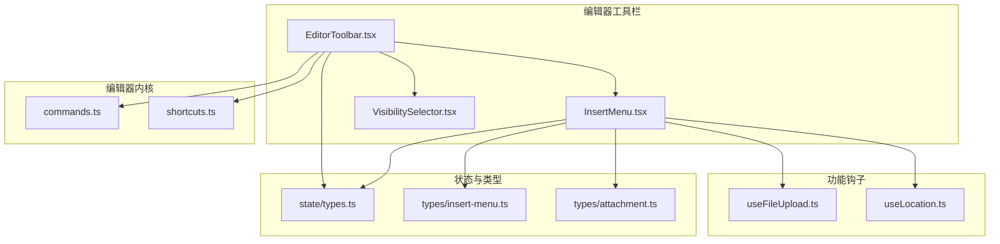
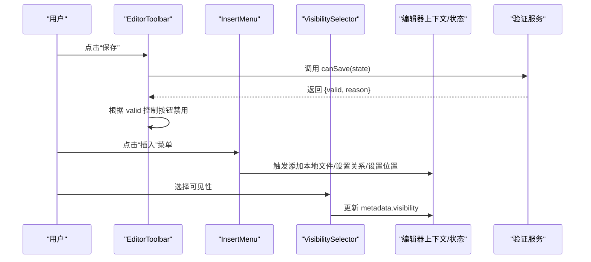
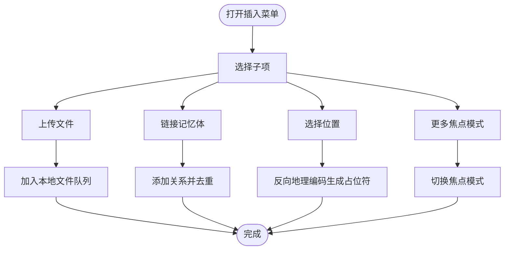
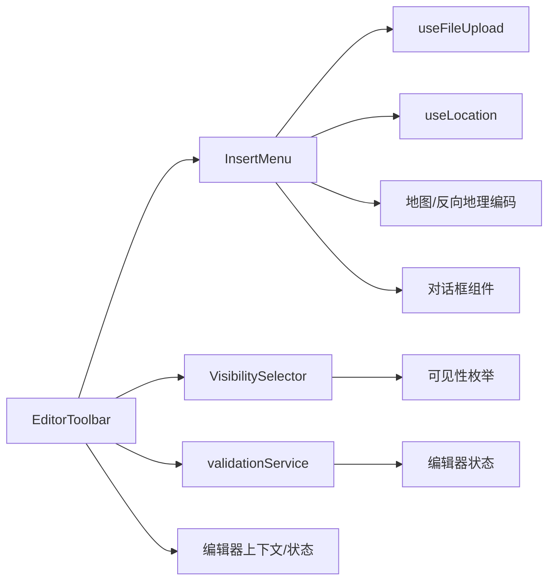

# 编辑器工具栏

<cite>
**本文引用的文件**
- [EditorToolbar.tsx](file://web/src/components/MemoEditor/components/EditorToolbar.tsx)
- [InsertMenu.tsx](file://web/src/components/MemoEditor/Toolbar/InsertMenu.tsx)
- [VisibilitySelector.tsx](file://web/src/components/MemoEditor/Toolbar/VisibilitySelector.tsx)
- [index.ts](file://web/src/components/MemoEditor/Toolbar/index.ts)
- [useFileUpload.ts](file://web/src/components/MemoEditor/hooks/useFileUpload.ts)
- [useLocation.ts](file://web/src/components/MemoEditor/hooks/useLocation.ts)
- [validationService.ts](file://web/src/components/MemoEditor/services/validationService.ts)
- [types.ts（状态）](file://web/src/components/MemoEditor/state/types.ts)
- [types.ts（插入菜单）](file://web/src/components/MemoEditor/types/insert-menu.ts)
- [types.ts（附件）](file://web/src/components/MemoEditor/types/attachment.ts)
- [commands.ts](file://web/src/components/MemoEditor/Editor/commands.ts)
- [shortcuts.ts](file://web/src/components/MemoEditor/Editor/shortcuts.ts)
- [index.tsx（编辑器入口）](file://web/src/components/MemoEditor/index.tsx)
</cite>

## 目录
1. [简介](#简介)
2. [项目结构](#项目结构)
3. [核心组件](#核心组件)
4. [架构总览](#架构总览)
5. [组件详解](#组件详解)
6. [依赖关系分析](#依赖关系分析)
7. [性能与可扩展性](#性能与可扩展性)
8. [无障碍与键盘导航](#无障碍与键盘导航)
9. [故障排查](#故障排查)
10. [结论](#结论)
11. [附录：定制与最佳实践](#附录定制与最佳实践)

## 简介
本文件聚焦于编辑器工具栏组件，系统性阐述其布局设计、按钮功能与交互逻辑；深入解析“插入菜单”的实现，覆盖图片、链接、位置、焦点模式等能力；说明可见性选择器、格式化快捷键与快捷操作的实现细节；并提供工具栏定制、图标系统与响应式设计的实现指南，以及无障碍访问、键盘导航与用户体验优化的最佳实践。

## 项目结构
工具栏位于编辑器子系统中，采用“组件分层 + 钩子解耦 + 状态管理”的组织方式：
- 组件层：工具栏容器、插入菜单、可见性选择器
- 功能钩子：文件上传、位置选择、反向地理编码
- 状态与类型：编辑器状态、动作、验证服务
- 编辑器内核：命令与快捷键（用于内容格式化）

图表来源
- [EditorToolbar.tsx](file://web/src/components/MemoEditor/components/EditorToolbar.tsx#L1-L68)
- [InsertMenu.tsx](file://web/src/components/MemoEditor/Toolbar/InsertMenu.tsx#L1-L189)
- [VisibilitySelector.tsx](file://web/src/components/MemoEditor/Toolbar/VisibilitySelector.tsx#L1-L43)
- [useFileUpload.ts](file://web/src/components/MemoEditor/hooks/useFileUpload.ts#L1-L35)
- [useLocation.ts](file://web/src/components/MemoEditor/hooks/useLocation.ts#L1-L74)
- [types.ts（状态）](file://web/src/components/MemoEditor/state/types.ts#L1-L74)
- [types.ts（插入菜单）](file://web/src/components/MemoEditor/types/insert-menu.ts#L1-L9)
- [types.ts（附件）](file://web/src/components/MemoEditor/types/attachment.ts#L1-L82)
- [commands.ts](file://web/src/components/MemoEditor/Editor/commands.ts#L1-L28)
- [shortcuts.ts](file://web/src/components/MemoEditor/Editor/shortcuts.ts#L1-L39)

章节来源
- [EditorToolbar.tsx](file://web/src/components/MemoEditor/components/EditorToolbar.tsx#L1-L68)
- [index.ts](file://web/src/components/MemoEditor/Toolbar/index.ts#L1-L4)

## 核心组件
- 工具栏容器：负责聚合插入菜单、可见性选择器、AI标签建议、保存/取消按钮，并基于验证服务控制保存按钮可用性。
- 插入菜单：提供“上传文件/链接/位置/更多（含焦点模式）”等插入能力，支持文件预览、位置反向地理编码与坐标输入校验。
- 可见性选择器：以图标+下拉菜单形式切换私有/受保护/公开三种可见性级别。
- 验证服务：统一校验是否满足保存条件（内容/附件/本地文件任一存在、无上传/保存进行中）。
- 编辑器内核：命令与快捷键，用于快速插入列表项、代码块、链接与表格等结构化内容。

章节来源
- [EditorToolbar.tsx](file://web/src/components/MemoEditor/components/EditorToolbar.tsx#L11-L68)
- [InsertMenu.tsx](file://web/src/components/MemoEditor/Toolbar/InsertMenu.tsx#L26-L189)
- [VisibilitySelector.tsx](file://web/src/components/MemoEditor/Toolbar/VisibilitySelector.tsx#L8-L43)
- [validationService.ts](file://web/src/components/MemoEditor/services/validationService.ts#L8-L27)
- [commands.ts](file://web/src/components/MemoEditor/Editor/commands.ts#L7-L28)
- [shortcuts.ts](file://web/src/components/MemoEditor/Editor/shortcuts.ts#L13-L39)

## 架构总览
工具栏通过上下文与动作分发器与编辑器状态联动，插入菜单通过钩子处理文件与位置，可见性选择器直接更新元数据。保存按钮受验证服务约束。

图表来源
- [EditorToolbar.tsx](file://web/src/components/MemoEditor/components/EditorToolbar.tsx#L11-L68)
- [InsertMenu.tsx](file://web/src/components/MemoEditor/Toolbar/InsertMenu.tsx#L26-L189)
- [VisibilitySelector.tsx](file://web/src/components/MemoEditor/Toolbar/VisibilitySelector.tsx#L8-L43)
- [validationService.ts](file://web/src/components/MemoEditor/services/validationService.ts#L8-L27)
- [types.ts（状态）](file://web/src/components/MemoEditor/state/types.ts#L8-L31)

## 组件详解

### 工具栏容器（EditorToolbar）
- 布局：左右分栏，左侧为插入菜单，右侧为 AI 标签建议、可见性选择器、取消/保存按钮。
- 行为：
  - 位置变更回调：通过上下文动作设置 metadata.location。
  - 焦点模式切换：通过上下文动作切换 isFocusMode。
  - 可见性变更：直接更新 metadata.visibility。
  - 保存按钮：由验证服务判断是否可用，同时根据保存中状态禁用。
  - AI 标签插入：将选中的标签转换为“#标签”并追加到内容末尾。
- 交互细节：使用国际化文案，按钮禁用态与加载态明确反馈。

章节来源
- [EditorToolbar.tsx](file://web/src/components/MemoEditor/components/EditorToolbar.tsx#L11-L68)

### 插入菜单（InsertMenu）
- 功能入口：触发器为“+”按钮，支持悬停延迟展开“更多”子菜单。
- 子项：
  - 上传文件：隐藏文件输入触发，选择后转为本地文件并加入待上传队列。
  - 链接记忆体：弹窗选择目标记忆体并建立关联。
  - 选择位置：弹窗支持经纬度输入与地图拾取，结合反向地理编码生成地点名占位符。
  - 更多：包含“焦点模式”开关。
- 状态与联动：
  - 上传中/选择中时禁用触发器，避免并发。
  - 位置选择器内部维护 placeholder、position、经纬度输入值，支持坐标合法性校验与联动更新。
  - 文件上传钩子返回 fileInput 引用、选择标志与事件处理器。
- 交互细节：使用图标与国际化文案；焦点模式提供快捷键提示。

图表来源
- [InsertMenu.tsx](file://web/src/components/MemoEditor/Toolbar/InsertMenu.tsx#L26-L189)
- [useFileUpload.ts](file://web/src/components/MemoEditor/hooks/useFileUpload.ts#L4-L34)
- [useLocation.ts](file://web/src/components/MemoEditor/hooks/useLocation.ts#L7-L74)
- [types.ts（插入菜单）](file://web/src/components/MemoEditor/types/insert-menu.ts#L3-L8)

章节来源
- [InsertMenu.tsx](file://web/src/components/MemoEditor/Toolbar/InsertMenu.tsx#L26-L189)
- [useFileUpload.ts](file://web/src/components/MemoEditor/hooks/useFileUpload.ts#L4-L34)
- [useLocation.ts](file://web/src/components/MemoEditor/hooks/useLocation.ts#L7-L74)
- [types.ts（插入菜单）](file://web/src/components/MemoEditor/types/insert-menu.ts#L3-L8)

### 可见性选择器（VisibilitySelector）
- 设计：触发器为带可见性图标的行内按钮，下拉菜单展示三种可见性选项及当前选中标记。
- 数据：枚举值来自协议定义，标签通过国际化映射。
- 行为：点击选项即触发 onChange 回调，更新元数据可见性。

章节来源
- [VisibilitySelector.tsx](file://web/src/components/MemoEditor/Toolbar/VisibilitySelector.tsx#L8-L43)

### 验证服务（validationService）
- 规则：
  - 内容为空且无附件与本地文件时不可保存。
  - 正在上传或正在保存时不可保存。
- 结果：返回布尔值与原因，供工具栏保存按钮与整体 UI 状态使用。

章节来源
- [validationService.ts](file://web/src/components/MemoEditor/services/validationService.ts#L8-L27)

### 编辑器内核：命令与快捷键
- 命令：提供 todo 列表、代码块、链接、表格等结构化片段的插入模板与光标偏移。
- 快捷键：支持粗体、斜体、超链接快捷插入，自动识别选中内容是否为 URL 并做相应包裹。

章节来源
- [commands.ts](file://web/src/components/MemoEditor/Editor/commands.ts#L7-L28)
- [shortcuts.ts](file://web/src/components/MemoEditor/Editor/shortcuts.ts#L13-L39)

## 依赖关系分析
- 组件耦合：
  - EditorToolbar 依赖 InsertMenu、VisibilitySelector、验证服务与编辑器上下文。
  - InsertMenu 依赖 useFileUpload、useLocation、地图与对话框组件。
  - 可见性选择器依赖协议枚举与图标组件。
- 状态依赖：
  - 所有组件均通过上下文动作与状态联动，避免跨层级通信。
  - 上传与保存状态作为全局 UI 加载标志，影响按钮可用性与交互反馈。
- 外部依赖：
  - 地图与反向地理编码用于位置选择。
  - 国际化与 UI 组件库提供文案与基础控件。

图表来源
- [EditorToolbar.tsx](file://web/src/components/MemoEditor/components/EditorToolbar.tsx#L11-L68)
- [InsertMenu.tsx](file://web/src/components/MemoEditor/Toolbar/InsertMenu.tsx#L26-L189)
- [VisibilitySelector.tsx](file://web/src/components/MemoEditor/Toolbar/VisibilitySelector.tsx#L8-L43)
- [validationService.ts](file://web/src/components/MemoEditor/services/validationService.ts#L8-L27)
- [types.ts（状态）](file://web/src/components/MemoEditor/state/types.ts#L8-L31)

章节来源
- [EditorToolbar.tsx](file://web/src/components/MemoEditor/components/EditorToolbar.tsx#L11-L68)
- [InsertMenu.tsx](file://web/src/components/MemoEditor/Toolbar/InsertMenu.tsx#L26-L189)
- [VisibilitySelector.tsx](file://web/src/components/MemoEditor/Toolbar/VisibilitySelector.tsx#L8-L43)
- [validationService.ts](file://web/src/components/MemoEditor/services/validationService.ts#L8-L27)
- [types.ts（状态）](file://web/src/components/MemoEditor/state/types.ts#L8-L31)

## 性能与可扩展性
- 性能要点：
  - 插入菜单对位置选择使用防抖与延迟展开，降低频繁计算与渲染开销。
  - 上传文件采用对象 URL 预览，避免大文件阻塞主线程。
  - 关系去重使用稳定算法，减少重复渲染。
- 可扩展性：
  - 插入菜单以子菜单形式扩展新功能（如更多→新增命令）。
  - 命令与快捷键模块化，便于新增模板与快捷键。
  - 验证规则集中管理，便于按业务迭代调整保存策略。

章节来源
- [InsertMenu.tsx](file://web/src/components/MemoEditor/Toolbar/InsertMenu.tsx#L55-L71)
- [useFileUpload.ts](file://web/src/components/MemoEditor/hooks/useFileUpload.ts#L14-L18)
- [InsertMenu.tsx](file://web/src/components/MemoEditor/Toolbar/InsertMenu.tsx#L48-L48)

## 无障碍与键盘导航
- 键盘可达性：
  - 下拉菜单与子菜单支持键盘打开/关闭与选项间切换。
  - 插入菜单触发器与各菜单项具备可访问标签与焦点顺序。
- 屏幕阅读器友好：
  - 使用语义化图标与国际化文案，确保视觉信息可被替代文本表达。
- 操作反馈：
  - 上传中/保存中按钮禁用并显示加载指示，避免误操作。
  - 快捷键插入时自动定位光标，提升连续编辑体验。

章节来源
- [InsertMenu.tsx](file://web/src/components/MemoEditor/Toolbar/InsertMenu.tsx#L110-L150)
- [EditorToolbar.tsx](file://web/src/components/MemoEditor/components/EditorToolbar.tsx#L55-L63)
- [shortcuts.ts](file://web/src/components/MemoEditor/Editor/shortcuts.ts#L13-L39)

## 故障排查
- 无法保存：
  - 检查验证服务返回的原因（内容/附件/本地文件是否存在、是否处于上传/保存中）。
- 上传失败或重复：
  - 确认上传状态标志未被错误置位；检查文件选择器清空逻辑。
- 位置选择异常：
  - 检查经纬度输入合法性与坐标联动更新；确认反向地理编码请求成功。
- 可见性未生效：
  - 确认 onChange 回调正确写入 metadata.visibility。

章节来源
- [validationService.ts](file://web/src/components/MemoEditor/services/validationService.ts#L8-L27)
- [useFileUpload.ts](file://web/src/components/MemoEditor/hooks/useFileUpload.ts#L20-L22)
- [useLocation.ts](file://web/src/components/MemoEditor/hooks/useLocation.ts#L30-L37)
- [VisibilitySelector.tsx](file://web/src/components/MemoEditor/Toolbar/VisibilitySelector.tsx#L30-L36)

## 结论
编辑器工具栏以清晰的职责划分与稳定的上下文驱动实现了高可用的插入与可见性管理；通过钩子与验证服务解耦了复杂交互；命令与快捷键提升了编辑效率。整体设计兼顾可扩展性与可维护性，适合在多场景下持续演进。

## 附录：定制与最佳实践

### 工具栏定制
- 新增插入项：在插入菜单中添加新的子菜单项，绑定对应动作（如插入命令、打开对话框）。
- 自定义命令：在命令集合中新增模板与光标偏移，保持一致的命名与行为。
- 快捷键扩展：在快捷键处理中增加按键映射与插入逻辑，注意与默认浏览器行为的冲突处理。

章节来源
- [InsertMenu.tsx](file://web/src/components/MemoEditor/Toolbar/InsertMenu.tsx#L116-L149)
- [commands.ts](file://web/src/components/MemoEditor/Editor/commands.ts#L7-L28)
- [shortcuts.ts](file://web/src/components/MemoEditor/Editor/shortcuts.ts#L13-L39)

### 图标系统
- 统一使用矢量图标库，保证在不同分辨率下的清晰度。
- 图标语义化命名，配合国际化文案，避免仅依赖颜色传达信息。

章节来源
- [InsertMenu.tsx](file://web/src/components/MemoEditor/Toolbar/InsertMenu.tsx#L3-L17)
- [VisibilitySelector.tsx](file://web/src/components/MemoEditor/Toolbar/VisibilitySelector.tsx#L1-L6)

### 响应式设计
- 在小屏设备上优先保留关键操作（保存、可见性），将“更多”折叠为二级菜单。
- 控制按钮组的间距与对齐，确保触摸目标尺寸充足。

章节来源
- [EditorToolbar.tsx](file://web/src/components/MemoEditor/components/EditorToolbar.tsx#L38-L66)

### 用户体验优化
- 明确的加载与禁用状态反馈，避免用户重复提交。
- 提供撤销/重试机制（如重新上传文件）。
- 通过 AI 标签建议与快捷键减少认知负担，提升编辑效率。

章节来源
- [EditorToolbar.tsx](file://web/src/components/MemoEditor/components/EditorToolbar.tsx#L16-L16)
- [EditorToolbar.tsx](file://web/src/components/MemoEditor/components/EditorToolbar.tsx#L51-L51)