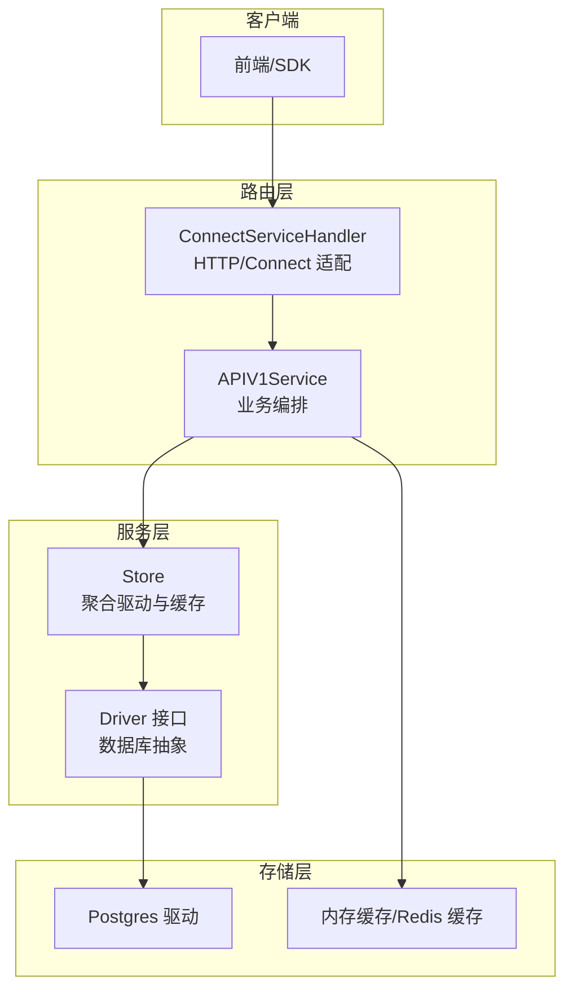
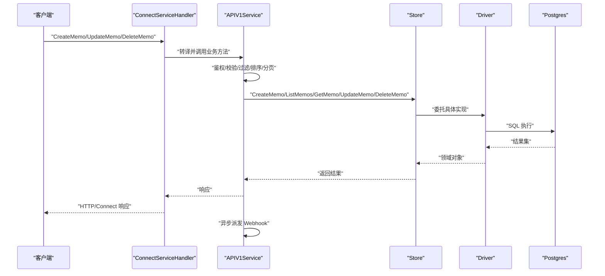
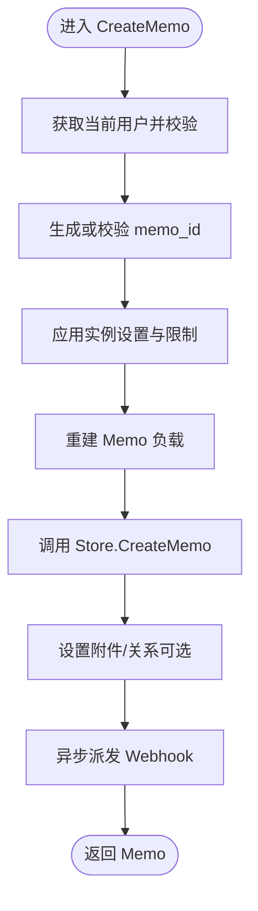
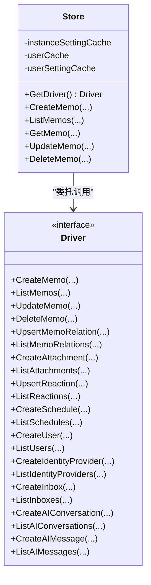
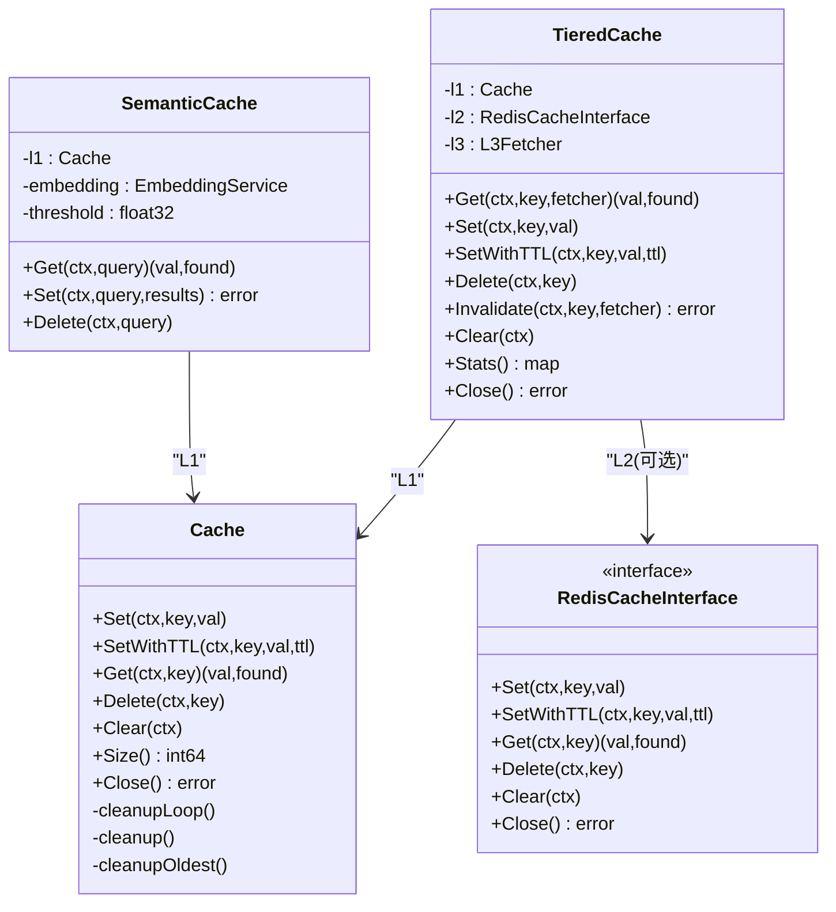
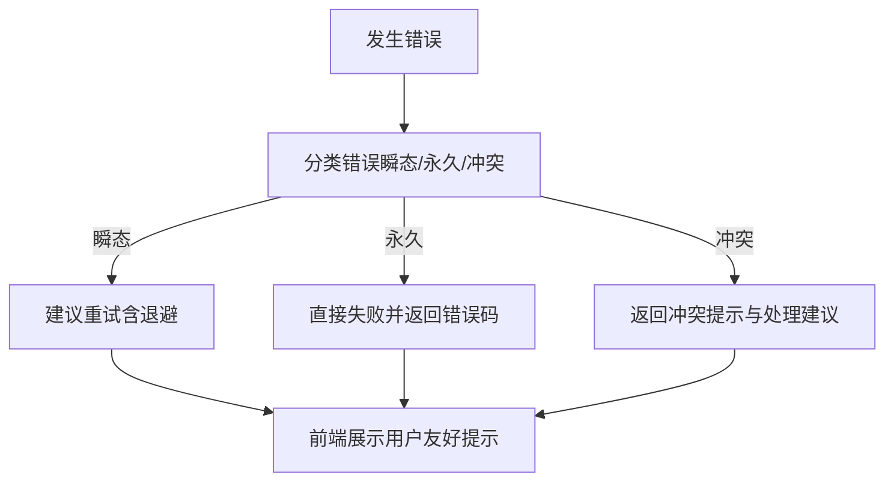
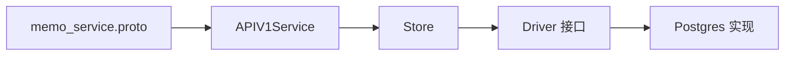
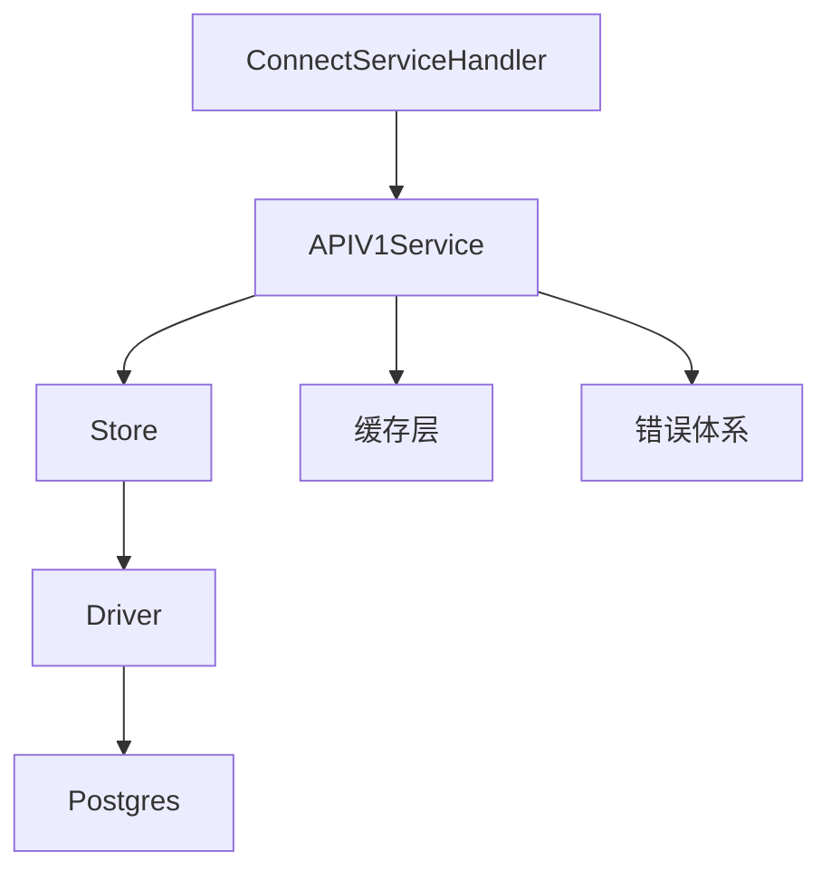

# 编辑器服务层

<cite>
**本文引用的文件**
- [store/memo.go](file://store/memo.go)
- [server/router/api/v1/memo_service.go](file://server/router/api/v1/memo_service.go)
- [store/db/postgres/memo.go](file://store/db/postgres/memo.go)
- [store/cache/cache.go](file://store/cache/cache.go)
- [store/cache/tiered.go](file://store/cache/tiered.go)
- [store/cache/redis.go](file://store/cache/redis.go)
- [server/internal/errors/codes.go](file://server/internal/errors/codes.go)
- [store/store.go](file://store/store.go)
- [store/driver.go](file://store/driver.go)
- [proto/api/v1/memo_service.proto](file://proto/api/v1/memo_service.proto)
- [server/router/api/v1/connect_services.go](file://server/router/api/v1/connect_services.go)
- [plugin/ai/agent/error_class.go](file://plugin/ai/agent/error_class.go)
</cite>

## 目录
1. [简介](#简介)
2. [项目结构](#项目结构)
3. [核心组件](#核心组件)
4. [架构总览](#架构总览)
5. [详细组件分析](#详细组件分析)
6. [依赖关系分析](#依赖关系分析)
7. [性能考量](#性能考量)
8. [故障排查指南](#故障排查指南)
9. [结论](#结论)
10. [附录](#附录)

## 简介
本文件聚焦“编辑器服务层”，系统性阐述笔记（Memo）服务的实现与设计，覆盖：
- 笔记服务的 CRUD 操作、数据同步与版本管理
- 缓存服务的设计：本地内存缓存、可选 Redis 分布式缓存与三层缓存策略
- 错误服务的实现：错误捕获、分类与用户反馈
- 服务间依赖关系、接口定义与扩展机制
- 异步处理、重试机制与性能监控最佳实践

## 项目结构
编辑器服务层位于后端服务的“路由层-服务层-存储层”之间，负责：
- 将前端请求转换为领域模型与业务规则
- 调用存储层执行持久化操作
- 维护缓存与异步任务（如 Webhook）
- 对外暴露统一的 API 接口

图表来源
- [server/router/api/v1/connect_services.go](file://server/router/api/v1/connect_services.go#L236-L322)
- [server/router/api/v1/memo_service.go](file://server/router/api/v1/memo_service.go#L24-L145)
- [store/store.go](file://store/store.go#L12-L23)
- [store/driver.go](file://store/driver.go#L10-L102)
- [store/db/postgres/memo.go](file://store/db/postgres/memo.go#L16-L49)

章节来源
- [server/router/api/v1/connect_services.go](file://server/router/api/v1/connect_services.go#L1-L491)
- [server/router/api/v1/memo_service.go](file://server/router/api/v1/memo_service.go#L1-L831)
- [store/store.go](file://store/store.go#L1-L87)
- [store/driver.go](file://store/driver.go#L1-L103)
- [store/db/postgres/memo.go](file://store/db/postgres/memo.go#L1-L357)

## 核心组件
- 笔记模型与查询更新对象：Memo、FindMemo、UpdateMemo、DeleteMemo
- API 服务：APIV1Service 提供 Create/List/Get/Update/Delete 等方法，并负责权限校验、过滤、排序、分页与 Webhook 异步派发
- 存储层：Store 聚合 Driver 接口，封装数据库访问；Driver 定义所有实体的 CRUD 抽象
- 缓存层：内存缓存 Cache、三层缓存 TieredCache（L1 内存 + 可选 L2 Redis + L3 数据库回调）、语义缓存 SemanticCache
- 错误体系：统一错误码与结构化错误类型，支持分类与上下文

章节来源
- [store/memo.go](file://store/memo.go#L35-L160)
- [server/router/api/v1/memo_service.go](file://server/router/api/v1/memo_service.go#L24-L544)
- [store/store.go](file://store/store.go#L12-L58)
- [store/driver.go](file://store/driver.go#L10-L102)
- [store/cache/cache.go](file://store/cache/cache.go#L11-L32)
- [store/cache/tiered.go](file://store/cache/tiered.go#L17-L91)
- [store/cache/redis.go](file://store/cache/redis.go#L12-L82)
- [server/internal/errors/codes.go](file://server/internal/errors/codes.go#L7-L148)

## 架构总览
编辑器服务层采用“接口抽象 + 多级缓存 + 统一错误”的架构模式，确保：
- 业务逻辑与数据访问解耦
- 读多写少场景下的高性能缓存策略
- 明确的错误分类与可追踪的用户反馈

图表来源
- [server/router/api/v1/connect_services.go](file://server/router/api/v1/connect_services.go#L236-L274)
- [server/router/api/v1/memo_service.go](file://server/router/api/v1/memo_service.go#L24-L145)
- [store/store.go](file://store/store.go#L12-L58)
- [store/driver.go](file://store/driver.go#L10-L102)
- [store/db/postgres/memo.go](file://store/db/postgres/memo.go#L16-L49)

## 详细组件分析

### 笔记服务（CRUD、数据同步与版本管理）
- 创建（CreateMemo）
  - 校验用户身份与自定义 memo_id 格式
  - 应用实例设置（显示时间优先策略、内容长度限制、公开可见性限制）
  - 重建 Memo 负载（解析 Markdown、提取属性）
  - 关联附件与关系
  - 异步派发“创建” Webhook
- 列表（ListMemos）
  - 支持状态过滤、排序（AIP-132）、过滤表达式（CEL）
  - 默认排除评论，支持分页令牌
  - 合并反应与附件信息
- 获取（GetMemo）
  - 名称解析与可见性控制（私有需本人或管理员）
- 更新（UpdateMemo）
  - 基于 FieldMask 的增量更新
  - 支持内容、可见性、置顶、状态、时间戳、位置等字段
  - 内容变更时重建负载
  - 异步派发“更新” Webhook
- 删除（DeleteMemo）
  - 清理评论、关系与附件
  - 异步派发“删除” Webhook

图表来源
- [server/router/api/v1/memo_service.go](file://server/router/api/v1/memo_service.go#L24-L145)

章节来源
- [server/router/api/v1/memo_service.go](file://server/router/api/v1/memo_service.go#L24-L544)
- [store/memo.go](file://store/memo.go#L109-L160)
- [store/db/postgres/memo.go](file://store/db/postgres/memo.go#L16-L49)

### 存储层与驱动接口
- Store 聚合 Driver，提供统一入口，并内置若干缓存（实例设置、用户、用户设置）
- Driver 定义了所有实体的 CRUD 方法，包括 Memo、MemoRelation、Attachment、Reaction、Schedule 等
- Postgres 实现提供 SQL 查询、条件拼接、向量检索等能力

图表来源
- [store/store.go](file://store/store.go#L12-L58)
- [store/driver.go](file://store/driver.go#L10-L102)

章节来源
- [store/store.go](file://store/store.go#L1-L87)
- [store/driver.go](file://store/driver.go#L1-L103)
- [store/db/postgres/memo.go](file://store/db/postgres/memo.go#L51-L197)

### 缓存服务设计
- 内存缓存 Cache
  - TTL 过期清理、逐出回调、最大项数控制
  - 并发安全，原子计数
- 三层缓存 TieredCache
  - L1：内存缓存（默认启用）
  - L2：Redis 缓存（可选启用，通过环境变量自动检测）
  - L3：数据库回调（未命中时从 L3 获取并回填 L1/L2）
  - 支持 Invalidate、统计查询
- 语义缓存 SemanticCache
  - 基于向量相似度的语义命中，适合搜索类场景
- 缓存键生成与统计
  - 提供查询键生成工具与缓存统计结构

图表来源
- [store/cache/cache.go](file://store/cache/cache.go#L66-L328)
- [store/cache/tiered.go](file://store/cache/tiered.go#L28-L231)
- [store/cache/redis.go](file://store/cache/redis.go#L23-L139)

章节来源
- [store/cache/cache.go](file://store/cache/cache.go#L1-L328)
- [store/cache/tiered.go](file://store/cache/tiered.go#L1-L447)
- [store/cache/redis.go](file://store/cache/redis.go#L1-L271)
- [store/store.go](file://store/store.go#L16-L42)

### 错误服务与用户反馈
- 统一错误码与结构化错误类型（AIError），支持上下文附加
- 错误分类（瞬态/永久/冲突），用于智能重试与冲突处理
- API 层将底层错误转换为 gRPC/Connect 标准错误，便于前端统一处理

图表来源
- [server/internal/errors/codes.go](file://server/internal/errors/codes.go#L7-L148)
- [plugin/ai/agent/error_class.go](file://plugin/ai/agent/error_class.go#L84-L231)

章节来源
- [server/internal/errors/codes.go](file://server/internal/errors/codes.go#L1-L148)
- [plugin/ai/agent/error_class.go](file://plugin/ai/agent/error_class.go#L1-L231)

### 服务间依赖关系与接口定义
- API 层通过 ConnectServiceHandler 将 HTTP/Connect 请求映射到 APIV1Service
- APIV1Service 依赖 Store，Store 依赖 Driver，Driver 依赖具体数据库实现
- MemoService 的 Proto 定义明确了资源命名、字段行为与 HTTP 映射

图表来源
- [proto/api/v1/memo_service.proto](file://proto/api/v1/memo_service.proto#L17-L106)
- [server/router/api/v1/connect_services.go](file://server/router/api/v1/connect_services.go#L234-L346)
- [server/router/api/v1/memo_service.go](file://server/router/api/v1/memo_service.go#L24-L145)
- [store/store.go](file://store/store.go#L12-L58)
- [store/driver.go](file://store/driver.go#L10-L102)

章节来源
- [proto/api/v1/memo_service.proto](file://proto/api/v1/memo_service.proto#L1-L512)
- [server/router/api/v1/connect_services.go](file://server/router/api/v1/connect_services.go#L1-L491)
- [server/router/api/v1/memo_service.go](file://server/router/api/v1/memo_service.go#L1-L831)
- [store/store.go](file://store/store.go#L1-L87)
- [store/driver.go](file://store/driver.go#L1-L103)

### 扩展机制与最佳实践
- 接口抽象：Driver 与 RedisCacheInterface 提供扩展点，便于替换存储或缓存实现
- 三层缓存：TieredCache 在个人部署默认仅启用 L1，在多实例部署可通过环境变量启用 L2
- 语义缓存：SemanticCache 适用于相似查询的快速命中
- 异步 Webhook：在创建/更新/删除后异步派发，避免阻塞主流程
- 错误分类：基于错误类型选择重试、降级或提示

章节来源
- [store/driver.go](file://store/driver.go#L10-L102)
- [store/cache/redis.go](file://store/cache/redis.go#L12-L82)
- [store/cache/tiered.go](file://store/cache/tiered.go#L28-L91)
- [server/router/api/v1/memo_service.go](file://server/router/api/v1/memo_service.go#L719-L755)
- [plugin/ai/agent/error_class.go](file://plugin/ai/agent/error_class.go#L84-L231)

## 依赖关系分析
- 路由层依赖 API 层；API 层依赖 Store；Store 依赖 Driver；Driver 依赖数据库实现
- 缓存层可插拔，既可独立使用，也可与 Store 集成
- 错误体系贯穿服务层，便于统一处理与用户反馈

图表来源
- [server/router/api/v1/connect_services.go](file://server/router/api/v1/connect_services.go#L234-L346)
- [server/router/api/v1/memo_service.go](file://server/router/api/v1/memo_service.go#L24-L145)
- [store/store.go](file://store/store.go#L12-L58)
- [store/driver.go](file://store/driver.go#L10-L102)
- [store/cache/cache.go](file://store/cache/cache.go#L66-L328)
- [server/internal/errors/codes.go](file://server/internal/errors/codes.go#L7-L148)

章节来源
- [server/router/api/v1/connect_services.go](file://server/router/api/v1/connect_services.go#L1-L491)
- [server/router/api/v1/memo_service.go](file://server/router/api/v1/memo_service.go#L1-L831)
- [store/store.go](file://store/store.go#L1-L87)
- [store/driver.go](file://store/driver.go#L1-L103)
- [store/cache/cache.go](file://store/cache/cache.go#L1-L328)
- [server/internal/errors/codes.go](file://server/internal/errors/codes.go#L1-L148)

## 性能考量
- 缓存策略
  - L1 内存缓存：高并发读取，TTL 控制与逐出策略
  - L2 Redis：跨进程共享与持久化（多实例部署）
  - L3 数据库回调：未命中时回源，减少热点失效风暴
- 查询优化
  - 条件拼接与排序字段组合，限制分页上限
  - 向量检索（pgvector）用于语义搜索
- 异步处理
  - Webhook 异步派发，避免阻塞主流程
- 错误与重试
  - 瞬态错误自动重试与指数退避
  - 冲突错误返回处理建议，避免无效重试

章节来源
- [store/cache/tiered.go](file://store/cache/tiered.go#L93-L132)
- [store/db/postgres/memo.go](file://store/db/postgres/memo.go#L279-L340)
- [server/router/api/v1/memo_service.go](file://server/router/api/v1/memo_service.go#L719-L755)
- [plugin/ai/agent/error_class.go](file://plugin/ai/agent/error_class.go#L84-L231)

## 故障排查指南
- 常见错误与处理
  - 唯一约束冲突：识别并返回已存在错误码
  - 权限不足：检查用户身份与可见性策略
  - 参数校验失败：检查输入格式与长度限制
  - 服务不可用：检查缓存连接与数据库连通性
- 日志与可观测性
  - Webhook 派发失败记录警告日志
  - 错误分类与上下文便于定位问题
- 重试与降级
  - 对瞬态错误进行指数退避重试
  - 冲突错误提示用户调整策略

章节来源
- [server/router/api/v1/memo_service.go](file://server/router/api/v1/memo_service.go#L96-L104)
- [server/internal/errors/codes.go](file://server/internal/errors/codes.go#L7-L148)
- [plugin/ai/agent/error_class.go](file://plugin/ai/agent/error_class.go#L84-L231)

## 结论
编辑器服务层以清晰的分层与接口抽象实现了笔记服务的完整生命周期管理，结合多级缓存与语义缓存显著提升了读性能，配合统一错误分类与异步 Webhook，提供了良好的用户体验与可维护性。通过可插拔的缓存与驱动接口，系统具备良好的扩展性与部署灵活性。

## 附录
- 接口定义参考：MemoService 的 Proto 定义明确了资源命名、字段行为与 HTTP 映射
- 服务启动与路由：ConnectServiceHandler 将 HTTP/Connect 请求映射到 APIV1Service

章节来源
- [proto/api/v1/memo_service.proto](file://proto/api/v1/memo_service.proto#L17-L106)
- [server/router/api/v1/connect_services.go](file://server/router/api/v1/connect_services.go#L234-L346)