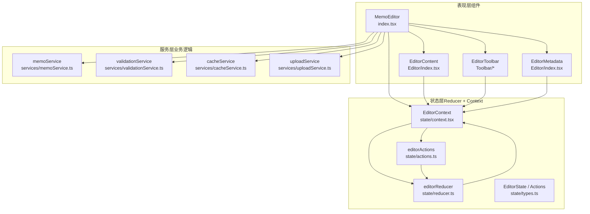
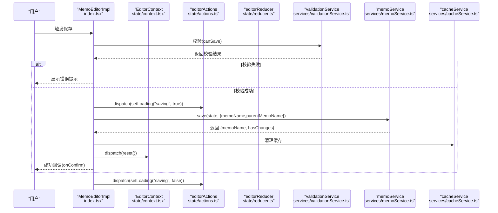
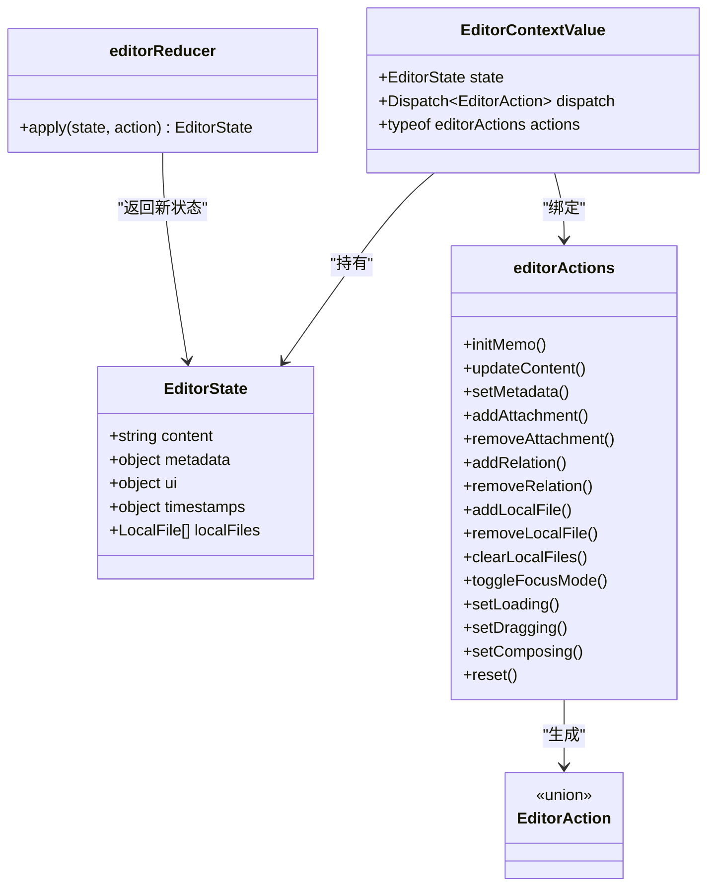
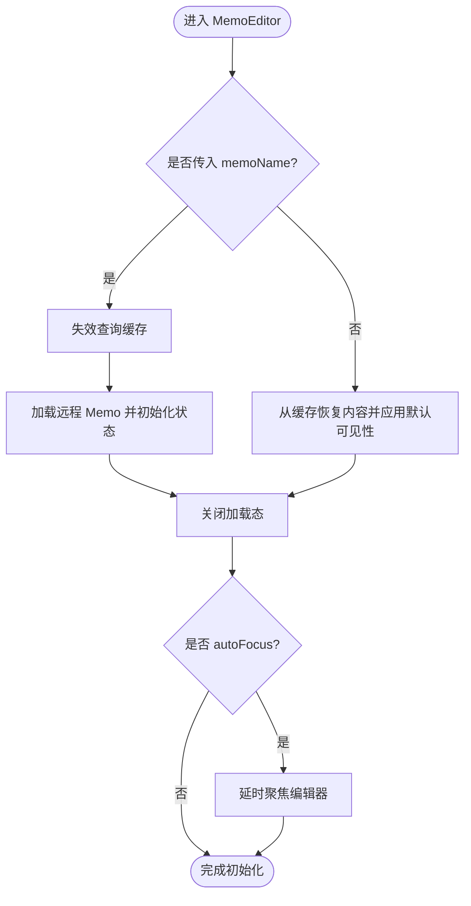
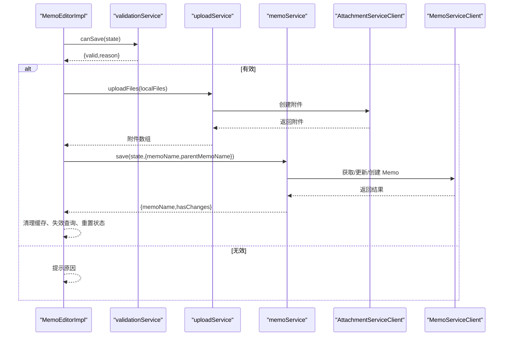
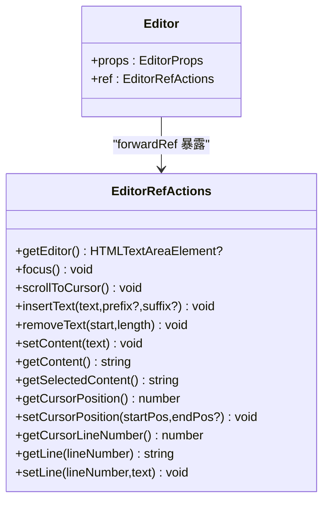
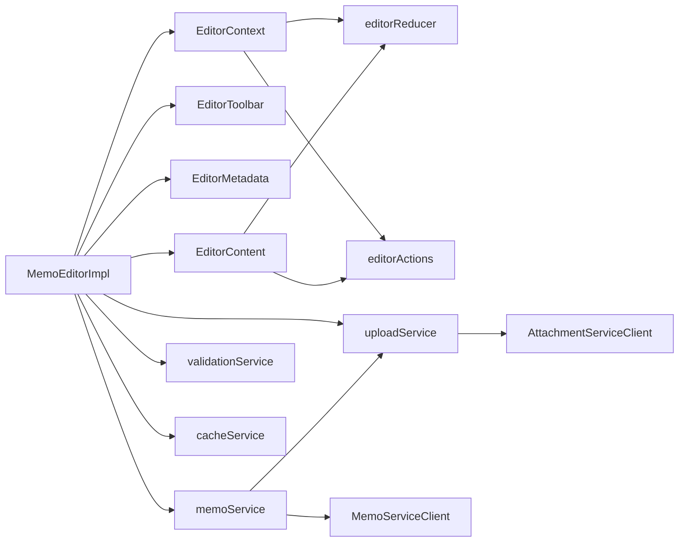

# 编辑器核心

<cite>
**本文引用的文件**
- [web/src/components/MemoEditor/README.md](file://web/src/components/MemoEditor/README.md)
- [web/src/components/MemoEditor/index.tsx](file://web/src/components/MemoEditor/index.tsx)
- [web/src/components/MemoEditor/state/context.tsx](file://web/src/components/MemoEditor/state/context.tsx)
- [web/src/components/MemoEditor/state/reducer.ts](file://web/src/components/MemoEditor/state/reducer.ts)
- [web/src/components/MemoEditor/state/actions.ts](file://web/src/components/MemoEditor/state/actions.ts)
- [web/src/components/MemoEditor/state/types.ts](file://web/src/components/MemoEditor/state/types.ts)
- [web/src/components/MemoEditor/state/index.ts](file://web/src/components/MemoEditor/state/index.ts)
- [web/src/components/MemoEditor/hooks/useMemoInit.ts](file://web/src/components/MemoEditor/hooks/useMemoInit.ts)
- [web/src/components/MemoEditor/hooks/useAutoSave.ts](file://web/src/components/MemoEditor/hooks/useAutoSave.ts)
- [web/src/components/MemoEditor/Editor/index.tsx](file://web/src/components/MemoEditor/Editor/index.tsx)
- [web/src/components/MemoEditor/services/memoService.ts](file://web/src/components/MemoEditor/services/memoService.ts)
- [web/src/components/MemoEditor/services/validationService.ts](file://web/src/components/MemoEditor/services/validationService.ts)
- [web/src/components/MemoEditor/services/cacheService.ts](file://web/src/components/MemoEditor/services/cacheService.ts)
- [web/src/components/MemoEditor/services/uploadService.ts](file://web/src/components/MemoEditor/services/uploadService.ts)
</cite>

## 目录
1. [简介](#简介)
2. [项目结构](#项目结构)
3. [核心组件](#核心组件)
4. [架构总览](#架构总览)
5. [详细组件分析](#详细组件分析)
6. [依赖关系分析](#依赖关系分析)
7. [性能考量](#性能考量)
8. [故障排查指南](#故障排查指南)
9. [结论](#结论)
10. [附录](#附录)

## 简介
本文件聚焦于“编辑器核心”组件，系统性阐述其状态管理机制（上下文提供者、状态 reducer、动作分发）、核心配置与初始化流程、生命周期管理、上下文接口与状态类型定义、操作方法，以及集成模式、自定义配置与扩展点。同时给出错误处理、性能优化与内存管理的最佳实践，帮助开发者在不深入源码细节的前提下快速理解并正确使用该编辑器。

## 项目结构
编辑器采用三层架构：表现层（组件）、状态层（reducer + context）、服务层（业务逻辑）。核心入口为 MemoEditor 组件，通过 EditorProvider 提供上下文，内部使用 useReducer 驱动状态变更；服务层封装了保存、加载、上传、校验等纯函数逻辑，便于测试与复用。

图表来源
- [web/src/components/MemoEditor/index.tsx](file://web/src/components/MemoEditor/index.tsx#L21-L38)
- [web/src/components/MemoEditor/state/context.tsx](file://web/src/components/MemoEditor/state/context.tsx#L27-L40)
- [web/src/components/MemoEditor/state/reducer.ts](file://web/src/components/MemoEditor/state/reducer.ts#L4-L54)
- [web/src/components/MemoEditor/state/actions.ts](file://web/src/components/MemoEditor/state/actions.ts#L6-L78)
- [web/src/components/MemoEditor/state/types.ts](file://web/src/components/MemoEditor/state/types.ts#L8-L73)
- [web/src/components/MemoEditor/services/memoService.ts](file://web/src/components/MemoEditor/services/memoService.ts#L76-L153)
- [web/src/components/MemoEditor/services/validationService.ts](file://web/src/components/MemoEditor/services/validationService.ts#L8-L27)
- [web/src/components/MemoEditor/services/cacheService.ts](file://web/src/components/MemoEditor/services/cacheService.ts#L5-L25)
- [web/src/components/MemoEditor/services/uploadService.ts](file://web/src/components/MemoEditor/services/uploadService.ts#L7-L28)

章节来源
- [web/src/components/MemoEditor/README.md](file://web/src/components/MemoEditor/README.md#L1-L38)

## 核心组件
- 上下文提供者：EditorProvider 使用 useReducer 初始化状态，并通过 Context 暴露 state、dispatch 与 actions，供子组件消费。
- 状态 reducer：editorReducer 基于 EditorAction 类型进行不可变更新，覆盖内容、元数据、本地文件、UI 状态与时间戳等字段。
- 动作分发：editorActions 将所有可执行的动作以纯函数形式导出，确保调用方无需关心内部状态结构。
- 编辑器核心：Editor 组件封装 textarea 的行为，提供插入/删除文本、定位光标、滚动到可视区域、自动高度调整等能力，并暴露 EditorRefActions 接口。
- 服务层：memoService 负责保存/加载、构建更新掩码、处理附件引用；validationService 校验保存前置条件；cacheService 实现本地缓存与防抖；uploadService 处理本地文件上传。

章节来源
- [web/src/components/MemoEditor/state/context.tsx](file://web/src/components/MemoEditor/state/context.tsx#L1-L40)
- [web/src/components/MemoEditor/state/reducer.ts](file://web/src/components/MemoEditor/state/reducer.ts#L1-L54)
- [web/src/components/MemoEditor/state/actions.ts](file://web/src/components/MemoEditor/state/actions.ts#L1-L79)
- [web/src/components/MemoEditor/state/types.ts](file://web/src/components/MemoEditor/state/types.ts#L1-L74)
- [web/src/components/MemoEditor/Editor/index.tsx](file://web/src/components/MemoEditor/Editor/index.tsx#L11-L25)
- [web/src/components/MemoEditor/services/memoService.ts](file://web/src/components/MemoEditor/services/memoService.ts#L1-L154)
- [web/src/components/MemoEditor/services/validationService.ts](file://web/src/components/MemoEditor/services/validationService.ts#L1-L28)
- [web/src/components/MemoEditor/services/cacheService.ts](file://web/src/components/MemoEditor/services/cacheService.ts#L1-L26)
- [web/src/components/MemoEditor/services/uploadService.ts](file://web/src/components/MemoEditor/services/uploadService.ts#L1-L29)

## 架构总览
编辑器采用“上下文 + reducer”的状态管理模式，结合服务层纯函数，形成清晰的职责边界。初始化阶段通过 useMemoInit 完成加载或从缓存恢复；保存阶段通过 validationService 校验，再由 memoService 保存并清理缓存与刷新查询缓存；Editor 组件负责输入与交互，EditorRefActions 提供外部控制能力。

图表来源
- [web/src/components/MemoEditor/index.tsx](file://web/src/components/MemoEditor/index.tsx#L77-L125)
- [web/src/components/MemoEditor/state/context.tsx](file://web/src/components/MemoEditor/state/context.tsx#L27-L40)
- [web/src/components/MemoEditor/state/actions.ts](file://web/src/components/MemoEditor/state/actions.ts#L6-L78)
- [web/src/components/MemoEditor/state/reducer.ts](file://web/src/components/MemoEditor/state/reducer.ts#L4-L54)
- [web/src/components/MemoEditor/services/validationService.ts](file://web/src/components/MemoEditor/services/validationService.ts#L8-L27)
- [web/src/components/MemoEditor/services/memoService.ts](file://web/src/components/MemoEditor/services/memoService.ts#L76-L123)
- [web/src/components/MemoEditor/services/cacheService.ts](file://web/src/components/MemoEditor/services/cacheService.ts#L22-L24)

## 详细组件分析

### 状态层：上下文、类型与 reducer
- 上下文接口：EditorContextValue 暴露 state、dispatch、actions，确保子组件仅通过 actions 进行状态变更。
- 状态类型：EditorState 包含 content、metadata（visibility、attachments、relations、location）、ui（isFocusMode、isLoading、isDragging、isComposing）、timestamps、localFiles。
- 动作类型：EditorAction 覆盖初始化、内容更新、元数据合并、附件/关系/本地文件增删改、焦点模式切换、加载状态、拖拽状态、IME 输入状态、重置等。
- 初始状态：initialState 设定默认可见性、空列表与布尔开关，保证首次渲染安全。

图表来源
- [web/src/components/MemoEditor/state/types.ts](file://web/src/components/MemoEditor/state/types.ts#L8-L73)
- [web/src/components/MemoEditor/state/actions.ts](file://web/src/components/MemoEditor/state/actions.ts#L6-L78)
- [web/src/components/MemoEditor/state/context.tsx](file://web/src/components/MemoEditor/state/context.tsx#L7-L11)
- [web/src/components/MemoEditor/state/reducer.ts](file://web/src/components/MemoEditor/state/reducer.ts#L4-L54)

章节来源
- [web/src/components/MemoEditor/state/context.tsx](file://web/src/components/MemoEditor/state/context.tsx#L1-L40)
- [web/src/components/MemoEditor/state/types.ts](file://web/src/components/MemoEditor/state/types.ts#L1-L74)
- [web/src/components/MemoEditor/state/actions.ts](file://web/src/components/MemoEditor/state/actions.ts#L1-L79)
- [web/src/components/MemoEditor/state/reducer.ts](file://web/src/components/MemoEditor/state/reducer.ts#L1-L54)

### 初始化流程与生命周期
- 初始化钩子 useMemoInit：根据是否存在 memoName 决定加载远程或从缓存恢复；强制失效查询以避免脏数据；设置加载状态并在完成后可选聚焦编辑器。
- 自动保存钩子 useAutoSave：基于缓存服务的防抖写入 localStorage，降低频繁 IO。
- 生命周期要点：仅在首次挂载执行初始化；保存成功后清理缓存并重置编辑器状态；错误时统一通过 handleError 输出。

图表来源
- [web/src/components/MemoEditor/hooks/useMemoInit.ts](file://web/src/components/MemoEditor/hooks/useMemoInit.ts#L21-L68)
- [web/src/components/MemoEditor/hooks/useAutoSave.ts](file://web/src/components/MemoEditor/hooks/useAutoSave.ts#L4-L9)
- [web/src/components/MemoEditor/index.tsx](file://web/src/components/MemoEditor/index.tsx#L57-L75)

章节来源
- [web/src/components/MemoEditor/hooks/useMemoInit.ts](file://web/src/components/MemoEditor/hooks/useMemoInit.ts#L1-L70)
- [web/src/components/MemoEditor/hooks/useAutoSave.ts](file://web/src/components/MemoEditor/hooks/useAutoSave.ts#L1-L10)
- [web/src/components/MemoEditor/index.tsx](file://web/src/components/MemoEditor/index.tsx#L40-L75)

### 保存流程与数据流
- 校验：validationService 在保存前检查内容/附件/本地文件三者之一存在且无并发上传/保存。
- 上传：uploadService 逐个上传本地文件并返回远端附件引用。
- 更新掩码：memoService.buildUpdateMask 基于前后差异计算最小更新集合，必要时自动更新时间戳。
- 保存：支持更新现有 Memo 或创建新 Memo/评论；成功后清理缓存、失效相关查询并重置编辑器。
- 错误处理：统一通过 handleError 输出，toast 展示友好信息。

图表来源
- [web/src/components/MemoEditor/index.tsx](file://web/src/components/MemoEditor/index.tsx#L77-L125)
- [web/src/components/MemoEditor/services/validationService.ts](file://web/src/components/MemoEditor/services/validationService.ts#L8-L27)
- [web/src/components/MemoEditor/services/uploadService.ts](file://web/src/components/MemoEditor/services/uploadService.ts#L7-L28)
- [web/src/components/MemoEditor/services/memoService.ts](file://web/src/components/MemoEditor/services/memoService.ts#L76-L123)

章节来源
- [web/src/components/MemoEditor/services/memoService.ts](file://web/src/components/MemoEditor/services/memoService.ts#L1-L154)
- [web/src/components/MemoEditor/services/validationService.ts](file://web/src/components/MemoEditor/services/validationService.ts#L1-L28)
- [web/src/components/MemoEditor/services/cacheService.ts](file://web/src/components/MemoEditor/services/cacheService.ts#L1-L26)
- [web/src/components/MemoEditor/services/uploadService.ts](file://web/src/components/MemoEditor/services/uploadService.ts#L1-L29)

### 编辑器组件与交互
- Editor 组件：封装 textarea 行为，提供 EditorRefActions 接口，包括插入/删除文本、设置/获取内容、光标定位、行级读写、滚动到可视区域等。
- 自动高度与滚动：根据内容动态调整高度，并在输入时保持光标可见。
- 列表自动补全：在按回车时自动延续列表格式，提升 Markdown 编辑体验。
- 与上下文协作：通过 useEditorContext 获取 state 与 actions，驱动 UI 与行为。

图表来源
- [web/src/components/MemoEditor/Editor/index.tsx](file://web/src/components/MemoEditor/Editor/index.tsx#L11-L25)
- [web/src/components/MemoEditor/Editor/index.tsx](file://web/src/components/MemoEditor/Editor/index.tsx#L93-L162)

章节来源
- [web/src/components/MemoEditor/Editor/index.tsx](file://web/src/components/MemoEditor/Editor/index.tsx#L1-L214)

### 集成模式、自定义配置与扩展点
- 集成模式：作为独立组件引入，通过 EditorProvider 包裹即可使用；也可在更高层组件中组合使用 EditorToolbar、EditorMetadata 等子模块。
- 自定义配置：可通过 props 传入 memoName、parentMemoName、autoFocus、placeholder、cacheKey 等；默认可见性来自用户设置。
- 扩展点：可在服务层新增或替换 memoService、validationService、cacheService、uploadService；在动作层扩展 editorActions；在 reducer 中增加新的状态分支；在 Editor 组件中扩展命令与建议功能。

章节来源
- [web/src/components/MemoEditor/index.tsx](file://web/src/components/MemoEditor/index.tsx#L21-L38)
- [web/src/components/MemoEditor/hooks/useMemoInit.ts](file://web/src/components/MemoEditor/hooks/useMemoInit.ts#L1-L70)
- [web/src/components/MemoEditor/state/index.ts](file://web/src/components/MemoEditor/state/index.ts#L1-L4)

## 依赖关系分析
- 组件依赖：MemoEditorImpl 依赖 Editor、EditorToolbar、EditorMetadata、FocusModeOverlay 等；通过 useEditorContext 访问状态与动作。
- 状态依赖：EditorProvider 依赖 editorReducer 与 editorActions；reducer 依赖 initialState 与 EditorAction 类型。
- 服务依赖：memoService 依赖 uploadService、memoServiceClient、FieldMaskSchema；validationService 依赖 EditorState；cacheService 依赖 localStorage；uploadService 依赖 attachmentServiceClient。
- 工具依赖：useMemoInit 依赖 React Query 的 queryClient；useAutoSave 依赖 cacheService；Editor 依赖 textarea-caret 计算光标位置。

图表来源
- [web/src/components/MemoEditor/index.tsx](file://web/src/components/MemoEditor/index.tsx#L13-L18)
- [web/src/components/MemoEditor/state/context.tsx](file://web/src/components/MemoEditor/state/context.tsx#L27-L40)
- [web/src/components/MemoEditor/services/memoService.ts](file://web/src/components/MemoEditor/services/memoService.ts#L1-L154)
- [web/src/components/MemoEditor/services/uploadService.ts](file://web/src/components/MemoEditor/services/uploadService.ts#L1-L29)

章节来源
- [web/src/components/MemoEditor/index.tsx](file://web/src/components/MemoEditor/index.tsx#L1-L165)
- [web/src/components/MemoEditor/state/context.tsx](file://web/src/components/MemoEditor/state/context.tsx#L1-L40)
- [web/src/components/MemoEditor/services/memoService.ts](file://web/src/components/MemoEditor/services/memoService.ts#L1-L154)
- [web/src/components/MemoEditor/services/uploadService.ts](file://web/src/components/MemoEditor/services/uploadService.ts#L1-L29)

## 性能考量
- 防抖缓存：cacheService 对本地缓存写入使用防抖，减少频繁 IO，提升移动端体验。
- 最小化更新：memoService.buildUpdateMask 仅提交变化字段，避免不必要的网络请求与数据库更新。
- 懒加载与失效：初始化阶段对远程数据进行查询失效，避免陈旧数据导致的重复请求。
- UI 优化：Editor 组件动态计算高度与滚动，避免布局抖动；列表自动补全减少手动输入成本。
- 内存管理：EditorRefActions 通过 forwardRef 暴露受控方法，避免在组件外持有长生命周期引用；保存成功后重置编辑器状态，释放临时数据。

章节来源
- [web/src/components/MemoEditor/services/cacheService.ts](file://web/src/components/MemoEditor/services/cacheService.ts#L3-L16)
- [web/src/components/MemoEditor/services/memoService.ts](file://web/src/components/MemoEditor/services/memoService.ts#L20-L74)
- [web/src/components/MemoEditor/hooks/useMemoInit.ts](file://web/src/components/MemoEditor/hooks/useMemoInit.ts#L30-L33)
- [web/src/components/MemoEditor/Editor/index.tsx](file://web/src/components/MemoEditor/Editor/index.tsx#L41-L53)
- [web/src/components/MemoEditor/index.tsx](file://web/src/components/MemoEditor/index.tsx#L112-L113)

## 故障排查指南
- 无法保存
  - 检查 validationService 的前置条件：内容/附件/本地文件至少一项、无并发上传/保存。
  - 查看 handleError 输出的错误上下文与回退消息。
- 数据不同步
  - 确认初始化时是否调用了 queryClient.invalidateQueries，避免缓存陈旧。
  - 保存成功后确认缓存清理与查询失效是否执行。
- 本地缓存异常
  - 检查 cacheService.key 生成规则与 localStorage 存取时机。
- 上传失败
  - 确认 uploadService 的客户端连接与权限；查看服务端响应。
- 编辑器行为异常
  - 检查 Editor 组件的 ref 方法调用顺序与参数合法性；关注 IME 输入状态。

章节来源
- [web/src/components/MemoEditor/services/validationService.ts](file://web/src/components/MemoEditor/services/validationService.ts#L8-L27)
- [web/src/components/MemoEditor/index.tsx](file://web/src/components/MemoEditor/index.tsx#L117-L121)
- [web/src/components/MemoEditor/hooks/useMemoInit.ts](file://web/src/components/MemoEditor/hooks/useMemoInit.ts#L30-L33)
- [web/src/components/MemoEditor/services/cacheService.ts](file://web/src/components/MemoEditor/services/cacheService.ts#L18-L24)
- [web/src/components/MemoEditor/services/uploadService.ts](file://web/src/components/MemoEditor/services/uploadService.ts#L7-L28)
- [web/src/components/MemoEditor/Editor/index.tsx](file://web/src/components/MemoEditor/Editor/index.tsx#L11-L25)

## 结论
该编辑器通过清晰的三层架构实现了高内聚、低耦合的状态与业务分离，配合完善的初始化与保存流程、健壮的错误处理与性能优化策略，能够稳定支撑复杂场景下的内容创作与管理。开发者可基于现有的上下文、动作与服务扩展点，快速定制化集成与二次开发。

## 附录
- 关键导出入口：state/index.ts 汇总导出 actions、context、reducer、types，便于集中导入与维护。
- 状态类型与动作：建议在新增功能时优先扩展 EditorAction 与 editorReducer 分支，保持状态演进的可追踪性。
- 服务层纯函数：尽量保持服务函数无副作用，便于单元测试与回归验证。

章节来源
- [web/src/components/MemoEditor/state/index.ts](file://web/src/components/MemoEditor/state/index.ts#L1-L4)
- [web/src/components/MemoEditor/state/types.ts](file://web/src/components/MemoEditor/state/types.ts#L33-L48)
- [web/src/components/MemoEditor/state/reducer.ts](file://web/src/components/MemoEditor/state/reducer.ts#L4-L54)