# 编辑器自定义钩子

<cite>
**本文档引用的文件**
- [index.tsx](file://web/src/components/MemoEditor/index.tsx)
- [useAutoSave.ts](file://web/src/components/MemoEditor/hooks/useAutoSave.ts)
- [useFocusMode.ts](file://web/src/components/MemoEditor/hooks/useFocusMode.ts)
- [useKeyboard.ts](file://web/src/components/MemoEditor/hooks/useKeyboard.ts)
- [useVirtualKeyboard.ts](file://web/src/components/MemoEditor/hooks/useVirtualKeyboard.ts)
- [useMemoInit.ts](file://web/src/components/MemoEditor/hooks/useMemoInit.ts)
- [useBlobUrls.ts](file://web/src/components/MemoEditor/hooks/useBlobUrls.ts)
- [useFileUpload.ts](file://web/src/components/MemoEditor/hooks/useFileUpload.ts)
- [context.tsx](file://web/src/components/MemoEditor/state/context.tsx)
- [reducer.ts](file://web/src/components/MemoEditor/state/reducer.ts)
- [types.ts](file://web/src/components/MemoEditor/state/types.ts)
</cite>

## 目录
1. [简介](#简介)
2. [项目结构](#项目结构)
3. [核心组件](#核心组件)
4. [架构总览](#架构总览)
5. [详细组件分析](#详细组件分析)
6. [依赖关系分析](#依赖关系分析)
7. [性能考虑](#性能考虑)
8. [故障排除指南](#故障排除指南)
9. [结论](#结论)
10. [附录](#附录)

## 简介
本文件系统性梳理编辑器自定义钩子的设计与实现，重点覆盖以下方面：
- 自动保存钩子：基于本地缓存的无感持久化策略
- 焦点模式钩子：全屏专注态的滚动锁定与状态切换
- 键盘事件钩子：跨平台快捷键监听与保存触发
- 虚拟键盘适配：移动端视口变化检测与布局补偿
- Blob URL 处理：预览资源的生命周期管理与内存优化
- 状态管理：基于上下文与 Reducer 的统一状态模型
- 使用场景、参数配置与扩展方法
- 性能优化、副作用处理与测试策略最佳实践

## 项目结构
编辑器自定义钩子集中于前端组件 MemoEditor 的 hooks 目录，并与状态管理模块协同工作：
- 组件入口：MemoEditor 主组件负责装配钩子与服务层
- 钩子集合：自动保存、焦点模式、键盘事件、虚拟键盘、初始化、文件上传、Blob URL 等
- 状态管理：EditorProvider + useReducer + 上下文共享状态
- 服务层：缓存、错误、记忆体服务等（在主组件中注入）

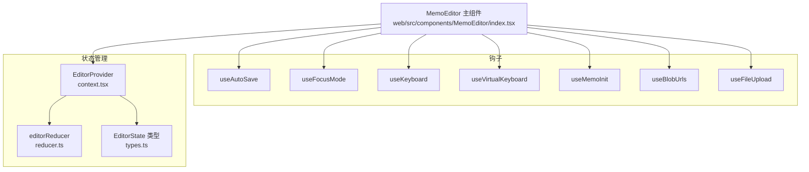

**图表来源**
- [index.tsx](file://web/src/components/MemoEditor/index.tsx#L21-L162)
- [useAutoSave.ts](file://web/src/components/MemoEditor/hooks/useAutoSave.ts#L4-L9)
- [useFocusMode.ts](file://web/src/components/MemoEditor/hooks/useFocusMode.ts#L3-L9)
- [useKeyboard.ts](file://web/src/components/MemoEditor/hooks/useKeyboard.ts#L8-L19)
- [useVirtualKeyboard.ts](file://web/src/components/MemoEditor/hooks/useVirtualKeyboard.ts#L15-L41)
- [useMemoInit.ts](file://web/src/components/MemoEditor/hooks/useMemoInit.ts#L9-L68)
- [useBlobUrls.ts](file://web/src/components/MemoEditor/hooks/useBlobUrls.ts#L3-L28)
- [useFileUpload.ts](file://web/src/components/MemoEditor/hooks/useFileUpload.ts#L4-L34)
- [context.tsx](file://web/src/components/MemoEditor/state/context.tsx#L27-L40)
- [reducer.ts](file://web/src/components/MemoEditor/state/reducer.ts#L4-L130)
- [types.ts](file://web/src/components/MemoEditor/state/types.ts#L8-L73)

**章节来源**
- [index.tsx](file://web/src/components/MemoEditor/index.tsx#L21-L162)
- [context.tsx](file://web/src/components/MemoEditor/state/context.tsx#L27-L40)

## 核心组件
- MemoEditor 主组件：负责装配钩子、调用服务层、协调状态与 UI 呈现
- useAutoSave：内容变更时写入本地缓存，实现断电续写
- useFocusMode：切换焦点模式时锁定/解锁页面滚动
- useKeyboard：监听 Ctrl/Cmd+Enter 触发保存
- useVirtualKeyboard：移动端键盘高度检测，动态调整底部间距
- useMemoInit：初始化编辑器，支持从服务端加载或从缓存恢复
- useBlobUrls：统一管理 Blob URL 生命周期，避免内存泄漏
- useFileUpload：文件选择与预览生成，配合 Blob URL 管理

**章节来源**
- [index.tsx](file://web/src/components/MemoEditor/index.tsx#L60-L125)
- [useAutoSave.ts](file://web/src/components/MemoEditor/hooks/useAutoSave.ts#L4-L9)
- [useFocusMode.ts](file://web/src/components/MemoEditor/hooks/useFocusMode.ts#L3-L9)
- [useKeyboard.ts](file://web/src/components/MemoEditor/hooks/useKeyboard.ts#L8-L19)
- [useVirtualKeyboard.ts](file://web/src/components/MemoEditor/hooks/useVirtualKeyboard.ts#L15-L41)
- [useMemoInit.ts](file://web/src/components/MemoEditor/hooks/useMemoInit.ts#L9-L68)
- [useBlobUrls.ts](file://web/src/components/MemoEditor/hooks/useBlobUrls.ts#L3-L28)
- [useFileUpload.ts](file://web/src/components/MemoEditor/hooks/useFileUpload.ts#L4-L34)

## 架构总览
编辑器采用“组件装配 + 钩子组合 + 状态管理”的分层设计：
- 组件层：MemoEditor 主组件负责编排钩子与服务
- 钩子层：独立可复用的副作用逻辑，按需注入
- 状态层：EditorProvider 提供上下文，useReducer 统一更新
- 服务层：缓存、错误、记忆体服务等在主组件中注入

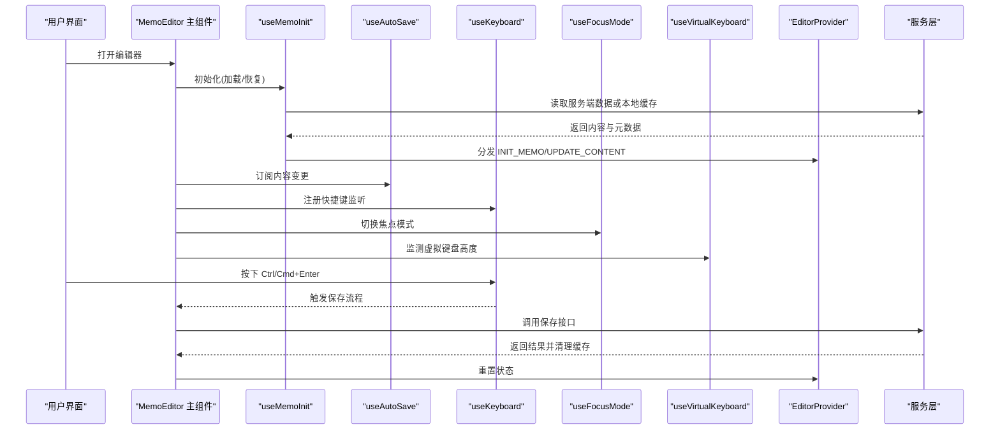

**图表来源**
- [index.tsx](file://web/src/components/MemoEditor/index.tsx#L60-L125)
- [useMemoInit.ts](file://web/src/components/MemoEditor/hooks/useMemoInit.ts#L25-L67)
- [useAutoSave.ts](file://web/src/components/MemoEditor/hooks/useAutoSave.ts#L4-L9)
- [useKeyboard.ts](file://web/src/components/MemoEditor/hooks/useKeyboard.ts#L8-L19)
- [useFocusMode.ts](file://web/src/components/MemoEditor/hooks/useFocusMode.ts#L3-L9)
- [useVirtualKeyboard.ts](file://web/src/components/MemoEditor/hooks/useVirtualKeyboard.ts#L15-L41)
- [context.tsx](file://web/src/components/MemoEditor/state/context.tsx#L27-L40)

## 详细组件分析

### 自动保存钩子 useAutoSave
- 设计模式：订阅式副作用，基于依赖数组触发写入
- 依赖注入：通过缓存服务进行持久化
- 状态管理：不直接修改全局状态，仅影响本地缓存
- 参数配置：内容、用户名、缓存键
- 使用场景：断电续写、多标签页协作、临时草稿
- 扩展方法：支持自定义节流/防抖、增量同步到服务端

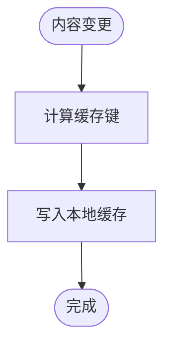

**图表来源**
- [useAutoSave.ts](file://web/src/components/MemoEditor/hooks/useAutoSave.ts#L4-L9)

**章节来源**
- [useAutoSave.ts](file://web/src/components/MemoEditor/hooks/useAutoSave.ts#L4-L9)
- [index.tsx](file://web/src/components/MemoEditor/index.tsx#L63-L63)

### 焦点模式钩子 useFocusMode
- 设计模式：副作用钩子，挂载时锁定滚动，卸载时恢复
- 依赖注入：直接操作 DOM 属性
- 状态管理：切换 EditorState.ui.isFocusMode
- 使用场景：沉浸式写作、减少干扰
- 扩展方法：支持过渡动画、全屏 API 兼容

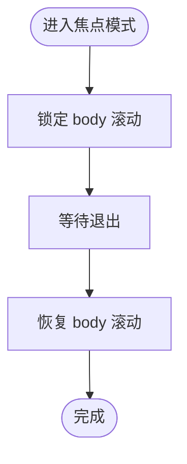

**图表来源**
- [useFocusMode.ts](file://web/src/components/MemoEditor/hooks/useFocusMode.ts#L3-L9)
- [reducer.ts](file://web/src/components/MemoEditor/state/reducer.ts#L83-L90)

**章节来源**
- [useFocusMode.ts](file://web/src/components/MemoEditor/hooks/useFocusMode.ts#L3-L9)
- [reducer.ts](file://web/src/components/MemoEditor/state/reducer.ts#L83-L90)

### 键盘事件钩子 useKeyboard
- 设计模式：全局事件监听，解绑清理
- 依赖注入：接收保存回调作为选项
- 状态管理：不改变编辑器状态，仅触发保存流程
- 使用场景：快速保存、无障碍访问
- 扩展方法：支持更多快捷键、平台差异化处理

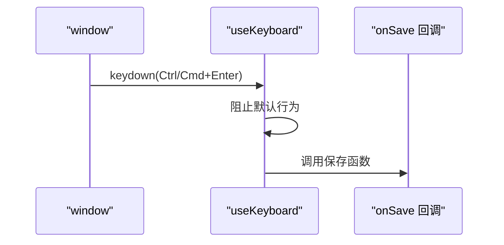

**图表来源**
- [useKeyboard.ts](file://web/src/components/MemoEditor/hooks/useKeyboard.ts#L8-L19)

**章节来源**
- [useKeyboard.ts](file://web/src/components/MemoEditor/hooks/useKeyboard.ts#L8-L19)
- [index.tsx](file://web/src/components/MemoEditor/index.tsx#L75-L75)

### 虚拟键盘适配 useVirtualKeyboard
- 设计模式：基于 VisualViewport API 的响应式检测
- 依赖注入：无外部依赖，纯浏览器 API
- 状态管理：返回当前键盘高度，由组件应用到样式
- 使用场景：移动端输入体验优化
- 扩展方法：支持横竖屏切换、多窗口环境

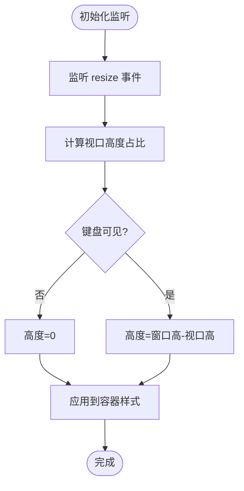

**图表来源**
- [useVirtualKeyboard.ts](file://web/src/components/MemoEditor/hooks/useVirtualKeyboard.ts#L15-L41)

**章节来源**
- [useVirtualKeyboard.ts](file://web/src/components/MemoEditor/hooks/useVirtualKeyboard.ts#L15-L41)
- [index.tsx](file://web/src/components/MemoEditor/index.tsx#L66-L66)

### 初始化钩子 useMemoInit
- 设计模式：惰性初始化，避免重复请求
- 依赖注入：查询客户端、编辑器上下文、缓存与服务
- 状态管理：根据 memoName 决定加载路径（服务端/缓存）
- 使用场景：新建/编辑记忆体的初始化
- 扩展方法：支持并发初始化、失败重试

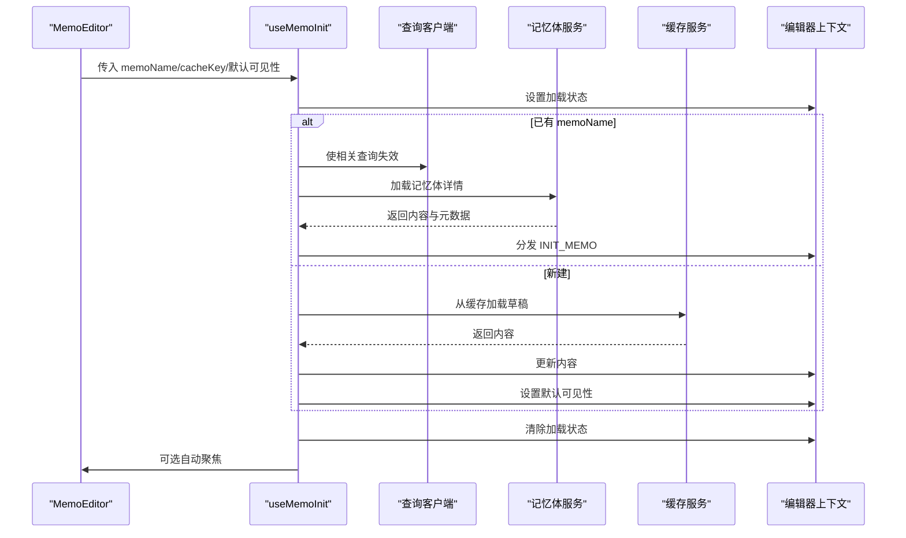

**图表来源**
- [useMemoInit.ts](file://web/src/components/MemoEditor/hooks/useMemoInit.ts#L9-L68)
- [index.tsx](file://web/src/components/MemoEditor/index.tsx#L60-L60)

**章节来源**
- [useMemoInit.ts](file://web/src/components/MemoEditor/hooks/useMemoInit.ts#L9-L68)

### Blob URL 处理 useBlobUrls
- 设计模式：集中式生命周期管理
- 依赖注入：React 引用与浏览器 URL API
- 状态管理：内部维护已创建 URL 集合
- 使用场景：图片/文件预览、拖拽上传
- 扩展方法：支持批量清理、统计内存占用

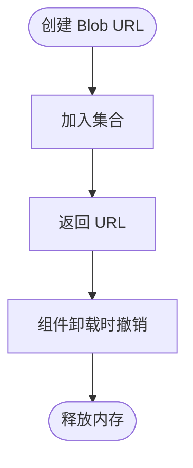

**图表来源**
- [useBlobUrls.ts](file://web/src/components/MemoEditor/hooks/useBlobUrls.ts#L3-L28)

**章节来源**
- [useBlobUrls.ts](file://web/src/components/MemoEditor/hooks/useBlobUrls.ts#L3-L28)

### 文件上传 useFileUpload
- 设计模式：受控表单 + 预览生成
- 依赖注入：回调函数与引用
- 状态管理：将本地文件与预览 URL 关联
- 使用场景：附件上传、Markdown 图片插入
- 扩展方法：支持拖拽、多选、进度反馈

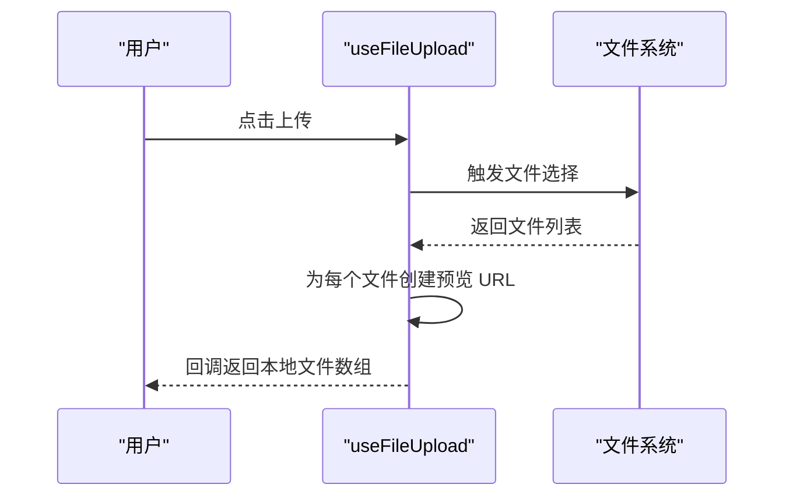

**图表来源**
- [useFileUpload.ts](file://web/src/components/MemoEditor/hooks/useFileUpload.ts#L4-L34)

**章节来源**
- [useFileUpload.ts](file://web/src/components/MemoEditor/hooks/useFileUpload.ts#L4-L34)

### 状态管理与依赖注入
- 上下文：EditorProvider 提供状态与动作派发
- Reducer：集中式状态更新，类型安全
- 类型：明确 EditorState 结构与动作集合
- 依赖注入：主组件注入服务层与上下文，钩子通过上下文获取状态

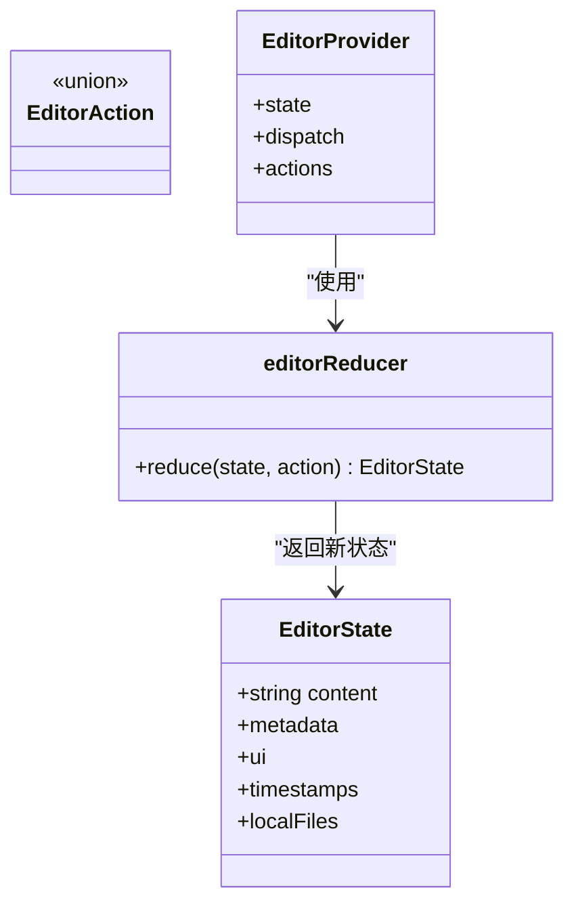

**图表来源**
- [types.ts](file://web/src/components/MemoEditor/state/types.ts#L8-L73)
- [context.tsx](file://web/src/components/MemoEditor/state/context.tsx#L27-L40)
- [reducer.ts](file://web/src/components/MemoEditor/state/reducer.ts#L4-L130)

**章节来源**
- [context.tsx](file://web/src/components/MemoEditor/state/context.tsx#L7-L40)
- [reducer.ts](file://web/src/components/MemoEditor/state/reducer.ts#L4-L130)
- [types.ts](file://web/src/components/MemoEditor/state/types.ts#L8-L73)

## 依赖关系分析
- 组件对钩子：MemoEditor 通过导入钩子实现功能拼装
- 钩子对上下文：useMemoInit、useFocusMode 等通过上下文读写状态
- 钩子对服务：useMemoInit 依赖查询客户端与服务；useAutoSave 依赖缓存服务
- 钩子对浏览器：useVirtualKeyboard 依赖 VisualViewport；useKeyboard 依赖 window 事件
- 钩子对内存：useBlobUrls 管理 Blob URL 生命周期

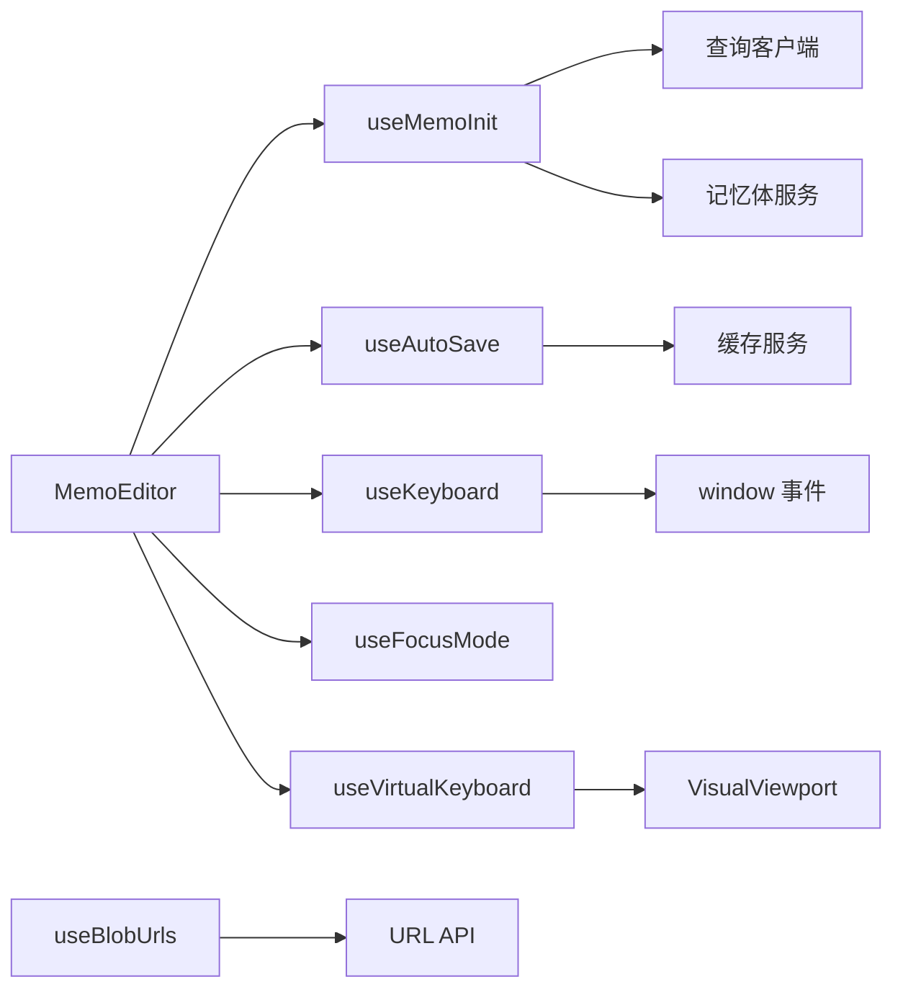

**图表来源**
- [index.tsx](file://web/src/components/MemoEditor/index.tsx#L60-L125)
- [useMemoInit.ts](file://web/src/components/MemoEditor/hooks/useMemoInit.ts#L17-L68)
- [useAutoSave.ts](file://web/src/components/MemoEditor/hooks/useAutoSave.ts#L4-L9)
- [useVirtualKeyboard.ts](file://web/src/components/MemoEditor/hooks/useVirtualKeyboard.ts#L15-L41)
- [useKeyboard.ts](file://web/src/components/MemoEditor/hooks/useKeyboard.ts#L8-L19)
- [useBlobUrls.ts](file://web/src/components/MemoEditor/hooks/useBlobUrls.ts#L3-L28)

**章节来源**
- [index.tsx](file://web/src/components/MemoEditor/index.tsx#L60-L125)

## 性能考虑
- 节流与防抖：对高频输入（如自动保存）建议增加节流/防抖，降低写盘频率
- 依赖数组优化：确保钩子依赖最小化，避免不必要的重渲染
- 内存优化：及时撤销 Blob URL，避免内存泄漏；合理清理事件监听
- 并发控制：初始化阶段避免重复请求，使用查询客户端的失效与缓存策略
- 滚动锁定：焦点模式仅在必要时开启，避免长时间阻塞滚动
- 虚拟键盘：仅在键盘可见时应用额外间距，减少布局抖动

## 故障排除指南
- 快捷键无效
  - 检查事件绑定是否正确，确认回调未被覆盖
  - 在不同平台验证 Meta/Ctrl 键识别
- 焦点模式滚动异常
  - 确认卸载时是否恢复滚动属性
  - 检查是否有其他元素覆盖了滚动锁定
- 虚拟键盘高度不准确
  - 确保在支持 VisualViewport 的环境中运行
  - 横竖屏切换时重新计算高度
- 自动保存未生效
  - 检查缓存键是否正确，用户上下文是否一致
  - 确认依赖数组包含所有相关值
- Blob URL 导致内存泄漏
  - 确保组件卸载时调用撤销函数
  - 避免重复创建相同内容的 URL

**章节来源**
- [useKeyboard.ts](file://web/src/components/MemoEditor/hooks/useKeyboard.ts#L8-L19)
- [useFocusMode.ts](file://web/src/components/MemoEditor/hooks/useFocusMode.ts#L3-L9)
- [useVirtualKeyboard.ts](file://web/src/components/MemoEditor/hooks/useVirtualKeyboard.ts#L15-L41)
- [useAutoSave.ts](file://web/src/components/MemoEditor/hooks/useAutoSave.ts#L4-L9)
- [useBlobUrls.ts](file://web/src/components/MemoEditor/hooks/useBlobUrls.ts#L3-L28)

## 结论
编辑器自定义钩子通过“单一职责、可组合”的设计，实现了自动保存、焦点模式、键盘事件、虚拟键盘适配、Blob URL 管理与初始化等核心能力。配合上下文与 Reducer 的状态管理，形成清晰的控制流与稳定的用户体验。建议在实际项目中结合业务需求扩展钩子能力，并遵循性能与内存优化的最佳实践。

## 附录
- 使用场景与参数配置
  - 自动保存：内容、用户名、缓存键
  - 焦点模式：布尔状态
  - 键盘事件：保存回调
  - 虚拟键盘：无参数，返回高度
  - 初始化：memoName、cacheKey、用户名、自动聚焦、默认可见性
  - Blob URL：创建/撤销函数
  - 文件上传：文件选择回调
- 扩展方法
  - 增加节流/防抖
  - 支持更多快捷键与平台差异
  - 增强虚拟键盘阈值与兼容性
  - 批量撤销与内存统计
  - 并发初始化与重试机制