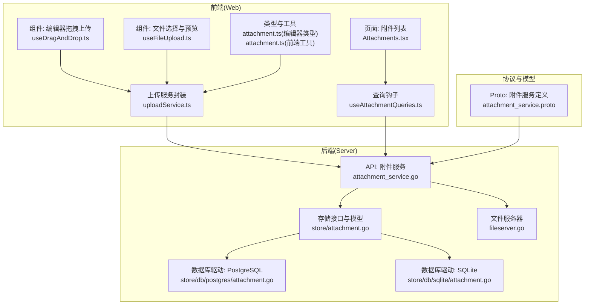
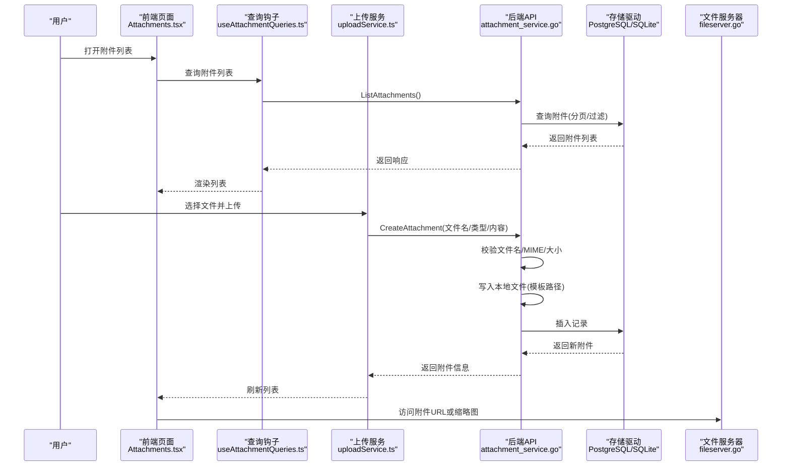
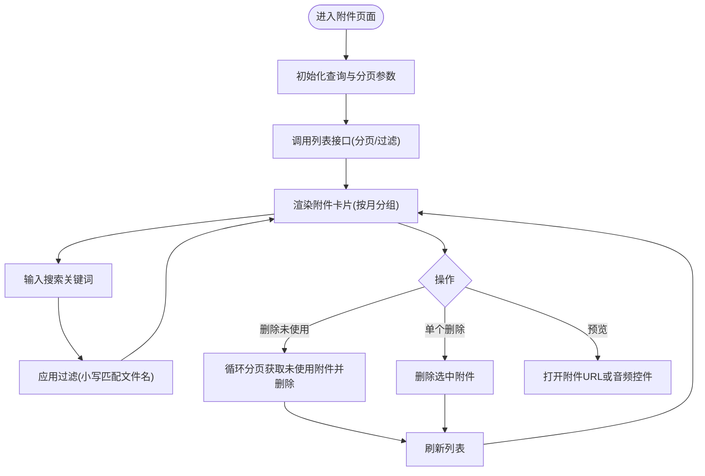
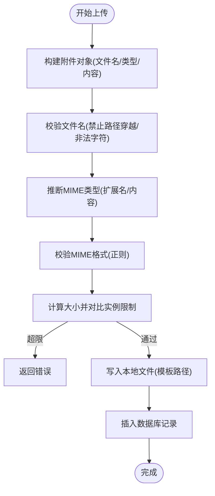
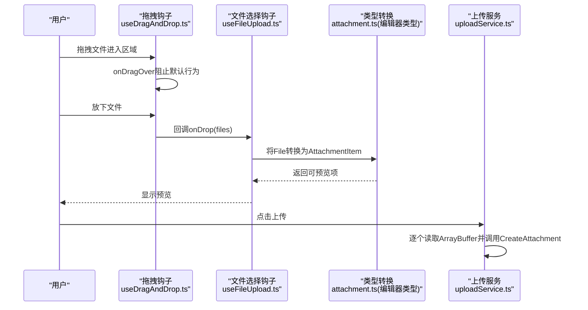
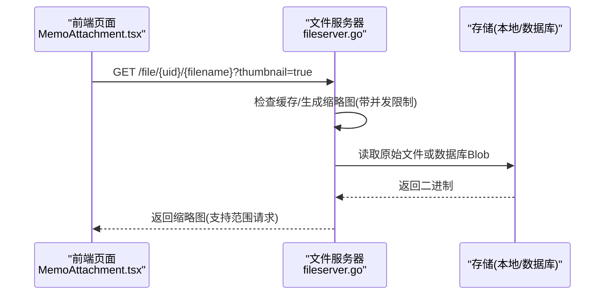
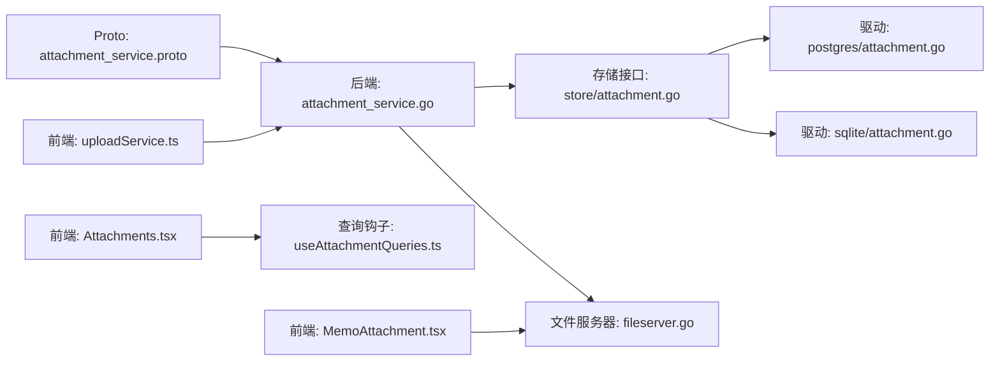

# 附件管理系统

<cite>
**本文档引用的文件**
- [attachment_service.proto](file://proto/api/v1/attachment_service.proto)
- [attachment_service.go](file://server/router/api/v1/attachment_service.go)
- [attachment.go（后端存储）](file://store/attachment.go)
- [attachment.go（PostgreSQL驱动）](file://store/db/postgres/attachment.go)
- [attachment.go（SQLite驱动）](file://store/db/sqlite/attachment.go)
- [Attachments.tsx](file://web/src/pages/Attachments.tsx)
- [MemoAttachment.tsx](file://web/src/components/MemoAttachment.tsx)
- [attachment.ts（前端工具）](file://web/src/utils/attachment.ts)
- [useAttachmentQueries.ts](file://web/src/hooks/useAttachmentQueries.ts)
- [useDragAndDrop.ts](file://web/src/components/MemoEditor/hooks/useDragAndDrop.ts)
- [useFileUpload.ts](file://web/src/components/MemoEditor/hooks/useFileUpload.ts)
- [attachment.ts（编辑器类型）](file://web/src/components/MemoEditor/types/attachment.ts)
- [uploadService.ts](file://web/src/components/MemoEditor/services/uploadService.ts)
- [fileserver.go](file://server/router/fileserver/fileserver.go)
</cite>

## 目录
1. [简介](#简介)
2. [项目结构](#项目结构)
3. [核心组件](#核心组件)
4. [架构总览](#架构总览)
5. [详细组件分析](#详细组件分析)
6. [依赖关系分析](#依赖关系分析)
7. [性能考量](#性能考量)
8. [故障排查指南](#故障排查指南)
9. [结论](#结论)
10. [附录](#附录)

## 简介
本文件为附件管理系统的详细技术文档，覆盖以下主题：
- 附件列表：文件展示、分页与筛选、删除与批量清理
- 上传服务：文件类型检查、大小限制、内容写入与存储策略
- 拖拽上传：拖放事件处理与文件验证
- 预览与下载：URL生成、缩略图缓存与范围请求支持
- 类型定义、存储策略与安全考虑
- 文件压缩、缓存机制与用户体验优化最佳实践

## 项目结构
系统采用前后端分离架构，前端使用React + TanStack Query，后端基于Go语言，通过Connect/HTTP提供API，并以PostgreSQL或SQLite作为持久化存储。

图表来源
- [attachment_service.go](file://server/router/api/v1/attachment_service.go#L1-L465)
- [attachment.go（后端存储）](file://store/attachment.go#L1-L154)
- [attachment.go（PostgreSQL驱动）](file://store/db/postgres/attachment.go#L1-L290)
- [attachment.go（SQLite驱动）](file://store/db/sqlite/attachment.go#L1-L222)
- [Attachments.tsx](file://web/src/pages/Attachments.tsx#L1-L293)
- [useDragAndDrop.ts](file://web/src/components/MemoEditor/hooks/useDragAndDrop.ts#L1-L22)
- [useFileUpload.ts](file://web/src/components/MemoEditor/hooks/useFileUpload.ts#L1-L35)
- [attachment.ts（编辑器类型）](file://web/src/components/MemoEditor/types/attachment.ts#L1-L82)
- [attachment.ts（前端工具）](file://web/src/utils/attachment.ts#L1-L55)
- [uploadService.ts](file://web/src/components/MemoEditor/services/uploadService.ts#L1-L28)
- [useAttachmentQueries.ts](file://web/src/hooks/useAttachmentQueries.ts#L1-L58)
- [fileserver.go](file://server/router/fileserver/fileserver.go#L66-L81)

章节来源
- [attachment_service.go](file://server/router/api/v1/attachment_service.go#L1-L465)
- [attachment.go（后端存储）](file://store/attachment.go#L1-L154)
- [attachment.go（PostgreSQL驱动）](file://store/db/postgres/attachment.go#L1-L290)
- [attachment.go（SQLite驱动）](file://store/db/sqlite/attachment.go#L1-L222)
- [Attachments.tsx](file://web/src/pages/Attachments.tsx#L1-L293)
- [useDragAndDrop.ts](file://web/src/components/MemoEditor/hooks/useDragAndDrop.ts#L1-L22)
- [useFileUpload.ts](file://web/src/components/MemoEditor/hooks/useFileUpload.ts#L1-L35)
- [attachment.ts（编辑器类型）](file://web/src/components/MemoEditor/types/attachment.ts#L1-L82)
- [attachment.ts（前端工具）](file://web/src/utils/attachment.ts#L1-L55)
- [uploadService.ts](file://web/src/components/MemoEditor/services/uploadService.ts#L1-L28)
- [useAttachmentQueries.ts](file://web/src/hooks/useAttachmentQueries.ts#L1-L58)
- [fileserver.go](file://server/router/fileserver/fileserver.go#L66-L81)

## 核心组件
- 前端附件列表页面：负责分页加载、搜索过滤、分组展示、删除未使用资源等
- 上传服务封装：将本地File转换为二进制并调用后端CreateAttachment
- 后端附件服务：校验文件名与MIME类型、读取实例存储配置、保存文件、返回附件信息
- 存储层：抽象出Attachment模型与Find/Update/Delete条件，分别由PostgreSQL与SQLite驱动实现
- 文件服务器：提供附件下载与缩略图生成，支持并发控制与缓存

章节来源
- [Attachments.tsx](file://web/src/pages/Attachments.tsx#L71-L293)
- [uploadService.ts](file://web/src/components/MemoEditor/services/uploadService.ts#L7-L28)
- [attachment_service.go](file://server/router/api/v1/attachment_service.go#L47-L141)
- [attachment.go（后端存储）](file://store/attachment.go#L15-L84)
- [attachment.go（PostgreSQL驱动）](file://store/db/postgres/attachment.go#L46-L223)
- [attachment.go（SQLite驱动）](file://store/db/sqlite/attachment.go#L42-L171)
- [fileserver.go](file://server/router/fileserver/fileserver.go#L66-L81)

## 架构总览
下图展示了从前端到后端的完整流程，包括上传、存储与预览路径。

图表来源
- [Attachments.tsx](file://web/src/pages/Attachments.tsx#L92-L154)
- [useAttachmentQueries.ts](file://web/src/hooks/useAttachmentQueries.ts#L14-L38)
- [uploadService.ts](file://web/src/components/MemoEditor/services/uploadService.ts#L7-L28)
- [attachment_service.go](file://server/router/api/v1/attachment_service.go#L47-L141)
- [attachment.go（PostgreSQL驱动）](file://store/db/postgres/attachment.go#L17-L44)
- [attachment.go（SQLite驱动）](file://store/db/sqlite/attachment.go#L17-L40)
- [fileserver.go](file://server/router/fileserver/fileserver.go#L66-L81)

## 详细组件分析

### 附件列表实现（展示、删除、预览）
- 展示与分页
  - 前端按月分组显示附件，支持搜索过滤与“加载更多”
  - 使用TanStack Query进行数据缓存与失效，避免重复请求
- 删除与批量清理
  - 支持删除未使用的附件，通过循环分页拉取并批量删除
- 预览
  - 对音频文件（非MIDI）直接渲染audio控件；其他类型通过打开附件URL进行预览
  - URL生成规则：优先外部链接，否则拼接“/file/{name}/{filename}”

图表来源
- [Attachments.tsx](file://web/src/pages/Attachments.tsx#L71-L293)
- [MemoAttachment.tsx](file://web/src/components/MemoAttachment.tsx#L10-L37)
- [attachment.ts（前端工具）](file://web/src/utils/attachment.ts#L3-L13)

章节来源
- [Attachments.tsx](file://web/src/pages/Attachments.tsx#L71-L293)
- [MemoAttachment.tsx](file://web/src/components/MemoAttachment.tsx#L10-L37)
- [attachment.ts（前端工具）](file://web/src/utils/attachment.ts#L3-L13)

### 上传服务实现（类型检查、大小限制、进度跟踪）
- 文件类型检查
  - 若未显式提供MIME类型，则根据扩展名或内容检测；随后对MIME格式进行正则校验
  - 文件名禁止路径穿越与非法字符
- 大小限制
  - 从实例设置读取上传大小上限（MiB转字节），若未配置则回落到内存缓冲上限
- 进度跟踪
  - 当前实现逐个文件上传为同步顺序执行，未内置前端进度回调
  - 可通过在前端增加FormData + XMLHttpRequest 的progress事件实现更细粒度的进度反馈
- 存储策略
  - 本地文件写入：根据路径模板生成目标路径，确保目录存在并写入文件
  - 内容清空：仅保留Reference与StorageType，避免将大块二进制回传给前端

图表来源
- [attachment_service.go](file://server/router/api/v1/attachment_service.go#L47-L141)
- [attachment_service.go](file://server/router/api/v1/attachment_service.go#L316-L356)
- [attachment_service.go](file://server/router/api/v1/attachment_service.go#L415-L440)

章节来源
- [attachment_service.go](file://server/router/api/v1/attachment_service.go#L47-L141)
- [attachment_service.go](file://server/router/api/v1/attachment_service.go#L316-L356)
- [attachment_service.go](file://server/router/api/v1/attachment_service.go#L415-L440)

### 拖拽上传实现（拖放事件处理与文件验证）
- 拖放事件处理
  - onDragOver：当拖入“Files”类型时阻止默认行为并设置复制效果
  - onDrop：阻止默认行为并将拖拽的文件列表传递给上层处理
- 文件选择与预览
  - 通过隐藏的input触发选择文件，读取File对象并生成Object URL用于预览
- 编辑器集成
  - 将本地文件转换为统一视图模型（含缩略图URL、源URL、分类等），便于在编辑器中展示与上传

图表来源
- [useDragAndDrop.ts](file://web/src/components/MemoEditor/hooks/useDragAndDrop.ts#L1-L22)
- [useFileUpload.ts](file://web/src/components/MemoEditor/hooks/useFileUpload.ts#L1-L35)
- [attachment.ts（编辑器类型）](file://web/src/components/MemoEditor/types/attachment.ts#L30-L61)
- [uploadService.ts](file://web/src/components/MemoEditor/services/uploadService.ts#L7-L28)

章节来源
- [useDragAndDrop.ts](file://web/src/components/MemoEditor/hooks/useDragAndDrop.ts#L1-L22)
- [useFileUpload.ts](file://web/src/components/MemoEditor/hooks/useFileUpload.ts#L1-L35)
- [attachment.ts（编辑器类型）](file://web/src/components/MemoEditor/types/attachment.ts#L30-L61)
- [uploadService.ts](file://web/src/components/MemoEditor/services/uploadService.ts#L7-L28)

### 预览与下载（URL生成、缩略图缓存与范围请求）
- URL生成
  - 优先使用外部链接；否则使用“/file/{name}/{filename}”的内部访问地址
- 缩略图缓存
  - 文件服务器提供缩略图生成与缓存，使用信号量限制并发，避免内存压力
- 范围请求
  - 文件服务器针对视频/音频播放场景，正确处理Range请求，保证Safari等浏览器正常播放

图表来源
- [MemoAttachment.tsx](file://web/src/components/MemoAttachment.tsx#L10-L37)
- [attachment.ts（前端工具）](file://web/src/utils/attachment.ts#L11-L13)
- [fileserver.go](file://server/router/fileserver/fileserver.go#L66-L81)
- [fileserver.go](file://server/router/fileserver/fileserver.go#L414-L436)

章节来源
- [MemoAttachment.tsx](file://web/src/components/MemoAttachment.tsx#L10-L37)
- [attachment.ts（前端工具）](file://web/src/utils/attachment.ts#L11-L13)
- [fileserver.go](file://server/router/fileserver/fileserver.go#L66-L81)
- [fileserver.go](file://server/router/fileserver/fileserver.go#L414-L436)

### 附件类型定义、存储策略与安全考虑
- 类型定义
  - Proto定义了附件的标识、创建时间、文件名、内容、外部链接、MIME类型、大小、关联Memo等字段
- 存储策略
  - 本地文件存储：根据路径模板写入磁盘，Reference记录相对/绝对路径，Reference字段用于后续读取
  - 数据库存储：当前实现主要使用本地文件存储，数据库字段用于元数据与索引
- 安全考虑
  - 文件名校验：拒绝路径穿越与非法字符
  - MIME类型校验：限制格式长度与合法字符
  - 实例设置：通过系统设置控制上传大小上限，防止滥用

章节来源
- [attachment_service.proto](file://proto/api/v1/attachment_service.proto#L48-L81)
- [attachment_service.go](file://server/router/api/v1/attachment_service.go#L415-L440)
- [attachment_service.go](file://server/router/api/v1/attachment_service.go#L316-L356)

## 依赖关系分析

图表来源
- [attachment_service.proto](file://proto/api/v1/attachment_service.proto#L15-L46)
- [attachment_service.go](file://server/router/api/v1/attachment_service.go#L1-L465)
- [attachment.go（后端存储）](file://store/attachment.go#L1-L154)
- [attachment.go（PostgreSQL驱动）](file://store/db/postgres/attachment.go#L1-L290)
- [attachment.go（SQLite驱动）](file://store/db/sqlite/attachment.go#L1-L222)
- [fileserver.go](file://server/router/fileserver/fileserver.go#L66-L81)
- [Attachments.tsx](file://web/src/pages/Attachments.tsx#L1-L293)
- [useAttachmentQueries.ts](file://web/src/hooks/useAttachmentQueries.ts#L1-L58)
- [uploadService.ts](file://web/src/components/MemoEditor/services/uploadService.ts#L1-L28)
- [MemoAttachment.tsx](file://web/src/components/MemoAttachment.tsx#L1-L37)

章节来源
- [attachment_service.proto](file://proto/api/v1/attachment_service.proto#L15-L46)
- [attachment_service.go](file://server/router/api/v1/attachment_service.go#L1-L465)
- [attachment.go（后端存储）](file://store/attachment.go#L1-L154)
- [attachment.go（PostgreSQL驱动）](file://store/db/postgres/attachment.go#L1-L290)
- [attachment.go（SQLite驱动）](file://store/db/sqlite/attachment.go#L1-L222)
- [fileserver.go](file://server/router/fileserver/fileserver.go#L66-L81)
- [Attachments.tsx](file://web/src/pages/Attachments.tsx#L1-L293)
- [useAttachmentQueries.ts](file://web/src/hooks/useAttachmentQueries.ts#L1-L58)
- [uploadService.ts](file://web/src/components/MemoEditor/services/uploadService.ts#L1-L28)
- [MemoAttachment.tsx](file://web/src/components/MemoAttachment.tsx#L1-L37)

## 性能考量
- 上传内存缓冲
  - 上传内存缓冲上限固定，避免单次请求占用过多内存
- 分页与默认限制
  - 列表默认限制与最大限制，避免一次性加载过多附件
- 并发控制
  - 缩略图生成使用信号量限制并发，防止高并发导致内存压力
- 范围请求
  - 正确处理Range请求，减少不必要的全量传输，提升视频/音频播放体验

章节来源
- [attachment_service.go](file://server/router/api/v1/attachment_service.go#L32-L40)
- [attachment.go（后端存储）](file://store/attachment.go#L93-L106)
- [fileserver.go](file://server/router/fileserver/fileserver.go#L51-L62)

## 故障排查指南
- 无法上传或提示大小超限
  - 检查实例设置中的上传大小限制是否合理
  - 确认前端上传逻辑是否正确计算并对比限制
- 文件名或MIME类型校验失败
  - 确保文件名不包含路径分隔符且不以空格或点开头/结尾
  - 确认MIME类型符合格式要求
- 删除附件后仍可见
  - 确认前端缓存已失效（TanStack Query的invalidateQueries）
  - 检查后端删除逻辑是否成功并返回空响应
- 缩略图不显示或生成缓慢
  - 检查缩略图缓存目录权限与空间
  - 关注并发限制是否过低，必要时调整信号量

章节来源
- [attachment_service.go](file://server/router/api/v1/attachment_service.go#L104-L110)
- [attachment_service.go](file://server/router/api/v1/attachment_service.go#L415-L440)
- [useAttachmentQueries.ts](file://web/src/hooks/useAttachmentQueries.ts#L34-L57)
- [fileserver.go](file://server/router/fileserver/fileserver.go#L414-L436)

## 结论
该附件管理系统在前后端协同下实现了完整的附件生命周期管理：从上传校验、本地存储、列表展示、删除清理到预览下载。通过合理的分页与并发控制策略，在保证安全性的同时兼顾了性能与用户体验。建议后续增强前端上传进度反馈与后端流式上传能力，进一步提升大文件处理体验。

## 附录
- 最佳实践清单
  - 上传：前端增加进度条与取消上传能力；后端支持流式写入与断点续传（可选）
  - 存储：定期清理未使用附件；对大文件启用压缩（如适用）与CDN加速
  - 缓存：缩略图缓存目录定期清理；浏览器端对常用附件做短期缓存
  - 安全：严格校验文件名与MIME类型；限制上传大小与数量；对外链附件进行白名单校验
  - 用户体验：在编辑器中支持拖拽上传与多文件队列；提供批量删除与导出能力