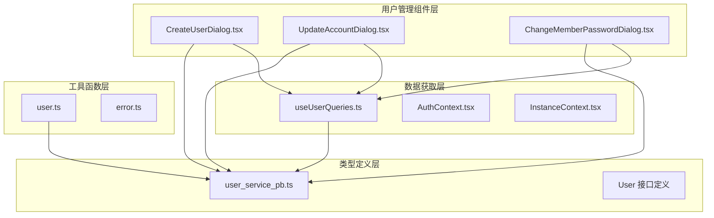
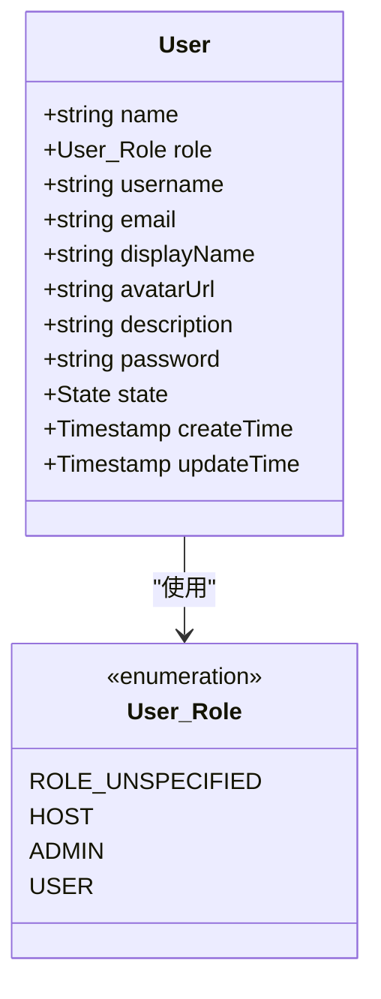
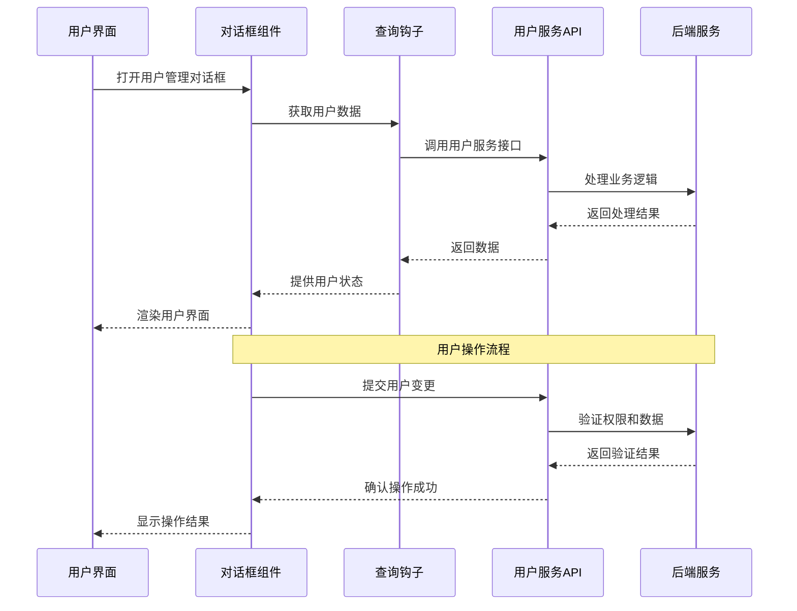
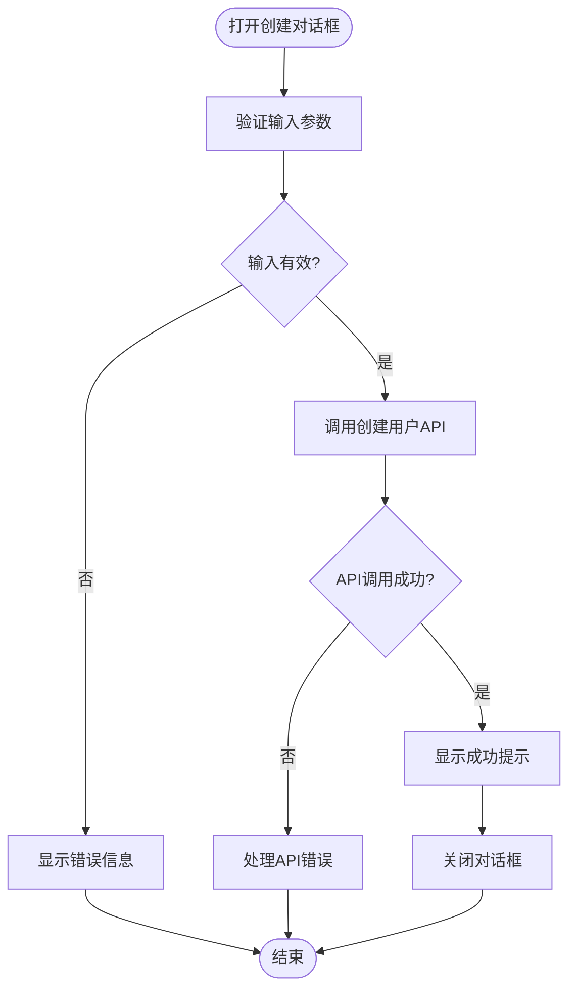
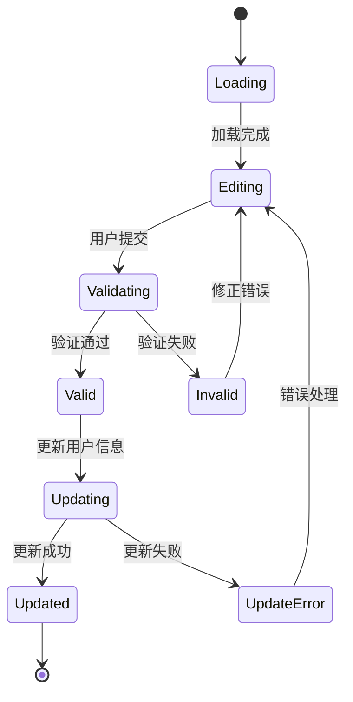
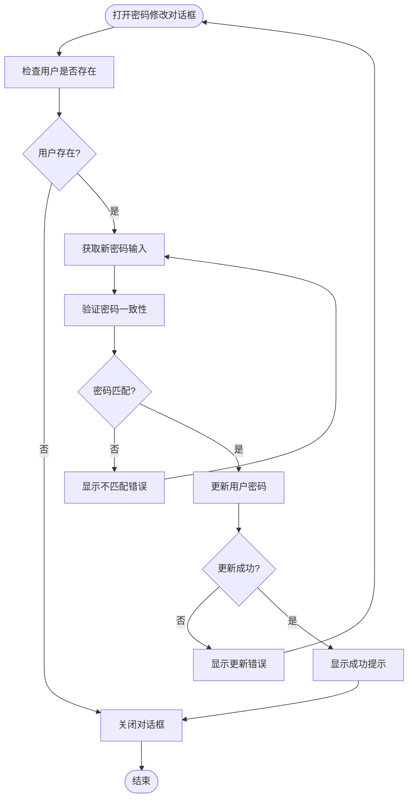
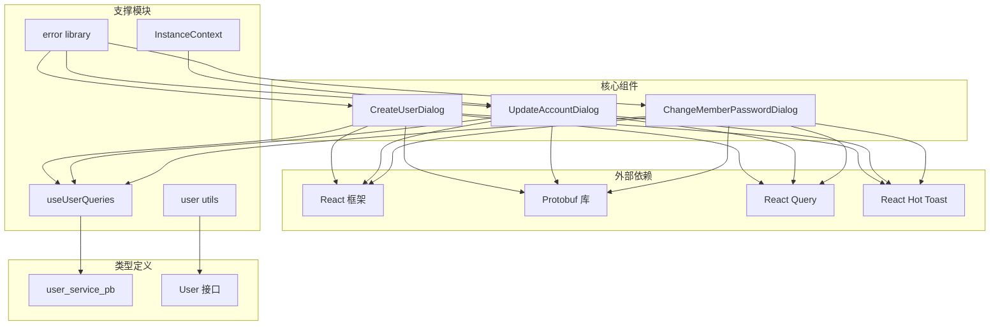

# 用户管理对话框

<cite>
**本文档引用的文件**
- [CreateUserDialog.tsx](file://web/src/components/CreateUserDialog.tsx)
- [UpdateAccountDialog.tsx](file://web/src/components/UpdateAccountDialog.tsx)
- [ChangeMemberPasswordDialog.tsx](file://web/src/components/ChangeMemberPasswordDialog.tsx)
- [user_service_pb.ts](file://web/src/types/proto/api/v1/user_service_pb.ts)
- [useUserQueries.ts](file://web/src/hooks/useUserQueries.ts)
- [user.ts](file://web/src/utils/user.ts)
- [InstanceContext.tsx](file://web/src/contexts/InstanceContext.tsx)
- [Setting.tsx](file://web/src/pages/Setting.tsx)
- [error.ts](file://web/src/lib/error.ts)
- [user_service.go](file://server/router/api/v1/user_service.go)
</cite>

## 目录
1. [简介](#简介)
2. [项目结构](#项目结构)
3. [核心组件](#核心组件)
4. [架构概览](#架构概览)
5. [详细组件分析](#详细组件分析)
6. [依赖关系分析](#依赖关系分析)
7. [性能考虑](#性能考虑)
8. [故障排除指南](#故障排除指南)
9. [结论](#结论)
10. [附录](#附录)

## 简介

用户管理对话框组件是 Memos 系统中用于管理用户账户的核心界面组件集合。该组件集提供了完整的用户生命周期管理功能，包括用户创建、密码修改和账户信息更新等操作。

本组件系统采用现代化的 React 构建，结合 Protobuf 类型定义和 React Query 数据获取库，实现了类型安全的用户管理功能。系统支持多种用户角色（普通用户、管理员、主机），并具备完善的权限控制和数据验证机制。

## 项目结构

用户管理对话框组件位于前端项目的组件目录中，与用户相关的类型定义、查询钩子和工具函数共同构成了完整的用户管理系统。



**图表来源**
- [CreateUserDialog.tsx](file://web/src/components/CreateUserDialog.tsx#L1-L148)
- [user_service_pb.ts](file://web/src/types/proto/api/v1/user_service_pb.ts#L1-L1540)
- [useUserQueries.ts](file://web/src/hooks/useUserQueries.ts#L1-L260)

**章节来源**
- [CreateUserDialog.tsx](file://web/src/components/CreateUserDialog.tsx#L1-L148)
- [UpdateAccountDialog.tsx](file://web/src/components/UpdateAccountDialog.tsx#L1-L224)
- [ChangeMemberPasswordDialog.tsx](file://web/src/components/ChangeMemberPasswordDialog.tsx#L1-L115)

## 核心组件

### 用户角色枚举

系统定义了完整的用户角色体系，支持三种基本角色：



**图表来源**
- [user_service_pb.ts](file://web/src/types/proto/api/v1/user_service_pb.ts#L118-L146)

### 权限检查工具

系统提供了便捷的权限检查工具函数，用于判断用户是否具有超级用户权限。

**章节来源**
- [user_service_pb.ts](file://web/src/types/proto/api/v1/user_service_pb.ts#L118-L146)
- [user.ts](file://web/src/utils/user.ts#L1-L6)

## 架构概览

用户管理对话框组件采用分层架构设计，确保了良好的可维护性和扩展性。



**图表来源**
- [CreateUserDialog.tsx](file://web/src/components/CreateUserDialog.tsx#L44-L78)
- [useUserQueries.ts](file://web/src/hooks/useUserQueries.ts#L122-L138)

## 详细组件分析

### 用户创建对话框

用户创建对话框提供了完整的用户注册功能，支持用户名、密码和角色选择。

#### 组件特性



**图表来源**
- [CreateUserDialog.tsx](file://web/src/components/CreateUserDialog.tsx#L44-L78)

#### 表单字段验证

组件实现了多层次的表单验证机制：

1. **必填字段检查**：用户名和密码在创建模式下必须填写
2. **字段变更检测**：通过比较初始值和当前值确定需要更新的字段
3. **权限验证**：根据用户角色决定可用的操作选项

**章节来源**
- [CreateUserDialog.tsx](file://web/src/components/CreateUserDialog.tsx#L23-L78)

### 账户更新对话框

账户更新对话框允许用户修改个人信息，包括头像、用户名、昵称、邮箱和描述。

#### 功能特性



**图表来源**
- [UpdateAccountDialog.tsx](file://web/src/components/UpdateAccountDialog.tsx#L108-L150)

#### 实例设置集成

对话框集成了实例级别的设置控制，如用户名和昵称的修改限制。

**章节来源**
- [UpdateAccountDialog.tsx](file://web/src/components/UpdateAccountDialog.tsx#L32-L150)
- [InstanceContext.tsx](file://web/src/contexts/InstanceContext.tsx#L52-L74)

### 密码修改对话框

密码修改对话框专门用于重置用户密码，提供了安全的密码变更流程。

#### 安全验证流程



**图表来源**
- [ChangeMemberPasswordDialog.tsx](file://web/src/components/ChangeMemberPasswordDialog.tsx#L39-L69)

**章节来源**
- [ChangeMemberPasswordDialog.tsx](file://web/src/components/ChangeMemberPasswordDialog.tsx#L19-L69)

## 依赖关系分析

用户管理对话框组件之间的依赖关系体现了清晰的职责分离和模块化设计。



**图表来源**
- [CreateUserDialog.tsx](file://web/src/components/CreateUserDialog.tsx#L1-L14)
- [useUserQueries.ts](file://web/src/hooks/useUserQueries.ts#L1-L6)
- [user_service_pb.ts](file://web/src/types/proto/api/v1/user_service_pb.ts#L1-L16)

**章节来源**
- [CreateUserDialog.tsx](file://web/src/components/CreateUserDialog.tsx#L1-L14)
- [useUserQueries.ts](file://web/src/hooks/useUserQueries.ts#L1-L6)
- [user_service_pb.ts](file://web/src/types/proto/api/v1/user_service_pb.ts#L1-L16)

## 性能考虑

### 数据缓存策略

系统采用了智能的数据缓存机制，通过 React Query 的查询键管理和缓存失效策略，确保用户数据的实时性和性能。

### 并发控制

- **请求状态管理**：使用 `useLoading` 钩子管理异步操作状态
- **并发请求限制**：避免重复提交和竞态条件
- **错误恢复**：自动重试机制和错误状态管理

### 前端优化

- **懒加载**：按需加载对话框组件
- **虚拟滚动**：对于大量用户的列表展示
- **防抖处理**：输入验证的防抖机制

## 故障排除指南

### 常见问题及解决方案

#### 用户名验证失败

**问题描述**：用户创建或更新时出现用户名无效错误

**可能原因**：
1. 用户名格式不符合要求
2. 用户名已被占用
3. 实例设置禁止修改用户名

**解决步骤**：
1. 检查用户名长度和字符格式
2. 确认用户名唯一性
3. 验证实例设置中的用户名修改权限

#### 密码修改失败

**问题描述**：密码修改对话框无法保存新密码

**可能原因**：
1. 新密码与确认密码不一致
2. 密码为空
3. 后端密码策略限制

**解决步骤**：
1. 确保两次输入的密码完全相同
2. 检查密码长度和复杂度要求
3. 验证后端密码策略配置

#### 权限不足错误

**问题描述**：普通用户尝试执行管理员操作

**解决步骤**：
1. 验证当前用户的角色权限
2. 检查目标操作的权限要求
3. 如需管理员权限，请联系系统管理员

**章节来源**
- [error.ts](file://web/src/lib/error.ts#L17-L34)
- [user_service.go](file://server/router/api/v1/user_service.go#L226-L250)

## 结论

用户管理对话框组件提供了完整、安全且用户友好的用户管理功能。通过类型安全的设计、完善的权限控制和健壮的错误处理机制，确保了系统的可靠性和易用性。

组件系统的主要优势包括：
- **类型安全**：基于 Protobuf 的强类型定义
- **权限控制**：细粒度的角色权限管理
- **用户体验**：直观的对话框界面和即时反馈
- **可扩展性**：模块化的架构设计便于功能扩展

## 附录

### 使用示例

#### 创建用户对话框

```typescript
// 在组件中使用用户创建对话框
const [isCreateDialogOpen, setIsCreateDialogOpen] = useState(false);

return (
  <>
    <Button onClick={() => setIsCreateDialogOpen(true)}>
      创建用户
    </Button>
    <CreateUserDialog
      open={isCreateDialogOpen}
      onOpenChange={setIsCreateDialogOpen}
      onSuccess={() => {
        // 刷新用户列表
        refetchUsers();
      }}
    />
  </>
);
```

#### 更新用户信息

```typescript
// 在设置页面中使用账户更新对话框
const [isUpdateDialogOpen, setIsUpdateDialogOpen] = useState(false);

return (
  <>
    <Button onClick={() => setIsUpdateDialogOpen(true)}>
      更新账户信息
    </Button>
    <UpdateAccountDialog
      open={isUpdateDialogOpen}
      onOpenChange={setIsUpdateDialogOpen}
      onSuccess={() => {
        // 刷新当前用户信息
        refetchCurrentUser();
      }}
    />
  </>
);
```

### 集成指南

#### 权限检查集成

```typescript
// 检查用户是否为超级用户
import { isSuperUser } from '@/utils/user';

if (isSuperUser(currentUser)) {
  // 显示管理员功能
}

// 或者检查特定角色
const isAdmin = currentUser?.role === User_Role.ADMIN;
```

#### 实例设置集成

```typescript
// 获取实例设置以控制界面行为
const { generalSetting } = useInstance();

// 控制用户名输入框的禁用状态
<Input
  disabled={generalSetting.disallowChangeUsername}
/>
```

### 最佳实践

#### 表单布局设计

1. **清晰的标签**：每个输入字段都应有明确的标签说明
2. **适当的间距**：使用网格系统确保元素间的合理间距
3. **响应式设计**：适配不同屏幕尺寸的设备
4. **无障碍访问**：确保键盘导航和屏幕阅读器支持

#### 错误提示处理

1. **及时反馈**：用户操作后立即提供反馈
2. **明确信息**：错误消息应该具体且易于理解
3. **优雅降级**：在网络异常时提供友好的提示
4. **状态保持**：错误处理后保持对话框状态以便用户修正

#### 用户体验优化

1. **加载状态**：长操作时显示加载指示器
2. **成功确认**：操作成功后提供明确的成功提示
3. **撤销能力**：提供撤销最近操作的能力
4. **帮助信息**：在必要时提供上下文相关的帮助文本