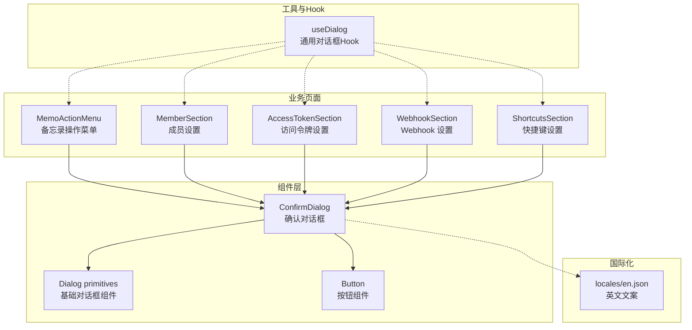
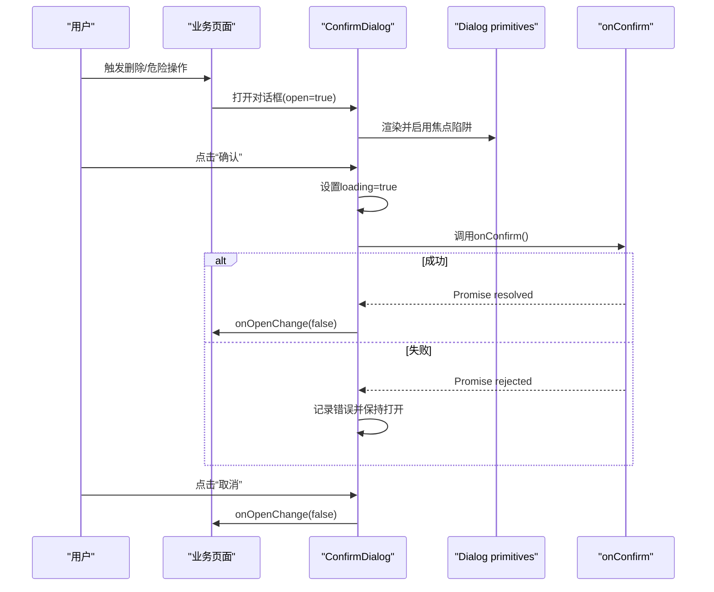
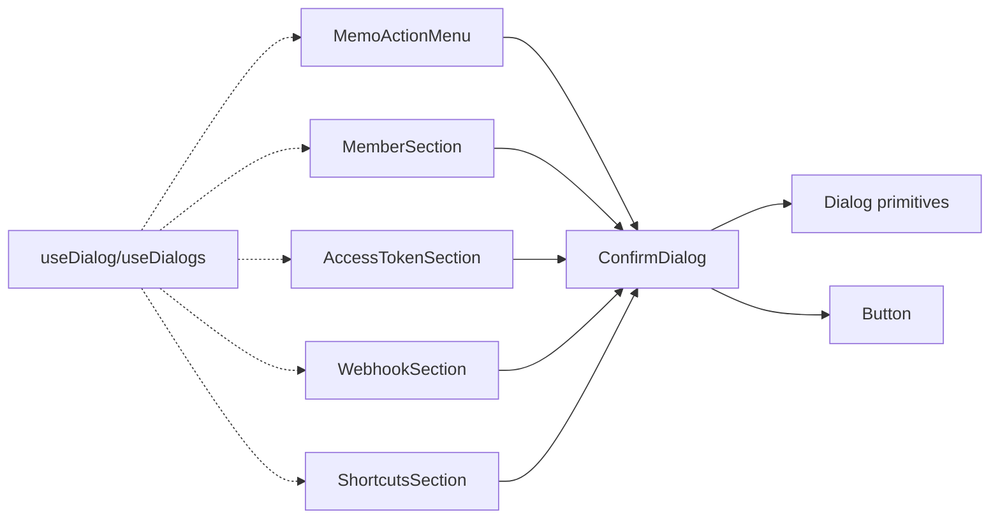

# 确认对话框

<cite>
**本文引用的文件**
- [ConfirmDialog/index.tsx](file://web/src/components/ConfirmDialog/index.tsx)
- [ConfirmDialog/README.md](file://web/src/components/ConfirmDialog/README.md)
- [MemoActionMenu/MemoActionMenu.tsx](file://web/src/components/MemoActionMenu/MemoActionMenu.tsx)
- [Settings/MemberSection.tsx](file://web/src/components/Settings/MemberSection.tsx)
- [Settings/AccessTokenSection.tsx](file://web/src/components/Settings/AccessTokenSection.tsx)
- [Settings/WebhookSection.tsx](file://web/src/components/Settings/WebhookSection.tsx)
- [MemoExplorer/ShortcutsSection.tsx](file://web/src/components/MemoExplorer/ShortcutsSection.tsx)
- [ui/dialog.tsx](file://web/src/components/ui/dialog.tsx)
- [ui/button.tsx](file://web/src/components/ui/button.tsx)
- [hooks/useDialog.ts](file://web/src/hooks/useDialog.ts)
- [locales/en.json](file://web/src/locales/en.json)
</cite>

## 目录
1. [简介](#简介)
2. [项目结构](#项目结构)
3. [核心组件](#核心组件)
4. [架构总览](#架构总览)
5. [组件详解](#组件详解)
6. [依赖关系分析](#依赖关系分析)
7. [性能与可访问性](#性能与可访问性)
8. [故障排查指南](#故障排查指南)
9. [结论](#结论)
10. [附录：常见使用场景与示例路径](#附录常见使用场景与示例路径)

## 简介
本文件系统化梳理“确认对话框”组件的设计原理、实现方式与使用场景，覆盖状态管理、用户交互流程、回调处理机制、按钮行为与动画效果，并提供多场景下的使用示例路径，帮助开发者在删除确认、危险操作确认等常见用例中正确集成与扩展。

## 项目结构
确认对话框组件位于前端工程的组件层，围绕统一的对话框基础 UI 组件构建，通过受控状态与异步回调实现安全可靠的确认流程。



图示来源
- [ConfirmDialog/index.tsx](file://web/src/components/ConfirmDialog/index.tsx#L1-L62)
- [ui/dialog.tsx](file://web/src/components/ui/dialog.tsx#L1-L152)
- [ui/button.tsx](file://web/src/components/ui/button.tsx#L1-L46)
- [hooks/useDialog.ts](file://web/src/hooks/useDialog.ts#L1-L76)
- [MemoActionMenu/MemoActionMenu.tsx](file://web/src/components/MemoActionMenu/MemoActionMenu.tsx#L135-L156)
- [Settings/MemberSection.tsx](file://web/src/components/Settings/MemberSection.tsx#L178-L198)
- [Settings/AccessTokenSection.tsx](file://web/src/components/Settings/AccessTokenSection.tsx#L124-L133)
- [Settings/WebhookSection.tsx](file://web/src/components/Settings/WebhookSection.tsx#L113-L122)
- [MemoExplorer/ShortcutsSection.tsx](file://web/src/components/MemoExplorer/ShortcutsSection.tsx#L122-L130)
- [locales/en.json](file://web/src/locales/en.json#L176-L200)

章节来源
- [ConfirmDialog/index.tsx](file://web/src/components/ConfirmDialog/index.tsx#L1-L62)
- [ui/dialog.tsx](file://web/src/components/ui/dialog.tsx#L1-L152)
- [ui/button.tsx](file://web/src/components/ui/button.tsx#L1-L46)
- [hooks/useDialog.ts](file://web/src/hooks/useDialog.ts#L1-L76)

## 核心组件
- 确认对话框组件：提供标题、描述、确认/取消按钮、加载态屏蔽与异步回调处理。
- 基础对话框组件：提供遮罩、居中布局、动画、焦点陷阱等可访问性能力。
- 按钮组件：提供默认与破坏性样式的按钮变体，支持禁用态与图标。
- 通用对话框 Hook：提供单个或多个对话框的打开/关闭/切换能力。

章节来源
- [ConfirmDialog/index.tsx](file://web/src/components/ConfirmDialog/index.tsx#L6-L15)
- [ui/dialog.tsx](file://web/src/components/ui/dialog.tsx#L140-L151)
- [ui/button.tsx](file://web/src/components/ui/button.tsx#L6-L30)
- [hooks/useDialog.ts](file://web/src/hooks/useDialog.ts#L3-L17)

## 架构总览
确认对话框采用“受控状态 + 异步回调 + 基础对话框 UI”的架构模式，确保：
- 对话框显示/隐藏由父组件控制，避免内部状态漂移。
- 确认过程以异步方式执行，期间屏蔽用户交互，防止误操作。
- 通过破坏性按钮变体提示风险操作，提升可发现性。



图示来源
- [ConfirmDialog/index.tsx](file://web/src/components/ConfirmDialog/index.tsx#L26-L41)
- [ui/dialog.tsx](file://web/src/components/ui/dialog.tsx#L15-L28)
- [MemoActionMenu/MemoActionMenu.tsx](file://web/src/components/MemoActionMenu/MemoActionMenu.tsx#L135-L156)

## 组件详解

### 设计原理
- 可访问性优先：基于 Radix Dialog 提供焦点陷阱、ARIA 角色与键盘导航。
- 异步安全：通过 loading 状态屏蔽关闭事件，避免并发误触。
- 国际化就地：所有可见文本由调用方传入，支持动态插值。
- 主题一致：复用统一的 Button 与 Dialog 组件，保证视觉与交互一致性。

章节来源
- [ConfirmDialog/README.md](file://web/src/components/ConfirmDialog/README.md#L9-L25)
- [ConfirmDialog/index.tsx](file://web/src/components/ConfirmDialog/index.tsx#L27-L41)

### 实现要点
- 受控状态：open 与 onOpenChange 由父组件维护，对话框仅在非 loading 时响应外部关闭。
- 加载态：点击确认后立即设置 loading，onConfirm 完成后恢复；异常时保持打开以便重试。
- 按钮行为：取消按钮直接关闭；确认按钮触发异步回调，成功自动关闭，失败保留对话框。
- 描述区：当未提供描述时，使用“sr-only”类隐藏屏幕阅读器文本，避免无意义提示。

章节来源
- [ConfirmDialog/index.tsx](file://web/src/components/ConfirmDialog/index.tsx#L26-L41)
- [ConfirmDialog/index.tsx](file://web/src/components/ConfirmDialog/index.tsx#L44-L48)

### 数据流与状态机
```mermaid
flowchart TD
Start(["进入对话框"]) --> Idle["空闲状态"]
Idle --> ClickCancel["点击取消"]
ClickCancel --> Close["关闭对话框"]
Idle --> ClickConfirm["点击确认"]
ClickConfirm --> SetLoading["设置loading=true"]
SetLoading --> CallOnConfirm["调用onConfirm()"]
CallOnConfirm --> ConfirmDone{"onConfirm完成？"}
ConfirmDone --> |是且成功| Close
ConfirmDone --> |是但失败| StayOpen["保持打开并记录错误"]
ConfirmDone --> |否(抛错)| StayOpen
```

图示来源
- [ConfirmDialog/index.tsx](file://web/src/components/ConfirmDialog/index.tsx#L30-L41)

### 与基础 UI 的关系
- 对话框内容区域支持尺寸变体与动画，确认对话框使用中等尺寸。
- 按钮变体支持“默认/破坏性”，破坏性用于不可逆操作（如删除）。

章节来源
- [ui/dialog.tsx](file://web/src/components/ui/dialog.tsx#L46-L79)
- [ui/button.tsx](file://web/src/components/ui/button.tsx#L9-L17)

### 类型与属性
- 必填属性：open、onOpenChange、title、confirmLabel、cancelLabel、onConfirm。
- 可选属性：description、confirmVariant（默认/破坏性）。
- 返回：渲染包含标题、描述与两个按钮的标准对话框。

章节来源
- [ConfirmDialog/index.tsx](file://web/src/components/ConfirmDialog/index.tsx#L6-L15)

## 依赖关系分析
确认对话框与以下模块存在直接依赖：
- 基础对话框 UI：Dialog primitives 提供遮罩、居中、动画与可访问性。
- 按钮 UI：Button 提供默认与破坏性样式。
- 业务页面：多个设置页与菜单组件通过受控状态驱动对话框。
- 通用 Hook：useDialog 提供更灵活的多对话框管理能力。



图示来源
- [ConfirmDialog/index.tsx](file://web/src/components/ConfirmDialog/index.tsx#L3-L4)
- [ui/dialog.tsx](file://web/src/components/ui/dialog.tsx#L1-L152)
- [ui/button.tsx](file://web/src/components/ui/button.tsx#L1-L46)
- [MemoActionMenu/MemoActionMenu.tsx](file://web/src/components/MemoActionMenu/MemoActionMenu.tsx#L135-L156)
- [Settings/MemberSection.tsx](file://web/src/components/Settings/MemberSection.tsx#L178-L198)
- [Settings/AccessTokenSection.tsx](file://web/src/components/Settings/AccessTokenSection.tsx#L124-L133)
- [Settings/WebhookSection.tsx](file://web/src/components/Settings/WebhookSection.tsx#L113-L122)
- [MemoExplorer/ShortcutsSection.tsx](file://web/src/components/MemoExplorer/ShortcutsSection.tsx#L122-L130)
- [hooks/useDialog.ts](file://web/src/hooks/useDialog.ts#L1-L76)

章节来源
- [ConfirmDialog/index.tsx](file://web/src/components/ConfirmDialog/index.tsx#L1-L62)
- [hooks/useDialog.ts](file://web/src/hooks/useDialog.ts#L1-L76)

## 性能与可访问性
- 性能特性
  - 最小渲染：每次确认尝试仅触发一次 loading 切换。
  - 无门户抖动：复用现有对话框基础设施，避免额外挂载/卸载。
- 可访问性
  - 焦点陷阱与键盘导航：由基础对话框组件提供。
  - 屏幕阅读器友好：描述区按需显示，未提供描述时隐藏。
  - 键盘与触屏一致：按钮禁用态与视觉反馈一致。

章节来源
- [ConfirmDialog/README.md](file://web/src/components/ConfirmDialog/README.md#L108-L111)
- [ui/dialog.tsx](file://web/src/components/ui/dialog.tsx#L15-L28)
- [ConfirmDialog/index.tsx](file://web/src/components/ConfirmDialog/index.tsx#L48-L49)

## 故障排查指南
- 现象：点击确认后无法关闭
  - 排查：确认 onConfirm 是否返回 Promise 并最终 resolve；检查父组件 onOpenChange 是否被调用。
- 现象：点击确认无反应
  - 排查：确认 loading 未被外部强制置为 true；确认 handleConfirm 已绑定到按钮 onClick。
- 现象：错误未提示
  - 排查：onConfirm 抛出的异常会被吞掉并记录日志，应由调用方自行弹出 Toast 或错误提示。
- 现象：描述区对读屏不友好
  - 排查：未提供 description 时会隐藏，建议始终提供上下文描述。

章节来源
- [ConfirmDialog/index.tsx](file://web/src/components/ConfirmDialog/index.tsx#L30-L41)
- [ConfirmDialog/index.tsx](file://web/src/components/ConfirmDialog/index.tsx#L35-L37)

## 结论
确认对话框组件通过“受控状态 + 异步回调 + 基础 UI”实现了高可用、可访问、易扩展的确认流程。其在多个设置页与菜单中得到广泛复用，适合删除确认、危险操作确认等关键场景。建议在新增场景时遵循统一的文案与样式规范，并在调用方做好错误提示与重试引导。

## 附录：常见使用场景与示例路径
以下为典型场景的组件与属性配置示例路径（请参考对应文件定位具体实现）：

- 删除备忘录
  - 场景说明：从备忘录操作菜单触发删除确认。
  - 示例路径
    - [MemoActionMenu/MemoActionMenu.tsx](file://web/src/components/MemoActionMenu/MemoActionMenu.tsx#L135-L145)
    - 文案键值参考：[locales/en.json](file://web/src/locales/en.json#L187-L189)

- 删除已完成任务列表项
  - 场景说明：清理已完成的任务条目，提示风险。
  - 示例路径
    - [MemoActionMenu/MemoActionMenu.tsx](file://web/src/components/MemoActionMenu/MemoActionMenu.tsx#L147-L156)

- 归档/删除成员
  - 场景说明：成员管理中的归档与删除，分别使用默认与破坏性按钮。
  - 示例路径
    - [Settings/MemberSection.tsx](file://web/src/components/Settings/MemberSection.tsx#L178-L187)
    - [Settings/MemberSection.tsx](file://web/src/components/Settings/MemberSection.tsx#L189-L198)

- 删除访问令牌
  - 场景说明：删除敏感资源前的二次确认。
  - 示例路径
    - [Settings/AccessTokenSection.tsx](file://web/src/components/Settings/AccessTokenSection.tsx#L124-L133)

- 删除 Webhook
  - 场景说明：删除集成服务前的确认。
  - 示例路径
    - [Settings/WebhookSection.tsx](file://web/src/components/Settings/WebhookSection.tsx#L113-L122)

- 删除快捷键
  - 场景说明：删除用户自定义快捷键。
  - 示例路径
    - [MemoExplorer/ShortcutsSection.tsx](file://web/src/components/MemoExplorer/ShortcutsSection.tsx#L122-L130)

- 通用对话框 Hook
  - 场景说明：需要同时管理多个对话框时，使用 useDialogs。
  - 示例路径
    - [hooks/useDialog.ts](file://web/src/hooks/useDialog.ts#L19-L73)