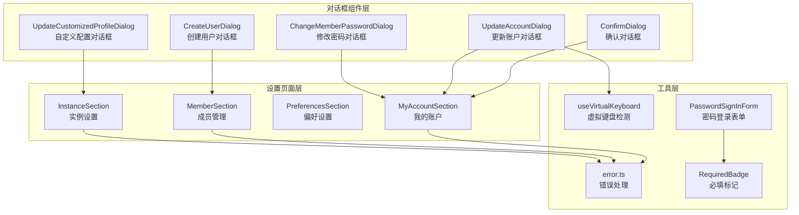
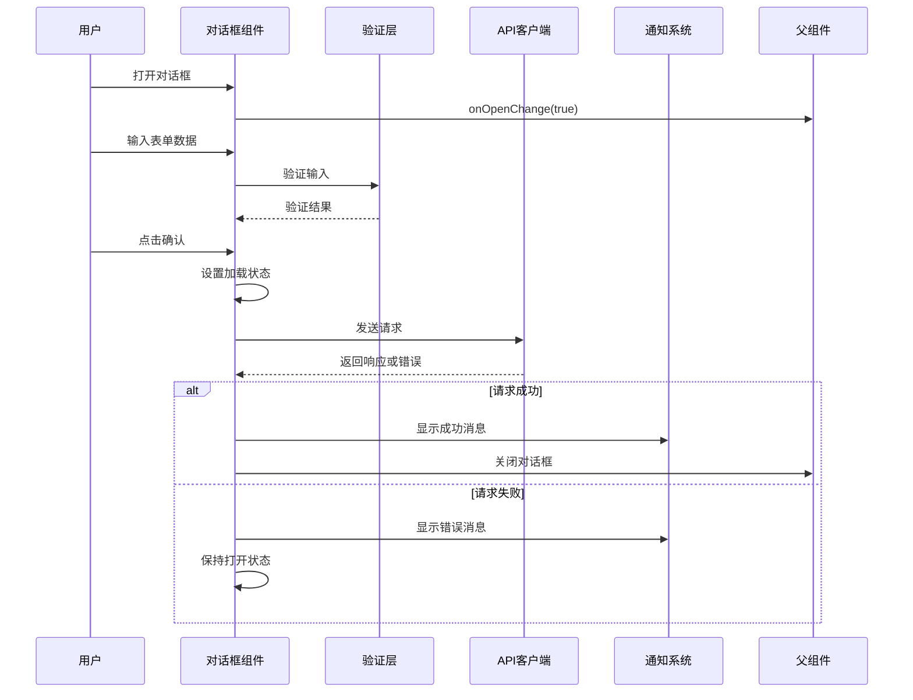
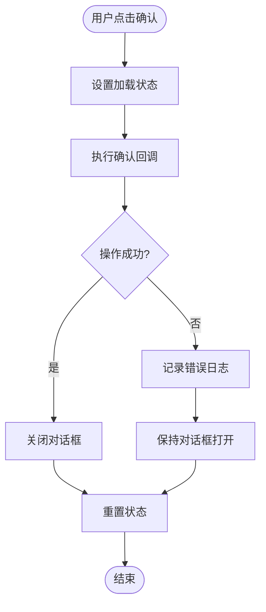
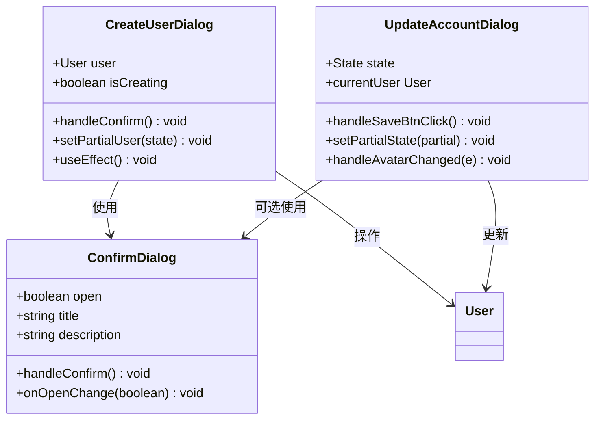
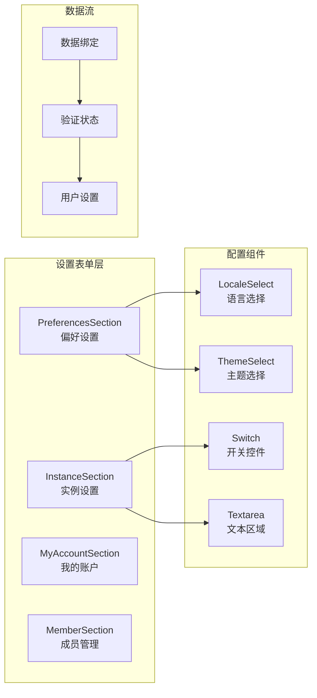
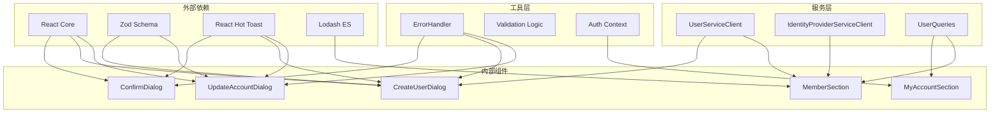

# 表单对话框组件

<cite>
**本文档引用的文件**
- [ConfirmDialog/index.tsx](file://web/src/components/ConfirmDialog/index.tsx)
- [ConfirmDialog/README.md](file://web/src/components/ConfirmDialog/README.md)
- [CreateUserDialog.tsx](file://web/src/components/CreateUserDialog.tsx)
- [UpdateAccountDialog.tsx](file://web/src/components/UpdateAccountDialog.tsx)
- [MyAccountSection.tsx](file://web/src/components/Settings/MyAccountSection.tsx)
- [MemberSection.tsx](file://web/src/components/Settings/MemberSection.tsx)
- [PreferencesSection.tsx](file://web/src/components/Settings/PreferencesSection.tsx)
- [InstanceSection.tsx](file://web/src/components/Settings/InstanceSection.tsx)
- [error.ts](file://web/src/lib/error.ts)
- [PasswordSignInForm.tsx](file://web/src/components/PasswordSignInForm.tsx)
- [RequiredBadge.tsx](file://web/src/components/RequiredBadge.tsx)
- [useVirtualKeyboard.ts](file://web/src/components/MemoEditor/hooks/useVirtualKeyboard.ts)
</cite>

## 目录
1. [简介](#简介)
2. [项目结构](#项目结构)
3. [核心组件](#核心组件)
4. [架构概览](#架构概览)
5. [详细组件分析](#详细组件分析)
6. [依赖关系分析](#依赖关系分析)
7. [性能考虑](#性能考虑)
8. [故障排除指南](#故障排除指南)
9. [结论](#结论)
10. [附录](#附录)

## 简介

本文档深入分析了 Memos 项目中的表单对话框组件系统，涵盖了确认对话框、用户管理对话框、设置表单和数据编辑对话框的完整实现。该系统采用现代化的 React 架构，结合 TypeScript 类型安全、Zod 验证、错误处理机制和无障碍设计原则。

系统主要包含以下核心功能模块：
- **确认对话框**：标准化的异步操作确认界面
- **用户管理对话框**：用户创建、编辑和密码修改
- **账户设置对话框**：个人资料更新和偏好设置
- **实例配置对话框**：系统级设置管理
- **表单验证与错误处理**：统一的错误处理机制
- **无障碍与键盘导航**：完整的可访问性支持

## 项目结构

表单对话框组件分布在前端项目的多个目录中，形成了清晰的功能层次结构：

**图表来源**
- [ConfirmDialog/index.tsx](file://web/src/components/ConfirmDialog/index.tsx#L1-L62)
- [CreateUserDialog.tsx](file://web/src/components/CreateUserDialog.tsx#L1-L148)
- [UpdateAccountDialog.tsx](file://web/src/components/UpdateAccountDialog.tsx#L1-L224)

**章节来源**
- [ConfirmDialog/index.tsx](file://web/src/components/ConfirmDialog/index.tsx#L1-L62)
- [CreateUserDialog.tsx](file://web/src/components/CreateUserDialog.tsx#L1-L148)
- [UpdateAccountDialog.tsx](file://web/src/components/UpdateAccountDialog.tsx#L1-L224)

## 核心组件

### 确认对话框组件

确认对话框是整个表单系统的核心组件，提供了统一的异步操作确认界面。该组件具有以下关键特性：

**设计特点**：
- 使用共享的 Dialog 原语（焦点陷阱、ARIA 角色）
- 支持异步操作的加载状态保护
- 清晰的标题（操作）与描述（上下文）分离
- 可选的破坏性操作样式变体

**技术实现**：
- 状态管理：loading 状态跟踪挂起的确认操作
- 异步安全：阻止在异步确认进行时的关闭操作
- 国际化支持：所有标签通过 i18n 钩子提供本地化文本

**章节来源**
- [ConfirmDialog/index.tsx](file://web/src/components/ConfirmDialog/index.tsx#L17-L61)
- [ConfirmDialog/README.md](file://web/src/components/ConfirmDialog/README.md#L82-L97)

### 用户管理对话框

用户管理对话框系统包含多个专门的对话框组件，用于不同的用户管理场景：

**CreateUserDialog**：
- 支持用户创建和编辑两种模式
- 动态字段掩码更新（仅更新已更改的字段）
- 角色权限控制（用户/管理员）

**UpdateAccountDialog**：
- 个人资料信息编辑
- 头像上传和预览功能
- 实例级配置限制（用户名/昵称修改权限）

**章节来源**
- [CreateUserDialog.tsx](file://web/src/components/CreateUserDialog.tsx#L23-L78)
- [UpdateAccountDialog.tsx](file://web/src/components/UpdateAccountDialog.tsx#L32-L150)

## 架构概览

表单对话框系统的整体架构体现了清晰的关注点分离和组件复用原则：

**图表来源**
- [ConfirmDialog/index.tsx](file://web/src/components/ConfirmDialog/index.tsx#L30-L41)
- [CreateUserDialog.tsx](file://web/src/components/CreateUserDialog.tsx#L44-L78)

**章节来源**
- [error.ts](file://web/src/lib/error.ts#L17-L34)
- [MemberSection.tsx](file://web/src/components/Settings/MemberSection.tsx#L178-L198)

## 详细组件分析

### 确认对话框组件详解

确认对话框组件实现了完整的异步操作生命周期管理：

**图表来源**
- [ConfirmDialog/index.tsx](file://web/src/components/ConfirmDialog/index.tsx#L30-L41)

**实现特性**：
- **异步安全**：通过 loading 状态防止重复提交
- **错误隔离**：捕获并记录错误，不阻断用户交互
- **状态保护**：在加载期间阻止对话框关闭
- **国际化集成**：支持动态文本内容

**章节来源**
- [ConfirmDialog/index.tsx](file://web/src/components/ConfirmDialog/index.tsx#L27-L41)

### 用户管理对话框系统

用户管理对话框系统提供了完整的用户生命周期管理功能：

**图表来源**
- [CreateUserDialog.tsx](file://web/src/components/CreateUserDialog.tsx#L23-L78)
- [UpdateAccountDialog.tsx](file://web/src/components/UpdateAccountDialog.tsx#L32-L150)

**核心功能**：
- **动态字段更新**：使用 partial state 更新特定字段
- **条件验证**：根据创建/编辑模式应用不同验证规则
- **增量更新**：仅发送已更改的字段到服务器
- **文件处理**：头像上传和 Base64 编码转换

**章节来源**
- [CreateUserDialog.tsx](file://web/src/components/CreateUserDialog.tsx#L37-L78)
- [UpdateAccountDialog.tsx](file://web/src/components/UpdateAccountDialog.tsx#L49-L150)

### 设置表单组件

设置表单组件展示了如何构建复杂的配置界面：

**图表来源**
- [PreferencesSection.tsx](file://web/src/components/Settings/PreferencesSection.tsx#L18-L113)
- [InstanceSection.tsx](file://web/src/components/Settings/InstanceSection.tsx#L26-L181)

**设计模式**：
- **即时反馈**：本地立即应用设置，异步持久化到服务器
- **条件渲染**：基于实例配置动态显示/隐藏选项
- **批量更新**：使用字段掩码实现精确的数据更新

**章节来源**
- [PreferencesSection.tsx](file://web/src/components/Settings/PreferencesSection.tsx#L23-L60)
- [InstanceSection.tsx](file://web/src/components/Settings/InstanceSection.tsx#L50-L69)

### 数据编辑对话框

数据编辑对话框提供了灵活的表单编辑能力：

**实现特点**：
- **状态管理**：使用 useState 和 useEffect 管理复杂表单状态
- **文件处理**：支持图片上传和预览功能
- **权限控制**：根据实例配置限制某些字段的编辑权限
- **错误处理**：统一的错误处理和用户反馈机制

**章节来源**
- [UpdateAccountDialog.tsx](file://web/src/components/UpdateAccountDialog.tsx#L58-L150)

## 依赖关系分析

表单对话框组件系统展现了清晰的依赖层次结构：

**图表来源**
- [CreateUserDialog.tsx](file://web/src/components/CreateUserDialog.tsx#L1-L15)
- [UpdateAccountDialog.tsx](file://web/src/components/UpdateAccountDialog.tsx#L1-L16)

**依赖特性**：
- **最小依赖**：每个组件只导入必要的依赖
- **类型安全**：使用 TypeScript 和 Zod 提供编译时类型检查
- **解耦设计**：组件间通过 props 和回调通信
- **可测试性**：清晰的接口定义便于单元测试

**章节来源**
- [error.ts](file://web/src/lib/error.ts#L1-L38)
- [MemberSection.tsx](file://web/src/components/Settings/MemberSection.tsx#L1-L18)

## 性能考虑

表单对话框组件系统在性能方面采用了多项优化策略：

### 渲染优化
- **状态局部化**：每个对话框维护独立的状态，避免不必要的全局重渲染
- **条件渲染**：仅在需要时渲染复杂的表单元素
- **懒加载**：大型对话框按需加载相关资源

### 内存管理
- **清理函数**：正确清理事件监听器和定时器
- **引用稳定**：使用 useCallback 和 useMemo 优化回调和计算结果
- **资源释放**：及时释放文件句柄和网络连接

### 网络优化
- **请求去重**：避免重复提交相同的请求
- **增量更新**：仅发送必要的字段更新
- **缓存策略**：合理利用查询缓存减少 API 调用

## 故障排除指南

### 常见问题及解决方案

**对话框无法关闭**
- 检查 loading 状态是否被意外设置为 true
- 确认异步操作是否正确处理了异常情况
- 验证 onOpenChange 回调是否被正确传递

**表单验证失败**
- 检查 Zod schema 定义是否正确
- 确认字段值是否符合预期格式
- 验证国际化字符串是否正确加载

**错误处理无效**
- 确认 handleError 函数的参数是否正确传递
- 检查 toast 配置是否正常工作
- 验证错误日志是否被正确记录

**章节来源**
- [error.ts](file://web/src/lib/error.ts#L17-L34)
- [ConfirmDialog/index.tsx](file://web/src/components/ConfirmDialog/index.tsx#L35-L41)

### 调试技巧

**开发环境调试**：
- 使用浏览器开发者工具监控组件状态变化
- 利用 React DevTools 分析组件树和性能
- 检查网络面板确认 API 请求状态

**生产环境监控**：
- 启用详细的错误日志记录
- 监控用户交互行为和错误发生频率
- 收集用户反馈改进用户体验

## 结论

表单对话框组件系统展现了现代前端开发的最佳实践，通过精心设计的架构和实现，提供了：

**技术优势**：
- 完整的类型安全保证
- 优雅的错误处理机制  
- 优秀的可访问性支持
- 高效的性能表现

**用户体验**：
- 直观的界面设计
- 流畅的交互体验
- 一致的操作模式
- 及时的反馈机制

**可维护性**：
- 清晰的代码结构
- 完善的文档说明
- 可扩展的架构设计
- 易于测试的组件实现

该系统为类似的应用程序提供了优秀的参考模板，展示了如何构建高质量、可维护的表单对话框组件。

## 附录

### 最佳实践清单

**设计模式**：
- 使用受控组件模式管理表单状态
- 实施防抖和节流优化高频操作
- 采用渐进式增强提升用户体验

**可访问性**：
- 确保完整的键盘导航支持
- 提供适当的 ARIA 属性
- 实现屏幕阅读器友好的标签

**性能优化**：
- 实施虚拟滚动处理大量数据
- 使用懒加载减少初始包大小
- 优化重渲染避免不必要的计算

**安全考虑**：
- 实施严格的输入验证
- 使用 CSRF 保护防止跨站请求伪造
- 实现适当的权限控制机制