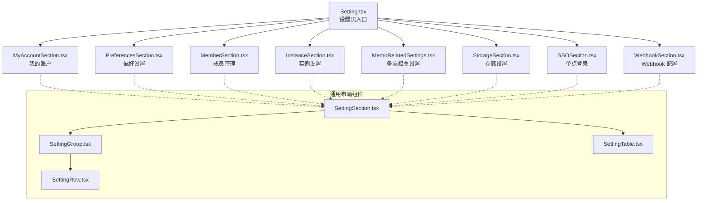
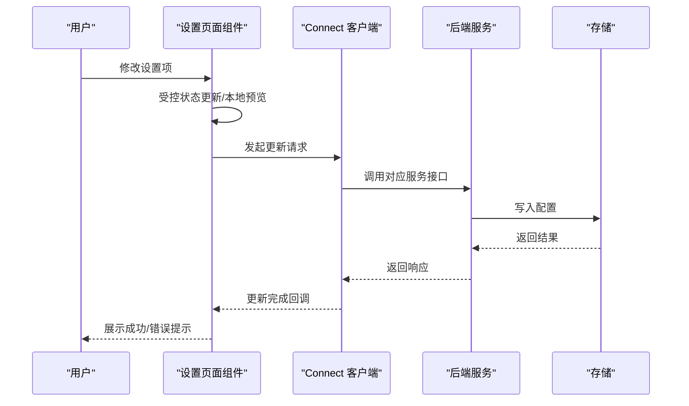
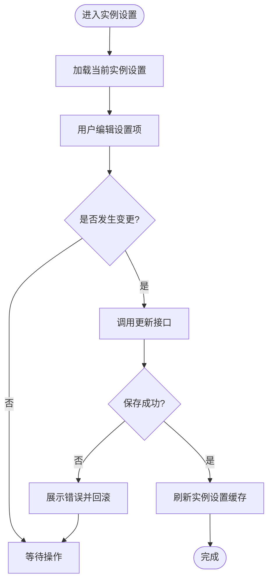
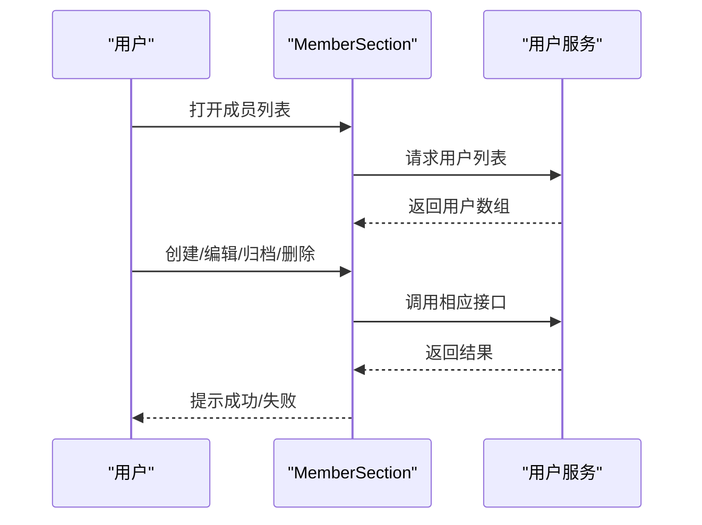
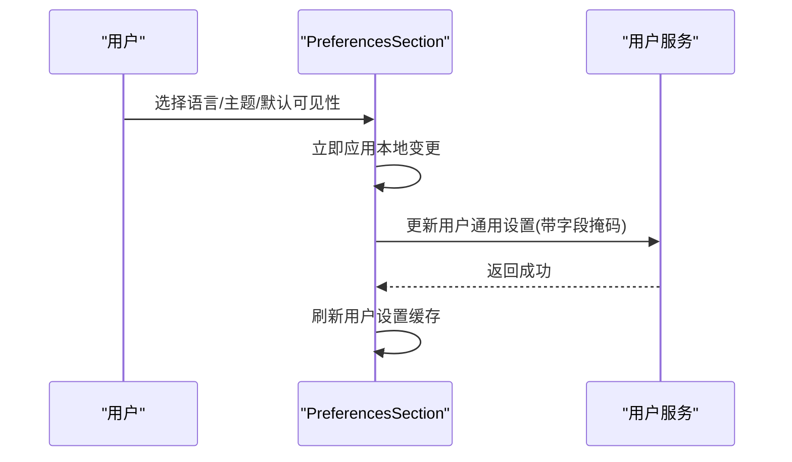
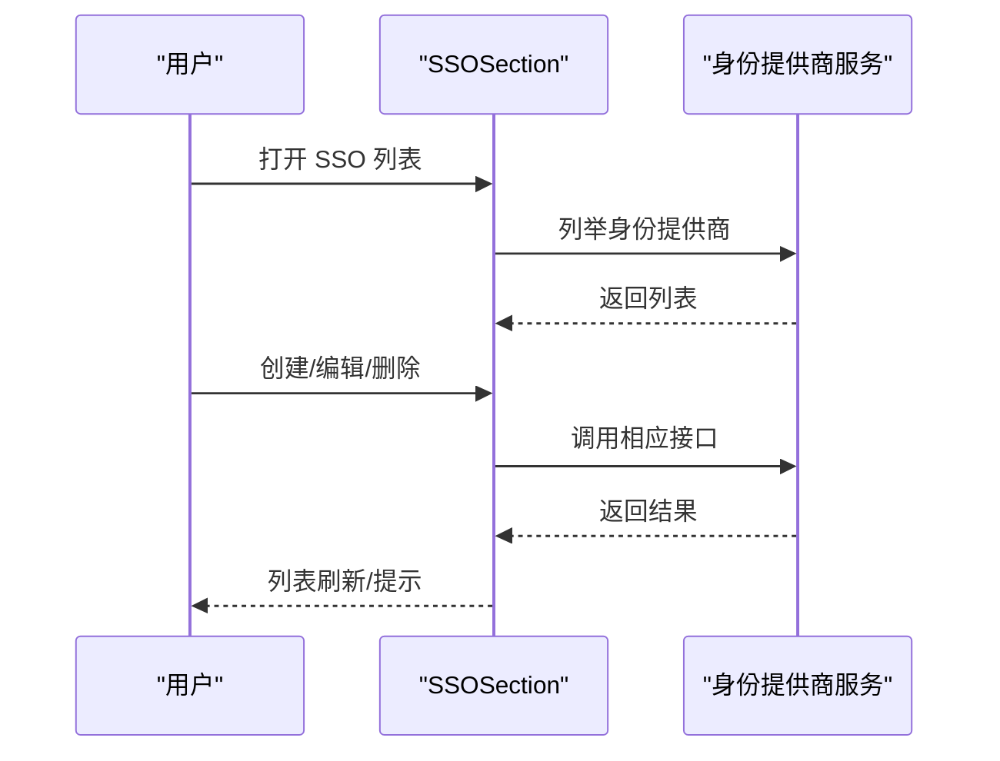
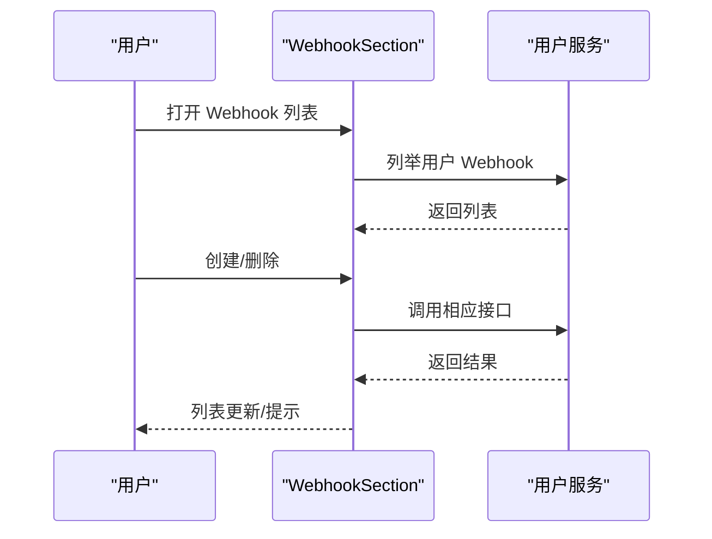
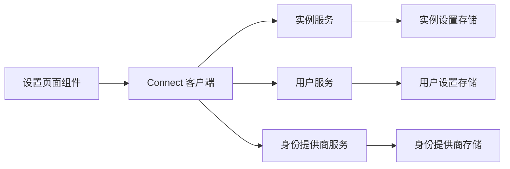

# 设置配置对话框

<cite>
**本文引用的文件**
- [Setting.tsx](file://web/src/pages/Setting.tsx)
- [InstanceSection.tsx](file://web/src/components/Settings/InstanceSection.tsx)
- [MemberSection.tsx](file://web/src/components/Settings/MemberSection.tsx)
- [PreferencesSection.tsx](file://web/src/components/Settings/PreferencesSection.tsx)
- [SSOSection.tsx](file://web/src/components/Settings/SSOSection.tsx)
- [WebhookSection.tsx](file://web/src/components/Settings/WebhookSection.tsx)
- [SettingGroup.tsx](file://web/src/components/Settings/SettingGroup.tsx)
- [SettingRow.tsx](file://web/src/components/Settings/SettingRow.tsx)
- [SettingSection.tsx](file://web/src/components/Settings/SettingSection.tsx)
- [SettingTable.tsx](file://web/src/components/Settings/SettingTable.tsx)
- [MyAccountSection.tsx](file://web/src/components/Settings/MyAccountSection.tsx)
- [MemoRelatedSettings.tsx](file://web/src/components/Settings/MemoRelatedSettings.tsx)
- [CreateIdentityProviderDialog.tsx](file://web/src/components/CreateIdentityProviderDialog.tsx)
- [CreateWebhookDialog.tsx](file://web/src/components/CreateWebhookDialog.tsx)
- [instance-config.ts](file://web/src/instance-config.ts)
- [instance_setting.proto](file://proto/store/instance_setting.proto)
- [user_setting.proto](file://proto/store/user_setting.proto)
- [instance_service.proto](file://proto/api/v1/instance_service.proto)
- [user_service.proto](file://proto/api/v1/user_service.proto)
- [idp_service.proto](file://proto/api/v1/idp_service.proto)
- [user_setting.go](file://store/user_setting.go)
- [instance_setting.go](file://store/instance_setting.go)
</cite>

## 目录
1. [简介](#简介)
2. [项目结构](#项目结构)
3. [核心组件](#核心组件)
4. [架构总览](#架构总览)
5. [详细组件分析](#详细组件分析)
6. [依赖关系分析](#依赖关系分析)
7. [性能考量](#性能考量)
8. [故障排查指南](#故障排查指南)
9. [结论](#结论)
10. [附录：配置示例与集成指南](#附录配置示例与集成指南)

## 简介
本文件系统性梳理“设置配置对话框”前端组件体系与后端配置存储模型，覆盖以下设置面板：
- 实例设置（Instance）
- 成员管理（Member）
- 偏好设置（Preferences）
- 单点登录（SSO）
- Webhook 配置
并解释数据绑定、实时预览、批量保存、验证、权限控制、导入导出等能力，给出架构设计（配置分组、动态加载、热更新）与集成指引。

## 项目结构
设置页面采用“主页面 + 多个设置面板 + 通用布局组件”的分层组织方式：
- 页面入口负责路由与权限分发，按角色显示不同面板
- 各设置面板封装独立的数据状态、表单与持久化逻辑
- 通用布局组件（SettingSection/SettingGroup/SettingRow/SettingTable）统一风格与交互

图表来源
- [Setting.tsx](file://web/src/pages/Setting.tsx#L39-L162)
- [MyAccountSection.tsx](file://web/src/components/Settings/MyAccountSection.tsx#L14-L72)
- [PreferencesSection.tsx](file://web/src/components/Settings/PreferencesSection.tsx#L18-L112)
- [MemberSection.tsx](file://web/src/components/Settings/MemberSection.tsx#L21-L203)
- [InstanceSection.tsx](file://web/src/components/Settings/InstanceSection.tsx#L26-L180)
- [MemoRelatedSettings.tsx](file://web/src/components/Settings/MemoRelatedSettings.tsx#L23-L142)
- [SSOSection.tsx](file://web/src/components/Settings/SSOSection.tsx#L16-L149)
- [WebhookSection.tsx](file://web/src/components/Settings/WebhookSection.tsx#L14-L127)
- [SettingSection.tsx](file://web/src/components/Settings/SettingSection.tsx#L12-L31)
- [SettingGroup.tsx](file://web/src/components/Settings/SettingGroup.tsx#L13-L30)
- [SettingRow.tsx](file://web/src/components/Settings/SettingRow.tsx#L15-L41)
- [SettingTable.tsx](file://web/src/components/Settings/SettingTable.tsx#L19-L71)

章节来源
- [Setting.tsx](file://web/src/pages/Setting.tsx#L39-L162)

## 核心组件
- SettingSection：设置区块容器，支持标题、描述与操作区
- SettingGroup：设置分组容器，可选分隔线与副标题
- SettingRow：一行设置项，支持标签、描述、提示气泡与自定义控件
- SettingTable：表格型设置列表，支持列定义、空态文案与行键

这些组件通过统一的布局与样式，保证各设置面板的一致性与可扩展性。

章节来源
- [SettingSection.tsx](file://web/src/components/Settings/SettingSection.tsx#L12-L31)
- [SettingGroup.tsx](file://web/src/components/Settings/SettingGroup.tsx#L13-L30)
- [SettingRow.tsx](file://web/src/components/Settings/SettingRow.tsx#L15-L41)
- [SettingTable.tsx](file://web/src/components/Settings/SettingTable.tsx#L19-L71)

## 架构总览
设置系统由“前端 UI 组件 + 连接客户端 + 后端服务 + 存储模型”构成，关键流程如下：

图表来源
- [Setting.tsx](file://web/src/pages/Setting.tsx#L39-L162)
- [PreferencesSection.tsx](file://web/src/components/Settings/PreferencesSection.tsx#L18-L112)
- [InstanceSection.tsx](file://web/src/components/Settings/InstanceSection.tsx#L26-L180)
- [SSOSection.tsx](file://web/src/components/Settings/SSOSection.tsx#L16-L149)
- [WebhookSection.tsx](file://web/src/components/Settings/WebhookSection.tsx#L14-L127)

## 详细组件分析

### 实例设置（InstanceSection）
职责
- 管理服务器名称、附加样式脚本、注册/密码/用户名/昵称变更限制、周起始日等全局实例设置
- 支持局部更新与一键保存，保存后刷新实例设置缓存

数据绑定与实时预览
- 使用受控组件（Switch/Select/Textarea/Input）维护本地状态
- 保存前进行差异校验，禁用保存按钮以避免无效提交

批量保存
- 将完整设置对象打包为 Protobuf 消息，调用更新接口一次性写入

权限控制
- 部分开关在演示模式下禁用
- 密码认证禁用开关依赖是否存在身份提供商

热更新
- 保存成功后主动拉取最新实例设置，确保 UI 与后端一致

图表来源
- [InstanceSection.tsx](file://web/src/components/Settings/InstanceSection.tsx#L26-L180)

章节来源
- [InstanceSection.tsx](file://web/src/components/Settings/InstanceSection.tsx#L26-L180)

### 成员管理（MemberSection）
职责
- 列出所有用户，支持创建、编辑、归档/恢复、删除
- 基于当前用户身份隐藏自身操作项

数据绑定与实时预览
- 使用查询钩子获取用户列表，表格直接渲染
- 对话框与确认弹窗承载新增/编辑/删除流程

批量保存
- 删除使用独立 mutation；其他操作通过服务接口即时生效

权限控制
- 仅主机可见并可操作；普通用户仅能查看自身

图表来源
- [MemberSection.tsx](file://web/src/components/Settings/MemberSection.tsx#L21-L203)

章节来源
- [MemberSection.tsx](file://web/src/components/Settings/MemberSection.tsx#L21-L203)

### 偏好设置（PreferencesSection）
职责
- 用户个人偏好：语言、主题、默认备忘可见性
- 内嵌 Webhook 管理子面板

数据绑定与实时预览
- 语言与主题变更立即应用到 UI 并持久化到用户设置
- 默认可见性通过选择器更新并同步到后端

批量保存
- 使用字段掩码（FieldMask）仅更新指定字段，减少冗余写入

图表来源
- [PreferencesSection.tsx](file://web/src/components/Settings/PreferencesSection.tsx#L18-L112)

章节来源
- [PreferencesSection.tsx](file://web/src/components/Settings/PreferencesSection.tsx#L18-L112)

### 单点登录（SSOSection）
职责
- 管理身份提供商列表，支持创建/编辑/删除
- 与身份提供商对话框联动，支持模板与 OAuth2 参数配置

数据绑定与实时预览
- 列表通过服务接口拉取并渲染
- 编辑/创建对话框支持参数校验与模板选择

批量保存
- 新增/修改通过对话框内部流程完成，完成后刷新列表

图表来源
- [SSOSection.tsx](file://web/src/components/Settings/SSOSection.tsx#L16-L149)
- [CreateIdentityProviderDialog.tsx](file://web/src/components/CreateIdentityProviderDialog.tsx#L308-L427)

章节来源
- [SSOSection.tsx](file://web/src/components/Settings/SSOSection.tsx#L16-L149)
- [CreateIdentityProviderDialog.tsx](file://web/src/components/CreateIdentityProviderDialog.tsx#L308-L427)

### Webhook 配置（WebhookSection）
职责
- 用户级 Webhook 列表管理：创建、删除、查看 URL
- 与 Webhook 创建对话框联动

数据绑定与实时预览
- 列表通过服务接口拉取并渲染
- 删除采用确认弹窗，删除成功后从本地列表剔除

图表来源
- [WebhookSection.tsx](file://web/src/components/Settings/WebhookSection.tsx#L14-L127)
- [CreateWebhookDialog.tsx](file://web/src/components/CreateWebhookDialog.tsx)

章节来源
- [WebhookSection.tsx](file://web/src/components/Settings/WebhookSection.tsx#L14-L127)

### 我的账户（MyAccountSection）
职责
- 展示当前用户信息与头像
- 提供编辑资料与修改密码入口
- 内嵌访问令牌管理

数据绑定与实时预览
- 用户信息来自上下文，编辑对话框与密码对话框承载变更流程

章节来源
- [MyAccountSection.tsx](file://web/src/components/Settings/MyAccountSection.tsx#L14-L72)

### 备忘相关设置（MemoRelatedSettings）
职责
- 控制备忘可见性限制、时间显示、双击编辑、内容长度限制
- 维护反应类型集合（增删）

数据绑定与实时预览
- 受控组件维护本地状态，支持逐项即时切换
- 反应类型支持输入添加与删除

批量保存
- 保存前进行必填校验（反应类型非空），成功后刷新实例设置

章节来源
- [MemoRelatedSettings.tsx](file://web/src/components/Settings/MemoRelatedSettings.tsx#L23-L142)

## 依赖关系分析
- 权限与路由
  - 页面根据用户角色动态拼装可访问的设置面板
  - 主机角色额外可见成员、实例、存储、SSO 等面板
- 数据流
  - 偏好设置与实例设置通过 Connect 客户端调用对应服务接口
  - 成员管理与 SSO 通过用户/身份提供商服务接口
  - Webhook 通过用户服务接口
- 存储模型
  - 实例设置与用户设置分别映射到后端存储模型与 Protobuf 定义
  - 前端通过 Protobuf Schema 构造消息，后端进行序列化/反序列化与持久化

图表来源
- [Setting.tsx](file://web/src/pages/Setting.tsx#L39-L162)
- [PreferencesSection.tsx](file://web/src/components/Settings/PreferencesSection.tsx#L18-L112)
- [InstanceSection.tsx](file://web/src/components/Settings/InstanceSection.tsx#L26-L180)
- [SSOSection.tsx](file://web/src/components/Settings/SSOSection.tsx#L16-L149)
- [WebhookSection.tsx](file://web/src/components/Settings/WebhookSection.tsx#L14-L127)

章节来源
- [Setting.tsx](file://web/src/pages/Setting.tsx#L39-L162)

## 性能考量
- 受控状态与本地预览：在保存前进行差异判断，避免不必要的网络请求
- 字段掩码更新：仅更新必要字段，降低写放大
- 列表懒加载：按需拉取，避免一次性渲染大量数据
- 表格虚拟化：对于超大列表建议引入虚拟滚动（当前实现未见虚拟化，可作为优化方向）

## 故障排查指南
- 保存失败
  - 检查网络连接与服务可用性
  - 查看错误提示与控制台日志
  - 确认必填项与格式（如 SSO 的 OAuth2 必填参数）
- 权限不足
  - 确认当前用户角色是否具备相应操作权限
  - 主机角色才能访问成员、实例、SSO 等面板
- 实时更新不同步
  - 保存成功后触发刷新接口，若仍不同步，尝试手动刷新页面
- 演示模式限制
  - 某些开关在演示模式下会被禁用，需切换至生产模式或关闭演示模式

## 结论
该设置配置对话框以模块化组件为核心，结合受控状态、字段掩码与服务接口，实现了良好的数据绑定、实时预览与批量保存体验。通过权限控制与热更新机制，确保了安全与一致性。后续可在大数据量场景引入虚拟化与更细粒度的缓存策略，进一步提升性能。

## 附录：配置示例与集成指南

### 配置分组与字段映射
- 实例设置（GENERAL）
  - 关键字段：服务器名称、附加样式、附加脚本、注册/密码/用户名/昵称变更限制、周起始日
  - 存储模型：实例设置存储与 Protobuf 定义
- 成员管理
  - 关键操作：创建、编辑、归档/恢复、删除
  - 权限：主机角色
- 偏好设置（USER GENERAL）
  - 关键字段：语言、主题、默认备忘可见性
  - 存储模型：用户设置存储与 Protobuf 定义
- 单点登录（SSO）
  - 关键字段：提供商类型、授权/令牌/用户端点、重定向地址等
  - 存储模型：身份提供商存储与 Protobuf 定义
- Webhook
  - 关键字段：名称、URL、事件类型
  - 存储模型：用户 Webhook 存储与 Protobuf 定义
- 备忘相关设置（MEMO RELATED）
  - 关键字段：禁止公开可见、时间显示、双击编辑、内容长度限制、反应类型集合
  - 存储模型：实例设置存储与 Protobuf 定义

章节来源
- [instance_setting.proto](file://proto/store/instance_setting.proto)
- [user_setting.proto](file://proto/store/user_setting.proto)
- [instance_service.proto](file://proto/api/v1/instance_service.proto)
- [user_service.proto](file://proto/api/v1/user_service.proto)
- [idp_service.proto](file://proto/api/v1/idp_service.proto)

### 动态加载与热更新机制
- 动态加载
  - 页面根据路由哈希与用户角色动态渲染对应面板
  - 首次进入主机面板时，预拉取实例设置与存储设置
- 热更新
  - 保存成功后主动刷新对应设置缓存，确保 UI 与后端一致
  - 偏好设置变更立即应用到本地 UI，并异步持久化

章节来源
- [Setting.tsx](file://web/src/pages/Setting.tsx#L58-L80)
- [PreferencesSection.tsx](file://web/src/components/Settings/PreferencesSection.tsx#L18-L112)
- [InstanceSection.tsx](file://web/src/components/Settings/InstanceSection.tsx#L50-L69)

### 权限控制与验证
- 角色权限
  - HOST：可访问全部设置面板
  - ADMIN/USER：仅可访问基础面板
- 演示模式限制
  - 演示模式下部分开关被禁用
- SSO 参数校验
  - OAuth2 必填参数缺失时阻止保存
- 必填校验
  - 备忘相关设置中的反应类型不能为空

章节来源
- [Setting.tsx](file://web/src/pages/Setting.tsx#L48-L56)
- [InstanceSection.tsx](file://web/src/components/Settings/InstanceSection.tsx#L113-L127)
- [CreateIdentityProviderDialog.tsx](file://web/src/components/CreateIdentityProviderDialog.tsx#L374-L427)
- [MemoRelatedSettings.tsx](file://web/src/components/Settings/MemoRelatedSettings.tsx#L46-L50)

### 配置导入导出（建议方案）
- 导出
  - 通过服务接口列举当前实例/用户设置，生成 JSON/YAML 文档
- 导入
  - 解析配置文件，按字段掩码批量写入对应设置接口
- 注意事项
  - 导入前进行字段校验与兼容性检查
  - 对敏感字段（如密钥）采用加密存储与最小暴露原则

[本节为概念性指导，不直接分析具体文件]

### 集成指南
- 前端集成
  - 在设置页面中注册新面板组件，遵循 SettingSection/SettingGroup/SettingRow/SettingTable 的布局规范
  - 使用 Connect 客户端调用对应服务接口，注意字段掩码与错误处理
- 后端集成
  - 在存储层实现设置项的读写接口，确保并发安全与事务一致性
  - 对外暴露 gRPC/HTTP 接口，返回标准 Protobuf 消息
- 安全与合规
  - 对敏感设置项进行访问控制与审计日志
  - 对外部集成（如 Webhook、SSO）进行参数校验与证书校验

[本节为概念性指导，不直接分析具体文件]