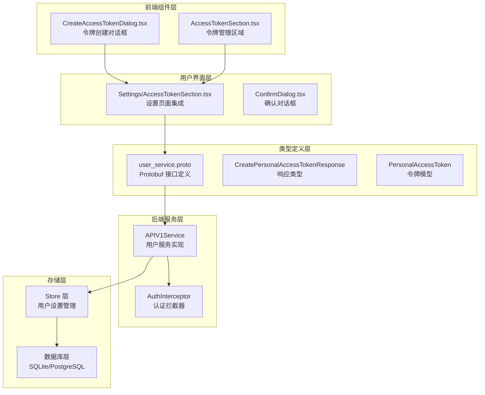
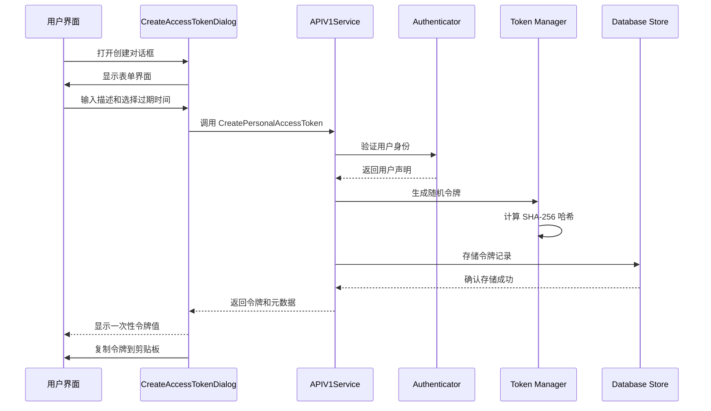
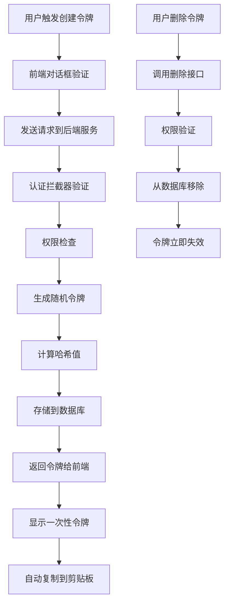
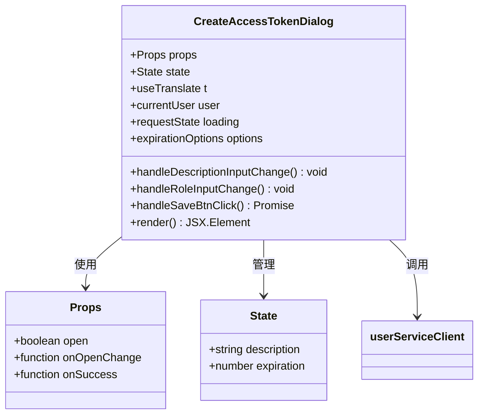
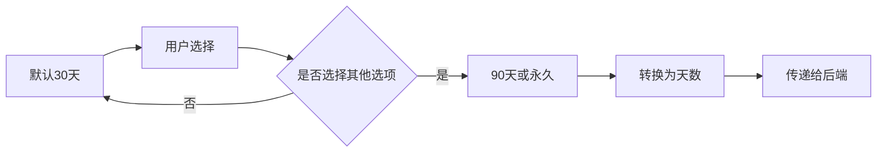
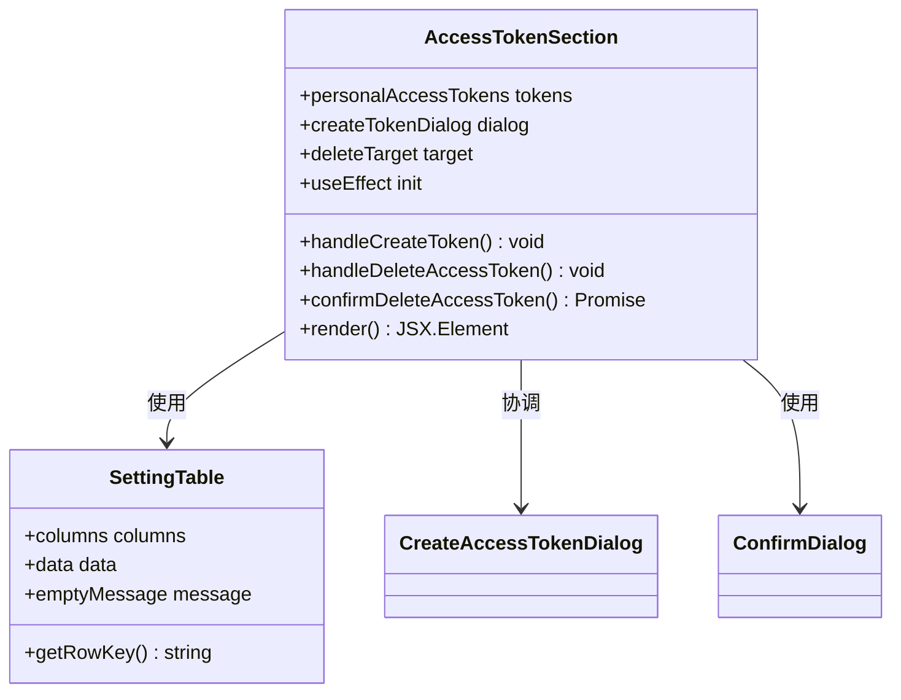
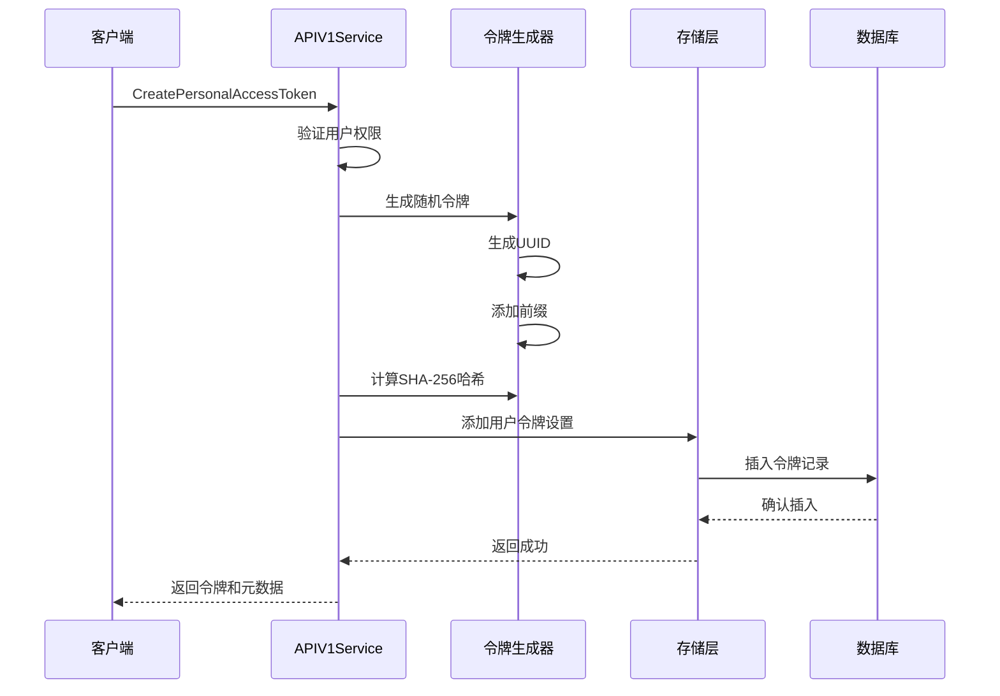
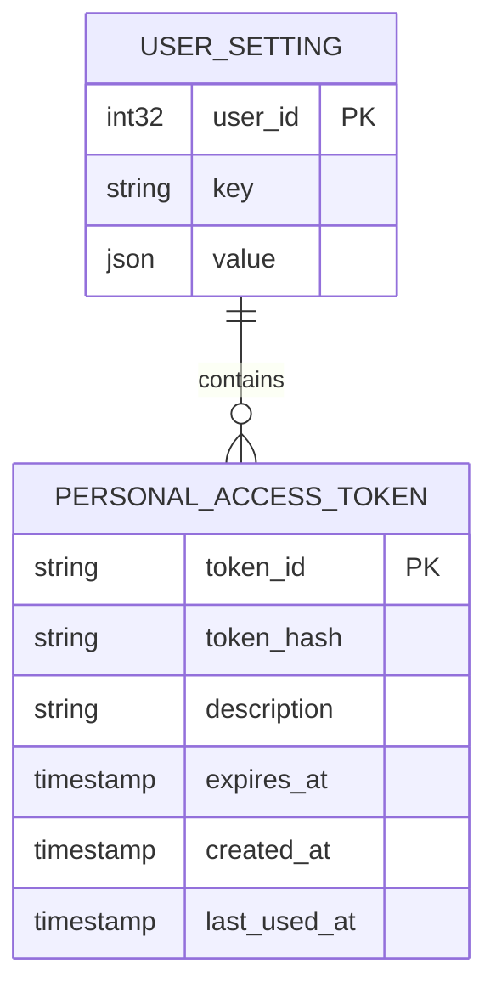
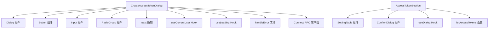
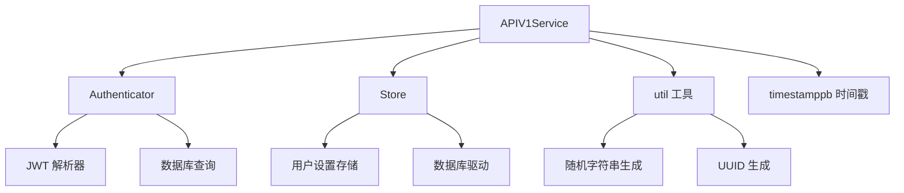

# 访问令牌对话框

<cite>
**本文档引用的文件**
- [CreateAccessTokenDialog.tsx](file://web/src/components/CreateAccessTokenDialog.tsx)
- [AccessTokenSection.tsx](file://web/src/components/Settings/AccessTokenSection.tsx)
- [token.go](file://server/auth/token.go)
- [user_service.go](file://server/router/api/v1/user_service.go)
- [user_service.proto](file://proto/api/v1/user_service.proto)
- [user_setting.go](file://store/user_setting.go)
- [user_setting.go](file://store/db/sqlite/user_setting.go)
- [user_setting.go](file://store/db/postgres/user_setting.go)
- [token_test.go](file://server/auth/token_test.go)
- [connect_interceptors.go](file://server/router/api/v1/connect_interceptors.go)
- [extract.go](file://server/auth/extract.go)
- [authenticator.go](file://server/auth/authenticator.go)
</cite>

## 目录
1. [简介](#简介)
2. [项目结构](#项目结构)
3. [核心组件](#核心组件)
4. [架构概览](#架构概览)
5. [详细组件分析](#详细组件分析)
6. [依赖关系分析](#依赖关系分析)
7. [性能考虑](#性能考虑)
8. [故障排除指南](#故障排除指南)
9. [结论](#结论)

## 简介

访问令牌对话框组件是 Memos 系统中用于管理和控制个人访问令牌（PAT）的核心界面组件。该组件提供了完整的令牌生命周期管理功能，包括令牌生成、显示、删除等操作，确保用户能够安全地创建和管理自己的 API 访问令牌。

该组件采用现代化的前端架构设计，结合了 React Hooks、Connect RPC 客户端和 TypeScript 类型系统，为用户提供直观易用的令牌管理界面。同时，后端实现了严格的令牌安全机制，包括令牌哈希存储、过期时间管理和权限验证控制。

## 项目结构

访问令牌对话框组件在项目中的组织结构如下：

**图表来源**
- [CreateAccessTokenDialog.tsx](file://web/src/components/CreateAccessTokenDialog.tsx#L1-L142)
- [AccessTokenSection.tsx](file://web/src/components/Settings/AccessTokenSection.tsx#L1-L139)
- [user_service.proto](file://proto/api/v1/user_service.proto#L461-L536)

**章节来源**
- [CreateAccessTokenDialog.tsx](file://web/src/components/CreateAccessTokenDialog.tsx#L1-L142)
- [AccessTokenSection.tsx](file://web/src/components/Settings/AccessTokenSection.tsx#L1-L139)

## 核心组件

### 前端组件架构

访问令牌对话框系统由两个主要组件构成：

#### 1. CreateAccessTokenDialog 组件
负责令牌创建对话框的完整实现，包括：
- 用户输入验证和状态管理
- 过期时间选项配置
- 与后端服务的通信
- 错误处理和用户反馈

#### 2. AccessTokenSection 组件
负责令牌管理界面的整体布局和功能协调，包括：
- 令牌列表展示
- 删除确认流程
- 用户交互状态管理
- 与子组件的协调工作

### 后端服务架构

#### 令牌生成和验证
后端实现了完整的令牌生命周期管理：
- 随机令牌生成算法
- SHA-256 哈希加密存储
- 过期时间管理和验证
- 权限控制和访问验证

#### 存储机制
采用 JSON 结构化存储用户令牌设置：
- SQLite 和 PostgreSQL 双数据库支持
- JSON 查询优化
- 令牌哈希索引
- 原子性更新操作

**章节来源**
- [token.go](file://server/auth/token.go#L189-L203)
- [user_setting.go](file://store/user_setting.go#L201-L287)

## 架构概览

访问令牌对话框系统采用分层架构设计，确保了良好的可维护性和扩展性：

**图表来源**
- [CreateAccessTokenDialog.tsx](file://web/src/components/CreateAccessTokenDialog.tsx#L70-L93)
- [user_service.go](file://server/router/api/v1/user_service.go#L589-L635)
- [authenticator.go](file://server/auth/authenticator.go#L61-L84)

### 数据流架构

**图表来源**
- [user_service.go](file://server/router/api/v1/user_service.go#L637-L677)
- [user_setting.go](file://store/user_setting.go#L237-L261)

## 详细组件分析

### CreateAccessTokenDialog 组件分析

#### 组件结构和职责

**图表来源**
- [CreateAccessTokenDialog.tsx](file://web/src/components/CreateAccessTokenDialog.tsx#L15-L24)

#### 表单验证和状态管理

组件实现了完整的表单验证机制：
- 必填字段验证（描述不能为空）
- 加载状态管理
- 错误处理和用户反馈
- 响应式状态更新

#### 过期时间配置

**图表来源**
- [CreateAccessTokenDialog.tsx](file://web/src/components/CreateAccessTokenDialog.tsx#L35-L49)

**章节来源**
- [CreateAccessTokenDialog.tsx](file://web/src/components/CreateAccessTokenDialog.tsx#L26-L93)

### AccessTokenSection 组件分析

#### 列表管理功能

**图表来源**
- [AccessTokenSection.tsx](file://web/src/components/Settings/AccessTokenSection.tsx#L25-L139)

#### 数据加载和排序

组件实现了智能的数据加载机制：
- 自动加载用户令牌列表
- 按创建时间降序排列
- 实时状态同步
- 错误处理和重试机制

**章节来源**
- [AccessTokenSection.tsx](file://web/src/components/Settings/AccessTokenSection.tsx#L16-L68)

### 后端服务实现分析

#### 令牌生成和存储

**图表来源**
- [user_service.go](file://server/router/api/v1/user_service.go#L604-L624)

#### 权限验证机制

后端实现了多层权限验证：
- 用户身份验证
- 资源所有权检查
- 角色权限验证
- 实时访问控制

**章节来源**
- [user_service.go](file://server/router/api/v1/user_service.go#L589-L602)

### 安全存储机制

#### 数据库存储结构

**图表来源**
- [user_setting.go](file://store/db/sqlite/user_setting.go#L72-L109)
- [user_setting.go](file://store/db/postgres/user_setting.go#L73-L110)

#### 令牌哈希验证

后端实现了基于哈希的令牌验证机制：
- SHA-256 哈希算法
- 原子性存储操作
- 快速查找和验证
- 安全的令牌比较

**章节来源**
- [token.go](file://server/auth/token.go#L189-L203)
- [user_setting.go](file://store/user_setting.go#L30-L35)

## 依赖关系分析

### 前端依赖关系

**图表来源**
- [CreateAccessTokenDialog.tsx](file://web/src/components/CreateAccessTokenDialog.tsx#L1-L14)
- [AccessTokenSection.tsx](file://web/src/components/Settings/AccessTokenSection.tsx#L1-L14)

### 后端依赖关系

**图表来源**
- [user_service.go](file://server/router/api/v1/user_service.go#L1-L50)
- [authenticator.go](file://server/auth/authenticator.go#L1-L20)

**章节来源**
- [connect_interceptors.go](file://server/router/api/v1/connect_interceptors.go#L221-L242)

## 性能考虑

### 前端性能优化

1. **状态管理优化**
   - 使用 React Hooks 进行局部状态管理
   - 避免不必要的重新渲染
   - 实现智能的表单验证

2. **网络请求优化**
   - 批量数据加载
   - 请求去重和缓存
   - 错误重试机制

### 后端性能优化

1. **数据库查询优化**
   - JSON 查询索引
   - 原子性更新操作
   - 连接池管理

2. **内存使用优化**
   - 令牌哈希缓存
   - 对象池复用
   - 内存泄漏防护

## 故障排除指南

### 常见问题和解决方案

#### 令牌创建失败

**问题症状**：用户无法创建新的访问令牌
**可能原因**：
- 权限不足
- 描述字段为空
- 网络连接问题
- 服务器内部错误

**解决步骤**：
1. 检查用户权限和认证状态
2. 验证描述字段是否填写
3. 查看网络连接状态
4. 检查服务器日志

#### 令牌验证失败

**问题症状**：已创建的令牌无法正常工作
**可能原因**：
- 令牌已被删除
- 令牌已过期
- 令牌哈希不匹配
- 数据库连接问题

**解决步骤**：
1. 确认令牌仍然存在于用户设置中
2. 检查令牌的过期时间
3. 验证令牌哈希存储
4. 检查数据库连接状态

#### 前端界面问题

**问题症状**：令牌管理界面显示异常
**可能原因**：
- 状态同步问题
- 组件渲染错误
- 事件处理异常
- 样式冲突

**解决步骤**：
1. 检查组件状态是否正确更新
2. 验证事件处理器是否正常工作
3. 查看浏览器控制台错误
4. 确认样式类名正确应用

**章节来源**
- [token_test.go](file://server/auth/token_test.go#L264-L307)

## 结论

访问令牌对话框组件是 Memos 系统中一个设计精良、功能完整的令牌管理解决方案。该组件通过前后端的紧密协作，为用户提供了安全、便捷的令牌管理体验。

### 主要优势

1. **安全性**：实现了多层安全机制，包括令牌哈希存储、权限验证和过期管理
2. **用户体验**：提供了直观的界面和流畅的操作流程
3. **可扩展性**：采用模块化设计，便于功能扩展和维护
4. **可靠性**：实现了完善的错误处理和异常恢复机制

### 最佳实践建议

1. **令牌轮换策略**
   - 建议定期轮换长期使用的令牌
   - 为不同用途创建专门的令牌
   - 及时删除不再使用的令牌

2. **安全审计**
   - 定期审查令牌使用历史
   - 监控异常访问模式
   - 建立令牌变更日志

3. **异常处理**
   - 实现自动重试机制
   - 提供清晰的错误信息
   - 建立监控告警系统

该组件为现代 Web 应用的令牌管理提供了优秀的参考实现，其设计理念和架构模式可以广泛应用于类似的认证授权场景中。