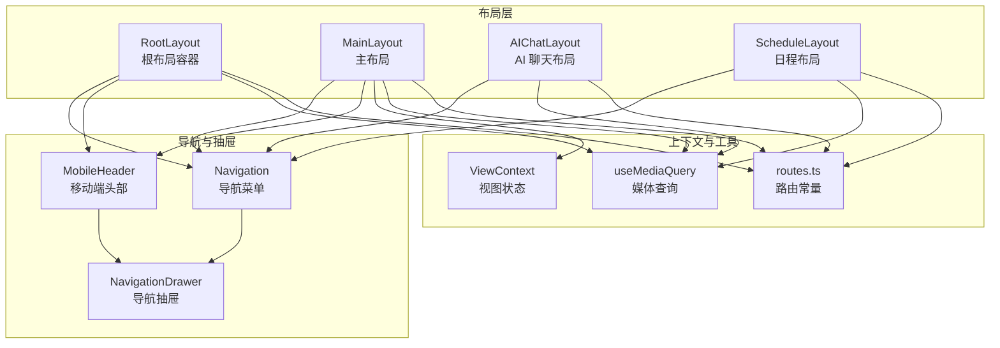
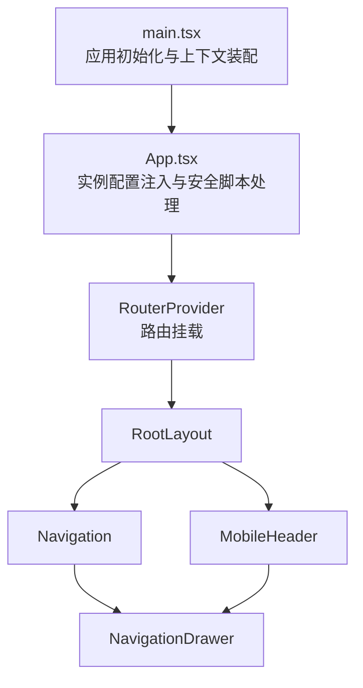
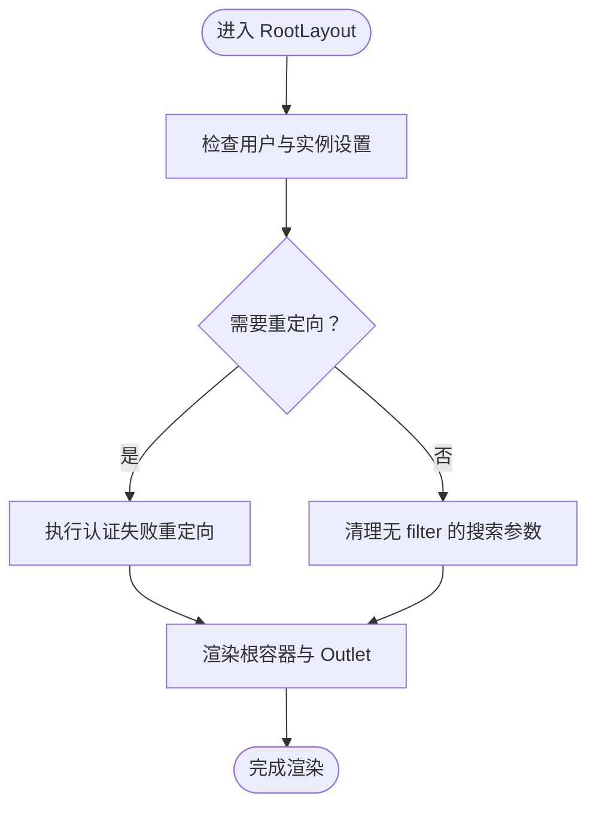
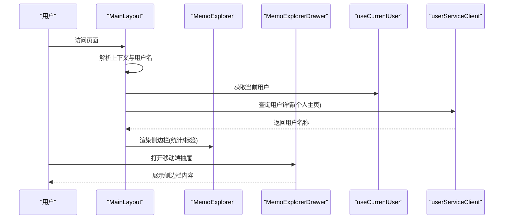
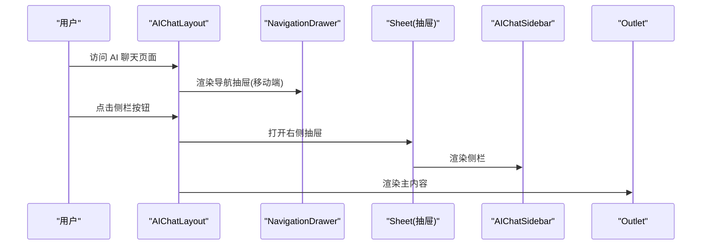
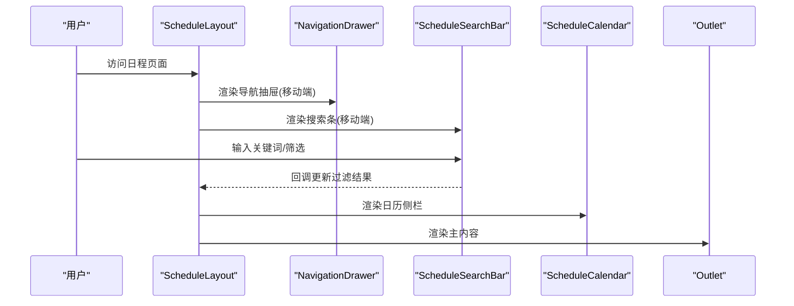
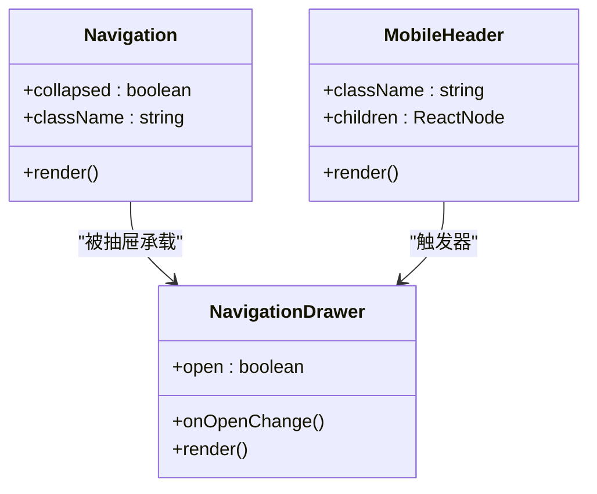
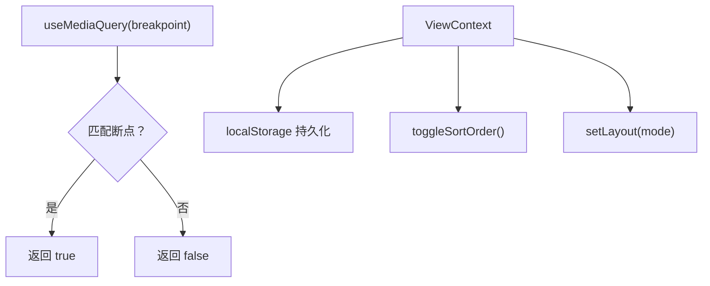
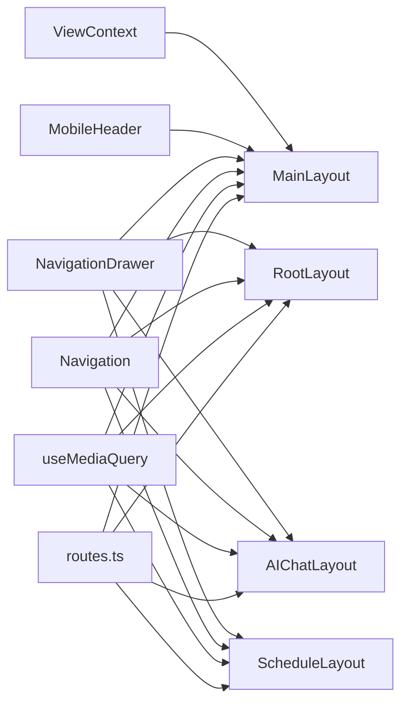

# 页面布局组件

<cite>
**本文引用的文件**
- [web/src/layouts/MainLayout.tsx](file://web/src/layouts/MainLayout.tsx)
- [web/src/layouts/AIChatLayout.tsx](file://web/src/layouts/AIChatLayout.tsx)
- [web/src/layouts/ScheduleLayout.tsx](file://web/src/layouts/ScheduleLayout.tsx)
- [web/src/layouts/RootLayout.tsx](file://web/src/layouts/RootLayout.tsx)
- [web/src/components/Navigation.tsx](file://web/src/components/Navigation.tsx)
- [web/src/components/NavigationDrawer.tsx](file://web/src/components/NavigationDrawer.tsx)
- [web/src/components/MobileHeader.tsx](file://web/src/components/MobileHeader.tsx)
- [web/src/components/MemoExplorer/MemoExplorerDrawer.tsx](file://web/src/components/MemoExplorer/MemoExplorerDrawer.tsx)
- [web/src/hooks/useMediaQuery.ts](file://web/src/hooks/useMediaQuery.ts)
- [web/src/contexts/ViewContext.tsx](file://web/src/contexts/ViewContext.tsx)
- [web/src/router/routes.ts](file://web/src/router/routes.ts)
- [web/src/App.tsx](file://web/src/App.tsx)
- [web/src/main.tsx](file://web/src/main.tsx)
- [web/src/themes/default.css](file://web/src/themes/default.css)
</cite>

## 目录
1. [简介](#简介)
2. [项目结构](#项目结构)
3. [核心组件](#核心组件)
4. [架构总览](#架构总览)
5. [详细组件分析](#详细组件分析)
6. [依赖关系分析](#依赖关系分析)
7. [性能考量](#性能考量)
8. [故障排查指南](#故障排查指南)
9. [结论](#结论)
10. [附录](#附录)

## 简介
本文件系统性梳理前端页面布局体系，覆盖整体布局架构（导航系统、侧边栏、主内容区与响应式设计）、不同页面布局（主布局、AI 聊天布局、日程布局）的实现方式、导航与面包屑策略、移动端适配与布局状态管理，并提供布局定制、主题切换与用户体验优化的实践建议。

## 项目结构
前端布局相关代码主要位于 web/src 下的 layouts、components、hooks、contexts、themes 与 router 等目录中。根布局负责全局导航与侧边栏容器；各业务布局（主布局、AI 聊天布局、日程布局）分别定义其侧边栏与主内容区的组织方式；导航组件与抽屉组件提供统一的入口与交互；媒体查询钩子驱动响应式行为；视图上下文负责列表/瀑布流布局模式与排序状态持久化；路由常量集中管理页面路径。

图表来源
- [web/src/layouts/RootLayout.tsx](file://web/src/layouts/RootLayout.tsx#L14-L67)
- [web/src/layouts/MainLayout.tsx](file://web/src/layouts/MainLayout.tsx#L13-L92)
- [web/src/layouts/AIChatLayout.tsx](file://web/src/layouts/AIChatLayout.tsx#L24-L85)
- [web/src/layouts/ScheduleLayout.tsx](file://web/src/layouts/ScheduleLayout.tsx#L25-L63)
- [web/src/components/Navigation.tsx](file://web/src/components/Navigation.tsx#L25-L142)
- [web/src/components/NavigationDrawer.tsx](file://web/src/components/NavigationDrawer.tsx#L8-L36)
- [web/src/components/MobileHeader.tsx](file://web/src/components/MobileHeader.tsx#L11-L34)
- [web/src/hooks/useMediaQuery.ts](file://web/src/hooks/useMediaQuery.ts#L11-L35)
- [web/src/contexts/ViewContext.tsx](file://web/src/contexts/ViewContext.tsx#L16-L80)
- [web/src/router/routes.ts](file://web/src/router/routes.ts#L1-L16)

章节来源
- [web/src/layouts/RootLayout.tsx](file://web/src/layouts/RootLayout.tsx#L14-L67)
- [web/src/layouts/MainLayout.tsx](file://web/src/layouts/MainLayout.tsx#L13-L92)
- [web/src/layouts/AIChatLayout.tsx](file://web/src/layouts/AIChatLayout.tsx#L24-L85)
- [web/src/layouts/ScheduleLayout.tsx](file://web/src/layouts/ScheduleLayout.tsx#L25-L63)
- [web/src/components/Navigation.tsx](file://web/src/components/Navigation.tsx#L25-L142)
- [web/src/components/NavigationDrawer.tsx](file://web/src/components/NavigationDrawer.tsx#L8-L36)
- [web/src/components/MobileHeader.tsx](file://web/src/components/MobileHeader.tsx#L11-L34)
- [web/src/hooks/useMediaQuery.ts](file://web/src/hooks/useMediaQuery.ts#L11-L35)
- [web/src/contexts/ViewContext.tsx](file://web/src/contexts/ViewContext.tsx#L16-L80)
- [web/src/router/routes.ts](file://web/src/router/routes.ts#L1-L16)

## 核心组件
- 根布局 RootLayout：提供全局左侧导航容器、移动端折叠导航、主内容区挂载点与加载占位，负责实例设置与认证重定向逻辑。
- 主布局 MainLayout：根据路由上下文决定侧边栏展示方式（桌面固定侧边栏或移动端抽屉），承载主内容区与移动端头部。
- AI 聊天布局 AIChatLayout：为 AI 聊天场景优化的侧边栏与主内容区组织，支持移动端抽屉与桌面侧栏。
- 日程布局 ScheduleLayout：在移动端提供搜索条与导航抽屉，在桌面端提供日历侧栏与主内容区。
- 导航组件 Navigation：按用户状态动态渲染导航项，支持未读通知徽标与图标提示。
- 导航抽屉 NavigationDrawer：移动端弹出式导航容器，承载 Navigation。
- 移动端头部 MobileHeader：在小屏设备上提供可粘滞的头部区域与抽屉触发器。
- 媒体查询 useMediaQuery：基于断点返回当前屏幕匹配状态，驱动响应式布局切换。
- 视图上下文 ViewContext：维护列表/瀑布流布局模式与时间排序方向，并持久化到本地存储。
- 路由常量 routes：集中定义页面路径，便于布局与导航统一引用。

章节来源
- [web/src/layouts/RootLayout.tsx](file://web/src/layouts/RootLayout.tsx#L14-L67)
- [web/src/layouts/MainLayout.tsx](file://web/src/layouts/MainLayout.tsx#L13-L92)
- [web/src/layouts/AIChatLayout.tsx](file://web/src/layouts/AIChatLayout.tsx#L24-L85)
- [web/src/layouts/ScheduleLayout.tsx](file://web/src/layouts/ScheduleLayout.tsx#L25-L63)
- [web/src/components/Navigation.tsx](file://web/src/components/Navigation.tsx#L25-L142)
- [web/src/components/NavigationDrawer.tsx](file://web/src/components/NavigationDrawer.tsx#L8-L36)
- [web/src/components/MobileHeader.tsx](file://web/src/components/MobileHeader.tsx#L11-L34)
- [web/src/hooks/useMediaQuery.ts](file://web/src/hooks/useMediaQuery.ts#L11-L35)
- [web/src/contexts/ViewContext.tsx](file://web/src/contexts/ViewContext.tsx#L16-L80)
- [web/src/router/routes.ts](file://web/src/router/routes.ts#L1-L16)

## 架构总览
整体采用“根布局 + 业务布局 + 导航/抽屉 + 响应式钩子”的分层架构。根布局负责全局容器与导航骨架；业务布局聚焦各自领域侧边栏与主内容区；导航组件与抽屉提供一致的入口；媒体查询驱动桌面/移动端差异；视图上下文提供布局模式与排序偏好持久化。

图表来源
- [web/src/main.tsx](file://web/src/main.tsx#L29-L81)
- [web/src/App.tsx](file://web/src/App.tsx#L29-L92)
- [web/src/layouts/RootLayout.tsx](file://web/src/layouts/RootLayout.tsx#L14-L67)
- [web/src/components/Navigation.tsx](file://web/src/components/Navigation.tsx#L25-L142)
- [web/src/components/NavigationDrawer.tsx](file://web/src/components/NavigationDrawer.tsx#L8-L36)
- [web/src/components/MobileHeader.tsx](file://web/src/components/MobileHeader.tsx#L11-L34)

## 详细组件分析

### 根布局 RootLayout
- 结构职责
  - 左侧导航容器：在小屏时以折叠形式固定于左上角，提供快速入口。
  - 主内容区：承载 Outlet，用于挂载具体页面。
  - 加载占位：使用 Suspense 提供全屏加载指示。
- 认证与实例设置
  - 当用户未登录且实例禁止公开可见时，执行认证失败重定向。
  - 清理搜索参数中的过滤条件，避免跨页污染。
- 响应式与容器
  - 使用媒体查询控制左侧导航宽度与折叠状态。
  - 容器类名确保高度与滚动行为符合全屏需求。

图表来源
- [web/src/layouts/RootLayout.tsx](file://web/src/layouts/RootLayout.tsx#L24-L35)

章节来源
- [web/src/layouts/RootLayout.tsx](file://web/src/layouts/RootLayout.tsx#L14-L67)

### 主布局 MainLayout
- 上下文识别
  - 基于当前路径判断上下文类型（首页、探索、归档、个人主页），用于侧边栏与统计数据的差异化展示。
- 用户名解析
  - 在个人主页上下文中从 URL 提取用户名并调用后端接口获取用户名称，以便统计与筛选。
- 统计与标签
  - 根据上下文选择当前用户或目标用户的统计数据；归档与探索上下文通过缓存计算统计。
- 侧边栏与主内容区
  - 小屏：移动端头部包含抽屉触发器，抽屉内放置侧边栏。
  - 大屏：固定左侧侧边栏，主内容区根据侧栏宽度设置左边距。
- 响应式断点
  - 使用媒体查询控制侧栏宽度与是否显示固定侧栏。

图表来源
- [web/src/layouts/MainLayout.tsx](file://web/src/layouts/MainLayout.tsx#L13-L92)
- [web/src/components/MemoExplorer/MemoExplorerDrawer.tsx](file://web/src/components/MemoExplorer/MemoExplorerDrawer.tsx#L16-L43)

章节来源
- [web/src/layouts/MainLayout.tsx](file://web/src/layouts/MainLayout.tsx#L13-L92)
- [web/src/components/MemoExplorer/MemoExplorerDrawer.tsx](file://web/src/components/MemoExplorer/MemoExplorerDrawer.tsx#L16-L43)

### AI 聊天布局 AIChatLayout
- 移动端与桌面端差异
  - 移动端：顶部提供导航抽屉、标题与侧栏开关按钮；点击按钮打开右侧抽屉侧栏。
  - 桌面端：固定左侧侧栏，主内容区设置左边距。
- 侧栏与主内容
  - 侧栏组件提供会话列表与操作入口；主内容区承载聊天页面。
- 上下文提供
  - 包裹 AIChatProvider，为聊天功能提供状态与能力。

图表来源
- [web/src/layouts/AIChatLayout.tsx](file://web/src/layouts/AIChatLayout.tsx#L24-L85)

章节来源
- [web/src/layouts/AIChatLayout.tsx](file://web/src/layouts/AIChatLayout.tsx#L24-L85)

### 日程布局 ScheduleLayout
- 移动端与桌面端差异
  - 移动端：顶部提供导航抽屉与搜索条，支持对日程进行实时筛选。
  - 桌面端：固定左侧日历侧栏，主内容区设置左边距。
- 侧栏与主内容
  - 侧栏展示日历与日期选择；主内容区承载日程页面。
- 数据获取
  - 预先拉取当日日程数据，作为搜索与筛选的数据源。

图表来源
- [web/src/layouts/ScheduleLayout.tsx](file://web/src/layouts/ScheduleLayout.tsx#L25-L63)

章节来源
- [web/src/layouts/ScheduleLayout.tsx](file://web/src/layouts/ScheduleLayout.tsx#L25-L63)

### 导航系统与移动端适配
- 导航组件 Navigation
  - 动态渲染：已登录用户显示首页、AI 助手、日程、探索、附件、收件箱；未登录仅显示探索与登录入口。
  - 未读通知：在收件箱入口显示未读数量徽标。
  - 折叠模式：在小屏时以图标+气泡提示的方式呈现。
- 导航抽屉 NavigationDrawer
  - 弹出式容器：承载完整导航菜单，关闭后自动清空状态。
- 移动端头部 MobileHeader
  - 可粘滞头部：在滚动时带阴影，提供抽屉触发器与自定义内容插槽。

图表来源
- [web/src/components/Navigation.tsx](file://web/src/components/Navigation.tsx#L25-L142)
- [web/src/components/NavigationDrawer.tsx](file://web/src/components/NavigationDrawer.tsx#L8-L36)
- [web/src/components/MobileHeader.tsx](file://web/src/components/MobileHeader.tsx#L11-L34)

章节来源
- [web/src/components/Navigation.tsx](file://web/src/components/Navigation.tsx#L25-L142)
- [web/src/components/NavigationDrawer.tsx](file://web/src/components/NavigationDrawer.tsx#L8-L36)
- [web/src/components/MobileHeader.tsx](file://web/src/components/MobileHeader.tsx#L11-L34)

### 响应式设计与布局状态管理
- 媒体查询 useMediaQuery
  - 提供 sm/md/lg 断点检测，返回布尔值用于条件渲染与样式调整。
- 视图上下文 ViewContext
  - 维护布局模式（列表/瀑布流）与排序方向（时间升序/降序），并持久化到本地存储。
  - 提供切换与设置方法，供页面组件消费。

图表来源
- [web/src/hooks/useMediaQuery.ts](file://web/src/hooks/useMediaQuery.ts#L11-L35)
- [web/src/contexts/ViewContext.tsx](file://web/src/contexts/ViewContext.tsx#L16-L80)

章节来源
- [web/src/hooks/useMediaQuery.ts](file://web/src/hooks/useMediaQuery.ts#L11-L35)
- [web/src/contexts/ViewContext.tsx](file://web/src/contexts/ViewContext.tsx#L16-L80)

### 布局定制、主题切换与用户体验优化
- 布局定制
  - 通过根布局与业务布局的容器类名与间距变量，统一控制页面留白与主内容区宽度。
  - 使用媒体查询断点在不同尺寸下调整侧栏宽度与边距。
- 主题切换
  - 应用启动时尽早应用主题与语言，避免闪烁。
  - 主题变量集中于 CSS 变量文件，便于全局替换与扩展。
- 用户体验优化
  - 根布局提供加载占位，提升首屏感知。
  - 导航抽屉在页面切换时自动关闭，避免状态残留。
  - 移动端头部在滚动时增加阴影，增强层级感。
  - 通知徽标直观提示未读数量，减少用户查找成本。

章节来源
- [web/src/main.tsx](file://web/src/main.tsx#L22-L28)
- [web/src/App.tsx](file://web/src/App.tsx#L33-L35)
- [web/src/themes/default.css](file://web/src/themes/default.css#L1-L124)

## 依赖关系分析
- 布局与导航
  - RootLayout 与 MainLayout 均依赖 Navigation 与 MobileHeader；AIChatLayout 与 ScheduleLayout 依赖 NavigationDrawer 与 Navigation。
- 响应式与状态
  - 各布局均依赖 useMediaQuery 进行断点判断；MainLayout 依赖 ViewContext 的布局模式与排序方向。
- 路由与页面
  - 路由常量集中定义页面路径，布局与导航统一引用，保证一致性。

图表来源
- [web/src/router/routes.ts](file://web/src/router/routes.ts#L1-L16)
- [web/src/layouts/RootLayout.tsx](file://web/src/layouts/RootLayout.tsx#L14-L67)
- [web/src/layouts/MainLayout.tsx](file://web/src/layouts/MainLayout.tsx#L13-L92)
- [web/src/layouts/AIChatLayout.tsx](file://web/src/layouts/AIChatLayout.tsx#L24-L85)
- [web/src/layouts/ScheduleLayout.tsx](file://web/src/layouts/ScheduleLayout.tsx#L25-L63)
- [web/src/components/Navigation.tsx](file://web/src/components/Navigation.tsx#L25-L142)
- [web/src/components/NavigationDrawer.tsx](file://web/src/components/NavigationDrawer.tsx#L8-L36)
- [web/src/components/MobileHeader.tsx](file://web/src/components/MobileHeader.tsx#L11-L34)
- [web/src/hooks/useMediaQuery.ts](file://web/src/hooks/useMediaQuery.ts#L11-L35)
- [web/src/contexts/ViewContext.tsx](file://web/src/contexts/ViewContext.tsx#L16-L80)

章节来源
- [web/src/router/routes.ts](file://web/src/router/routes.ts#L1-L16)
- [web/src/layouts/RootLayout.tsx](file://web/src/layouts/RootLayout.tsx#L14-L67)
- [web/src/layouts/MainLayout.tsx](file://web/src/layouts/MainLayout.tsx#L13-L92)
- [web/src/layouts/AIChatLayout.tsx](file://web/src/layouts/AIChatLayout.tsx#L24-L85)
- [web/src/layouts/ScheduleLayout.tsx](file://web/src/layouts/ScheduleLayout.tsx#L25-L63)
- [web/src/components/Navigation.tsx](file://web/src/components/Navigation.tsx#L25-L142)
- [web/src/components/NavigationDrawer.tsx](file://web/src/components/NavigationDrawer.tsx#L8-L36)
- [web/src/components/MobileHeader.tsx](file://web/src/components/MobileHeader.tsx#L11-L34)
- [web/src/hooks/useMediaQuery.ts](file://web/src/hooks/useMediaQuery.ts#L11-L35)
- [web/src/contexts/ViewContext.tsx](file://web/src/contexts/ViewContext.tsx#L16-L80)

## 性能考量
- 并行初始化：应用启动时并行初始化认证与实例上下文，缩短首屏等待时间。
- 条件渲染：基于媒体查询断点进行条件渲染，避免不必要的 DOM 与样式计算。
- 本地存储：视图状态持久化至本地存储，减少重复计算与网络请求。
- 加载占位：根布局提供全屏加载指示，改善感知性能。

章节来源
- [web/src/main.tsx](file://web/src/main.tsx#L35-L44)
- [web/src/contexts/ViewContext.tsx](file://web/src/contexts/ViewContext.tsx#L36-L58)
- [web/src/layouts/RootLayout.tsx](file://web/src/layouts/RootLayout.tsx#L52-L58)

## 故障排查指南
- 认证失败重定向
  - 现象：未登录用户访问需登录页面时被重定向。
  - 排查：确认实例设置中“禁止公开可见”选项与用户登录状态。
- 个人主页用户名解析失败
  - 现象：个人主页统计异常或空白。
  - 排查：检查用户服务接口调用与错误处理分支。
- 移动端抽屉状态残留
  - 现象：页面切换后抽屉仍处于打开状态。
  - 排查：确认抽屉组件在路由变化时正确重置状态。
- 响应式断点不生效
  - 现象：侧栏宽度或布局未随窗口变化。
  - 排查：检查媒体查询断点与容器类名拼接逻辑。

章节来源
- [web/src/layouts/RootLayout.tsx](file://web/src/layouts/RootLayout.tsx#L24-L28)
- [web/src/layouts/MainLayout.tsx](file://web/src/layouts/MainLayout.tsx#L30-L50)
- [web/src/components/NavigationDrawer.tsx](file://web/src/components/NavigationDrawer.tsx#L14-L16)
- [web/src/hooks/useMediaQuery.ts](file://web/src/hooks/useMediaQuery.ts#L17-L29)

## 结论
该布局体系通过根布局与业务布局的清晰分层、统一的导航与抽屉组件、响应式断点与视图状态管理，实现了在多页面场景下的高复用与一致体验。配合主题变量与早期初始化策略，进一步提升了可定制性与性能表现。后续可在以下方面持续优化：增强布局切换动画、完善无障碍访问、细化移动端交互细节以及扩展更多业务布局模板。

## 附录
- 路由常量集中管理，便于布局与导航统一引用，降低耦合度。
- 主题变量集中于 CSS 文件，便于全局替换与扩展。

章节来源
- [web/src/router/routes.ts](file://web/src/router/routes.ts#L1-L16)
- [web/src/themes/default.css](file://web/src/themes/default.css#L1-L124)