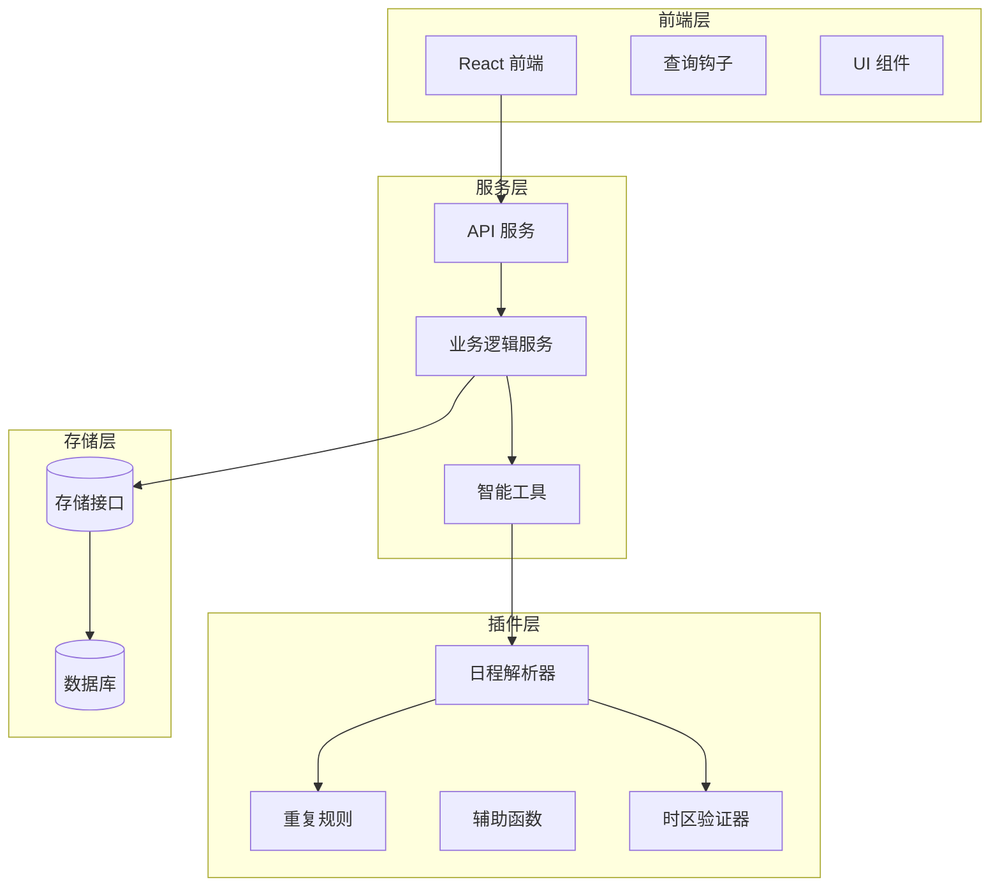
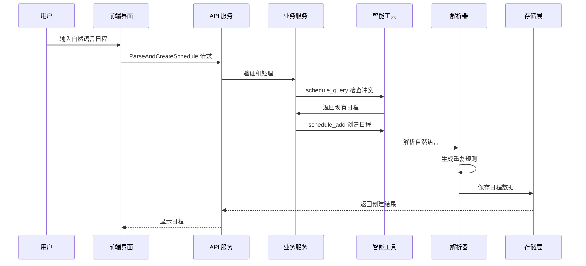
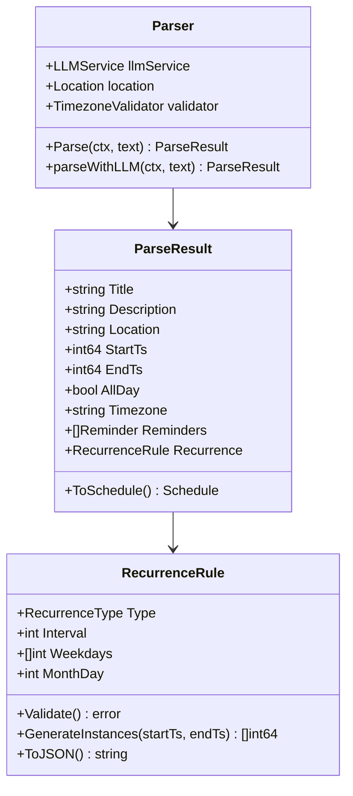
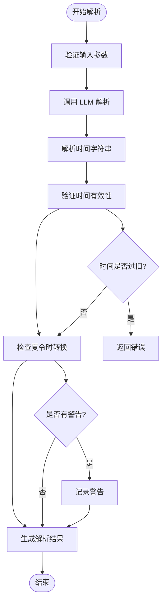
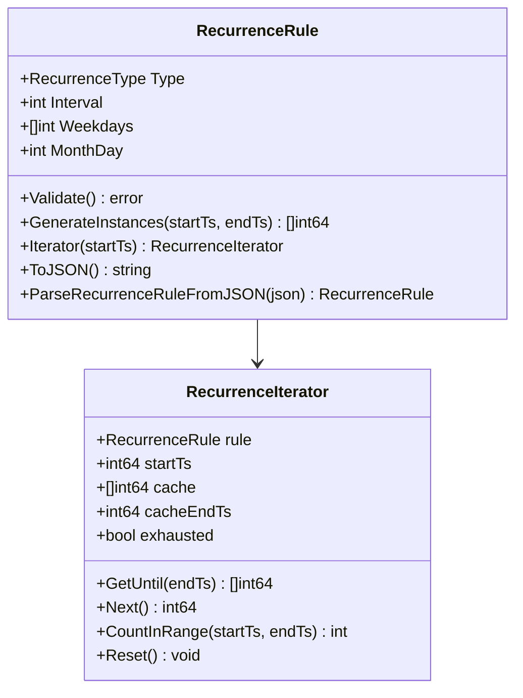
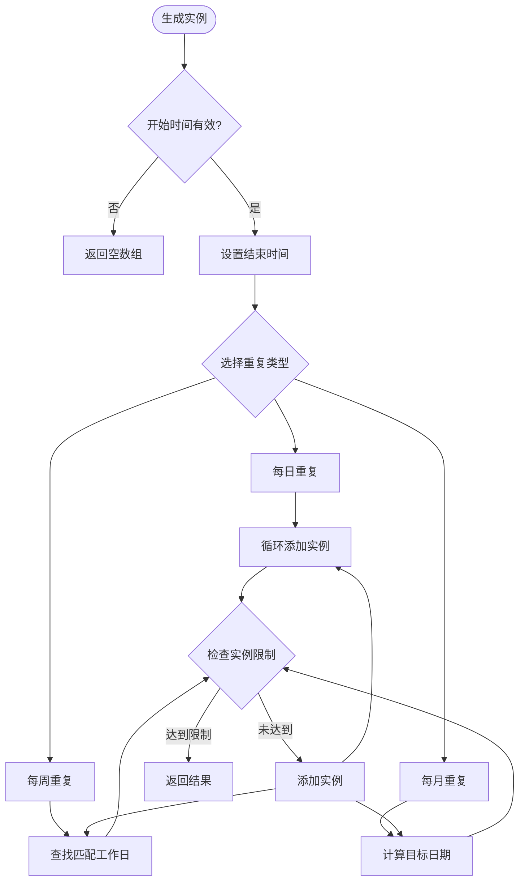
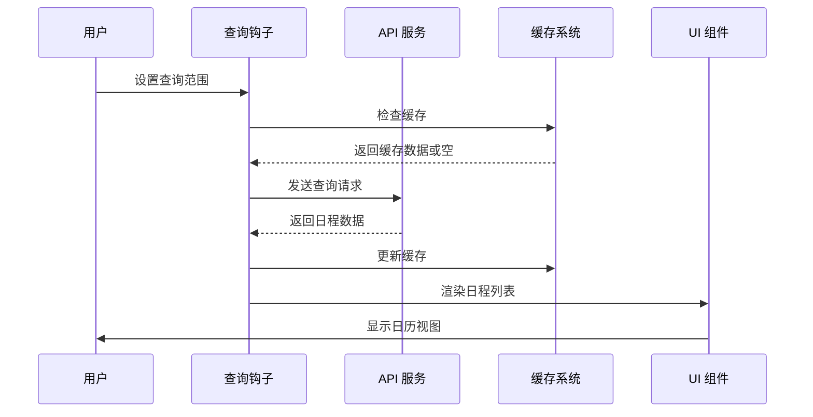
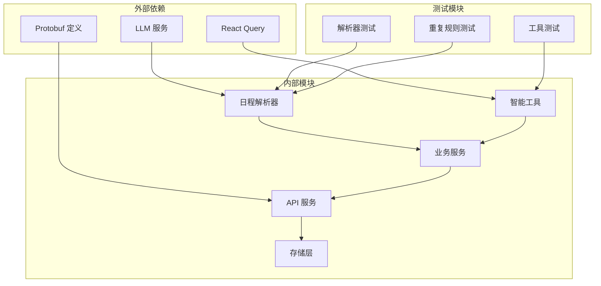
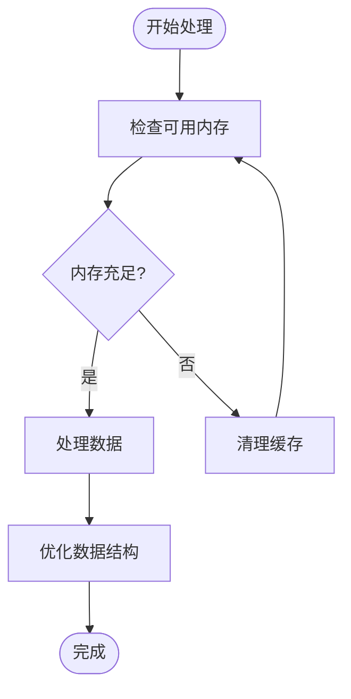

# 使用 Schedule 查询

<cite>
**本文档引用的文件**
- [plugin/ai/schedule/helpers.go](file://plugin/ai/schedule/helpers.go)
- [plugin/ai/schedule/parser.go](file://plugin/ai/schedule/parser.go)
- [plugin/ai/schedule/recurrence.go](file://plugin/ai/schedule/recurrence.go)
- [plugin/ai/schedule/timezone_validator.go](file://plugin/ai/schedule/timezone_validator.go)
- [plugin/ai/agent/tools/scheduler.go](file://plugin/ai/agent/tools/scheduler.go)
- [server/router/api/v1/schedule_service.go](file://server/router/api/v1/schedule_service.go)
- [server/service/schedule/service.go](file://server/service/schedule/service.go)
- [proto/api/v1/schedule_service.proto](file://proto/api/v1/schedule_service.proto)
- [web/src/hooks/useScheduleQueries.ts](file://web/src/hooks/useScheduleQueries.ts)
- [web/src/pages/Schedule.tsx](file://web/src/pages/Schedule.tsx)
- [web/src/components/AIChat/ScheduleCalendar.tsx](file://web/src/components/AIChat/ScheduleCalendar.tsx)
- [plugin/ai/schedule/helpers_test.go](file://plugin/ai/schedule/helpers_test.go)
- [plugin/ai/schedule/recurrence_test.go](file://plugin/ai/schedule/recurrence_test.go)
- [plugin/ai/agent/tools/scheduler_test.go](file://plugin/ai/agent/tools/scheduler_test.go)
</cite>

## 目录
1. [简介](#简介)
2. [项目结构](#项目结构)
3. [核心组件](#核心组件)
4. [架构概览](#架构概览)
5. [详细组件分析](#详细组件分析)
6. [依赖关系分析](#依赖关系分析)
7. [性能考虑](#性能考虑)
8. [故障排除指南](#故障排除指南)
9. [结论](#结论)

## 简介

本文档详细介绍了 Memos 项目中的 Schedule 查询系统，这是一个基于自然语言处理的日程管理系统。该系统允许用户通过自然语言描述创建、查询和管理日程事件，支持重复性日程、提醒功能和时区处理。

系统的核心特性包括：
- 自然语言解析和转换为结构化日程数据
- 重复性日程规则的生成和管理
- 冲突检测和预防机制
- 前端优化的查询和显示功能
- 时区感知的时间处理

## 项目结构

**图表来源**
- [web/src/pages/Schedule.tsx](file://web/src/pages/Schedule.tsx#L1-L196)
- [server/router/api/v1/schedule_service.go](file://server/router/api/v1/schedule_service.go#L1-L826)
- [plugin/ai/schedule/parser.go](file://plugin/ai/schedule/parser.go#L1-L378)

**章节来源**
- [web/src/pages/Schedule.tsx](file://web/src/pages/Schedule.tsx#L1-L196)
- [server/router/api/v1/schedule_service.go](file://server/router/api/v1/schedule_service.go#L1-L826)
- [plugin/ai/schedule/parser.go](file://plugin/ai/schedule/parser.go#L1-L378)

## 核心组件

### 日程解析器 (Schedule Parser)

日程解析器是系统的核心组件，负责将自然语言转换为结构化的日程数据。它包含以下关键功能：

- **自然语言处理**: 使用 LLM 服务解析复杂的日程描述
- **时间计算**: 处理相对日期和时间计算
- **重复规则提取**: 从文本中识别和解析重复模式
- **提醒设置**: 提取和解析提醒配置

### 重复规则引擎 (Recurrence Engine)

重复规则引擎提供灵活的日程重复功能：

- **三种重复类型**: 每日、每周、每月
- **间隔控制**: 支持自定义间隔（如每3天、每2周）
- **工作日过滤**: 支持特定工作日的重复
- **实例生成**: 动态生成重复事件的时间戳

### 时区验证器 (Timezone Validator)

时区验证器确保日程在不同时区下的正确性：

- **夏令时处理**: 处理 DST 转换中的边界情况
- **无效时间检测**: 识别和修正不存在的时间
- **模糊时间处理**: 处理重复出现的时间

### 智能工具 (AI Tools)

智能工具集成为用户提供自动化日程管理能力：

- **schedule_query**: 查询现有日程以避免冲突
- **schedule_add**: 创建新日程并处理冲突
- **find_free_time**: 查找可用时间段

**章节来源**
- [plugin/ai/schedule/parser.go](file://plugin/ai/schedule/parser.go#L1-L378)
- [plugin/ai/schedule/recurrence.go](file://plugin/ai/schedule/recurrence.go#L1-L557)
- [plugin/ai/schedule/timezone_validator.go](file://plugin/ai/schedule/timezone_validator.go#L1-L247)
- [plugin/ai/agent/tools/scheduler.go](file://plugin/ai/agent/tools/scheduler.go#L1-L800)

## 架构概览

**图表来源**
- [server/router/api/v1/schedule_service.go](file://server/router/api/v1/schedule_service.go#L654-L723)
- [plugin/ai/agent/tools/scheduler.go](file://plugin/ai/agent/tools/scheduler.go#L132-L266)
- [plugin/ai/schedule/parser.go](file://plugin/ai/schedule/parser.go#L62-L76)

## 详细组件分析

### 日程解析器实现

日程解析器采用模块化设计，每个组件都有明确的职责：

**图表来源**
- [plugin/ai/schedule/parser.go](file://plugin/ai/schedule/parser.go#L22-L60)
- [plugin/ai/schedule/recurrence.go](file://plugin/ai/schedule/recurrence.go#L42-L47)

#### 时间处理算法

日程解析器实现了复杂的时间处理逻辑：

**图表来源**
- [plugin/ai/schedule/parser.go](file://plugin/ai/schedule/parser.go#L91-L348)
- [plugin/ai/schedule/timezone_validator.go](file://plugin/ai/schedule/timezone_validator.go#L110-L129)

**章节来源**
- [plugin/ai/schedule/parser.go](file://plugin/ai/schedule/parser.go#L1-L378)
- [plugin/ai/schedule/timezone_validator.go](file://plugin/ai/schedule/timezone_validator.go#L1-L247)

### 重复规则引擎

重复规则引擎提供了强大的日程重复功能：

**图表来源**
- [plugin/ai/schedule/recurrence.go](file://plugin/ai/schedule/recurrence.go#L42-L557)

#### 实例生成算法

重复规则引擎使用高效的算法生成日程实例：

**图表来源**
- [plugin/ai/schedule/recurrence.go](file://plugin/ai/schedule/recurrence.go#L151-L282)

**章节来源**
- [plugin/ai/schedule/recurrence.go](file://plugin/ai/schedule/recurrence.go#L1-L557)

### 前端查询系统

前端提供了优化的查询和显示功能：

**图表来源**
- [web/src/hooks/useScheduleQueries.ts](file://web/src/hooks/useScheduleQueries.ts#L243-L265)
- [web/src/pages/Schedule.tsx](file://web/src/pages/Schedule.tsx#L33-L35)

#### 查询优化策略

前端查询系统采用了多种优化策略：

- **时间范围优化**: 默认查询当前日期前后15天的数据
- **缓存管理**: 合理的缓存策略避免不必要的网络请求
- **分页处理**: 支持大数据量的分页查询
- **实时更新**: 自动刷新最新的日程数据

**章节来源**
- [web/src/hooks/useScheduleQueries.ts](file://web/src/hooks/useScheduleQueries.ts#L1-L593)
- [web/src/pages/Schedule.tsx](file://web/src/pages/Schedule.tsx#L1-L196)

## 依赖关系分析

**图表来源**
- [plugin/ai/schedule/parser.go](file://plugin/ai/schedule/parser.go#L12-L14)
- [proto/api/v1/schedule_service.proto](file://proto/api/v1/schedule_service.proto#L1-L166)

### 关键依赖关系

系统的关键依赖关系包括：

1. **LLM 服务集成**: 日程解析依赖于外部 LLM 服务进行自然语言处理
2. **Protobuf 协议**: 前后端通信使用标准化的 Protobuf 接口
3. **React Query 缓存**: 前端查询状态管理
4. **PostgreSQL 存储**: 数据持久化层

**章节来源**
- [plugin/ai/schedule/parser.go](file://plugin/ai/schedule/parser.go#L1-L378)
- [proto/api/v1/schedule_service.proto](file://proto/api/v1/schedule_service.proto#L1-L166)

## 性能考虑

### 查询性能优化

系统在多个层面进行了性能优化：

1. **前端缓存策略**: 使用 React Query 的智能缓存避免重复请求
2. **实例数量限制**: 限制重复日程实例的数量防止内存溢出
3. **批量查询**: 支持批量查询减少网络往返次数
4. **懒加载迭代器**: 使用迭代器模式处理大量重复实例

### 内存管理

**图表来源**
- [plugin/ai/schedule/recurrence.go](file://plugin/ai/schedule/recurrence.go#L341-L363)

## 故障排除指南

### 常见问题及解决方案

#### 日程冲突检测

当创建日程时遇到冲突，系统会返回详细的冲突信息：

1. **冲突检测失败**: 检查时间范围和时区设置
2. **重复冲突**: 使用 `checkRecurringConflicts` 方法检查重复日程
3. **时区问题**: 确保所有时间都转换为 UTC 格式

#### 解析器错误

解析自然语言时可能遇到的问题：

1. **输入格式错误**: 确保输入符合预期格式
2. **LLM 服务不可用**: 检查 LLM 服务连接状态
3. **时间解析失败**: 验证时间字符串的格式

#### 前端查询问题

前端查询可能出现的问题：

1. **数据不同步**: 使用 `invalidateQueries` 刷新缓存
2. **时间显示错误**: 检查时区转换逻辑
3. **性能问题**: 调整查询范围和缓存策略

**章节来源**
- [plugin/ai/schedule/helpers_test.go](file://plugin/ai/schedule/helpers_test.go#L1-L181)
- [plugin/ai/schedule/recurrence_test.go](file://plugin/ai/schedule/recurrence_test.go#L1-L373)
- [plugin/ai/agent/tools/scheduler_test.go](file://plugin/ai/agent/tools/scheduler_test.go#L1-L273)

## 结论

Memos 的 Schedule 查询系统是一个功能完整、设计合理的日程管理系统。它通过以下特点实现了优秀的用户体验：

1. **自然语言处理**: 允许用户用自然语言描述日程
2. **智能冲突检测**: 自动检测和解决日程冲突
3. **灵活的重复规则**: 支持复杂的重复模式
4. **前端优化**: 提供流畅的用户交互体验
5. **时区感知**: 正确处理不同时区的时间

该系统的设计充分考虑了可扩展性和维护性，为未来的功能扩展奠定了良好的基础。通过模块化的架构设计和完善的测试覆盖，系统能够稳定地处理各种复杂的日程管理场景。