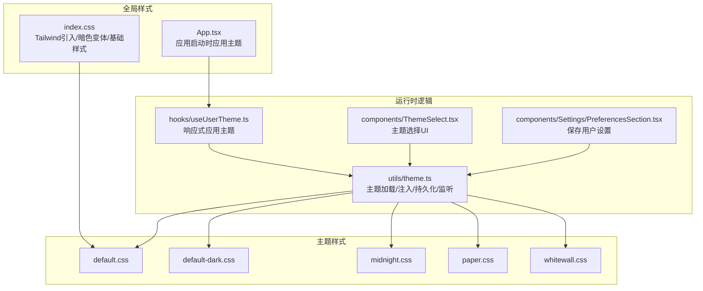
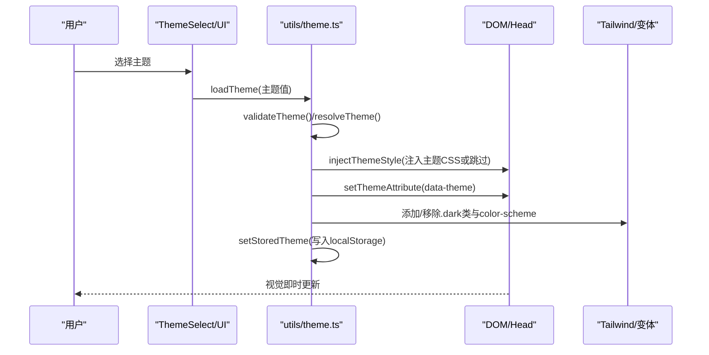
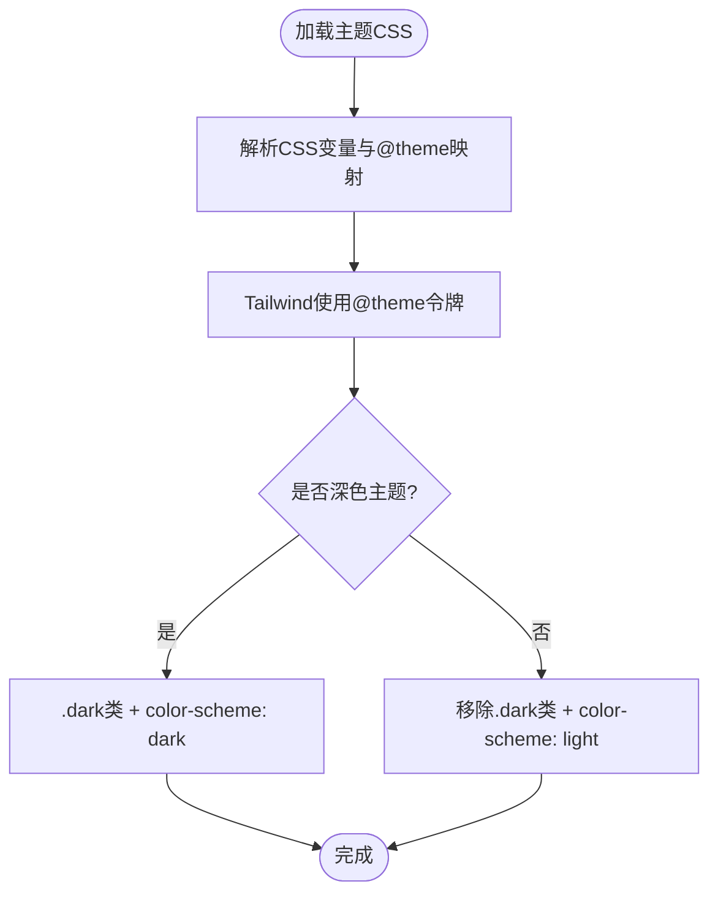
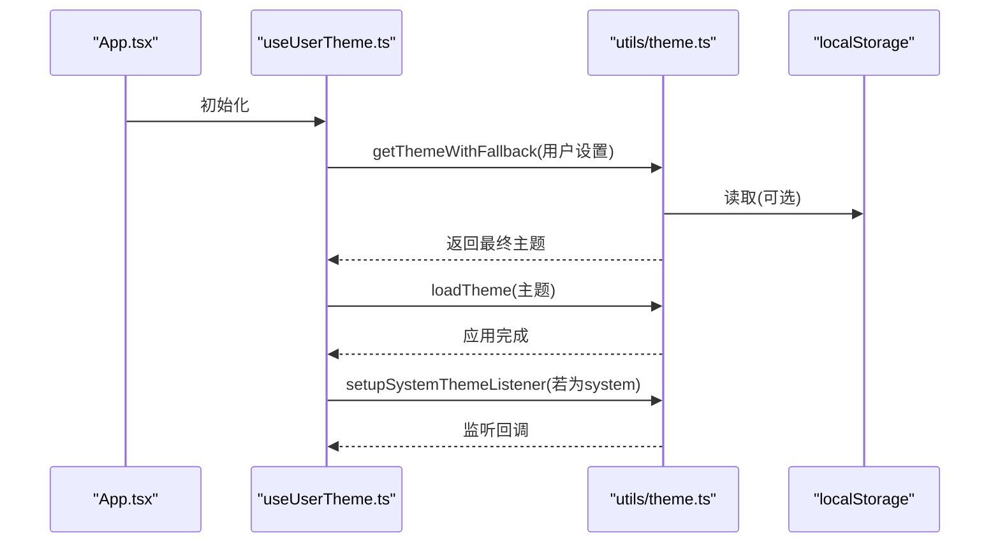
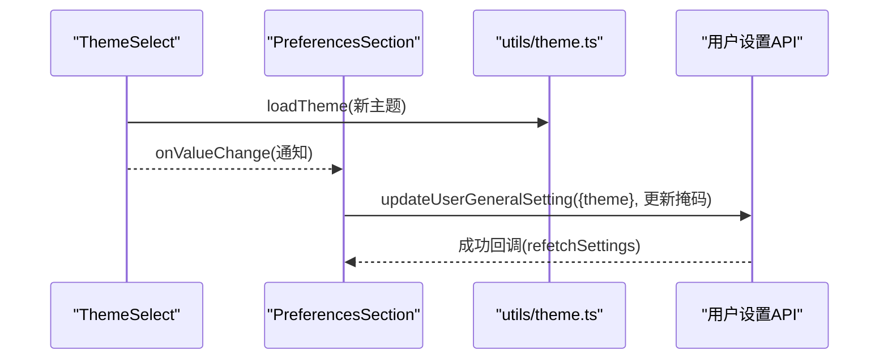
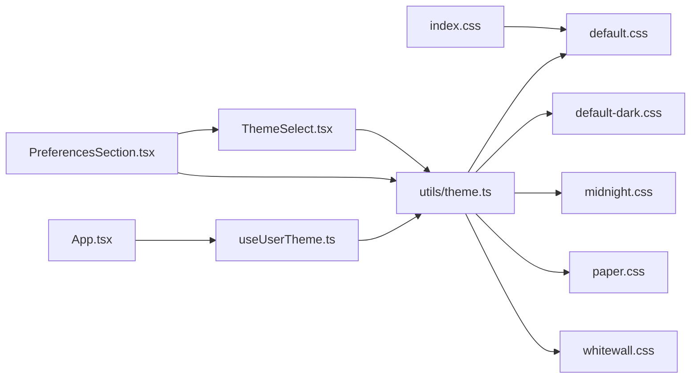

# 主题系统与定制化

<cite>
**本文档引用的文件**
- [web/src/utils/theme.ts](file://web/src/utils/theme.ts)
- [web/src/hooks/useUserTheme.ts](file://web/src/hooks/useUserTheme.ts)
- [web/src/components/ThemeSelect.tsx](file://web/src/components/ThemeSelect.tsx)
- [web/src/themes/default.css](file://web/src/themes/default.css)
- [web/src/themes/default-dark.css](file://web/src/themes/default-dark.css)
- [web/src/themes/midnight.css](file://web/src/themes/midnight.css)
- [web/src/themes/paper.css](file://web/src/themes/paper.css)
- [web/src/themes/whitewall.css](file://web/src/themes/whitewall.css)
- [web/src/themes/COLOR_GUIDE.md](file://web/src/themes/COLOR_GUIDE.md)
- [web/src/index.css](file://web/src/index.css)
- [web/src/App.tsx](file://web/src/App.tsx)
- [web/src/components/Settings/PreferencesSection.tsx](file://web/src/components/Settings/PreferencesSection.tsx)
</cite>

## 目录
1. [简介](#简介)
2. [项目结构](#项目结构)
3. [核心组件](#核心组件)
4. [架构总览](#架构总览)
5. [详细组件分析](#详细组件分析)
6. [依赖关系分析](#依赖关系分析)
7. [性能考量](#性能考量)
8. [故障排查指南](#故障排查指南)
9. [结论](#结论)
10. [附录](#附录)

## 简介
本文件系统性阐述 Memos 前端的主题系统与定制化能力，涵盖 CSS 变量体系、Tailwind CSS 集成、动态主题切换流程、内置主题特性与适用场景、用户自定义主题机制、主题持久化与回退策略、以及最佳实践与兼容性建议。目标是帮助开发者与维护者快速理解并扩展主题系统。

## 项目结构
主题系统主要由以下部分组成：
- CSS 变量与主题样式：位于 themes 目录，包含默认浅色、深色、午夜、纸张、白墙等主题的 CSS 变量定义与 Tailwind @theme 映射。
- 主题运行时逻辑：位于 utils/theme.ts，负责主题验证、系统主题检测、DOM 注入、Tailwind 暗色模式类切换、localStorage 持久化与系统主题监听。
- React 钩子与 UI 组件：hooks/useUserTheme.ts 提供响应式主题应用；components/ThemeSelect.tsx 提供主题选择 UI；App.tsx 在应用启动时应用主题；Settings/PreferencesSection.tsx 将主题变更持久化到用户设置。
- 全局样式：index.css 引入默认主题基础样式与 Tailwind，定义基于类名的暗色模式变体与通用样式。

**图表来源**
- [web/src/utils/theme.ts](file://web/src/utils/theme.ts#L1-L252)
- [web/src/hooks/useUserTheme.ts](file://web/src/hooks/useUserTheme.ts#L1-L38)
- [web/src/components/ThemeSelect.tsx](file://web/src/components/ThemeSelect.tsx#L1-L54)
- [web/src/themes/default.css](file://web/src/themes/default.css#L1-L124)
- [web/src/themes/default-dark.css](file://web/src/themes/default-dark.css#L1-L124)
- [web/src/themes/midnight.css](file://web/src/themes/midnight.css#L1-L121)
- [web/src/themes/paper.css](file://web/src/themes/paper.css#L1-L124)
- [web/src/themes/whitewall.css](file://web/src/themes/whitewall.css#L1-L124)
- [web/src/index.css](file://web/src/index.css#L1-L415)
- [web/src/App.tsx](file://web/src/App.tsx#L1-L92)

**章节来源**
- [web/src/utils/theme.ts](file://web/src/utils/theme.ts#L1-L252)
- [web/src/index.css](file://web/src/index.css#L1-L415)

## 核心组件
- 主题常量与选项
  - 支持的主题值：system、default、default-dark、midnight、paper、whitewall
  - 主题选项列表用于 UI 下拉选择
- 主题验证与解析
  - validateTheme：确保传入主题在有效集合内，非法值回退为 default
  - resolveTheme：将 "system" 解析为系统实际偏好（深色返回 default-dark，浅色返回 default）
- 本地存储与回退链
  - getStoredTheme/getInitialTheme：从 localStorage 读取或回退到系统偏好
  - getThemeWithFallback：优先级为 用户设置 → localStorage → 系统偏好
- DOM 注入与属性设置
  - injectThemeStyle：移除旧样式元素后注入新主题 CSS（default 不注入，使用基础样式）
  - setThemeAttribute：在 <html> 上设置 data-theme 属性，便于 CSS 基于属性选择器响应
- Tailwind 暗色模式集成
  - DARK_THEMES 列表决定是否添加 .dark 类与 color-scheme 声明
  - index.css 使用 :where(.dark, .dark *) 自定义变体，确保类名驱动而非媒体查询
- 系统主题监听
  - setupSystemThemeListener：监听 prefers-color-scheme 变更，支持现代与遗留 API

**章节来源**
- [web/src/utils/theme.ts](file://web/src/utils/theme.ts#L10-L133)
- [web/src/utils/theme.ts](file://web/src/utils/theme.ts#L146-L208)
- [web/src/utils/theme.ts](file://web/src/utils/theme.ts#L230-L251)
- [web/src/index.css](file://web/src/index.css#L5-L10)

## 架构总览
主题系统采用“CSS 变量 + Tailwind 类名 + 运行时注入”的组合方案：
- CSS 变量层：各主题以 OKLCH 定义语义化颜色变量，覆盖背景、前景、卡片、弹出层、输入框、边框、强调色、破坏性操作、图表色板与侧边栏等
- Tailwind 层：通过 @theme 将 CSS 变量映射为 Tailwind 设计令牌，配合 :where(.dark, .dark *) 实现类名驱动的暗色模式
- 运行时层：根据用户设置/本地存储/系统偏好解析主题，注入对应 CSS，设置 data-theme 与 .dark 类，持久化到 localStorage

**图表来源**
- [web/src/components/ThemeSelect.tsx](file://web/src/components/ThemeSelect.tsx#L20-L30)
- [web/src/utils/theme.ts](file://web/src/utils/theme.ts#L190-L208)
- [web/src/index.css](file://web/src/index.css#L5-L10)

## 详细组件分析

### CSS 变量与主题样式
- 变量命名规范
  - 语义化命名：--background/--foreground/--card/--popover/--primary/--secondary/--muted/--accent/--destructive/--border/--input/--ring/--chart-N/--sidebar-*
  - 字体族：--font-sans/--font-serif/--font-mono
  - 圆角与阴影：--radius、--shadow-*
  - 间距：--spacing、--spacing-xs/sm/md/lg/xl 及组件内边距变量
- OKLCH 色彩空间
  - 所有颜色以 oklch(l,c,h) 表达，提供更好的感知均匀性与无障碍对比度
  - 各主题在不同明度/色相/彩度下保持一致的可读性与品牌一致性
- Tailwind @theme 映射
  - 将 CSS 变量映射为 --color-* 设计令牌，使 Tailwind 工具类与 CSS 变量解耦
- 主题差异
  - default：浅色基础，适合明亮环境
  - default-dark：深色基础，适合夜间/低光环境
  - midnight：深蓝/紫调，强调沉浸感
  - paper：暖灰/米纸质感，强调手写/纸质风格
  - whitewall：纯白背景，强调极简与高对比

**图表来源**
- [web/src/themes/default.css](file://web/src/themes/default.css#L66-L123)
- [web/src/themes/midnight.css](file://web/src/themes/midnight.css#L66-L120)
- [web/src/themes/paper.css](file://web/src/themes/paper.css#L66-L123)
- [web/src/themes/whitewall.css](file://web/src/themes/whitewall.css#L66-L123)
- [web/src/themes/default-dark.css](file://web/src/themes/default-dark.css#L66-L123)
- [web/src/index.css](file://web/src/index.css#L5-L10)

**章节来源**
- [web/src/themes/default.css](file://web/src/themes/default.css#L1-L124)
- [web/src/themes/midnight.css](file://web/src/themes/midnight.css#L1-L121)
- [web/src/themes/paper.css](file://web/src/themes/paper.css#L1-L124)
- [web/src/themes/whitewall.css](file://web/src/themes/whitewall.css#L1-L124)
- [web/src/themes/default-dark.css](file://web/src/themes/default-dark.css#L1-L124)
- [web/src/themes/COLOR_GUIDE.md](file://web/src/themes/COLOR_GUIDE.md#L1-L300)

### 动态主题切换与运行时逻辑
- 主题加载流程
  - 输入：主题字符串（可能为 "system"）
  - 处理：校验 → 解析 → 注入 CSS → 设置 data-theme → 切换 .dark 类与 color-scheme → 写入 localStorage
- 回退链
  - 初始化：getInitialTheme → localStorage 或系统偏好
  - 运行期：getThemeWithFallback → 用户设置 → localStorage → 系统偏好
- 系统主题监听
  - 当前主题为 "system" 时，监听系统暗色偏好变化并自动刷新主题
- 安全与容错
  - localStorage 访问异常时静默失败，避免阻塞初始化
  - 仅在浏览器环境下执行系统主题监听

**图表来源**
- [web/src/App.tsx](file://web/src/App.tsx#L33-L35)
- [web/src/hooks/useUserTheme.ts](file://web/src/hooks/useUserTheme.ts#L9-L37)
- [web/src/utils/theme.ts](file://web/src/utils/theme.ts#L108-L133)
- [web/src/utils/theme.ts](file://web/src/utils/theme.ts#L214-L217)
- [web/src/utils/theme.ts](file://web/src/utils/theme.ts#L230-L251)

**章节来源**
- [web/src/utils/theme.ts](file://web/src/utils/theme.ts#L44-L70)
- [web/src/utils/theme.ts](file://web/src/utils/theme.ts#L108-L133)
- [web/src/utils/theme.ts](file://web/src/utils/theme.ts#L190-L208)
- [web/src/hooks/useUserTheme.ts](file://web/src/hooks/useUserTheme.ts#L9-L37)

### 主题选择 UI 与设置持久化
- ThemeSelect
  - 提供图标与标签展示，调用 loadTheme 即时应用，同时可回调父组件
- PreferencesSection
  - 将主题变更同步到用户设置（updateMask 包含 theme），实现跨会话持久化
- App.tsx
  - 在应用启动时应用用户语言与主题偏好

**图表来源**
- [web/src/components/ThemeSelect.tsx](file://web/src/components/ThemeSelect.tsx#L20-L30)
- [web/src/components/Settings/PreferencesSection.tsx](file://web/src/components/Settings/PreferencesSection.tsx#L48-L60)
- [web/src/utils/theme.ts](file://web/src/utils/theme.ts#L190-L208)

**章节来源**
- [web/src/components/ThemeSelect.tsx](file://web/src/components/ThemeSelect.tsx#L1-L54)
- [web/src/components/Settings/PreferencesSection.tsx](file://web/src/components/Settings/PreferencesSection.tsx#L48-L60)
- [web/src/App.tsx](file://web/src/App.tsx#L33-L35)

### 内置主题特点与适用场景
- 默认（浅色）
  - 特点：近白背景、中性灰文字、黄金主色，清晰易读
  - 适用：日常办公、长时间阅读、高对比需求
- 默认（深色）
  - 特点：深灰背景、高对比文本、主色保持亮度
  - 适用：夜间使用、低光环境、护眼场景
- 午夜
  - 特点：偏蓝/紫调，强调沉浸与专注
  - 适用：创意工作、深度思考、夜间专注
- 纸质
  - 特点：暖灰/米纸质感，柔和对比
  - 适用：笔记记录、阅读体验、手写风格偏好
- 白墙
  - 特点：纯白背景，极简高对比
  - 适用：打印预览、高对比阅读、极简主义

**章节来源**
- [web/src/themes/default.css](file://web/src/themes/default.css#L1-L124)
- [web/src/themes/default-dark.css](file://web/src/themes/default-dark.css#L1-L124)
- [web/src/themes/midnight.css](file://web/src/themes/midnight.css#L1-L121)
- [web/src/themes/paper.css](file://web/src/themes/paper.css#L1-L124)
- [web/src/themes/whitewall.css](file://web/src/themes/whitewall.css#L1-L124)
- [web/src/themes/COLOR_GUIDE.md](file://web/src/themes/COLOR_GUIDE.md#L1-L300)

### 用户自定义主题机制
- 颜色配置
  - 基于 OKLCH 的语义化变量，无需硬编码十六进制值
  - 通过 @theme 将 CSS 变量映射为 Tailwind 设计令牌
- 字体选择
  - --font-sans/--font-serif/--font-mono 可在主题中统一替换
- 布局定制
  - --radius、--shadow-*、--spacing-* 控制圆角、阴影与间距
  - 通过组件内边距变量（如 --padding-component-*）统一控制控件密度
- 开发建议
  - 新建主题时复用现有变量命名，避免破坏语义
  - 保证最小对比度与无障碍要求
  - 在 COLOR_GUIDE.md 中补充使用说明与示例

**章节来源**
- [web/src/themes/default.css](file://web/src/themes/default.css#L34-L64)
- [web/src/themes/midnight.css](file://web/src/themes/midnight.css#L34-L64)
- [web/src/themes/paper.css](file://web/src/themes/paper.css#L34-L64)
- [web/src/themes/whitewall.css](file://web/src/themes/whitewall.css#L34-L64)
- [web/src/themes/default-dark.css](file://web/src/themes/default-dark.css#L34-L64)
- [web/src/themes/COLOR_GUIDE.md](file://web/src/themes/COLOR_GUIDE.md#L136-L181)

### 主题持久化、继承与兼容性
- 持久化
  - localStorage 键："memos-theme"，存储用户原始选择（不包含 "system"）
  - 初始化阶段：优先读取 localStorage，其次系统偏好
- 主题继承
  - "system" 作为占位符，运行时解析为具体深浅主题
  - 若用户切换为非 "system"，则忽略系统偏好，直至再次选择 "system"
- 兼容性
  - 浏览器：现代 API 与遗留 API 兼容（addEventListener/legacy addListener）
  - SSR：localStorage 访问异常时安全降级
  - Tailwind：类名驱动暗色模式，避免媒体查询抖动

**章节来源**
- [web/src/utils/theme.ts](file://web/src/utils/theme.ts#L20-L21)
- [web/src/utils/theme.ts](file://web/src/utils/theme.ts#L80-L98)
- [web/src/utils/theme.ts](file://web/src/utils/theme.ts#L108-L133)
- [web/src/utils/theme.ts](file://web/src/utils/theme.ts#L230-L251)

## 依赖关系分析
- 主题样式依赖
  - index.css 引入 default.css 为基础样式，并通过 @custom-variant 定义暗色模式变体
  - 运行时通过 injectThemeStyle 注入其他主题 CSS
- 组件依赖
  - ThemeSelect 依赖 utils/theme.ts 的 loadTheme 与 THEME_OPTIONS
  - useUserTheme 依赖 utils/theme.ts 的 getThemeWithFallback 与 setupSystemThemeListener
  - PreferencesSection 依赖 ThemeSelect 与用户设置 API
- Tailwind 集成
  - 通过 @theme 将 CSS 变量映射为设计令牌
  - 通过 :where(.dark, .dark *) 使工具类受 .dark 类影响

**图表来源**
- [web/src/index.css](file://web/src/index.css#L1-L6)
- [web/src/components/ThemeSelect.tsx](file://web/src/components/ThemeSelect.tsx#L1-L54)
- [web/src/hooks/useUserTheme.ts](file://web/src/hooks/useUserTheme.ts#L1-L38)
- [web/src/components/Settings/PreferencesSection.tsx](file://web/src/components/Settings/PreferencesSection.tsx#L1-L81)
- [web/src/App.tsx](file://web/src/App.tsx#L1-L92)
- [web/src/utils/theme.ts](file://web/src/utils/theme.ts#L1-L29)

**章节来源**
- [web/src/index.css](file://web/src/index.css#L1-L10)
- [web/src/utils/theme.ts](file://web/src/utils/theme.ts#L1-L29)

## 性能考量
- FOUC 防护
  - applyThemeEarly 在首屏尽早应用主题，避免无样式闪烁
- 样式注入成本
  - 仅在主题切换时注入/移除样式元素，default 主题不注入额外 CSS
- 事件监听
  - 仅当当前主题为 "system" 时建立系统主题监听，减少不必要回调
- 渲染影响
  - .dark 类切换与 color-scheme 设置为轻量级 DOM 操作，对渲染性能影响可忽略

**章节来源**
- [web/src/utils/theme.ts](file://web/src/utils/theme.ts#L214-L217)
- [web/src/utils/theme.ts](file://web/src/utils/theme.ts#L150-L164)
- [web/src/utils/theme.ts](file://web/src/utils/theme.ts#L230-L251)

## 故障排查指南
- 主题未生效
  - 检查 localStorage 是否被禁用或清空
  - 确认当前主题不是 "system" 导致被系统偏好覆盖
- 切换无效
  - 确保传入主题值在有效集合内（system/default/default-dark/midnight/paper/whitewall）
  - 检查是否有异常拦截（如 CSP/安全策略）
- 暗色模式不正确
  - 确认 .dark 类是否正确添加/移除
  - 检查 color-scheme 是否与预期一致
- 系统主题监听无效
  - 确认运行环境支持 matchMedia 与事件 API
  - 检查是否存在多重监听未清理

**章节来源**
- [web/src/utils/theme.ts](file://web/src/utils/theme.ts#L44-L70)
- [web/src/utils/theme.ts](file://web/src/utils/theme.ts#L80-L98)
- [web/src/utils/theme.ts](file://web/src/utils/theme.ts#L197-L205)
- [web/src/utils/theme.ts](file://web/src/utils/theme.ts#L230-L251)

## 结论
该主题系统以 CSS 变量为核心，结合 Tailwind 的类名驱动暗色模式与运行时注入机制，实现了高性能、可扩展且易于维护的主题体系。通过明确的回退链、持久化策略与无障碍设计，既满足了多场景使用需求，也为后续扩展自定义主题提供了清晰路径。

## 附录
- 最佳实践
  - 优先使用语义化变量，避免硬编码颜色
  - 保持最小对比度与无障碍要求
  - 在新增主题时补充 COLOR_GUIDE.md 的使用说明
- 性能优化
  - 首屏应用主题，减少 FOUC
  - 仅在必要时注入主题 CSS
  - 合理管理系统主题监听生命周期
- 跨浏览器兼容
  - 使用现代与遗留 API 兼容的监听实现
  - 在 SSR 环境中优雅降级