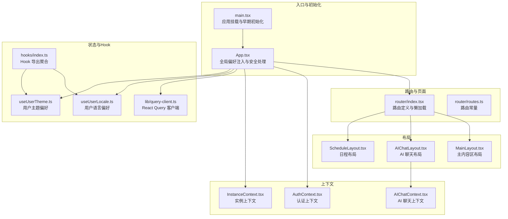
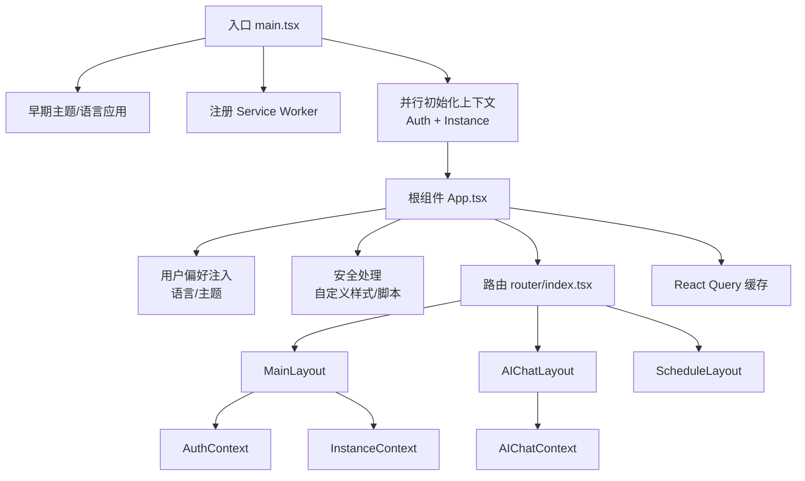
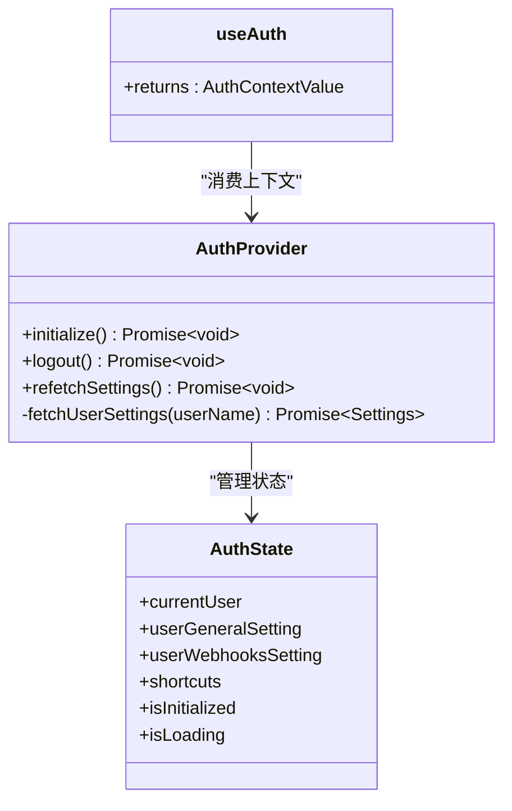
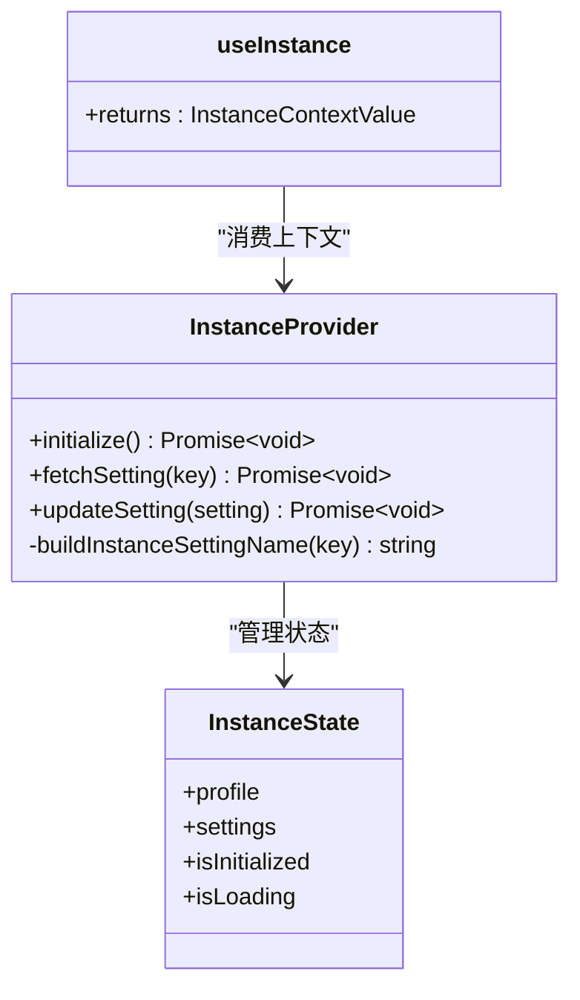
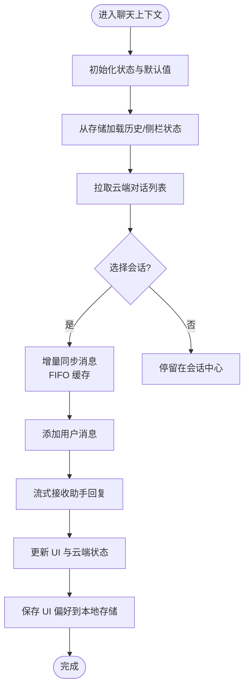
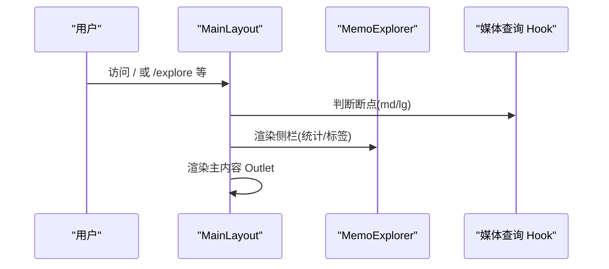
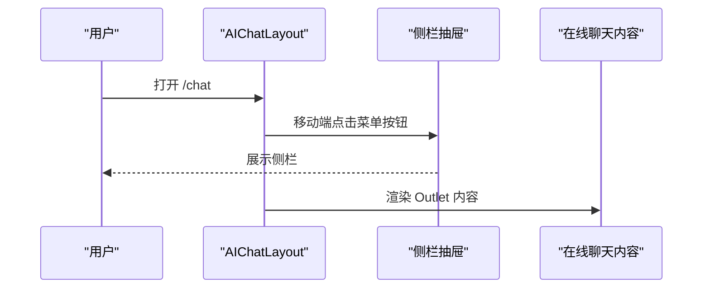
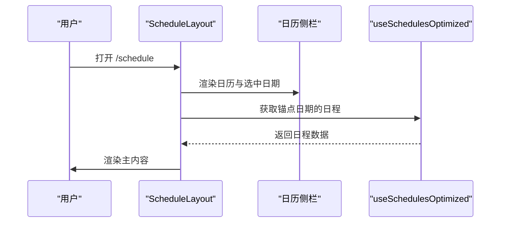
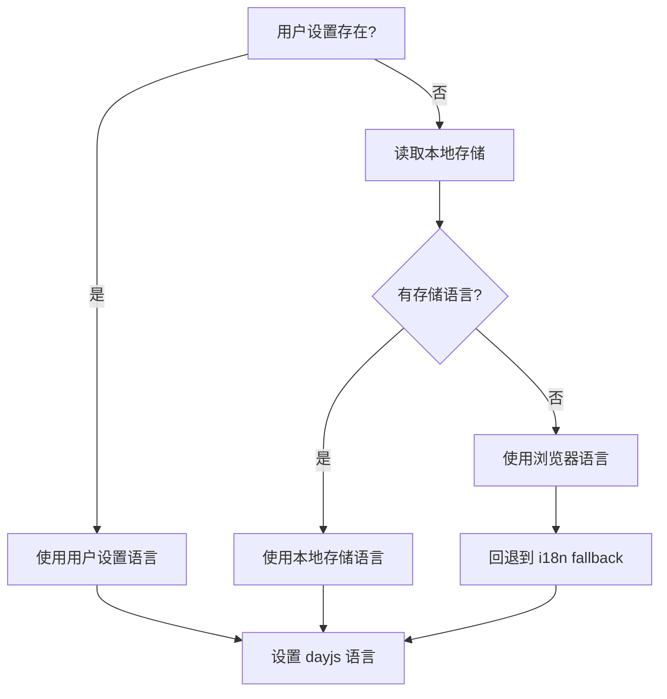
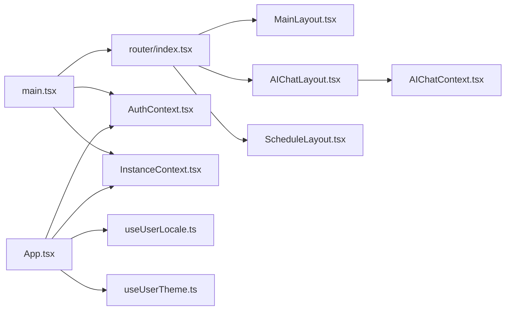

# 前端应用架构

<cite>
**本文引用的文件**   
- [web/src/main.tsx](file://web/src/main.tsx)
- [web/src/App.tsx](file://web/src/App.tsx)
- [web/src/router/index.tsx](file://web/src/router/index.tsx)
- [web/src/router/routes.ts](file://web/src/router/routes.ts)
- [web/src/layouts/MainLayout.tsx](file://web/src/layouts/MainLayout.tsx)
- [web/src/layouts/AIChatLayout.tsx](file://web/src/layouts/AIChatLayout.tsx)
- [web/src/layouts/ScheduleLayout.tsx](file://web/src/layouts/ScheduleLayout.tsx)
- [web/src/contexts/AuthContext.tsx](file://web/src/contexts/AuthContext.tsx)
- [web/src/contexts/InstanceContext.tsx](file://web/src/contexts/InstanceContext.tsx)
- [web/src/contexts/AIChatContext.tsx](file://web/src/contexts/AIChatContext.tsx)
- [web/src/hooks/index.ts](file://web/src/hooks/index.ts)
- [web/src/hooks/useUserLocale.ts](file://web/src/hooks/useUserLocale.ts)
- [web/src/hooks/useUserTheme.ts](file://web/src/hooks/useUserTheme.ts)
- [web/src/lib/query-client.ts](file://web/src/lib/query-client.ts)
- [web/src/utils/i18n.ts](file://web/src/utils/i18n.ts)
</cite>

## 目录
1. [简介](#简介)
2. [项目结构](#项目结构)
3. [核心组件](#核心组件)
4. [架构总览](#架构总览)
5. [组件与上下文详解](#组件与上下文详解)
6. [依赖关系分析](#依赖关系分析)
7. [性能考量](#性能考量)
8. [故障排查指南](#故障排查指南)
9. [结论](#结论)
10. [附录](#附录)

## 简介
本文件面向前端应用架构，系统性梳理 React 应用的整体设计：组件层次、状态管理、路由体系；深入解析上下文系统（认证、实例、AI 聊天）；阐述页面布局模式（主布局、AI 聊天布局、日程布局）；说明国际化、主题与响应式实现；总结组件库设计原则、Hook 使用模式与性能优化策略，并提供最佳实践与调试技巧。

## 项目结构
前端代码位于 web/src，采用“按功能域分层 + 按职责模块划分”的组织方式：
- 入口与根组件：main.tsx、App.tsx
- 路由与页面：router/index.tsx、router/routes.ts、pages/*
- 布局：layouts/*
- 上下文：contexts/*
- Hook：hooks/*
- 国际化与主题：utils/i18n.ts、themes/*
- 状态缓存：lib/query-client.ts
- 类型与工具：types/*、utils/*

**图表来源**
- [web/src/main.tsx](file://web/src/main.tsx#L1-L81)
- [web/src/App.tsx](file://web/src/App.tsx#L1-L92)
- [web/src/router/index.tsx](file://web/src/router/index.tsx#L1-L115)
- [web/src/router/routes.ts](file://web/src/router/routes.ts#L1-L16)
- [web/src/layouts/MainLayout.tsx](file://web/src/layouts/MainLayout.tsx#L1-L92)
- [web/src/layouts/AIChatLayout.tsx](file://web/src/layouts/AIChatLayout.tsx#L1-L85)
- [web/src/layouts/ScheduleLayout.tsx](file://web/src/layouts/ScheduleLayout.tsx#L1-L63)
- [web/src/contexts/AuthContext.tsx](file://web/src/contexts/AuthContext.tsx#L1-L157)
- [web/src/contexts/InstanceContext.tsx](file://web/src/contexts/InstanceContext.tsx#L1-L153)
- [web/src/contexts/AIChatContext.tsx](file://web/src/contexts/AIChatContext.tsx#L1-L862)
- [web/src/lib/query-client.ts](file://web/src/lib/query-client.ts#L1-L19)
- [web/src/hooks/index.ts](file://web/src/hooks/index.ts#L1-L13)
- [web/src/hooks/useUserLocale.ts](file://web/src/hooks/useUserLocale.ts#L1-L36)
- [web/src/hooks/useUserTheme.ts](file://web/src/hooks/useUserTheme.ts#L1-L38)

**章节来源**
- [web/src/main.tsx](file://web/src/main.tsx#L1-L81)
- [web/src/App.tsx](file://web/src/App.tsx#L1-L92)
- [web/src/router/index.tsx](file://web/src/router/index.tsx#L1-L115)
- [web/src/router/routes.ts](file://web/src/router/routes.ts#L1-L16)

## 核心组件
- 应用入口与初始化：在入口处进行主题与语言的“早期应用”，注册 Service Worker，并并行初始化认证与实例上下文，避免白屏与闪烁。
- 根组件 App：注入用户语言与主题偏好；清理过期 OAuth 状态；根据实例配置动态注入额外样式与脚本；动态更新页面标题与图标。
- 路由系统：基于 React Router v6 的嵌套路由，结合 Suspense 实现懒加载，提供统一的 LazyRoute 包装以减少重复代码。
- 布局系统：MainLayout、AIChatLayout、ScheduleLayout 分别承载主内容、AI 聊天与日程视图，均采用响应式设计与抽屉/侧栏交互。
- 上下文系统：AuthContext、InstanceContext、AIChatContext 提供跨层级数据共享与动作封装，配合 React Query 缓存提升性能。
- Hook 体系：集中导出，覆盖用户偏好、媒体查询、导航、筛选、排序、计划等场景。

**章节来源**
- [web/src/main.tsx](file://web/src/main.tsx#L22-L55)
- [web/src/App.tsx](file://web/src/App.tsx#L29-L89)
- [web/src/router/index.tsx](file://web/src/router/index.tsx#L38-L49)
- [web/src/layouts/MainLayout.tsx](file://web/src/layouts/MainLayout.tsx#L13-L89)
- [web/src/layouts/AIChatLayout.tsx](file://web/src/layouts/AIChatLayout.tsx#L24-L74)
- [web/src/layouts/ScheduleLayout.tsx](file://web/src/layouts/ScheduleLayout.tsx#L25-L59)
- [web/src/contexts/AuthContext.tsx](file://web/src/contexts/AuthContext.tsx#L26-L142)
- [web/src/contexts/InstanceContext.tsx](file://web/src/contexts/InstanceContext.tsx#L43-L144)
- [web/src/contexts/AIChatContext.tsx](file://web/src/contexts/AIChatContext.tsx#L109-L800)
- [web/src/hooks/index.ts](file://web/src/hooks/index.ts#L1-L13)

## 架构总览
应用采用“入口初始化 → 根组件注入 → 路由分发 → 布局承载 → 上下文驱动 → 组件消费”的分层架构。React Query 作为状态缓存层，贯穿数据获取、缓存与失效策略；国际化与主题通过 Hook 与早期应用机制实现无闪烁切换。

**图表来源**
- [web/src/main.tsx](file://web/src/main.tsx#L22-L55)
- [web/src/App.tsx](file://web/src/App.tsx#L34-L82)
- [web/src/router/index.tsx](file://web/src/router/index.tsx#L51-L112)
- [web/src/layouts/MainLayout.tsx](file://web/src/layouts/MainLayout.tsx#L13-L89)
- [web/src/layouts/AIChatLayout.tsx](file://web/src/layouts/AIChatLayout.tsx#L76-L82)
- [web/src/layouts/ScheduleLayout.tsx](file://web/src/layouts/ScheduleLayout.tsx#L25-L59)
- [web/src/contexts/AuthContext.tsx](file://web/src/contexts/AuthContext.tsx#L26-L142)
- [web/src/contexts/InstanceContext.tsx](file://web/src/contexts/InstanceContext.tsx#L43-L144)
- [web/src/contexts/AIChatContext.tsx](file://web/src/contexts/AIChatContext.tsx#L109-L800)
- [web/src/lib/query-client.ts](file://web/src/lib/query-client.ts#L3-L18)

## 组件与上下文详解

### 认证上下文（AuthContext）
- 职责：维护当前用户、用户设置、快捷键列表；提供初始化、登出、刷新设置能力；预填充 React Query 缓存。
- 关键点：并发初始化用户设置与快捷键；错误时清理令牌并清空缓存；提供便捷 Hook useCurrentUserFromAuth。
- 性能：使用 useMemo 缓存上下文值，避免消费者不必要重渲染。

**图表来源**
- [web/src/contexts/AuthContext.tsx](file://web/src/contexts/AuthContext.tsx#L26-L142)

**章节来源**
- [web/src/contexts/AuthContext.tsx](file://web/src/contexts/AuthContext.tsx#L1-L157)

### 实例上下文（InstanceContext）
- 职责：维护实例配置（实例资料、通用设置、存储设置），提供初始化、获取单项设置、更新设置。
- 关键点：派生设置（general/memo/storage）通过 useMemo 防止重复计算；更新后同步到全局配置对象。
- 性能：仅在 settings 变更时重建派生设置，降低渲染成本。

**图表来源**
- [web/src/contexts/InstanceContext.tsx](file://web/src/contexts/InstanceContext.tsx#L43-L144)

**章节来源**
- [web/src/contexts/InstanceContext.tsx](file://web/src/contexts/InstanceContext.tsx#L1-L153)

### AI 聊天上下文（AIChatContext）
- 职责：管理对话列表、当前会话、侧栏状态、视图模式、能力状态；提供消息增删改、上下文分隔、增量同步、标题本地化、持久化等。
- 关键点：消息 FIFO 缓存限制、增量同步与全量回退、标题语义化生成、云存储迁移与本地持久化共存。
- 性能：合并消息时去重 UID、仅在需要时刷新；UI 动作与能力状态独立管理。

**图表来源**
- [web/src/contexts/AIChatContext.tsx](file://web/src/contexts/AIChatContext.tsx#L109-L800)

**章节来源**
- [web/src/contexts/AIChatContext.tsx](file://web/src/contexts/AIChatContext.tsx#L1-L862)

### 主布局（MainLayout）
- 职责：根据路由上下文（首页、探索、归档、个人主页）决定统计与标签数据源；移动端抽屉、桌面侧栏与主内容区域协调。
- 关键点：移动端仅在非根路径显示头部；桌面端固定侧栏宽度随容器尺寸变化；根据上下文动态获取用户名并请求用户信息。

**图表来源**
- [web/src/layouts/MainLayout.tsx](file://web/src/layouts/MainLayout.tsx#L13-L89)

**章节来源**
- [web/src/layouts/MainLayout.tsx](file://web/src/layouts/MainLayout.tsx#L1-L92)

### AI 聊天布局（AIChatLayout）
- 职责：为 AI 聊天页提供统一的侧栏与主内容区域；移动端抽屉打开侧栏，桌面端固定侧栏；统一助手图标与标题。
- 关键点：移动端顶部导航抽屉、右侧抽屉侧栏；桌面端固定侧栏宽度；与 AIChatProvider 协同管理聊天状态。

**图表来源**
- [web/src/layouts/AIChatLayout.tsx](file://web/src/layouts/AIChatLayout.tsx#L24-L74)

**章节来源**
- [web/src/layouts/AIChatLayout.tsx](file://web/src/layouts/AIChatLayout.tsx#L1-L85)

### 日程布局（ScheduleLayout）
- 职责：提供日程侧栏与搜索栏；移动端顶部搜索，桌面端固定侧栏；根据选中日期锚定日程查询。
- 关键点：侧栏展示日历与选中日期联动；主内容区域渲染路由页面；优化日程查询钩子以减少请求。

**图表来源**
- [web/src/layouts/ScheduleLayout.tsx](file://web/src/layouts/ScheduleLayout.tsx#L25-L59)

**章节来源**
- [web/src/layouts/ScheduleLayout.tsx](file://web/src/layouts/ScheduleLayout.tsx#L1-L63)

### 国际化与主题系统
- 国际化：优先级为用户设置 → 本地存储 → 浏览器语言；支持早应用以避免语言闪烁；提供类型化翻译函数与显示名查询。
- 主题：优先级为用户设置 → 本地存储 → 系统偏好；监听系统主题变化（当主题设为“系统”时）；早应用确保首次渲染一致。

**图表来源**
- [web/src/utils/i18n.ts](file://web/src/utils/i18n.ts#L78-L114)
- [web/src/hooks/useUserLocale.ts](file://web/src/hooks/useUserLocale.ts#L10-L35)
- [web/src/hooks/useUserTheme.ts](file://web/src/hooks/useUserTheme.ts#L9-L37)

**章节来源**
- [web/src/utils/i18n.ts](file://web/src/utils/i18n.ts#L1-L138)
- [web/src/hooks/useUserLocale.ts](file://web/src/hooks/useUserLocale.ts#L1-L36)
- [web/src/hooks/useUserTheme.ts](file://web/src/hooks/useUserTheme.ts#L1-L38)

### 响应式设计与布局模式
- 断点策略：通过媒体查询 Hook 判断 md/lg，在不同断点下切换侧栏固定宽度与抽屉行为。
- 布局模式：主布局采用“侧栏 + 主内容”两列结构；AI 聊天布局强调侧栏与移动端抽屉；日程布局以日历侧栏为主。

**章节来源**
- [web/src/layouts/MainLayout.tsx](file://web/src/layouts/MainLayout.tsx#L14-L15)
- [web/src/layouts/AIChatLayout.tsx](file://web/src/layouts/AIChatLayout.tsx#L25-L26)
- [web/src/layouts/ScheduleLayout.tsx](file://web/src/layouts/ScheduleLayout.tsx#L26-L27)

### 组件库与 Hook 设计原则
- 组件库：统一使用 UI 组件（如 Sheet、Button、NavigationDrawer），保证一致性与可维护性。
- Hook 设计：集中导出，职责单一；用户偏好 Hook 仅负责应用与监听；路由与查询相关 Hook 专注数据获取与缓存。

**章节来源**
- [web/src/hooks/index.ts](file://web/src/hooks/index.ts#L1-L13)
- [web/src/layouts/AIChatLayout.tsx](file://web/src/layouts/AIChatLayout.tsx#L4-L8)
- [web/src/layouts/ScheduleLayout.tsx](file://web/src/layouts/ScheduleLayout.tsx#L3-L5)

## 依赖关系分析
- 入口依赖：main.tsx 依赖上下文、路由、国际化与主题工具、React Query Provider、ErrorBoundary。
- 根组件依赖：App.tsx 依赖实例上下文、用户偏好 Hook、导航 Hook、安全脚本注入。
- 路由依赖：router/index.tsx 依赖布局、页面懒加载、路由常量；与上下文耦合体现在布局与页面所需的数据。
- 上下文依赖：AuthContext 与 InstanceContext 依赖服务客户端与 React Query；AIChatContext 依赖 AI 服务客户端与本地存储。
- Hook 依赖：useUserLocale 与 useUserTheme 依赖 AuthContext；useSchedulesOptimized 依赖 Schedule 查询 Hook。

**图表来源**
- [web/src/main.tsx](file://web/src/main.tsx#L11-L14)
- [web/src/App.tsx](file://web/src/App.tsx#L3-L8)
- [web/src/router/index.tsx](file://web/src/router/index.tsx#L8-L12)
- [web/src/layouts/MainLayout.tsx](file://web/src/layouts/MainLayout.tsx#L1-L12)
- [web/src/layouts/AIChatLayout.tsx](file://web/src/layouts/AIChatLayout.tsx#L1-L11)
- [web/src/layouts/ScheduleLayout.tsx](file://web/src/layouts/ScheduleLayout.tsx#L1-L8)
- [web/src/contexts/AuthContext.tsx](file://web/src/contexts/AuthContext.tsx#L1-L8)
- [web/src/contexts/InstanceContext.tsx](file://web/src/contexts/InstanceContext.tsx#L1-L16)
- [web/src/contexts/AIChatContext.tsx](file://web/src/contexts/AIChatContext.tsx#L1-L18)
- [web/src/hooks/useUserLocale.ts](file://web/src/hooks/useUserLocale.ts#L1-L4)
- [web/src/hooks/useUserTheme.ts](file://web/src/hooks/useUserTheme.ts#L1-L4)

**章节来源**
- [web/src/main.tsx](file://web/src/main.tsx#L1-L81)
- [web/src/App.tsx](file://web/src/App.tsx#L1-L92)
- [web/src/router/index.tsx](file://web/src/router/index.tsx#L1-L115)

## 性能考量
- 并行初始化：入口处并行初始化认证与实例上下文，缩短首屏等待时间。
- React Query 默认策略：合理的 staleTime、gcTime、refetchOnWindowFocus 与 refetchOnReconnect，平衡新鲜度与网络消耗。
- 懒加载与 Suspense：路由懒加载与统一 LazyRoute 包装，减少初始包体积与首屏阻塞。
- 上下文缓存：useMemo 缓存派生设置与上下文值，避免不必要的重渲染。
- AI 聊天消息 FIFO：限制消息数量，避免内存膨胀；增量同步与去重 UID，提升滚动与渲染性能。
- 响应式布局：断点切换时仅重排布局结构，不触发深层组件重渲染。

**章节来源**
- [web/src/main.tsx](file://web/src/main.tsx#L36-L44)
- [web/src/lib/query-client.ts](file://web/src/lib/query-client.ts#L3-L18)
- [web/src/router/index.tsx](file://web/src/router/index.tsx#L38-L49)
- [web/src/contexts/InstanceContext.tsx](file://web/src/contexts/InstanceContext.tsx#L51-L74)
- [web/src/contexts/AIChatContext.tsx](file://web/src/contexts/AIChatContext.tsx#L84-L107)

## 故障排查指南
- 语言闪烁：确认已调用早期应用逻辑；检查用户设置是否为空导致回退到浏览器语言。
- 主题未生效：确认用户设置中的主题值；若为“系统”，检查系统主题监听是否正确注册。
- 登录后空白页：检查 AuthContext 初始化流程与令牌清理；确认 React Query 缓存是否被清空。
- 聊天消息不更新：检查增量同步 lastMessageUid 与 hasMore 标志；确认消息 UID 去重逻辑。
- 路由懒加载失败：检查 lazy 导入路径与 Suspense 包装；确认打包配置与路由常量一致。
- 自定义样式/脚本注入异常：确认 App 中的安全校验与注入时机；生产环境建议增加 CSP 限制。

**章节来源**
- [web/src/utils/i18n.ts](file://web/src/utils/i18n.ts#L120-L124)
- [web/src/hooks/useUserTheme.ts](file://web/src/hooks/useUserTheme.ts#L21-L36)
- [web/src/contexts/AuthContext.tsx](file://web/src/contexts/AuthContext.tsx#L97-L114)
- [web/src/contexts/AIChatContext.tsx](file://web/src/contexts/AIChatContext.tsx#L605-L655)
- [web/src/router/index.tsx](file://web/src/router/index.tsx#L38-L49)
- [web/src/App.tsx](file://web/src/App.tsx#L50-L71)

## 结论
该前端应用以清晰的分层架构与上下文系统为核心，结合 React Router 的嵌套路由与布局模式，实现了主内容、AI 聊天与日程三大场景的一致体验。通过 React Query 的缓存策略、Hook 的偏好注入与国际化/主题的早应用机制，兼顾了性能与可用性。AI 聊天上下文在消息缓存、增量同步与标题本地化方面提供了稳健的实现范式，适合在复杂交互场景中复用。

## 附录
- 最佳实践
  - 在入口处尽早应用主题与语言，避免闪烁。
  - 使用 React Query 的默认策略并按需覆盖 staleTime。
  - 将上下文值通过 useMemo 缓存，减少重渲染。
  - 懒加载与 Suspense 统一封装，保持路由简洁。
  - Hook 聚合导出，便于按需引入与测试。
- 调试技巧
  - 使用 React DevTools Profiler 观察重渲染热点。
  - 在 AI 聊天中打印 lastMessageUid 与 hasMore，定位增量同步问题。
  - 在国际化场景中，逐步检查用户设置、本地存储与浏览器语言回退链路。