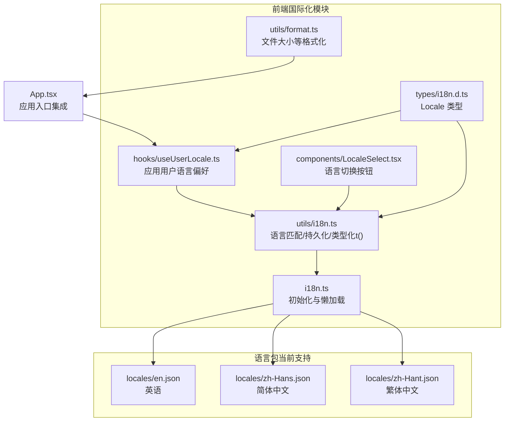
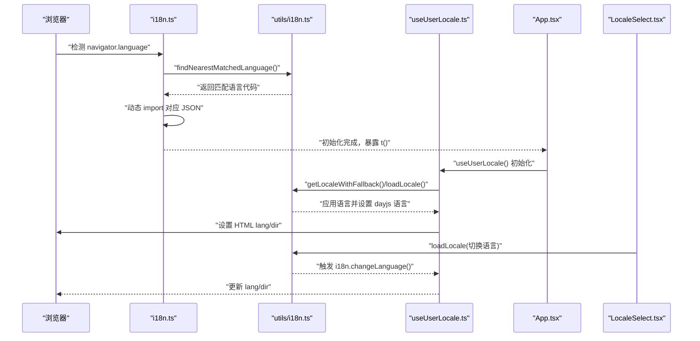
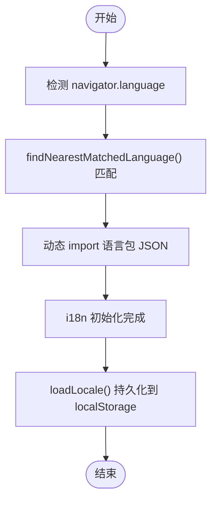
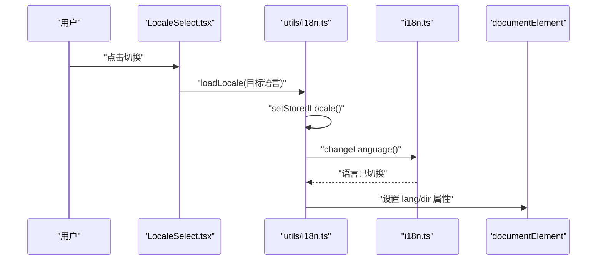
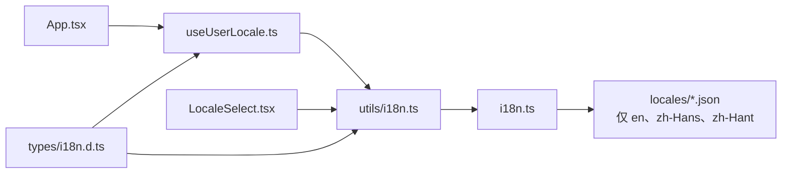

# 国际化与本地化

<cite>
**本文引用的文件**
- [web/src/i18n.ts](file://web/src/i18n.ts)
- [web/src/utils/i18n.ts](file://web/src/utils/i18n.ts)
- [web/src/hooks/useUserLocale.ts](file://web/src/hooks/useUserLocale.ts)
- [web/src/components/LocaleSelect.tsx](file://web/src/components/LocaleSelect.tsx)
- [web/src/locales/en.json](file://web/src/locales/en.json)
- [web/src/locales/zh-Hans.json](file://web/src/locales/zh-Hans.json)
- [web/src/locales/zh-Hant.json](file://web/src/locales/zh-Hant.json)
- [scripts/check-i18n.sh](file://scripts/check-i18n.sh)
- [scripts/check-i18n-hardcode.sh](file://scripts/check-i18n-hardcode.sh)
- [web/src/App.tsx](file://web/src/App.tsx)
- [web/src/utils/format.ts](file://web/src/utils/format.ts)
- [web/src/types/i18n.d.ts](file://web/src/types/i18n.d.ts)
</cite>

## 更新摘要
**所做更改**
- 更新了语言支持范围：从原来的 28 种语言精简为 3 种语言（英语、简体中文、繁体中文）
- 删除了大量历史语言包文件（阿拉伯语、波斯语等 24 种语言）
- 更新了架构图和组件分析以反映当前的简化支持
- 调整了质量保障脚本的检查范围
- 更新了多语言开发示例以符合当前支持的语言

## 目录
1. [引言](#引言)
2. [项目结构](#项目结构)
3. [核心组件](#核心组件)
4. [架构总览](#架构总览)
5. [详细组件分析](#详细组件分析)
6. [依赖分析](#依赖分析)
7. [性能考量](#性能考量)
8. [故障排查指南](#故障排查指南)
9. [结论](#结论)
10. [附录](#附录)

## 引言
本文件系统性梳理本项目的国际化与本地化实现，涵盖语言包管理、动态语言切换、文本翻译机制、日期与数字格式化、货币显示、RTL（从右到左）语言支持与布局适配、文本提取与翻译工作流、翻译质量保障策略，以及本地化测试方法与实践示例。目标是帮助开发者与产品团队快速理解并高效维护多语言能力。

**重要更新**：当前系统已从原有的 28 种语言支持精简为专注于英语、简体中文和繁体中文三种语言，移除了约 10,000 行历史翻译内容，实现了更聚焦和高效的本地化支持。

## 项目结构
前端国际化相关的核心目录与文件如下：
- 国际化初始化与懒加载：web/src/i18n.ts
- 语言匹配与持久化逻辑：web/src/utils/i18n.ts
- 用户语言偏好钩子：web/src/hooks/useUserLocale.ts
- 语言切换组件：web/src/components/LocaleSelect.tsx
- 语言包：web/src/locales/*.json（仅包含 en、zh-Hans、zh-Hant 三种语言）
- 质量保障脚本：scripts/check-i18n.sh、scripts/check-i18n-hardcode.sh
- 应用入口集成：web/src/App.tsx
- 通用格式化工具：web/src/utils/format.ts
- 类型声明：web/src/types/i18n.d.ts

**图表来源**
- [web/src/i18n.ts](file://web/src/i18n.ts#L1-L42)
- [web/src/utils/i18n.ts](file://web/src/utils/i18n.ts#L1-L138)
- [web/src/hooks/useUserLocale.ts](file://web/src/hooks/useUserLocale.ts#L1-L36)
- [web/src/components/LocaleSelect.tsx](file://web/src/components/LocaleSelect.tsx#L1-L29)
- [web/src/locales/en.json](file://web/src/locales/en.json#L1-L200)
- [web/src/locales/zh-Hans.json](file://web/src/locales/zh-Hans.json#L1-L200)
- [web/src/locales/zh-Hant.json](file://web/src/locales/zh-Hant.json#L1-L200)
- [web/src/App.tsx](file://web/src/App.tsx#L1-L92)
- [web/src/utils/format.ts](file://web/src/utils/format.ts#L1-L76)
- [web/src/types/i18n.d.ts](file://web/src/types/i18n.d.ts#L1-L2)

**章节来源**
- [web/src/i18n.ts](file://web/src/i18n.ts#L1-L42)
- [web/src/utils/i18n.ts](file://web/src/utils/i18n.ts#L1-L138)
- [web/src/hooks/useUserLocale.ts](file://web/src/hooks/useUserLocale.ts#L1-L36)
- [web/src/components/LocaleSelect.tsx](file://web/src/components/LocaleSelect.tsx#L1-L29)
- [web/src/locales/en.json](file://web/src/locales/en.json#L1-L200)
- [web/src/locales/zh-Hans.json](file://web/src/locales/zh-Hans.json#L1-L200)
- [web/src/locales/zh-Hant.json](file://web/src/locales/zh-Hant.json#L1-L200)
- [web/src/App.tsx](file://web/src/App.tsx#L1-L92)
- [web/src/utils/format.ts](file://web/src/utils/format.ts#L1-L76)
- [web/src/types/i18n.d.ts](file://web/src/types/i18n.d.ts#L1-L2)

## 核心组件
- 国际化初始化与懒加载：通过 i18next 与自定义 Backend 插件实现按需加载语言包，支持浏览器语言检测与回退策略。
- 语言匹配与持久化：提供 findNearestMatchedLanguage、getLocaleWithFallback、loadLocale 等函数，确保优先级与一致性。
- 用户语言偏好钩子：useUserLocale 在用户设置变化时自动应用语言，并同步 HTML lang 与 dir 属性。
- 语言切换组件：LocaleSelect 提供简单切换 UI，调用 loadLocale 实现即时切换。
- 语言包：locales 目录仅包含三种核心语言 JSON 文件，覆盖界面文案、消息、设置项等。
- 质量保障脚本：check-i18n.sh 校验 key 同步，check-i18n-hardcode.sh 检测硬编码文本。
- 应用入口集成：App.tsx 在启动时应用用户语言与主题偏好。
- 通用格式化：format.ts 提供文件大小等格式化工具，便于本地化场景下的数值展示。

**章节来源**
- [web/src/i18n.ts](file://web/src/i18n.ts#L1-L42)
- [web/src/utils/i18n.ts](file://web/src/utils/i18n.ts#L1-L138)
- [web/src/hooks/useUserLocale.ts](file://web/src/hooks/useUserLocale.ts#L1-L36)
- [web/src/components/LocaleSelect.tsx](file://web/src/components/LocaleSelect.tsx#L1-L29)
- [scripts/check-i18n.sh](file://scripts/check-i18n.sh#L1-L98)
- [scripts/check-i18n-hardcode.sh](file://scripts/check-i18n-hardcode.sh#L1-L57)
- [web/src/App.tsx](file://web/src/App.tsx#L1-L92)
- [web/src/utils/format.ts](file://web/src/utils/format.ts#L1-L76)

## 架构总览
整体流程：浏览器语言检测 → 语言匹配与回退 → 懒加载对应语言包 → 应用语言与 HTML lang/dir → 用户偏好变更时动态切换。

**图表来源**
- [web/src/i18n.ts](file://web/src/i18n.ts#L1-L42)
- [web/src/utils/i18n.ts](file://web/src/utils/i18n.ts#L1-L138)
- [web/src/hooks/useUserLocale.ts](file://web/src/hooks/useUserLocale.ts#L1-L36)
- [web/src/App.tsx](file://web/src/App.tsx#L1-L92)
- [web/src/components/LocaleSelect.tsx](file://web/src/components/LocaleSelect.tsx#L1-L29)

## 详细组件分析

### 语言包管理与懒加载
- 初始化：i18n.ts 注册自定义 Backend 插件，按需 import 对应语言 JSON；设置浏览器语言检测与回退策略。
- 语言匹配：utils/i18n.ts 的 findNearestMatchedLanguage 支持完整语言代码、简码、以及 zh 的回退链。
- 类型化翻译函数：通过 Translations 与 useTranslate 返回强类型 t(key)。
- 本地存储：loadLocale 前先 setStoredLocale，避免刷新丢失。

**图表来源**
- [web/src/i18n.ts](file://web/src/i18n.ts#L1-L42)
- [web/src/utils/i18n.ts](file://web/src/utils/i18n.ts#L1-L138)

**章节来源**
- [web/src/i18n.ts](file://web/src/i18n.ts#L1-L42)
- [web/src/utils/i18n.ts](file://web/src/utils/i18n.ts#L1-L138)

### 动态语言切换与用户偏好
- 优先级：用户设置（登录后）→ localStorage（上次会话）→ 浏览器语言 → 回退至 en。
- 切换实现：loadLocale 更新 i18n 语言并设置 dayjs 语言；useUserLocale 同步 HTML lang 与 dir。
- 组件交互：LocaleSelect 点击切换语言并回调父组件。

**图表来源**
- [web/src/components/LocaleSelect.tsx](file://web/src/components/LocaleSelect.tsx#L1-L29)
- [web/src/utils/i18n.ts](file://web/src/utils/i18n.ts#L1-L138)
- [web/src/hooks/useUserLocale.ts](file://web/src/hooks/useUserLocale.ts#L1-L36)

**章节来源**
- [web/src/components/LocaleSelect.tsx](file://web/src/components/LocaleSelect.tsx#L1-L29)
- [web/src/utils/i18n.ts](file://web/src/utils/i18n.ts#L1-L138)
- [web/src/hooks/useUserLocale.ts](file://web/src/hooks/useUserLocale.ts#L1-L36)

### 文本翻译机制与类型安全
- 类型化 t：通过 Translations 与 useTranslate 返回强类型翻译函数，减少拼写错误与遗漏。
- 参数化文案：语言包中大量使用占位符（如 {{xxx}}），配合 t(key, params) 渲染。
- 语言包结构：按功能域分层（common、auth、setting、memo、ai 等），便于维护与扩展。
- 当前支持的语言：英语（en.json）、简体中文（zh-Hans.json）、繁体中文（zh-Hant.json）。

**章节来源**
- [web/src/utils/i18n.ts](file://web/src/utils/i18n.ts#L1-L138)
- [web/src/locales/en.json](file://web/src/locales/en.json#L1-L200)
- [web/src/locales/zh-Hans.json](file://web/src/locales/zh-Hans.json#L1-L200)
- [web/src/locales/zh-Hant.json](file://web/src/locales/zh-Hant.json#L1-L200)

### 日期格式化、数字格式化与货币显示
- 日期：i18n.ts 中通过 dayjs 设置语言；utils/i18n.ts 的 loadLocale 根据语言切换 dayjs 语言。
- 数字/文件大小：utils/format.ts 提供 formatFileSize 等通用格式化函数，适合在本地化场景中统一展示单位与精度。
- 货币：当前仓库未见专门的货币格式化实现，建议在需要时引入 Intl.NumberFormat 并结合语言环境进行本地化。

**章节来源**
- [web/src/i18n.ts](file://web/src/i18n.ts#L1-L42)
- [web/src/utils/i18n.ts](file://web/src/utils/i18n.ts#L1-L138)
- [web/src/utils/format.ts](file://web/src/utils/format.ts#L1-L76)

### RTL（从右到左）语言支持与布局适配
- 自动检测：useUserLocale.ts 在语言变化时设置 HTML lang 与 dir 属性；对 ar、fa 等 RTL 语言设置 dir="rtl"，其余设置为 ltr。
- 建议：在样式层面配合 dir 属性进行布局适配（如 margin/padding 方向、浮动方向等），确保 UI 正确渲染。

**章节来源**
- [web/src/hooks/useUserLocale.ts](file://web/src/hooks/useUserLocale.ts#L1-L36)

### 文本提取、翻译工作流与质量保证
- 文本提取：建议在新增文案时统一通过 t() 调用，避免硬编码。
- 翻译工作流：
  - 新增/修改语言包：在 locales/*.json 中补充缺失 key。
  - 同步校验：运行 scripts/check-i18n.sh 对比 en.json 与 zh-Hans.json 的 key 完整性。
  - 硬编码检查：运行 scripts/check-i18n-hardcode.sh 检测未使用 t() 的硬编码文本。
- 质量保障：
  - 保持 key 结构一致，避免深层嵌套过度。
  - 使用占位符参数化可变内容，便于不同语言的灵活组合。
  - 为 RTL 语言准备独立的样式适配方案。

**章节来源**
- [scripts/check-i18n.sh](file://scripts/check-i18n.sh#L1-L98)
- [scripts/check-i18n-hardcode.sh](file://scripts/check-i18n-hardcode.sh#L1-L57)

### 多语言开发示例与最佳实践
- 示例一：在组件中使用类型化翻译
  - 路径参考：[web/src/utils/i18n.ts](file://web/src/utils/i18n.ts#L68-L71)
  - 说明：通过 useTranslate 获取强类型 t，传入 key 与 params 进行渲染。
- 示例二：切换语言
  - 路径参考：[web/src/components/LocaleSelect.tsx](file://web/src/components/LocaleSelect.tsx#L14-L18)
  - 说明：点击按钮调用 loadLocale 切换语言并回调父组件。
- 示例三：应用用户语言偏好
  - 路径参考：[web/src/hooks/useUserLocale.ts](file://web/src/hooks/useUserLocale.ts#L14-L21)
  - 说明：监听用户设置变化，优先应用用户设置的语言。
- 示例四：初始化与懒加载
  - 路径参考：[web/src/i18n.ts](file://web/src/i18n.ts#L12-L25)
  - 说明：自定义 Backend 插件按需加载语言包，提升首屏性能。
- 示例五：HTML lang/dir 同步
  - 路径参考：[web/src/hooks/useUserLocale.ts](file://web/src/hooks/useUserLocale.ts#L23-L34)
  - 说明：语言切换时同步更新 HTML lang 与 dir 属性。

**章节来源**
- [web/src/utils/i18n.ts](file://web/src/utils/i18n.ts#L68-L71)
- [web/src/components/LocaleSelect.tsx](file://web/src/components/LocaleSelect.tsx#L14-L18)
- [web/src/hooks/useUserLocale.ts](file://web/src/hooks/useUserLocale.ts#L14-L21)
- [web/src/i18n.ts](file://web/src/i18n.ts#L12-L25)
- [web/src/hooks/useUserLocale.ts](file://web/src/hooks/useUserLocale.ts#L23-L34)

## 依赖分析
- 组件耦合：
  - App.tsx 依赖 useUserLocale.ts 应用语言与主题偏好。
  - LocaleSelect.tsx 依赖 utils/i18n.ts 的 loadLocale 实现切换。
  - i18n.ts 依赖 utils/i18n.ts 的语言匹配逻辑与类型声明。
- 外部依赖：
  - i18next 与 react-i18next：核心国际化框架。
  - dayjs：本地化日期处理（随语言切换）。
- 潜在风险：
  - 语言包缺失 key：通过 check-i18n.sh 预防。
  - 硬编码文本：通过 check-i18n-hardcode.sh 预防。
  - RTL 布局：需在样式层配合 dir 属性适配。

**图表来源**
- [web/src/App.tsx](file://web/src/App.tsx#L1-L92)
- [web/src/hooks/useUserLocale.ts](file://web/src/hooks/useUserLocale.ts#L1-L36)
- [web/src/utils/i18n.ts](file://web/src/utils/i18n.ts#L1-L138)
- [web/src/i18n.ts](file://web/src/i18n.ts#L1-L42)
- [web/src/components/LocaleSelect.tsx](file://web/src/components/LocaleSelect.tsx#L1-L29)
- [web/src/types/i18n.d.ts](file://web/src/types/i18n.d.ts#L1-L2)

**章节来源**
- [web/src/App.tsx](file://web/src/App.tsx#L1-L92)
- [web/src/hooks/useUserLocale.ts](file://web/src/hooks/useUserLocale.ts#L1-L36)
- [web/src/utils/i18n.ts](file://web/src/utils/i18n.ts#L1-L138)
- [web/src/i18n.ts](file://web/src/i18n.ts#L1-L42)
- [web/src/components/LocaleSelect.tsx](file://web/src/components/LocaleSelect.tsx#L1-L29)
- [web/src/types/i18n.d.ts](file://web/src/types/i18n.d.ts#L1-L2)

## 性能考量
- 懒加载语言包：仅加载当前语言包，降低初始包体积与首屏加载时间。
- 语言匹配缓存：localStorage 存储用户选择，避免每次刷新重新检测。
- 语言切换最小化：仅在必要时调用 changeLanguage，避免频繁重渲染。
- 建议：对高频切换场景可考虑预加载常用语言包，进一步优化体验。

## 故障排查指南
- 语言未生效或闪烁：
  - 检查 i18n.ts 的 detection 与 fallback 配置。
  - 确认 utils/i18n.ts 的 loadLocale 是否正确设置 localStorage 与 dayjs 语言。
  - 确保 useUserLocale.ts 在 App.tsx 中被调用。
- key 缺失或拼写错误：
  - 运行 scripts/check-i18n.sh 校验 key 同步。
  - 使用 scripts/check-i18n-hardcode.sh 检测硬编码文本。
- RTL 布局异常：
  - 确认 useUserLocale.ts 的 dir 设置逻辑。
  - 在样式层检查基于 dir 的布局适配。
- 语言包问题：
  - 确认 locales 目录中存在 en.json、zh-Hans.json、zh-Hant.json 文件。
  - 检查语言包中的键值是否完整且格式正确。

**章节来源**
- [web/src/i18n.ts](file://web/src/i18n.ts#L1-L42)
- [web/src/utils/i18n.ts](file://web/src/utils/i18n.ts#L1-L138)
- [web/src/hooks/useUserLocale.ts](file://web/src/hooks/useUserLocale.ts#L1-L36)
- [scripts/check-i18n.sh](file://scripts/check-i18n.sh#L1-L98)
- [scripts/check-i18n-hardcode.sh](file://scripts/check-i18n-hardcode.sh#L1-L57)

## 结论
本项目采用 i18next + 自定义懒加载后端的架构，结合用户偏好与浏览器语言检测，实现了稳定高效的多语言支持。通过类型化翻译、RTL 自动适配、完善的质量保障脚本与清晰的开发示例，能够有效支撑多语言产品的持续演进与高质量交付。当前系统专注于英语、简体中文和繁体中文三种核心语言，移除了大量历史语言支持，实现了更聚焦和高效的本地化解决方案。

## 附录
- 语言包示例路径：
  - 英语：[web/src/locales/en.json](file://web/src/locales/en.json#L1-L200)
  - 简体中文：[web/src/locales/zh-Hans.json](file://web/src/locales/zh-Hans.json#L1-L200)
  - 繁体中文：[web/src/locales/zh-Hant.json](file://web/src/locales/zh-Hant.json#L1-L200)
- 质量保障脚本：
  - 同步校验：[scripts/check-i18n.sh](file://scripts/check-i18n.sh#L1-L98)
  - 硬编码检测：[scripts/check-i18n-hardcode.sh](file://scripts/check-i18n-hardcode.sh#L1-L57)
- 类型声明：
  - Locale 类型：[web/src/types/i18n.d.ts](file://web/src/types/i18n.d.ts#L1-L2)