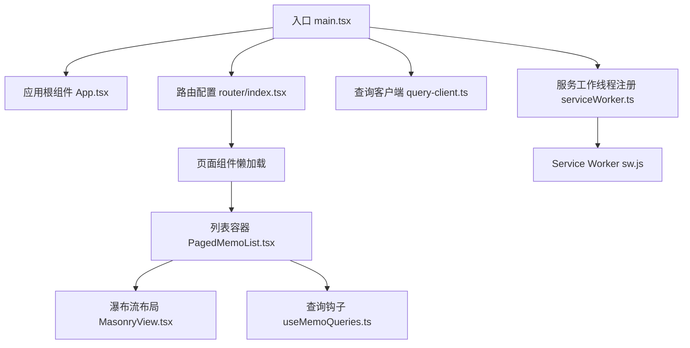
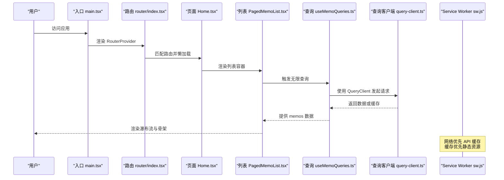
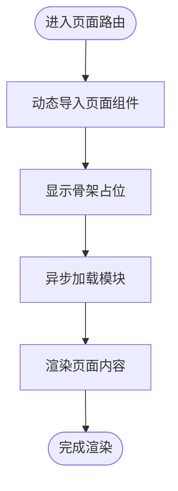
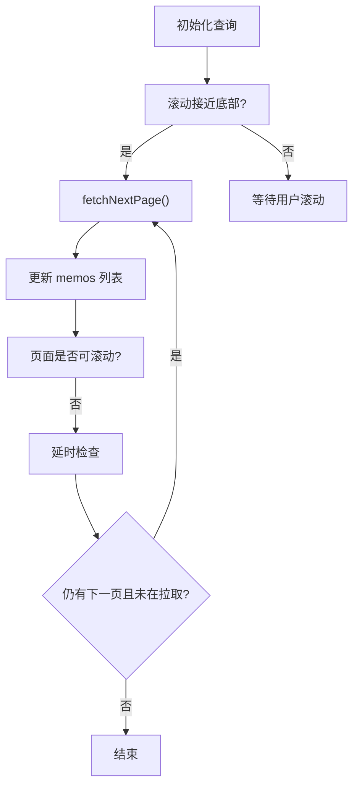
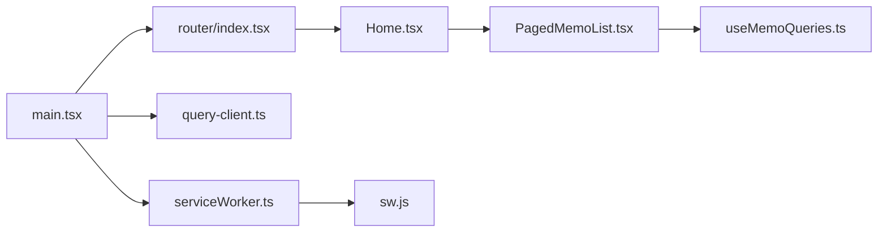

# 性能优化策略

<cite>
**本文引用的文件**
- [web/src/main.tsx](file://web/src/main.tsx)
- [web/src/App.tsx](file://web/src/App.tsx)
- [web/src/router/index.tsx](file://web/src/router/index.tsx)
- [web/vite.config.mts](file://web/vite.config.mts)
- [web/package.json](file://web/package.json)
- [web/src/components/ErrorBoundary.tsx](file://web/src/components/ErrorBoundary.tsx)
- [web/src/lib/query-client.ts](file://web/src/lib/query-client.ts)
- [web/src/utils/serviceWorker.ts](file://web/src/utils/serviceWorker.ts)
- [web/public/sw.js](file://web/public/sw.js)
- [web/src/components/PagedMemoList/PagedMemoList.tsx](file://web/src/components/PagedMemoList/PagedMemoList.tsx)
- [web/src/components/MasonryView/MasonryView.tsx](file://web/src/components/MasonryView/MasonryView.tsx)
- [web/src/hooks/useMemoQueries.ts](file://web/src/hooks/useMemoQueries.ts)
- [web/src/pages/Home.tsx](file://web/src/pages/Home.tsx)
</cite>

## 目录
1. [引言](#引言)
2. [项目结构](#项目结构)
3. [核心组件](#核心组件)
4. [架构总览](#架构总览)
5. [详细组件分析](#详细组件分析)
6. [依赖分析](#依赖分析)
7. [性能考量](#性能考量)
8. [故障排查指南](#故障排查指南)
9. [结论](#结论)
10. [附录](#附录)

## 引言
本文件面向 React 前端应用的性能优化，结合仓库中的实际实现，系统梳理并总结以下主题：组件懒加载与代码分割、虚拟滚动与分页加载、内存泄漏预防与副作用管理、图片与资源优化、缓存与离线支持、性能监控与错误边界、用户体验优化与指标评估方法。内容既覆盖高层架构设计，也包含可落地的工程实践与可视化图示。

## 项目结构
前端位于 web 目录，采用 Vite 构建，使用 React 18、React Router 7、TanStack React Query 等主流库。路由层通过 React Router 的 lazy 与 Suspense 实现按需加载；构建配置中定义了多组手动分块（manualChunks），将第三方依赖按功能域拆分，降低首屏体积并提升缓存命中率。

图表来源
- [web/src/main.tsx](file://web/src/main.tsx#L1-L81)
- [web/src/App.tsx](file://web/src/App.tsx#L1-L92)
- [web/src/router/index.tsx](file://web/src/router/index.tsx#L1-L115)
- [web/src/lib/query-client.ts](file://web/src/lib/query-client.ts#L1-L19)
- [web/src/utils/serviceWorker.ts](file://web/src/utils/serviceWorker.ts#L1-L100)
- [web/public/sw.js](file://web/public/sw.js#L1-L148)
- [web/src/components/PagedMemoList/PagedMemoList.tsx](file://web/src/components/PagedMemoList/PagedMemoList.tsx#L1-L231)
- [web/src/components/MasonryView/MasonryView.tsx](file://web/src/components/MasonryView/MasonryView.tsx#L1-L48)
- [web/src/hooks/useMemoQueries.ts](file://web/src/hooks/useMemoQueries.ts#L1-L155)

章节来源
- [web/src/main.tsx](file://web/src/main.tsx#L1-L81)
- [web/src/router/index.tsx](file://web/src/router/index.tsx#L1-L115)
- [web/vite.config.mts](file://web/vite.config.mts#L1-L65)

## 核心组件
- 路由懒加载与骨架占位：通过 React Router 的 lazy 与 Suspense 组合，减少首屏 JavaScript 体积；为每个懒加载路由提供统一的骨架占位组件，改善感知性能。
- 查询客户端与缓存策略：基于 TanStack React Query 的默认缓存策略与失效机制，平衡新鲜度与网络开销，避免过度请求。
- 错误边界：全局包裹应用，捕获渲染期异常，提供重试与详情展示，提升稳定性与可观测性。
- Service Worker 与离线缓存：在生产环境注册 SW，对静态资源、图片字体采用缓存优先策略，对 API 采用网络优先回退策略，提供基础离线能力。
- 列表分页与自动拉取：无限分页 + 滚动触底加载 + 页面不可滚动时的自动拉取，减少用户交互成本。
- 瀑布流布局：按列分配条目，动态计算列数与高度，支持紧凑模式以适配多列场景。

章节来源
- [web/src/router/index.tsx](file://web/src/router/index.tsx#L15-L49)
- [web/src/lib/query-client.ts](file://web/src/lib/query-client.ts#L1-L19)
- [web/src/components/ErrorBoundary.tsx](file://web/src/components/ErrorBoundary.tsx#L1-L71)
- [web/src/utils/serviceWorker.ts](file://web/src/utils/serviceWorker.ts#L1-L100)
- [web/public/sw.js](file://web/public/sw.js#L1-L148)
- [web/src/components/PagedMemoList/PagedMemoList.tsx](file://web/src/components/PagedMemoList/PagedMemoList.tsx#L83-L147)
- [web/src/components/MasonryView/MasonryView.tsx](file://web/src/components/MasonryView/MasonryView.tsx#L1-L48)

## 架构总览
下图展示了从入口到页面渲染、数据获取与缓存的整体流程，以及错误处理与离线支持的关键节点。

图表来源
- [web/src/main.tsx](file://web/src/main.tsx#L57-L80)
- [web/src/router/index.tsx](file://web/src/router/index.tsx#L51-L112)
- [web/src/pages/Home.tsx](file://web/src/pages/Home.tsx#L9-L37)
- [web/src/components/PagedMemoList/PagedMemoList.tsx](file://web/src/components/PagedMemoList/PagedMemoList.tsx#L93-L101)
- [web/src/hooks/useMemoQueries.ts](file://web/src/hooks/useMemoQueries.ts#L29-L46)
- [web/src/lib/query-client.ts](file://web/src/lib/query-client.ts#L3-L18)
- [web/public/sw.js](file://web/public/sw.js#L50-L127)

## 详细组件分析

### 组件懒加载与代码分割
- 路由级懒加载：通过 React Router 的 lazy 动态导入页面组件，结合 Suspense 提供统一骨架占位，显著降低首屏 JS 体积。
- 手动分块策略：Vite 配置中按功能域划分 vendor 包，如 react-vendor、ui-vendor、markdown-vendor、query-vendor 等，提升浏览器缓存复用率。
- 构建产物与缓存：不同 vendor 分包在版本不变时可长期缓存，减少重复下载。

图表来源
- [web/src/router/index.tsx](file://web/src/router/index.tsx#L15-L49)
- [web/vite.config.mts](file://web/vite.config.mts#L38-L62)

章节来源
- [web/src/router/index.tsx](file://web/src/router/index.tsx#L15-L49)
- [web/vite.config.mts](file://web/vite.config.mts#L38-L62)

### 代码分割与构建优化
- 多 vendor 分包：将 React 生态、UI 组件、Markdown 渲染、国际化、图谱、地图等第三方库分别打包，便于长缓存与增量更新。
- 开发与生产差异：开发服务器启用代理与热更新；生产构建输出至后端静态目录，配合 Service Worker 提供离线能力。

章节来源
- [web/vite.config.mts](file://web/vite.config.mts#L38-L62)
- [web/package.json](file://web/package.json#L4-L11)

### 虚拟滚动与分页加载
- 无限分页：使用 React Query 的无限查询，按 nextPageToken 进行分页，避免一次性加载全部数据。
- 自动拉取：当页面不可滚动且仍有下一页时，延迟触发下一页拉取，减少用户等待。
- 滚动触底：监听滚动事件，在接近底部时触发 fetchNextPage，保证流畅的无限滚动体验。
- 瀑布流布局：根据列数动态生成网格，支持紧凑模式，提升多列场景下的信息密度。

图表来源
- [web/src/components/PagedMemoList/PagedMemoList.tsx](file://web/src/components/PagedMemoList/PagedMemoList.tsx#L134-L147)
- [web/src/components/PagedMemoList/PagedMemoList.tsx](file://web/src/components/PagedMemoList/PagedMemoList.tsx#L126-L132)
- [web/src/hooks/useMemoQueries.ts](file://web/src/hooks/useMemoQueries.ts#L29-L46)

章节来源
- [web/src/components/PagedMemoList/PagedMemoList.tsx](file://web/src/components/PagedMemoList/PagedMemoList.tsx#L83-L147)
- [web/src/hooks/useMemoQueries.ts](file://web/src/hooks/useMemoQueries.ts#L29-L46)
- [web/src/components/MasonryView/MasonryView.tsx](file://web/src/components/MasonryView/MasonryView.tsx#L7-L45)

### 内存泄漏预防与副作用管理
- 事件监听清理：在组件卸载时移除滚动事件监听，防止内存泄漏与重复绑定。
- 并行初始化：入口处对认证与实例初始化进行并行启动，避免串行阻塞。
- 定时器清理：Service Worker 注册时存储 interval ID，并在页面卸载时清理，避免后台任务泄漏。
- 查询缓存与失效：合理设置 staleTime/gcTime，避免无意义的缓存膨胀；Mutation 成功后主动失效相关查询，确保一致性。

章节来源
- [web/src/components/PagedMemoList/PagedMemoList.tsx](file://web/src/components/PagedMemoList/PagedMemoList.tsx#L145-L147)
- [web/src/main.tsx](file://web/src/main.tsx#L35-L44)
- [web/src/utils/serviceWorker.ts](file://web/src/utils/serviceWorker.ts#L73-L78)
- [web/src/lib/query-client.ts](file://web/src/lib/query-client.ts#L3-L18)
- [web/src/hooks/useMemoQueries.ts](file://web/src/hooks/useMemoQueries.ts#L90-L122)

### 图片优化、资源压缩与缓存策略
- Service Worker 缓存策略：
  - 静态资源与首页：安装阶段预缓存，激活阶段清理旧缓存。
  - API 请求：网络优先，失败时回退缓存，仅缓存成功响应。
  - 图片与字体：缓存优先策略，提升二次访问速度。
  - 离线页面：导航请求无缓存时返回离线页，改善离线体验。
- 构建压缩：Vite 默认集成 Terser 压缩 JS，结合现代浏览器缓存头可进一步优化传输体积。

章节来源
- [web/public/sw.js](file://web/public/sw.js#L20-L127)
- [web/src/utils/serviceWorker.ts](file://web/src/utils/serviceWorker.ts#L19-L79)
- [web/package.json](file://web/package.json#L90-L90)

### 性能监控、错误边界与用户体验优化
- 错误边界：捕获渲染期异常，提供错误详情与重载按钮，避免整页崩溃。
- 用户体验：骨架屏与骨架列表、回到顶部按钮、平滑滚动、紧凑模式切换，提升感知性能与可用性。
- 可观测性：错误边界记录错误信息，便于定位问题；查询客户端统一配置重试与失效策略，减少抖动。

章节来源
- [web/src/components/ErrorBoundary.tsx](file://web/src/components/ErrorBoundary.tsx#L15-L69)
- [web/src/components/PagedMemoList/PagedMemoList.tsx](file://web/src/components/PagedMemoList/PagedMemoList.tsx#L196-L228)

### 性能分析工具与指标评估
- 浏览器开发者工具：
  - Performance 面板：录制首屏渲染、交互响应、长任务与主线程占用。
  - Memory 面板：快照对比，识别内存泄漏与大对象。
  - Network 面板：观察分包加载、缓存命中、离线回退路径。
- React DevTools Profiler：分析组件渲染次数与耗时，定位过度渲染。
- Lighthouse：自动化评估性能、可访问性、最佳实践与 SEO。
- 指标建议：
  - 首屏 JS 体积（以 KB 计）、TTFB、FCP、LCP、INP、CLS。
  - 缓存命中率（静态资源/图片）、SW 更新频率、离线可用性。
  - 查询命中率与重试次数、滚动触底触发频率、骨架出现时长。

[本节为通用指导，不直接分析具体文件，故无“章节来源”]

## 依赖分析
- 入口依赖关系：入口文件引入上下文、查询客户端、路由与错误边界，形成应用根节点。
- 路由依赖：路由层依赖各页面组件与其布局，页面组件再依赖列表容器与查询钩子。
- 查询依赖：列表容器依赖查询钩子，查询钩子依赖查询客户端与后端服务。
- 缓存依赖：Service Worker 依赖浏览器 Cache API，受构建产物与静态资源清单影响。

图表来源
- [web/src/main.tsx](file://web/src/main.tsx#L1-L81)
- [web/src/router/index.tsx](file://web/src/router/index.tsx#L1-L115)
- [web/src/lib/query-client.ts](file://web/src/lib/query-client.ts#L1-L19)
- [web/src/pages/Home.tsx](file://web/src/pages/Home.tsx#L1-L40)
- [web/src/components/PagedMemoList/PagedMemoList.tsx](file://web/src/components/PagedMemoList/PagedMemoList.tsx#L1-L231)
- [web/src/hooks/useMemoQueries.ts](file://web/src/hooks/useMemoQueries.ts#L1-L155)
- [web/src/utils/serviceWorker.ts](file://web/src/utils/serviceWorker.ts#L1-L100)
- [web/public/sw.js](file://web/public/sw.js#L1-L148)

章节来源
- [web/src/main.tsx](file://web/src/main.tsx#L1-L81)
- [web/src/router/index.tsx](file://web/src/router/index.tsx#L1-L115)
- [web/src/lib/query-client.ts](file://web/src/lib/query-client.ts#L1-L19)
- [web/src/utils/serviceWorker.ts](file://web/src/utils/serviceWorker.ts#L1-L100)

## 性能考量
- 首屏与交互性能
  - 路由懒加载与骨架屏显著降低首屏阻塞感。
  - 并行初始化认证与实例配置，缩短可交互时间。
- 网络与缓存
  - API 网络优先回退缓存，兼顾实时性与离线可用性。
  - 静态资源与图片缓存优先，提升二次访问速度。
- 数据获取与渲染
  - 无限分页 + 自动拉取 + 滚动触底，减少用户等待。
  - 瀑布流布局与紧凑模式，提高信息密度与视觉连续性。
- 稳定性与可维护性
  - 错误边界统一兜底，减少崩溃传播。
  - 合理的查询缓存策略与失效机制，避免过度请求与陈旧数据。

[本节为通用指导，不直接分析具体文件，故无“章节来源”]

## 故障排查指南
- 页面空白或长时间加载
  - 检查路由懒加载是否成功、Suspense 是否正确包裹、骨架屏是否正常显示。
  - 关注网络面板中分包加载状态与 4xx/5xx 错误。
- 滚动卡顿或无限加载异常
  - 检查滚动事件监听是否在卸载时清理，确认 fetchNextPage 触发条件与防抖逻辑。
  - 查看查询客户端的 staleTime/gcTime 设置是否合理。
- 离线不可用或缓存未生效
  - 确认生产环境已注册 Service Worker，检查 sw.js 是否被正确部署。
  - 在 Network 面板勾选“Disable cache”，验证回退逻辑是否按预期工作。
- 错误边界未生效
  - 确认 ErrorBoundary 是否包裹根路由或关键区域，检查错误日志与控制台输出。

章节来源
- [web/src/router/index.tsx](file://web/src/router/index.tsx#L38-L49)
- [web/src/components/PagedMemoList/PagedMemoList.tsx](file://web/src/components/PagedMemoList/PagedMemoList.tsx#L145-L147)
- [web/src/lib/query-client.ts](file://web/src/lib/query-client.ts#L3-L18)
- [web/src/utils/serviceWorker.ts](file://web/src/utils/serviceWorker.ts#L19-L79)
- [web/public/sw.js](file://web/public/sw.js#L50-L127)
- [web/src/components/ErrorBoundary.tsx](file://web/src/components/ErrorBoundary.tsx#L21-L27)

## 结论
本项目在前端性能方面采取了系统化策略：通过路由懒加载与代码分割降低首屏体积，借助 Service Worker 提供离线与缓存能力，使用 React Query 平衡数据新鲜度与网络开销，结合瀑布流布局与骨架屏优化用户体验。同时，完善的事件清理、错误边界与查询缓存策略有效降低了内存泄漏风险与运行时不稳定因素。建议在后续迭代中持续使用性能分析工具与指标体系进行量化评估与回归测试，确保优化效果可持续。

## 附录
- 优化建议清单
  - 对超大列表增加虚拟化（如 react-window 或 react-virtual）以进一步降低 DOM 节点数量。
  - 对图片资源使用现代格式（如 WebP）与响应式尺寸，结合懒加载与占位符。
  - 对第三方脚本与样式注入增加 CSP 限制与白名单校验，提升安全性。
  - 建立性能基线与回归测试，定期评估关键指标变化。

[本节为通用指导，不直接分析具体文件，故无“章节来源”]