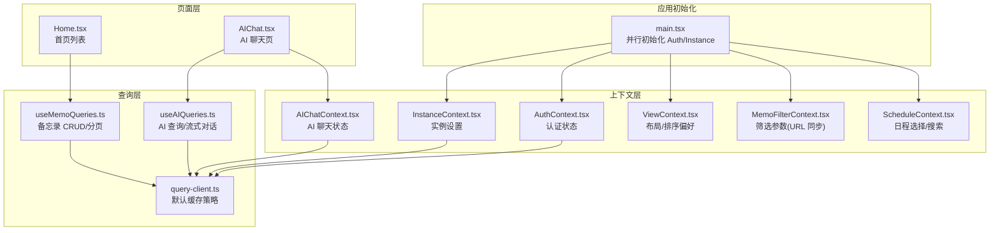
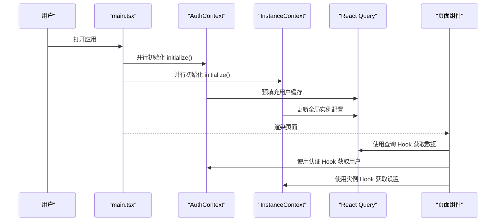
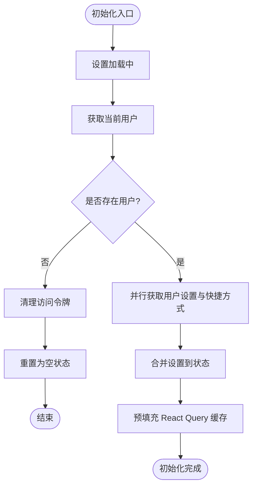
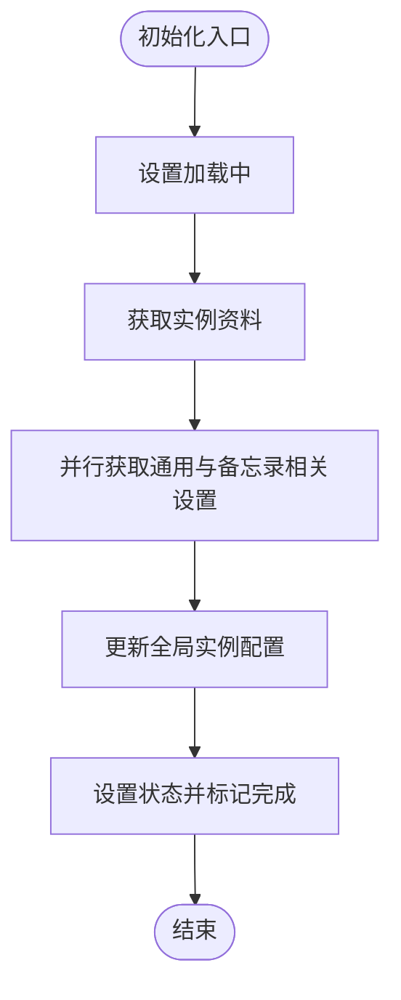
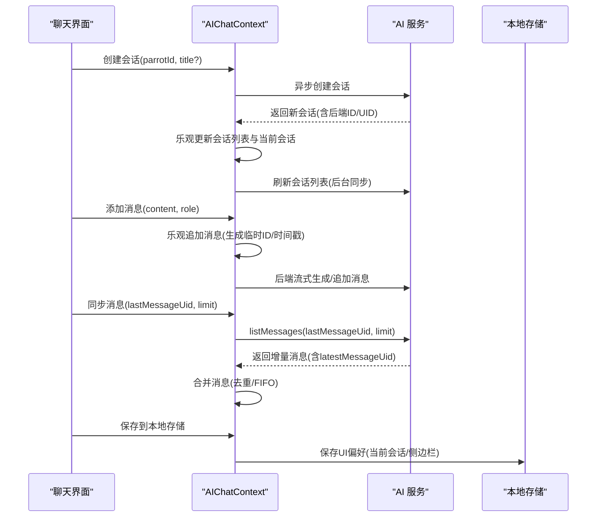
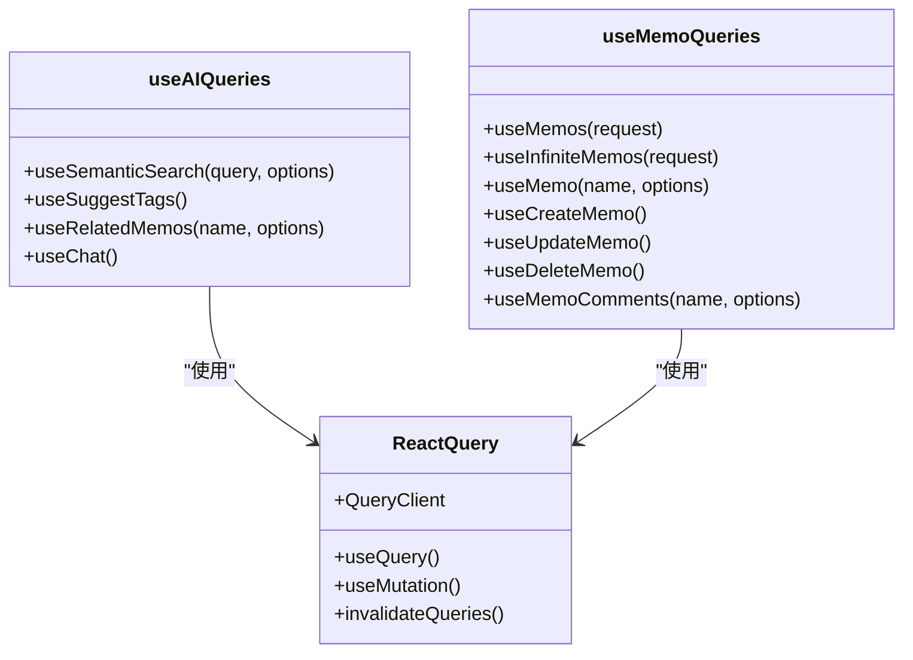
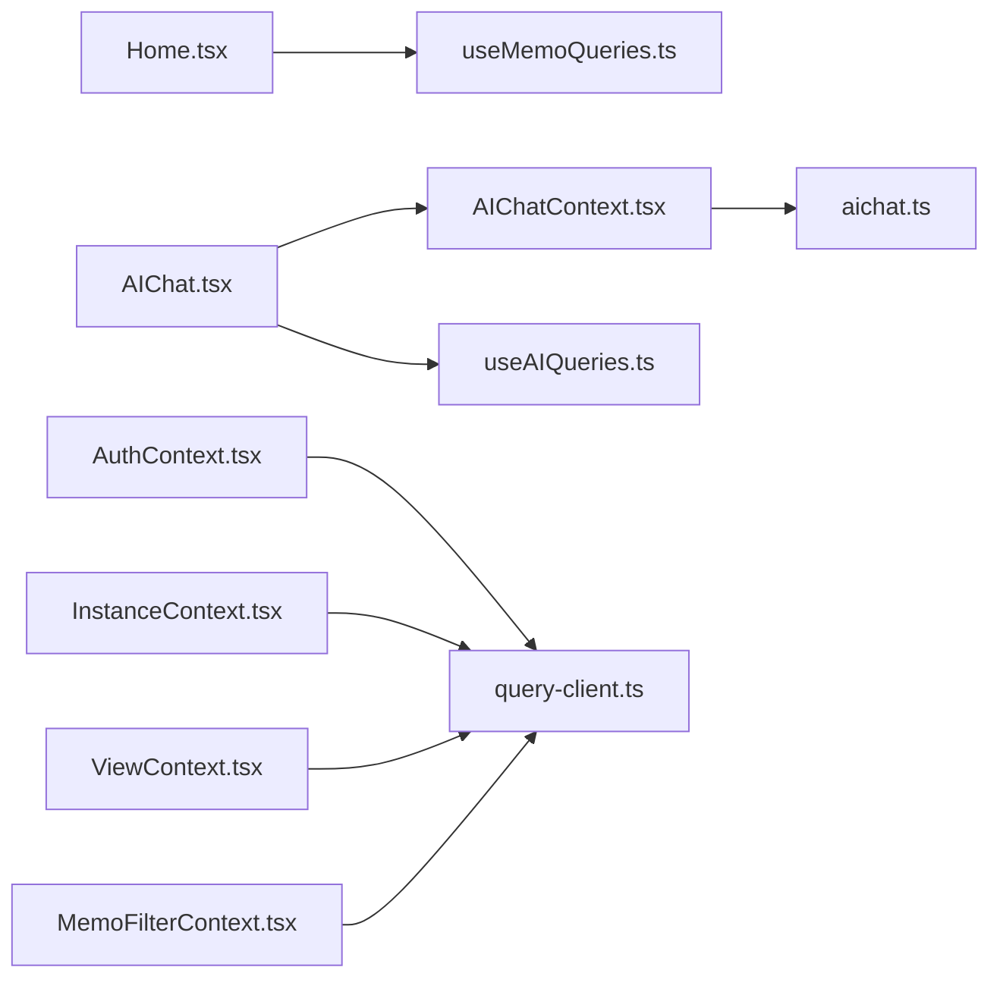

# 状态管理策略

<cite>
**本文引用的文件**
- [AuthContext.tsx](file://web/src/contexts/AuthContext.tsx)
- [InstanceContext.tsx](file://web/src/contexts/InstanceContext.tsx)
- [AIChatContext.tsx](file://web/src/contexts/AIChatContext.tsx)
- [useAIQueries.ts](file://web/src/hooks/useAIQueries.ts)
- [useMemoQueries.ts](file://web/src/hooks/useMemoQueries.ts)
- [aichat.ts](file://web/src/types/aichat.ts)
- [query-client.ts](file://web/src/lib/query-client.ts)
- [main.tsx](file://web/src/main.tsx)
- [MemoFilterContext.tsx](file://web/src/contexts/MemoFilterContext.tsx)
- [ScheduleContext.tsx](file://web/src/contexts/ScheduleContext.tsx)
- [ViewContext.tsx](file://web/src/contexts/ViewContext.tsx)
- [Home.tsx](file://web/src/pages/Home.tsx)
- [AIChat.tsx](file://web/src/pages/AIChat.tsx)
- [auth-architecture.md](file://web/docs/auth-architecture.md)
- [instance-config.ts](file://web/src/instance-config.ts)
- [useMemoInit.ts](file://web/src/components/MemoEditor/hooks/useMemoInit.ts)
</cite>

## 目录
1. [引言](#引言)
2. [项目结构](#项目结构)
3. [核心组件](#核心组件)
4. [架构总览](#架构总览)
5. [详细组件分析](#详细组件分析)
6. [依赖关系分析](#依赖关系分析)
7. [性能考量](#性能考量)
8. [故障排查指南](#故障排查指南)
9. [结论](#结论)
10. [附录](#附录)

## 引言
本文件系统性梳理前端状态管理策略，围绕 React Context API 与 React Query 的协同使用，重点覆盖以下方面：
- 认证上下文（AuthContext）与实例上下文（InstanceContext）的设计与职责边界
- AI 聊天上下文（AIChatContext）的复杂状态建模、增量同步与本地持久化
- 自定义 Hook 的设计模式与使用场景（如 useAIQueries、useMemoQueries）
- 全局状态与局部状态的划分原则、状态提升与下放的最佳实践
- 状态持久化、状态同步与并发更新的处理策略
- 结合实际页面组件（如 Home、AIChat）展示状态管理模式与性能优化建议

## 项目结构
前端状态管理采用“上下文 + 查询客户端”的分层架构：
- 上下文层：负责应用级全局状态（认证、实例、聊天、视图、筛选等）
- 查询层：基于 React Query 的查询客户端，统一管理远端数据缓存与失效
- 页面层：通过自定义 Hook 与上下文消费状态，实现声明式数据绑定

图表来源
- [main.tsx](file://web/src/main.tsx#L35-L44)
- [AuthContext.tsx](file://web/src/contexts/AuthContext.tsx#L26-L95)
- [InstanceContext.tsx](file://web/src/contexts/InstanceContext.tsx#L43-L109)
- [AIChatContext.tsx](file://web/src/contexts/AIChatContext.tsx#L109-L149)
- [query-client.ts](file://web/src/lib/query-client.ts#L3-L18)
- [useAIQueries.ts](file://web/src/hooks/useAIQueries.ts#L15-L41)
- [useMemoQueries.ts](file://web/src/hooks/useMemoQueries.ts#L9-L27)
- [Home.tsx](file://web/src/pages/Home.tsx#L9-L24)
- [AIChat.tsx](file://web/src/pages/AIChat.tsx#L177-L200)

章节来源
- [main.tsx](file://web/src/main.tsx#L35-L44)
- [AuthContext.tsx](file://web/src/contexts/AuthContext.tsx#L26-L95)
- [InstanceContext.tsx](file://web/src/contexts/InstanceContext.tsx#L43-L109)
- [AIChatContext.tsx](file://web/src/contexts/AIChatContext.tsx#L109-L149)
- [query-client.ts](file://web/src/lib/query-client.ts#L3-L18)

## 核心组件
- 认证上下文（AuthContext）
  - 职责：应用启动时一次性拉取当前用户信息与用户设置，预热 React Query 缓存；提供登出与设置刷新能力
  - 关键点：使用 useMemo 包裹上下文值以避免消费者不必要重渲染；在失败时清理访问令牌并清空缓存
- 实例上下文（InstanceContext）
  - 职责：加载实例配置与多类设置，派生通用设置对象；支持按需获取/更新设置
  - 关键点：派生设置通过 useMemo 缓存，减少重复计算；更新后写入全局实例配置模块供非 React 代码使用
- AI 聊天上下文（AIChatContext）
  - 职责：维护会话列表、当前会话、消息列表、侧边栏状态与能力状态；提供消息增量同步、FIFO 缓存、上下文分隔符、标题生成等能力
  - 关键点：本地持久化 UI 偏好；云端持久化由后端管理；乐观更新与回滚策略；严格区分本地临时 ID 与后端 UID
- 查询客户端（React Query）
  - 职责：统一缓存策略、失效与重试、窗口焦点/网络重连自动刷新
  - 关键点：默认 staleTime、gcTime、refetchOnWindowFocus/refetchOnReconnect；各 Hook 可覆盖默认策略

章节来源
- [AuthContext.tsx](file://web/src/contexts/AuthContext.tsx#L9-L16)
- [AuthContext.tsx](file://web/src/contexts/AuthContext.tsx#L130-L140)
- [InstanceContext.tsx](file://web/src/contexts/InstanceContext.tsx#L25-L30)
- [InstanceContext.tsx](file://web/src/contexts/InstanceContext.tsx#L129-L141)
- [AIChatContext.tsx](file://web/src/contexts/AIChatContext.tsx#L54-L62)
- [AIChatContext.tsx](file://web/src/contexts/AIChatContext.tsx#L757-L766)
- [query-client.ts](file://web/src/lib/query-client.ts#L3-L18)

## 架构总览
整体流程：应用启动并行初始化认证与实例上下文；随后进入路由层；页面组件通过自定义 Hook 与上下文消费状态，React Query 负责远端数据缓存与一致性。

图表来源
- [main.tsx](file://web/src/main.tsx#L35-L44)
- [AuthContext.tsx](file://web/src/contexts/AuthContext.tsx#L80-L82)
- [InstanceContext.tsx](file://web/src/contexts/InstanceContext.tsx#L86-L93)

## 详细组件分析

### 认证上下文（AuthContext）
- 设计要点
  - 初始化阶段并行获取用户与设置，失败时清理令牌并清空缓存
  - 使用 useCallback 包裹异步方法，避免闭包依赖导致的重复请求
  - 使用 useMemo 包裹上下文值，防止消费者因状态细碎变化而重渲染
  - 登出时调用后端登出接口，清理本地状态与 Query 缓存
- 数据模型与依赖
  - 状态字段：当前用户、通用设置、Webhook 设置、快捷方式、初始化与加载标志
  - 依赖：认证服务客户端、用户服务客户端、快捷方式服务客户端、Query 客户端
- 错误处理
  - 初始化失败：记录错误、清理令牌、标记初始化完成、置空状态
  - 登出异常：记录错误，继续清理本地状态与缓存

图表来源
- [AuthContext.tsx](file://web/src/contexts/AuthContext.tsx#L53-L95)

章节来源
- [AuthContext.tsx](file://web/src/contexts/AuthContext.tsx#L26-L150)
- [auth-architecture.md](file://web/docs/auth-architecture.md#L1-L42)

### 实例上下文（InstanceContext）
- 设计要点
  - 通过名称构建器拼接设置键，按需获取与更新实例设置
  - 派生设置通过 useMemo 缓存，避免每次渲染重新解析
  - 更新设置后同步更新全局实例配置模块，供拦截器等非 React 代码使用
- 数据模型与依赖
  - 状态字段：实例资料、设置数组、初始化与加载标志
  - 派生设置：通用设置、备忘录相关设置、存储设置
  - 依赖：实例服务客户端、全局实例配置模块

图表来源
- [InstanceContext.tsx](file://web/src/contexts/InstanceContext.tsx#L76-L109)
- [instance-config.ts](file://web/src/instance-config.ts#L21-L23)

章节来源
- [InstanceContext.tsx](file://web/src/contexts/InstanceContext.tsx#L43-L144)
- [instance-config.ts](file://web/src/instance-config.ts#L1-L23)

### AI 聊天上下文（AIChatContext）
- 设计要点
  - 会话与消息：维护会话列表、当前会话、消息列表、引用内容、侧边栏状态与能力状态
  - 增量同步：基于后端 UID 的增量拉取，避免重复消息；支持“更多”翻页加载
  - FIFO 缓存：限制每会话消息数量，保留上下文分隔符
  - 本地持久化：仅保存 UI 偏好（当前会话、侧边栏标签），会话历史迁移至云端
  - 乐观更新：创建会话、添加消息、更新标题等操作先本地更新，再后台同步
- 数据模型与依赖
  - 状态接口：会话、消息、摘要、视图模式、侧边栏状态、能力状态
  - 依赖：AI 服务客户端、翻译工具、Protobuf 类型转换器
- 复杂逻辑
  - 合并消息到状态：区分首次加载与增量同步，去重与顺序合并
  - 标题生成：根据首条用户消息生成语义化标题
  - 分隔符处理：用于清空上下文的分隔符消息

图表来源
- [AIChatContext.tsx](file://web/src/contexts/AIChatContext.tsx#L296-L338)
- [AIChatContext.tsx](file://web/src/contexts/AIChatContext.tsx#L411-L460)
- [AIChatContext.tsx](file://web/src/contexts/AIChatContext.tsx#L605-L655)
- [AIChatContext.tsx](file://web/src/contexts/AIChatContext.tsx#L758-L766)

章节来源
- [AIChatContext.tsx](file://web/src/contexts/AIChatContext.tsx#L109-L800)
- [aichat.ts](file://web/src/types/aichat.ts#L124-L181)

### 自定义 Hook 设计模式与使用场景
- useAIQueries
  - 语义搜索：基于查询键缓存，启用条件与新鲜度控制
  - 标签推荐：Mutation，返回标签数组
  - 相关备忘录：基于查询键缓存，启用条件与新鲜度控制
  - 流式对话：Connect RPC 流式响应，统一超时控制与事件回调
- useMemoQueries
  - 列表/分页：支持无限分页与缓存时间控制
  - 单条详情：短新鲜度，适合协作编辑场景
  - CRUD：创建/更新/删除均配合 Query 客户端进行缓存失效与乐观更新

图表来源
- [useAIQueries.ts](file://web/src/hooks/useAIQueries.ts#L28-L78)
- [useMemoQueries.ts](file://web/src/hooks/useMemoQueries.ts#L19-L58)

章节来源
- [useAIQueries.ts](file://web/src/hooks/useAIQueries.ts#L15-L331)
- [useMemoQueries.ts](file://web/src/hooks/useMemoQueries.ts#L9-L155)

### 全局状态与局部状态的划分原则
- 全局状态（上下文）
  - 用户身份、实例设置、聊天会话、视图偏好、筛选参数
  - 特点：跨组件共享、变更频率低、影响范围广
- 局部状态（组件内部）
  - 表单输入、按钮点击态、弹窗开关、滚动位置等
  - 特点：作用域小、生命周期短、无需跨组件共享
- 最佳实践
  - 将“稳定且共享”的数据放入上下文；将“临时且私有”的数据放入组件内部
  - 对于高频更新的 UI 状态，优先使用组件内部状态，避免上下文风暴
  - 对于需要持久化的 UI 偏好，可采用本地存储与上下文结合的方式

章节来源
- [MemoFilterContext.tsx](file://web/src/contexts/MemoFilterContext.tsx#L57-L93)
- [ViewContext.tsx](file://web/src/contexts/ViewContext.tsx#L16-L58)
- [AIChatContext.tsx](file://web/src/contexts/AIChatContext.tsx#L758-L766)

### 状态提升与下放
- 提升：将多个子组件共同依赖的数据提升到最近公共祖先（如上下文），避免重复请求与状态分散
- 下放：将仅在特定区域使用的状态保留在组件内部，降低耦合
- 示例
  - 日程选择与搜索状态：在 ScheduleProvider 中集中管理，便于跨组件共享
  - 备忘录筛选：通过 URL 参数与上下文同步，既可分享链接又可跨组件读取

章节来源
- [ScheduleContext.tsx](file://web/src/contexts/ScheduleContext.tsx#L34-L63)
- [MemoFilterContext.tsx](file://web/src/contexts/MemoFilterContext.tsx#L57-L93)

### 状态持久化、状态同步与并发更新
- 持久化
  - AI 聊天：仅持久化 UI 偏好（当前会话、侧边栏标签），会话历史迁移至云端
  - 视图设置：布局与排序偏好持久化到本地存储
  - 筛选参数：通过 URL 同步，支持分享与恢复
- 同步
  - URL 与状态双向同步：过滤参数与路由参数保持一致
  - 窗口焦点/网络重连：自动刷新查询，保证数据一致性
- 并发更新
  - 乐观更新：创建/更新/删除操作先本地更新，再等待服务端确认
  - 回滚机制：错误时恢复上一个版本，避免脏数据
  - 取消竞态：更新前取消正在进行的请求，避免旧数据覆盖新数据

章节来源
- [AIChatContext.tsx](file://web/src/contexts/AIChatContext.tsx#L758-L766)
- [ViewContext.tsx](file://web/src/contexts/ViewContext.tsx#L36-L58)
- [MemoFilterContext.tsx](file://web/src/contexts/MemoFilterContext.tsx#L79-L93)
- [query-client.ts](file://web/src/lib/query-client.ts#L10-L12)
- [useMemoQueries.ts](file://web/src/hooks/useMemoQueries.ts#L90-L122)
- [useMemoInit.ts](file://web/src/components/MemoEditor/hooks/useMemoInit.ts#L25-L32)

### 具体状态管理模式示例
- 首页列表（Home）
  - 使用 useMemoFilters 与 useMemoSorting 统一构建过滤与排序逻辑
  - 通过 useMemos/useInfiniteMemos 获取数据，PagedMemoList 渲染
- AI 聊天页（AIChat）
  - 使用 useAIChat 获取聊天上下文，useChat 发起流式对话
  - 通过上下文动作管理会话与消息，组件内维护输入框与提示状态

章节来源
- [Home.tsx](file://web/src/pages/Home.tsx#L9-L37)
- [AIChat.tsx](file://web/src/pages/AIChat.tsx#L177-L200)

## 依赖关系分析
- 组件耦合
  - 页面组件依赖自定义 Hook 与上下文，解耦数据获取与 UI
  - 上下文之间低耦合：认证与实例独立初始化，互不影响
- 外部依赖
  - React Query：统一缓存与失效
  - Protobuf/Connect：类型安全的 RPC 调用
  - i18n：聊天标题本地化
- 循环依赖
  - 未见明显循环依赖；上下文与 Hook 通过导出接口解耦

图表来源
- [Home.tsx](file://web/src/pages/Home.tsx#L4-L5)
- [AIChat.tsx](file://web/src/pages/AIChat.tsx#L13-L14)
- [useMemoQueries.ts](file://web/src/hooks/useMemoQueries.ts#L1-L7)
- [useAIQueries.ts](file://web/src/hooks/useAIQueries.ts#L1-L10)
- [AIChatContext.tsx](file://web/src/contexts/AIChatContext.tsx#L1-L18)
- [AuthContext.tsx](file://web/src/contexts/AuthContext.tsx#L1-L7)
- [InstanceContext.tsx](file://web/src/contexts/InstanceContext.tsx#L1-L16)
- [ViewContext.tsx](file://web/src/contexts/ViewContext.tsx#L1-L1)
- [MemoFilterContext.tsx](file://web/src/contexts/MemoFilterContext.tsx#L1-L3)

章节来源
- [Home.tsx](file://web/src/pages/Home.tsx#L4-L5)
- [AIChat.tsx](file://web/src/pages/AIChat.tsx#L13-L14)
- [useMemoQueries.ts](file://web/src/hooks/useMemoQueries.ts#L1-L7)
- [useAIQueries.ts](file://web/src/hooks/useAIQueries.ts#L1-L10)
- [AIChatContext.tsx](file://web/src/contexts/AIChatContext.tsx#L1-L18)

## 性能考量
- 缓存策略
  - 默认 staleTime/gcTime 平衡新鲜度与性能；个别场景（通知、备忘录详情）可缩短 staleTime
  - 查询键工厂确保缓存隔离与精准失效
- 渲染优化
  - 上下文值 useMemo 包裹，避免消费者不必要重渲染
  - 组件内部状态最小化，避免大对象深比较
- 并发与竞态
  - 更新前取消请求，避免旧数据覆盖新数据
  - Mutation 的 onMutate/onError/onSuccess 形成完整的乐观更新闭环
- 网络与离线
  - 窗口焦点/网络重连自动刷新，提升用户体验
  - 服务注册与离线支持（Service Worker）

章节来源
- [query-client.ts](file://web/src/lib/query-client.ts#L3-L18)
- [AuthContext.tsx](file://web/src/contexts/AuthContext.tsx#L130-L139)
- [useMemoQueries.ts](file://web/src/hooks/useMemoQueries.ts#L90-L122)
- [main.tsx](file://web/src/main.tsx#L26-L28)

## 故障排查指南
- 认证初始化失败
  - 现象：登录态异常、用户信息缺失
  - 排查：检查初始化流程、令牌清理、缓存清空
  - 参考：[AuthContext.tsx](file://web/src/contexts/AuthContext.tsx#L83-L94)
- 实例设置未生效
  - 现象：功能受限或样式异常
  - 排查：确认设置键名、派生设置缓存、全局配置更新
  - 参考：[InstanceContext.tsx](file://web/src/contexts/InstanceContext.tsx#L111-L127), [instance-config.ts](file://web/src/instance-config.ts#L21-L23)
- 聊天消息不同步
  - 现象：消息丢失、重复、顺序错乱
  - 排查：检查增量 UID、FIFO 限制、合并逻辑、后端同步
  - 参考：[AIChatContext.tsx](file://web/src/contexts/AIChatContext.tsx#L540-L602), [AIChatContext.tsx](file://web/src/contexts/AIChatContext.tsx#L605-L655)
- 备忘录编辑冲突
  - 现象：多人协作时覆盖旧数据
  - 排查：确认取消竞态、乐观更新与回滚
  - 参考：[useMemoQueries.ts](file://web/src/hooks/useMemoQueries.ts#L90-L122), [useMemoInit.ts](file://web/src/components/MemoEditor/hooks/useMemoInit.ts#L25-L32)

章节来源
- [AuthContext.tsx](file://web/src/contexts/AuthContext.tsx#L83-L94)
- [InstanceContext.tsx](file://web/src/contexts/InstanceContext.tsx#L111-L127)
- [instance-config.ts](file://web/src/instance-config.ts#L21-L23)
- [AIChatContext.tsx](file://web/src/contexts/AIChatContext.tsx#L540-L602)
- [AIChatContext.tsx](file://web/src/contexts/AIChatContext.tsx#L605-L655)
- [useMemoQueries.ts](file://web/src/hooks/useMemoQueries.ts#L90-L122)
- [useMemoInit.ts](file://web/src/components/MemoEditor/hooks/useMemoInit.ts#L25-L32)

## 结论
该状态管理策略通过“上下文 + React Query”的组合实现了：
- 明确的职责边界：认证/实例/聊天/视图/筛选各自独立上下文
- 高效的缓存与一致性：统一的查询客户端与默认缓存策略
- 健壮的并发与错误处理：乐观更新、回滚、竞态取消
- 良好的扩展性：类型安全的 Protobuf 客户端与清晰的 Hook 抽象

建议在后续演进中持续关注：
- 更细粒度的查询键与失效策略
- 更完善的离线与冲突解决机制
- 更丰富的 UI 偏好持久化方案

## 附录
- 关键类型与接口参考：[aichat.ts](file://web/src/types/aichat.ts#L124-L181)
- 应用初始化与并行初始化：[main.tsx](file://web/src/main.tsx#L35-L44)
- 认证架构说明：[auth-architecture.md](file://web/docs/auth-architecture.md#L1-L42)