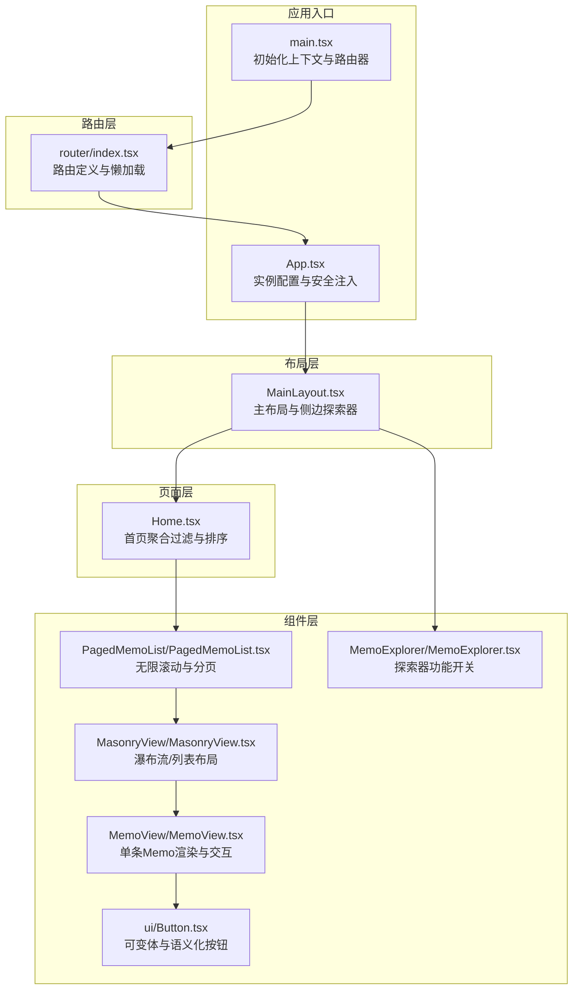
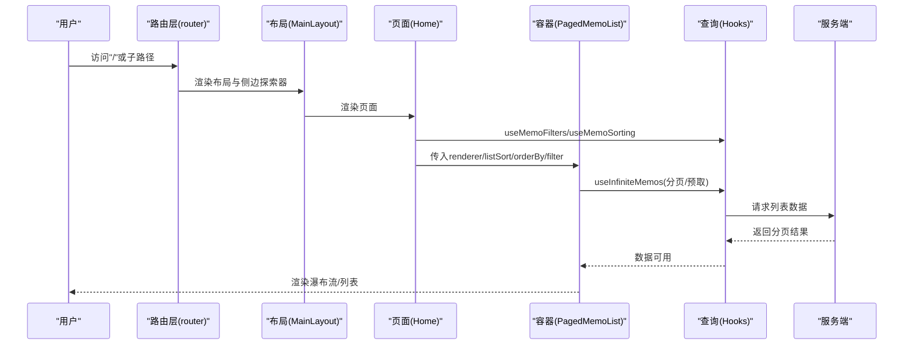
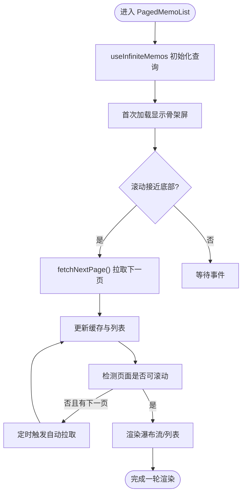
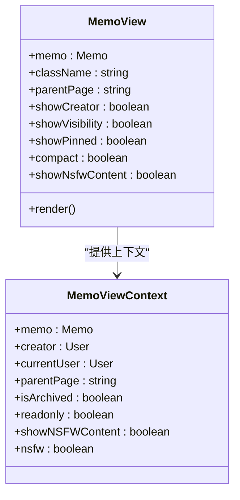
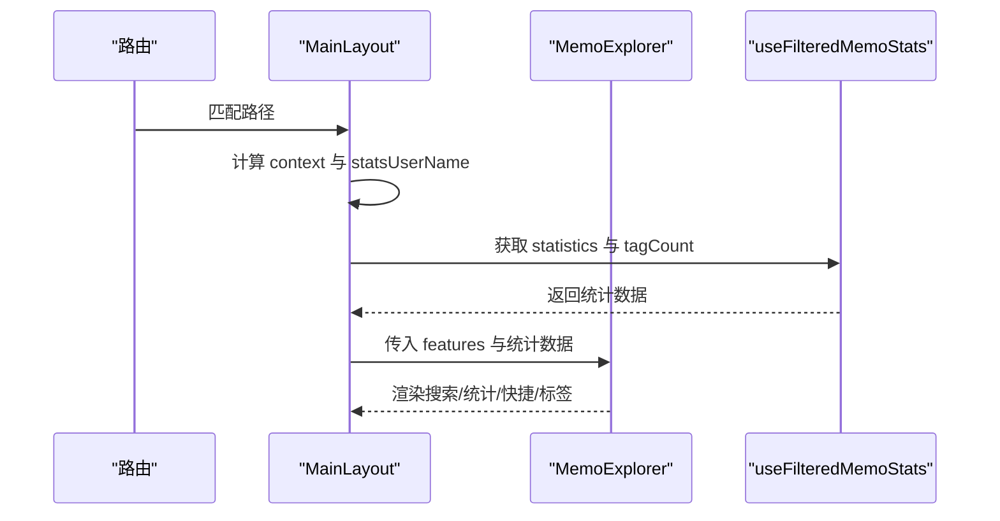
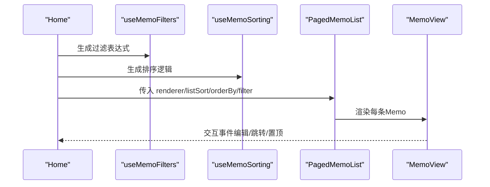
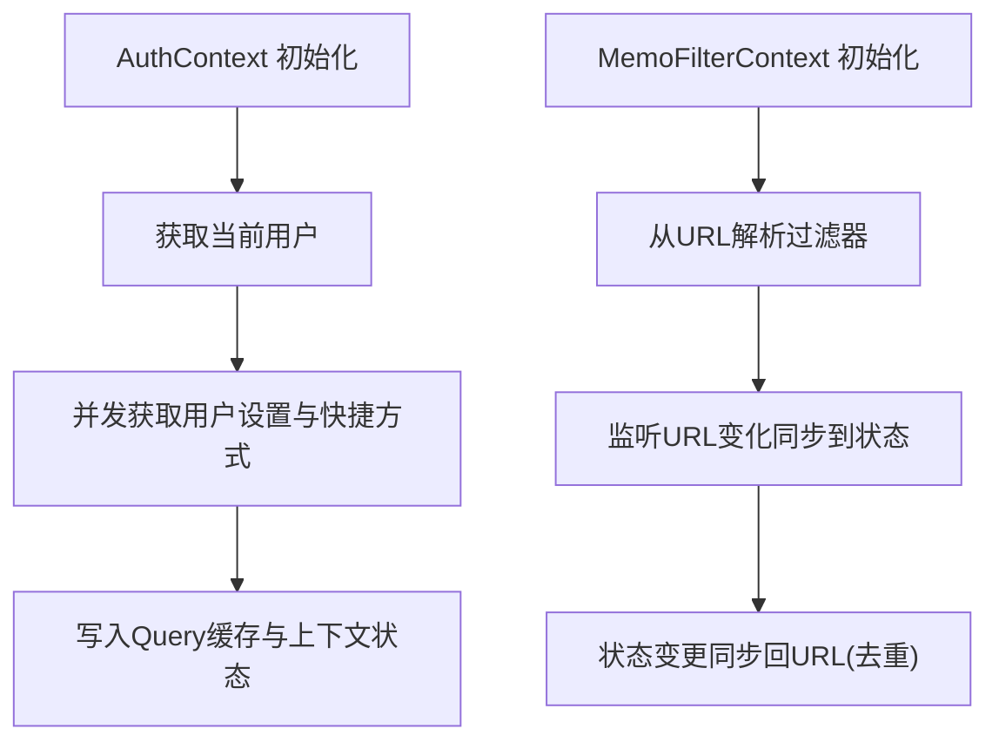
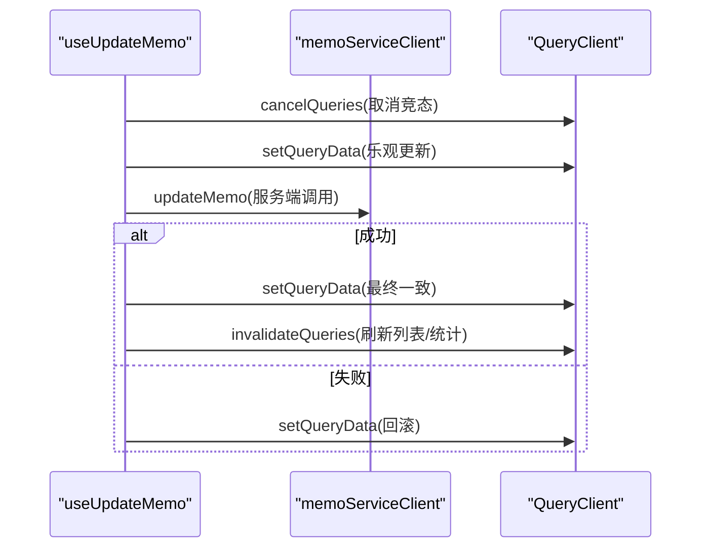
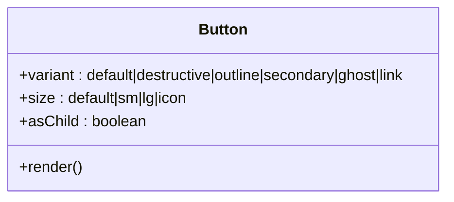
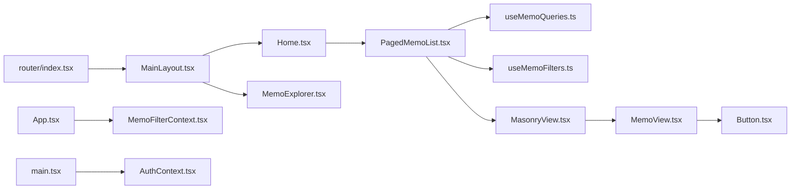

# 组件架构设计

<cite>
**本文引用的文件**
- [web/src/main.tsx](file://web/src/main.tsx)
- [web/src/App.tsx](file://web/src/App.tsx)
- [web/src/router/index.tsx](file://web/src/router/index.tsx)
- [web/src/layouts/MainLayout.tsx](file://web/src/layouts/MainLayout.tsx)
- [web/src/components/ui/Button.tsx](file://web/src/components/ui/Button.tsx)
- [web/src/components/MemoExplorer/MemoExplorer.tsx](file://web/src/components/MemoExplorer/MemoExplorer.tsx)
- [web/src/contexts/MemoFilterContext.tsx](file://web/src/contexts/MemoFilterContext.tsx)
- [web/src/hooks/useMemoQueries.ts](file://web/src/hooks/useMemoQueries.ts)
- [web/src/pages/Home.tsx](file://web/src/pages/Home.tsx)
- [web/src/components/MemoView/MemoView.tsx](file://web/src/components/MemoView/MemoView.tsx)
- [web/src/hooks/useMemoFilters.ts](file://web/src/hooks/useMemoFilters.ts)
- [web/src/contexts/AuthContext.tsx](file://web/src/contexts/AuthContext.tsx)
- [web/src/components/PagedMemoList/PagedMemoList.tsx](file://web/src/components/PagedMemoList/PagedMemoList.tsx)
- [web/src/components/MasonryView/MasonryView.tsx](file://web/src/components/MasonryView/MasonryView.tsx)
</cite>

## 目录
1. [引言](#引言)
2. [项目结构](#项目结构)
3. [核心组件](#核心组件)
4. [架构总览](#架构总览)
5. [详细组件分析](#详细组件分析)
6. [依赖关系分析](#依赖关系分析)
7. [性能考量](#性能考量)
8. [故障排查指南](#故障排查指南)
9. [结论](#结论)
10. [附录](#附录)

## 引言
本文件系统性梳理前端组件架构与设计模式，围绕容器组件与展示组件的分离、组件间通信（Props、事件与状态提升）、复用与组合、生命周期管理与性能优化进行深入解析，并结合仓库中的真实实现路径给出最佳实践建议与可视化图示。

## 项目结构
前端采用“路由层-布局层-页面层-组件层-上下文与Hooks”的分层组织方式：
- 路由层：集中定义路由与懒加载，统一错误边界与骨架屏包装。
- 布局层：提供主布局、AI聊天布局、日程布局等，承载侧边探索器与内容区。
- 页面层：具体业务页面，如首页、探索页、归档页等，负责组装数据与渲染。
- 组件层：通用UI组件（如按钮）与领域组件（如MemoView、MemoExplorer、PagedMemoList）。
- 上下文与Hooks：全局状态（认证、实例配置、视图、筛选）与数据查询（React Query）。

图表来源
- [web/src/main.tsx](file://web/src/main.tsx#L57-L76)
- [web/src/App.tsx](file://web/src/App.tsx#L29-L89)
- [web/src/router/index.tsx](file://web/src/router/index.tsx#L51-L112)
- [web/src/layouts/MainLayout.tsx](file://web/src/layouts/MainLayout.tsx#L13-L89)
- [web/src/pages/Home.tsx](file://web/src/pages/Home.tsx#L9-L37)
- [web/src/components/ui/Button.tsx](file://web/src/components/ui/Button.tsx#L32-L42)
- [web/src/components/MemoView/MemoView.tsx](file://web/src/components/MemoView/MemoView.tsx#L15-L104)
- [web/src/components/PagedMemoList/PagedMemoList.tsx](file://web/src/components/PagedMemoList/PagedMemoList.tsx#L83-L194)
- [web/src/components/MasonryView/MasonryView.tsx](file://web/src/components/MasonryView/MasonryView.tsx#L7-L45)
- [web/src/components/MemoExplorer/MemoExplorer.tsx](file://web/src/components/MemoExplorer/MemoExplorer.tsx#L60-L84)

章节来源
- [web/src/main.tsx](file://web/src/main.tsx#L29-L81)
- [web/src/router/index.tsx](file://web/src/router/index.tsx#L51-L115)

## 核心组件
- 容器组件（数据与行为）：PagedMemoList、MainLayout、Home、MemoExplorer。
- 展示组件（纯渲染）：MemoView、Button、MasonryView、BackToTop等。
- 上下文与状态：AuthContext、MemoFilterContext、InstanceContext、ViewContext。
- 数据查询：useMemoQueries系列、useMemoFilters、useCurrentUser等。

章节来源
- [web/src/components/PagedMemoList/PagedMemoList.tsx](file://web/src/components/PagedMemoList/PagedMemoList.tsx#L83-L194)
- [web/src/layouts/MainLayout.tsx](file://web/src/layouts/MainLayout.tsx#L13-L89)
- [web/src/pages/Home.tsx](file://web/src/pages/Home.tsx#L9-L37)
- [web/src/components/MemoExplorer/MemoExplorer.tsx](file://web/src/components/MemoExplorer/MemoExplorer.tsx#L60-L84)
- [web/src/components/ui/Button.tsx](file://web/src/components/ui/Button.tsx#L32-L42)
- [web/src/contexts/AuthContext.tsx](file://web/src/contexts/AuthContext.tsx#L26-L142)
- [web/src/contexts/MemoFilterContext.tsx](file://web/src/contexts/MemoFilterContext.tsx#L57-L145)
- [web/src/hooks/useMemoQueries.ts](file://web/src/hooks/useMemoQueries.ts#L19-L155)
- [web/src/hooks/useMemoFilters.ts](file://web/src/hooks/useMemoFilters.ts#L37-L101)

## 架构总览
整体采用“路由驱动 + 布局嵌套 + 组件组合 + 上下文共享 + 查询缓存”的架构：
- 路由层统一管理页面与布局，支持懒加载与错误边界。
- 布局层通过上下文决定侧边探索器的功能集与统计信息。
- 页面层通过Hooks组合过滤、排序与状态，再交给容器组件拉取与渲染数据。
- 容器组件负责数据获取、分页、预取、回滚与缓存失效。
- 展示组件专注渲染与交互，通过Context或Props接收所需数据。

图表来源
- [web/src/router/index.tsx](file://web/src/router/index.tsx#L51-L112)
- [web/src/layouts/MainLayout.tsx](file://web/src/layouts/MainLayout.tsx#L13-L89)
- [web/src/pages/Home.tsx](file://web/src/pages/Home.tsx#L9-L37)
- [web/src/components/PagedMemoList/PagedMemoList.tsx](file://web/src/components/PagedMemoList/PagedMemoList.tsx#L93-L147)
- [web/src/hooks/useMemoQueries.ts](file://web/src/hooks/useMemoQueries.ts#L29-L46)
- [web/src/hooks/useMemoFilters.ts](file://web/src/hooks/useMemoFilters.ts#L37-L101)

## 详细组件分析

### 容器组件：PagedMemoList
职责与特性：
- 使用React Query的无限查询实现分页与缓存。
- 自动滚动加载与“不可滚动时自动拉取”策略。
- 预取作者信息以减少二次请求。
- 支持自定义排序与渲染器，便于组合不同展示组件。

图表来源
- [web/src/components/PagedMemoList/PagedMemoList.tsx](file://web/src/components/PagedMemoList/PagedMemoList.tsx#L83-L194)
- [web/src/hooks/useMemoQueries.ts](file://web/src/hooks/useMemoQueries.ts#L29-L46)

章节来源
- [web/src/components/PagedMemoList/PagedMemoList.tsx](file://web/src/components/PagedMemoList/PagedMemoList.tsx#L83-L194)
- [web/src/hooks/useMemoQueries.ts](file://web/src/hooks/useMemoQueries.ts#L19-L155)

### 展示组件：MemoView
职责与特性：
- 将单条Memo渲染为卡片，支持编辑、预览、NSFW切换、只读判断等。
- 通过MemoViewContext向下传递渲染所需的上下文。
- 使用React.memo进行浅比较优化。

图表来源
- [web/src/components/MemoView/MemoView.tsx](file://web/src/components/MemoView/MemoView.tsx#L15-L104)

章节来源
- [web/src/components/MemoView/MemoView.tsx](file://web/src/components/MemoView/MemoView.tsx#L15-L104)

### 布局组件：MainLayout
职责与特性：
- 基于路由推导上下文（home/explore/archived/profile），动态决定探索器功能集与统计来源。
- 在移动端使用抽屉，在桌面端使用固定侧栏。
- 通过useFilteredMemoStats提供标签与统计信息给探索器。

图表来源
- [web/src/layouts/MainLayout.tsx](file://web/src/layouts/MainLayout.tsx#L13-L89)
- [web/src/components/MemoExplorer/MemoExplorer.tsx](file://web/src/components/MemoExplorer/MemoExplorer.tsx#L60-L84)

章节来源
- [web/src/layouts/MainLayout.tsx](file://web/src/layouts/MainLayout.tsx#L13-L89)
- [web/src/components/MemoExplorer/MemoExplorer.tsx](file://web/src/components/MemoExplorer/MemoExplorer.tsx#L60-L84)

### 页面组件：Home
职责与特性：
- 使用useMemoFilters与useMemoSorting生成过滤条件与排序规则。
- 将MemoView作为渲染器传入PagedMemoList，形成“容器+展示”的组合。

图表来源
- [web/src/pages/Home.tsx](file://web/src/pages/Home.tsx#L9-L37)
- [web/src/hooks/useMemoFilters.ts](file://web/src/hooks/useMemoFilters.ts#L37-L101)

章节来源
- [web/src/pages/Home.tsx](file://web/src/pages/Home.tsx#L9-L37)
- [web/src/hooks/useMemoFilters.ts](file://web/src/hooks/useMemoFilters.ts#L37-L101)

### 上下文与状态：AuthContext 与 MemoFilterContext
职责与特性：
- AuthContext：统一管理当前用户、用户设置、快捷方式与初始化流程，支持并发预取与缓存。
- MemoFilterContext：基于URL同步过滤器，提供增删改查与快捷方式能力，保证URL与状态一致性。

图表来源
- [web/src/contexts/AuthContext.tsx](file://web/src/contexts/AuthContext.tsx#L53-L95)
- [web/src/contexts/MemoFilterContext.tsx](file://web/src/contexts/MemoFilterContext.tsx#L62-L93)

章节来源
- [web/src/contexts/AuthContext.tsx](file://web/src/contexts/AuthContext.tsx#L26-L142)
- [web/src/contexts/MemoFilterContext.tsx](file://web/src/contexts/MemoFilterContext.tsx#L57-L145)

### 数据查询与缓存：useMemoQueries
职责与特性：
- 提供列表、详情、评论的查询与无限分页。
- Mutation支持乐观更新、错误回滚、缓存失效与增量更新。
- 合理的staleTime/gcTime降低缓存压力并保证实时性。

图表来源
- [web/src/hooks/useMemoQueries.ts](file://web/src/hooks/useMemoQueries.ts#L79-L123)

章节来源
- [web/src/hooks/useMemoQueries.ts](file://web/src/hooks/useMemoQueries.ts#L19-L155)

### 可复用UI：Button
职责与特性：
- 使用cva定义变体与尺寸，forwardRef透传DOM属性，支持asChild组合其他元素。

图表来源
- [web/src/components/ui/Button.tsx](file://web/src/components/ui/Button.tsx#L32-L42)

章节来源
- [web/src/components/ui/Button.tsx](file://web/src/components/ui/Button.tsx#L6-L46)

## 依赖关系分析
- 路由层依赖布局与页面；布局依赖探索器与统计；页面依赖过滤与排序；容器依赖查询；展示依赖上下文与UI组件。
- 上下文之间存在弱耦合：AuthContext与InstanceContext在App层注入，MemoFilterContext在App根部提供，避免跨层级传递。
- 查询层与UI层解耦：容器组件仅消费Hook返回的数据，不直接关心网络细节。

图表来源
- [web/src/router/index.tsx](file://web/src/router/index.tsx#L51-L112)
- [web/src/layouts/MainLayout.tsx](file://web/src/layouts/MainLayout.tsx#L13-L89)
- [web/src/pages/Home.tsx](file://web/src/pages/Home.tsx#L9-L37)
- [web/src/components/PagedMemoList/PagedMemoList.tsx](file://web/src/components/PagedMemoList/PagedMemoList.tsx#L83-L194)
- [web/src/hooks/useMemoQueries.ts](file://web/src/hooks/useMemoQueries.ts#L19-L155)
- [web/src/hooks/useMemoFilters.ts](file://web/src/hooks/useMemoFilters.ts#L37-L101)
- [web/src/components/MasonryView/MasonryView.tsx](file://web/src/components/MasonryView/MasonryView.tsx#L7-L45)
- [web/src/components/MemoView/MemoView.tsx](file://web/src/components/MemoView/MemoView.tsx#L15-L104)
- [web/src/components/ui/Button.tsx](file://web/src/components/ui/Button.tsx#L32-L42)
- [web/src/components/MemoExplorer/MemoExplorer.tsx](file://web/src/components/MemoExplorer/MemoExplorer.tsx#L60-L84)
- [web/src/App.tsx](file://web/src/App.tsx#L29-L89)
- [web/src/main.tsx](file://web/src/main.tsx#L57-L76)

章节来源
- [web/src/router/index.tsx](file://web/src/router/index.tsx#L51-L115)
- [web/src/main.tsx](file://web/src/main.tsx#L57-L76)

## 性能考量
- 并发初始化：应用启动时并行初始化认证与实例配置，缩短首屏时间。
- 懒加载与骨架：路由与页面均采用Suspense与骨架屏，改善感知性能。
- 无限滚动与自动拉取：在页面不可滚动时自动拉取，减少用户操作。
- 预取与缓存：预取作者信息，合理staleTime/gcTime平衡实时性与内存占用。
- 乐观更新与回滚：Mutation中先更新本地缓存，失败时回滚，提升交互流畅度。
- 渲染优化：MemoView使用memo，MasonryView按列分配，减少重排。

章节来源
- [web/src/main.tsx](file://web/src/main.tsx#L35-L44)
- [web/src/router/index.tsx](file://web/src/router/index.tsx#L38-L49)
- [web/src/components/PagedMemoList/PagedMemoList.tsx](file://web/src/components/PagedMemoList/PagedMemoList.tsx#L106-L124)
- [web/src/hooks/useMemoQueries.ts](file://web/src/hooks/useMemoQueries.ts#L43-L44)
- [web/src/components/MemoView/MemoView.tsx](file://web/src/components/MemoView/MemoView.tsx#L106-L107)

## 故障排查指南
- 过滤器不同步：检查MemoFilterContext是否包裹在App根部，确认URL参数与状态双向同步逻辑。
- 列表不刷新：确认Mutation成功回调是否调用了invalidateQueries，或staleTime是否过短导致未更新。
- 首屏空白：确认AppInitializer是否等待Auth与Instance初始化完成，Suspense是否正确包裹懒加载组件。
- 侧边探索器不显示：确认MainLayout根据路由计算的context与features是否匹配预期。

章节来源
- [web/src/contexts/MemoFilterContext.tsx](file://web/src/contexts/MemoFilterContext.tsx#L79-L93)
- [web/src/hooks/useMemoQueries.ts](file://web/src/hooks/useMemoQueries.ts#L68-L76)
- [web/src/main.tsx](file://web/src/main.tsx#L46-L54)
- [web/src/layouts/MainLayout.tsx](file://web/src/layouts/MainLayout.tsx#L20-L27)

## 结论
该前端体系通过清晰的分层与职责划分，实现了容器与展示的高内聚低耦合、上下文与查询的解耦、以及良好的性能与可维护性。推荐在新功能开发中遵循以下原则：
- 页面层只做“组合”，容器层只做“数据”，展示层只做“渲染”。
- 使用上下文与URL同步保持状态一致性。
- 通过Hook抽象查询与过滤，提升复用性。
- 优先采用懒加载、骨架屏、预取与缓存策略优化体验。

## 附录
- 组件复用策略
  - UI组件：Button通过变体与asChild实现跨组件复用。
  - 布局组件：MainLayout通过context与features控制展示内容，适配多场景。
  - 数据组件：PagedMemoList通过renderer与listSort实现渲染与排序的可插拔。
- 组合模式
  - 页面Home将MemoView作为renderer传入容器，体现“容器+展示”的组合。
  - 布局MainLayout将MemoExplorer作为子组件，配合统计与标签组合展示。
- 状态提升与Props传递
  - 过滤器：从URL到MemoFilterContext再到页面与容器，通过Props逐级传递。
  - 用户设置：AuthContext在顶层提供，页面与组件按需消费。
- 生命周期管理
  - 应用启动：main.tsx并行初始化，App.tsx在effect中注入样式与脚本。
  - 页面卸载：容器组件在effect中清理事件与定时器，避免内存泄漏。

章节来源
- [web/src/components/ui/Button.tsx](file://web/src/components/ui/Button.tsx#L32-L42)
- [web/src/layouts/MainLayout.tsx](file://web/src/layouts/MainLayout.tsx#L70-L88)
- [web/src/pages/Home.tsx](file://web/src/pages/Home.tsx#L25-L34)
- [web/src/main.tsx](file://web/src/main.tsx#L35-L44)
- [web/src/App.tsx](file://web/src/App.tsx#L37-L82)
- [web/src/components/PagedMemoList/PagedMemoList.tsx](file://web/src/components/PagedMemoList/PagedMemoList.tsx#L134-L147)