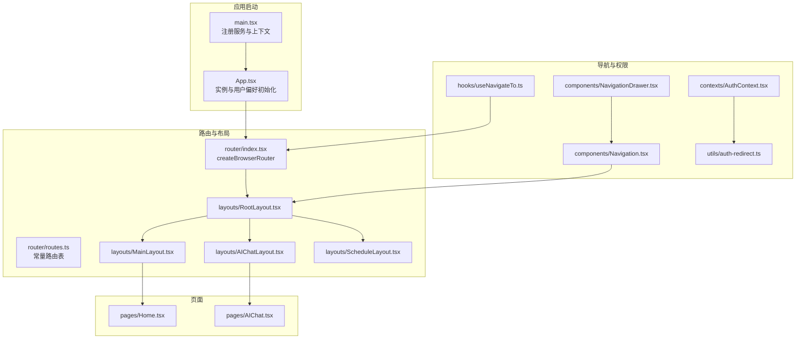
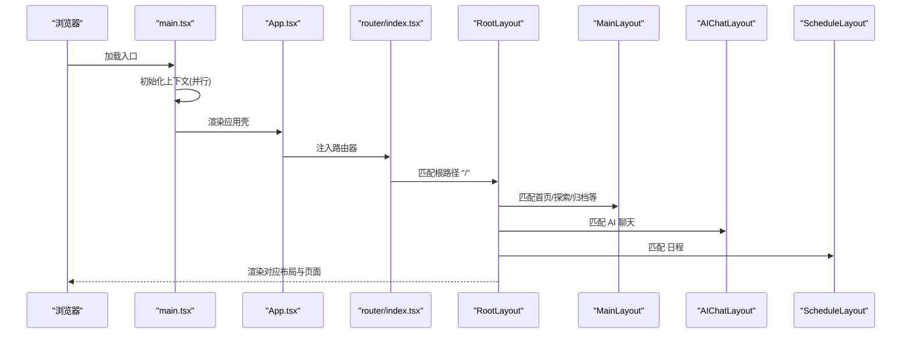
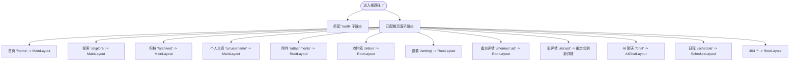
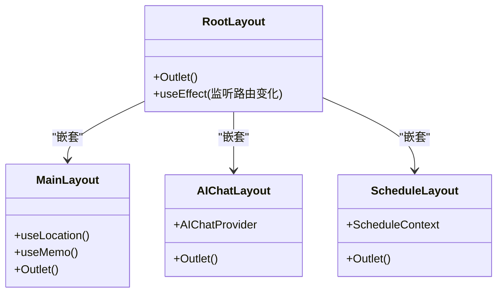
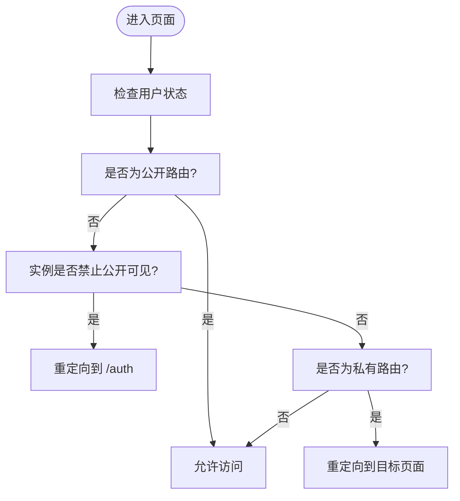
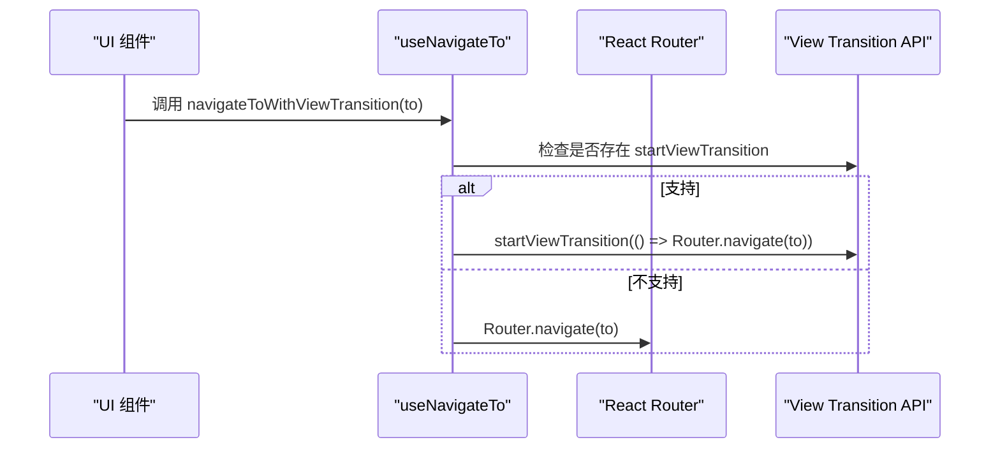
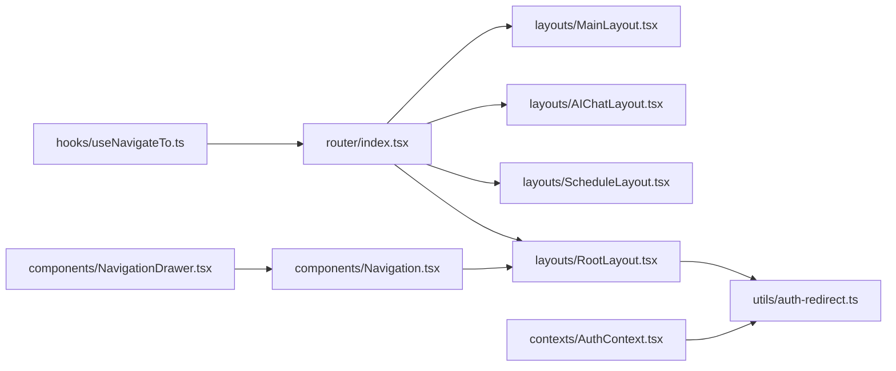

# 路由与导航系统

<cite>
**本文引用的文件**
- [web/src/router/index.tsx](file://web/src/router/index.tsx)
- [web/src/router/routes.ts](file://web/src/router/routes.ts)
- [web/src/main.tsx](file://web/src/main.tsx)
- [web/src/App.tsx](file://web/src/App.tsx)
- [web/src/layouts/MainLayout.tsx](file://web/src/layouts/MainLayout.tsx)
- [web/src/layouts/AIChatLayout.tsx](file://web/src/layouts/AIChatLayout.tsx)
- [web/src/layouts/ScheduleLayout.tsx](file://web/src/layouts/ScheduleLayout.tsx)
- [web/src/layouts/RootLayout.tsx](file://web/src/layouts/RootLayout.tsx)
- [web/src/components/Navigation.tsx](file://web/src/components/Navigation.tsx)
- [web/src/components/NavigationDrawer.tsx](file://web/src/components/NavigationDrawer.tsx)
- [web/src/hooks/useNavigateTo.ts](file://web/src/hooks/useNavigateTo.ts)
- [web/src/contexts/AuthContext.tsx](file://web/src/contexts/AuthContext.tsx)
- [web/src/utils/auth-redirect.ts](file://web/src/utils/auth-redirect.ts)
- [web/src/pages/Home.tsx](file://web/src/pages/Home.tsx)
- [web/src/pages/AIChat.tsx](file://web/src/pages/AIChat.tsx)
</cite>

## 目录
1. [简介](#简介)
2. [项目结构](#项目结构)
3. [核心组件](#核心组件)
4. [架构总览](#架构总览)
5. [详细组件分析](#详细组件分析)
6. [依赖关系分析](#依赖关系分析)
7. [性能考量](#性能考量)
8. [故障排查指南](#故障排查指南)
9. [结论](#结论)

## 简介
本文件系统性梳理前端路由与导航体系，覆盖以下主题：
- React Router 配置与使用模式：路由定义、参数传递、嵌套路由与布局切换
- 页面布局系统：主布局、AI 聊天布局、日程布局的组织与切换机制
- 导航守卫与权限控制：基于实例设置与用户状态的访问控制
- 动态路由与重定向：旧路径到新路径的迁移与兜底处理
- 程序化导航与浏览器历史：视图过渡、浏览器前进后退行为
- 性能优化：路由懒加载、Suspense 预留、初始化并行化与缓存预热

## 项目结构
前端路由与导航相关的关键目录与文件：
- 路由定义与入口：web/src/router/index.tsx、web/src/router/routes.ts
- 应用启动与上下文：web/src/main.tsx、web/src/App.tsx
- 布局层：web/src/layouts/*.tsx（MainLayout、AIChatLayout、ScheduleLayout、RootLayout）
- 导航组件：web/src/components/Navigation.tsx、web/src/components/NavigationDrawer.tsx
- 权限与导航工具：web/src/contexts/AuthContext.tsx、web/src/utils/auth-redirect.ts、web/src/hooks/useNavigateTo.ts
- 页面示例：web/src/pages/Home.tsx、web/src/pages/AIChat.tsx

图表来源
- [web/src/main.tsx](file://web/src/main.tsx#L1-L81)
- [web/src/App.tsx](file://web/src/App.tsx#L1-L92)
- [web/src/router/index.tsx](file://web/src/router/index.tsx#L1-L115)
- [web/src/router/routes.ts](file://web/src/router/routes.ts#L1-L16)
- [web/src/layouts/RootLayout.tsx](file://web/src/layouts/RootLayout.tsx#L1-L67)
- [web/src/layouts/MainLayout.tsx](file://web/src/layouts/MainLayout.tsx#L1-L92)
- [web/src/layouts/AIChatLayout.tsx](file://web/src/layouts/AIChatLayout.tsx#L1-L85)
- [web/src/layouts/ScheduleLayout.tsx](file://web/src/layouts/ScheduleLayout.tsx#L1-L63)
- [web/src/components/Navigation.tsx](file://web/src/components/Navigation.tsx#L1-L142)
- [web/src/components/NavigationDrawer.tsx](file://web/src/components/NavigationDrawer.tsx#L1-L36)
- [web/src/contexts/AuthContext.tsx](file://web/src/contexts/AuthContext.tsx#L1-L157)
- [web/src/utils/auth-redirect.ts](file://web/src/utils/auth-redirect.ts#L1-L37)
- [web/src/hooks/useNavigateTo.ts](file://web/src/hooks/useNavigateTo.ts#L1-L21)
- [web/src/pages/Home.tsx](file://web/src/pages/Home.tsx#L1-L40)
- [web/src/pages/AIChat.tsx](file://web/src/pages/AIChat.tsx#L1-L519)

章节来源
- [web/src/router/index.tsx](file://web/src/router/index.tsx#L1-L115)
- [web/src/router/routes.ts](file://web/src/router/routes.ts#L1-L16)
- [web/src/main.tsx](file://web/src/main.tsx#L1-L81)
- [web/src/App.tsx](file://web/src/App.tsx#L1-L92)

## 核心组件
- 路由器与路由表
  - 使用 createBrowserRouter 定义根路径 "/"，内部嵌套多级子路由与布局。
  - 路由常量集中于 ROUTES，统一管理路径字符串，避免硬编码。
- 布局系统
  - RootLayout：全局导航与主内容区骨架，负责移动端抽屉、过滤器清理与公共导航。
  - MainLayout：主内容区的通用布局，按当前路由决定上下文（首页、探索、归档、个人主页），并提供侧边“MemoExplorer”。
  - AIChatLayout：AI 聊天专用布局，提供侧边栏与移动端抽屉，支持聊天上下文切换。
  - ScheduleLayout：日程专用布局，提供日历选择与搜索栏，支持日程筛选。
- 导航与权限
  - Navigation/NavigationDrawer：侧边导航与移动端抽屉，根据登录状态显示不同菜单项。
  - AuthContext：认证状态与用户设置的上下文，提供初始化、登出与设置刷新。
  - auth-redirect：在不允许公开可见时进行访问控制与重定向。
  - useNavigateTo：封装带视图过渡的程序化导航钩子。

章节来源
- [web/src/router/index.tsx](file://web/src/router/index.tsx#L51-L112)
- [web/src/router/routes.ts](file://web/src/router/routes.ts#L1-L16)
- [web/src/layouts/RootLayout.tsx](file://web/src/layouts/RootLayout.tsx#L14-L66)
- [web/src/layouts/MainLayout.tsx](file://web/src/layouts/MainLayout.tsx#L13-L91)
- [web/src/layouts/AIChatLayout.tsx](file://web/src/layouts/AIChatLayout.tsx#L24-L84)
- [web/src/layouts/ScheduleLayout.tsx](file://web/src/layouts/ScheduleLayout.tsx#L25-L62)
- [web/src/components/Navigation.tsx](file://web/src/components/Navigation.tsx#L25-L141)
- [web/src/components/NavigationDrawer.tsx](file://web/src/components/NavigationDrawer.tsx#L8-L35)
- [web/src/contexts/AuthContext.tsx](file://web/src/contexts/AuthContext.tsx#L26-L157)
- [web/src/utils/auth-redirect.ts](file://web/src/utils/auth-redirect.ts#L21-L36)
- [web/src/hooks/useNavigateTo.ts](file://web/src/hooks/useNavigateTo.ts#L3-L20)

## 架构总览
React Router 采用“根布局 + 多个子布局”的嵌套路由设计，结合 Suspense 实现懒加载与占位渲染；导航组件贯穿全局，配合权限上下文实现访问控制与用户体验一致性。

图表来源
- [web/src/main.tsx](file://web/src/main.tsx#L57-L76)
- [web/src/App.tsx](file://web/src/App.tsx#L29-L89)
- [web/src/router/index.tsx](file://web/src/router/index.tsx#L51-L112)
- [web/src/layouts/RootLayout.tsx](file://web/src/layouts/RootLayout.tsx#L37-L63)
- [web/src/layouts/MainLayout.tsx](file://web/src/layouts/MainLayout.tsx#L70-L88)
- [web/src/layouts/AIChatLayout.tsx](file://web/src/layouts/AIChatLayout.tsx#L76-L82)
- [web/src/layouts/ScheduleLayout.tsx](file://web/src/layouts/ScheduleLayout.tsx#L25-L59)

## 详细组件分析

### 路由定义与嵌套路由
- 根路径 "/" 下包含两层嵌套：
  - 认证相关路由（/auth）：登录、管理员登录、注册、回调等。
  - 根页面路由（/）：包含首页、探索、归档、个人主页、附件、收件箱、设置、AI 聊天、日程、附件、收件箱、设置、备忘详情等。
- 布局嵌套：
  - RootLayout 作为根布局容器，内部再嵌套 MainLayout、AIChatLayout、ScheduleLayout 等。
  - AIChat 与 Schedule 通过自定义 Provider 包裹，注入上下文以支持功能特性。
- 参数与重定向：
  - 用户主页路径形如 "/u/:username"，日程详情路径形如 "/schedule"。
  - 提供旧路径到新路径的重定向（例如从 "/m/:uid" 到新的详情页）。

图表来源
- [web/src/router/index.tsx](file://web/src/router/index.tsx#L51-L112)
- [web/src/router/routes.ts](file://web/src/router/routes.ts#L1-L16)

章节来源
- [web/src/router/index.tsx](file://web/src/router/index.tsx#L51-L112)
- [web/src/router/routes.ts](file://web/src/router/routes.ts#L1-L16)

### 页面布局系统与切换机制
- MainLayout
  - 基于当前路径判断上下文（首页、探索、归档、个人主页），并根据媒体查询在移动端与桌面端切换侧边栏展示方式。
  - 在个人主页场景下，通过路由参数解析用户名并拉取用户信息，用于统计与展示。
- AIChatLayout
  - 提供移动端抽屉与桌面端固定侧边栏，统一聊天入口与能力面板。
  - 通过 AIChatProvider 注入聊天上下文，支持消息流式更新与能力切换。
- ScheduleLayout
  - 提供移动端顶部搜索栏与桌面端日历侧边栏，支持日程筛选与锚点日期计算。
- RootLayout
  - 全局导航与主内容区骨架，负责在路由变化时清理过滤器、处理移动端导航抽屉与键盘快捷键帮助。

图表来源
- [web/src/layouts/RootLayout.tsx](file://web/src/layouts/RootLayout.tsx#L14-L66)
- [web/src/layouts/MainLayout.tsx](file://web/src/layouts/MainLayout.tsx#L13-L91)
- [web/src/layouts/AIChatLayout.tsx](file://web/src/layouts/AIChatLayout.tsx#L24-L84)
- [web/src/layouts/ScheduleLayout.tsx](file://web/src/layouts/ScheduleLayout.tsx#L25-L62)

章节来源
- [web/src/layouts/MainLayout.tsx](file://web/src/layouts/MainLayout.tsx#L13-L91)
- [web/src/layouts/AIChatLayout.tsx](file://web/src/layouts/AIChatLayout.tsx#L24-L84)
- [web/src/layouts/ScheduleLayout.tsx](file://web/src/layouts/ScheduleLayout.tsx#L25-L62)
- [web/src/layouts/RootLayout.tsx](file://web/src/layouts/RootLayout.tsx#L14-L66)

### 导航守卫与路由权限控制
- 访问控制策略
  - 当实例禁止公开可见时，对非公开路由（如根、附件、收件箱、归档、设置）进行强制登录重定向。
  - 对探索页与公开用户主页允许未登录访问。
- 实现机制
  - RootLayout 在路由变化时检查用户状态与实例设置，必要时调用重定向逻辑。
  - App.tsx 在应用初始化阶段检测是否已存在实例所有者，若无则重定向至注册页。
  - AuthContext 提供认证初始化、登出与设置刷新，支撑权限判断与 UI 行为。

图表来源
- [web/src/utils/auth-redirect.ts](file://web/src/utils/auth-redirect.ts#L21-L36)
- [web/src/layouts/RootLayout.tsx](file://web/src/layouts/RootLayout.tsx#L24-L28)
- [web/src/App.tsx](file://web/src/App.tsx#L43-L47)

章节来源
- [web/src/utils/auth-redirect.ts](file://web/src/utils/auth-redirect.ts#L1-L37)
- [web/src/layouts/RootLayout.tsx](file://web/src/layouts/RootLayout.tsx#L24-L35)
- [web/src/App.tsx](file://web/src/App.tsx#L43-L47)
- [web/src/contexts/AuthContext.tsx](file://web/src/contexts/AuthContext.tsx#L53-L95)

### 动态路由与重定向
- 动态参数
  - 用户主页："/u/:username"
  - 备忘详情："/memos/:uid"
- 重定向
  - 旧详情路径 "/m/:uid" 自动重定向到新的详情页。
- 路由懒加载
  - 所有页面组件通过 React.lazy 与 Suspense 包裹，减少首屏体积与提升加载体验。

章节来源
- [web/src/router/index.tsx](file://web/src/router/index.tsx#L15-L30)
- [web/src/router/index.tsx](file://web/src/router/index.tsx#L104-L104)

### 程序化导航与浏览器历史管理
- 视图过渡导航
  - useNavigateTo 封装了带视图过渡的导航函数，优先使用浏览器的 View Transition API，否则回退到普通导航。
- 浏览器历史
  - React Router 默认维护浏览器历史栈，支持前进/后退。
- 导航组件
  - Navigation 与 NavigationDrawer 提供可点击的导航入口，支持移动端抽屉与 Tooltip 提示。

图表来源
- [web/src/hooks/useNavigateTo.ts](file://web/src/hooks/useNavigateTo.ts#L6-L15)
- [web/src/components/Navigation.tsx](file://web/src/components/Navigation.tsx#L98-L112)

章节来源
- [web/src/hooks/useNavigateTo.ts](file://web/src/hooks/useNavigateTo.ts#L1-L21)
- [web/src/components/Navigation.tsx](file://web/src/components/Navigation.tsx#L98-L112)

### 路由懒加载、预加载策略与性能优化
- 懒加载
  - 页面组件统一使用 React.lazy 与 Suspense 包裹，减少初始包体。
- 预加载
  - RootLayout 在路由变化时使用 Suspense 提供骨架屏占位，避免白屏。
  - App.tsx 在应用初始化阶段并行初始化认证与实例上下文，缩短首屏等待时间。
- 缓存与查询客户端
  - main.tsx 引入 QueryClientProvider，结合 AuthContext 的设置预填充，减少重复请求。
- 优化建议
  - 对高频访问页面（如首页、探索、AI 聊天）可考虑在 RootLayout 中增加轻量预取逻辑。
  - 对大组件（如 AIChat）可拆分更细的子模块，按需懒加载。

章节来源
- [web/src/router/index.tsx](file://web/src/router/index.tsx#L15-L30)
- [web/src/router/index.tsx](file://web/src/router/index.tsx#L39-L49)
- [web/src/main.tsx](file://web/src/main.tsx#L35-L44)
- [web/src/main.tsx](file://web/src/main.tsx#L60-L73)
- [web/src/contexts/AuthContext.tsx](file://web/src/contexts/AuthContext.tsx#L76-L82)

## 依赖关系分析
- 路由与布局
  - router/index.tsx 依赖各布局组件与页面组件，形成“根布局 -> 子布局 -> 页面”的依赖链。
- 导航与权限
  - Navigation/NavigationDrawer 依赖路由常量与用户状态；RootLayout 依赖实例设置与过滤器上下文；AuthContext 为权限判断提供数据源。
- 程序化导航
  - useNavigateTo 依赖 React Router 的 useNavigate，并与 View Transition API 协作。

图表来源
- [web/src/router/index.tsx](file://web/src/router/index.tsx#L51-L112)
- [web/src/layouts/MainLayout.tsx](file://web/src/layouts/MainLayout.tsx#L1-L92)
- [web/src/layouts/AIChatLayout.tsx](file://web/src/layouts/AIChatLayout.tsx#L1-L85)
- [web/src/layouts/ScheduleLayout.tsx](file://web/src/layouts/ScheduleLayout.tsx#L1-L63)
- [web/src/layouts/RootLayout.tsx](file://web/src/layouts/RootLayout.tsx#L1-L67)
- [web/src/components/Navigation.tsx](file://web/src/components/Navigation.tsx#L1-L142)
- [web/src/components/NavigationDrawer.tsx](file://web/src/components/NavigationDrawer.tsx#L1-L36)
- [web/src/contexts/AuthContext.tsx](file://web/src/contexts/AuthContext.tsx#L1-L157)
- [web/src/utils/auth-redirect.ts](file://web/src/utils/auth-redirect.ts#L1-L37)
- [web/src/hooks/useNavigateTo.ts](file://web/src/hooks/useNavigateTo.ts#L1-L21)

章节来源
- [web/src/router/index.tsx](file://web/src/router/index.tsx#L51-L112)
- [web/src/components/Navigation.tsx](file://web/src/components/Navigation.tsx#L1-L142)
- [web/src/components/NavigationDrawer.tsx](file://web/src/components/NavigationDrawer.tsx#L1-L36)
- [web/src/contexts/AuthContext.tsx](file://web/src/contexts/AuthContext.tsx#L1-L157)
- [web/src/utils/auth-redirect.ts](file://web/src/utils/auth-redirect.ts#L1-L37)
- [web/src/hooks/useNavigateTo.ts](file://web/src/hooks/useNavigateTo.ts#L1-L21)

## 性能考量
- 并行初始化：main.tsx 在应用启动阶段并行初始化认证与实例上下文，降低首屏阻塞。
- 懒加载与骨架屏：路由层统一使用 Suspense 提供加载占位，改善感知性能。
- 查询缓存：AuthContext 初始化时预填充用户与设置的查询缓存，减少二次请求。
- 布局切换：MainLayout/ScheduleLayout/AIChatLayout 根据媒体查询切换侧边栏展示，兼顾移动端与桌面端体验。
- 可选优化：对热门页面增加预取或预连接策略，进一步缩短交互延迟。

章节来源
- [web/src/main.tsx](file://web/src/main.tsx#L35-L44)
- [web/src/router/index.tsx](file://web/src/router/index.tsx#L39-L49)
- [web/src/contexts/AuthContext.tsx](file://web/src/contexts/AuthContext.tsx#L76-L82)
- [web/src/layouts/MainLayout.tsx](file://web/src/layouts/MainLayout.tsx#L70-L88)
- [web/src/layouts/ScheduleLayout.tsx](file://web/src/layouts/ScheduleLayout.tsx#L35-L59)
- [web/src/layouts/AIChatLayout.tsx](file://web/src/layouts/AIChatLayout.tsx#L31-L72)

## 故障排查指南
- 登录态异常导致无法访问受保护页面
  - 检查 AuthContext.initialize 是否成功设置 currentUser；若失败会清空令牌并重置状态。
  - 确认实例设置中的“禁止公开可见”开关是否启用。
- 首次进入无实例所有者
  - App.tsx 会在检测到无实例所有者时重定向到注册页，请确认实例初始化流程。
- 移动端导航抽屉不关闭
  - NavigationDrawer 在路由 key 变化时会自动关闭抽屉，检查路由跳转是否触发 key 更新。
- 路由懒加载白屏时间过长
  - 检查 Suspense 占位组件是否正确渲染；适当优化大组件拆分与资源体积。
- 程序化导航无过渡效果
  - useNavigateTo 仅在浏览器支持 View Transition API 时启用过渡，否则回退为普通导航。

章节来源
- [web/src/contexts/AuthContext.tsx](file://web/src/contexts/AuthContext.tsx#L53-L95)
- [web/src/App.tsx](file://web/src/App.tsx#L43-L47)
- [web/src/components/NavigationDrawer.tsx](file://web/src/components/NavigationDrawer.tsx#L14-L16)
- [web/src/router/index.tsx](file://web/src/router/index.tsx#L39-L49)
- [web/src/hooks/useNavigateTo.ts](file://web/src/hooks/useNavigateTo.ts#L6-L15)

## 结论
该路由与导航系统通过清晰的嵌套路由与布局划分，实现了主内容区、AI 聊天与日程三大场景的独立扩展；结合权限守卫与程序化导航，既保证了安全性也提升了用户体验。通过懒加载、Suspense 占位与并行初始化等手段，系统在性能上具备良好表现。后续可在热门页面引入预取策略与更细粒度的懒加载拆分，持续优化首屏与交互体验。