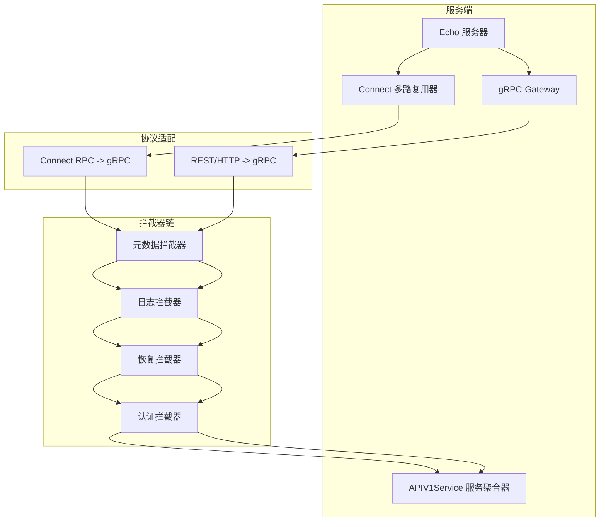
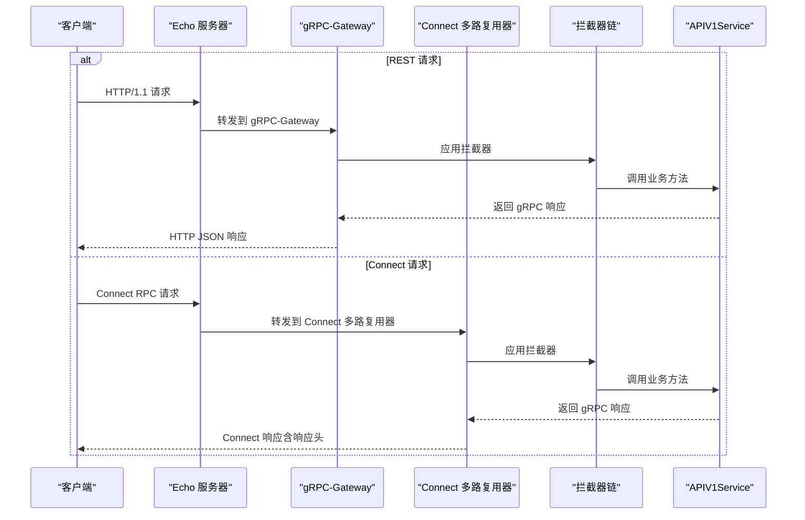
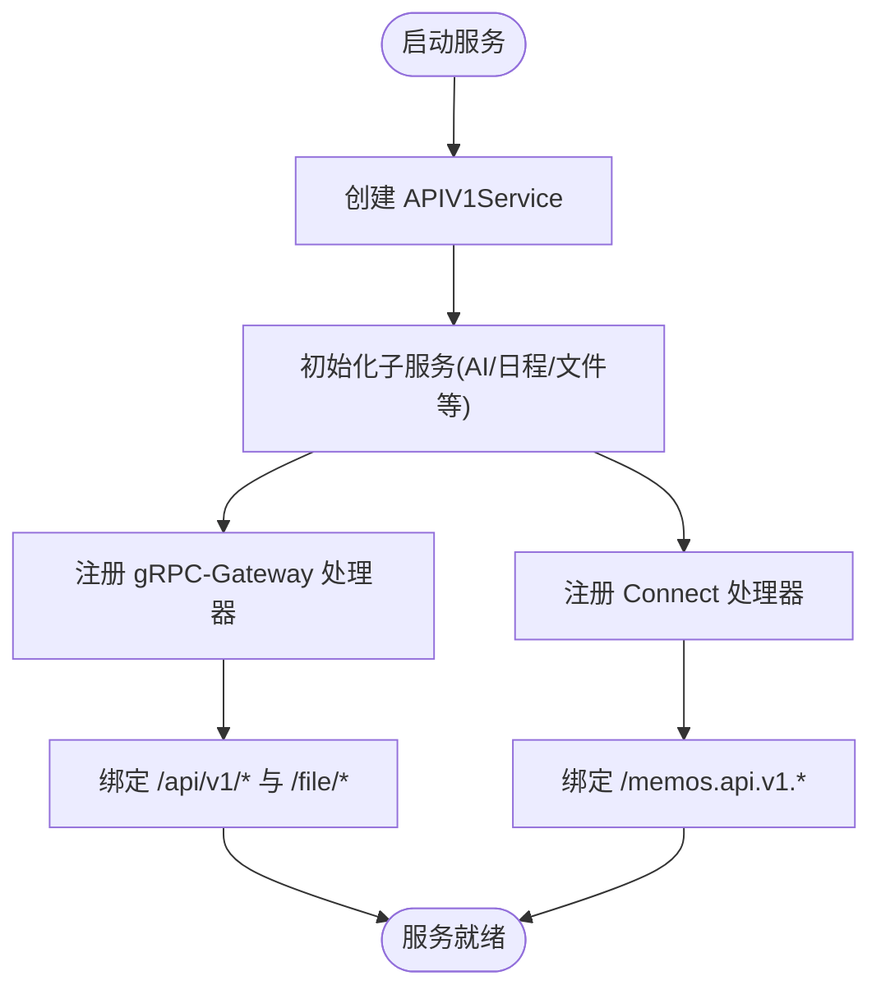
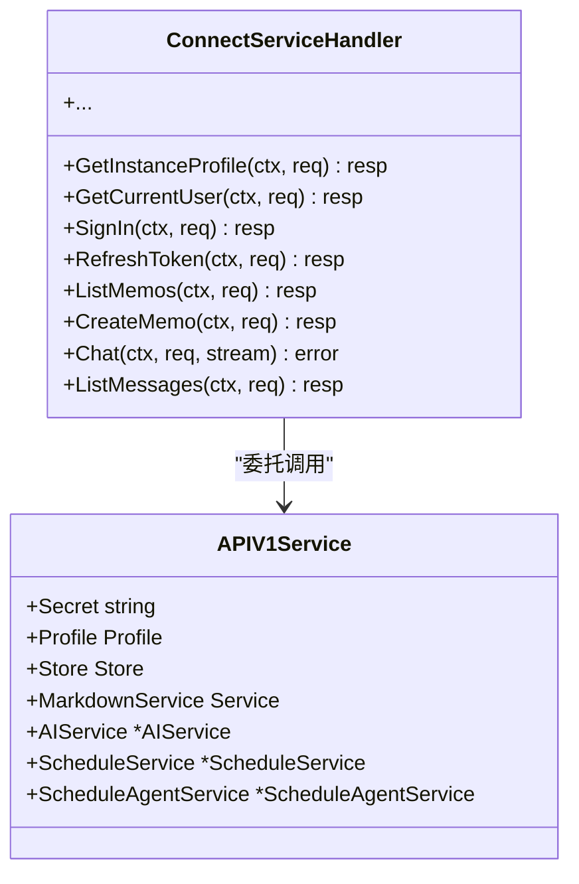
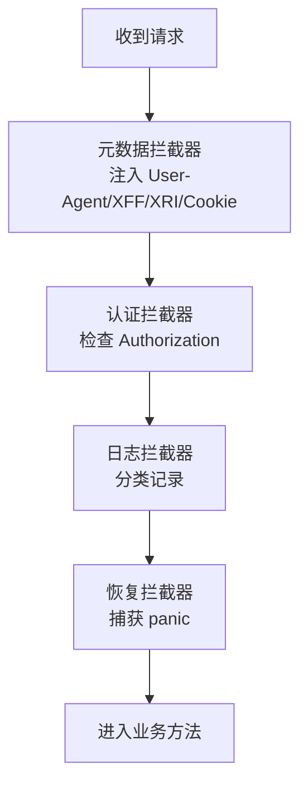
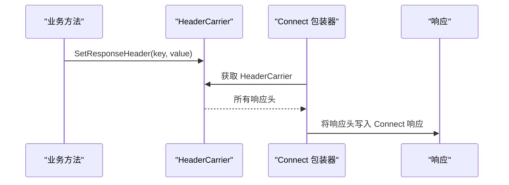
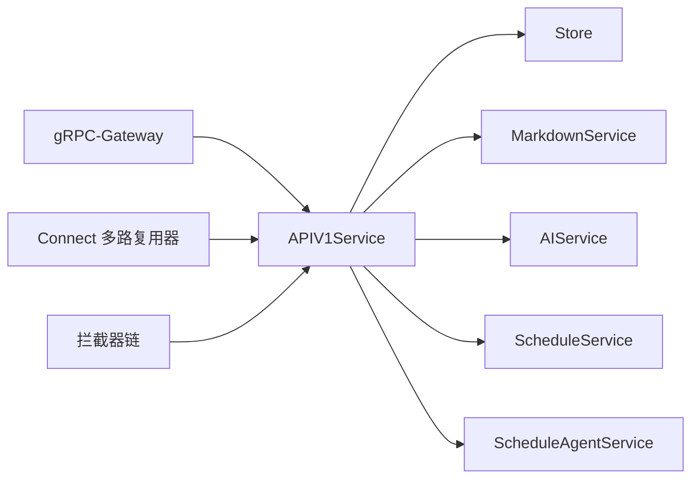

# API 服务层设计

<cite>
**本文档引用的文件**
- [server.go](file://server/server.go)
- [v1.go](file://server/router/api/v1/v1.go)
- [connect_handler.go](file://server/router/api/v1/connect_handler.go)
- [connect_services.go](file://server/router/api/v1/connect_services.go)
- [connect_interceptors.go](file://server/router/api/v1/connect_interceptors.go)
- [header_carrier.go](file://server/router/api/v1/header_carrier.go)
- [common.go](file://server/router/api/v1/common.go)
- [ai_service.proto](file://proto/api/v1/ai_service.proto)
- [memo_service.proto](file://proto/api/v1/memo_service.proto)
- [version.go](file://internal/version/version.go)
</cite>

## 目录
1. [引言](#引言)
2. [项目结构](#项目结构)
3. [核心组件](#核心组件)
4. [架构总览](#架构总览)
5. [详细组件分析](#详细组件分析)
6. [依赖关系分析](#依赖关系分析)
7. [性能考虑](#性能考虑)
8. [故障排除指南](#故障排除指南)
9. [结论](#结论)
10. [附录](#附录)

## 引言
本文件系统化梳理了基于 Connect RPC、gRPC-Gateway 与 RESTful API 的统一服务层设计。该设计通过协议适配与拦截器机制，实现了同一套业务逻辑在多种客户端协议下的无缝运行，既支持浏览器直连的 Connect RPC，也兼容传统 REST 请求经由 gRPC-Gateway 的转换。文档将详细说明服务注册流程、路由映射规则、版本管理策略与向后兼容性保障，并提供接口设计原则、最佳实践、实现示例与集成指南，以及性能优化建议与监控指标说明。

## 项目结构
API 服务层位于 server/router/api/v1 目录，核心文件包括：
- v1.go：APIV1Service 服务聚合器与 gRPC-Gateway 注册入口
- connect_handler.go：ConnectServiceHandler 包装器与拦截器装配
- connect_services.go：各服务的 Connect 方法实现与 gRPC 适配
- connect_interceptors.go：元数据、认证、日志与恢复拦截器
- header_carrier.go：响应头设置的协议无关载体
- common.go：分页、状态转换等通用工具
- proto 文件：定义 REST 映射与服务契约

图表来源
- [server.go](file://server/server.go#L70-L86)
- [v1.go](file://server/router/api/v1/v1.go#L120-L237)
- [connect_handler.go](file://server/router/api/v1/connect_handler.go#L36-L69)

章节来源
- [server.go](file://server/server.go#L70-L86)
- [v1.go](file://server/router/api/v1/v1.go#L120-L237)

## 核心组件
- APIV1Service：统一的服务聚合器，负责初始化业务子服务（如 AI、日程、文件等），并注册 gRPC-Gateway 与 Connect 处理器。
- ConnectServiceHandler：将 gRPC 服务方法包装为 Connect RPC 可用的处理器，实现类型转换与错误码映射。
- 拦截器体系：元数据转换、日志分级、恢复保护、认证授权，贯穿所有请求生命周期。
- HeaderCarrier：在 Connect 与 gRPC 之间提供一致的响应头设置能力，解决协议差异导致的头部设置问题。
- 通用工具：分页令牌编解码、状态枚举转换、超级用户判定等。

章节来源
- [v1.go](file://server/router/api/v1/v1.go#L23-L118)
- [connect_handler.go](file://server/router/api/v1/connect_handler.go#L19-L34)
- [connect_interceptors.go](file://server/router/api/v1/connect_interceptors.go#L19-L274)
- [header_carrier.go](file://server/router/api/v1/header_carrier.go#L11-L86)
- [common.go](file://server/router/api/v1/common.go#L13-L68)

## 架构总览
统一服务层通过以下机制实现多协议支持：
- RESTful API：通过 proto 中的 google.api.http 注解，由 gRPC-Gateway 将 HTTP 请求映射到对应的 gRPC 方法。
- Connect RPC：通过 ConnectServiceHandler 将 gRPC 方法包装为 Connect 可用的处理器，支持流式与非流式调用。
- 协议无关的响应头：HeaderCarrier 在 Connect 场景下收集响应头，随后由 Connect 包装器应用到响应中。
- 拦截器链：在进入业务方法前完成元数据注入、认证校验、日志记录与异常恢复，确保一致的横切行为。

图表来源
- [v1.go](file://server/router/api/v1/v1.go#L120-L237)
- [connect_handler.go](file://server/router/api/v1/connect_handler.go#L36-L69)
- [connect_interceptors.go](file://server/router/api/v1/connect_interceptors.go#L31-L67)

## 详细组件分析

### 服务注册与路由映射
- gRPC-Gateway 注册：在 APIV1Service 中，按服务维度逐一注册 HandlerServer，并在 Echo Group 下挂载通配路由，实现 /api/v1/* 与 /file/* 的统一转发。
- Connect 处理器注册：ConnectServiceHandler 将每个服务的处理器路径与处理器对象收集，统一注册到 http.ServeMux，再由 Echo Group 挂载到 /memos.api.v1.*。
- REST 映射：proto 文件中通过 google.api.http 注解声明 HTTP 方法、路径与请求体字段映射，gRPC-Gateway 自动解析并生成 REST 接口。

图表来源
- [v1.go](file://server/router/api/v1/v1.go#L120-L237)
- [connect_handler.go](file://server/router/api/v1/connect_handler.go#L36-L69)

章节来源
- [v1.go](file://server/router/api/v1/v1.go#L120-L237)
- [connect_handler.go](file://server/router/api/v1/connect_handler.go#L36-L69)

### Connect 适配与错误码转换
- ConnectServiceHandler：将 gRPC 服务方法包装为 Connect 可用的处理器，自动进行请求/响应类型转换与错误码映射。
- convertGRPCError：将 gRPC 状态码转换为 Connect 错误码，保持跨协议的一致性语义。
- HeaderCarrier：在 Connect 场景下收集响应头，Connect 包装器将其应用到最终响应中；在 gRPC 场景下直接使用 grpc.SetHeader。

图表来源
- [connect_services.go](file://server/router/api/v1/connect_services.go#L16-L491)
- [connect_handler.go](file://server/router/api/v1/connect_handler.go#L19-L34)

章节来源
- [connect_services.go](file://server/router/api/v1/connect_services.go#L16-L491)
- [connect_handler.go](file://server/router/api/v1/connect_handler.go#L82-L99)
- [header_carrier.go](file://server/router/api/v1/header_carrier.go#L67-L86)

### 拦截器链与中间件
- 元数据拦截器：将 HTTP 请求头转换为 gRPC 元数据，便于服务层使用 metadata.FromIncomingContext 获取客户端信息。
- 认证拦截器：根据方法是否为公开方法强制鉴权，支持基于 Claims 的无状态访问与 PAT 的有状态访问两种模式。
- 日志拦截器：按错误类型分类日志级别，区分客户端错误与服务端错误，便于运维定位。
- 恢复拦截器：捕获 panic 并返回内部错误，避免服务崩溃。

图表来源
- [connect_interceptors.go](file://server/router/api/v1/connect_interceptors.go#L19-L274)

章节来源
- [connect_interceptors.go](file://server/router/api/v1/connect_interceptors.go#L19-L274)

### 响应头设置的协议无关性
- HeaderCarrier：在 Connect 场景下收集响应头，Connect 包装器将其应用到响应头；在 gRPC 场景下直接使用 grpc.SetHeader。
- connectWithHeaderCarrier：Connect 包装器的辅助函数，在调用业务方法前后自动注入/提取 HeaderCarrier 并应用响应头。

图表来源
- [header_carrier.go](file://server/router/api/v1/header_carrier.go#L67-L124)

章节来源
- [header_carrier.go](file://server/router/api/v1/header_carrier.go#L67-L124)

### REST 映射与资源命名
- REST 映射：proto 中通过 google.api.http 注解声明 HTTP 方法、路径与请求体字段映射，例如 /api/v1/memos、/api/v1/{name=memos/*}/attachments 等。
- 资源命名：Memo、Reaction 等资源类型采用统一的资源命名规范，便于 REST 与 gRPC 的一致性表达。

章节来源
- [memo_service.proto](file://proto/api/v1/memo_service.proto#L17-L106)
- [ai_service.proto](file://proto/api/v1/ai_service.proto#L14-L110)

### 版本管理与向后兼容
- 版本号：服务当前版本与开发版本通过 internal/version/version.go 管理，支持按模式返回对应版本字符串。
- 小版本提取：提供小版本号提取函数，用于兼容性判断与特性开关控制。
- 语义化版本比较：提供版本比较工具，用于新旧功能的渐进式启用与回滚。

章节来源
- [version.go](file://internal/version/version.go#L10-L60)

## 依赖关系分析
- 服务聚合器依赖：APIV1Service 聚合 Store、Markdown、AI、日程等子服务，形成统一的业务入口。
- 协议适配依赖：ConnectServiceHandler 依赖 APIV1Service 的具体实现，gRPC-Gateway 依赖 proto 定义的 HTTP 映射。
- 横切关注点：拦截器链独立于业务逻辑，通过 WrapUnary/WrapStreaming 组合，确保一致的横切行为。

图表来源
- [v1.go](file://server/router/api/v1/v1.go#L23-L118)
- [connect_handler.go](file://server/router/api/v1/connect_handler.go#L36-L69)

章节来源
- [v1.go](file://server/router/api/v1/v1.go#L23-L118)
- [connect_handler.go](file://server/router/api/v1/connect_handler.go#L36-L69)

## 性能考虑
- 连接与监听：服务直接使用 Echo 作为 HTTP 服务器，无需 cmux，简化流量分流，减少连接开销。
- 并发控制：在 APIV1Service 初始化时限制缩略图生成的并发数，防止内存与 CPU 泄漏。
- 路由与网关：gRPC-Gateway 与 Connect 处理器分别挂载到不同前缀，避免路径冲突，提高路由效率。
- 拦截器顺序：元数据转换在最前，确保后续拦截器与业务方法可立即获取客户端信息；认证拦截器在日志与恢复之前，保证错误分类的准确性。

章节来源
- [server.go](file://server/server.go#L89-L113)
- [v1.go](file://server/router/api/v1/v1.go#L57-L58)
- [connect_interceptors.go](file://server/router/api/v1/connect_interceptors.go#L31-L67)

## 故障排除指南
- 认证失败：检查 Authorization 头是否正确传递，确认方法是否属于公开方法；查看日志拦截器输出的错误分类。
- 响应头未生效：若为 Connect 请求，确认业务方法通过 SetResponseHeader 设置响应头，并由 HeaderCarrier 与 connectWithHeaderCarrier 完成应用。
- gRPC-Gateway 401：确认网关认证中间件是否正确注入，检查 RPC 方法名与公开方法列表的匹配。
- 日志与恢复：开启堆栈跟踪日志以便定位 panic；观察日志拦截器对客户端错误与服务端错误的分级记录。

章节来源
- [connect_interceptors.go](file://server/router/api/v1/connect_interceptors.go#L119-L158)
- [connect_interceptors.go](file://server/router/api/v1/connect_interceptors.go#L170-L199)
- [header_carrier.go](file://server/router/api/v1/header_carrier.go#L88-L124)

## 结论
该 API 服务层通过协议无关的适配器与拦截器链，实现了 Connect RPC、gRPC-Gateway 与 RESTful API 的统一处理。服务注册与路由映射清晰，版本管理与向后兼容策略明确，接口设计遵循 AIP 规范，具备良好的扩展性与可维护性。配合完善的拦截器与响应头机制，能够稳定支撑多协议客户端访问，并为性能优化与可观测性提供坚实基础。

## 附录

### 接口设计原则与最佳实践
- 资源命名与 REST 映射：遵循 AIP-122/AIP-141，使用统一资源命名与 HTTP 映射注解。
- 字段行为与校验：使用 google.api.field_behavior 标注必填/输出字段，结合服务端校验与拦截器增强健壮性。
- 分页与排序：采用 page_token 与 AIP-132 排序语法，确保大规模数据的高效访问。
- 错误码一致性：统一使用 Connect/gRPC 错误码，便于前端与客户端一致处理。

章节来源
- [memo_service.proto](file://proto/api/v1/memo_service.proto#L17-L106)
- [ai_service.proto](file://proto/api/v1/ai_service.proto#L14-L110)
- [common.go](file://server/router/api/v1/common.go#L13-L18)

### 集成指南
- 启动服务：在 server.NewServer 中创建 Echo 服务器并注册 APIV1Service，随后启动后台运行器。
- 注册路由：APIV1Service.RegisterGateway 会自动注册 gRPC-Gateway 与 Connect 处理器，并挂载到指定前缀。
- 客户端接入：
  - REST：直接调用 /api/v1/* 路径，遵循 proto 中的 HTTP 映射。
  - Connect：通过 /memos.api.v1.* 路径发起 Connect RPC 请求，自动应用拦截器链。

章节来源
- [server.go](file://server/server.go#L70-L86)
- [v1.go](file://server/router/api/v1/v1.go#L120-L237)